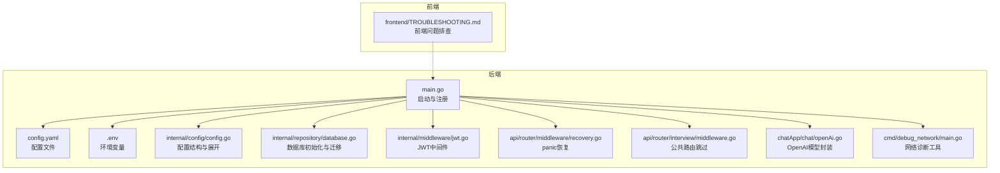
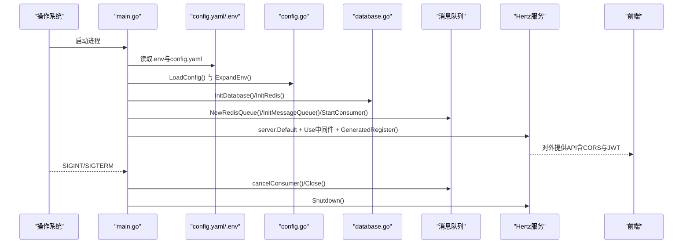
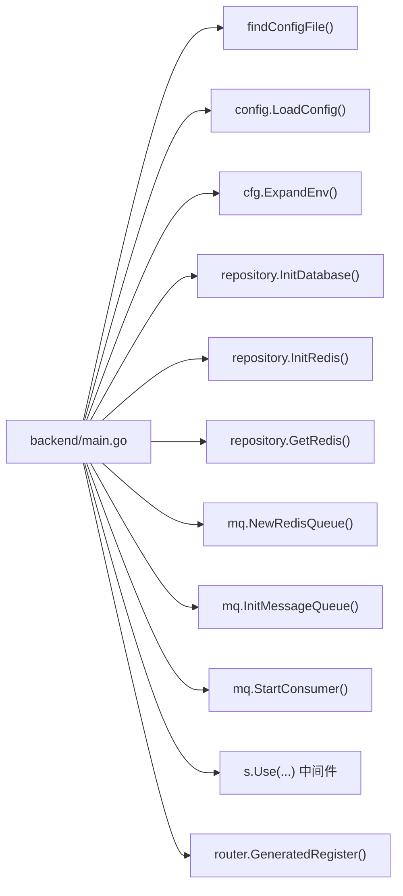

# 故障排除与调试

<cite>
**本文引用的文件**
- [backend/main.go](file://backend/main.go)
- [backend/config.yaml](file://backend/config.yaml)
- [backend/.env](file://backend/.env)
- [backend/internal/config/config.go](file://backend/internal/config/config.go)
- [backend/internal/repository/database.go](file://backend/internal/repository/database.go)
- [backend/internal/middleware/jwt.go](file://backend/internal/middleware/jwt.go)
- [backend/api/router/middleware/recovery.go](file://backend/api/router/middleware/recovery.go)
- [backend/api/router/interview/middleware.go](file://backend/api/router/interview/middleware.go)
- [backend/chatApp/chat/openAi.go](file://backend/chatApp/chat/openAi.go)
- [backend/cmd/debug_network/main.go](file://backend/cmd/debug_network/main.go)
- [backend/chatApp/main.go](file://backend/chatApp/main.go)
- [frontend/TROUBLESHOOTING.md](file://frontend/TROUBLESHOOTING.md)
</cite>

## 目录
1. [简介](#简介)
2. [项目结构](#项目结构)
3. [核心组件](#核心组件)
4. [架构总览](#架构总览)
5. [详细组件分析](#详细组件分析)
6. [依赖关系分析](#依赖关系分析)
7. [性能考虑](#性能考虑)
8. [故障排除指南](#故障排除指南)
9. [结论](#结论)
10. [附录](#附录)

## 简介
本指南面向开发与运维人员，聚焦于本项目在开发与生产环境中常见的故障场景与调试方法，覆盖网络连接、数据库连接、AI模型调用、前端页面加载等问题定位与解决；提供调试工具使用、日志分析、性能问题定位（内存、CPU、数据库查询）、错误日志解读与异常堆栈分析、问题重现步骤、生产环境排查流程与紧急修复方案，并给出开发工具配置与常用调试命令。

## 项目结构
后端基于 Hertz 框架，采用模块化组织：路由注册、中间件（JWT、恢复）、配置加载、数据库与缓存初始化、消息队列与消费者、以及 AI 调用封装。前端提供明确的“后端服务诊断”入口与SSE流式响应处理，便于快速定位404/CORS与鉴权问题。

图表来源
- [backend/main.go](file://backend/main.go#L29-L173)
- [backend/config.yaml](file://backend/config.yaml#L1-L129)
- [backend/.env](file://backend/.env#L1-L16)
- [backend/internal/config/config.go](file://backend/internal/config/config.go#L136-L152)
- [backend/internal/repository/database.go](file://backend/internal/repository/database.go#L18-L60)
- [backend/internal/middleware/jwt.go](file://backend/internal/middleware/jwt.go#L32-L78)
- [backend/api/router/middleware/recovery.go](file://backend/api/router/middleware/recovery.go#L15-L34)
- [backend/api/router/interview/middleware.go](file://backend/api/router/interview/middleware.go#L13-L36)
- [backend/chatApp/chat/openAi.go](file://backend/chatApp/chat/openAi.go#L19-L109)
- [backend/cmd/debug_network/main.go](file://backend/cmd/debug_network/main.go#L30-L81)
- [frontend/TROUBLESHOOTING.md](file://frontend/TROUBLESHOOTING.md#L1-L117)

章节来源
- [backend/main.go](file://backend/main.go#L29-L173)
- [backend/config.yaml](file://backend/config.yaml#L1-L129)
- [frontend/TROUBLESHOOTING.md](file://frontend/TROUBLESHOOTING.md#L1-L117)

## 核心组件
- 配置系统：集中于 YAML 配置与环境变量展开，支持数据库、Redis、Hertz、安全、OpenAI、Embedding、Milvus、文档分割器等模块化配置。
- 中间件体系：JWT 鉴权中间件与全局 panic 恢复中间件，配合公共路由跳过策略。
- 数据层：GORM + MySQL，连接池参数可调，自动迁移。
- 消息队列：基于 Redis 的队列与消费者，支持优雅关闭。
- AI 调用：封装 OpenAI 兼容模型，统一错误分类与日志记录。
- 前端诊断：SSE 流式响应、CORS 与鉴权问题的可视化诊断入口。

章节来源
- [backend/internal/config/config.go](file://backend/internal/config/config.go#L136-L152)
- [backend/internal/middleware/jwt.go](file://backend/internal/middleware/jwt.go#L32-L78)
- [backend/api/router/middleware/recovery.go](file://backend/api/router/middleware/recovery.go#L15-L34)
- [backend/internal/repository/database.go](file://backend/internal/repository/database.go#L18-L60)
- [backend/chatApp/chat/openAi.go](file://backend/chatApp/chat/openAi.go#L19-L109)
- [frontend/TROUBLESHOOTING.md](file://frontend/TROUBLESHOOTING.md#L1-L117)

## 架构总览
后端启动顺序：加载 .env 与 config.yaml → 展开环境变量 → 初始化数据库与 Redis → 初始化消息队列与消费者 → 注册路由与中间件（CORS、JWT、恢复）→ 启动 Hertz 服务 → 监听系统信号优雅关闭。

图表来源
- [backend/main.go](file://backend/main.go#L29-L173)
- [backend/internal/config/config.go](file://backend/internal/config/config.go#L136-L152)
- [backend/internal/repository/database.go](file://backend/internal/repository/database.go#L18-L60)

## 详细组件分析

### 配置加载与环境变量展开
- 配置文件路径查找与加载，支持相对路径与工作目录回退。
- 配置中嵌入的环境变量引用通过正则替换展开，覆盖 Embedding、Milvus、飞书等子配置。
- .env 文件用于 Embedding 与 Milvus 等敏感配置，建议在本地开发时提供。

章节来源
- [backend/main.go](file://backend/main.go#L175-L210)
- [backend/internal/config/config.go](file://backend/internal/config/config.go#L136-L152)
- [backend/internal/config/config.go](file://backend/internal/config/config.go#L212-L268)
- [backend/config.yaml](file://backend/config.yaml#L61-L79)
- [backend/.env](file://backend/.env#L1-L16)

### 数据库初始化与连接池
- GORM 初始化 MySQL，设置日志级别、最大空闲/活跃连接数、连接最大生命周期。
- 自动迁移核心模型表，保证表结构一致性。
- 建议在生产环境调整连接池参数以匹配负载与延迟。

章节来源
- [backend/internal/repository/database.go](file://backend/internal/repository/database.go#L18-L60)

### JWT 鉴权与公共路由跳过
- 支持 Authorization Bearer、X-Auth-Token、Query 参数与 Cookie 多种方式提取 token。
- 提供跳过器，将 OPTIONS 预检与公共路由（如登录、注册、回调等）放行。
- 前端404/CORS问题常由公共路由未配置导致，需在公共路由表中补充对应路径。

章节来源
- [backend/internal/middleware/jwt.go](file://backend/internal/middleware/jwt.go#L32-L78)
- [backend/api/router/interview/middleware.go](file://backend/api/router/interview/middleware.go#L13-L36)
- [frontend/TROUBLESHOOTING.md](file://frontend/TROUBLESHOOTING.md#L44-L62)

### 恢复中间件与异常处理
- 捕获 panic，打印堆栈，返回统一内部错误响应。
- 建议结合结构化日志与追踪系统，提升生产排障效率。

章节来源
- [backend/api/router/middleware/recovery.go](file://backend/api/router/middleware/recovery.go#L15-L34)

### AI 模型调用封装与网络诊断
- 统一封装 OpenAI 兼容模型创建，内置日志记录与错误分类（配额不足、速率限制、上下文超限等）。
- 提供独立的网络诊断工具，模拟请求与响应，便于复现与定位网络层问题（如 EOF）。

章节来源
- [backend/chatApp/chat/openAi.go](file://backend/chatApp/chat/openAi.go#L19-L109)
- [backend/cmd/debug_network/main.go](file://backend/cmd/debug_network/main.go#L30-L81)

### 前端SSE与CORS问题定位
- 前端提供“后端服务诊断”按钮，可快速检测后端连通性与SSE流式响应。
- 常见问题：后端未启动、路由未注册、JWT拦截、CORS头缺失导致404与CORS错误。
- 解决方案：确保公共路由包含面试流式接口；检查后端监听端口；确认浏览器localStorage中存在有效token。

章节来源
- [frontend/TROUBLESHOOTING.md](file://frontend/TROUBLESHOOTING.md#L1-L117)

## 依赖关系分析
后端启动主流程的关键依赖链路如下：

图表来源
- [backend/main.go](file://backend/main.go#L29-L128)

章节来源
- [backend/main.go](file://backend/main.go#L29-L128)

## 性能考虑
- 内存与CPU
  - 引入结构化日志与指标采集，建议参考项目优化建议中的 zap 日志与 Prometheus 指标方案，以便在生产环境进行内存/CPU瓶颈定位。
  - 对高频路径（如路由中间件、模型调用）增加采样与慢调用告警。
- 数据库查询
  - 结合连接池参数与慢查询日志，定位热点SQL与锁等待。
  - 使用 EXPLAIN 分析复杂查询，必要时增加索引或拆分查询。
- 网络与AI模型
  - 使用网络诊断工具复现并记录请求/响应细节，避免长连接与HTTP/2带来的EOF问题。
  - 对模型调用增加超时与重试策略，区分不同错误类型（速率限制、配额不足、上下文超限）。

[本节为通用指导，不直接分析具体文件]

## 故障排除指南

### 一、网络连接问题
- 症状
  - 前端SSE 404/CORS错误；浏览器控制台提示跨域头缺失；后端服务诊断失败。
- 诊断步骤
  - 确认后端服务已启动且监听在配置端口。
  - 检查公共路由是否包含面试流式接口路径（如 /api/interview/start/stream）。
  - 确认浏览器localStorage中存在有效token；若无或过期，先登录。
  - 使用前端“后端服务诊断”按钮查看诊断结果。
- 快速修复
  - 在公共路由表中添加缺失路径并重启后端。
  - 如为CORS问题，先解决404再排查CORS头。
- 参考
  - 前端问题排查文档与路由跳过逻辑。

章节来源
- [frontend/TROUBLESHOOTING.md](file://frontend/TROUBLESHOOTING.md#L1-L117)
- [backend/api/router/interview/middleware.go](file://backend/api/router/interview/middleware.go#L13-L36)

### 二、数据库连接失败
- 症状
  - 启动时报数据库连接错误；或运行中出现连接超时/连接池耗尽。
- 诊断步骤
  - 检查 config.yaml 中 DSN、最大连接数、空闲连接数、连接最大生命周期配置。
  - 确认数据库服务可达（容器/主机），账号密码正确。
  - 观察日志中数据库初始化与迁移过程是否报错。
- 快速修复
  - 调整连接池参数；确保 DSN 正确；检查数据库服务状态。
- 参考
  - 数据库初始化与迁移逻辑。

章节来源
- [backend/internal/repository/database.go](file://backend/internal/repository/database.go#L18-L60)
- [backend/config.yaml](file://backend/config.yaml#L5-L11)

### 三、AI模型调用异常
- 症状
  - 模型创建失败、请求超时、EOF、速率限制、配额不足、上下文超限。
- 诊断步骤
  - 使用网络诊断工具复现问题，观察请求/响应日志与错误类型。
  - 检查用户模型配置（API Key、BaseURL、模型名）与清理不可见字符。
  - 区分错误类型：429/Too Many Requests（速率限制）、401/无效API Key、Empty Choices、Context Length Exceeded。
- 快速修复
  - 更新API Key与BaseURL；缩短输入上下文；降低并发或增加重试间隔。
- 参考
  - 模型封装与错误分类逻辑。

章节来源
- [backend/chatApp/chat/openAi.go](file://backend/chatApp/chat/openAi.go#L19-L109)
- [backend/cmd/debug_network/main.go](file://backend/cmd/debug_network/main.go#L30-L81)

### 四、前端页面加载问题
- 症状
  - 页面空白、SSE流断开、CORS错误、404。
- 诊断步骤
  - 打开浏览器开发者工具，查看Network面板SSE事件流与CORS头。
  - 使用前端“后端服务诊断”按钮，查看后端连通性与请求URL。
  - 确认后端JWT中间件未拦截该路径；确认token有效。
- 快速修复
  - 补充公共路由；更新token；检查后端监听端口。
- 参考
  - 前端问题排查文档与SSE实现细节。

章节来源
- [frontend/TROUBLESHOOTING.md](file://frontend/TROUBLESHOOTING.md#L1-L117)

### 五、调试工具使用指南
- 浏览器开发者工具
  - Network：观察SSE流、CORS头、状态码与响应体。
  - Application：查看localStorage与Cookie中的token。
  - Console：查看前端日志输出，定位请求URL与错误信息。
- Go调试器
  - 使用 Delve 进行断点调试，结合日志定位协程与中间件执行路径。
- 日志分析
  - 后端使用标准库日志，建议引入结构化日志（zap）与指标（Prometheus）以提升可观测性。
  - 生产环境开启更细粒度的日志级别与采样。

章节来源
- [frontend/TROUBLESHOOTING.md](file://frontend/TROUBLESHOOTING.md#L75-L87)

### 六、性能问题定位方法
- 内存泄漏检测
  - 使用 pprof 生成 heap profile，对比不同阶段的分配情况。
- CPU使用率分析
  - 使用 pprof top/trace 定位热点函数与调用栈。
- 数据库查询优化
  - 开启慢查询日志，结合 EXPLAIN 分析热点SQL；必要时加索引或拆分查询。
- 网络与模型调用
  - 使用网络诊断工具复现并记录请求/响应细节；对模型调用增加超时与重试策略。

章节来源
- [backend/chatApp/chat/openAi.go](file://backend/chatApp/chat/openAi.go#L64-L75)

### 七、错误日志解读与异常堆栈分析
- 统一错误码与HTTP状态映射
  - 内部错误、参数错误、未找到、未授权、禁止、数据库错误、Redis错误、Milvus错误、模型错误、校验错误、飞书错误、OpenAI错误、配额不足、速率限制、上下文超限等。
- 堆栈分析
  - panic恢复中间件会打印堆栈，结合业务错误包装定位原始异常来源。
- 前端错误提示
  - 根据HTTP状态与错误码提示用户（如余额不足、稍后重试、输入过长）。

章节来源
- [backend/internal/errors/errors.go](file://backend/internal/errors/errors.go#L12-L29)
- [backend/internal/errors/errors.go](file://backend/internal/errors/errors.go#L74-L151)
- [backend/api/router/middleware/recovery.go](file://backend/api/router/middleware/recovery.go#L15-L34)

### 八、问题重现步骤
- 网络连接问题
  - 启动后端；访问前端页面；点击“后端服务诊断”；观察404/CORS日志。
- 数据库连接失败
  - 修改 config.yaml 中DSN或连接池参数；重启后端；观察初始化日志。
- AI模型调用异常
  - 使用网络诊断工具；准备大payload；观察EOF与错误分类。
- 前端页面加载问题
  - 清理localStorage中的token；刷新页面；确认后端公共路由包含面试流式接口。

章节来源
- [frontend/TROUBLESHOOTING.md](file://frontend/TROUBLESHOOTING.md#L20-L87)
- [backend/cmd/debug_network/main.go](file://backend/cmd/debug_network/main.go#L62-L80)

### 九、生产环境问题排查流程与紧急修复方案
- 排查流程
  - 快速自愈：检查服务进程与端口占用；核对配置文件与环境变量；查看panic恢复日志与堆栈。
  - 降级与限流：对模型调用增加速率限制与熔断；对热点接口增加缓存。
  - 通知与告警：启用飞书/邮件告警，记录错误码与发生时间。
- 紧急修复
  - 临时关闭消费者或禁用部分中间件；回滚最近变更；扩容数据库连接池或增加Redis节点。

章节来源
- [backend/main.go](file://backend/main.go#L130-L173)
- [backend/internal/errors/errors.go](file://backend/internal/errors/errors.go#L102-L151)

### 十、开发工具配置与常用调试命令
- 后端
  - 启动：进入 backend 目录，运行后端主程序。
  - 环境变量：确保 .env 文件存在并包含 Embedding 与 Milvus 配置。
  - 网络诊断：运行独立的网络诊断工具，复现EOF等网络问题。
- 前端
  - 启动：在 frontend 目录安装依赖后启动Next.js开发服务器。
  - 调试：打开浏览器开发者工具，查看Network与Console日志。

章节来源
- [backend/main.go](file://backend/main.go#L29-L36)
- [backend/.env](file://backend/.env#L1-L16)
- [backend/cmd/debug_network/main.go](file://backend/cmd/debug_network/main.go#L30-L81)
- [frontend/TROUBLESHOOTING.md](file://frontend/TROUBLESHOOTING.md#L20-L41)

## 结论
本指南提供了从配置、中间件、数据层到AI调用与前端SSE的全链路故障排除方法。建议在生产环境引入结构化日志与指标监控，完善错误分类与告警机制，并建立标准化的紧急修复流程，以提升系统的稳定性与可维护性。

## 附录
- 常用命令
  - 后端启动：在 backend 目录执行后端主程序。
  - 端口检查：Windows 使用 netstat -ano | findstr :8888；Linux/Mac 使用 lsof -i :8888。
  - 网络诊断：在 backend/cmd/debug_network 目录运行网络诊断工具。
- 建议改进
  - 引入结构化日志（zap）与指标（Prometheus）。
  - 对模型调用增加健康检查与故障转移。
  - 前端增强错误提示与重试策略。

[本节为通用指导，不直接分析具体文件]