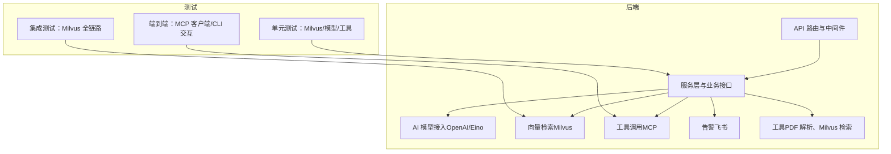
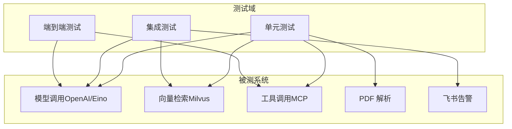
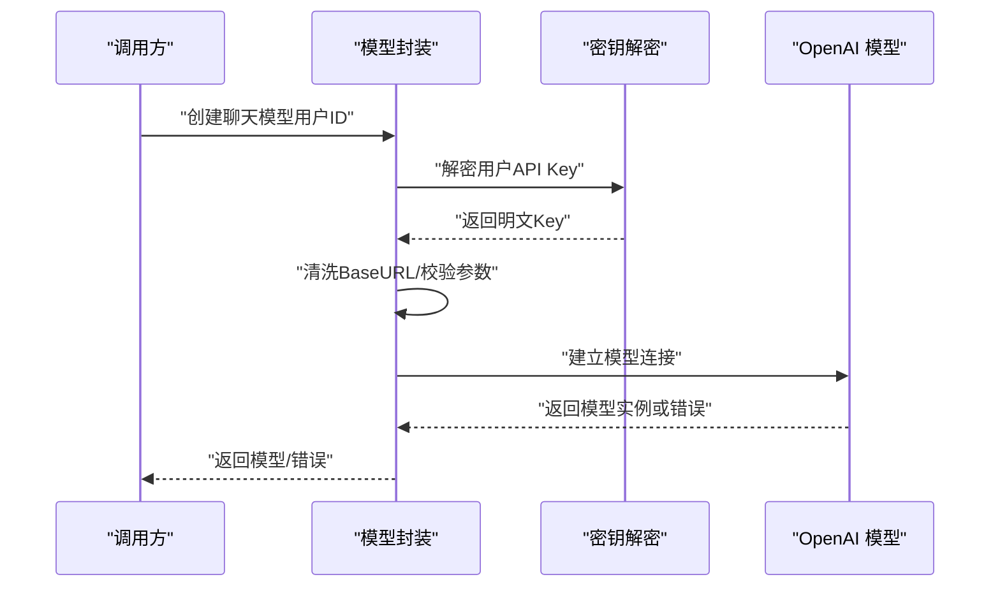
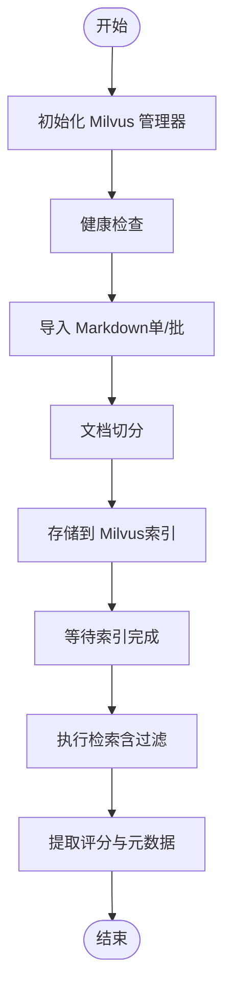
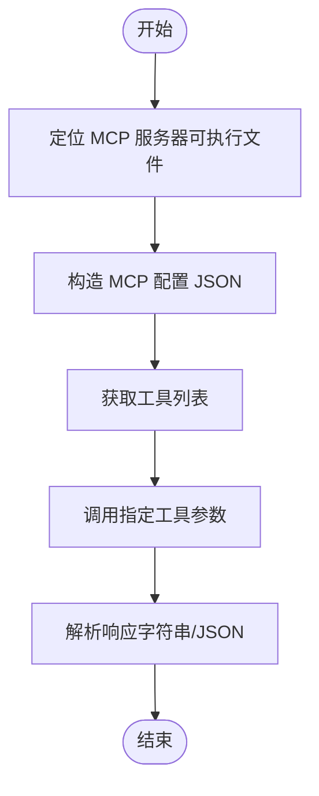
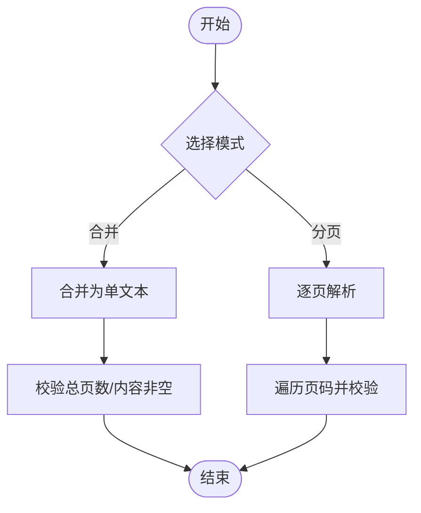
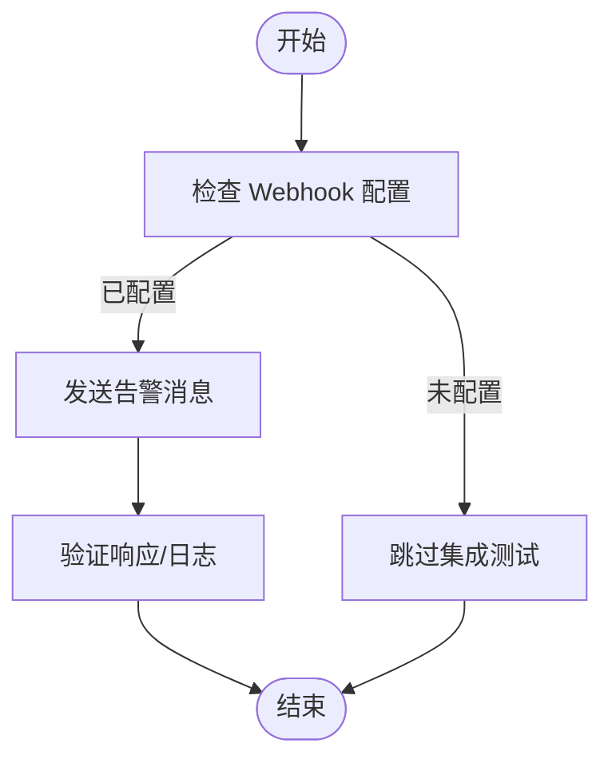
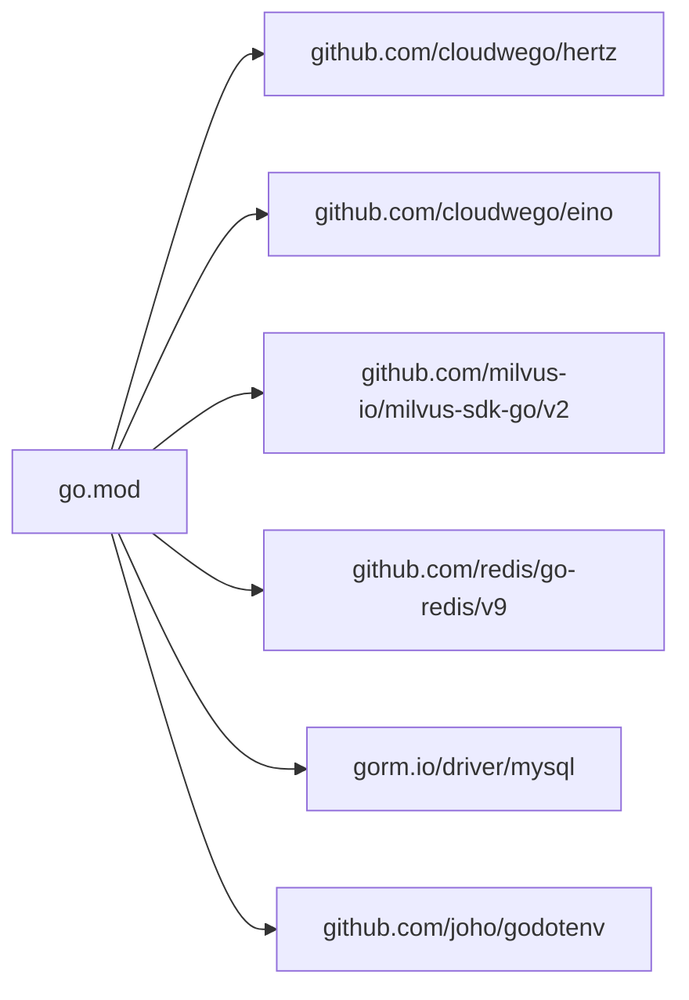

# 测试策略与质量保证

<cite>
**本文引用的文件**   
- [backend/chatApp/main.go](file://backend/chatApp/main.go)
- [backend/chatApp/tool/milvus_retriever_tool.go](file://backend/chatApp/tool/milvus_retriever_tool.go)
- [backend/chatApp/tool/pdf_test.go](file://backend/chatApp/tool/pdf_test.go)
- [backend/chatApp/chat/openAi.go](file://backend/chatApp/chat/openAi.go)
- [backend/internal/alert/feishu_test.go](file://backend/internal/alert/feishu_test.go)
- [backend/internal/eino/milvus/milvus_test.go](file://backend/internal/eino/milvus/milvus_test.go)
- [backend/internal/eino/milvus/integration_test.go](file://backend/internal/eino/milvus/integration_test.go)
- [backend/mcp-moduel/main_test.go](file://backend/mcp-moduel/main_test.go)
- [backend/mcp-moduel/examples/stdio_client/stdio_client_test.go](file://backend/mcp-moduel/examples/stdio_client/stdio_client_test.go)
- [backend/go.mod](file://backend/go.mod)
- [backend/docker-compose.yml](file://backend/docker-compose.yml)
- [backend/.env](file://backend/.env)
- [backend/config.example.yaml](file://backend/config.example.yaml)
</cite>

## 目录
1. [引言](#引言)
2. [项目结构](#项目结构)
3. [核心组件](#核心组件)
4. [架构总览](#架构总览)
5. [详细组件分析](#详细组件分析)
6. [依赖分析](#依赖分析)
7. [性能考虑](#性能考虑)
8. [故障排查指南](#故障排查指南)
9. [结论](#结论)
10. [附录](#附录)

## 引言
本文件面向 Go 面试 AI 代理项目，系统化制定测试策略与质量保证方案，覆盖单元测试、集成测试与端到端测试；重点阐述 AI 模块测试的特殊考虑（模型调用、流式响应、向量检索）；给出测试用例设计原则（边界条件、异常处理、性能测试）；明确测试数据准备、Mock 策略与测试环境配置；提出代码覆盖率目标、持续集成流程与自动化测试脚本建议；并提供常见问题诊断与解决方案。

## 项目结构
项目采用前后端分离与模块化组织，后端以 Go 为主，包含 AI 能力（Eino 框架）、向量检索（Milvus）、工具调用（MCP）、告警通知、API 路由与服务层等模块。测试分布在各子模块内，覆盖 Milvus 向量检索、PDF 文本解析、OpenAI 模型接入、MCP 客户端、飞书告警等关键路径。

图示来源
- [backend/chatApp/chat/openAi.go](file://backend/chatApp/chat/openAi.go#L1-L142)
- [backend/chatApp/tool/milvus_retriever_tool.go](file://backend/chatApp/tool/milvus_retriever_tool.go#L1-L144)
- [backend/internal/eino/milvus/milvus_test.go](file://backend/internal/eino/milvus/milvus_test.go#L1-L532)
- [backend/mcp-moduel/main_test.go](file://backend/mcp-moduel/main_test.go#L1-L208)

章节来源
- [backend/docker-compose.yml](file://backend/docker-compose.yml#L1-L226)

## 核心组件
- 模型调用与流式响应：OpenAI 模型封装、HTTP 客户端与错误映射、调试日志。
- 向量检索：Milvus 管理器、嵌入/切分/索引/检索服务、测试配置与环境变量。
- 工具调用：MCP 客户端与工具发现、标准输入输出（stdio）客户端测试。
- PDF 文本解析：PDF 转文本（合并/分页模式）与错误场景测试。
- 告警通知：飞书 Webhook 告警发送与集成测试。

章节来源
- [backend/chatApp/chat/openAi.go](file://backend/chatApp/chat/openAi.go#L1-L142)
- [backend/internal/eino/milvus/milvus_test.go](file://backend/internal/eino/milvus/milvus_test.go#L1-L532)
- [backend/mcp-moduel/main_test.go](file://backend/mcp-moduel/main_test.go#L1-L208)
- [backend/chatApp/tool/pdf_test.go](file://backend/chatApp/tool/pdf_test.go#L1-L116)
- [backend/internal/alert/feishu_test.go](file://backend/internal/alert/feishu_test.go#L1-L60)

## 架构总览
下图展示测试策略与质量保证在系统中的位置与交互关系。

图示来源
- [backend/chatApp/chat/openAi.go](file://backend/chatApp/chat/openAi.go#L1-L142)
- [backend/internal/eino/milvus/milvus_test.go](file://backend/internal/eino/milvus/milvus_test.go#L1-L532)
- [backend/mcp-moduel/main_test.go](file://backend/mcp-moduel/main_test.go#L1-L208)
- [backend/chatApp/tool/pdf_test.go](file://backend/chatApp/tool/pdf_test.go#L1-L116)
- [backend/internal/alert/feishu_test.go](file://backend/internal/alert/feishu_test.go#L1-L60)

## 详细组件分析

### 模型调用测试（OpenAI/Eino）
- 测试关注点
  - API Key 解密与校验、BaseURL 清洗与去重路径、HTTP 客户端超时与传输配置。
  - 错误映射：配额不足、速率限制、上下文长度超限等。
  - 日志与可观测性：请求 URL、Body 预览、响应状态。
- 测试策略
  - 单元测试：构造不同错误场景，验证错误类型映射与返回值。
  - Mock：对外部模型服务进行 HTTP 层 Mock，覆盖网络异常、鉴权失败、配额不足等。
  - 集成测试：连接真实模型服务（需配置凭据），验证端到端调用与流式响应。
- 关键流程序列图

图示来源
- [backend/chatApp/chat/openAi.go](file://backend/chatApp/chat/openAi.go#L19-L109)

章节来源
- [backend/chatApp/chat/openAi.go](file://backend/chatApp/chat/openAi.go#L1-L142)

### 向量检索测试（Milvus）
- 测试关注点
  - 管理器初始化与健康检查、嵌入维度一致性、文档切分策略、索引存储、检索过滤（语言/分类/组合）。
  - 全链路：导入 Markdown（单文件/目录）、等待索引、检索与结果评分。
- 测试策略
  - 单元测试：嵌入服务、文档切分、索引存储、检索服务独立验证。
  - 集成测试：完整工作流（导入→索引→检索→过滤），覆盖多种过滤组合。
  - Mock：对 Milvus 服务进行接口层 Mock，模拟延迟、错误与不同 TopK。
- 关键流程图

图示来源
- [backend/internal/eino/milvus/integration_test.go](file://backend/internal/eino/milvus/integration_test.go#L13-L357)
- [backend/internal/eino/milvus/milvus_test.go](file://backend/internal/eino/milvus/milvus_test.go#L71-L373)

章节来源
- [backend/internal/eino/milvus/milvus_test.go](file://backend/internal/eino/milvus/milvus_test.go#L1-L532)
- [backend/internal/eino/milvus/integration_test.go](file://backend/internal/eino/milvus/integration_test.go#L1-L406)

### 工具调用测试（MCP）
- 测试关注点
  - 工具发现与调用：获取工具列表、调用计算器/文本处理/时间/回声等工具。
  - stdio 客户端：定位服务器可执行文件、构造配置 JSON、调用工具并解析响应。
- 测试策略
  - 单元测试：MCP 客户端工具调用，覆盖多种操作与错误场景。
  - 集成测试：连接本地 MCP 服务器，执行工具调用链。
  - Mock：对 MCP 服务器进行接口层 Mock，模拟工具不可用、超时、返回错误。
- 关键流程图

图示来源
- [backend/mcp-moduel/examples/stdio_client/stdio_client_test.go](file://backend/mcp-moduel/examples/stdio_client/stdio_client_test.go#L15-L97)
- [backend/mcp-moduel/main_test.go](file://backend/mcp-moduel/main_test.go#L11-L65)

章节来源
- [backend/mcp-moduel/main_test.go](file://backend/mcp-moduel/main_test.go#L1-L208)
- [backend/mcp-moduel/examples/stdio_client/stdio_client_test.go](file://backend/mcp-moduel/examples/stdio_client/stdio_client_test.go#L1-L160)

### PDF 文本解析测试
- 测试关注点
  - 合并模式与分页模式：总页数、每页内容完整性、页码连续性。
  - 异常场景：空路径、文件不存在、非 PDF 文件。
- 测试策略
  - 单元测试：构造不同输入与环境，验证成功与失败分支。
  - Mock：对底层 PDF 解析库进行接口层 Mock，模拟解析失败与异常。
- 关键流程图

图示来源
- [backend/chatApp/tool/pdf_test.go](file://backend/chatApp/tool/pdf_test.go#L14-L67)

章节来源
- [backend/chatApp/tool/pdf_test.go](file://backend/chatApp/tool/pdf_test.go#L1-L116)

### 飞书告警测试
- 测试关注点
  - 集成测试：真实 Webhook URL 下发送告警消息，验证可达性与格式。
  - 短测试跳过：默认跳过集成测试，仅在显式允许时运行。
- 测试策略
  - 单元测试：构造告警消息与配置，验证发送逻辑。
  - 集成测试：配置真实 Webhook URL，执行发送并检查响应。
- 关键流程图

图示来源
- [backend/internal/alert/feishu_test.go](file://backend/internal/alert/feishu_test.go#L13-L59)

章节来源
- [backend/internal/alert/feishu_test.go](file://backend/internal/alert/feishu_test.go#L1-L60)

## 依赖分析
- 外部依赖与版本
  - Hertz、Eino、Milvus SDK、Redis、MySQL、godotenv 等。
- 测试依赖
  - 单元测试依赖：godotenv（加载 .env）、testing 包。
  - 集成测试依赖：Milvus 服务、数据库、Redis、外部模型服务。
- 依赖可视化

图示来源
- [backend/go.mod](file://backend/go.mod#L7-L32)

章节来源
- [backend/go.mod](file://backend/go.mod#L1-L132)

## 性能考虑
- 模型调用
  - 设置合理的 HTTP 超时与重试策略，避免长时间阻塞；对长上下文输入进行预裁剪。
- 向量检索
  - 控制 TopK 与过滤条件，避免返回过多结果；批量导入与索引等待策略需平衡吞吐与延迟。
- 工具调用
  - 对外部工具调用设置超时与熔断；对频繁调用的结果进行缓存。
- 测试性能
  - 单元测试尽量使用 Mock 与最小化数据集；集成测试使用轻量级 Milvus Standalone 或容器化服务。

## 故障排查指南
- 模型调用
  - 症状：鉴权失败、配额不足、速率限制、上下文超限。
  - 排查：检查 API Key 与 BaseURL 清洗逻辑；查看错误映射与日志；必要时降低输入长度或调整模型参数。
- 向量检索
  - 症状：检索无结果、评分异常、索引未完成。
  - 排查：确认 Milvus 连接与健康检查；等待索引完成后再检索；检查过滤条件与 TopK 设置。
- 工具调用
  - 症状：工具不可用、调用超时、响应为空。
  - 排查：确认 MCP 服务器可执行文件路径与配置 JSON；检查工具注册与参数传递。
- PDF 解析
  - 症状：解析失败、空内容、页数不一致。
  - 排查：确认文件路径与权限；检查文件类型与编码；验证分页模式参数。
- 飞书告警
  - 症状：消息未送达、格式错误。
  - 排查：确认 Webhook URL 配置；检查网络连通性与防火墙；查看集成测试日志。

章节来源
- [backend/chatApp/chat/openAi.go](file://backend/chatApp/chat/openAi.go#L84-L106)
- [backend/internal/eino/milvus/milvus_test.go](file://backend/internal/eino/milvus/milvus_test.go#L263-L282)
- [backend/mcp-moduel/examples/stdio_client/stdio_client_test.go](file://backend/mcp-moduel/examples/stdio_client/stdio_client_test.go#L100-L149)
- [backend/chatApp/tool/pdf_test.go](file://backend/chatApp/tool/pdf_test.go#L70-L115)
- [backend/internal/alert/feishu_test.go](file://backend/internal/alert/feishu_test.go#L36-L59)

## 结论
本测试策略围绕“单元测试打地基、集成测试稳流程、端到端测试验闭环”的思路，结合 AI 模块的特殊性（模型调用、流式响应、向量检索），建立了覆盖全面、可落地的质量保障方案。通过 Mock 与容器化环境，既能保证测试稳定性，又能快速定位问题。建议在 CI 中强制执行单元测试与关键集成测试，并逐步引入覆盖率统计与回归测试。

## 附录

### 测试用例设计原则
- 边界条件测试
  - 模型调用：空 Key、极短/极长 BaseURL、空输入、超长上下文。
  - 向量检索：空查询、TopK=0、过滤条件为空、集合不存在。
  - 工具调用：工具名不存在、参数缺失、超时。
  - PDF 解析：空路径、路径不存在、非 PDF 文件、空内容。
- 异常情况处理
  - 网络异常、鉴权失败、配额不足、速率限制、上下文超限、Milvus 连接失败、工具不可用。
- 性能测试方案
  - 并发调用模型与检索，测量 P95/P99 延迟与错误率；批量导入与检索的吞吐对比。
- 测试数据准备
  - 使用最小化样例数据（短文本、少量文档、固定页数 PDF）；对 Milvus 使用独立数据库与集合名。
- Mock 策略
  - 对外部服务（模型、Milvus、Webhook、MCP 服务器）进行接口层 Mock，隔离网络波动与第三方限流。
- 测试环境配置
  - 使用 .env 与 config.yaml 提供统一配置入口；docker-compose 提供 MySQL、Redis、Milvus 依赖服务；CI 中使用环境变量注入敏感配置。
- 代码覆盖率要求
  - 建议核心模块（模型调用、Milvus 管理器、工具调用、告警）达到 80%+ 行覆盖率与 70%+ 分支覆盖率。
- 持续集成流程
  - PR 触发：单元测试 + 快速集成测试（Mock 外部依赖）；主干合并：全量集成测试 + 覆盖率统计。
- 自动化测试脚本
  - 单元测试：go test ./... -short -coverprofile=coverage.out。
  - 集成测试：go test -v ./internal/eino/milvus -run TestFullWorkflowWithMarkdown。
  - MCP 测试：go test -v ./mcp-moduel -run TestMCPClient。
  - 飞书告警：go test -v ./internal/alert -run TestSendFeishuAlert_Integration。

章节来源
- [backend/.env](file://backend/.env#L1-L16)
- [backend/config.example.yaml](file://backend/config.example.yaml#L1-L127)
- [backend/docker-compose.yml](file://backend/docker-compose.yml#L1-L226)