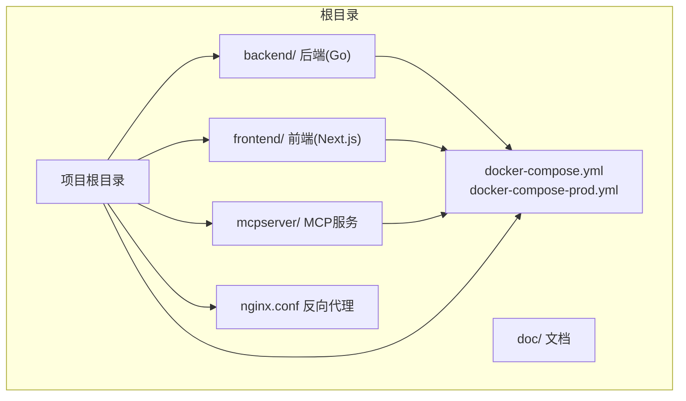
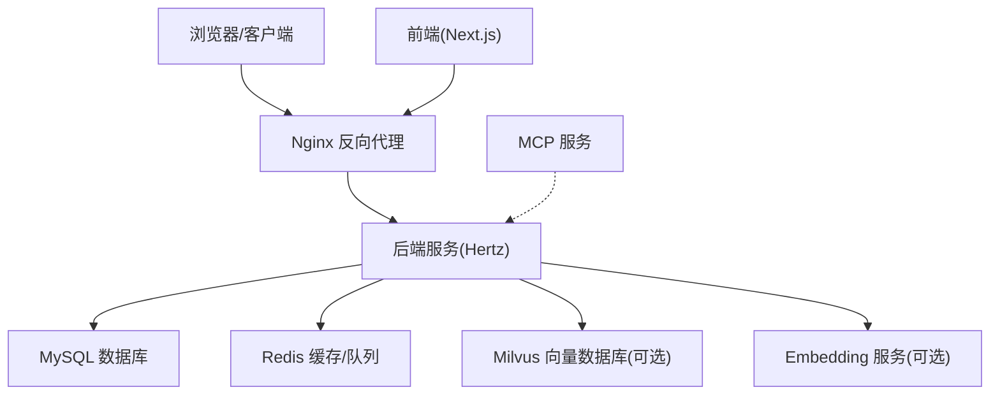
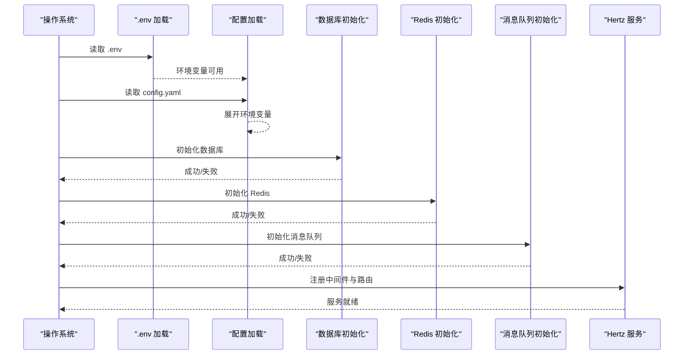
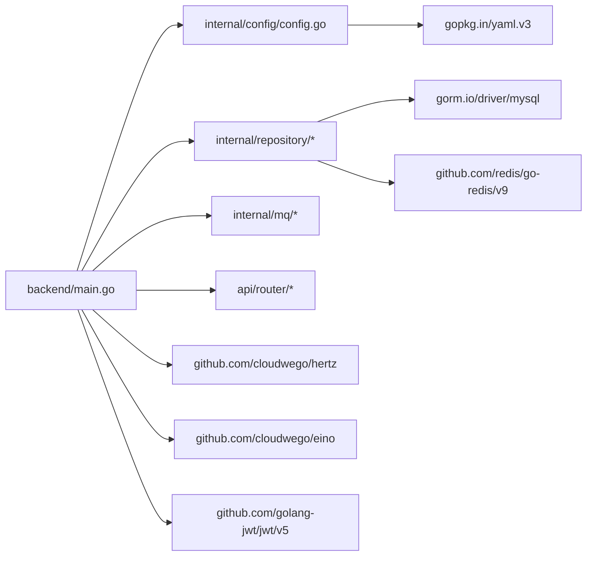

# 快速开始

<cite>
**本文引用的文件**
- [README.md](file://README.md)
- [backend/main.go](file://backend/main.go)
- [backend/config.example.yaml](file://backend/config.example.yaml)
- [backend/.env](file://backend/.env)
- [backend/Dockerfile](file://backend/Dockerfile)
- [backend/go.mod](file://backend/go.mod)
- [backend/internal/config/config.go](file://backend/internal/config/config.go)
- [docker-compose.yml](file://docker-compose.yml)
- [docker-compose-prod.yml](file://docker-compose-prod.yml)
- [frontend/README.md](file://frontend/README.md)
- [frontend/Dockerfile](file://frontend/Dockerfile)
- [frontend/package.json](file://frontend/package.json)
- [frontend/TROUBLESHOOTING.md](file://frontend/TROUBLESHOOTING.md)
- [mcpserver/config.yaml](file://mcpserver/config.yaml)
</cite>

## 目录
1. [简介](#简介)
2. [项目结构](#项目结构)
3. [核心组件](#核心组件)
4. [架构总览](#架构总览)
5. [详细组件分析](#详细组件分析)
6. [依赖关系分析](#依赖关系分析)
7. [性能注意事项](#性能注意事项)
8. [故障排除指南](#故障排除指南)
9. [结论](#结论)
10. [附录](#附录)

## 简介
面试吧AI智能面试平台是一个基于字节跳动 Hertz 框架与 Eino 大模型框架的智能面试系统，提供简历分析、面试问题生成、答案评估、向量检索与消息队列等能力。本文面向首次使用者，提供从零搭建开发环境、安装与运行、环境配置、数据库初始化、容器化部署以及常见问题排查的完整指南。

## 项目结构
项目采用前后端分离架构，包含后端（Go）、前端（Next.js）、MCP 服务、以及基于 Docker Compose 的多环境部署方案。

图表来源
- [docker-compose.yml](file://docker-compose.yml#L1-L226)
- [README.md](file://README.md#L35-L120)

章节来源
- [README.md](file://README.md#L35-L120)
- [docker-compose.yml](file://docker-compose.yml#L1-L226)

## 核心组件
- 后端服务（Go）
  - Hertz Web 框架提供 REST API
  - GORM + MySQL 数据库
  - Redis 缓存与消息队列
  - Eino 框架集成 OpenAI/Ark Embedding/Milvus 等 AI 能力
  - 配置文件 config.yaml 与 .env 环境变量
- 前端应用（Next.js）
  - 基于 React 18 + TypeScript + Tailwind CSS + Ant Design
  - 通过 API 与后端交互
- MCP 服务
  - 独立的 MCP 协议服务，提供工具能力
- 容器化与反向代理
  - Dockerfile 多阶段构建
  - docker-compose 提供开发/生产环境编排
  - Nginx 作为反向代理

章节来源
- [backend/main.go](file://backend/main.go#L1-L211)
- [backend/Dockerfile](file://backend/Dockerfile#L1-L64)
- [frontend/Dockerfile](file://frontend/Dockerfile#L1-L65)
- [mcpserver/config.yaml](file://mcpserver/config.yaml#L1-L36)

## 架构总览
系统采用“前端 -> 反向代理 -> 后端”的三层架构；后端通过 Hertz 提供 API，连接 MySQL、Redis，并可选集成 Milvus 向量数据库与 Embedding 服务。

图表来源
- [docker-compose.yml](file://docker-compose.yml#L144-L206)
- [backend/main.go](file://backend/main.go#L101-L128)

## 详细组件分析

### 后端服务启动流程
后端启动顺序：加载 .env -> 读取 config.yaml -> 展开环境变量 -> 初始化数据库/Redis -> 初始化消息队列 -> 注册路由 -> 启动 Hertz 服务 -> 监听系统信号优雅退出。

图表来源
- [backend/main.go](file://backend/main.go#L29-L173)
- [backend/internal/config/config.go](file://backend/internal/config/config.go#L136-L152)

章节来源
- [backend/main.go](file://backend/main.go#L29-L173)
- [backend/internal/config/config.go](file://backend/internal/config/config.go#L212-L269)

### 配置文件与环境变量
- config.yaml：服务、数据库、Redis、Hertz、面试配置、安全、AI/OpenAI/Embedding、Milvus、文档分割器、微信、飞书等
- .env：Embedding 与 Milvus 的环境变量占位
- 配置展开：支持 ${VAR} 与 $VAR 两种语法，自动从系统环境读取

章节来源
- [backend/config.example.yaml](file://backend/config.example.yaml#L1-L127)
- [backend/.env](file://backend/.env#L1-L16)
- [backend/internal/config/config.go](file://backend/internal/config/config.go#L212-L269)

### 前端开发与运行
- Node.js 18+、npm/yarn
- 环境变量 NEXT_PUBLIC_API_BASE_URL 指向后端 API
- 开发：npm/yarn dev -> http://localhost:3000
- 构建：npm/yarn build -> 生产运行

章节来源
- [frontend/README.md](file://frontend/README.md#L17-L98)
- [frontend/package.json](file://frontend/package.json#L1-L37)

### 容器化与部署
- 后端 Dockerfile：多阶段构建，健康检查，非 root 用户运行
- 前端 Dockerfile：多阶段构建，生产运行，健康检查
- docker-compose.yml：本地开发一键拉起 MySQL、Redis、后端、前端、Nginx
- docker-compose-prod.yml：生产环境编排（可选 Milvus、Etcd、MinIO 等）

章节来源
- [backend/Dockerfile](file://backend/Dockerfile#L1-L64)
- [frontend/Dockerfile](file://frontend/Dockerfile#L1-L65)
- [docker-compose.yml](file://docker-compose.yml#L1-L226)
- [docker-compose-prod.yml](file://docker-compose-prod.yml#L1-L213)

## 依赖关系分析
后端依赖 Go 模块与第三方库，包含 Hertz、Eino、GORM、Redis、Milvus SDK、JWT、YAML 解析等。

图表来源
- [backend/go.mod](file://backend/go.mod#L7-L32)
- [backend/main.go](file://backend/main.go#L3-L27)

章节来源
- [backend/go.mod](file://backend/go.mod#L1-L132)

## 性能注意事项
- 合理设置数据库连接池与超时
- Redis 连接池大小与超时
- Hertz 日志级别与超时配置
- Embedding 维度与 Milvus TopK、MetricType
- 前端静态资源与 Next.js 构建优化
- 容器资源限制与健康检查

## 故障排除指南

### 前端 404/CORS 问题
- 现象：CORS 缺少允许头，404 表示后端未监听或路由未注册
- 排查步骤：
  - 确认后端服务已启动并监听 8888 端口
  - 检查后端路由是否包含面试流式接口
  - 确认前端 NEXT_PUBLIC_API_BASE_URL 指向正确地址
  - 检查浏览器 localStorage 是否存在有效 token
- 参考文档：前端 TROUBLESHOOTING.md

章节来源
- [frontend/TROUBLESHOOTING.md](file://frontend/TROUBLESHOOTING.md#L1-L117)

### 配置加载与环境变量
- 现象：配置未生效或为空
- 排查步骤：
  - 确认 config.yaml 与 .env 正确放置
  - 检查配置中的环境变量占位是否已通过 .env 或系统环境填充
  - 使用配置展开功能验证变量替换

章节来源
- [backend/internal/config/config.go](file://backend/internal/config/config.go#L212-L269)
- [backend/.env](file://backend/.env#L1-L16)

### 数据库连接失败
- 现象：启动时报数据库连接错误
- 排查步骤：
  - 确认 MySQL 服务可用
  - 检查 DSN、用户名、密码、数据库名
  - 若使用 docker-compose，确认容器健康状态

章节来源
- [docker-compose.yml](file://docker-compose.yml#L3-L21)
- [backend/config.example.yaml](file://backend/config.example.yaml#L5-L11)

### Redis 连接失败
- 现象：Redis 初始化失败
- 排查步骤：
  - 确认 Redis 服务可用
  - 检查地址、密码、DB 索引
  - 若使用 docker-compose，确认容器健康状态

章节来源
- [docker-compose.yml](file://docker-compose.yml#L23-L39)
- [backend/config.example.yaml](file://backend/config.example.yaml#L13-L22)

### Milvus/Embedding 可选功能
- 现象：Milvus/Embedding 未启用或连接失败
- 排查步骤：
  - 检查 .env 中 Milvus 地址、用户名、密码
  - 检查 Embedding 的 API Key、Model、BaseURL、Region
  - 可暂时注释相关初始化以验证主流程

章节来源
- [backend/.env](file://backend/.env#L12-L16)
- [backend/config.example.yaml](file://backend/config.example.yaml#L61-L101)

### 健康检查与端口占用
- 后端健康检查：/health
- 前端健康检查：/（Next.js）
- 端口占用：3000（前端）、8888（后端）、80（Nginx）

章节来源
- [backend/Dockerfile](file://backend/Dockerfile#L58-L60)
- [frontend/Dockerfile](file://frontend/Dockerfile#L59-L61)
- [frontend/TROUBLESHOOTING.md](file://frontend/TROUBLESHOOTING.md#L183-L197)

## 结论
通过本文档，您可以完成从环境准备、依赖安装、配置文件设置、数据库初始化，到本地与容器化运行的全流程。若遇到问题，可参考故障排除章节逐步定位。建议在开发完成后，使用 docker-compose-prod.yml 进行生产环境部署。

## 附录

### 快速开始清单
- 安装前置条件
  - Go 1.24+
  - Node.js 18+
  - MySQL 8.0
  - Redis 7
  - Docker 与 docker-compose（可选）
- 克隆仓库并进入根目录
- 后端
  - 复制 config.example.yaml 为 config.yaml
  - 填写数据库、Redis、OpenAI/Embedding、JWT、CORS 等配置
  - 如需 Milvus，配置 .env 并启用相关初始化
  - 安装依赖：go mod download
  - 运行：go run backend/main.go
- 前端
  - 在 frontend/ 创建 .env.local，设置 NEXT_PUBLIC_API_BASE_URL
  - 安装依赖：npm/yarn install
  - 启动：npm/yarn dev
- 容器化（可选）
  - docker-compose up -d
  - 访问 http://localhost

章节来源
- [README.md](file://README.md#L158-L308)
- [backend/main.go](file://backend/main.go#L29-L173)
- [frontend/README.md](file://frontend/README.md#L17-L98)
- [docker-compose.yml](file://docker-compose.yml#L1-L226)