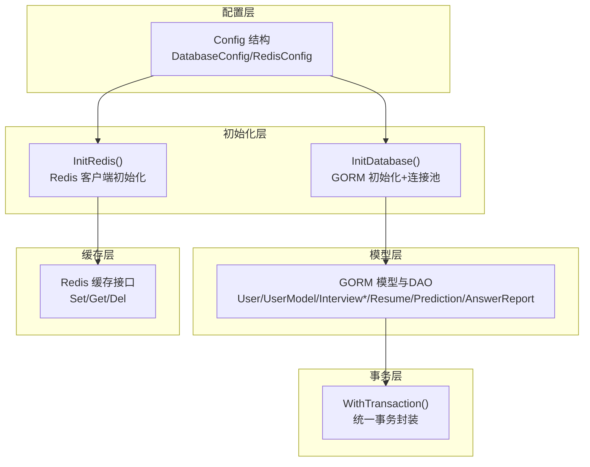
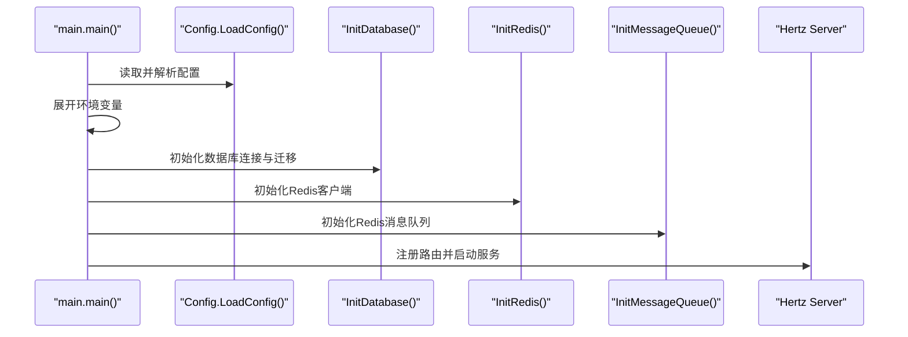
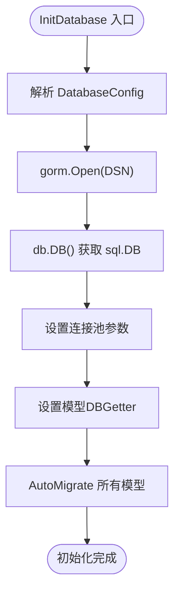
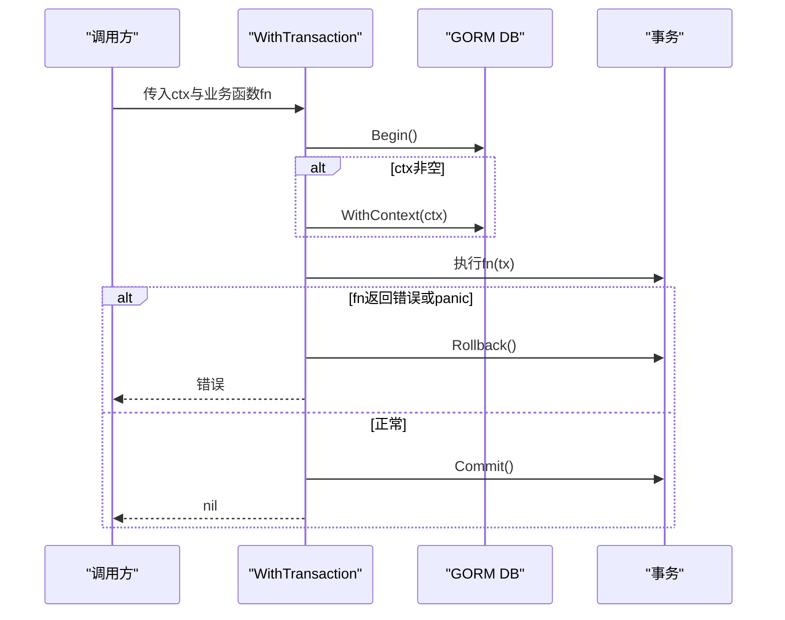
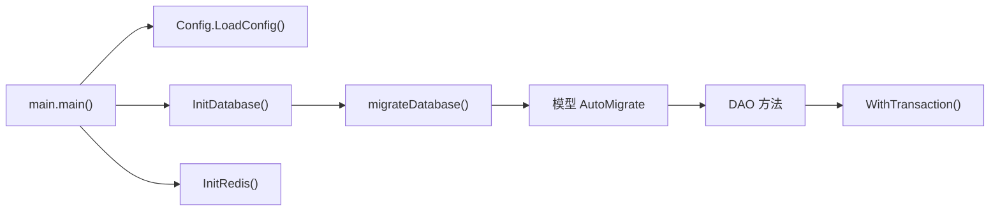

# 数据库架构设计

<cite>
**本文引用的文件**
- [backend/main.go](file://backend/main.go)
- [backend/internal/config/config.go](file://backend/internal/config/config.go)
- [backend/internal/repository/database.go](file://backend/internal/repository/database.go)
- [backend/internal/repository/redis.go](file://backend/internal/repository/redis.go)
- [backend/internal/model/user.go](file://backend/internal/model/user.go)
- [backend/internal/model/user_model.go](file://backend/internal/model/user_model.go)
- [backend/internal/model/interview_record.go](file://backend/internal/model/interview_record.go)
- [backend/internal/model/interview_dialogue.go](file://backend/internal/model/interview_dialogue.go)
- [backend/internal/model/interview_evaluation.go](file://backend/internal/model/interview_evaluation.go)
- [backend/internal/model/resume.go](file://backend/internal/model/resume.go)
- [backend/internal/model/prediction.go](file://backend/internal/model/prediction.go)
- [backend/internal/model/answer_report.go](file://backend/internal/model/answer_report.go)
- [backend/internal/model/transaction.go](file://backend/internal/model/transaction.go)
</cite>

## 目录
1. [简介](#简介)
2. [项目结构](#项目结构)
3. [核心组件](#核心组件)
4. [架构总览](#架构总览)
5. [详细组件分析](#详细组件分析)
6. [依赖关系分析](#依赖关系分析)
7. [性能考量](#性能考量)
8. [故障排查指南](#故障排查指南)
9. [结论](#结论)
10. [附录](#附录)

## 简介
本文件系统化梳理该面试Agent平台的数据库架构设计，覆盖表结构与索引策略、约束规则、事务与并发控制、连接池配置、迁移与版本管理、性能优化、缓存策略、监控与备份恢复以及数据一致性与ACID特性。文档以代码为依据，结合实际实现进行说明，并提供可视化图示帮助理解。

## 项目结构
数据库相关能力主要分布在以下层次：
- 配置层：集中定义数据库与Redis配置结构
- 初始化层：负责数据库与Redis连接、连接池配置、自动迁移
- 模型层：定义各实体表结构、索引与约束、DAO方法
- 事务层：统一事务封装，保障ACID与并发安全
- 缓存层：基于Redis的键值缓存与消息队列



**图表来源**
- [backend/internal/config/config.go](file://backend/internal/config/config.go#L64-L83)
- [backend/internal/repository/database.go](file://backend/internal/repository/database.go#L18-L60)
- [backend/internal/repository/redis.go](file://backend/internal/repository/redis.go#L16-L33)
- [backend/internal/model/transaction.go](file://backend/internal/model/transaction.go#L11-L58)

**章节来源**
- [backend/main.go](file://backend/main.go#L38-L64)
- [backend/internal/config/config.go](file://backend/internal/config/config.go#L64-L83)
- [backend/internal/repository/database.go](file://backend/internal/repository/database.go#L18-L60)
- [backend/internal/repository/redis.go](file://backend/internal/repository/redis.go#L16-L33)

## 核心组件
- 数据库配置与连接池
  - 通过配置结构体集中管理DSN、最大连接数、空闲连接数、连接生命周期
  - GORM初始化时设置日志级别与连接池参数
  - 自动迁移所有模型表结构
- Redis缓存与消息队列
  - 初始化Redis客户端并进行连通性测试
  - 提供通用缓存接口（Set/Get/Del）
  - 基于Redis实现消息队列（生产者/消费者模式）
- 事务管理
  - WithTransaction统一封装Begin/Commit/Rollback与panic兜底
  - 支持绑定context，确保超时与取消传播
- 模型与DAO
  - 每个实体对应结构体、表名、索引/约束声明与DAO方法
  - DAO方法通过全局DBGetter获取数据库实例，避免循环依赖

**章节来源**
- [backend/internal/config/config.go](file://backend/internal/config/config.go#L64-L83)
- [backend/internal/repository/database.go](file://backend/internal/repository/database.go#L18-L60)
- [backend/internal/repository/redis.go](file://backend/internal/repository/redis.go#L16-L53)
- [backend/internal/model/transaction.go](file://backend/internal/model/transaction.go#L11-L58)

## 架构总览
整体启动流程：加载.env与config.yaml → 展开环境变量 → 初始化数据库与Redis → 初始化消息队列 → 注册路由并启动HTTP服务。



**图表来源**
- [backend/main.go](file://backend/main.go#L38-L128)
- [backend/internal/repository/database.go](file://backend/internal/repository/database.go#L18-L60)
- [backend/internal/repository/redis.go](file://backend/internal/repository/redis.go#L16-L33)

**章节来源**
- [backend/main.go](file://backend/main.go#L29-L173)

## 详细组件分析

### 数据库配置与连接池
- 配置项
  - 数据库：驱动、DSN、最大打开连接数、最大空闲连接数、连接最大生命周期
  - Redis：地址、密码、DB索引、拨号/读写超时、连接池大小、最小空闲连接
- 初始化流程
  - GORM打开连接并设置日志级别
  - 获取sql.DB并设置连接池参数
  - 设置全局DBGetter，供模型层使用
  - 自动迁移所有模型表结构
- 连接池参数
  - 最大打开连接数、最大空闲连接数、连接最大生命周期
  - 建议根据QPS与数据库资源合理配置



**图表来源**
- [backend/internal/repository/database.go](file://backend/internal/repository/database.go#L18-L60)

**章节来源**
- [backend/internal/config/config.go](file://backend/internal/config/config.go#L64-L83)
- [backend/internal/repository/database.go](file://backend/internal/repository/database.go#L18-L60)

### 事务管理与并发控制
- WithTransaction封装
  - 自动Begin/Commit/Rollback
  - panic兜底：捕获panic并回滚，记录日志后继续抛出
  - 支持绑定context，便于超时与取消
- 并发控制要点
  - 通过连接池与事务隔离级别保障并发安全
  - 对热点表采用合适的索引与锁策略
  - 对批量写入使用事务聚合，减少往返



**图表来源**
- [backend/internal/model/transaction.go](file://backend/internal/model/transaction.go#L11-L58)

**章节来源**
- [backend/internal/model/transaction.go](file://backend/internal/model/transaction.go#L11-L58)

### 表结构、索引与约束

#### 用户表 user
- 主键：自增ID
- 唯一索引：用户名、邮箱、微信OpenID、微信UnionID
- 字段：角色、微信扩展字段、软删除索引
- 约束：长度限制、非空、默认值

**章节来源**
- [backend/internal/model/user.go](file://backend/internal/model/user.go#L11-L33)

#### 用户模型表 user_model
- 主键：自增ID
- 索引：用户ID
- JSON字段：配置与默认参数
- 状态字段：启用/禁用、默认模型标记
- 约束：长度限制、非空、默认值

**章节来源**
- [backend/internal/model/user_model.go](file://backend/internal/model/user_model.go#L30-L58)

#### 面试记录表 interview_record
- 主键：自增ID
- 索引：用户ID
- 约束：类型、难度、领域、状态默认值、时间精度毫秒

**章节来源**
- [backend/internal/model/interview_record.go](file://backend/internal/model/interview_record.go#L9-L31)

#### 面试对话表 interview_dialogues
- 主键：自增ID
- 索引：用户ID、报告ID
- 字段：问题、回答（长文本）

**章节来源**
- [backend/internal/model/interview_dialogue.go](file://backend/internal/model/interview_dialogue.go#L9-L27)

#### 面试评估表 interview_evaluation
- 主键：自增ID
- 索引：用户ID、报告ID、删除标记
- JSON字段：维度评估
- 约束：评分精度、默认值

**章节来源**
- [backend/internal/model/interview_evaluation.go](file://backend/internal/model/interview_evaluation.go#L9-L35)

#### 简历表 resume
- 主键：自增ID
- 索引：用户ID、删除标记
- 字段：文件元信息、默认简历标记
- 约束：默认值、排序优先级

**章节来源**
- [backend/internal/model/resume.go](file://backend/internal/model/resume.go#L9-L30)

#### 押题记录与题目表 prediction_record / prediction_question
- 主键：记录ID、题目ID
- 索引：记录ID（外键）、用户ID、简历ID
- 关系：记录-题目一对多（级联更新/删除）
- 字段：问题、内容、重点、思路、参考答案、追问、排序

**章节来源**
- [backend/internal/model/prediction.go](file://backend/internal/model/prediction.go#L11-L47)

#### 答题报告表 answer_report
- 主键：自增ID
- 索引：用户ID、报告ID、删除标记
- JSON字段：答题记录、评论、对话
- 约束：默认值、时间精度毫秒

**章节来源**
- [backend/internal/model/answer_report.go](file://backend/internal/model/answer_report.go#L9-L54)

### 数据模型类图
```mermaid
classDiagram
class User {
+ID : uint
+Username : string
+Email : string
+Role : string
+WechatOpenID : string
+WechatUnionID : string
+DeletedAt : gorm.DeletedAt
}
class UserModel {
+ID : uint64
+UserID : int64
+Name : string
+ModelKey : string
+Scope : int
+Status : int
+IsDefault : int
}
class InterviewRecord {
+ID : uint64
+UserID : uint
+Type : string
+Difficulty : string
+Domain : string
+Status : string
}
class InterviewDialogue {
+ID : uint64
+UserID : uint
+ReportID : uint64
+Question : string
+Answer : string
}
class InterviewEvaluation {
+ID : uint64
+UserID : uint
+ReportID : uint64
+Comment : string
+Score : float64
+Dimensions : JSON
+Deleted : int
}
class Resume {
+ID : uint64
+UserID : uint
+FileName : string
+FileSize : int64
+FileType : string
+IsDefault : int
+Deleted : int
}
class PredictionRecord {
+ID : uint64
+UserID : uint
+ResumeID : uint64
+Type : string
+Language : string
+JobTitle : string
+Difficulty : string
+Company : string
}
class PredictionQuestion {
+ID : uint64
+RecordID : uint64
+Question : string
+Content : string
+Focus : string
+ThinkingPath : string
+ReferenceAnswer : string
+FollowUp : string
+Sort : int
}
class AnswerReport {
+ID : uint64
+UserID : uint
+ReportID : uint64
+Records : JSON
+Deleted : int
}
UserModel --> User : "外键 : user_id"
InterviewRecord --> User : "外键 : user_id"
InterviewDialogue --> InterviewRecord : "外键 : report_id"
InterviewEvaluation --> InterviewRecord : "外键 : report_id"
Resume --> User : "外键 : user_id"
PredictionRecord --> User : "外键 : user_id"
PredictionRecord --> Resume : "外键 : resume_id"
PredictionQuestion --> PredictionRecord : "外键 : record_id"
AnswerReport --> InterviewRecord : "外键 : report_id"
```

**图表来源**
- [backend/internal/model/user.go](file://backend/internal/model/user.go#L11-L33)
- [backend/internal/model/user_model.go](file://backend/internal/model/user_model.go#L30-L58)
- [backend/internal/model/interview_record.go](file://backend/internal/model/interview_record.go#L9-L31)
- [backend/internal/model/interview_dialogue.go](file://backend/internal/model/interview_dialogue.go#L9-L27)
- [backend/internal/model/interview_evaluation.go](file://backend/internal/model/interview_evaluation.go#L9-L35)
- [backend/internal/model/resume.go](file://backend/internal/model/resume.go#L9-L30)
- [backend/internal/model/prediction.go](file://backend/internal/model/prediction.go#L11-L47)
- [backend/internal/model/answer_report.go](file://backend/internal/model/answer_report.go#L9-L54)

### 索引策略与约束规则
- 唯一性
  - 用户：用户名、邮箱、微信OpenID、微信UnionID唯一索引
- 常用查询字段
  - 用户：邮箱、ID、微信OpenID
  - 面试：用户ID、报告ID、删除标记
  - 简历：用户ID、删除标记
  - 押题：用户ID、简历ID、记录ID
- 约束与默认值
  - 角色默认“user”
  - 面试状态默认“pending”
  - 删除标记软删除（0未删，1已删）
  - 时间精度：毫秒级
- JSON字段
  - 评估与答题报告使用JSON存储复杂结构，便于扩展

**章节来源**
- [backend/internal/model/user.go](file://backend/internal/model/user.go#L17-L27)
- [backend/internal/model/interview_record.go](file://backend/internal/model/interview_record.go#L14-L25)
- [backend/internal/model/interview_dialogue.go](file://backend/internal/model/interview_dialogue.go#L14-L21)
- [backend/internal/model/interview_evaluation.go](file://backend/internal/model/interview_evaluation.go#L12-L22)
- [backend/internal/model/resume.go](file://backend/internal/model/resume.go#L13-L24)
- [backend/internal/model/prediction.go](file://backend/internal/model/prediction.go#L12-L23)
- [backend/internal/model/answer_report.go](file://backend/internal/model/answer_report.go#L12-L20)

### 数据库迁移与版本管理
- 自动迁移
  - 启动时对以下模型执行AutoMigrate：
    - User、UserModel、InterviewRecord、InterviewDialogue、InterviewEvaluation、AnswerReport、Resume、PredictionRecord、PredictionQuestion
- 迁移触发点
  - InitDatabase内部调用migrateDatabase
- 版本与回滚
  - 当前实现为自动迁移，未见显式的迁移脚本或版本号管理
  - 建议引入迁移工具（如GORM CLI或自建迁移脚本）以支持版本化与回滚

**章节来源**
- [backend/internal/repository/database.go](file://backend/internal/repository/database.go#L62-L75)

### 缓存策略与Redis集成
- Redis初始化
  - 通过配置创建客户端并Ping连通性测试
- 缓存接口
  - SetCache/GetCache/DeleteCache提供统一KV操作
- 应用场景
  - 密码重置验证码等临时数据
  - 可扩展为会话、热点查询结果、限流令牌等

**章节来源**
- [backend/internal/repository/redis.go](file://backend/internal/repository/redis.go#L16-L53)

### 查询优化与性能优化
- 索引命中
  - 常用过滤字段均建立索引（用户ID、报告ID、删除标记、唯一字段）
- 分页与总数
  - DAO普遍采用Count+Limit/Offset分页，注意大数据量下Offset成本
- JSON字段
  - 评估与答题报告使用JSON，避免频繁JOIN，但需关注查询条件与序列化成本
- 连接池
  - 通过配置调整最大连接数、空闲连接数与生命周期，匹配业务峰值

**章节来源**
- [backend/internal/model/interview_record.go](file://backend/internal/model/interview_record.go#L57-L81)
- [backend/internal/model/resume.go](file://backend/internal/model/resume.go#L131-L156)
- [backend/internal/config/config.go](file://backend/internal/config/config.go#L64-L83)

### 监控、备份与灾难恢复
- 监控
  - GORM日志级别已在初始化时设置，可用于观察慢查询与错误
  - 建议结合数据库性能视图与慢查询日志进一步细化
- 备份与恢复
  - 建议采用数据库官方备份工具定期备份，并验证恢复流程
- 灾难恢复
  - 建议部署主从复制与跨机房容灾，配合自动化切换预案

**章节来源**
- [backend/internal/repository/database.go](file://backend/internal/repository/database.go#L20-L26)

### 数据一致性与ACID特性
- 原子性与一致性
  - 通过WithTransaction封装事务，确保多步写入原子性
  - 对默认模型切换、启用/禁用等需要一致性变更的场景，使用事务包裹
- 隔离性
  - 通过连接池与事务隔离级别保障并发一致性
- 持久性
  - 事务提交后持久化到数据库

**章节来源**
- [backend/internal/model/transaction.go](file://backend/internal/model/transaction.go#L11-L58)
- [backend/internal/model/user_model.go](file://backend/internal/model/user_model.go#L145-L173)
- [backend/internal/model/user_model.go](file://backend/internal/model/user_model.go#L217-L242)

## 依赖关系分析
- 初始化依赖
  - main依赖配置加载、数据库初始化、Redis初始化、消息队列初始化
- 模型依赖
  - 模型通过SetDBGetter注入DB实例，DAO方法统一通过全局函数访问数据库
- 事务依赖
  - 事务封装依赖全局DBGetter与GORM



**图表来源**
- [backend/main.go](file://backend/main.go#L38-L128)
- [backend/internal/repository/database.go](file://backend/internal/repository/database.go#L62-L75)
- [backend/internal/model/transaction.go](file://backend/internal/model/transaction.go#L11-L58)

**章节来源**
- [backend/main.go](file://backend/main.go#L29-L173)
- [backend/internal/repository/database.go](file://backend/internal/repository/database.go#L18-L60)

## 性能考量
- 连接池调优
  - 根据QPS与数据库资源设置MaxOpenConns、MaxIdleConns、ConnMaxLifetime
- 索引优化
  - 对高频过滤字段建立合适索引，避免全表扫描
- 分页优化
  - 大数据量分页建议使用基于游标的分页或延迟关联
- JSON字段
  - 控制JSON字段大小与序列化频率，必要时拆分表或添加派生列
- 事务批处理
  - 将多个写操作放入同一事务，减少往返与锁竞争

[本节为通用指导，无需列出具体文件来源]

## 故障排查指南
- 数据库连接失败
  - 检查DSN与网络连通性；查看初始化日志
- 迁移异常
  - 检查模型定义与数据库权限；确认AutoMigrate输出
- 事务回滚
  - 关注WithTransaction日志，定位panic或业务错误
- Redis不可用
  - 检查地址、密码、DB索引与连通性；确认Ping结果

**章节来源**
- [backend/internal/repository/database.go](file://backend/internal/repository/database.go#L18-L60)
- [backend/internal/model/transaction.go](file://backend/internal/model/transaction.go#L33-L41)
- [backend/internal/repository/redis.go](file://backend/internal/repository/redis.go#L24-L32)

## 结论
该平台采用GORM进行ORM映射与自动迁移，通过统一的事务封装保障ACID特性，结合Redis提供缓存与消息队列能力。表结构设计围绕面试业务域，索引与约束覆盖常用查询路径。建议后续引入版本化迁移工具与更完善的监控体系，持续优化连接池与查询性能，提升系统的稳定性与可维护性。

[本节为总结性内容，无需列出具体文件来源]

## 附录
- 启动流程与关键配置
  - 配置加载与环境变量展开
  - 数据库与Redis初始化
  - 消息队列初始化与Hertz服务启动

**章节来源**
- [backend/main.go](file://backend/main.go#L38-L128)
- [backend/internal/config/config.go](file://backend/internal/config/config.go#L136-L152)