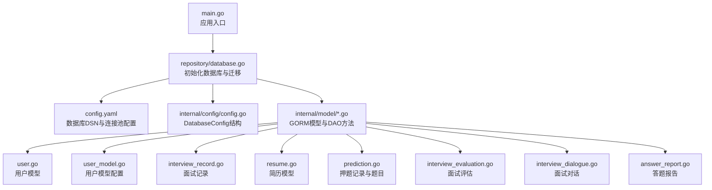
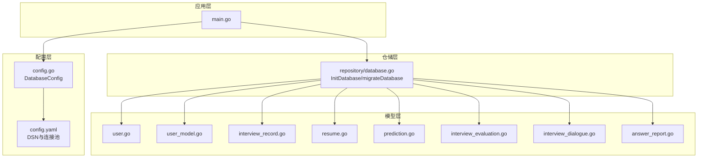
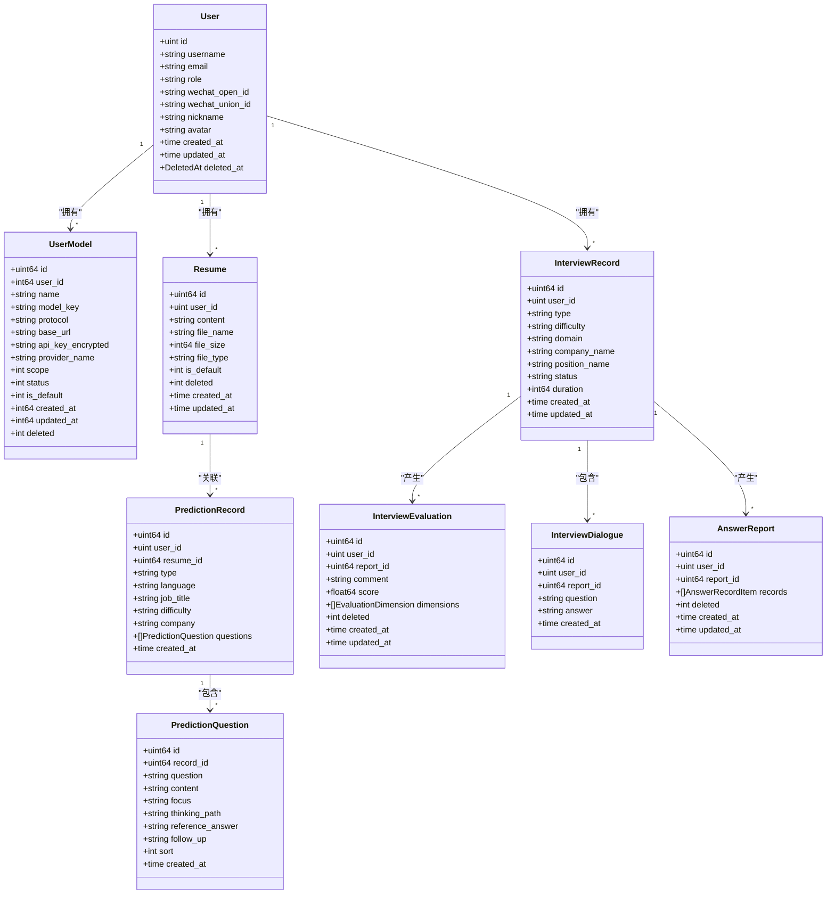
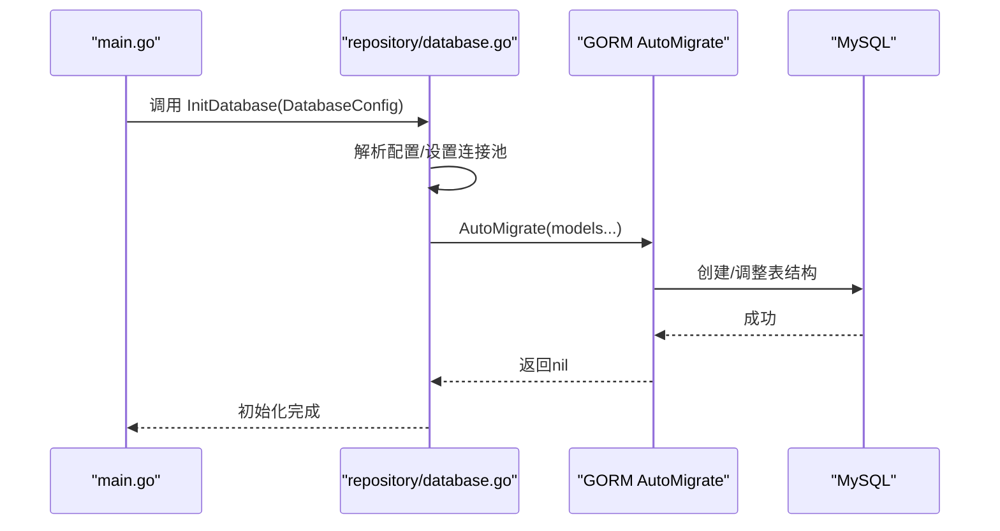
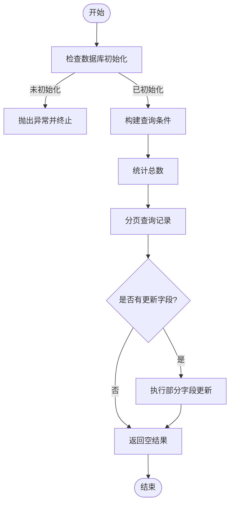
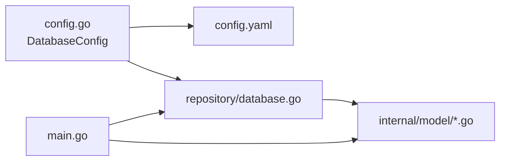

# 数据模型与数据库设计

<cite>
**本文档引用的文件**
- [backend/internal/model/user.go](file://backend/internal/model/user.go)
- [backend/internal/model/user_model.go](file://backend/internal/model/user_model.go)
- [backend/internal/model/interview_record.go](file://backend/internal/model/interview_record.go)
- [backend/internal/model/resume.go](file://backend/internal/model/resume.go)
- [backend/internal/model/prediction.go](file://backend/internal/model/prediction.go)
- [backend/internal/model/interview_evaluation.go](file://backend/internal/model/interview_evaluation.go)
- [backend/internal/model/interview_dialogue.go](file://backend/internal/model/interview_dialogue.go)
- [backend/internal/model/answer_report.go](file://backend/internal/model/answer_report.go)
- [backend/internal/repository/database.go](file://backend/internal/repository/database.go)
- [backend/internal/config/config.go](file://backend/internal/config/config.go)
- [backend/config.yaml](file://backend/config.yaml)
- [backend/main.go](file://backend/main.go)
</cite>

## 目录
1. [简介](#简介)
2. [项目结构](#项目结构)
3. [核心数据模型](#核心数据模型)
4. [架构总览](#架构总览)
5. [详细组件分析](#详细组件分析)
6. [依赖关系分析](#依赖关系分析)
7. [性能考虑](#性能考虑)
8. [故障排除指南](#故障排除指南)
9. [结论](#结论)
10. [附录](#附录)

## 简介
本文件系统化梳理了“Go面试Agent平台”的数据模型与数据库设计方案，涵盖实体设计、字段定义、关系映射、GORM模型映射、数据库约束与索引策略，并结合用户模型、简历模型、面试记录等核心模型说明其设计思路与业务规则。同时提供数据库迁移方案、性能优化建议与备份恢复策略，帮助开发者与运维人员高效理解与维护系统数据层。

## 项目结构
数据模型与数据库相关的核心文件分布如下：
- 模型层：位于 internal/model，包含用户、简历、面试记录、押题记录及评估、对话、答题报告等模型及其DAO方法
- 仓储层：位于 internal/repository，负责数据库初始化、连接池配置与自动迁移
- 配置层：位于 internal/config 与 backend/config.yaml，提供数据库、Redis、Hertz等配置
- 入口：backend/main.go 负责加载配置、初始化数据库与Redis、注册路由

**图表来源**
- [backend/main.go](file://backend/main.go#L29-L173)
- [backend/internal/repository/database.go](file://backend/internal/repository/database.go#L18-L80)
- [backend/internal/config/config.go](file://backend/internal/config/config.go#L64-L71)
- [backend/config.yaml](file://backend/config.yaml#L5-L11)

**章节来源**
- [backend/main.go](file://backend/main.go#L29-L173)
- [backend/internal/repository/database.go](file://backend/internal/repository/database.go#L18-L80)
- [backend/internal/config/config.go](file://backend/internal/config/config.go#L64-L71)
- [backend/config.yaml](file://backend/config.yaml#L5-L11)

## 核心数据模型
本节对核心数据模型进行逐项说明，包括字段含义、约束、索引策略与典型业务规则。

### 用户模型 User
- 表名：user
- 主键：自增ID
- 关键字段与约束：
  - 用户名：唯一索引、长度限制、非空
  - 邮箱：唯一索引、长度限制、非空
  - 密码哈希：长度限制、非空
  - 角色：长度限制、默认值
  - 微信OpenID/UnionID：唯一索引、长度限制（可为空）
  - 昵称、头像：长度限制
  - 软删除：DeletedAt带索引
- 典型业务规则：
  - 登录支持用户名或邮箱任一匹配
  - 微信登录通过OpenID关联用户
  - 角色默认为普通用户

**章节来源**
- [backend/internal/model/user.go](file://backend/internal/model/user.go#L11-L29)

### 用户模型配置 UserModel
- 表名：user_model
- 主键：自增ID
- 关键字段与约束：
  - 用户ID：带索引、非空
  - 名称、模型标识、协议、BaseURL、加密API Key、提供商名称
  - Scope（位掩码）、Status（启用/禁用）、IsDefault（默认）
  - 时间戳与软删除
- 典型业务规则：
  - 用户可维护多个模型配置，但同一用户仅能有一个默认模型
  - 设置默认模型需事务保证原子性

**章节来源**
- [backend/internal/model/user_model.go](file://backend/internal/model/user_model.go#L30-L58)

### 面试记录 InterviewRecord
- 表名：interview_record
- 主键：自增ID
- 关键字段与约束：
  - 用户ID：带索引、非空
  - 类型、难度、领域：长度限制、非空
  - 公司名、岗位名：长度限制
  - 状态：默认值、非空
  - 时长：秒
  - 时间：毫秒级自动时间戳
- 典型业务规则：
  - 支持按用户ID分页查询
  - 更新采用“非零值字段”策略，避免误清空

**章节来源**
- [backend/internal/model/interview_record.go](file://backend/internal/model/interview_record.go#L9-L31)

### 简历模型 Resume
- 表名：resume
- 主键：自增ID
- 关键字段与约束：
  - 用户ID：带索引、非空
  - 内容：长文本、非空
  - 文件名、大小、类型：长度限制
  - IsDefault：默认0，0/1
  - Deleted：默认0，带索引，0/1
  - 时间：毫秒级自动时间戳
- 典型业务规则：
  - 默认简历同一用户仅能存在一个
  - 删除采用软删除（Deleted=1）

**章节来源**
- [backend/internal/model/resume.go](file://backend/internal/model/resume.go#L9-L30)

### 押题记录与题目 PredictionRecord/PredictionQuestion
- 表名：prediction_record、prediction_question
- 关键字段与约束：
  - 押题记录：用户ID、简历ID、类型、语言、岗位、难度、公司
  - 题目：RecordID外键、内容、重点考察、回答思路、参考答案、排序
- 典型业务规则：
  - 预加载题目并按排序升序展示
  - 题目与记录采用级联删除

**章节来源**
- [backend/internal/model/prediction.go](file://backend/internal/model/prediction.go#L11-L47)

### 面试评估 InterviewEvaluation
- 表名：interview_evaluation
- 主键：自增ID
- 关键字段与约束：
  - 用户ID、报告ID：均带索引、非空
  - 总评与总分：JSON序列化存储维度数组
  - Deleted：默认0，带索引
  - 时间：毫秒级自动时间戳
- 典型业务规则：
  - 支持按报告ID统计评估数量
  - 软删除

**章节来源**
- [backend/internal/model/interview_evaluation.go](file://backend/internal/model/interview_evaluation.go#L9-L35)

### 面试对话 InterviewDialogue
- 表名：interview_dialogues
- 主键：自增ID
- 关键字段与约束：
  - 用户ID、报告ID：均带索引、非空
  - 问题与回答：文本
  - 时间：毫秒级自动时间戳
- 典型业务规则：
  - 按ID升序返回对话列表

**章节来源**
- [backend/internal/model/interview_dialogue.go](file://backend/internal/model/interview_dialogue.go#L9-L27)

### 答题报告 AnswerReport
- 表名：answer_report
- 主键：自增ID
- 关键字段与约束：
  - 用户ID、报告ID：均带索引、非空
  - Records：JSON序列化存储答题记录列表
  - Deleted：默认0，带索引
  - 时间：毫秒级自动时间戳
- 典型业务规则：
  - 支持按报告ID统计数量
  - 软删除

**章节来源**
- [backend/internal/model/answer_report.go](file://backend/internal/model/answer_report.go#L9-L54)

## 架构总览
系统采用“模型层+仓储层+配置层+入口”的分层架构，数据库初始化与迁移在应用启动阶段完成，模型通过GORM进行持久化操作。

**图表来源**
- [backend/main.go](file://backend/main.go#L29-L173)
- [backend/internal/config/config.go](file://backend/internal/config/config.go#L64-L71)
- [backend/config.yaml](file://backend/config.yaml#L5-L11)
- [backend/internal/repository/database.go](file://backend/internal/repository/database.go#L18-L80)

## 详细组件分析

### 数据模型类图

**图表来源**
- [backend/internal/model/user.go](file://backend/internal/model/user.go#L11-L29)
- [backend/internal/model/user_model.go](file://backend/internal/model/user_model.go#L30-L58)
- [backend/internal/model/interview_record.go](file://backend/internal/model/interview_record.go#L9-L31)
- [backend/internal/model/resume.go](file://backend/internal/model/resume.go#L9-L30)
- [backend/internal/model/prediction.go](file://backend/internal/model/prediction.go#L11-L47)
- [backend/internal/model/interview_evaluation.go](file://backend/internal/model/interview_evaluation.go#L9-L35)
- [backend/internal/model/interview_dialogue.go](file://backend/internal/model/interview_dialogue.go#L9-L27)
- [backend/internal/model/answer_report.go](file://backend/internal/model/answer_report.go#L9-L54)

### 数据库迁移流程
应用启动时执行数据库迁移，自动创建或调整以下表结构：
- user、user_model、interview_record、interview_dialogues、interview_evaluation、answer_report、resume、prediction_record、prediction_question

**图表来源**
- [backend/main.go](file://backend/main.go#L50-L56)
- [backend/internal/repository/database.go](file://backend/internal/repository/database.go#L18-L80)

**章节来源**
- [backend/internal/repository/database.go](file://backend/internal/repository/database.go#L62-L75)

### 查询与更新流程示例（以面试记录为例）

**图表来源**
- [backend/internal/model/interview_record.go](file://backend/internal/model/interview_record.go#L57-L119)

**章节来源**
- [backend/internal/model/interview_record.go](file://backend/internal/model/interview_record.go#L57-L119)

## 依赖关系分析
- 模型层依赖GORM进行结构映射与CRUD操作
- 仓储层负责数据库初始化、连接池与迁移
- 配置层提供DSN与连接池参数
- 入口模块在启动时串联上述组件

**图表来源**
- [backend/internal/config/config.go](file://backend/internal/config/config.go#L64-L71)
- [backend/config.yaml](file://backend/config.yaml#L5-L11)
- [backend/internal/repository/database.go](file://backend/internal/repository/database.go#L18-L80)
- [backend/main.go](file://backend/main.go#L29-L173)

**章节来源**
- [backend/internal/config/config.go](file://backend/internal/config/config.go#L64-L71)
- [backend/config.yaml](file://backend/config.yaml#L5-L11)
- [backend/internal/repository/database.go](file://backend/internal/repository/database.go#L18-L80)
- [backend/main.go](file://backend/main.go#L29-L173)

## 性能考虑
- 连接池配置
  - 最大打开连接数、最大空闲连接数、连接最大生命周期在配置中明确设置，建议根据并发与资源情况调优
- 索引策略
  - 用户相关高频查询字段（用户名、邮箱、OpenID/UnionID）建立唯一索引
  - 面试记录、简历、押题记录、评估、对话、答题报告等均在用户ID与报告ID上建立索引，提升分页与过滤效率
  - Deleted字段建立索引，便于软删除场景快速筛选
- 时间戳精度
  - 面试记录与评估/对话/答题报告采用毫秒级自动时间戳，有利于高并发场景的时间排序与统计
- 预加载与批量写入
  - 押题记录查询时预加载题目并按排序升序，减少多次往返
  - 批量创建题目时使用批量插入，降低网络与事务开销

**章节来源**
- [backend/config.yaml](file://backend/config.yaml#L5-L11)
- [backend/internal/model/user.go](file://backend/internal/model/user.go#L17-L27)
- [backend/internal/model/interview_record.go](file://backend/internal/model/interview_record.go#L14-L25)
- [backend/internal/model/resume.go](file://backend/internal/model/resume.go#L14-L24)
- [backend/internal/model/prediction.go](file://backend/internal/model/prediction.go#L21-L41)
- [backend/internal/model/interview_evaluation.go](file://backend/internal/model/interview_evaluation.go#L14-L22)
- [backend/internal/model/interview_dialogue.go](file://backend/internal/model/interview_dialogue.go#L16-L21)
- [backend/internal/model/answer_report.go](file://backend/internal/model/answer_report.go#L14-L20)

## 故障排除指南
- 数据库未初始化
  - 现象：模型层调用Create/Find等方法时panic
  - 原因：未在仓储层设置DB获取函数
  - 处理：确保在应用启动时调用InitDatabase并设置SetDBGetter
- 迁移失败
  - 现象：AutoMigrate报错或表结构未更新
  - 原因：DSN错误、权限不足、MySQL服务不可达
  - 处理：核对config.yaml中的DSN与连接池参数，确认MySQL可达
- 查询无结果
  - 现象：按用户ID查询记录为空
  - 原因：软删除字段Deleted导致被过滤
  - 处理：在查询条件中加入Deleted=0或移除软删除过滤
- 默认模型冲突
  - 现象：设置默认模型失败或出现多个默认
  - 原因：未使用事务重置其他默认模型
  - 处理：使用事务先将同用户其他模型的默认标志置0，再设置目标模型为默认

**章节来源**
- [backend/internal/model/user.go](file://backend/internal/model/user.go#L36-L41)
- [backend/internal/repository/database.go](file://backend/internal/repository/database.go#L49-L50)
- [backend/internal/model/resume.go](file://backend/internal/model/resume.go#L101-L110)
- [backend/internal/model/user_model.go](file://backend/internal/model/user_model.go#L146-L173)

## 结论
本设计以GORM为核心，围绕用户、简历、面试记录、押题与评估等核心业务实体构建了清晰的数据模型与DAO方法，配合完善的索引策略与软删除机制，满足多场景查询与更新需求。通过启动时自动迁移与连接池配置，系统具备良好的可维护性与扩展性。建议在生产环境中持续监控慢查询、定期审查索引与统计信息，并制定备份与恢复策略以保障数据安全。

## 附录
- 数据库迁移清单
  - user、user_model、interview_record、interview_dialogues、interview_evaluation、answer_report、resume、prediction_record、prediction_question
- 建议的备份与恢复策略
  - 备份：使用逻辑备份（如mysqldump）或物理备份（如Percona XtraBackup），按天/周生成增量备份
  - 恢复：在隔离环境验证备份完整性，使用一致性快照进行回滚，确保DDL变更与数据版本一致
  - 监控：开启慢查询日志与binlog，定期分析热点SQL与索引使用情况

**章节来源**
- [backend/internal/repository/database.go](file://backend/internal/repository/database.go#L62-L75)
- [backend/config.yaml](file://backend/config.yaml#L5-L11)