# 核心数据模型

<cite>
**本文档引用的文件**
- [backend/internal/model/user_model.go](file://backend/internal/model/user_model.go)
- [backend/internal/model/resume.go](file://backend/internal/model/resume.go)
- [backend/internal/model/interview_record.go](file://backend/internal/model/interview_record.go)
- [backend/internal/model/user.go](file://backend/internal/model/user.go)
- [backend/internal/model/interview_dialogue.go](file://backend/internal/model/interview_dialogue.go)
- [backend/internal/model/interview_evaluation.go](file://backend/internal/model/interview_evaluation.go)
- [backend/internal/model/answer_report.go](file://backend/internal/model/answer_report.go)
- [backend/internal/model/transaction.go](file://backend/internal/model/transaction.go)
- [backend/internal/repository/database.go](file://backend/internal/repository/database.go)
- [backend/internal/service/user/impl/user_model_impl.go](file://backend/internal/service/user/impl/user_model_impl.go)
- [backend/internal/service/interviews/impl/interview_impl.go](file://backend/internal/service/interviews/impl/interview_impl.go)
- [backend/internal/service/interviews/impl/resume_manager_impl.go](file://backend/internal/service/interviews/impl/resume_manager_impl.go)
</cite>

## 目录
1. [简介](#简介)
2. [项目结构](#项目结构)
3. [核心组件](#核心组件)
4. [架构概览](#架构概览)
5. [详细组件分析](#详细组件分析)
6. [依赖关系分析](#依赖关系分析)
7. [性能考虑](#性能考虑)
8. [故障排除指南](#故障排除指南)
9. [结论](#结论)

## 简介

本文件详细介绍了Go面试Agent平台的核心数据模型，重点涵盖用户模型(UserModel)、简历模型(Resume)和面试记录模型(InterviewRecord)的设计理念和实现细节。这些模型构成了整个面试系统的数据基础，支撑着用户管理、简历处理和面试流程的核心功能。

## 项目结构

该项目采用分层架构设计，核心数据模型位于`backend/internal/model`目录下，采用GORM框架进行数据库操作。整体架构遵循以下层次：

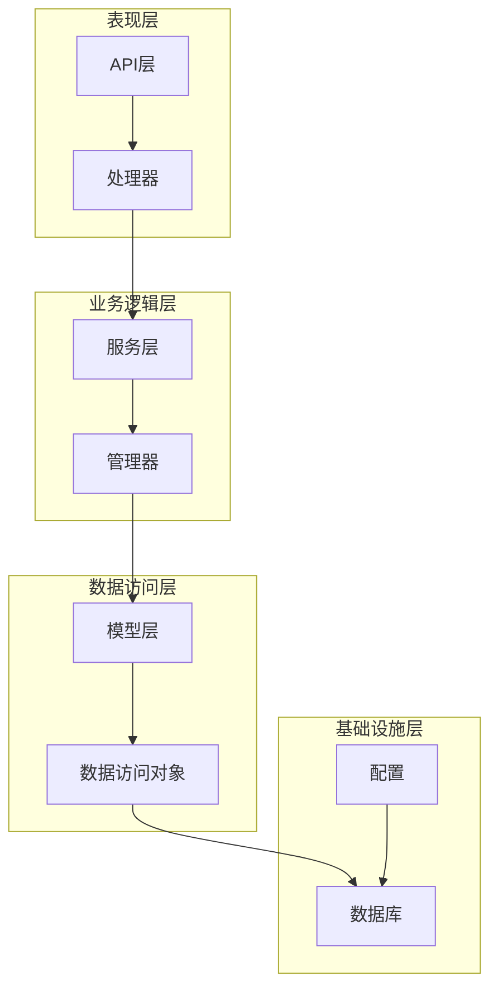

**图表来源**
- [backend/internal/model/user_model.go](file://backend/internal/model/user_model.go#L1-L243)
- [backend/internal/model/resume.go](file://backend/internal/model/resume.go#L1-L170)
- [backend/internal/model/interview_record.go](file://backend/internal/model/interview_record.go#L1-L128)

## 核心组件

### 数据库初始化与连接

系统通过统一的数据库初始化机制建立连接，并自动迁移所有模型结构：

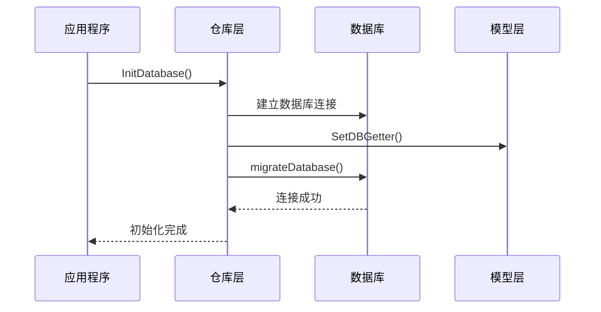

**图表来源**
- [backend/internal/repository/database.go](file://backend/internal/repository/database.go#L18-L60)
- [backend/internal/model/user_model.go](file://backend/internal/model/user_model.go#L9-L26)

### 事务管理机制

系统提供了统一的事务管理工具，确保数据一致性：

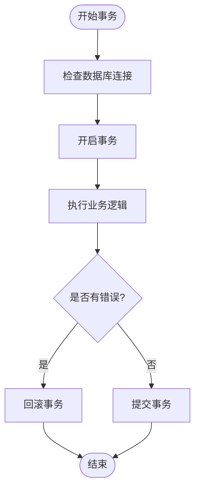

**图表来源**
- [backend/internal/model/transaction.go](file://backend/internal/model/transaction.go#L11-L58)

**章节来源**
- [backend/internal/repository/database.go](file://backend/internal/repository/database.go#L18-L80)
- [backend/internal/model/transaction.go](file://backend/internal/model/transaction.go#L1-L58)

## 架构概览

系统采用模块化设计，每个核心模型都有独立的数据访问对象(DAO)和业务服务实现：

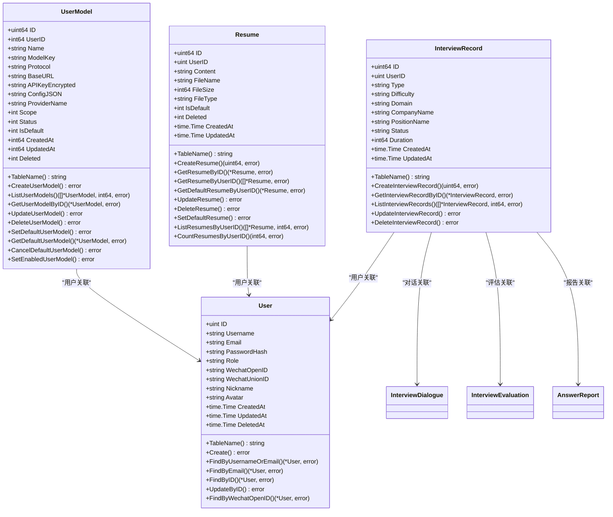

**图表来源**
- [backend/internal/model/user_model.go](file://backend/internal/model/user_model.go#L33-L52)
- [backend/internal/model/resume.go](file://backend/internal/model/resume.go#L13-L24)
- [backend/internal/model/interview_record.go](file://backend/internal/model/interview_record.go#L13-L25)
- [backend/internal/model/user.go](file://backend/internal/model/user.go#L15-L28)

## 详细组件分析

### 用户模型(UserModel)

用户模型用于管理用户配置的AI模型信息，支持多模型管理和默认模型设置。

#### 字段定义与约束

| 字段名 | 类型 | 约束 | 描述 |
|--------|------|------|------|
| ID | uint64 | 主键, 自增 | 用户模型ID |
| UserID | int64 | 非空, 索引 | 关联用户ID |
| Name | string | 非空, 长度128 | 模型显示名称 |
| ModelKey | string | 非空, 长度128 | 模型标识符 |
| Protocol | string | 非空, 长度64 | 协议类型 |
| BaseURL | string | 非空, 长度255 | API基础地址 |
| APIKeyEncrypted | string | 非空, 文本类型 | 加密后的API密钥 |
| ConfigJSON | string | JSON类型 | 额外配置信息 |
| SecretHint | string | 默认空字符串, 长度32 | 密钥脱敏提示 |
| ProviderName | string | 非空, 长度64 | 提供商名称 |
| MetaID | int64 | 默认0 | 关联全局模型元数据ID |
| DefaultParams | string | JSON类型 | 默认参数配置 |
| Scope | int | 非空, 默认7 | 使用范围(位掩码) |
| Status | int | 非空, 默认1 | 状态(0=禁用, 1=启用) |
| IsDefault | int | 非空, 默认0 | 是否为默认模型 |
| CreatedAt | int64 | 非空, 默认0 | 创建时间(毫秒) |
| UpdatedAt | int64 | 非空, 默认0 | 更新时间(毫秒) |
| Deleted | int | 非空, 默认0 | 删除状态 |

#### GORM标签使用

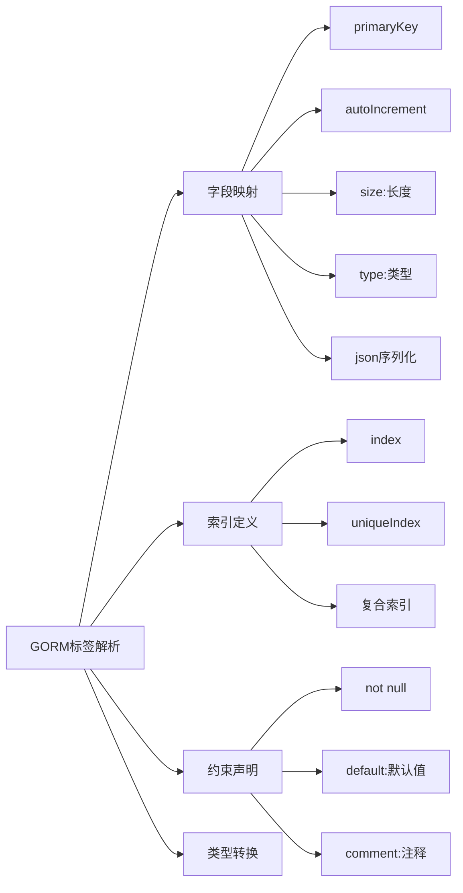

**图表来源**
- [backend/internal/model/user_model.go](file://backend/internal/model/user_model.go#L34-L51)

#### 业务规则实现

系统实现了完整的用户模型生命周期管理：

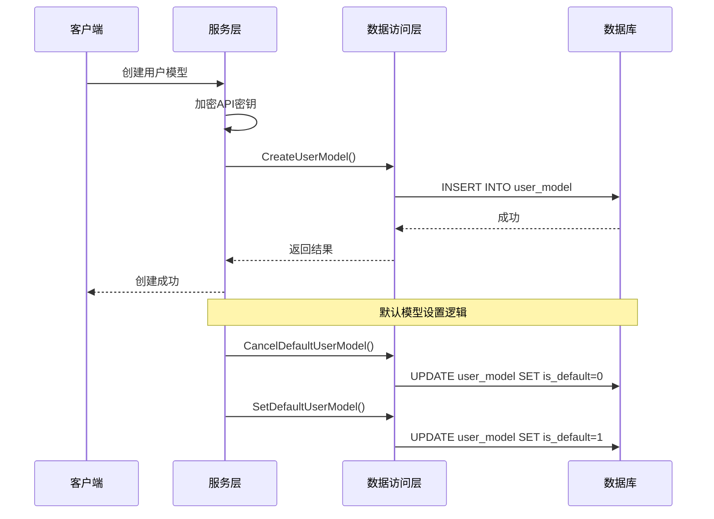

**图表来源**
- [backend/internal/service/user/impl/user_model_impl.go](file://backend/internal/service/user/impl/user_model_impl.go#L20-L89)
- [backend/internal/model/user_model.go](file://backend/internal/model/user_model.go#L60-L173)

**章节来源**
- [backend/internal/model/user_model.go](file://backend/internal/model/user_model.go#L1-L243)
- [backend/internal/service/user/impl/user_model_impl.go](file://backend/internal/service/user/impl/user_model_impl.go#L1-L225)

### 简历模型(Resume)

简历模型负责管理用户的简历信息，支持多简历管理和默认简历设置。

#### 字段定义与约束

| 字段名 | 类型 | 约束 | 描述 |
|--------|------|------|------|
| ID | uint64 | 主键, 自增 | 简历ID |
| UserID | uint | 非空, 索引 | 关联用户ID |
| Content | string | 非空, 长文本 | 简历内容 |
| FileName | string | 长度255 | 原始文件名 |
| FileSize | int64 | 默认0 | 文件大小(字节) |
| FileType | string | 长度50 | 文件类型(pdf/doc/txt等) |
| IsDefault | int | 默认0 | 是否为默认简历(0-否, 1-是) |
| Deleted | int | 默认0, 索引 | 删除标记(0-未删除, 1-已删除) |
| CreatedAt | time.Time | 自动创建时间(毫秒) | 创建时间 |
| UpdatedAt | time.Time | 自动更新时间(毫秒) | 更新时间 |

#### 查询优化策略

系统针对简历查询进行了专门的优化：

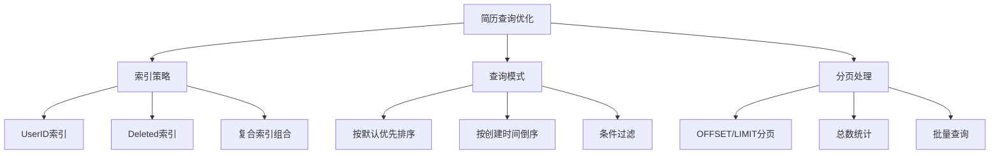

**图表来源**
- [backend/internal/model/resume.go](file://backend/internal/model/resume.go#L56-L156)

#### 业务流程

简历管理涉及复杂的业务流程：

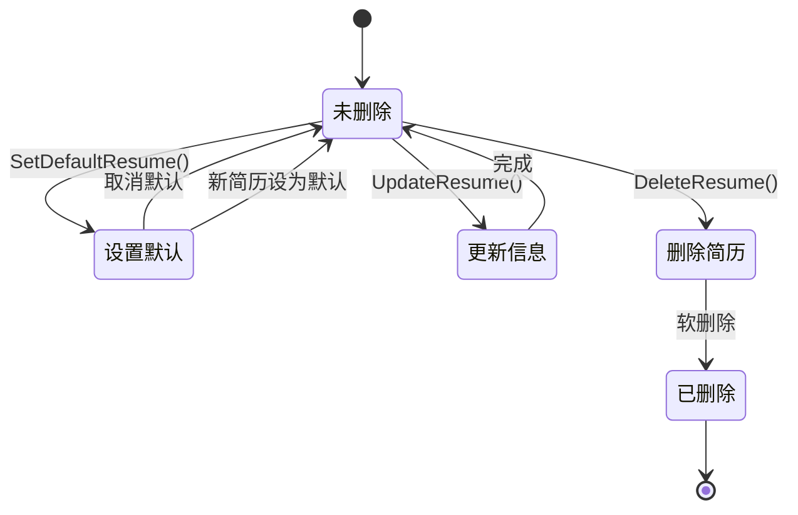

**图表来源**
- [backend/internal/model/resume.go](file://backend/internal/model/resume.go#L112-L129)

**章节来源**
- [backend/internal/model/resume.go](file://backend/internal/model/resume.go#L1-L170)
- [backend/internal/service/interviews/impl/resume_manager_impl.go](file://backend/internal/service/interviews/impl/resume_manager_impl.go#L81-L262)

### 面试记录模型(InterviewRecord)

面试记录模型用于跟踪用户的面试历史和状态。

#### 字段定义与约束

| 字段名 | 类型 | 约束 | 描述 |
|--------|------|------|------|
| ID | uint64 | 主键, 自增 | 面试记录ID |
| UserID | uint | 非空, 索引 | 关联用户ID |
| Type | string | 非空, 长度255 | 面试类型(综合面试、专项面试) |
| Difficulty | string | 非空, 长度128 | 难度级别(简单、中等、困难) |
| Domain | string | 非空, 长度255 | 面试领域(校招、社招；java、golang) |
| CompanyName | string | 长度128 | 公司名称 |
| PositionName | string | 长度128 | 岗位名称 |
| Status | string | 非空, 长度50, 默认'pending' | 面试状态(pending/completed) |
| Duration | int64 | 默认0 | 面试耗时(秒) |
| CreatedAt | time.Time | 自动创建时间(毫秒) | 创建时间 |
| UpdatedAt | time.Time | 自动更新时间(毫秒) | 更新时间 |

#### 状态管理

面试记录的状态流转遵循严格的业务规则：

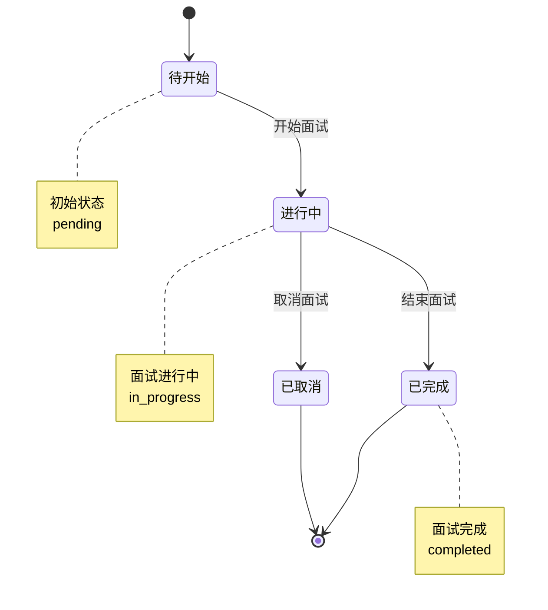

**图表来源**
- [backend/internal/model/interview_record.go](file://backend/internal/model/interview_record.go#L21)

#### 数据完整性保证

系统通过多种机制确保数据完整性：

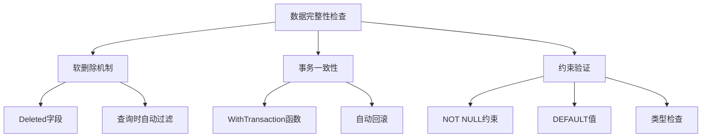

**图表来源**
- [backend/internal/model/transaction.go](file://backend/internal/model/transaction.go#L11-L58)

**章节来源**
- [backend/internal/model/interview_record.go](file://backend/internal/model/interview_record.go#L1-L128)
- [backend/internal/service/interviews/impl/interview_impl.go](file://backend/internal/service/interviews/impl/interview_impl.go#L19-L240)

## 依赖关系分析

### 模型间关联关系

系统中的核心模型之间存在明确的关联关系：

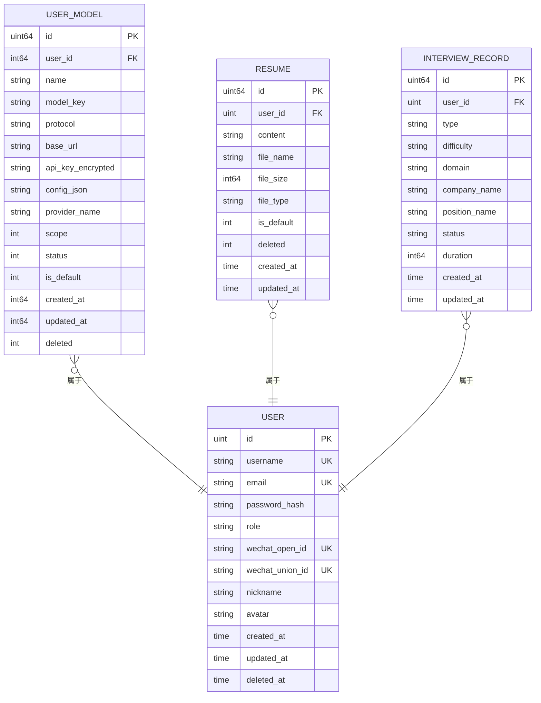

**图表来源**
- [backend/internal/model/user.go](file://backend/internal/model/user.go#L15-L28)
- [backend/internal/model/user_model.go](file://backend/internal/model/user_model.go#L33-L52)
- [backend/internal/model/resume.go](file://backend/internal/model/resume.go#L13-L24)
- [backend/internal/model/interview_record.go](file://backend/internal/model/interview_record.go#L13-L25)

### 外键约束与级联操作

系统通过GORM的关联特性实现数据的一致性：

| 关系 | 外键字段 | 约束类型 | 级联行为 |
|------|----------|----------|----------|
| UserModel.User | user_id | 外键 | 无级联 |
| Resume.User | user_id | 外键 | 无级联 |
| InterviewRecord.User | user_id | 外键 | 无级联 |
| InterviewDialogue.User | user_id | 外键 | 无级联 |
| InterviewEvaluation.User | user_id | 外键 | 无级联 |
| AnswerReport.User | user_id | 外键 | 无级联 |

### 查询优化策略

系统采用了多种查询优化技术：

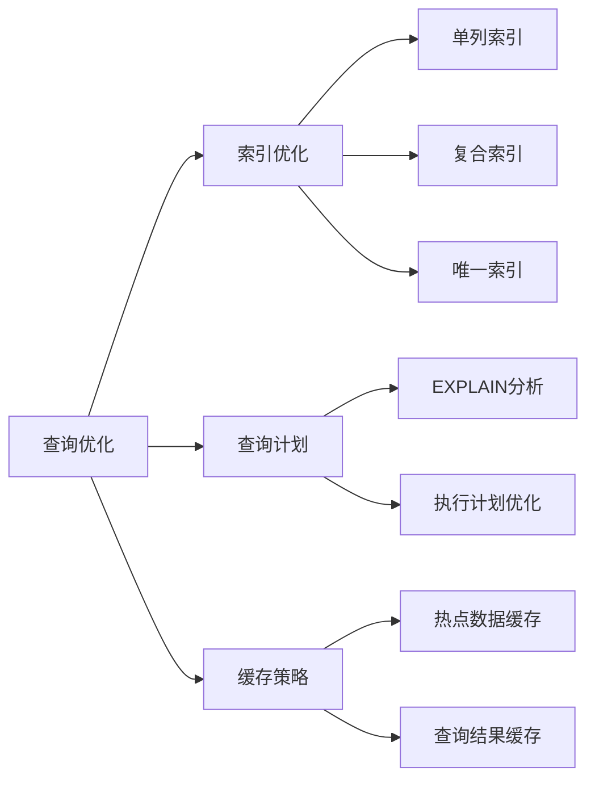

**图表来源**
- [backend/internal/model/resume.go](file://backend/internal/model/resume.go#L132-L156)
- [backend/internal/model/interview_record.go](file://backend/internal/model/interview_record.go#L58-L81)

**章节来源**
- [backend/internal/model/user.go](file://backend/internal/model/user.go#L1-L116)
- [backend/internal/model/interview_dialogue.go](file://backend/internal/model/interview_dialogue.go#L1-L46)
- [backend/internal/model/interview_evaluation.go](file://backend/internal/model/interview_evaluation.go#L1-L100)
- [backend/internal/model/answer_report.go](file://backend/internal/model/answer_report.go#L1-L121)

## 性能考虑

### 数据库连接池配置

系统通过合理的连接池配置提升数据库性能：

- 最大空闲连接数：根据并发需求动态调整
- 最大打开连接数：限制数据库连接上限
- 连接最大生存时间：防止连接泄漏

### 查询性能优化

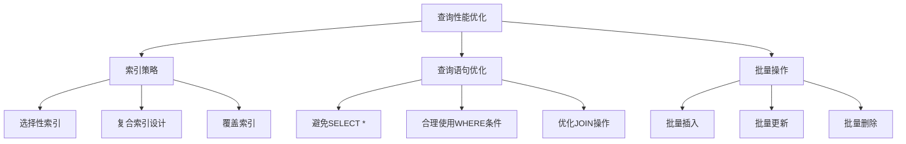

### 缓存策略

系统采用多层次缓存策略：
- 热点数据缓存
- 查询结果缓存
- 配置信息缓存

## 故障排除指南

### 常见问题及解决方案

#### 数据库连接问题

**症状**：初始化数据库时出现连接错误
**原因**：DSN配置错误或数据库服务不可用
**解决方案**：
1. 检查数据库连接字符串
2. 验证数据库服务状态
3. 确认网络连接正常

#### 模型迁移失败

**症状**：启动时模型迁移报错
**原因**：数据库权限不足或表结构冲突
**解决方案**：
1. 检查数据库用户权限
2. 备份现有数据
3. 手动清理冲突表结构

#### 事务处理异常

**症状**：事务执行过程中出现回滚
**原因**：业务逻辑错误或数据库约束冲突
**解决方案**：
1. 检查业务逻辑正确性
2. 验证数据约束条件
3. 使用WithTransaction函数确保一致性

**章节来源**
- [backend/internal/repository/database.go](file://backend/internal/repository/database.go#L18-L80)
- [backend/internal/model/transaction.go](file://backend/internal/model/transaction.go#L11-L58)

## 结论

本核心数据模型设计充分体现了现代Web应用的数据架构要求，通过合理的模型设计、完善的约束机制和优化的查询策略，为面试Agent平台提供了稳定可靠的数据基础。系统支持多模型管理、多简历处理和完整的面试流程跟踪，能够满足复杂业务场景的需求。

关键设计亮点包括：
- 清晰的模型职责划分和关联关系
- 完善的事务管理和数据一致性保证
- 针对性的查询优化和索引策略
- 灵活的扩展性和维护性设计

这些特性共同确保了系统的高性能、高可用和易维护性，为后续功能扩展奠定了坚实的基础。