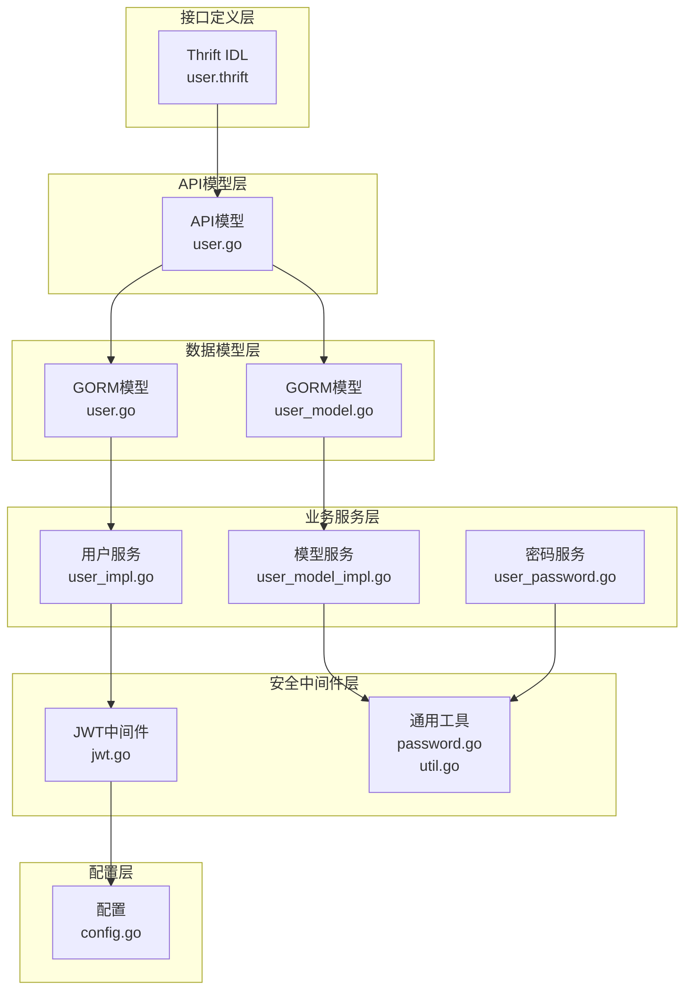
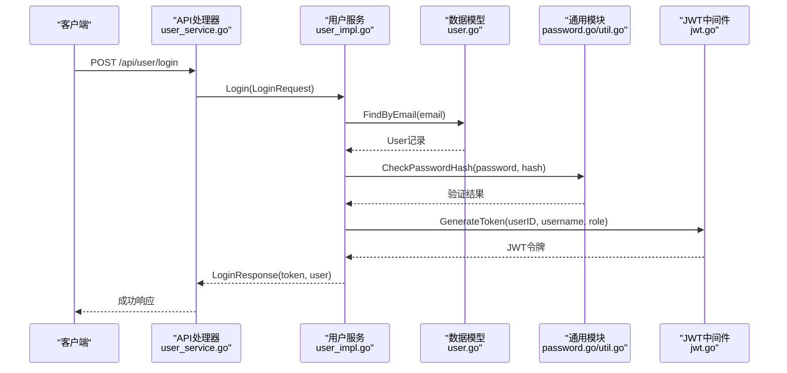
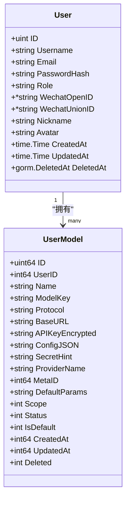
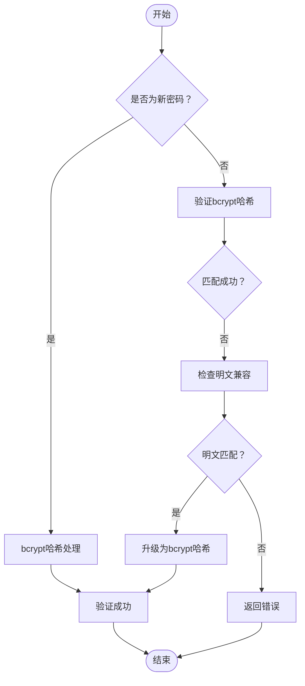
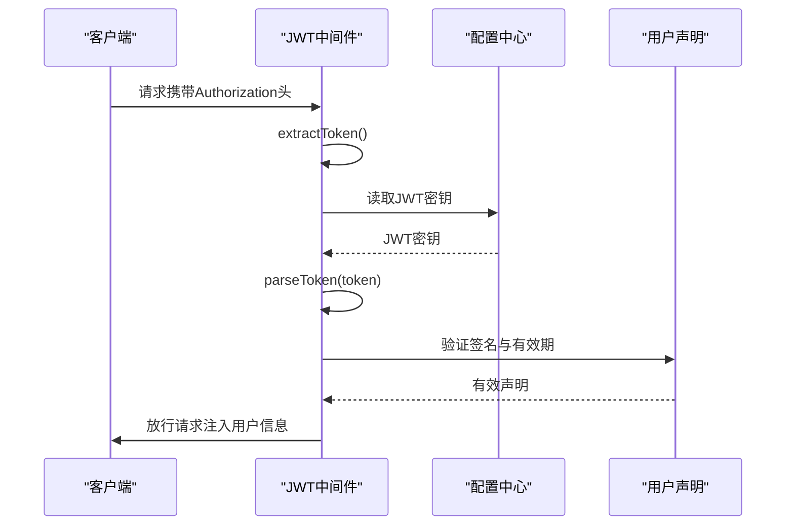
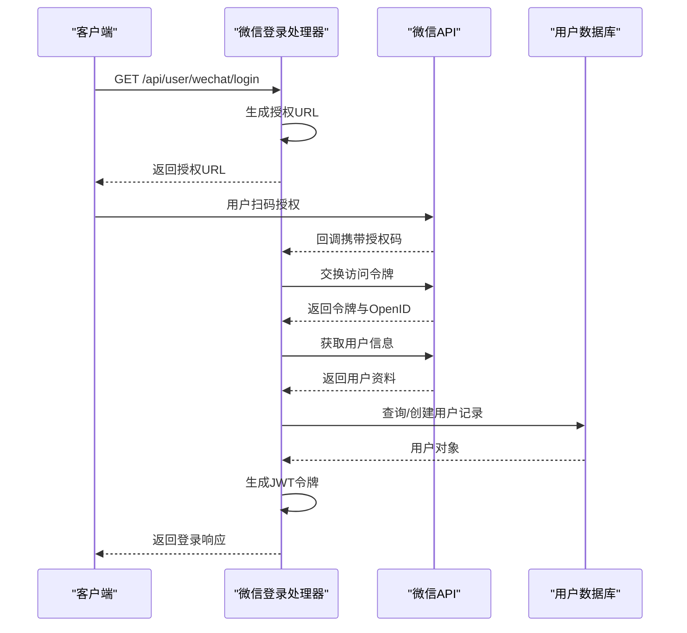
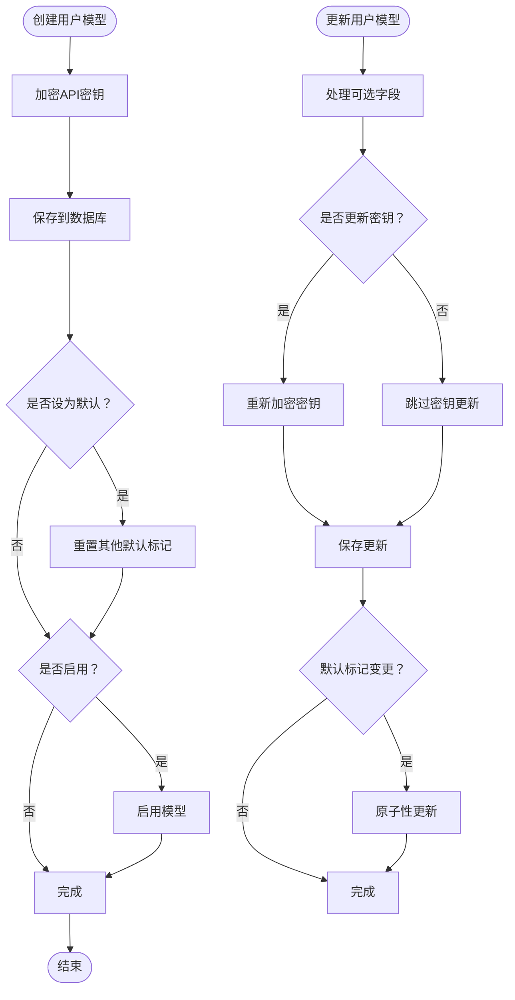
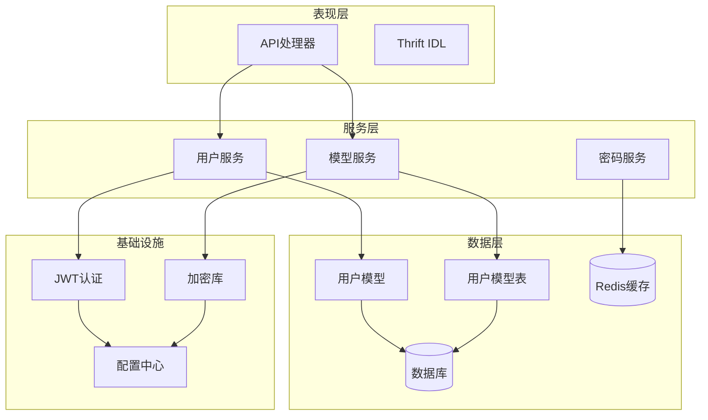

# 用户认证数据模型

<cite>
**本文档引用的文件**
- [backend/internal/model/user.go](file://backend/internal/model/user.go)
- [backend/internal/model/user_model.go](file://backend/internal/model/user_model.go)
- [backend/idl/user/user.thrift](file://backend/idl/user/user.thrift)
- [backend/api/model/user/user.go](file://backend/api/model/user/user.go)
- [backend/api/handler/interview/user_service.go](file://backend/api/handler/interview/user_service.go)
- [backend/internal/service/user/interface.go](file://backend/internal/service/user/interface.go)
- [backend/internal/service/user/impl/user_impl.go](file://backend/internal/service/user/impl/user_impl.go)
- [backend/internal/service/user/impl/user_model_impl.go](file://backend/internal/service/user/impl/user_model_impl.go)
- [backend/internal/service/user/impl/user_password.go](file://backend/internal/service/user/impl/user_password.go)
- [backend/internal/service/common/password.go](file://backend/internal/service/common/password.go)
- [backend/internal/service/common/util.go](file://backend/internal/service/common/util.go)
- [backend/internal/middleware/jwt.go](file://backend/internal/middleware/jwt.go)
- [backend/internal/config/config.go](file://backend/internal/config/config.go)
</cite>

## 目录
1. [简介](#简介)
2. [项目结构](#项目结构)
3. [核心组件](#核心组件)
4. [架构概览](#架构概览)
5. [详细组件分析](#详细组件分析)
6. [依赖关系分析](#依赖关系分析)
7. [性能考虑](#性能考虑)
8. [故障排除指南](#故障排除指南)
9. [结论](#结论)

## 简介
本文件详细阐述了Go面试Agent平台的用户认证相关数据模型，涵盖用户基本信息模型、密码管理机制、认证流程支撑、账户状态与权限等级设计、安全字段实现、第三方登录集成以及会话管理与安全审计等方面。通过对Thrift IDL、GORM模型、服务层实现和中间件的综合分析，为开发者提供全面的技术参考。

## 项目结构
用户认证相关的代码分布在以下层次：
- 接口定义层：Thrift IDL定义了用户认证相关的数据结构与服务接口
- API模型层：基于Thrift生成的API模型，用于HTTP请求/响应的数据传输
- 数据模型层：GORM模型定义数据库表结构与字段约束
- 业务服务层：用户管理与模型管理的具体实现
- 安全中间件层：JWT认证中间件与工具函数
- 配置层：安全配置与第三方服务配置

**图表来源**
- [backend/idl/user/user.thrift](file://backend/idl/user/user.thrift#L1-L316)
- [backend/api/model/user/user.go](file://backend/api/model/user/user.go#L1-L800)
- [backend/internal/model/user.go](file://backend/internal/model/user.go#L1-L116)
- [backend/internal/model/user_model.go](file://backend/internal/model/user_model.go#L1-L243)
- [backend/internal/service/user/impl/user_impl.go](file://backend/internal/service/user/impl/user_impl.go#L1-L365)
- [backend/internal/service/user/impl/user_model_impl.go](file://backend/internal/service/user/impl/user_model_impl.go#L1-L225)
- [backend/internal/service/user/impl/user_password.go](file://backend/internal/service/user/impl/user_password.go#L1-L97)
- [backend/internal/middleware/jwt.go](file://backend/internal/middleware/jwt.go#L1-L215)
- [backend/internal/service/common/password.go](file://backend/internal/service/common/password.go#L1-L18)
- [backend/internal/service/common/util.go](file://backend/internal/service/common/util.go#L1-L42)
- [backend/internal/config/config.go](file://backend/internal/config/config.go#L113-L118)

**章节来源**
- [backend/idl/user/user.thrift](file://backend/idl/user/user.thrift#L1-L316)
- [backend/internal/model/user.go](file://backend/internal/model/user.go#L1-L116)
- [backend/internal/model/user_model.go](file://backend/internal/model/user_model.go#L1-L243)

## 核心组件
本节概述用户认证的核心数据模型与关键字段设计。

- 用户基本信息模型（User）
  - 主键ID：自增整型，唯一标识用户
  - 用户名：唯一索引，长度限制，非空
  - 邮箱：唯一索引，长度限制，非空
  - 密码哈希：存储bcrypt加密后的密码，长度限制，非空
  - 角色：字符串，长度限制，默认值为普通用户
  - 微信OpenID：唯一索引，长度限制，支持第三方登录
  - 微信UnionID：唯一索引，长度限制，支持多平台统一身份
  - 昵称与头像：字符串，长度限制，存储第三方登录用户信息
  - 时间戳：创建与更新时间，软删除支持

- 用户模型模型（UserModel）
  - 主键ID：自增整型，唯一标识用户模型
  - 用户ID：外键关联用户表，非空
  - 名称与模型标识：字符串，长度限制，非空
  - 协议类型与基础URL：字符串，长度限制，非空
  - 加密API密钥：文本类型，存储加密后的第三方API密钥
  - 额外配置：JSON类型，存储区域、访问密钥等配置
  - 密钥脱敏提示：字符串，用于前端显示密钥摘要
  - 提供商名称：字符串，长度限制，非空
  - 元数据ID：整型，关联全局模型元数据
  - 默认参数：JSON类型，存储温度、最大令牌数等参数
  - 使用范围：整型，位掩码，支持智能体、应用、工作流
  - 状态：整型，0禁用/1启用，默认启用
  - 默认标记：整型，0否/1是，默认否
  - 时间戳：毫秒时间戳，创建与更新时间
  - 删除状态：整型，0未删除/1已删除，默认未删除

**章节来源**
- [backend/internal/model/user.go](file://backend/internal/model/user.go#L11-L29)
- [backend/internal/model/user_model.go](file://backend/internal/model/user_model.go#L30-L53)

## 架构概览
用户认证的整体架构采用分层设计，通过Thrift IDL定义接口契约，GORM模型映射数据库，服务层实现业务逻辑，JWT中间件提供认证保障。

**图表来源**
- [backend/api/handler/interview/user_service.go](file://backend/api/handler/interview/user_service.go#L238-L262)
- [backend/internal/service/user/impl/user_impl.go](file://backend/internal/service/user/impl/user_impl.go#L67-L93)
- [backend/internal/service/common/password.go](file://backend/internal/service/common/password.go#L13-L17)
- [backend/internal/middleware/jwt.go](file://backend/internal/middleware/jwt.go#L80-L113)

## 详细组件分析

### 用户基本信息模型（User）
用户模型设计遵循最小必要原则，同时支持第三方登录扩展。关键设计要点包括：
- 唯一性约束：用户名与邮箱均建立唯一索引，避免重复
- 密码安全：仅存储哈希值，不保存明文密码
- 第三方登录：通过微信OpenID/UnionID支持多平台统一身份
- 角色管理：内置角色字段，便于权限控制扩展
- 时间追踪：内置创建与更新时间戳，支持审计需求

**图表来源**
- [backend/internal/model/user.go](file://backend/internal/model/user.go#L11-L29)
- [backend/internal/model/user_model.go](file://backend/internal/model/user_model.go#L30-L53)

**章节来源**
- [backend/internal/model/user.go](file://backend/internal/model/user.go#L11-L29)

### 密码管理机制与安全验证
密码管理采用bcrypt哈希算法，确保密码存储的安全性。同时支持明文兼容迁移机制，逐步升级历史数据。

- 密码加密
  - 使用bcrypt对新密码进行哈希处理
  - 采用高成本因子（14）增强安全性
  - 返回哈希字符串供持久化存储

- 密码验证
  - 验证输入密码与存储哈希是否匹配
  - 支持明文兼容：对历史明文密码进行自动升级
  - 升级后更新为bcrypt哈希值

- API密钥加密
  - 使用AES-CBC对第三方API密钥进行加密存储
  - 支持环境变量配置密钥，提供默认密钥作为回退
  - 解密过程支持向后兼容

**图表来源**
- [backend/internal/service/common/password.go](file://backend/internal/service/common/password.go#L7-L17)
- [backend/internal/service/user/impl/user_impl.go](file://backend/internal/service/user/impl/user_impl.go#L76-L85)
- [backend/internal/service/common/util.go](file://backend/internal/service/common/util.go#L26-L42)

**章节来源**
- [backend/internal/service/common/password.go](file://backend/internal/service/common/password.go#L1-L18)
- [backend/internal/service/user/impl/user_impl.go](file://backend/internal/service/user/impl/user_impl.go#L76-L85)
- [backend/internal/service/common/util.go](file://backend/internal/service/common/util.go#L1-L42)

### 认证流程与会话管理
认证流程采用JWT令牌机制，结合中间件实现无状态认证。

- 令牌生成
  - 基于用户ID、用户名和角色生成JWT
  - 支持配置过期时间，默认24小时
  - 使用对称签名算法（HS256）保证完整性

- 令牌验证
  - 支持多种令牌传递方式：Authorization头、X-Auth-Token头、查询参数、Cookie
  - 解析并验证签名有效性
  - 提取用户声明信息到请求上下文

- 中间件集成
  - 提供可跳过的中间件变体，支持白名单路径
  - 自动注入用户ID、用户名、角色到上下文
  - 统一的错误处理与响应格式

**图表来源**
- [backend/internal/middleware/jwt.go](file://backend/internal/middleware/jwt.go#L32-L78)
- [backend/internal/middleware/jwt.go](file://backend/internal/middleware/jwt.go#L115-L134)
- [backend/internal/middleware/jwt.go](file://backend/internal/middleware/jwt.go#L186-L214)
- [backend/internal/config/config.go](file://backend/internal/config/config.go#L113-L118)

**章节来源**
- [backend/internal/middleware/jwt.go](file://backend/internal/middleware/jwt.go#L1-L215)
- [backend/internal/config/config.go](file://backend/internal/config/config.go#L113-L118)

### 第三方登录集成（微信）
系统支持微信第三方登录，通过OAuth流程完成用户身份验证与信息同步。

- 登录流程
  - 生成微信授权URL，包含应用ID、回调地址、授权范围等参数
  - 用户扫码授权后，微信回调携带授权码
  - 通过授权码换取访问令牌与用户信息
  - 同步用户信息到本地数据库，支持UnionID关联

- 用户同步策略
  - 若本地存在对应OpenID用户，直接登录
  - 若不存在，创建新用户记录，用户名基于OpenID生成
  - 更新用户昵称、头像等信息，完善个人资料

**图表来源**
- [backend/api/handler/interview/user_service.go](file://backend/api/handler/interview/user_service.go#L337-L356)
- [backend/api/handler/interview/user_service.go](file://backend/api/handler/interview/user_service.go#L358-L382)
- [backend/internal/service/user/impl/user_impl.go](file://backend/internal/service/user/impl/user_impl.go#L119-L157)

**章节来源**
- [backend/api/handler/interview/user_service.go](file://backend/api/handler/interview/user_service.go#L337-L382)
- [backend/internal/service/user/impl/user_impl.go](file://backend/internal/service/user/impl/user_impl.go#L119-L157)

### 用户模型管理与API密钥安全
用户模型管理支持多供应商、多协议的第三方服务配置，同时确保敏感信息的安全存储。

- 模型创建流程
  - API密钥加密存储，防止明文泄露
  - 默认启用状态，支持范围配置（智能体/应用/工作流）
  - 默认模型标记，支持多模型场景下的主配置选择

- 模型更新与删除
  - 支持选择性字段更新，避免不必要的覆盖
  - 软删除机制，保留历史记录用于审计
  - 默认模型切换时的原子性事务处理

- 密钥管理
  - AES-CBC加密算法，支持环境变量配置密钥
  - 解密过程向后兼容，支持历史数据平滑迁移
  - 脱敏显示，前端仅展示密钥摘要信息

**图表来源**
- [backend/internal/service/user/impl/user_model_impl.go](file://backend/internal/service/user/impl/user_model_impl.go#L20-L89)
- [backend/internal/service/user/impl/user_model_impl.go](file://backend/internal/service/user/impl/user_model_impl.go#L117-L199)
- [backend/internal/service/common/util.go](file://backend/internal/service/common/util.go#L26-L42)

**章节来源**
- [backend/internal/service/user/impl/user_model_impl.go](file://backend/internal/service/user/impl/user_model_impl.go#L1-L225)
- [backend/internal/service/common/util.go](file://backend/internal/service/common/util.go#L1-L42)

### 密码找回与安全审计
系统提供完整的密码找回流程，结合Redis缓存实现安全的临时令牌机制。

- 密码找回流程
  - 验证邮箱存在性，防止枚举攻击
  - 生成UUID作为重置令牌，设置15分钟过期时间
  - 通过邮件发送重置链接，包含令牌参数
  - Redis缓存令牌与邮箱映射，确保一次性使用

- 安全审计要点
  - 令牌过期时间短，降低泄露风险
  - 邮件内容包含明确的时效性提示
  - 重置完成后立即删除令牌缓存
  - 错误处理统一，不泄露内部信息

**章节来源**
- [backend/internal/service/user/impl/user_password.go](file://backend/internal/service/user/impl/user_password.go#L20-L58)
- [backend/internal/service/user/impl/user_password.go](file://backend/internal/service/user/impl/user_password.go#L60-L97)

## 依赖关系分析
用户认证系统的依赖关系呈现清晰的分层结构，各层职责明确，耦合度低。

**图表来源**
- [backend/api/handler/interview/user_service.go](file://backend/api/handler/interview/user_service.go#L1-L420)
- [backend/internal/service/user/interface.go](file://backend/internal/service/user/interface.go#L1-L63)
- [backend/internal/model/user.go](file://backend/internal/model/user.go#L1-L116)
- [backend/internal/model/user_model.go](file://backend/internal/model/user_model.go#L1-L243)
- [backend/internal/middleware/jwt.go](file://backend/internal/middleware/jwt.go#L1-L215)

**章节来源**
- [backend/api/handler/interview/user_service.go](file://backend/api/handler/interview/user_service.go#L1-L420)
- [backend/internal/service/user/interface.go](file://backend/internal/service/user/interface.go#L1-L63)

## 性能考虑
- 数据库索引优化
  - 用户名与邮箱建立唯一索引，提升查询性能
  - 用户模型表按用户ID建立索引，支持快速定位
  - 软删除字段建立索引，便于审计查询

- 缓存策略
  - JWT令牌无需数据库查询，减少数据库压力
  - 密码重置令牌使用Redis缓存，支持高并发场景
  - 缓存过期时间合理设置，平衡性能与安全性

- 加密性能
  - bcrypt成本因子经过性能测试，确保安全性与响应时间平衡
  - API密钥加密采用批量处理，避免阻塞主线程

## 故障排除指南
- 认证失败
  - 检查Authorization头格式是否正确（Bearer token）
  - 验证JWT密钥配置是否正确
  - 确认令牌未过期或被篡改

- 密码错误
  - 确认输入密码与用户记录匹配
  - 检查是否为历史明文密码，系统会自动升级
  - 验证bcrypt库版本兼容性

- 第三方登录异常
  - 检查微信应用配置（AppID/AppSecret/回调地址）
  - 验证网络连通性，确保能访问微信API
  - 查看回调参数是否完整传递

- 数据库连接问题
  - 检查数据库DSN配置
  - 验证连接池参数设置
  - 确认GORM连接初始化完成

**章节来源**
- [backend/internal/middleware/jwt.go](file://backend/internal/middleware/jwt.go#L26-L30)
- [backend/internal/service/user/impl/user_impl.go](file://backend/internal/service/user/impl/user_impl.go#L76-L85)
- [backend/internal/service/user/impl/user_impl.go](file://backend/internal/service/user/impl/user_impl.go#L120-L129)

## 结论
本用户认证数据模型通过清晰的分层设计、完善的安全机制和灵活的扩展能力，为Go面试Agent平台提供了可靠的身份认证与授权基础。模型设计兼顾了安全性、性能与可维护性，支持多供应商API密钥管理与第三方登录集成，满足现代Web应用的安全需求。建议在生产环境中重点关注配置管理、密钥轮换和监控告警，持续提升系统的安全防护水平。