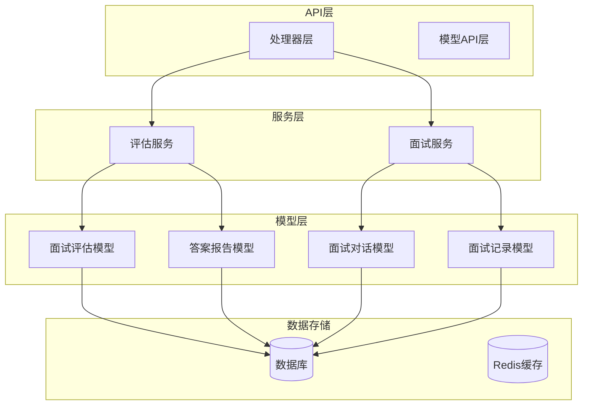
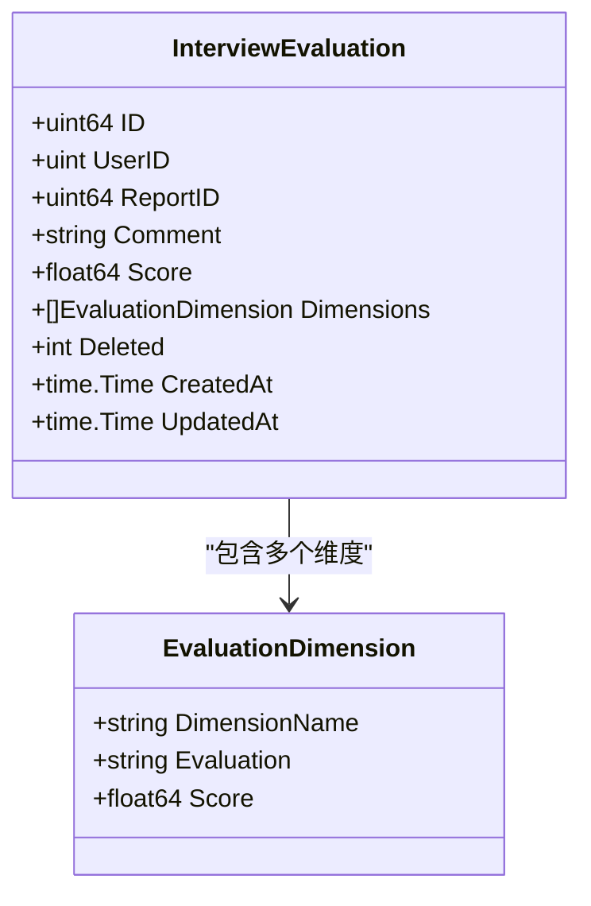
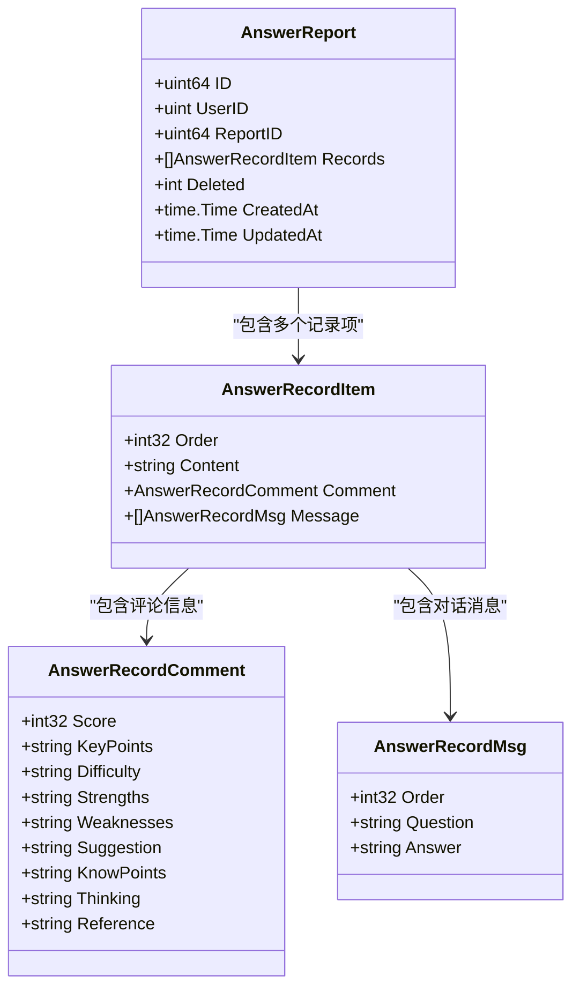
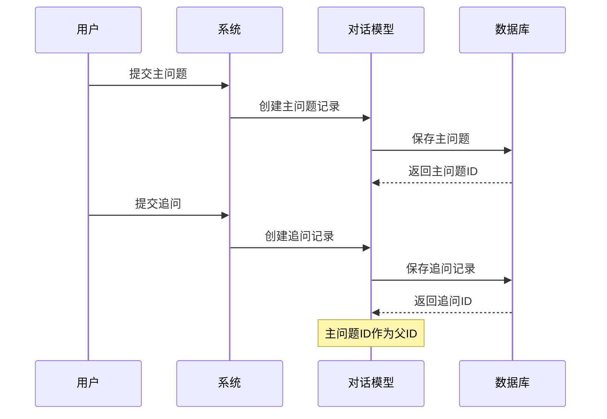
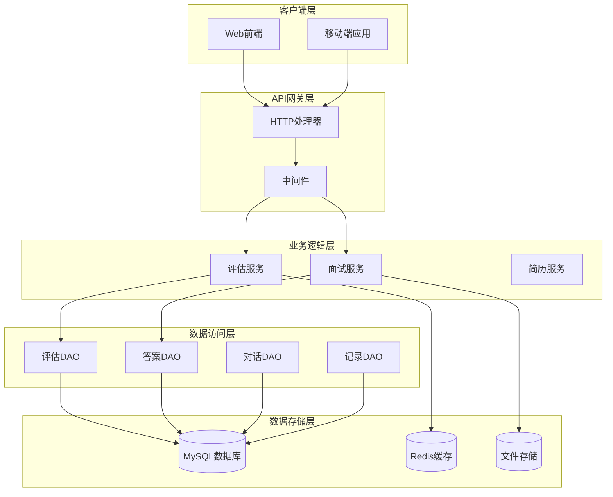
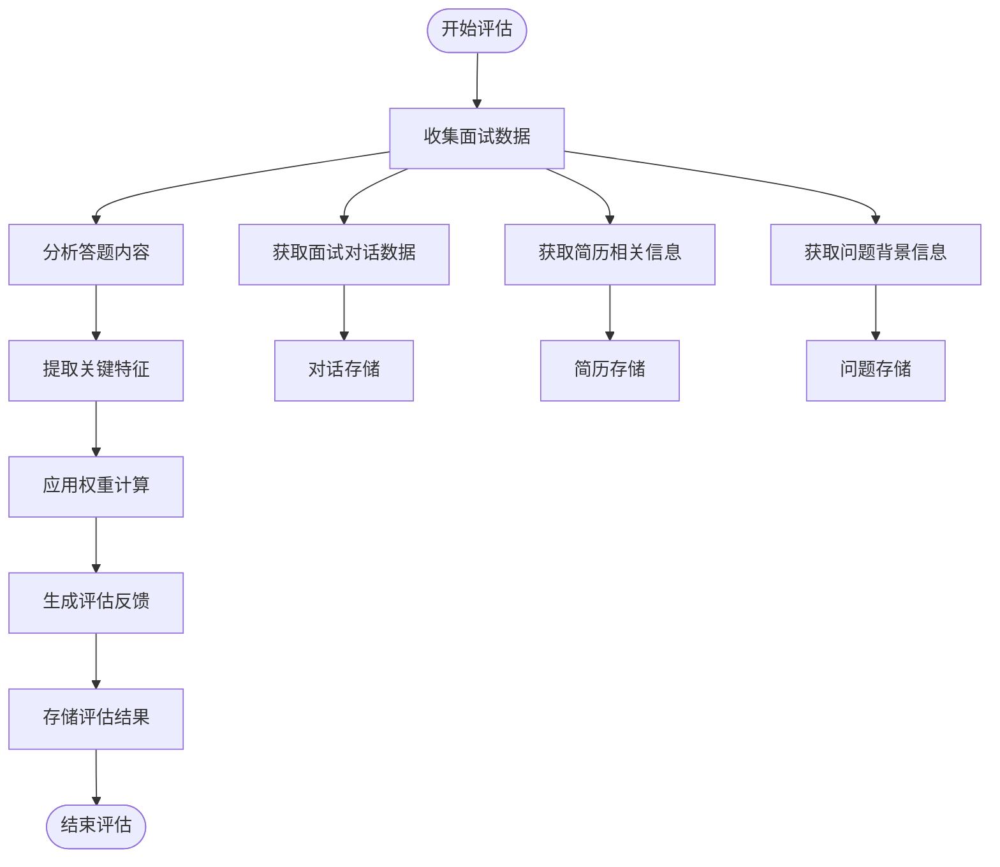
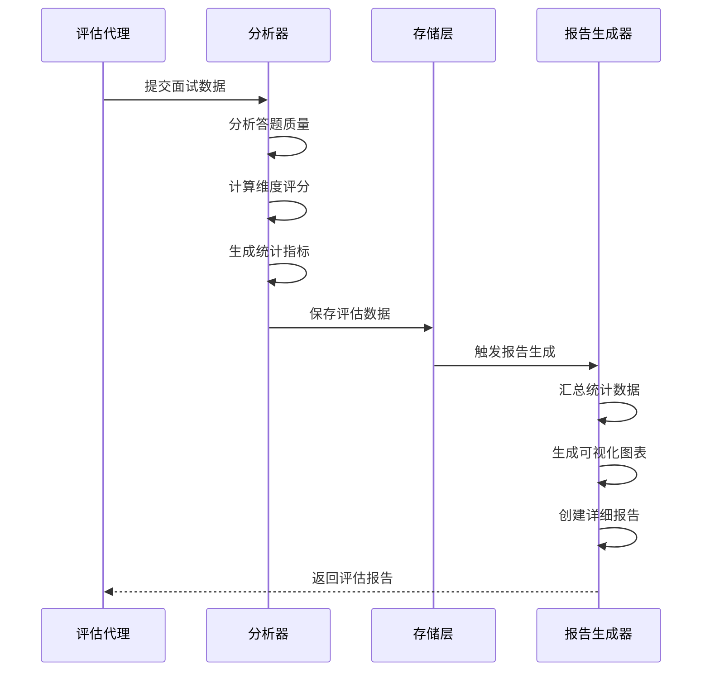
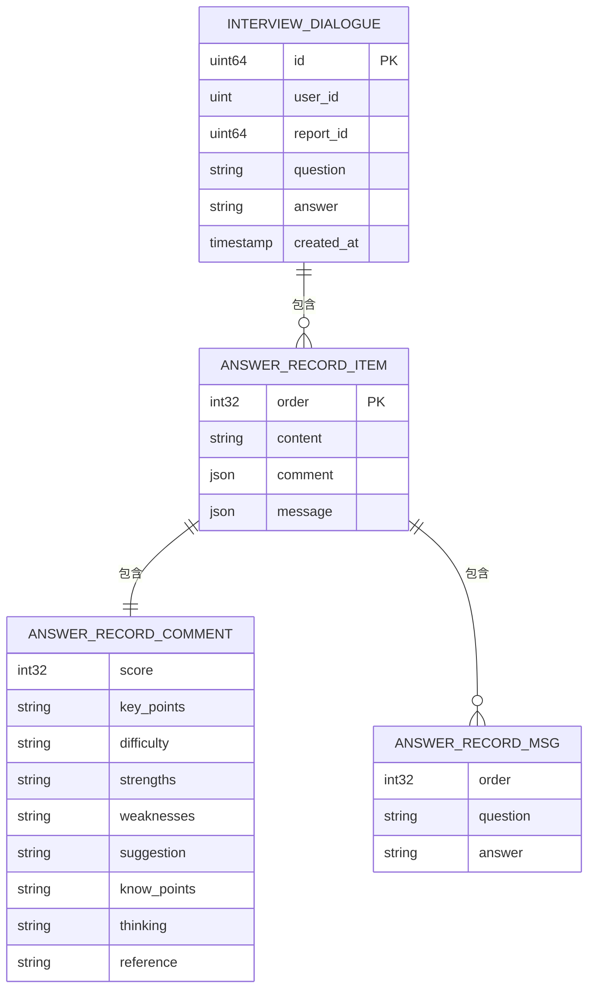
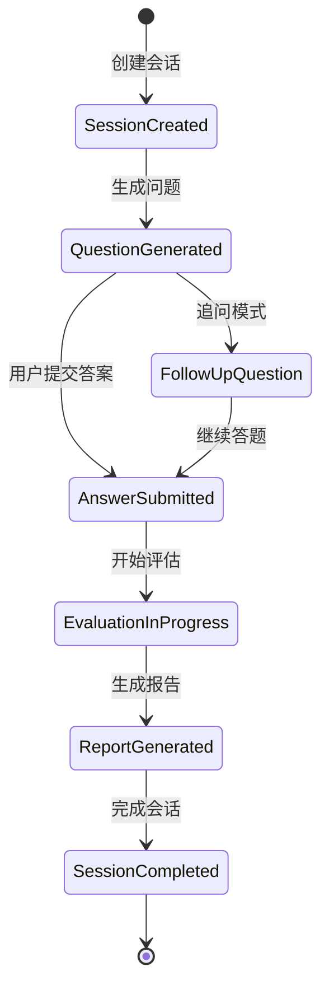
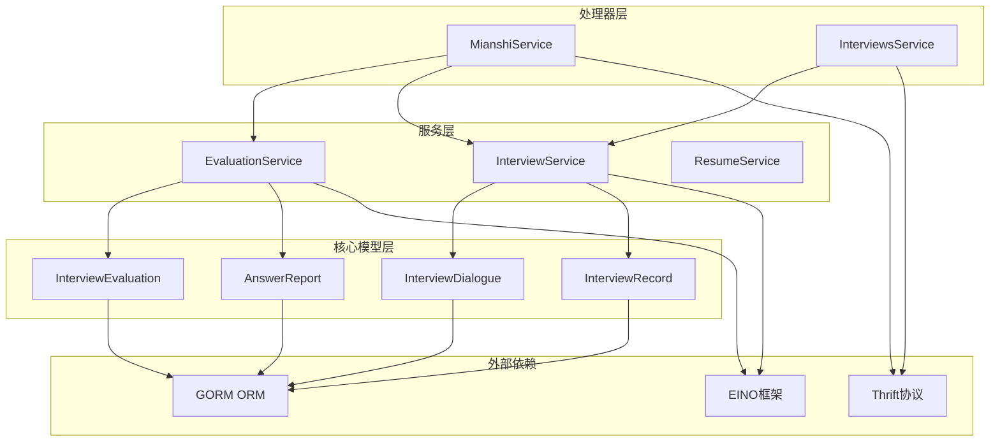

# 面试评估数据模型

<cite>
**本文档引用的文件**
- [backend/internal/model/interview_evaluation.go](file://backend/internal/model/interview_evaluation.go)
- [backend/internal/model/answer_report.go](file://backend/internal/model/answer_report.go)
- [backend/internal/model/interview_dialogue.go](file://backend/internal/model/interview_dialogue.go)
- [backend/internal/model/interview_record.go](file://backend/internal/model/interview_record.go)
- [backend/chatApp/agent_service/evaluation/answer_record_service.go](file://backend/chatApp/agent_service/evaluation/answer_record_service.go)
- [backend/chatApp/agent_service/evaluation/record_evaluation_service.go](file://backend/chatApp/agent_service/evaluation/record_evaluation_service.go)
- [backend/api/handler/interview/mianshi_service.go](file://backend/api/handler/interview/mianshi_service.go)
- [backend/internal/service/interviews/impl/interview_impl.go](file://backend/internal/service/interviews/impl/interview_impl.go)
- [backend/api/model/mianshi/mianshi.go](file://backend/api/model/mianshi/mianshi.go)
- [backend/api/model/interviews/interviews.go](file://backend/api/model/interviews/interviews.go)
</cite>

## 目录
1. [简介](#简介)
2. [项目结构](#项目结构)
3. [核心组件](#核心组件)
4. [架构概览](#架构概览)
5. [详细组件分析](#详细组件分析)
6. [依赖关系分析](#依赖关系分析)
7. [性能考虑](#性能考虑)
8. [故障排除指南](#故障排除指南)
9. [结论](#结论)

## 简介

本文档详细介绍了面试评估系统的核心数据模型，包括面试评估模型(InterviewEvaluation)、答案报告模型(AnswerReport)和面试对话模型(InterviewDialogue)的设计与实现。这些模型构成了AI智能面试平台的数据基础，支持完整的面试流程管理和评估分析。

系统采用分层架构设计，通过明确的数据模型定义和标准化的API接口，实现了从面试对话到评估报告的完整数据流转。每个模型都经过精心设计，确保数据的一致性、可扩展性和性能优化。

## 项目结构

面试评估系统采用模块化的项目结构，主要分为以下几个层次：

**图表来源**
- [backend/internal/model/interview_evaluation.go](file://backend/internal/model/interview_evaluation.go#L1-L100)
- [backend/internal/model/answer_report.go](file://backend/internal/model/answer_report.go#L1-L121)
- [backend/internal/model/interview_dialogue.go](file://backend/internal/model/interview_dialogue.go#L1-L46)

**章节来源**
- [backend/internal/model/interview_evaluation.go](file://backend/internal/model/interview_evaluation.go#L1-L100)
- [backend/internal/model/answer_report.go](file://backend/internal/model/answer_report.go#L1-L121)
- [backend/internal/model/interview_dialogue.go](file://backend/internal/model/interview_dialogue.go#L1-L46)

## 核心组件

### 面试评估模型 (InterviewEvaluation)

面试评估模型是系统的核心数据结构，用于存储和管理面试的整体评估信息。该模型采用单表存储设计，支持JSON格式的维度评估数据存储。

**关键特性：**
- 支持多维度评估，每个维度包含维度名称、评价内容和评分
- 总体评分自动计算，基于各维度评分的平均值
- 支持软删除机制，便于数据审计和恢复
- 提供完整的CRUD操作接口

**数据结构设计：**

**图表来源**
- [backend/internal/model/interview_evaluation.go](file://backend/internal/model/interview_evaluation.go#L9-L35)

### 答案报告模型 (AnswerReport)

答案报告模型专门用于存储面试过程中的详细答题信息和评估结果。该模型支持复杂的数据结构，包括问题记录、对话历史和详细的评估信息。

**核心功能：**
- 存储每个问题的详细信息和答题记录
- 包含完整的对话历史，支持追问和回复
- 提供多维度的评估指标，包括评分、关键点、难度等级等
- 支持JSON序列化，便于灵活的数据存储和检索

**数据结构层次：**

**图表来源**
- [backend/internal/model/answer_report.go](file://backend/internal/model/answer_report.go#L9-L54)

### 面试对话模型 (InterviewDialogue)

面试对话模型用于存储面试过程中的实时对话记录，支持主问题和追问的父子关系管理。该模型确保了面试对话的完整性和可追溯性。

**设计特点：**
- 支持主问题和追问的层级关系
- 记录完整的对话交互历史
- 提供按用户和报告ID的查询接口
- 支持对话的排序和时间戳管理

**对话关系管理：**

**图表来源**
- [backend/internal/model/interview_dialogue.go](file://backend/internal/model/interview_dialogue.go#L9-L27)

**章节来源**
- [backend/internal/model/interview_evaluation.go](file://backend/internal/model/interview_evaluation.go#L1-L100)
- [backend/internal/model/answer_report.go](file://backend/internal/model/answer_report.go#L1-L121)
- [backend/internal/model/interview_dialogue.go](file://backend/internal/model/interview_dialogue.go#L1-L46)

## 架构概览

面试评估系统采用分层架构设计，确保了系统的可维护性和可扩展性。整体架构包括API层、服务层、模型层和数据存储层。

**图表来源**
- [backend/api/handler/interview/mianshi_service.go](file://backend/api/handler/interview/mianshi_service.go#L1-L409)
- [backend/chatApp/agent_service/evaluation/answer_record_service.go](file://backend/chatApp/agent_service/evaluation/answer_record_service.go#L1-L274)

系统的核心流程包括面试启动、对话管理、评估生成和报告展示四个主要阶段。每个阶段都有明确的数据流转和处理逻辑。

## 详细组件分析

### 评估算法数据需求

评估算法需要完整的数据支撑来生成准确的面试评估结果。系统通过多种数据源提供评估所需的信息。

**数据需求结构：**

**图表来源**
- [backend/chatApp/agent_service/evaluation/record_evaluation_service.go](file://backend/chatApp/agent_service/evaluation/record_evaluation_service.go#L17-L108)

### 统计分析和报告生成

系统提供了完整的统计分析功能，支持多维度的面试评估和报告生成。

**统计分析流程：**

**图表来源**
- [backend/chatApp/agent_service/evaluation/record_evaluation_service.go](file://backend/chatApp/agent_service/evaluation/record_evaluation_service.go#L137-L183)

### 对话记录存储格式

面试对话记录采用JSON格式存储，支持复杂的嵌套结构和灵活的数据查询。

**对话存储格式：**

**图表来源**
- [backend/internal/model/interview_dialogue.go](file://backend/internal/model/interview_dialogue.go#L9-L27)
- [backend/internal/model/answer_report.go](file://backend/internal/model/answer_report.go#L23-L50)

### 上下文管理机制

系统实现了完善的上下文管理机制，确保面试过程中的数据一致性和完整性。

**上下文管理流程：**

**章节来源**
- [backend/chatApp/agent_service/evaluation/answer_record_service.go](file://backend/chatApp/agent_service/evaluation/answer_record_service.go#L1-L274)
- [backend/chatApp/agent_service/evaluation/record_evaluation_service.go](file://backend/chatApp/agent_service/evaluation/record_evaluation_service.go#L1-L183)
- [backend/api/handler/interview/mianshi_service.go](file://backend/api/handler/interview/mianshi_service.go#L1-L409)

## 依赖关系分析

面试评估系统中的各个组件之间存在复杂的依赖关系，这些关系确保了系统的协调运作。

**图表来源**
- [backend/api/handler/interview/mianshi_service.go](file://backend/api/handler/interview/mianshi_service.go#L1-L409)
- [backend/internal/service/interviews/impl/interview_impl.go](file://backend/internal/service/interviews/impl/interview_impl.go#L1-L240)

**依赖关系特点：**
- 采用松耦合设计，各组件职责明确
- 通过接口抽象实现模块间的解耦
- 支持依赖注入和测试替身
- 提供清晰的错误传播机制

**章节来源**
- [backend/api/handler/interview/mianshi_service.go](file://backend/api/handler/interview/mianshi_service.go#L1-L409)
- [backend/internal/service/interviews/impl/interview_impl.go](file://backend/internal/service/interviews/impl/interview_impl.go#L1-L240)

## 性能考虑

面试评估系统在设计时充分考虑了性能优化，采用了多种策略来提升系统的响应速度和吞吐量。

**性能优化策略：**

1. **数据库优化**
   - 为常用查询字段建立索引
   - 使用连接池减少数据库连接开销
   - 实现分页查询避免大数据量加载

2. **缓存策略**
   - Redis缓存热点数据
   - 评估结果缓存减少重复计算
   - 会话状态缓存提升响应速度

3. **异步处理**
   - 评估任务异步执行
   - 大数据量处理队列化
   - SSE流式响应提升用户体验

4. **资源管理**
   - 连接超时控制
   - 内存使用监控
   - 并发限制和保护

## 故障排除指南

面试评估系统提供了完善的错误处理和故障排除机制，帮助开发者快速定位和解决问题。

**常见问题及解决方案：**

1. **数据库连接问题**
   - 检查数据库连接配置
   - 验证网络连通性
   - 查看连接池状态

2. **评估服务超时**
   - 检查AI模型服务可用性
   - 调整超时配置
   - 监控系统资源使用

3. **数据序列化错误**
   - 验证JSON格式正确性
   - 检查字段类型匹配
   - 查看序列化日志

4. **会话管理异常**
   - 检查会话状态一致性
   - 验证用户权限验证
   - 查看会话过期处理

**章节来源**
- [backend/chatApp/agent_service/evaluation/answer_record_service.go](file://backend/chatApp/agent_service/evaluation/answer_record_service.go#L16-L100)
- [backend/chatApp/agent_service/evaluation/record_evaluation_service.go](file://backend/chatApp/agent_service/evaluation/record_evaluation_service.go#L17-L108)

## 结论

面试评估数据模型系统通过精心设计的数据结构和完善的架构体系，为AI智能面试平台提供了坚实的数据基础。系统的核心优势包括：

1. **模块化设计**：清晰的分层架构确保了系统的可维护性和可扩展性
2. **数据完整性**：完善的数据模型设计保证了面试数据的准确性和一致性
3. **性能优化**：多种性能优化策略提升了系统的响应速度和处理能力
4. **错误处理**：健全的错误处理机制确保了系统的稳定性和可靠性

这些数据模型不仅满足了当前的面试评估需求，还为未来的功能扩展和技术升级奠定了良好的基础。通过持续的优化和完善，系统将能够更好地服务于AI智能面试的应用场景。