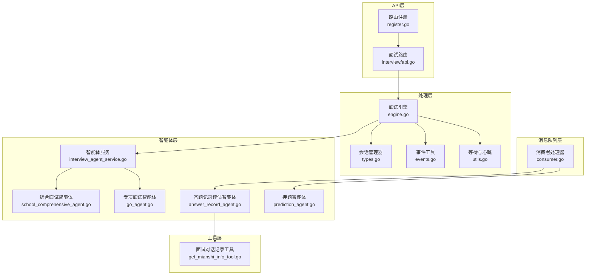
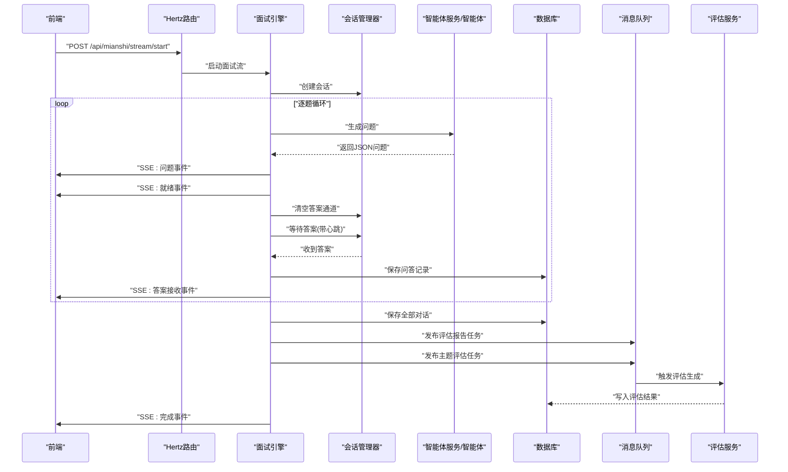
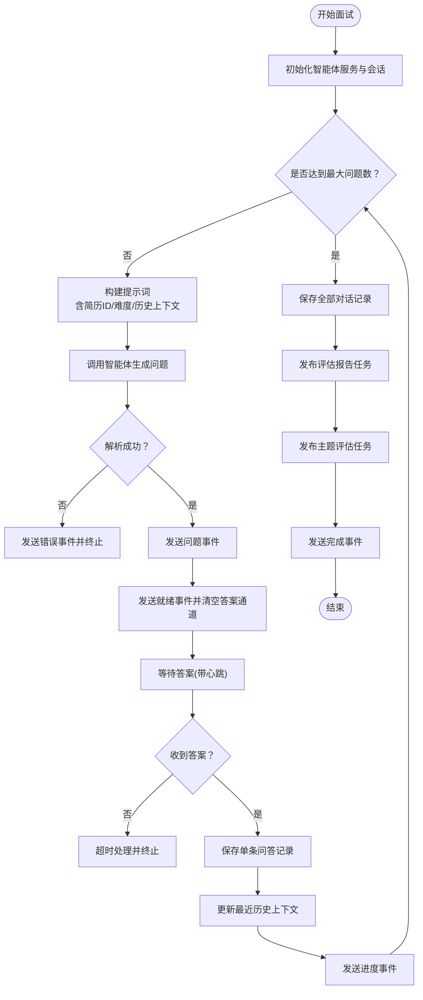
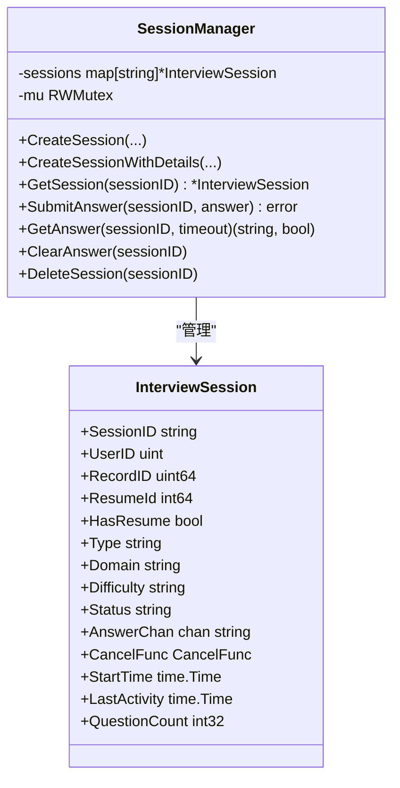
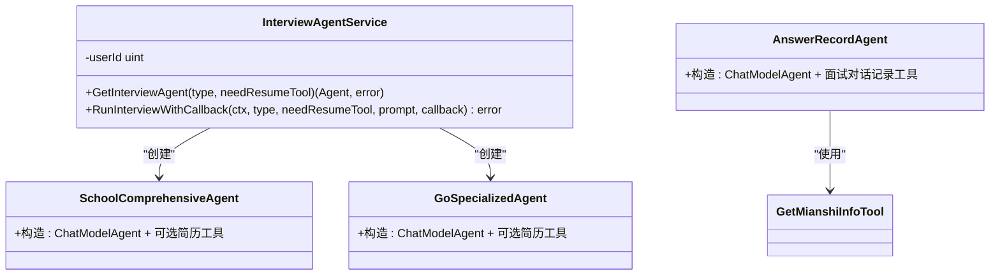
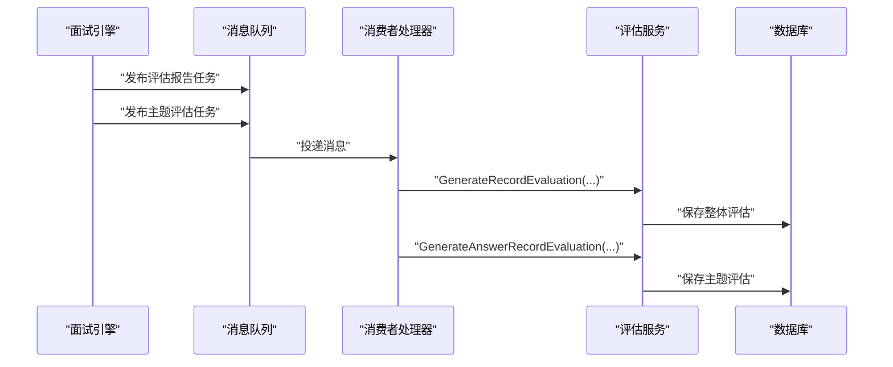
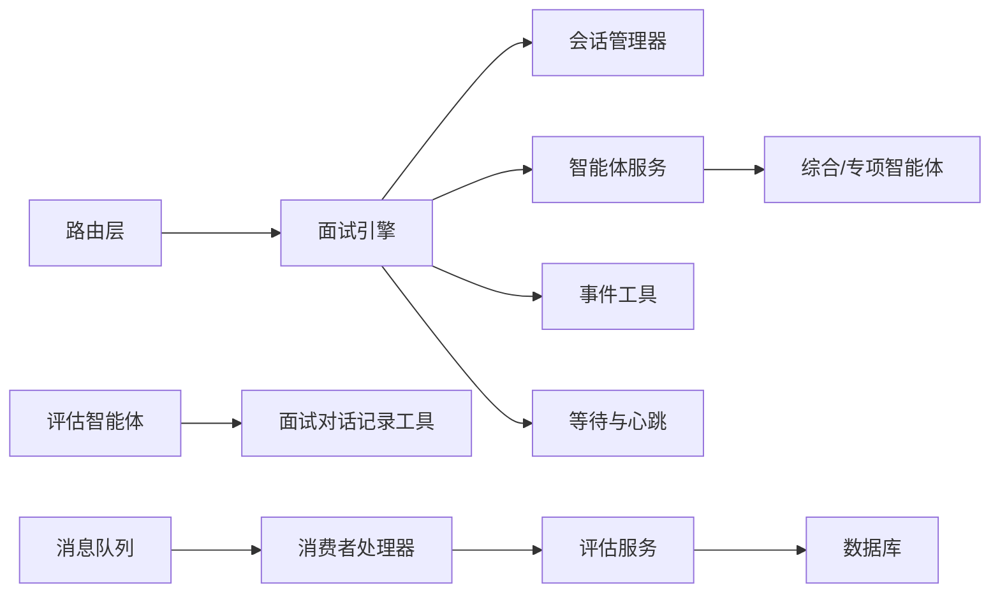

# AI工作流编排设计

<cite>
**本文档引用的文件**
- [backend/chatApp/main.go](file://backend/chatApp/main.go)
- [backend/api/router/register.go](file://backend/api/router/register.go)
- [backend/api/router/interview/api.go](file://backend/api/router/interview/api.go)
- [backend/chatApp/agent_service/interview/interview_agent_service.go](file://backend/chatApp/agent_service/interview/interview_agent_service.go)
- [backend/chatApp/agent/interview/comprehensive/school_comprehensive_agent.go](file://backend/chatApp/agent/interview/comprehensive/school_comprehensive_agent.go)
- [backend/chatApp/agent/interview/specialized/go_agent.go](file://backend/chatApp/agent/interview/specialized/go_agent.go)
- [backend/api/handler/interview/mianshi/engine.go](file://backend/api/handler/interview/mianshi/engine.go)
- [backend/api/handler/interview/mianshi/types.go](file://backend/api/handler/interview/mianshi/types.go)
- [backend/api/handler/interview/mianshi/events.go](file://backend/api/handler/interview/mianshi/events.go)
- [backend/api/handler/interview/mianshi/utils.go](file://backend/api/handler/interview/mianshi/utils.go)
- [backend/chatApp/agent_service/evaluation/record_evaluation_service.go](file://backend/chatApp/agent_service/evaluation/record_evaluation_service.go)
- [backend/chatApp/agent/record_evaluation/answer_record_agent.go](file://backend/chatApp/agent/record_evaluation/answer_record_agent.go)
- [backend/chatApp/tool/get_mianshi_info_tool.go](file://backend/chatApp/tool/get_mianshi_info_tool.go)
- [backend/internal/mq/consumer.go](file://backend/internal/mq/consumer.go)
- [backend/chatApp/agent/prediction/prediction_agent.go](file://backend/chatApp/agent/prediction/prediction_agent.go)
</cite>

## 目录
1. [简介](#简介)
2. [项目结构](#项目结构)
3. [核心组件](#核心组件)
4. [架构总览](#架构总览)
5. [详细组件分析](#详细组件分析)
6. [依赖关系分析](#依赖关系分析)
7. [性能考虑](#性能考虑)
8. [故障排除指南](#故障排除指南)
9. [结论](#结论)
10. [附录](#附录)

## 简介
本设计文档面向面试吧AI智能面试平台，系统性阐述AI工作流编排的设计与实现，重点覆盖以下方面：
- 面试流程控制、状态转换与事件处理机制
- 面试引擎的工作原理：会话管理、对话轮次控制与上下文维护
- 多智能体协作：问题生成、回答评估与报告生成的时序控制
- 异常处理、回滚与恢复策略
- 可扩展性设计：动态调整面试流程与智能体组合
- 监控指标与性能分析方案

## 项目结构
后端采用分层与按功能域划分的组织方式：
- API层：路由注册与HTTP接口定义
- 处理层：面试引擎、会话管理、事件发送与等待逻辑
- 智能体层：综合/专项面试智能体、评估智能体、押题智能体
- 工具层：面试对话记录检索工具
- 消息队列层：异步评估与主题评估任务消费
- 应用入口：本地调试与集成示例

图表来源
- [backend/api/router/register.go](file://backend/api/router/register.go#L11-L16)
- [backend/api/router/interview/api.go](file://backend/api/router/interview/api.go#L17-L104)
- [backend/api/handler/interview/mianshi/engine.go](file://backend/api/handler/interview/mianshi/engine.go#L23-L37)
- [backend/api/handler/interview/mianshi/types.go](file://backend/api/handler/interview/mianshi/types.go#L9-L50)
- [backend/api/handler/interview/mianshi/events.go](file://backend/api/handler/interview/mianshi/events.go#L11-L72)
- [backend/api/handler/interview/mianshi/utils.go](file://backend/api/handler/interview/mianshi/utils.go#L11-L74)
- [backend/chatApp/agent_service/interview/interview_agent_service.go](file://backend/chatApp/agent_service/interview/interview_agent_service.go#L30-L73)
- [backend/chatApp/agent/interview/comprehensive/school_comprehensive_agent.go](file://backend/chatApp/agent/interview/comprehensive/school_comprehensive_agent.go#L14-L48)
- [backend/chatApp/agent/interview/specialized/go_agent.go](file://backend/chatApp/agent/interview/specialized/go_agent.go#L14-L48)
- [backend/chatApp/agent/record_evaluation/answer_record_agent.go](file://backend/chatApp/agent/record_evaluation/answer_record_agent.go#L14-L41)
- [backend/chatApp/tool/get_mianshi_info_tool.go](file://backend/chatApp/tool/get_mianshi_info_tool.go#L23-L50)
- [backend/internal/mq/consumer.go](file://backend/internal/mq/consumer.go#L19-L101)
- [backend/chatApp/agent/prediction/prediction_agent.go](file://backend/chatApp/agent/prediction/prediction_agent.go#L25-L66)

章节来源
- [backend/api/router/register.go](file://backend/api/router/register.go#L11-L16)
- [backend/api/router/interview/api.go](file://backend/api/router/interview/api.go#L17-L104)

## 核心组件
- 面试引擎：负责面试循环的驱动、问题生成、答案等待、事件推送与数据持久化
- 会话管理器：维护面试会话状态、答案通道、超时与心跳保活
- 智能体服务：按面试类型动态选择并运行对应智能体
- 事件工具：通过Server-Sent Events向客户端推送问题、就绪、进度、错误与完成事件
- 评估服务：基于答题记录生成整体评估与主题评估
- 工具：面试对话记录检索，供评估智能体使用
- 消息队列消费者：异步触发评估与主题评估任务

章节来源
- [backend/api/handler/interview/mianshi/engine.go](file://backend/api/handler/interview/mianshi/engine.go#L23-L37)
- [backend/api/handler/interview/mianshi/types.go](file://backend/api/handler/interview/mianshi/types.go#L9-L50)
- [backend/chatApp/agent_service/interview/interview_agent_service.go](file://backend/chatApp/agent_service/interview/interview_agent_service.go#L30-L73)
- [backend/api/handler/interview/mianshi/events.go](file://backend/api/handler/interview/mianshi/events.go#L11-L72)
- [backend/chatApp/agent_service/evaluation/record_evaluation_service.go](file://backend/chatApp/agent_service/evaluation/record_evaluation_service.go#L17-L108)
- [backend/chatApp/tool/get_mianshi_info_tool.go](file://backend/chatApp/tool/get_mianshi_info_tool.go#L23-L50)
- [backend/internal/mq/consumer.go](file://backend/internal/mq/consumer.go#L19-L101)

## 架构总览
面试工作流由“前端发起 -> API路由 -> 面试引擎 -> 智能体 -> 会话管理 -> 事件推送 -> 数据持久化 -> 评估任务”构成闭环。

图表来源
- [backend/api/router/interview/api.go](file://backend/api/router/interview/api.go#L44-L46)
- [backend/api/handler/interview/mianshi/engine.go](file://backend/api/handler/interview/mianshi/engine.go#L39-L230)
- [backend/api/handler/interview/mianshi/types.go](file://backend/api/handler/interview/mianshi/types.go#L52-L82)
- [backend/api/handler/interview/mianshi/events.go](file://backend/api/handler/interview/mianshi/events.go#L11-L72)
- [backend/internal/mq/consumer.go](file://backend/internal/mq/consumer.go#L19-L101)
- [backend/chatApp/agent_service/evaluation/record_evaluation_service.go](file://backend/chatApp/agent_service/evaluation/record_evaluation_service.go#L17-L108)

## 详细组件分析

### 面试引擎（InterviewEngine）
- 职责
  - 驱动面试循环：逐题生成、等待回答、更新上下文、保存记录、发布评估任务
  - 控制超时与心跳：保证长连接稳定与用户体验
  - 事件推送：问题、就绪、进度、错误、完成事件
- 关键参数
  - 最大问题数、历史上下文大小、答案超时、心跳间隔
- 上下文维护
  - 使用最近N题的历史作为后续问题生成的上下文，避免重复并逐步加深难度
- 数据持久化
  - 逐条保存问答记录，便于后续评估与审计
- 评估任务发布
  - 面试结束后发布两条异步任务：整体评估报告与主题评估

图表来源
- [backend/api/handler/interview/mianshi/engine.go](file://backend/api/handler/interview/mianshi/engine.go#L39-L230)
- [backend/api/handler/interview/mianshi/utils.go](file://backend/api/handler/interview/mianshi/utils.go#L11-L56)
- [backend/api/handler/interview/mianshi/events.go](file://backend/api/handler/interview/mianshi/events.go#L11-L72)

章节来源
- [backend/api/handler/interview/mianshi/engine.go](file://backend/api/handler/interview/mianshi/engine.go#L23-L291)
- [backend/api/handler/interview/mianshi/utils.go](file://backend/api/handler/interview/mianshi/utils.go#L11-L74)
- [backend/api/handler/interview/mianshi/events.go](file://backend/api/handler/interview/mianshi/events.go#L11-L72)

### 会话管理器（SessionManager）
- 职责
  - 创建/删除会话、获取会话
  - 管理答案通道：提交答案、阻塞等待答案、清空通道
  - 维护会话状态、活动时间、问题计数
- 并发安全
  - 使用读写锁保护会话表
- 超时与心跳
  - 与等待逻辑配合，定期发送心跳事件保持连接活跃

图表来源
- [backend/api/handler/interview/mianshi/types.go](file://backend/api/handler/interview/mianshi/types.go#L9-L165)

章节来源
- [backend/api/handler/interview/mianshi/types.go](file://backend/api/handler/interview/mianshi/types.go#L9-L165)

### 智能体服务与智能体
- 智能体服务
  - 根据面试类型与领域选择具体智能体实例
  - 提供统一的运行接口，支持回调模式实时输出
- 综合/专项智能体
  - 统一通过聊天模型创建，支持可选简历工具
- 押题智能体
  - 专门用于根据简历生成预测题目

图表来源
- [backend/chatApp/agent_service/interview/interview_agent_service.go](file://backend/chatApp/agent_service/interview/interview_agent_service.go#L30-L155)
- [backend/chatApp/agent/interview/comprehensive/school_comprehensive_agent.go](file://backend/chatApp/agent/interview/comprehensive/school_comprehensive_agent.go#L14-L48)
- [backend/chatApp/agent/interview/specialized/go_agent.go](file://backend/chatApp/agent/interview/specialized/go_agent.go#L14-L48)
- [backend/chatApp/agent/record_evaluation/answer_record_agent.go](file://backend/chatApp/agent/record_evaluation/answer_record_agent.go#L14-L41)
- [backend/chatApp/tool/get_mianshi_info_tool.go](file://backend/chatApp/tool/get_mianshi_info_tool.go#L23-L50)

章节来源
- [backend/chatApp/agent_service/interview/interview_agent_service.go](file://backend/chatApp/agent_service/interview/interview_agent_service.go#L30-L155)
- [backend/chatApp/agent/interview/comprehensive/school_comprehensive_agent.go](file://backend/chatApp/agent/interview/comprehensive/school_comprehensive_agent.go#L14-L48)
- [backend/chatApp/agent/interview/specialized/go_agent.go](file://backend/chatApp/agent/interview/specialized/go_agent.go#L14-L48)
- [backend/chatApp/agent/record_evaluation/answer_record_agent.go](file://backend/chatApp/agent/record_evaluation/answer_record_agent.go#L14-L41)
- [backend/chatApp/tool/get_mianshi_info_tool.go](file://backend/chatApp/tool/get_mianshi_info_tool.go#L23-L50)

### 评估与报告生成
- 整体评估
  - 通过答题记录评估智能体聚合维度评分与评语，计算总分并持久化
- 主题评估
  - 基于每道题的问答记录进行细化评估
- 异步执行
  - 由消息队列消费者触发，避免面试主线程阻塞

图表来源
- [backend/api/handler/interview/mianshi/engine.go](file://backend/api/handler/interview/mianshi/engine.go#L221-L230)
- [backend/internal/mq/consumer.go](file://backend/internal/mq/consumer.go#L19-L101)
- [backend/chatApp/agent_service/evaluation/record_evaluation_service.go](file://backend/chatApp/agent_service/evaluation/record_evaluation_service.go#L17-L108)

章节来源
- [backend/api/handler/interview/mianshi/engine.go](file://backend/api/handler/interview/mianshi/engine.go#L221-L230)
- [backend/internal/mq/consumer.go](file://backend/internal/mq/consumer.go#L19-L101)
- [backend/chatApp/agent_service/evaluation/record_evaluation_service.go](file://backend/chatApp/agent_service/evaluation/record_evaluation_service.go#L17-L183)

### 押题功能
- 押题智能体根据简历与岗位要求生成预测题目，确保数量与格式约束
- 为用户提供考前准备与自测机会

章节来源
- [backend/chatApp/agent/prediction/prediction_agent.go](file://backend/chatApp/agent/prediction/prediction_agent.go#L25-L66)

## 依赖关系分析
- 路由层依赖处理层：路由注册调用处理函数，处理函数再调用引擎与服务
- 引擎依赖会话管理器与智能体服务：驱动流程、管理状态、调度智能体
- 智能体服务依赖具体智能体实现：按类型动态创建
- 评估服务依赖工具与DAO：通过工具获取对话记录并持久化评估
- 消息队列消费者依赖评估服务：异步生成评估并写库

图表来源
- [backend/api/router/register.go](file://backend/api/router/register.go#L11-L16)
- [backend/api/router/interview/api.go](file://backend/api/router/interview/api.go#L17-L104)
- [backend/api/handler/interview/mianshi/engine.go](file://backend/api/handler/interview/mianshi/engine.go#L23-L37)
- [backend/chatApp/agent_service/interview/interview_agent_service.go](file://backend/chatApp/agent_service/interview/interview_agent_service.go#L30-L73)
- [backend/chatApp/agent_service/evaluation/record_evaluation_service.go](file://backend/chatApp/agent_service/evaluation/record_evaluation_service.go#L17-L108)
- [backend/chatApp/tool/get_mianshi_info_tool.go](file://backend/chatApp/tool/get_mianshi_info_tool.go#L23-L50)
- [backend/internal/mq/consumer.go](file://backend/internal/mq/consumer.go#L19-L101)

章节来源
- [backend/api/router/register.go](file://backend/api/router/register.go#L11-L16)
- [backend/api/router/interview/api.go](file://backend/api/router/interview/api.go#L17-L104)
- [backend/api/handler/interview/mianshi/engine.go](file://backend/api/handler/interview/mianshi/engine.go#L23-L37)
- [backend/chatApp/agent_service/interview/interview_agent_service.go](file://backend/chatApp/agent_service/interview/interview_agent_service.go#L30-L73)
- [backend/chatApp/agent_service/evaluation/record_evaluation_service.go](file://backend/chatApp/agent_service/evaluation/record_evaluation_service.go#L17-L108)
- [backend/chatApp/tool/get_mianshi_info_tool.go](file://backend/chatApp/tool/get_mianshi_info_tool.go#L23-L50)
- [backend/internal/mq/consumer.go](file://backend/internal/mq/consumer.go#L19-L101)

## 性能考虑
- 并发与锁
  - 会话管理器使用读写锁，降低高并发下的竞争开销
- 流式输出
  - 通过回调模式与SSE事件流，减少一次性大响应带来的延迟
- 超时与心跳
  - 明确设置答案超时与心跳周期，避免资源长期占用
- 异步评估
  - 评估任务通过消息队列异步执行，降低面试主线程压力
- 上下文截断
  - 限制历史上下文长度，平衡效果与性能
- 数据库批量写入
  - 评估阶段统一持久化，减少多次IO

## 故障排除指南
- 会话未找到
  - 现象：等待答案阶段返回失败
  - 排查：检查会话ID是否正确、会话是否被提前清理
- 答案超时
  - 现象：长时间无回答导致终止
  - 排查：检查心跳事件是否正常、网络稳定性、前端是否正确提交答案
- 智能体返回空或非预期格式
  - 现象：问题生成失败或解析失败
  - 排查：确认智能体指令与输出格式要求、日志错误、重试机制
- 评估生成失败
  - 现象：评估报告未生成或部分维度缺失
  - 排查：检查消息队列订阅、评估服务超时、工具调用与DAO写入
- 事件发送失败
  - 现象：前端未收到事件
  - 排查：检查SSE响应头设置、Flush策略、网络代理配置

章节来源
- [backend/api/handler/interview/mianshi/types.go](file://backend/api/handler/interview/mianshi/types.go#L91-L142)
- [backend/api/handler/interview/mianshi/utils.go](file://backend/api/handler/interview/mianshi/utils.go#L11-L56)
- [backend/api/handler/interview/mianshi/events.go](file://backend/api/handler/interview/mianshi/events.go#L11-L72)
- [backend/chatApp/agent_service/evaluation/record_evaluation_service.go](file://backend/chatApp/agent_service/evaluation/record_evaluation_service.go#L17-L108)
- [backend/internal/mq/consumer.go](file://backend/internal/mq/consumer.go#L19-L101)

## 结论
本设计通过“引擎驱动 + 智能体协作 + 会话管理 + 事件推送 + 异步评估”的架构，实现了可扩展、可观测、可恢复的AI面试工作流。面试引擎负责流程与时序控制，智能体负责具体任务执行，会话管理器保障状态一致性，事件系统提升用户体验，消息队列实现解耦与弹性。该体系支持动态调整面试类型与智能体组合，满足不同岗位与场景需求。

## 附录
- 监控指标建议
  - 面试时长、问题生成耗时、答案等待耗时、事件发送成功率、评估生成耗时、消息队列积压
- 性能优化建议
  - 缓存常用工具结果、限流与熔断、数据库索引优化、异步批处理评估
- 可扩展性设计
  - 新增智能体类型：在智能体服务中注册新类型与工厂方法
  - 新增评估维度：在评估服务中扩展维度结构与持久化逻辑
  - 新增事件类型：在事件工具中新增事件格式与前端适配