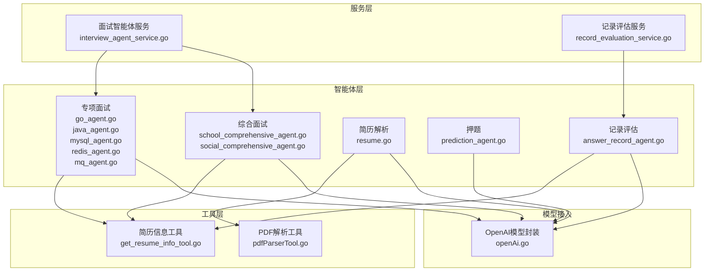
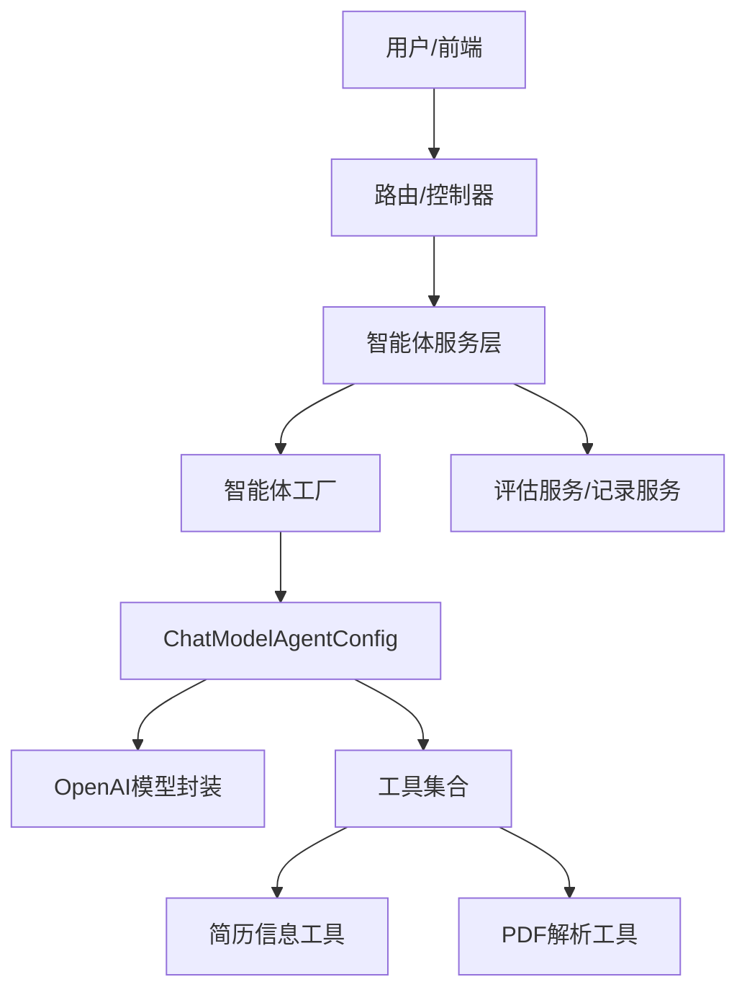
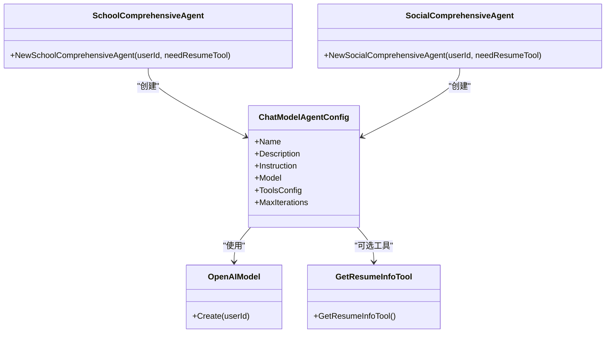
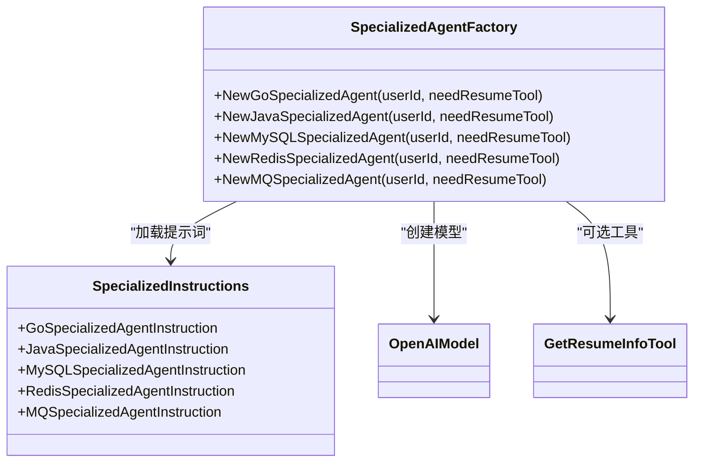
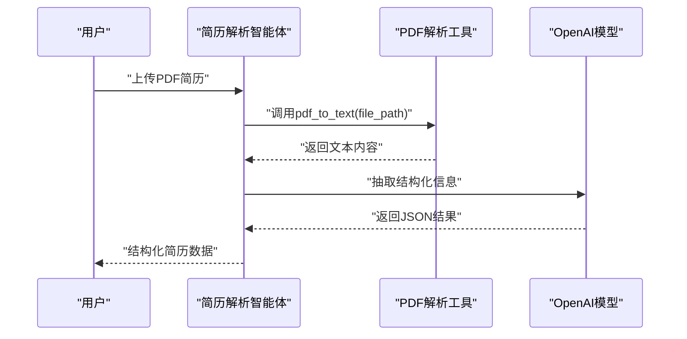
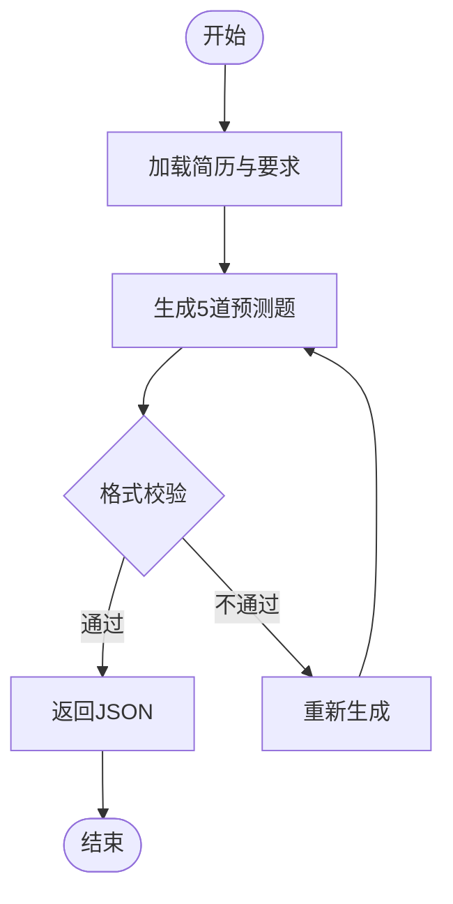
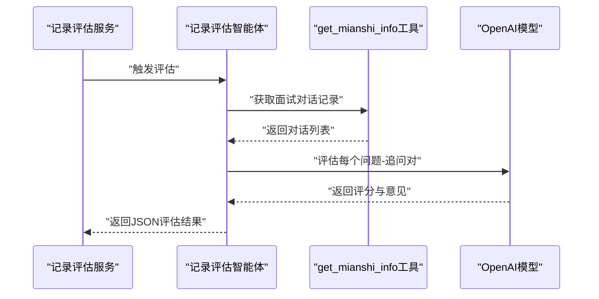
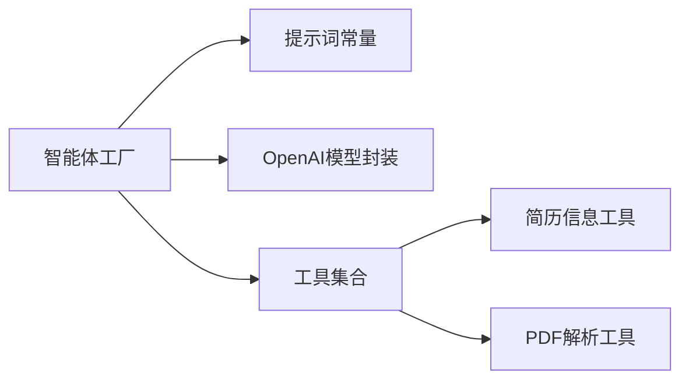

# AI智能体组件设计

<cite>
**本文引用的文件**
- [backend/chatApp/agent/interview/comprehensive/school_comprehensive_agent.go](file://backend/chatApp/agent/interview/comprehensive/school_comprehensive_agent.go)
- [backend/chatApp/agent/interview/comprehensive/social_comprehensive_agent.go](file://backend/chatApp/agent/interview/comprehensive/social_comprehensive_agent.go)
- [backend/chatApp/agent/interview/comprehensive/constants.go](file://backend/chatApp/agent/interview/comprehensive/constants.go)
- [backend/chatApp/agent/interview/specialized/go_agent.go](file://backend/chatApp/agent/interview/specialized/go_agent.go)
- [backend/chatApp/agent/interview/specialized/java_agent.go](file://backend/chatApp/agent/interview/specialized/java_agent.go)
- [backend/chatApp/agent/interview/specialized/mysql_agent.go](file://backend/chatApp/agent/interview/specialized/mysql_agent.go)
- [backend/chatApp/agent/interview/specialized/redis_agent.go](file://backend/chatApp/agent/interview/specialized/redis_agent.go)
- [backend/chatApp/agent/interview/specialized/mq_agent.go](file://backend/chatApp/agent/interview/specialized/mq_agent.go)
- [backend/chatApp/agent/interview/specialized/constants.go](file://backend/chatApp/agent/interview/specialized/constants.go)
- [backend/chatApp/agent/resume/resume.go](file://backend/chatApp/agent/resume/resume.go)
- [backend/chatApp/agent/prediction/prediction_agent.go](file://backend/chatApp/agent/prediction/prediction_agent.go)
- [backend/chatApp/agent/record_evaluation/answer_record_agent.go](file://backend/chatApp/agent/record_evaluation/answer_record_agent.go)
- [backend/chatApp/agent/record_evaluation/constant.go](file://backend/chatApp/agent/record_evaluation/constant.go)
- [backend/chatApp/tool/get_resume_info_tool.go](file://backend/chatApp/tool/get_resume_info_tool.go)
- [backend/chatApp/tool/pdfParserTool.go](file://backend/chatApp/tool/pdfParserTool.go)
- [backend/chatApp/chat/openAi.go](file://backend/chatApp/chat/openAi.go)
- [backend/chatApp/agent_service/interview/interview_agent_service.go](file://backend/chatApp/agent_service/interview/interview_agent_service.go)
- [backend/chatApp/agent_service/evaluation/record_evaluation_service.go](file://backend/chatApp/agent_service/evaluation/record_evaluation_service.go)
</cite>

## 目录
1. [简介](#简介)
2. [项目结构](#项目结构)
3. [核心组件](#核心组件)
4. [架构总览](#架构总览)
5. [详细组件分析](#详细组件分析)
6. [依赖关系分析](#依赖关系分析)
7. [性能考量](#性能考量)
8. [故障排查指南](#故障排查指南)
9. [结论](#结论)
10. [附录](#附录)

## 简介
本设计文档面向“面试吧AI智能面试平台”，系统化阐述智能体组件的设计架构与实现原理，覆盖三大类智能体：
- 综合面试智能体：校招/社招两类，分别针对应届生与社会招聘候选人的综合能力评估。
- 专项面试智能体：Go/Java/MySQL/Redis/MQ五类，聚焦特定技术栈或中间件的专业深度评估。
- 简历分析智能体：负责简历解析与关键信息抽取，支撑面试准备与押题。

文档同时解释智能体的状态管理、生命周期控制、协作机制，以及在不同面试场景下的问题生成策略、回答评估算法与反馈生成逻辑；并给出配置参数、行为模式、个性化设置、智能体间通信与数据共享策略，以及性能优化与资源管理方案。

## 项目结构
智能体位于后端聊天应用模块中，采用按功能域分层的组织方式：
- agent：智能体工厂与提示词定义
- agent_service：智能体服务编排与业务集成
- tool：外部工具（简历解析、信息检索等）
- chat：模型接入封装
- model/service/repository：数据模型与持久化

图表来源
- [backend/chatApp/agent/interview/comprehensive/school_comprehensive_agent.go](file://backend/chatApp/agent/interview/comprehensive/school_comprehensive_agent.go#L1-L48)
- [backend/chatApp/agent/interview/comprehensive/social_comprehensive_agent.go](file://backend/chatApp/agent/interview/comprehensive/social_comprehensive_agent.go#L1-L48)
- [backend/chatApp/agent/interview/specialized/go_agent.go](file://backend/chatApp/agent/interview/specialized/go_agent.go#L1-L48)
- [backend/chatApp/agent/interview/specialized/java_agent.go](file://backend/chatApp/agent/interview/specialized/java_agent.go#L1-L48)
- [backend/chatApp/agent/interview/specialized/mysql_agent.go](file://backend/chatApp/agent/interview/specialized/mysql_agent.go#L1-L48)
- [backend/chatApp/agent/interview/specialized/redis_agent.go](file://backend/chatApp/agent/interview/specialized/redis_agent.go#L1-L48)
- [backend/chatApp/agent/interview/specialized/mq_agent.go](file://backend/chatApp/agent/interview/specialized/mq_agent.go#L1-L48)
- [backend/chatApp/agent/resume/resume.go](file://backend/chatApp/agent/resume/resume.go#L1-L109)
- [backend/chatApp/agent/prediction/prediction_agent.go](file://backend/chatApp/agent/prediction/prediction_agent.go#L1-L66)
- [backend/chatApp/agent/record_evaluation/answer_record_agent.go](file://backend/chatApp/agent/record_evaluation/answer_record_agent.go#L1-L41)
- [backend/chatApp/tool/get_resume_info_tool.go](file://backend/chatApp/tool/get_resume_info_tool.go#L1-L48)
- [backend/chatApp/tool/pdfParserTool.go](file://backend/chatApp/tool/pdfParserTool.go#L1-L124)
- [backend/chatApp/chat/openAi.go](file://backend/chatApp/chat/openAi.go)

章节来源
- [backend/chatApp/agent/interview/comprehensive/school_comprehensive_agent.go](file://backend/chatApp/agent/interview/comprehensive/school_comprehensive_agent.go#L1-L48)
- [backend/chatApp/agent/interview/comprehensive/social_comprehensive_agent.go](file://backend/chatApp/agent/interview/comprehensive/social_comprehensive_agent.go#L1-L48)
- [backend/chatApp/agent/interview/specialized/go_agent.go](file://backend/chatApp/agent/interview/specialized/go_agent.go#L1-L48)
- [backend/chatApp/agent/interview/specialized/java_agent.go](file://backend/chatApp/agent/interview/specialized/java_agent.go#L1-L48)
- [backend/chatApp/agent/interview/specialized/mysql_agent.go](file://backend/chatApp/agent/interview/specialized/mysql_agent.go#L1-L48)
- [backend/chatApp/agent/interview/specialized/redis_agent.go](file://backend/chatApp/agent/interview/specialized/redis_agent.go#L1-L48)
- [backend/chatApp/agent/interview/specialized/mq_agent.go](file://backend/chatApp/agent/interview/specialized/mq_agent.go#L1-L48)
- [backend/chatApp/agent/resume/resume.go](file://backend/chatApp/agent/resume/resume.go#L1-L109)
- [backend/chatApp/agent/prediction/prediction_agent.go](file://backend/chatApp/agent/prediction/prediction_agent.go#L1-L66)
- [backend/chatApp/agent/record_evaluation/answer_record_agent.go](file://backend/chatApp/agent/record_evaluation/answer_record_agent.go#L1-L41)

## 核心组件
- 综合面试智能体
  - 校招综合面试官：面向应届生，侧重基础知识、学习潜力、思维过程与职业素养。
  - 社招综合面试官：面向有经验候选人，侧重实战经验、系统设计、技术深度与领导力。
- 专项面试智能体
  - Go/Java/MySQL/Redis/MQ：围绕特定技术栈或中间件，进行专业深度与实践能力评估。
- 简历解析智能体
  - 从PDF简历中提取基本信息、教育背景、工作经历、技术栈、项目经验、技能特长、证书资格等，并给出推荐难度、关注领域与提问方向。
- 押题智能体
  - 基于简历与要求生成5道预测题，包含重点考察、思考路径、参考答案与可能追问。
- 记录评估智能体
  - 对面试记录进行维度评分与反馈，支持按问题-追问序列组织评估结果。

章节来源
- [backend/chatApp/agent/interview/comprehensive/constants.go](file://backend/chatApp/agent/interview/comprehensive/constants.go#L1-L95)
- [backend/chatApp/agent/interview/specialized/constants.go](file://backend/chatApp/agent/interview/specialized/constants.go#L1-L247)
- [backend/chatApp/agent/resume/resume.go](file://backend/chatApp/agent/resume/resume.go#L14-L109)
- [backend/chatApp/agent/prediction/prediction_agent.go](file://backend/chatApp/agent/prediction/prediction_agent.go#L25-L66)
- [backend/chatApp/agent/record_evaluation/constant.go](file://backend/chatApp/agent/record_evaluation/constant.go#L3-L169)

## 架构总览
智能体统一基于Eino框架构建，通过ChatModelAgentConfig装配模型、提示词、工具与迭代次数；模型由OpenAI封装提供；工具通过工具注册机制注入，支持简历信息查询与PDF文本解析。

图表来源
- [backend/chatApp/agent_service/interview/interview_agent_service.go](file://backend/chatApp/agent_service/interview/interview_agent_service.go)
- [backend/chatApp/agent_service/evaluation/record_evaluation_service.go](file://backend/chatApp/agent_service/evaluation/record_evaluation_service.go)
- [backend/chatApp/chat/openAi.go](file://backend/chatApp/chat/openAi.go)
- [backend/chatApp/tool/get_resume_info_tool.go](file://backend/chatApp/tool/get_resume_info_tool.go#L36-L47)
- [backend/chatApp/tool/pdfParserTool.go](file://backend/chatApp/tool/pdfParserTool.go#L114-L123)

## 详细组件分析

### 综合面试智能体（校招/社招）
- 设计要点
  - 两类智能体均通过ChatModelAgentConfig创建，具备统一的模型接入与工具配置能力。
  - 支持可选的简历信息工具注入，以增强问题针对性与个性化。
  - MaxIterations限制迭代次数，避免长链路卡顿。
- 生命周期与状态
  - 初始化：创建模型与Agent，加载提示词与工具配置。
  - 运行期：接收用户输入，生成问题，必要时调用工具获取简历信息。
  - 结束：输出JSON格式问题，等待下一轮交互。
- 协作机制
  - 与简历解析智能体解耦，通过工具接口按需获取简历信息。
  - 与评估服务配合，将对话记录交由记录评估智能体进行打分与反馈。
- 行为模式与个性化
  - 校招侧重学习潜力与思维过程；社招侧重实战经验与架构设计。
  - 通过提示词指令实现差异化行为，问题生成遵循“每次一道问题”“递进式”“开放式”等原则。

图表来源
- [backend/chatApp/agent/interview/comprehensive/school_comprehensive_agent.go](file://backend/chatApp/agent/interview/comprehensive/school_comprehensive_agent.go#L35-L46)
- [backend/chatApp/agent/interview/comprehensive/social_comprehensive_agent.go](file://backend/chatApp/agent/interview/comprehensive/social_comprehensive_agent.go#L35-L46)
- [backend/chatApp/chat/openAi.go](file://backend/chatApp/chat/openAi.go)
- [backend/chatApp/tool/get_resume_info_tool.go](file://backend/chatApp/tool/get_resume_info_tool.go#L36-L47)

章节来源
- [backend/chatApp/agent/interview/comprehensive/school_comprehensive_agent.go](file://backend/chatApp/agent/interview/comprehensive/school_comprehensive_agent.go#L14-L47)
- [backend/chatApp/agent/interview/comprehensive/social_comprehensive_agent.go](file://backend/chatApp/agent/interview/comprehensive/social_comprehensive_agent.go#L14-L47)
- [backend/chatApp/agent/interview/comprehensive/constants.go](file://backend/chatApp/agent/interview/comprehensive/constants.go#L3-L95)

### 专项面试智能体（Go/Java/MySQL/Redis/MQ）
- 设计要点
  - 五类专项智能体复用统一工厂方法，差异在于提示词与评估侧重点。
  - 均支持可选简历信息工具，以结合候选人的项目与技能背景提问。
- 行为模式
  - 强调“仅讨论、不编码”的约束，避免要求候选人现场编程。
  - 问题方向涵盖核心特性、设计模式、性能优化、系统设计与最佳实践。
- 个性化设置
  - 通过提示词指令实现技术栈差异化，确保问题深度与广度适配相应岗位。

图表来源
- [backend/chatApp/agent/interview/specialized/go_agent.go](file://backend/chatApp/agent/interview/specialized/go_agent.go#L14-L47)
- [backend/chatApp/agent/interview/specialized/java_agent.go](file://backend/chatApp/agent/interview/specialized/java_agent.go#L14-L47)
- [backend/chatApp/agent/interview/specialized/mysql_agent.go](file://backend/chatApp/agent/interview/specialized/mysql_agent.go#L14-L47)
- [backend/chatApp/agent/interview/specialized/redis_agent.go](file://backend/chatApp/agent/interview/specialized/redis_agent.go#L14-L47)
- [backend/chatApp/agent/interview/specialized/mq_agent.go](file://backend/chatApp/agent/interview/specialized/mq_agent.go#L14-L47)
- [backend/chatApp/agent/interview/specialized/constants.go](file://backend/chatApp/agent/interview/specialized/constants.go#L3-L247)
- [backend/chatApp/tool/get_resume_info_tool.go](file://backend/chatApp/tool/get_resume_info_tool.go#L36-L47)
- [backend/chatApp/chat/openAi.go](file://backend/chatApp/chat/openAi.go)

章节来源
- [backend/chatApp/agent/interview/specialized/go_agent.go](file://backend/chatApp/agent/interview/specialized/go_agent.go#L14-L47)
- [backend/chatApp/agent/interview/specialized/java_agent.go](file://backend/chatApp/agent/interview/specialized/java_agent.go#L14-L47)
- [backend/chatApp/agent/interview/specialized/mysql_agent.go](file://backend/chatApp/agent/interview/specialized/mysql_agent.go#L14-L47)
- [backend/chatApp/agent/interview/specialized/redis_agent.go](file://backend/chatApp/agent/interview/specialized/redis_agent.go#L14-L47)
- [backend/chatApp/agent/interview/specialized/mq_agent.go](file://backend/chatApp/agent/interview/specialized/mq_agent.go#L14-L47)
- [backend/chatApp/agent/interview/specialized/constants.go](file://backend/chatApp/agent/interview/specialized/constants.go#L3-L247)

### 简历解析智能体
- 设计要点
  - 通过PDF解析工具将PDF转为纯文本，再由大模型抽取结构化信息。
  - 输出包含基本信息、教育背景、工作经历、技术栈、项目经验、技能特长、证书资格、核心优势、潜在弱点、推荐难度、关注领域与提问方向。
- 生命周期
  - 初始化：创建模型与工具配置。
  - 执行：调用PDF解析工具获取文本，抽取关键信息并返回JSON。
- 数据格式
  - 严格JSON格式，字段齐全，便于后续面试准备与押题使用。

图表来源
- [backend/chatApp/agent/resume/resume.go](file://backend/chatApp/agent/resume/resume.go#L16-L107)
- [backend/chatApp/tool/pdfParserTool.go](file://backend/chatApp/tool/pdfParserTool.go#L39-L112)
- [backend/chatApp/chat/openAi.go](file://backend/chatApp/chat/openAi.go)

章节来源
- [backend/chatApp/agent/resume/resume.go](file://backend/chatApp/agent/resume/resume.go#L14-L109)
- [backend/chatApp/tool/pdfParserTool.go](file://backend/chatApp/tool/pdfParserTool.go#L1-L124)

### 押题智能体
- 设计要点
  - 根据简历与岗位/难度/目标公司要求，生成5道预测题。
  - 输出标准化JSON，包含问题、重点考察、思考路径、参考答案与可能追问。
- 生命周期
  - 初始化：创建模型与提示词。
  - 执行：生成固定数量的题目，严格遵循JSON格式要求。
- 个性化设置
  - 可结合简历中的项目与技能点定制题目，提升押题命中率。

图表来源
- [backend/chatApp/agent/prediction/prediction_agent.go](file://backend/chatApp/agent/prediction/prediction_agent.go#L25-L66)

章节来源
- [backend/chatApp/agent/prediction/prediction_agent.go](file://backend/chatApp/agent/prediction/prediction_agent.go#L1-L66)

### 记录评估智能体
- 设计要点
  - 通过工具获取面试完整对话记录，按问题-追问序列进行评估。
  - 评分维度可配置，输出包含总体评价、各维度评分与建议。
- 生命周期
  - 初始化：创建模型与工具配置。
  - 执行：调用工具获取对话，逐条评估并生成JSON结果。
- 数据结构
  - records数组，每项包含问题内容、评分、关键要点、难度、优势、不足、建议、知识点总结、思考过程与参考答案。

图表来源
- [backend/chatApp/agent/record_evaluation/answer_record_agent.go](file://backend/chatApp/agent/record_evaluation/answer_record_agent.go#L14-L39)
- [backend/chatApp/agent/record_evaluation/constant.go](file://backend/chatApp/agent/record_evaluation/constant.go#L73-L169)
- [backend/chatApp/tool/get_mianshi_info_tool.go](file://backend/chatApp/tool/get_mianshi_info_tool.go#L22-L34)
- [backend/chatApp/chat/openAi.go](file://backend/chatApp/chat/openAi.go)

章节来源
- [backend/chatApp/agent/record_evaluation/answer_record_agent.go](file://backend/chatApp/agent/record_evaluation/answer_record_agent.go#L1-L41)
- [backend/chatApp/agent/record_evaluation/constant.go](file://backend/chatApp/agent/record_evaluation/constant.go#L1-L169)

## 依赖关系分析
- 模块内聚与耦合
  - 智能体工厂与提示词分离，降低提示词变更对工厂的影响。
  - 工具通过统一注册机制注入，便于替换与扩展。
- 外部依赖
  - OpenAI模型封装提供统一的推理接口。
  - 工具依赖系统CLI（如pdftotext）进行PDF解析，需关注环境与权限。
- 服务编排
  - 面试智能体服务与记录评估服务分别编排不同类型的智能体，形成清晰的业务边界。

图表来源
- [backend/chatApp/agent/interview/comprehensive/school_comprehensive_agent.go](file://backend/chatApp/agent/interview/comprehensive/school_comprehensive_agent.go#L35-L46)
- [backend/chatApp/agent/interview/specialized/go_agent.go](file://backend/chatApp/agent/interview/specialized/go_agent.go#L35-L46)
- [backend/chatApp/agent/resume/resume.go](file://backend/chatApp/agent/resume/resume.go#L23-L103)
- [backend/chatApp/chat/openAi.go](file://backend/chatApp/chat/openAi.go)
- [backend/chatApp/tool/get_resume_info_tool.go](file://backend/chatApp/tool/get_resume_info_tool.go#L36-L47)
- [backend/chatApp/tool/pdfParserTool.go](file://backend/chatApp/tool/pdfParserTool.go#L114-L123)

章节来源
- [backend/chatApp/agent_service/interview/interview_agent_service.go](file://backend/chatApp/agent_service/interview/interview_agent_service.go)
- [backend/chatApp/agent_service/evaluation/record_evaluation_service.go](file://backend/chatApp/agent_service/evaluation/record_evaluation_service.go)

## 性能考量
- 模型调用与并发
  - 控制MaxIterations上限，避免长时间运行导致资源占用过高。
  - 在高并发场景下，建议引入连接池与限流策略，防止模型服务过载。
- 工具调用开销
  - PDF解析依赖系统CLI，需设置合理的超时与重试策略，避免阻塞主线程。
  - 对简历信息工具进行缓存，减少重复查询数据库的开销。
- 输出格式与解析
  - 严格JSON格式有助于前端快速渲染与评估服务稳定解析，减少二次处理成本。
- 资源管理
  - 对工具执行结果进行大小限制与超时控制，防止异常输入造成内存膨胀。
  - 评估服务对评分维度进行上限控制，避免输出过大JSON影响传输与存储。

## 故障排查指南
- 模型创建失败
  - 检查userId与模型配置，确认OpenAI封装正常初始化。
- 工具调用异常
  - PDF解析：检查文件路径、权限与pdftotext安装；查看错误信息与耗时日志。
  - 简历信息：确认ResumeID有效，数据库连接正常。
- 输出格式错误
  - 确认智能体提示词要求严格返回JSON，避免多余文本与注释。
- 评估服务异常
  - 检查工具返回的对话数据是否为空或格式不符，必要时补充默认值或降级策略。

章节来源
- [backend/chatApp/chat/openAi.go](file://backend/chatApp/chat/openAi.go)
- [backend/chatApp/tool/pdfParserTool.go](file://backend/chatApp/tool/pdfParserTool.go#L50-L93)
- [backend/chatApp/tool/get_resume_info_tool.go](file://backend/chatApp/tool/get_resume_info_tool.go#L22-L34)
- [backend/chatApp/agent/record_evaluation/constant.go](file://backend/chatApp/agent/record_evaluation/constant.go#L144-L169)

## 结论
本设计文档系统梳理了面试吧AI智能面试平台的智能体组件，明确了综合/专项/简历/押题/记录评估五大类智能体的职责、提示词、工具与服务编排关系。通过统一的Eino框架与OpenAI模型封装，实现了可插拔的工具体系与可扩展的行为模式。建议在生产环境中进一步完善超时与限流策略、工具缓存与降级机制，以保障稳定性与性能。

## 附录
- 配置参数与行为模式
  - MaxIterations：限制智能体最大迭代次数，平衡深度与性能。
  - ToolsConfig：按需注入简历信息工具，增强问题针对性。
  - 提示词指令：通过constants文件集中管理，便于版本演进与A/B测试。
- 个性化设置
  - 根据岗位类型（校招/社招/专项）切换提示词与评估维度。
  - 结合简历解析结果动态调整问题难度与关注领域。
- 数据共享策略
  - 通过工具接口共享简历与对话数据，避免跨模块直接依赖。
  - 评估服务以标准化JSON作为契约，便于前端与移动端消费。