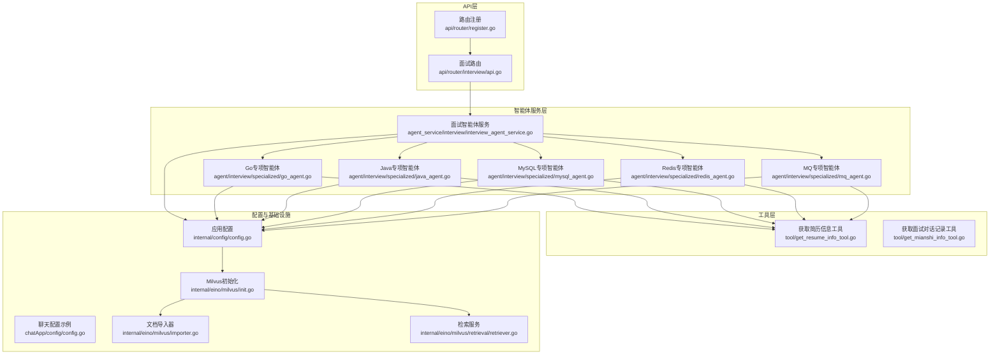
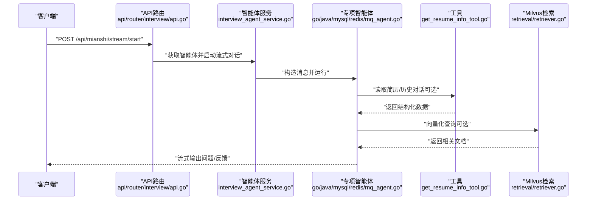
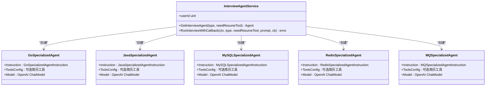
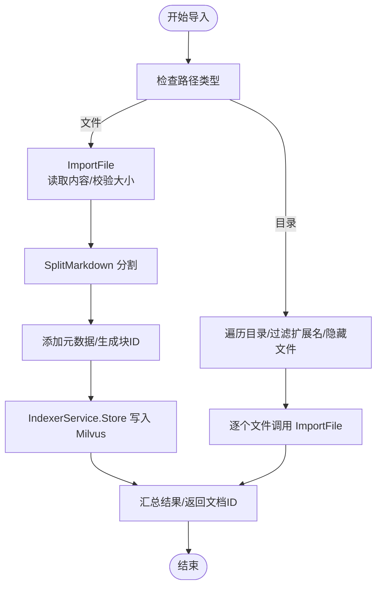
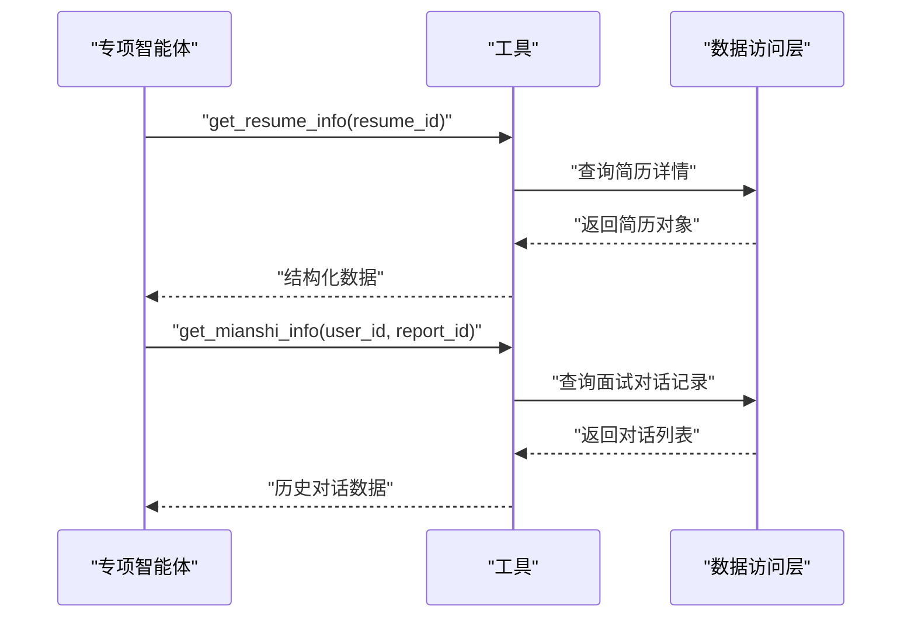
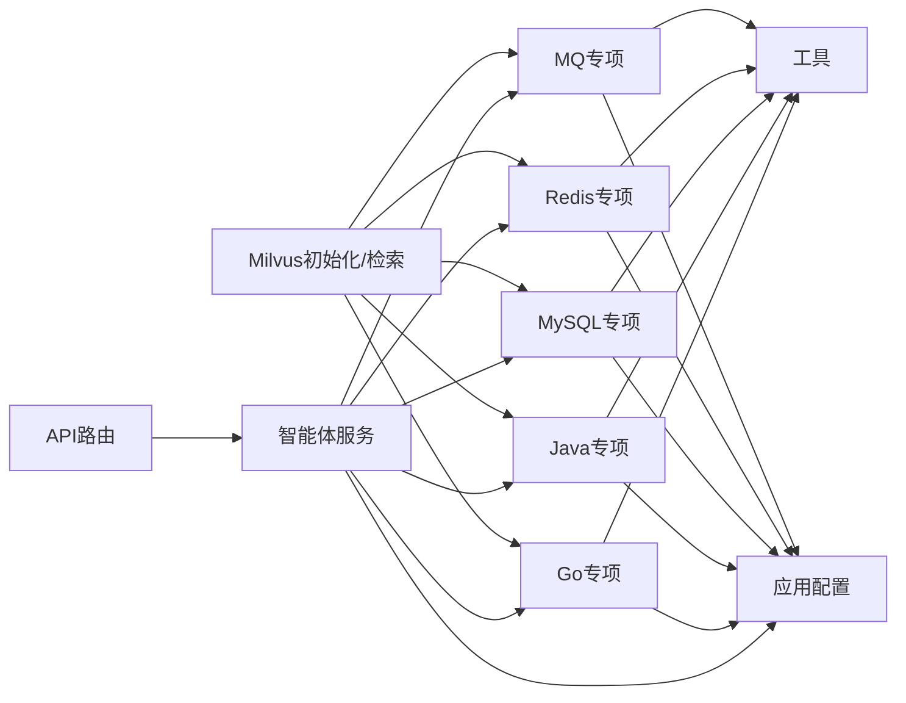

# 专项面试智能体

<cite>
**本文引用的文件**
- [backend/chatApp/main.go](file://backend/chatApp/main.go)
- [backend/chatApp/config/config.go](file://backend/chatApp/config/config.go)
- [backend/internal/config/config.go](file://backend/internal/config/config.go)
- [backend/api/router/register.go](file://backend/api/router/register.go)
- [backend/api/router/interview/api.go](file://backend/api/router/interview/api.go)
- [backend/chatApp/agent/interview/specialized/go_agent.go](file://backend/chatApp/agent/interview/specialized/go_agent.go)
- [backend/chatApp/agent/interview/specialized/java_agent.go](file://backend/chatApp/agent/interview/specialized/java_agent.go)
- [backend/chatApp/agent/interview/specialized/mysql_agent.go](file://backend/chatApp/agent/interview/specialized/mysql_agent.go)
- [backend/chatApp/agent/interview/specialized/redis_agent.go](file://backend/chatApp/agent/interview/specialized/redis_agent.go)
- [backend/chatApp/agent/interview/specialized/mq_agent.go](file://backend/chatApp/agent/interview/specialized/mq_agent.go)
- [backend/chatApp/agent/interview/specialized/constants.go](file://backend/chatApp/agent/interview/specialized/constants.go)
- [backend/chatApp/agent_service/interview/interview_agent_service.go](file://backend/chatApp/agent_service/interview/interview_agent_service.go)
- [backend/chatApp/tool/get_resume_info_tool.go](file://backend/chatApp/tool/get_resume_info_tool.go)
- [backend/chatApp/tool/get_mianshi_info_tool.go](file://backend/chatApp/tool/get_mianshi_info_tool.go)
- [backend/internal/eino/milvus/init.go](file://backend/internal/eino/milvus/init.go)
- [backend/internal/eino/milvus/importer.go](file://backend/internal/eino/milvus/importer.go)
- [backend/internal/eino/milvus/retrieval/retriever.go](file://backend/internal/eino/milvus/retrieval/retriever.go)
</cite>

## 目录
1. [简介](#简介)
2. [项目结构](#项目结构)
3. [核心组件](#核心组件)
4. [架构总览](#架构总览)
5. [详细组件分析](#详细组件分析)
6. [依赖关系分析](#依赖关系分析)
7. [性能考量](#性能考量)
8. [故障排查指南](#故障排查指南)
9. [结论](#结论)
10. [附录](#附录)

## 简介
本项目围绕“专项面试智能体”构建，面向 Go、Java、MySQL、Redis、MQ 等技术栈，提供可定制、可扩展的智能面试体验。系统以 Eino 框架为核心，结合 Milvus 向量检索、OpenAI 大模型与工具链，形成“知识库-检索-问答-评估”的闭环。专项智能体通过领域化的提示词与工具集成，实现对候选人在特定技术领域的深度考察，并支持简历信息与历史面试对话的辅助问答。

## 项目结构
后端采用模块化组织，前端基于 Next.js。核心后端位于 backend 目录，包含 API 路由、智能体服务、工具、向量检索与配置等模块；内部 eino 子模块封装 Milvus 初始化、文档导入与检索服务；chatApp 子模块承载智能体与工具的具体实现。

**图表来源**
- [backend/api/router/register.go](file://backend/api/router/register.go#L11-L16)
- [backend/api/router/interview/api.go](file://backend/api/router/interview/api.go#L17-L103)
- [backend/chatApp/agent_service/interview/interview_agent_service.go](file://backend/chatApp/agent_service/interview/interview_agent_service.go#L50-L73)
- [backend/chatApp/agent/interview/specialized/go_agent.go](file://backend/chatApp/agent/interview/specialized/go_agent.go#L16-L47)
- [backend/chatApp/agent/interview/specialized/java_agent.go](file://backend/chatApp/agent/interview/specialized/java_agent.go#L16-L47)
- [backend/chatApp/agent/interview/specialized/mysql_agent.go](file://backend/chatApp/agent/interview/specialized/mysql_agent.go#L16-L47)
- [backend/chatApp/agent/interview/specialized/redis_agent.go](file://backend/chatApp/agent/interview/specialized/redis_agent.go#L16-L47)
- [backend/chatApp/agent/interview/specialized/mq_agent.go](file://backend/chatApp/agent/interview/specialized/mq_agent.go#L16-L47)
- [backend/chatApp/tool/get_resume_info_tool.go](file://backend/chatApp/tool/get_resume_info_tool.go#L37-L47)
- [backend/chatApp/tool/get_mianshi_info_tool.go](file://backend/chatApp/tool/get_mianshi_info_tool.go#L39-L49)
- [backend/internal/config/config.go](file://backend/internal/config/config.go#L137-L152)
- [backend/chatApp/config/config.go](file://backend/chatApp/config/config.go#L36-L73)
- [backend/internal/eino/milvus/init.go](file://backend/internal/eino/milvus/init.go#L42-L143)
- [backend/internal/eino/milvus/importer.go](file://backend/internal/eino/milvus/importer.go#L19-L27)
- [backend/internal/eino/milvus/retrieval/retriever.go](file://backend/internal/eino/milvus/retrieval/retriever.go#L22-L89)

**章节来源**
- [backend/api/router/register.go](file://backend/api/router/register.go#L11-L16)
- [backend/api/router/interview/api.go](file://backend/api/router/interview/api.go#L17-L103)
- [backend/chatApp/agent_service/interview/interview_agent_service.go](file://backend/chatApp/agent_service/interview/interview_agent_service.go#L50-L73)
- [backend/internal/config/config.go](file://backend/internal/config/config.go#L137-L152)

## 核心组件
- 面试智能体服务：统一调度综合与专项智能体，支持回调式运行与迭代输出。
- 专项智能体：针对 Go、Java、MySQL、Redis、MQ 的专用提示词与工具配置。
- 工具集：简历信息工具、面试对话记录工具，增强智能体对候选人背景的了解。
- 向量检索与知识库：Milvus 初始化、文档导入与检索服务，支撑问题生成与难度控制。
- 配置体系：应用配置与聊天配置分离，支持环境变量展开与外部服务接入。

**章节来源**
- [backend/chatApp/agent_service/interview/interview_agent_service.go](file://backend/chatApp/agent_service/interview/interview_agent_service.go#L30-L73)
- [backend/chatApp/agent/interview/specialized/constants.go](file://backend/chatApp/agent/interview/specialized/constants.go#L3-L50)
- [backend/chatApp/tool/get_resume_info_tool.go](file://backend/chatApp/tool/get_resume_info_tool.go#L21-L34)
- [backend/chatApp/tool/get_mianshi_info_tool.go](file://backend/chatApp/tool/get_mianshi_info_tool.go#L23-L36)
- [backend/internal/eino/milvus/init.go](file://backend/internal/eino/milvus/init.go#L42-L143)
- [backend/internal/config/config.go](file://backend/internal/config/config.go#L137-L152)

## 架构总览
系统以“API 路由 -> 智能体服务 -> 专项智能体 -> 工具/模型 -> Milvus 检索”的链路工作。API 层负责暴露面试相关接口；智能体服务根据类型选择对应专项智能体；专项智能体通过提示词驱动大模型生成问题；必要时借助工具读取简历与历史对话；知识库通过 Milvus 提供向量检索能力，保障问题生成与难度控制的准确性与时效性。

**图表来源**
- [backend/api/router/interview/api.go](file://backend/api/router/interview/api.go#L44-L46)
- [backend/chatApp/agent_service/interview/interview_agent_service.go](file://backend/chatApp/agent_service/interview/interview_agent_service.go#L85-L101)
- [backend/chatApp/agent/interview/specialized/go_agent.go](file://backend/chatApp/agent/interview/specialized/go_agent.go#L30-L42)
- [backend/chatApp/tool/get_resume_info_tool.go](file://backend/chatApp/tool/get_resume_info_tool.go#L37-L47)
- [backend/internal/eino/milvus/retrieval/retriever.go](file://backend/internal/eino/milvus/retrieval/retriever.go#L96-L130)

## 详细组件分析

### 专项智能体设计与实现
- 设计原则
  - 专用提示词：每类专项智能体拥有独立提示词常量，明确职责、约束与提问策略。
  - 工具可选：根据 needResumeTool 参数决定是否注入简历信息工具，增强个性化。
  - 模型与迭代：统一使用 OpenAI 聊天模型，设定最大迭代次数，确保对话可控。
- 实现要点
  - Go/Java/MySQL/Redis/MQ 智能体均通过工厂方法创建，复用统一的 Agent 配置流程。
  - 提示词覆盖基础知识、进阶概念与实战应用，支持难度递进与追问引导。
- 扩展性
  - 新增技术栈只需新增提示词与工厂方法，保持服务层与工具层接口稳定。

**图表来源**
- [backend/chatApp/agent_service/interview/interview_agent_service.go](file://backend/chatApp/agent_service/interview/interview_agent_service.go#L50-L73)
- [backend/chatApp/agent/interview/specialized/go_agent.go](file://backend/chatApp/agent/interview/specialized/go_agent.go#L35-L42)
- [backend/chatApp/agent/interview/specialized/java_agent.go](file://backend/chatApp/agent/interview/specialized/java_agent.go#L35-L42)
- [backend/chatApp/agent/interview/specialized/mysql_agent.go](file://backend/chatApp/agent/interview/specialized/mysql_agent.go#L35-L42)
- [backend/chatApp/agent/interview/specialized/redis_agent.go](file://backend/chatApp/agent/interview/specialized/redis_agent.go#L35-L42)
- [backend/chatApp/agent/interview/specialized/mq_agent.go](file://backend/chatApp/agent/interview/specialized/mq_agent.go#L35-L42)

**章节来源**
- [backend/chatApp/agent/interview/specialized/go_agent.go](file://backend/chatApp/agent/interview/specialized/go_agent.go#L16-L47)
- [backend/chatApp/agent/interview/specialized/java_agent.go](file://backend/chatApp/agent/interview/specialized/java_agent.go#L16-L47)
- [backend/chatApp/agent/interview/specialized/mysql_agent.go](file://backend/chatApp/agent/interview/specialized/mysql_agent.go#L16-L47)
- [backend/chatApp/agent/interview/specialized/redis_agent.go](file://backend/chatApp/agent/interview/specialized/redis_agent.go#L16-L47)
- [backend/chatApp/agent/interview/specialized/mq_agent.go](file://backend/chatApp/agent/interview/specialized/mq_agent.go#L16-L47)
- [backend/chatApp/agent/interview/specialized/constants.go](file://backend/chatApp/agent/interview/specialized/constants.go#L3-L50)

### 知识库构建与检索
- 初始化与服务装配
  - MilvusManager 负责连接 Milvus、初始化 Embedding、文档分割、索引与检索服务，并提供健康检查与关闭。
- 文档导入
  - MarkdownImporter 支持文件/目录批量导入，自动提取标题、生成块 ID、写入 Milvus。
  - 支持纯文本导入（ImportText/ImportTexts），便于飞书等来源的 Markdown 文本直接入库。
- 检索服务
  - RetrieverService 封装 Milvus 检索，支持过滤表达式、TopK、阈值筛选与集合切换。
- 难度控制与问题生成
  - 通过检索返回的相关文档，结合专项提示词，引导智能体在“基础知识-进阶概念-实战应用”之间递进提问，实现难度自适应。

**图表来源**
- [backend/internal/eino/milvus/importer.go](file://backend/internal/eino/milvus/importer.go#L80-L142)
- [backend/internal/eino/milvus/importer.go](file://backend/internal/eino/milvus/importer.go#L144-L207)
- [backend/internal/eino/milvus/importer.go](file://backend/internal/eino/milvus/importer.go#L345-L443)

**章节来源**
- [backend/internal/eino/milvus/init.go](file://backend/internal/eino/milvus/init.go#L42-L143)
- [backend/internal/eino/milvus/importer.go](file://backend/internal/eino/milvus/importer.go#L19-L27)
- [backend/internal/eino/milvus/retrieval/retriever.go](file://backend/internal/eino/milvus/retrieval/retriever.go#L96-L130)

### 工具与数据流
- 简历信息工具：按简历 ID 查询解析后的简历内容，供智能体在提问时参考候选人的项目与经验。
- 面试对话记录工具：按用户与报告 ID 查询历史对话，帮助智能体进行连贯追问与评估。
- 工具注入：专项智能体在 needResumeTool 为真时，将工具注入 ToolsConfig，使智能体具备读取能力。

**图表来源**
- [backend/chatApp/tool/get_resume_info_tool.go](file://backend/chatApp/tool/get_resume_info_tool.go#L21-L34)
- [backend/chatApp/tool/get_mianshi_info_tool.go](file://backend/chatApp/tool/get_mianshi_info_tool.go#L23-L36)

**章节来源**
- [backend/chatApp/tool/get_resume_info_tool.go](file://backend/chatApp/tool/get_resume_info_tool.go#L37-L47)
- [backend/chatApp/tool/get_mianshi_info_tool.go](file://backend/chatApp/tool/get_mianshi_info_tool.go#L39-L49)

### 配置模板与参数调优
- 应用配置（YAML）
  - 数据库、Redis、Hertz、Eino、面试参数、安全、搜索引擎、OpenAI、Embedding、Milvus、文档分割器、微信/飞书/邮件等。
  - 支持环境变量展开，便于在不同环境切换。
- 聊天配置（示例）
  - 示例展示如何加载配置文件并进行基本校验。
- 参数调优建议
  - Eino 模型温度、最大 Token、重试次数与延迟：平衡生成稳定性与成本。
  - 面试参数：最大/最小题目数、单题超时、整场时长：控制体验节奏。
  - Milvus：TopK、距离度量、检索超时：影响召回质量与响应速度。
  - 文档分割器：ChunkSize、OverlapSize、分隔符策略：平衡语义完整性与检索精度。

**章节来源**
- [backend/internal/config/config.go](file://backend/internal/config/config.go#L137-L152)
- [backend/internal/config/config.go](file://backend/internal/config/config.go#L212-L268)
- [backend/chatApp/config/config.go](file://backend/chatApp/config/config.go#L36-L73)

### 性能监控方案
- 健康检查：MilvusManager 提供健康检查，验证连接与集合状态。
- 日志与指标：Hertz 日志级别与路径、关键操作日志（导入、检索、智能体运行）。
- 资源与超时：数据库连接池、Redis 超时、Embedding 重试与超时、Milvus 搜索超时。
- 建议：对接 Prometheus/Grafana，采集 Milvus 检索耗时、智能体迭代次数、工具调用耗时等。

**章节来源**
- [backend/internal/eino/milvus/init.go](file://backend/internal/eino/milvus/init.go#L204-L218)
- [backend/internal/config/config.go](file://backend/internal/config/config.go#L86-L92)

## 依赖关系分析
- 模块耦合
  - API 路由依赖智能体服务；智能体服务依赖专项智能体与工具；专项智能体依赖模型与可选工具；工具依赖数据访问层；智能体服务与工具均依赖配置。
  - Milvus 初始化与检索服务被智能体与导入器共同依赖，形成清晰的基础设施层。
- 外部依赖
  - OpenAI 模型、Milvus、数据库与 Redis 作为外部系统，通过配置与服务封装进行解耦。
- 循环依赖
  - 当前结构未发现循环依赖；智能体与工具通过接口抽象与工厂方法解耦。

**图表来源**
- [backend/api/router/interview/api.go](file://backend/api/router/interview/api.go#L17-L103)
- [backend/chatApp/agent_service/interview/interview_agent_service.go](file://backend/chatApp/agent_service/interview/interview_agent_service.go#L50-L73)
- [backend/chatApp/agent/interview/specialized/go_agent.go](file://backend/chatApp/agent/interview/specialized/go_agent.go#L35-L42)
- [backend/chatApp/tool/get_resume_info_tool.go](file://backend/chatApp/tool/get_resume_info_tool.go#L37-L47)
- [backend/internal/eino/milvus/init.go](file://backend/internal/eino/milvus/init.go#L42-L143)

**章节来源**
- [backend/api/router/interview/api.go](file://backend/api/router/interview/api.go#L17-L103)
- [backend/chatApp/agent_service/interview/interview_agent_service.go](file://backend/chatApp/agent_service/interview/interview_agent_service.go#L50-L73)

## 性能考量
- 检索性能
  - 合理设置 TopK 与阈值，避免过多无关文档干扰；选择合适的距离度量（L2/IP/COSINE）。
  - 文档分割器参数影响召回与速度，需结合业务场景调参。
- 生成性能
  - 控制温度与最大 Token，减少长尾输出；合理设置最大迭代次数，避免长时间运行。
- 存储与索引
  - Milvus 集合命名与多集合映射，配合检索过滤表达式，提高检索效率。
- 网络与超时
  - Embedding 与 Milvus 操作设置超时与重试，避免阻塞影响整体体验。

## 故障排查指南
- 配置加载失败
  - 检查配置文件路径与权限；确认必需字段（如 API Key、引擎 ID）已填写。
- Milvus 连接异常
  - 使用健康检查接口验证连接；核对地址、用户名、密码与数据库名。
- 智能体运行错误
  - 查看回调输出中的错误事件；确认模型配置与 API Key 有效。
- 工具调用失败
  - 核对请求参数（简历 ID、用户 ID、报告 ID）；检查数据访问层日志。

**章节来源**
- [backend/chatApp/config/config.go](file://backend/chatApp/config/config.go#L56-L73)
- [backend/internal/eino/milvus/init.go](file://backend/internal/eino/milvus/init.go#L204-L218)
- [backend/chatApp/agent_service/interview/interview_agent_service.go](file://backend/chatApp/agent_service/interview/interview_agent_service.go#L134-L136)
- [backend/chatApp/tool/get_resume_info_tool.go](file://backend/chatApp/tool/get_resume_info_tool.go#L25-L30)

## 结论
专项面试智能体通过“提示词驱动 + 工具增强 + 向量检索 + 可配置参数”的组合，实现了对 Go、Java、MySQL、Redis、MQ 等技术栈的深度评估。系统具备良好的扩展性与可维护性，可通过新增专项智能体与知识库内容，持续丰富面试体验。建议在生产环境中完善监控与告警、优化检索参数与生成策略，并加强安全与合规管理。

## 附录
- 快速启动
  - 加载配置文件，初始化 Milvus 与数据库，启动 API 服务。
- 常用命令
  - 参考项目根目录常用命令文档，包含构建、运行与部署命令。