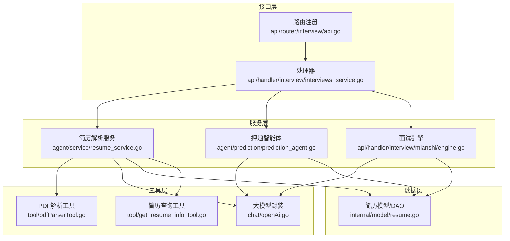
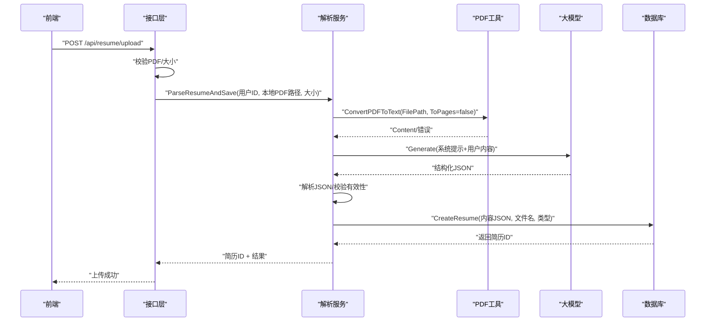
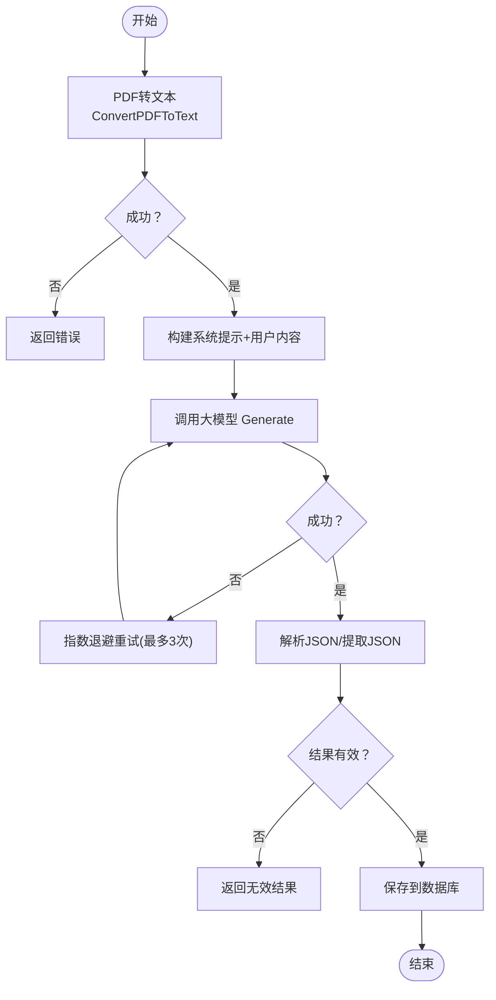
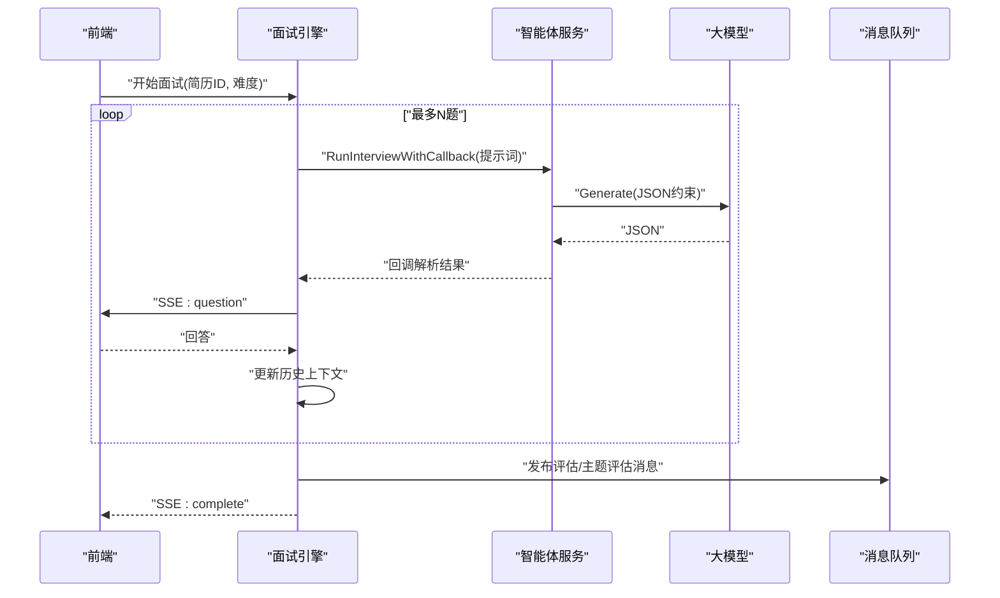
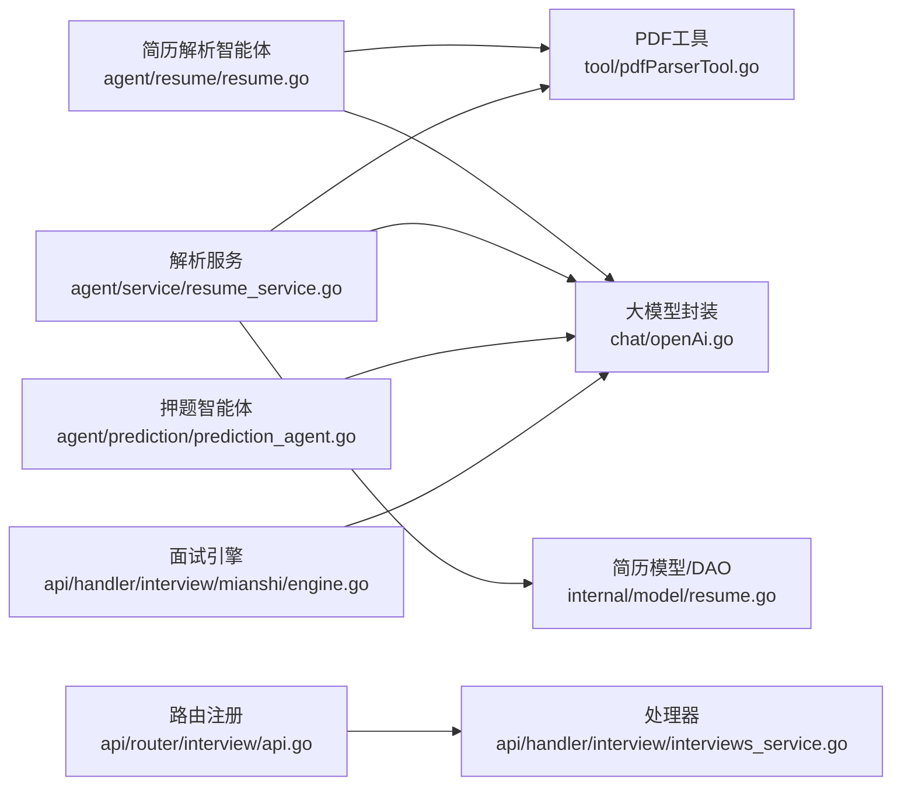

# 简历分析智能体

<cite>
**本文引用的文件**
- [backend/chatApp/agent/resume/resume.go](file://backend/chatApp/agent/resume/resume.go)
- [backend/chatApp/agent/service/resume_service.go](file://backend/chatApp/agent/service/resume_service.go)
- [backend/chatApp/tool/pdfParserTool.go](file://backend/chatApp/tool/pdfParserTool.go)
- [backend/chatApp/tool/get_resume_info_tool.go](file://backend/chatApp/tool/get_resume_info_tool.go)
- [backend/chatApp/chat/openAi.go](file://backend/chatApp/chat/openAi.go)
- [backend/internal/model/resume.go](file://backend/internal/model/resume.go)
- [backend/api/router/interview/api.go](file://backend/api/router/interview/api.go)
- [backend/api/handler/interview/interviews_service.go](file://backend/api/handler/interview/interviews_service.go)
- [backend/chatApp/agent/prediction/prediction_agent.go](file://backend/chatApp/agent/prediction/prediction_agent.go)
- [backend/api/handler/interview/mianshi/engine.go](file://backend/api/handler/interview/mianshi/engine.go)
- [backend/chatApp/agent/interview/comprehensive/school_comprehensive_agent.go](file://backend/chatApp/agent/interview/comprehensive/school_comprehensive_agent.go)
- [backend/chatApp/agent/interview/specialized/go_agent.go](file://backend/chatApp/agent/interview/specialized/go_agent.go)
- [backend/chatApp/agent/service/json_utils.go](file://backend/chatApp/agent/service/json_utils.go)
- [backend/chatApp/config/config.go](file://backend/chatApp/config/config.go)
- [doc/需求文档/简历押题.md](file://doc/需求文档/简历押题.md)
- [doc/teach/上传简历端到端教学.md](file://doc/teach/上传简历端到端教学.md)
- [frontend/src/app/resume/page.tsx](file://frontend/src/app/resume/page.tsx)
</cite>

## 目录
1. [简介](#简介)
2. [项目结构](#项目结构)
3. [核心组件](#核心组件)
4. [架构总览](#架构总览)
5. [详细组件分析](#详细组件分析)
6. [依赖分析](#依赖分析)
7. [性能考虑](#性能考虑)
8. [故障排查指南](#故障排查指南)
9. [结论](#结论)
10. [附录](#附录)

## 简介
本技术文档围绕“简历分析智能体”的完整实现进行深入剖析，覆盖简历解析、信息抽取、结构化处理、智能分析与面试押题生成的全流程。文档详细说明了智能体如何从PDF简历中识别关键技能、项目经验与工作职责，并基于解析结果生成针对性的面试问题与押题建议。同时，文档阐述了简历解析的准确性优化策略、多格式支持现状与异常处理机制，并提供配置参数与性能调优指南，帮助开发者与运维人员高效部署与维护。

## 项目结构
后端采用模块化分层设计，核心围绕“上传-解析-存储-分析-面试”链路展开：
- 接口层：Hertz 路由注册与处理器，负责简历上传、查询与默认简历设置等。
- 服务层：简历解析流水线、押题生成与面试引擎。
- 工具层：PDF 文本提取工具、简历信息查询工具、大模型封装。
- 模型与DAO：简历数据模型与数据库操作。
- 前端：简历上传与押题界面交互。

图表来源
- [backend/api/router/interview/api.go](file://backend/api/router/interview/api.go#L17-L103)
- [backend/api/handler/interview/interviews_service.go](file://backend/api/handler/interview/interviews_service.go#L94-L139)
- [backend/chatApp/agent/service/resume_service.go](file://backend/chatApp/agent/service/resume_service.go#L55-L214)
- [backend/chatApp/tool/pdfParserTool.go](file://backend/chatApp/tool/pdfParserTool.go#L39-L124)
- [backend/chatApp/tool/get_resume_info_tool.go](file://backend/chatApp/tool/get_resume_info_tool.go#L21-L47)
- [backend/chatApp/chat/openAi.go](file://backend/chatApp/chat/openAi.go#L19-L109)
- [backend/internal/model/resume.go](file://backend/internal/model/resume.go#L13-L41)

章节来源
- [backend/api/router/interview/api.go](file://backend/api/router/interview/api.go#L17-L103)
- [backend/api/handler/interview/interviews_service.go](file://backend/api/handler/interview/interviews_service.go#L94-L139)

## 核心组件
- 简历解析智能体：基于 Eino 框架，通过“pdf_to_text”工具解析PDF，再由大模型结构化解析为标准化 JSON 并入库。
- PDF 文本提取工具：封装 pdftotext CLI，支持参数校验、超时控制与错误回传。
- 大模型封装：统一创建 Chat 模型，进行 API Key 校验、URL 清洗与错误分类。
- 简历模型与DAO：简历实体、默认简历设置、分页查询与软删除。
- 押题智能体：根据简历内容生成个性化面试题，包含重点考察、思考路径与参考答案。
- 面试引擎：按轮次生成问题，维护历史上下文，支持SSE推送与MQ评估消息发布。
- 简历查询工具：按简历ID查询解析后的内容，供面试智能体使用。

章节来源
- [backend/chatApp/agent/resume/resume.go](file://backend/chatApp/agent/resume/resume.go#L14-L108)
- [backend/chatApp/tool/pdfParserTool.go](file://backend/chatApp/tool/pdfParserTool.go#L39-L124)
- [backend/chatApp/chat/openAi.go](file://backend/chatApp/chat/openAi.go#L19-L109)
- [backend/internal/model/resume.go](file://backend/internal/model/resume.go#L13-L41)
- [backend/chatApp/agent/prediction/prediction_agent.go](file://backend/chatApp/agent/prediction/prediction_agent.go#L25-L65)
- [backend/api/handler/interview/mianshi/engine.go](file://backend/api/handler/interview/mianshi/engine.go#L23-L291)
- [backend/chatApp/tool/get_resume_info_tool.go](file://backend/chatApp/tool/get_resume_info_tool.go#L21-L47)

## 架构总览
简历分析智能体的端到端流程如下：

图表来源
- [backend/api/handler/interview/interviews_service.go](file://backend/api/handler/interview/interviews_service.go#L94-L139)
- [backend/chatApp/agent/service/resume_service.go](file://backend/chatApp/agent/service/resume_service.go#L55-L214)
- [backend/chatApp/tool/pdfParserTool.go](file://backend/chatApp/tool/pdfParserTool.go#L39-L124)
- [backend/chatApp/chat/openAi.go](file://backend/chatApp/chat/openAi.go#L19-L109)
- [backend/internal/model/resume.go](file://backend/internal/model/resume.go#L32-L41)

## 详细组件分析

### 简历解析智能体与解析服务
- 智能体职责：定义解析指令、强制使用 pdf_to_text 工具、限定返回 JSON 格式、提取基本信息、教育背景、工作经历、技术栈、项目经验、技能、证书、优势与弱项等。
- 解析服务职责：执行三步流程（PDF转文本→构建提示词→大模型分析），内置超时与指数退避重试，解析并校验结果，最终入库。
- 准确性保障：对空内容与无效结果进行校验；对大模型输出进行 JSON 提取与二次解析；对 pdftotext 执行进行超时与错误归因。

图表来源
- [backend/chatApp/agent/resume/resume.go](file://backend/chatApp/agent/resume/resume.go#L26-L92)
- [backend/chatApp/agent/service/resume_service.go](file://backend/chatApp/agent/service/resume_service.go#L55-L214)
- [backend/chatApp/tool/pdfParserTool.go](file://backend/chatApp/tool/pdfParserTool.go#L39-L124)
- [backend/chatApp/agent/service/json_utils.go](file://backend/chatApp/agent/service/json_utils.go#L7-L61)

章节来源
- [backend/chatApp/agent/resume/resume.go](file://backend/chatApp/agent/resume/resume.go#L14-L108)
- [backend/chatApp/agent/service/resume_service.go](file://backend/chatApp/agent/service/resume_service.go#L55-L214)
- [backend/chatApp/agent/service/json_utils.go](file://backend/chatApp/agent/service/json_utils.go#L7-L61)

### PDF文本提取工具
- 功能：封装 pdftotext CLI，支持参数校验、文件存在性检查、超时控制、错误信息透传。
- 设计要点：使用 context 控制超时；捕获 stderr 便于诊断；统一返回结构化结果，包含成功标志、内容、页数与元数据。

章节来源
- [backend/chatApp/tool/pdfParserTool.go](file://backend/chatApp/tool/pdfParserTool.go#L39-L124)

### 大模型封装与错误分类
- 功能：根据用户模型配置创建 Chat 模型，进行 API Key 校验、URL 清洗、HTTP 客户端定制与错误分类（配额不足、速率限制、上下文超限等）。
- 设计要点：禁用 KeepAlive、限制响应头超时、强制 HTTP/1.1，避免连接与帧错误；日志记录请求与响应状态，便于调试。

章节来源
- [backend/chatApp/chat/openAi.go](file://backend/chatApp/chat/openAi.go#L19-L109)

### 简历模型与DAO
- 数据模型：包含简历ID、用户ID、内容JSON、文件名、大小、类型、默认标记、软删除与时间戳。
- DAO方法：创建、按ID查询、按用户查询、默认简历设置、更新、软删除、分页查询与计数。

章节来源
- [backend/internal/model/resume.go](file://backend/internal/model/resume.go#L13-L41)
- [backend/internal/model/resume.go](file://backend/internal/model/resume.go#L32-L41)
- [backend/internal/model/resume.go](file://backend/internal/model/resume.go#L43-L84)
- [backend/internal/model/resume.go](file://backend/internal/model/resume.go#L87-L129)
- [backend/internal/model/resume.go](file://backend/internal/model/resume.go#L131-L156)
- [backend/internal/model/resume.go](file://backend/internal/model/resume.go#L158-L169)

### 押题智能体与面试引擎
- 押题智能体：严格生成固定数量的题目，返回结构化 JSON，包含问题、重点考察、思考路径、参考答案与可能追问。
- 面试引擎：逐题生成，维护最近N题历史上下文，支持SSE事件推送、超时与心跳、MQ评估消息发布。

图表来源
- [backend/chatApp/agent/prediction/prediction_agent.go](file://backend/chatApp/agent/prediction/prediction_agent.go#L25-L65)
- [backend/api/handler/interview/mianshi/engine.go](file://backend/api/handler/interview/mianshi/engine.go#L42-L230)
- [backend/chatApp/agent/interview/comprehensive/school_comprehensive_agent.go](file://backend/chatApp/agent/interview/comprehensive/school_comprehensive_agent.go#L14-L47)
- [backend/chatApp/agent/interview/specialized/go_agent.go](file://backend/chatApp/agent/interview/specialized/go_agent.go#L14-L47)

章节来源
- [backend/chatApp/agent/prediction/prediction_agent.go](file://backend/chatApp/agent/prediction/prediction_agent.go#L25-L65)
- [backend/api/handler/interview/mianshi/engine.go](file://backend/api/handler/interview/mianshi/engine.go#L23-L291)

### 简历查询工具与接口
- 简历查询工具：按简历ID查询解析后的内容，供面试智能体使用。
- 接口：上传（仅PDF，≤10MB）、查询默认/列表、删除、设置默认、更新。

章节来源
- [backend/chatApp/tool/get_resume_info_tool.go](file://backend/chatApp/tool/get_resume_info_tool.go#L21-L47)
- [backend/api/router/interview/api.go](file://backend/api/router/interview/api.go#L55-L63)
- [backend/api/handler/interview/interviews_service.go](file://backend/api/handler/interview/interviews_service.go#L94-L139)

## 依赖分析
- 组件耦合：解析服务依赖 PDF 工具与大模型封装；解析结果写入数据库；面试引擎依赖智能体服务与消息队列；路由与处理器贯穿各层。
- 外部依赖：pdftotext CLI、OpenAI兼容模型API、Hertz Web 框架、GORM ORM。
- 潜在风险：CLI 调用与网络请求的超时与错误需统一收敛；API Key 与URL清洗需在创建模型阶段完成；JSON 解析失败需具备回退策略。

图表来源
- [backend/chatApp/agent/resume/resume.go](file://backend/chatApp/agent/resume/resume.go#L14-L108)
- [backend/chatApp/agent/service/resume_service.go](file://backend/chatApp/agent/service/resume_service.go#L55-L214)
- [backend/chatApp/tool/pdfParserTool.go](file://backend/chatApp/tool/pdfParserTool.go#L39-L124)
- [backend/chatApp/chat/openAi.go](file://backend/chatApp/chat/openAi.go#L19-L109)
- [backend/internal/model/resume.go](file://backend/internal/model/resume.go#L13-L41)
- [backend/chatApp/agent/prediction/prediction_agent.go](file://backend/chatApp/agent/prediction/prediction_agent.go#L25-L65)
- [backend/api/handler/interview/mianshi/engine.go](file://backend/api/handler/interview/mianshi/engine.go#L23-L291)
- [backend/api/router/interview/api.go](file://backend/api/router/interview/api.go#L17-L103)
- [backend/api/handler/interview/interviews_service.go](file://backend/api/handler/interview/interviews_service.go#L94-L139)

## 性能考虑
- 超时与重试：解析服务对整体流程设置较长超时（如 300 秒），并对大模型请求采用指数退避重试，降低偶发抖动影响。
- I/O 与网络：PDF 工具调用 pdftotext CLI，注意系统环境与磁盘 I/O；大模型封装禁用 KeepAlive、限制响应头超时，避免连接泄漏。
- JSON 解析：对大模型输出进行 JSON 提取与二次解析，减少格式漂移带来的失败。
- 前端体验：上传超时设置为 5 分钟，保证大文件上传稳定性；押题生成约 30 秒，首题免费策略提升用户体验。

章节来源
- [backend/chatApp/agent/service/resume_service.go](file://backend/chatApp/agent/service/resume_service.go#L56-L174)
- [backend/chatApp/chat/openAi.go](file://backend/chatApp/chat/openAi.go#L64-L75)
- [frontend/src/app/resume/page.tsx](file://frontend/src/app/resume/page.tsx#L231-L244)

## 故障排查指南
- PDF 解析失败
  - 现象：返回错误或空内容。
  - 排查：检查文件路径、权限与存在性；确认 pdftotext 可执行；查看 stderr 与超时日志。
- 大模型调用失败
  - 现象：API Key 无效、配额不足、速率限制、上下文超限。
  - 排查：核对 API Key 与 BaseURL 清洗；检查网络连通性；根据错误类型调整重试策略。
- JSON 解析失败
  - 现象：大模型输出包含非结构化文本或Markdown。
  - 排查：启用 JSON 提取工具；确保提示词约束返回标准 JSON；对空结果进行校验。
- 数据库写入失败
  - 现象：序列化失败或创建记录异常。
  - 排查：检查数据库连接与迁移；确认字段类型与长度；查看 DAO 层错误日志。

章节来源
- [backend/chatApp/tool/pdfParserTool.go](file://backend/chatApp/tool/pdfParserTool.go#L56-L93)
- [backend/chatApp/chat/openAi.go](file://backend/chatApp/chat/openAi.go#L84-L106)
- [backend/chatApp/agent/service/json_utils.go](file://backend/chatApp/agent/service/json_utils.go#L7-L33)
- [backend/chatApp/agent/service/resume_service.go](file://backend/chatApp/agent/service/resume_service.go#L308-L342)

## 结论
本简历分析智能体通过“PDF解析+结构化抽取+大模型分析+数据库存储+面试引擎”的闭环，实现了从简历上传到个性化押题与面试的全流程自动化。其关键在于严格的工具调用约束、稳健的超时与重试机制、完善的错误分类与回退策略，以及清晰的模块边界与路由组织。未来可在异步解析、内容预览、多格式支持与更细粒度的语义理解方面持续演进。

## 附录

### 配置参数与环境
- 配置文件：config.yaml，包含谷歌搜索与可选 OpenAI 配置节点。
- 大模型参数：API Key、模型名称、BaseURL，均在创建模型时进行校验与清洗。
- 前端上传：限制 PDF 且 ≤10MB，超时 5 分钟。

章节来源
- [backend/chatApp/config/config.go](file://backend/chatApp/config/config.go#L34-L73)
- [backend/chatApp/chat/openAi.go](file://backend/chatApp/chat/openAi.go#L19-L62)
- [backend/api/handler/interview/interviews_service.go](file://backend/api/handler/interview/interviews_service.go#L101-L109)
- [frontend/src/app/resume/page.tsx](file://frontend/src/app/resume/page.tsx#L103-L131)

### 功能与流程参考
- 简历押题模块：从简历内容智能预测面试问题，覆盖项目经验、技术细节与HR关注点。
- 上传简历端到端教学：从IDL到路由、处理器、解析服务、数据库与查询的完整链路。

章节来源
- [doc/需求文档/简历押题.md](file://doc/需求文档/简历押题.md#L1-L41)
- [doc/teach/上传简历端到端教学.md](file://doc/teach/上传简历端到端教学.md#L41-L107)