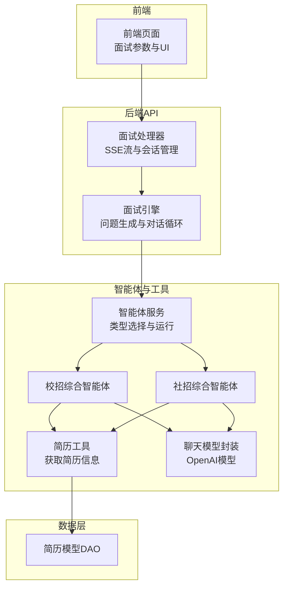
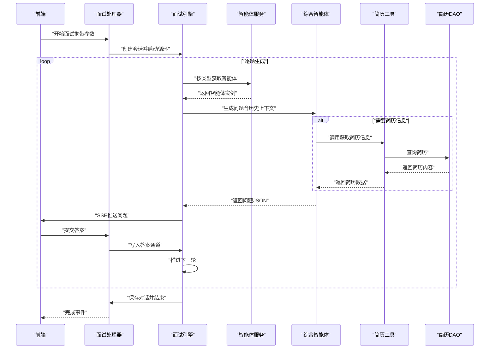
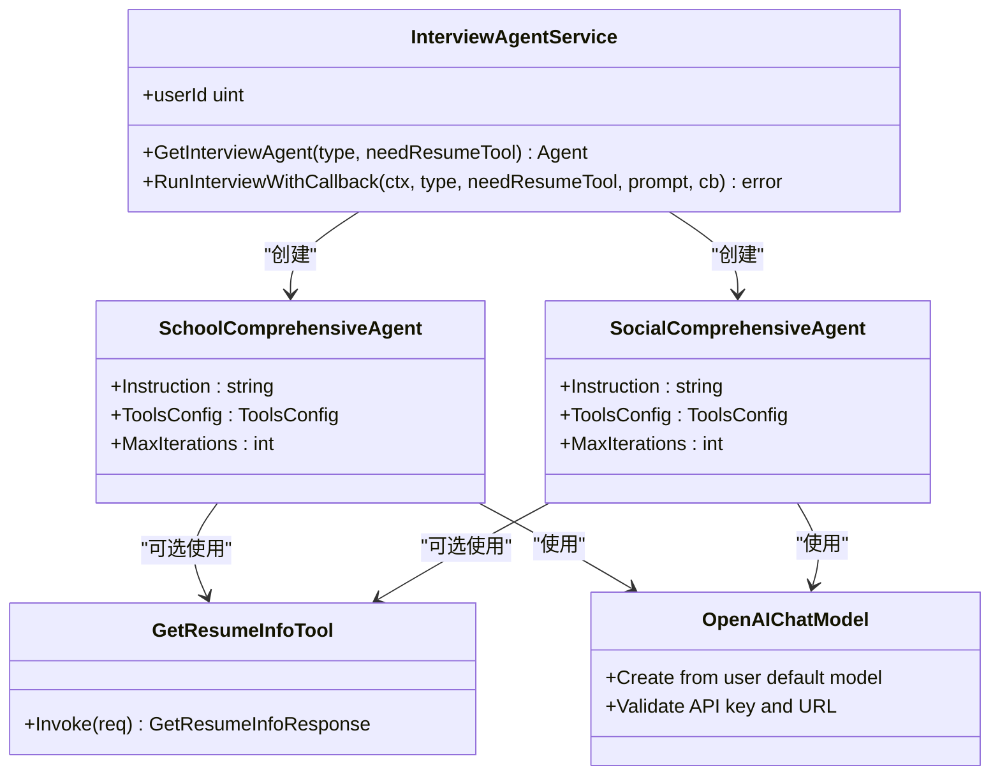
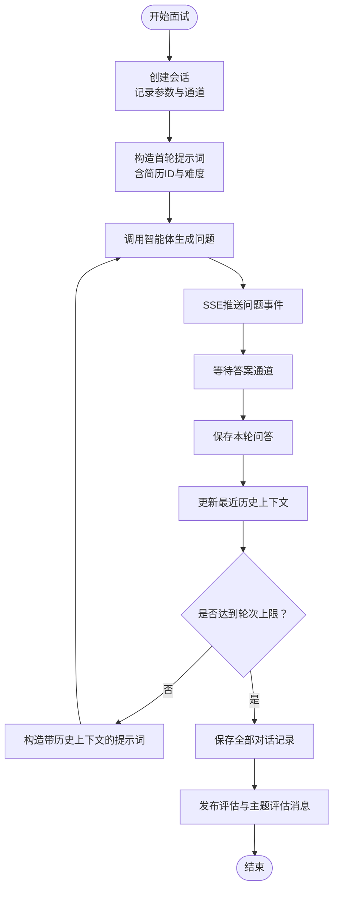
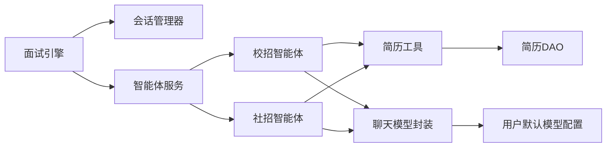

# 综合面试智能体

<cite>
**本文引用的文件**
- [backend/chatApp/agent/interview/comprehensive/constants.go](file://backend/chatApp/agent/interview/comprehensive/constants.go)
- [backend/chatApp/agent/interview/comprehensive/school_comprehensive_agent.go](file://backend/chatApp/agent/interview/comprehensive/school_comprehensive_agent.go)
- [backend/chatApp/agent/interview/comprehensive/social_comprehensive_agent.go](file://backend/chatApp/agent/interview/comprehensive/social_comprehensive_agent.go)
- [backend/chatApp/agent_service/interview/interview_agent_service.go](file://backend/chatApp/agent_service/interview/interview_agent_service.go)
- [backend/chatApp/tool/get_resume_info_tool.go](file://backend/chatApp/tool/get_resume_info_tool.go)
- [backend/chatApp/chat/openAi.go](file://backend/chatApp/chat/openAi.go)
- [backend/api/handler/interview/mianshi/engine.go](file://backend/api/handler/interview/mianshi/engine.go)
- [backend/api/handler/interview/mianshi/events.go](file://backend/api/handler/interview/mianshi/events.go)
- [backend/api/handler/interview/mianshi/types.go](file://backend/api/handler/interview/mianshi/types.go)
- [backend/internal/model/resume.go](file://backend/internal/model/resume.go)
</cite>

## 目录
1. [简介](#简介)
2. [项目结构](#项目结构)
3. [核心组件](#核心组件)
4. [架构总览](#架构总览)
5. [组件详细分析](#组件详细分析)
6. [依赖关系分析](#依赖关系分析)
7. [性能考量](#性能考量)
8. [故障排查指南](#故障排查指南)
9. [结论](#结论)
10. [附录](#附录)

## 简介
本文件面向“综合面试智能体”的设计与实现，聚焦于校招与社招两类综合面试智能体的差异与共性，系统阐述指令模板、工具配置、对话策略、初始化流程、状态管理与对话控制机制，并解释简历工具对面试体验的影响及配置参数与性能优化建议。读者可据此理解智能体如何依据候选人背景（应届生 vs 有工作经验）调整面试重点与评估标准。

## 项目结构
后端采用分层与按功能域划分的组织方式：
- chatApp：智能体与工具层，包含综合/专项智能体、工具与聊天模型封装
- api/handler/interview/mianshi：面试引擎与会话管理，负责对话循环、SSE事件推送与状态持久化
- internal/model：数据模型与DAO，支撑简历、对话记录等数据访问
- frontend：前端页面与交互，驱动面试流程与参数传递

图表来源
- [backend/api/handler/interview/mianshi/engine.go](file://backend/api/handler/interview/mianshi/engine.go#L23-L37)
- [backend/chatApp/agent_service/interview/interview_agent_service.go](file://backend/chatApp/agent_service/interview/interview_agent_service.go#L30-L40)
- [backend/chatApp/agent/interview/comprehensive/school_comprehensive_agent.go](file://backend/chatApp/agent/interview/comprehensive/school_comprehensive_agent.go#L14-L47)
- [backend/chatApp/agent/interview/comprehensive/social_comprehensive_agent.go](file://backend/chatApp/agent/interview/comprehensive/social_comprehensive_agent.go#L14-L47)
- [backend/chatApp/tool/get_resume_info_tool.go](file://backend/chatApp/tool/get_resume_info_tool.go#L21-L34)
- [backend/chatApp/chat/openAi.go](file://backend/chatApp/chat/openAi.go#L19-L109)
- [backend/internal/model/resume.go](file://backend/internal/model/resume.go#L43-L54)

章节来源
- [backend/api/handler/interview/mianshi/engine.go](file://backend/api/handler/interview/mianshi/engine.go#L23-L37)
- [backend/chatApp/agent_service/interview/interview_agent_service.go](file://backend/chatApp/agent_service/interview/interview_agent_service.go#L30-L40)

## 核心组件
- 指令模板与策略
  - 校招与社招智能体分别内置不同指令模板，明确面试目标、职责、策略与提问建议，确保针对不同背景的候选人调整侧重点。
- 工具配置
  - 当需要简历信息时，智能体可启用“获取简历信息”工具，实现对候选人背景的动态拉取与上下文增强。
- 对话策略
  - 引擎采用逐题生成与等待回答的模式，维持固定轮次上限与历史上下文窗口，结合SSE事件驱动前端交互。
- 初始化流程
  - 通过智能体服务按类型创建对应智能体；聊天模型基于用户默认模型配置与密钥动态构建。
- 状态管理与对话控制
  - 会话管理器负责创建/持有会话、通道同步答案、记录活动状态与时间戳；引擎在每个问题之间等待回答并推进进度。

章节来源
- [backend/chatApp/agent/interview/comprehensive/constants.go](file://backend/chatApp/agent/interview/comprehensive/constants.go#L3-L46)
- [backend/chatApp/agent/interview/comprehensive/constants.go](file://backend/chatApp/agent/interview/comprehensive/constants.go#L48-L94)
- [backend/chatApp/agent/interview/comprehensive/school_comprehensive_agent.go](file://backend/chatApp/agent/interview/comprehensive/school_comprehensive_agent.go#L16-L46)
- [backend/chatApp/agent/interview/comprehensive/social_comprehensive_agent.go](file://backend/chatApp/agent/interview/comprehensive/social_comprehensive_agent.go#L16-L46)
- [backend/chatApp/agent_service/interview/interview_agent_service.go](file://backend/chatApp/agent_service/interview/interview_agent_service.go#L42-L73)
- [backend/chatApp/chat/openAi.go](file://backend/chatApp/chat/openAi.go#L19-L109)
- [backend/api/handler/interview/mianshi/engine.go](file://backend/api/handler/interview/mianshi/engine.go#L39-L230)
- [backend/api/handler/interview/mianshi/types.go](file://backend/api/handler/interview/mianshi/types.go#L52-L82)

## 架构总览
整体流程：前端发起面试请求，后端建立SSE流，引擎按轮次生成问题并通过智能体服务调度具体智能体，必要时调用简历工具获取候选人背景，随后等待用户回答并持续推进，最终保存对话记录并发布评估任务。

图表来源
- [backend/api/handler/interview/mianshi/engine.go](file://backend/api/handler/interview/mianshi/engine.go#L39-L230)
- [backend/chatApp/agent_service/interview/interview_agent_service.go](file://backend/chatApp/agent_service/interview/interview_agent_service.go#L42-L73)
- [backend/chatApp/agent/interview/comprehensive/school_comprehensive_agent.go](file://backend/chatApp/agent/interview/comprehensive/school_comprehensive_agent.go#L16-L46)
- [backend/chatApp/agent/interview/comprehensive/social_comprehensive_agent.go](file://backend/chatApp/agent/interview/comprehensive/social_comprehensive_agent.go#L16-L46)
- [backend/chatApp/tool/get_resume_info_tool.go](file://backend/chatApp/tool/get_resume_info_tool.go#L21-L34)
- [backend/internal/model/resume.go](file://backend/internal/model/resume.go#L43-L54)

## 组件详细分析

### 指令模板与对话策略
- 校招智能体
  - 面试目标：评估应届毕业生的基础知识、学习潜力、思维过程与职业素养
  - 策略要点：从背景出发选择话题，问题由浅入深，覆盖编程基础、并发与性能、项目经验、学习能力与软技能
  - 输出格式：仅返回一道问题的JSON对象
- 社招智能体
  - 面试目标：评估有工作经验候选人的实战经验、系统设计、技术深度、架构思想与领导力
  - 策略要点：深入挖掘项目经验，关注架构、性能、故障处理、技术决策与团队影响
  - 输出格式：仅返回一道问题的JSON对象

章节来源
- [backend/chatApp/agent/interview/comprehensive/constants.go](file://backend/chatApp/agent/interview/comprehensive/constants.go#L3-L46)
- [backend/chatApp/agent/interview/comprehensive/constants.go](file://backend/chatApp/agent/interview/comprehensive/constants.go#L48-L94)

### 智能体初始化与工具配置
- 初始化流程
  - 通过智能体服务按类型创建对应智能体，注入统一的聊天模型与可选工具配置
  - 聊天模型从用户默认模型配置中读取密钥、模型名与基础URL，进行有效性校验与HTTP客户端配置
- 工具配置
  - 当会话声明需要简历工具时，智能体在工具节点中注册“获取简历信息”工具
  - 工具调用时从DAO查询简历内容，返回给智能体用于增强问题生成

图表来源
- [backend/chatApp/agent_service/interview/interview_agent_service.go](file://backend/chatApp/agent_service/interview/interview_agent_service.go#L30-L73)
- [backend/chatApp/agent/interview/comprehensive/school_comprehensive_agent.go](file://backend/chatApp/agent/interview/comprehensive/school_comprehensive_agent.go#L16-L46)
- [backend/chatApp/agent/interview/comprehensive/social_comprehensive_agent.go](file://backend/chatApp/agent/interview/comprehensive/social_comprehensive_agent.go#L16-L46)
- [backend/chatApp/tool/get_resume_info_tool.go](file://backend/chatApp/tool/get_resume_info_tool.go#L36-L47)
- [backend/chatApp/chat/openAi.go](file://backend/chatApp/chat/openAi.go#L19-L109)

章节来源
- [backend/chatApp/agent_service/interview/interview_agent_service.go](file://backend/chatApp/agent_service/interview/interview_agent_service.go#L42-L101)
- [backend/chatApp/agent/interview/comprehensive/school_comprehensive_agent.go](file://backend/chatApp/agent/interview/comprehensive/school_comprehensive_agent.go#L16-L46)
- [backend/chatApp/agent/interview/comprehensive/social_comprehensive_agent.go](file://backend/chatApp/agent/interview/comprehensive/social_comprehensive_agent.go#L16-L46)
- [backend/chatApp/tool/get_resume_info_tool.go](file://backend/chatApp/tool/get_resume_info_tool.go#L21-L47)
- [backend/chatApp/chat/openAi.go](file://backend/chatApp/chat/openAi.go#L19-L109)

### 对话控制与状态管理
- 会话管理
  - 会话管理器负责创建会话、维护答案通道、记录状态与时间戳，支持并发安全
- 面试循环
  - 引擎按固定轮次上限生成问题，首轮仅包含简历ID与难度，后续轮次附加最近N道题的历史上下文
  - 每轮生成后通过SSE推送问题与“准备回答”事件，等待答案通道返回
- 事件与SSE
  - 引擎通过事件函数向客户端推送问题、进度、完成与错误事件，前端据此渲染UI与交互

图表来源
- [backend/api/handler/interview/mianshi/engine.go](file://backend/api/handler/interview/mianshi/engine.go#L39-L230)
- [backend/api/handler/interview/mianshi/events.go](file://backend/api/handler/interview/mianshi/events.go#L11-L71)
- [backend/api/handler/interview/mianshi/types.go](file://backend/api/handler/interview/mianshi/types.go#L52-L82)

章节来源
- [backend/api/handler/interview/mianshi/engine.go](file://backend/api/handler/interview/mianshi/engine.go#L39-L230)
- [backend/api/handler/interview/mianshi/events.go](file://backend/api/handler/interview/mianshi/events.go#L11-L71)
- [backend/api/handler/interview/mianshi/types.go](file://backend/api/handler/interview/mianshi/types.go#L52-L82)

### 工具集成对面试体验的影响
- 简历工具启用时
  - 智能体可在生成问题时结合候选人的教育背景、项目经验与技术栈，提升问题的相关性与针对性
  - 减少候选人重复解释背景信息的时间，提高面试效率与沉浸感
- 简历工具未启用时
  - 智能体仍可基于难度与领域生成问题，但缺乏个性化上下文，可能降低问题契合度

章节来源
- [backend/chatApp/tool/get_resume_info_tool.go](file://backend/chatApp/tool/get_resume_info_tool.go#L21-L34)
- [backend/internal/model/resume.go](file://backend/internal/model/resume.go#L43-L54)

## 依赖关系分析
- 模块耦合
  - 引擎依赖会话管理器与智能体服务；智能体服务依赖具体智能体实现与聊天模型封装；智能体可选依赖简历工具；简历工具依赖简历DAO
- 外部依赖
  - 聊天模型封装依赖用户默认模型配置与密钥解密；SSE事件依赖HTTP Flush能力
- 潜在风险
  - 简历DAO查询异常会阻断问题生成；API密钥无效或配额不足会导致模型创建失败；SSE写入失败需降级处理

图表来源
- [backend/api/handler/interview/mianshi/engine.go](file://backend/api/handler/interview/mianshi/engine.go#L23-L37)
- [backend/chatApp/agent_service/interview/interview_agent_service.go](file://backend/chatApp/agent_service/interview/interview_agent_service.go#L30-L40)
- [backend/chatApp/agent/interview/comprehensive/school_comprehensive_agent.go](file://backend/chatApp/agent/interview/comprehensive/school_comprehensive_agent.go#L16-L46)
- [backend/chatApp/agent/interview/comprehensive/social_comprehensive_agent.go](file://backend/chatApp/agent/interview/comprehensive/social_comprehensive_agent.go#L16-L46)
- [backend/chatApp/tool/get_resume_info_tool.go](file://backend/chatApp/tool/get_resume_info_tool.go#L21-L34)
- [backend/internal/model/resume.go](file://backend/internal/model/resume.go#L43-L54)
- [backend/chatApp/chat/openAi.go](file://backend/chatApp/chat/openAi.go#L19-L109)

章节来源
- [backend/api/handler/interview/mianshi/engine.go](file://backend/api/handler/interview/mianshi/engine.go#L23-L37)
- [backend/chatApp/agent_service/interview/interview_agent_service.go](file://backend/chatApp/agent_service/interview/interview_agent_service.go#L30-L40)
- [backend/chatApp/chat/openAi.go](file://backend/chatApp/chat/openAi.go#L19-L109)

## 性能考量
- 模型与网络
  - 使用自定义HTTP客户端，禁用KeepAlive避免空闲连接EOF，设置TLS握手与响应头超时，减少长连接带来的稳定性问题
  - 对URL进行清洗与去重，避免重复拼接导致的请求异常
- 会话与事件
  - SSE写入后立即Flush，保证前端及时接收事件；心跳事件用于保活连接
  - 答案通道容量为1，避免堆积；超时控制保障资源回收
- 问题生成
  - 历史上下文窗口限制为固定大小，平衡上下文长度与性能
  - 最大轮次限制防止无限循环，便于资源控制

章节来源
- [backend/chatApp/chat/openAi.go](file://backend/chatApp/chat/openAi.go#L64-L109)
- [backend/api/handler/interview/mianshi/events.go](file://backend/api/handler/interview/mianshi/events.go#L21-L33)
- [backend/api/handler/interview/mianshi/engine.go](file://backend/api/handler/interview/mianshi/engine.go#L42-L46)

## 故障排查指南
- API密钥与配额
  - 若出现配额不足或速率限制，模型封装会抛出特定错误类型，需检查账户余额与限额设置
- URL与模型ID
  - 对于特定服务商，模型ID需符合Endpoint ID格式；URL清洗避免不可见字符导致的请求失败
- SSE写入失败
  - 写入失败时记录日志并返回错误事件；前端需具备重连与降级提示
- 简历查询异常
  - 简历DAO查询失败会阻断问题生成；需检查数据库连接与简历ID有效性

章节来源
- [backend/chatApp/chat/openAi.go](file://backend/chatApp/chat/openAi.go#L84-L106)
- [backend/api/handler/interview/mianshi/events.go](file://backend/api/handler/interview/mianshi/events.go#L21-L33)
- [backend/chatApp/tool/get_resume_info_tool.go](file://backend/chatApp/tool/get_resume_info_tool.go#L26-L34)

## 结论
本系统通过“校招/社招”两类综合智能体与统一的面试引擎、会话管理与SSE事件机制，实现了可扩展、可配置且可追踪的在线面试体验。智能体指令模板与工具配置随候选人背景动态调整，结合简历工具与历史上下文，显著提升了问题的相关性与面试效率。通过合理的超时、限流与错误分类，系统在稳定性与性能方面具备良好表现。

## 附录
- 配置参数说明（与代码映射）
  - 智能体最大迭代次数：由智能体配置统一设定，控制问题生成的迭代上限
  - 会话轮次上限与历史上下文大小：由引擎常量设定，决定面试总轮次与上下文窗口
  - SSE事件类型：问题、准备回答、进度、完成与错误事件，前端据此渲染与交互
  - 工具启用开关：由会话参数决定是否启用简历工具，影响问题生成的上下文丰富度

章节来源
- [backend/chatApp/agent/interview/comprehensive/school_comprehensive_agent.go](file://backend/chatApp/agent/interview/comprehensive/school_comprehensive_agent.go#L41-L42)
- [backend/chatApp/agent/interview/comprehensive/social_comprehensive_agent.go](file://backend/chatApp/agent/interview/comprehensive/social_comprehensive_agent.go#L41-L42)
- [backend/api/handler/interview/mianshi/engine.go](file://backend/api/handler/interview/mianshi/engine.go#L42-L46)
- [backend/api/handler/interview/mianshi/events.go](file://backend/api/handler/interview/mianshi/events.go#L11-L71)