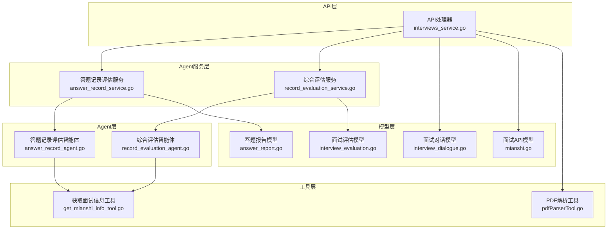
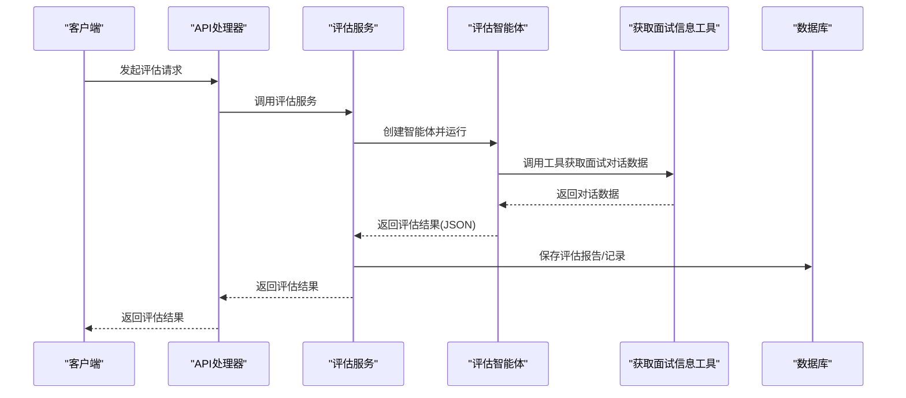
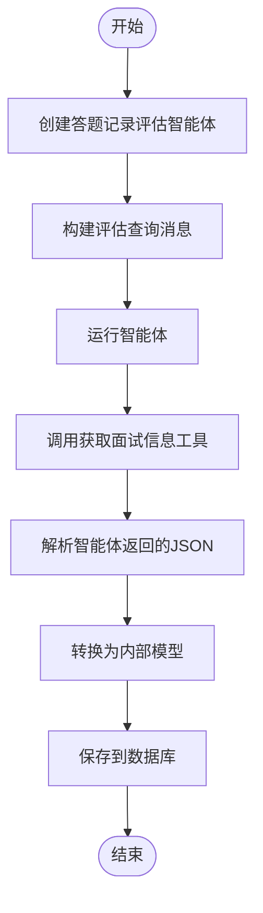
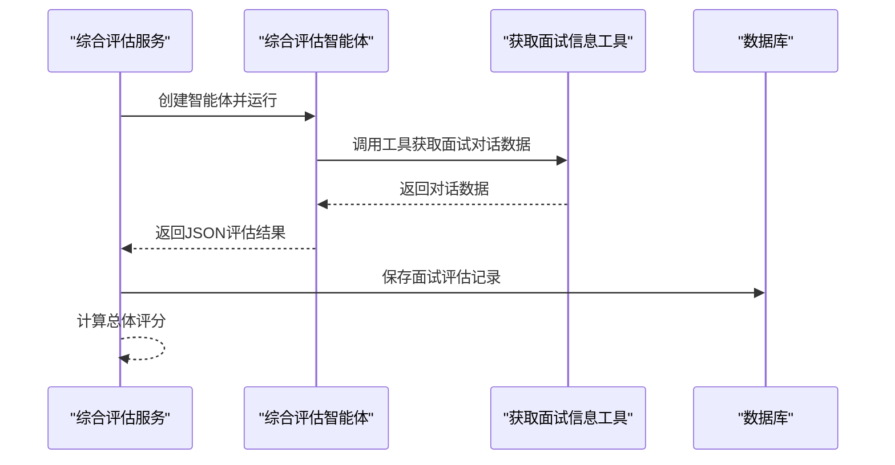
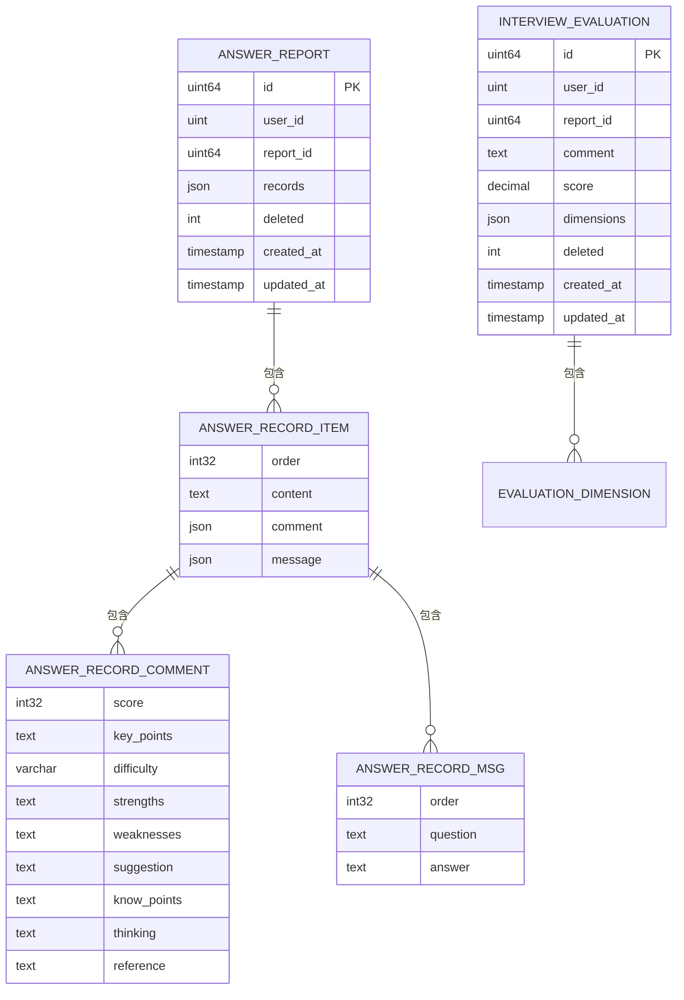
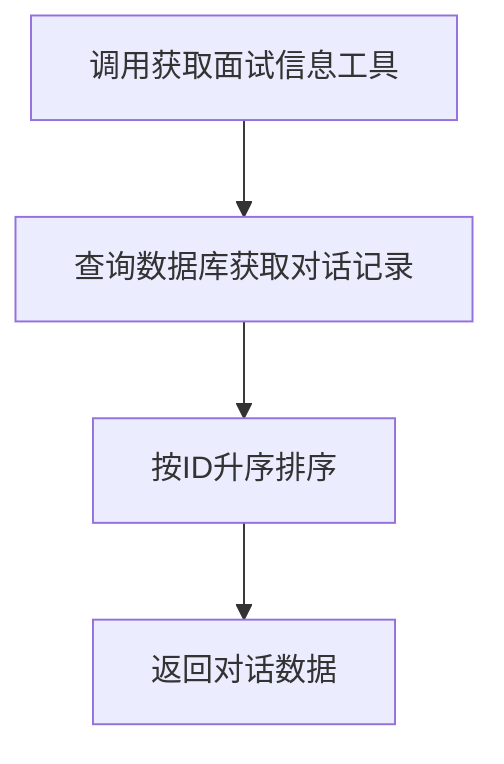
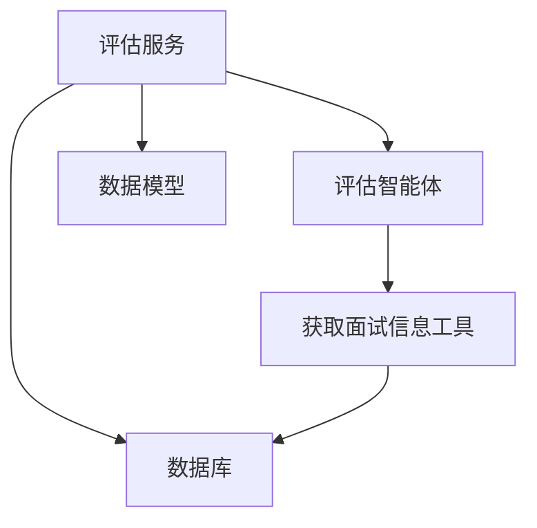

# 面试记录评估智能体

<cite>
**本文档引用的文件**
- [answer_record_agent.go](file://backend/chatApp/agent/record_evaluation/answer_record_agent.go)
- [record_evaluation_agent.go](file://backend/chatApp/agent/record_evaluation/record_evaluation_agent.go)
- [constant.go](file://backend/chatApp/agent/record_evaluation/constant.go)
- [answer_record_service.go](file://backend/chatApp/agent_service/evaluation/answer_record_service.go)
- [record_evaluation_service.go](file://backend/chatApp/agent_service/evaluation/record_evaluation_service.go)
- [answer_report.go](file://backend/internal/model/answer_report.go)
- [interview_evaluation.go](file://backend/internal/model/interview_evaluation.go)
- [get_mianshi_info_tool.go](file://backend/chatApp/tool/get_mianshi_info_tool.go)
- [interview_dialogue.go](file://backend/internal/model/interview_dialogue.go)
- [mianshi.go](file://backend/api/model/mianshi/mianshi.go)
- [interviews_service.go](file://backend/api/handler/interview/interviews_service.go)
- [pdfParserTool.go](file://backend/chatApp/tool/pdfParserTool.go)
</cite>

## 目录
1. [简介](#简介)
2. [项目结构](#项目结构)
3. [核心组件](#核心组件)
4. [架构概览](#架构概览)
5. [详细组件分析](#详细组件分析)
6. [依赖关系分析](#依赖关系分析)
7. [性能考量](#性能考量)
8. [故障排除指南](#故障排除指南)
9. [结论](#结论)
10. [附录](#附录)

## 简介
本项目为“面试记录评估智能体”，旨在通过AI对候选人在面试过程中的回答进行系统化评估，生成结构化的评估报告。系统支持两种评估模式：
- 主题级评估：针对每个问题-回答对进行逐项评估，输出包含评分、关键知识点、优缺点、建议等内容的详细报告。
- 综合评估：对整场面试的总体表现进行维度化评估，生成包含多个评估维度与总体评分的报告。

系统通过统一的工具接口获取面试对话数据，结合智能体指令与运行配置，完成评估流程，并将结果持久化至数据库，支持后续的可视化展示与历史对比分析。

## 项目结构
后端采用分层架构，主要模块如下：
- Agent层：封装智能体创建与运行逻辑，负责与大模型交互并调用工具。
- Agent Service层：封装评估服务，协调智能体运行、消息构建、结果解析与持久化。
- Model层：定义评估结果的数据模型与DAO方法，支撑数据持久化。
- Tool层：提供工具函数，如获取面试对话数据、PDF解析等。
- API层：提供对外接口，处理前端请求并调用服务层。

图表来源
- [answer_record_service.go](file://backend/chatApp/agent_service/evaluation/answer_record_service.go#L16-L100)
- [record_evaluation_service.go](file://backend/chatApp/agent_service/evaluation/record_evaluation_service.go#L17-L108)
- [answer_record_agent.go](file://backend/chatApp/agent/record_evaluation/answer_record_agent.go#L14-L40)
- [record_evaluation_agent.go](file://backend/chatApp/agent/record_evaluation/record_evaluation_agent.go#L14-L38)
- [get_mianshi_info_tool.go](file://backend/chatApp/tool/get_mianshi_info_tool.go#L24-L36)
- [answer_report.go](file://backend/internal/model/answer_report.go#L9-L50)
- [interview_evaluation.go](file://backend/internal/model/interview_evaluation.go#L9-L31)
- [interview_dialogue.go](file://backend/internal/model/interview_dialogue.go#L9-L27)
- [mianshi.go](file://backend/api/model/mianshi/mianshi.go#L423-L480)
- [pdfParserTool.go](file://backend/chatApp/tool/pdfParserTool.go#L39-L124)

章节来源
- [answer_record_service.go](file://backend/chatApp/agent_service/evaluation/answer_record_service.go#L16-L100)
- [record_evaluation_service.go](file://backend/chatApp/agent_service/evaluation/record_evaluation_service.go#L17-L108)

## 核心组件
- 答题记录评估智能体：面向每个问题-回答对进行评估，输出包含评分、关键知识点、优缺点、建议、思考过程与参考答案的详细报告。
- 综合评估智能体：对整场面试进行维度化评估，输出总体评价与多维度评分。
- 工具接口：提供获取面试对话数据的能力，作为智能体评估的数据源。
- 数据模型：定义答题报告与面试评估的结构，支持JSON序列化与数据库持久化。
- 服务层：负责构建消息、运行智能体、解析结果、保存数据。

章节来源
- [answer_record_agent.go](file://backend/chatApp/agent/record_evaluation/answer_record_agent.go#L14-L40)
- [record_evaluation_agent.go](file://backend/chatApp/agent/record_evaluation/record_evaluation_agent.go#L14-L38)
- [constant.go](file://backend/chatApp/agent/record_evaluation/constant.go#L3-L71)
- [constant.go](file://backend/chatApp/agent/record_evaluation/constant.go#L73-L168)
- [get_mianshi_info_tool.go](file://backend/chatApp/tool/get_mianshi_info_tool.go#L24-L36)
- [answer_report.go](file://backend/internal/model/answer_report.go#L9-L50)
- [interview_evaluation.go](file://backend/internal/model/interview_evaluation.go#L9-L31)

## 架构概览
系统采用“API -> 服务 -> 智能体 -> 工具 -> 数据库”的链路，确保评估流程的可扩展与可维护性。

图表来源
- [answer_record_service.go](file://backend/chatApp/agent_service/evaluation/answer_record_service.go#L16-L100)
- [record_evaluation_service.go](file://backend/chatApp/agent_service/evaluation/record_evaluation_service.go#L17-L108)
- [answer_record_agent.go](file://backend/chatApp/agent/record_evaluation/answer_record_agent.go#L14-L40)
- [record_evaluation_agent.go](file://backend/chatApp/agent/record_evaluation/record_evaluation_agent.go#L14-L38)
- [get_mianshi_info_tool.go](file://backend/chatApp/tool/get_mianshi_info_tool.go#L24-L36)

## 详细组件分析

### 答题记录评估智能体
- 职责：对每个问题-回答对进行详细评估，输出包含评分、关键知识点、优缺点、建议、思考过程与参考答案的报告。
- 指令与约束：系统指令明确了工具使用方式、评估流程、评分标准与输出格式，确保结果结构化与一致性。
- 工具集成：通过工具接口获取面试对话数据，保证评估数据的完整性与时序性。
- 结果解析：服务层负责从智能体输出中提取JSON并转换为内部模型，同时具备容错与默认值处理。

图表来源
- [answer_record_agent.go](file://backend/chatApp/agent/record_evaluation/answer_record_agent.go#L14-L40)
- [constant.go](file://backend/chatApp/agent/record_evaluation/constant.go#L73-L168)
- [answer_record_service.go](file://backend/chatApp/agent_service/evaluation/answer_record_service.go#L16-L100)
- [answer_report.go](file://backend/internal/model/answer_report.go#L9-L50)

章节来源
- [answer_record_agent.go](file://backend/chatApp/agent/record_evaluation/answer_record_agent.go#L14-L40)
- [constant.go](file://backend/chatApp/agent/record_evaluation/constant.go#L73-L168)
- [answer_record_service.go](file://backend/chatApp/agent_service/evaluation/answer_record_service.go#L16-L100)
- [answer_report.go](file://backend/internal/model/answer_report.go#L9-L50)

### 综合评估智能体
- 职责：对整场面试进行维度化评估，输出总体评价与多维度评分。
- 指令与约束：系统指令明确了评估维度数量、评分范围与输出格式，确保评估结果的可比性与可解释性。
- 结果处理：服务层负责解析JSON、计算总体评分、保存到数据库，并提供对外API响应结构。

图表来源
- [record_evaluation_agent.go](file://backend/chatApp/agent/record_evaluation/record_evaluation_agent.go#L14-L38)
- [constant.go](file://backend/chatApp/agent/record_evaluation/constant.go#L3-L71)
- [record_evaluation_service.go](file://backend/chatApp/agent_service/evaluation/record_evaluation_service.go#L17-L108)
- [interview_evaluation.go](file://backend/internal/model/interview_evaluation.go#L9-L31)

章节来源
- [record_evaluation_agent.go](file://backend/chatApp/agent/record_evaluation/record_evaluation_agent.go#L14-L38)
- [constant.go](file://backend/chatApp/agent/record_evaluation/constant.go#L3-L71)
- [record_evaluation_service.go](file://backend/chatApp/agent_service/evaluation/record_evaluation_service.go#L17-L108)
- [interview_evaluation.go](file://backend/internal/model/interview_evaluation.go#L9-L31)

### 数据模型与持久化
- 答题报告模型：包含用户ID、报告ID、记录列表、创建时间等字段，支持JSON序列化与数据库存储。
- 面试评估模型：包含用户ID、报告ID、总体评价、总体评分、维度列表等字段，支持JSON序列化与数据库存储。
- DAO方法：提供创建、查询、统计与软删除等操作，确保数据一致性与可维护性。

图表来源
- [answer_report.go](file://backend/internal/model/answer_report.go#L9-L50)
- [interview_evaluation.go](file://backend/internal/model/interview_evaluation.go#L9-L31)

章节来源
- [answer_report.go](file://backend/internal/model/answer_report.go#L9-L50)
- [interview_evaluation.go](file://backend/internal/model/interview_evaluation.go#L9-L31)

### 工具与数据获取
- 获取面试信息工具：根据用户ID与报告ID获取面试对话数据，支持按时间排序，确保评估数据的时序性。
- PDF解析工具：提供将PDF文件转换为纯文本的能力，便于简历解析与内容抽取。

图表来源
- [get_mianshi_info_tool.go](file://backend/chatApp/tool/get_mianshi_info_tool.go#L24-L36)
- [interview_dialogue.go](file://backend/internal/model/interview_dialogue.go#L37-L45)

章节来源
- [get_mianshi_info_tool.go](file://backend/chatApp/tool/get_mianshi_info_tool.go#L24-L36)
- [interview_dialogue.go](file://backend/internal/model/interview_dialogue.go#L37-L45)
- [pdfParserTool.go](file://backend/chatApp/tool/pdfParserTool.go#L39-L124)

### API与对外接口
- API处理器：提供简历上传、获取简历、设置默认简历、获取用户简历列表等接口，支撑面试流程的完整闭环。
- API模型：定义流式事件、问题数据等结构，支持前端实时交互与数据传输。

章节来源
- [interviews_service.go](file://backend/api/handler/interview/interviews_service.go#L26-L391)
- [mianshi.go](file://backend/api/model/mianshi/mianshi.go#L423-L480)

## 依赖关系分析
- 组件耦合：服务层依赖智能体层与工具层；智能体层依赖工具层；服务层与模型层双向依赖，确保数据流转与持久化。
- 外部依赖：依赖大模型推理引擎与工具框架，通过统一接口进行调用与结果解析。
- 潜在风险：工具调用失败或智能体输出格式异常可能导致评估中断，服务层具备超时控制与容错处理。

图表来源
- [answer_record_service.go](file://backend/chatApp/agent_service/evaluation/answer_record_service.go#L16-L100)
- [record_evaluation_service.go](file://backend/chatApp/agent_service/evaluation/record_evaluation_service.go#L17-L108)
- [answer_record_agent.go](file://backend/chatApp/agent/record_evaluation/answer_record_agent.go#L14-L40)
- [record_evaluation_agent.go](file://backend/chatApp/agent/record_evaluation/record_evaluation_agent.go#L14-L38)
- [get_mianshi_info_tool.go](file://backend/chatApp/tool/get_mianshi_info_tool.go#L24-L36)

章节来源
- [answer_record_service.go](file://backend/chatApp/agent_service/evaluation/answer_record_service.go#L16-L100)
- [record_evaluation_service.go](file://backend/chatApp/agent_service/evaluation/record_evaluation_service.go#L17-L108)

## 性能考量
- 超时控制：服务层为不同评估任务设置了合理的超时时间，避免长时间阻塞影响用户体验。
- 结果解析：服务层具备从非结构化文本中提取JSON的能力，提升鲁棒性。
- 数据库操作：DAO方法提供批量查询与统计能力，减少重复查询与网络开销。
- 工具调用：工具层对外部命令进行超时与错误处理，避免资源泄露。

## 故障排除指南
- 智能体运行超时：检查超时配置与网络状况，必要时增加超时时间或优化工具调用。
- 工具调用失败：确认工具参数与环境依赖（如外部命令）是否正确配置。
- JSON解析失败：检查智能体输出格式是否符合预期，必要时启用容错解析逻辑。
- 数据持久化失败：检查数据库连接与事务状态，确保DAO方法正常执行。

章节来源
- [answer_record_service.go](file://backend/chatApp/agent_service/evaluation/answer_record_service.go#L16-L100)
- [record_evaluation_service.go](file://backend/chatApp/agent_service/evaluation/record_evaluation_service.go#L17-L108)
- [get_mianshi_info_tool.go](file://backend/chatApp/tool/get_mianshi_info_tool.go#L24-L36)

## 结论
面试记录评估智能体通过标准化的智能体指令、工具接口与数据模型，实现了对候选人回答的质量评估与综合分析。系统具备良好的扩展性与稳定性，能够满足不同面试场景的需求，并为后续的可视化展示与持续优化奠定基础。

## 附录
- 评估算法核心逻辑
  - 答题记录评估：基于每个问题-回答对，结合工具返回的对话数据，进行评分与评语生成，输出包含评分、关键知识点、优缺点、建议、思考过程与参考答案的报告。
  - 综合评估：对整场面试进行维度化评估，输出总体评价与多维度评分，支持总体评分计算与维度权重管理。
- 面试类型适配
  - 综合面试：侧重能力与潜力的整体评估，维度数量与权重可根据岗位特性调整。
  - 专项面试：侧重技术深度与专业能力，维度更聚焦于技术栈与实战经验。
- 可视化与历史对比
  - 建议在前端展示维度评分趋势、关键知识点掌握情况与改进建议，支持历史记录对比分析。
- 准确性验证与持续优化
  - 建立人工复核机制与A/B测试，定期评估智能体输出质量，迭代优化指令与工具调用策略。