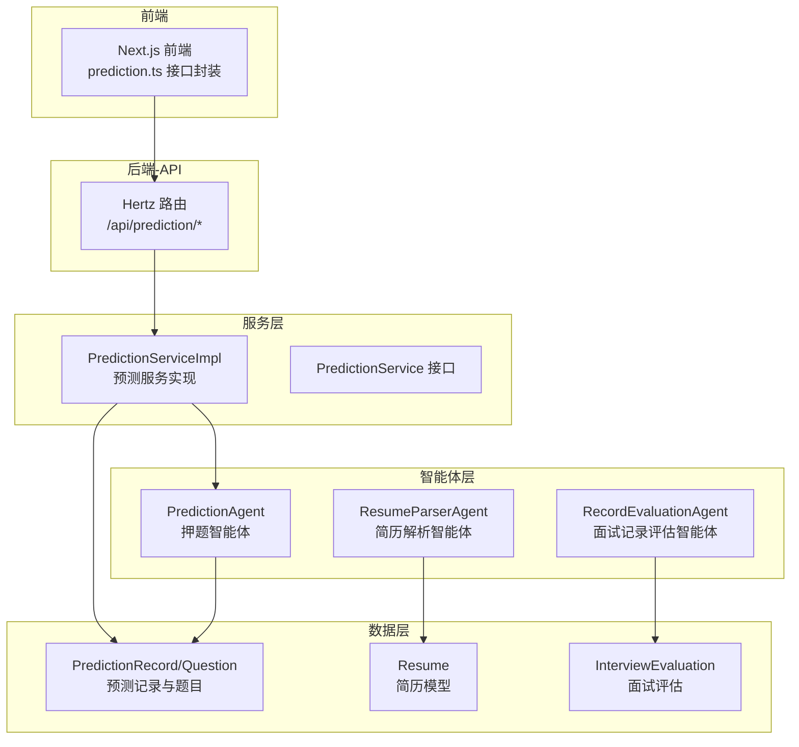
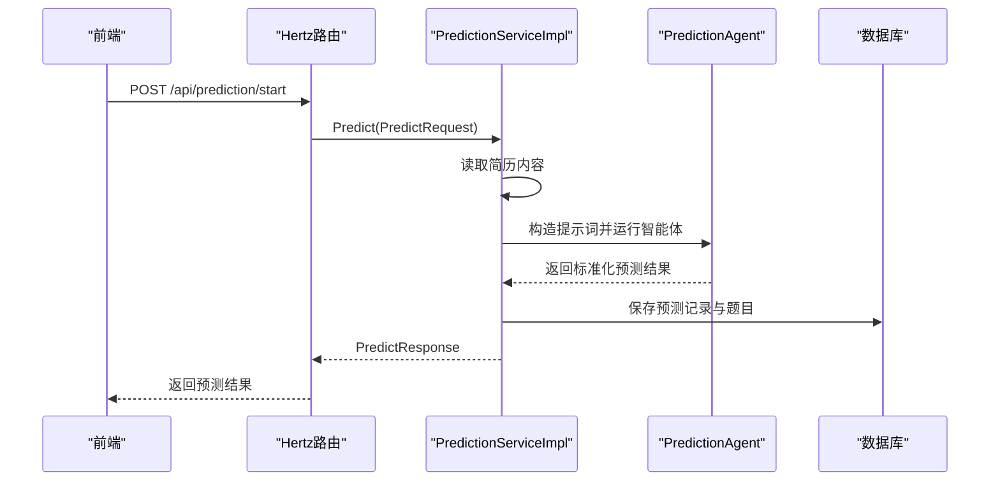
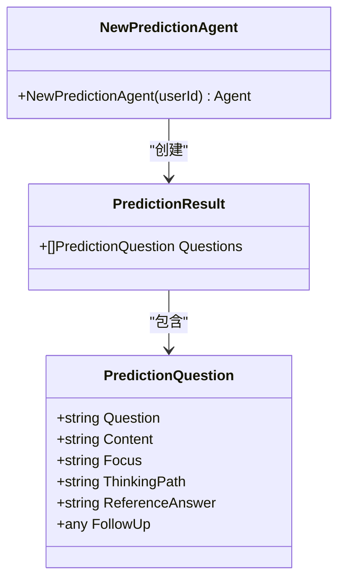
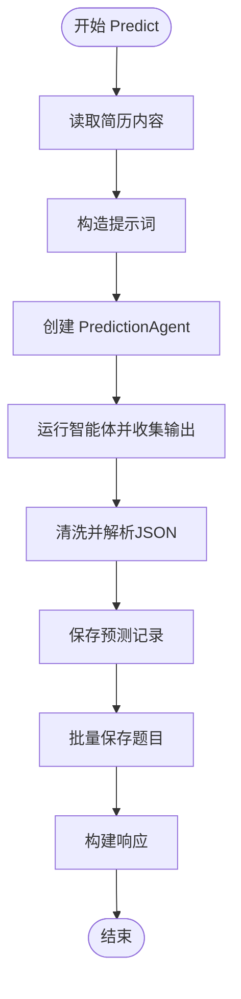
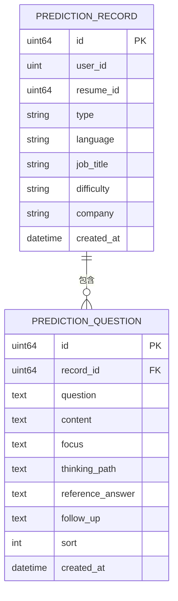
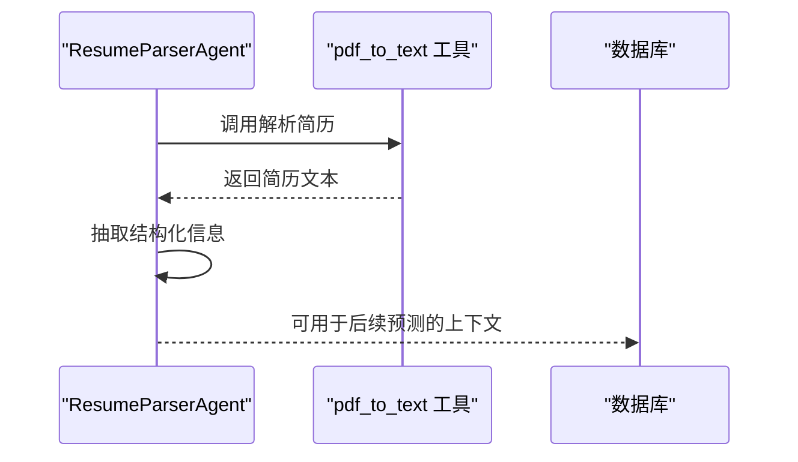
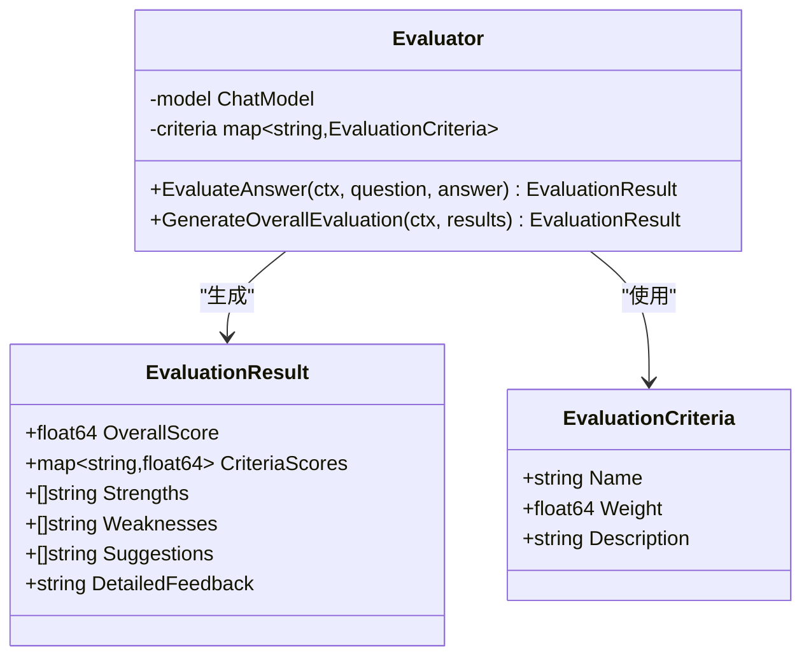
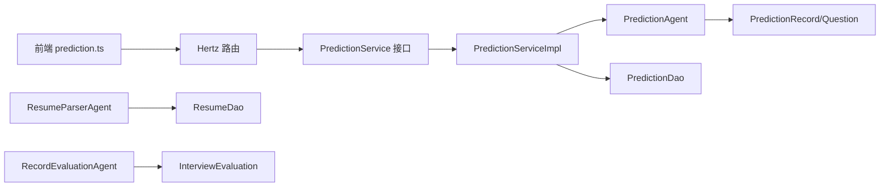

# 预测推荐智能体

<cite>
**本文引用的文件**
- [backend/chatApp/agent/prediction/prediction_agent.go](file://backend/chatApp/agent/prediction/prediction_agent.go)
- [backend/internal/service/prediction/impl/prediction_impl.go](file://backend/internal/service/prediction/impl/prediction_impl.go)
- [backend/internal/service/prediction/interface.go](file://backend/internal/service/prediction/interface.go)
- [backend/api/handler/interview/prediction_service.go](file://backend/api/handler/interview/prediction_service.go)
- [backend/internal/model/prediction.go](file://backend/internal/model/prediction.go)
- [backend/api/model/prediction/prediction.go](file://backend/api/model/prediction/prediction.go)
- [backend/chatApp/tool/get_resume_info_tool.go](file://backend/chatApp/tool/get_resume_info_tool.go)
- [backend/internal/model/resume.go](file://backend/internal/model/resume.go)
- [backend/chatApp/agent/resume/resume.go](file://backend/chatApp/agent/resume/resume.go)
- [backend/internal/model/interview_evaluation.go](file://backend/internal/model/interview_evaluation.go)
- [backend/chatApp/agent/record_evaluation/record_evaluation_agent.go](file://backend/chatApp/agent/record_evaluation/record_evaluation_agent.go)
- [backend/chatApp/agent/record_evaluation/constant.go](file://backend/chatApp/agent/record_evaluation/constant.go)
- [backend/chatApp/config/config.go](file://backend/chatApp/config/config.go)
- [frontend/src/services/api/prediction.ts](file://frontend/src/services/api/prediction.ts)
</cite>

## 目录
1. [简介](#简介)
2. [项目结构](#项目结构)
3. [核心组件](#核心组件)
4. [架构总览](#架构总览)
5. [详细组件分析](#详细组件分析)
6. [依赖关系分析](#依赖关系分析)
7. [性能考量](#性能考量)
8. [故障排查指南](#故障排查指南)
9. [结论](#结论)
10. [附录](#附录)

## 简介
本文件面向“预测推荐智能体”的技术文档，聚焦于基于候选人面试表现与简历信息的智能预测与推荐能力。系统通过“押题智能体”生成个性化面试题目，结合“简历解析智能体”抽取关键信息，再以“面试记录评估智能体”对面试过程进行多维评估，形成闭环的动态建议体系。文档涵盖：
- 预测模型的输入（简历与面试要求）、处理流程与输出结构
- 推荐系统的评分机制、多样性控制与实时更新策略
- 历史数据与当前表现的融合方式
- 模型性能评估指标与推荐效果优化方案

## 项目结构
预测推荐智能体位于后端 chatApp 的 agent 子模块，服务层与数据层分别位于 internal/service 与 internal/model，API 层通过 Hertz 路由暴露接口。

图表来源
- [backend/api/handler/interview/prediction_service.go](file://backend/api/handler/interview/prediction_service.go#L17-L95)
- [backend/internal/service/prediction/impl/prediction_impl.go](file://backend/internal/service/prediction/impl/prediction_impl.go#L25-L211)
- [backend/chatApp/agent/prediction/prediction_agent.go](file://backend/chatApp/agent/prediction/prediction_agent.go#L25-L65)
- [backend/internal/model/prediction.go](file://backend/internal/model/prediction.go#L11-L47)
- [backend/internal/model/resume.go](file://backend/internal/model/resume.go#L9-L25)
- [backend/internal/model/interview_evaluation.go](file://backend/internal/model/interview_evaluation.go#L9-L35)

章节来源
- [backend/api/handler/interview/prediction_service.go](file://backend/api/handler/interview/prediction_service.go#L17-L95)
- [backend/internal/service/prediction/impl/prediction_impl.go](file://backend/internal/service/prediction/impl/prediction_impl.go#L25-L211)
- [backend/chatApp/agent/prediction/prediction_agent.go](file://backend/chatApp/agent/prediction/prediction_agent.go#L25-L65)
- [backend/internal/model/prediction.go](file://backend/internal/model/prediction.go#L11-L47)
- [backend/internal/model/resume.go](file://backend/internal/model/resume.go#L9-L25)
- [backend/internal/model/interview_evaluation.go](file://backend/internal/model/interview_evaluation.go#L9-L35)

## 核心组件
- 押题智能体（PredictionAgent）：根据简历与面试要求生成标准化的5道预测题目，包含重点考察、回答思路、参考答案与可能追问。
- 预测服务（PredictionServiceImpl）：组装提示词、调用智能体、解析并持久化预测结果，支持列表与详情查询。
- 数据模型（PredictionRecord/Question）：记录预测任务与题目明细，支持排序与预加载。
- 简历解析智能体（ResumeParserAgent）：解析简历文本，抽取基本信息、教育背景、工作经历、技术栈、项目经验、技能特长、证书资格等，辅助生成更贴合背景的预测题目。
- 面试记录评估智能体（RecordEvaluationAgent）：基于面试对话记录，按多维评估标准生成整体评分与反馈，为后续推荐提供动态依据。

章节来源
- [backend/chatApp/agent/prediction/prediction_agent.go](file://backend/chatApp/agent/prediction/prediction_agent.go#L11-L65)
- [backend/internal/service/prediction/impl/prediction_impl.go](file://backend/internal/service/prediction/impl/prediction_impl.go#L25-L211)
- [backend/internal/model/prediction.go](file://backend/internal/model/prediction.go#L11-L47)
- [backend/chatApp/agent/resume/resume.go](file://backend/chatApp/agent/resume/resume.go#L14-L109)
- [backend/chatApp/agent/record_evaluation/record_evaluation_agent.go](file://backend/chatApp/agent/record_evaluation/record_evaluation_agent.go#L14-L38)

## 架构总览
预测推荐智能体采用“API -> 服务 -> 智能体 -> 数据库”的分层架构，结合工具链（如简历解析工具）与评估智能体，形成从“输入简历与要求”到“输出预测题目与评估反馈”的闭环。

图表来源
- [backend/api/handler/interview/prediction_service.go](file://backend/api/handler/interview/prediction_service.go#L17-L42)
- [backend/internal/service/prediction/impl/prediction_impl.go](file://backend/internal/service/prediction/impl/prediction_impl.go#L25-L211)
- [backend/chatApp/agent/prediction/prediction_agent.go](file://backend/chatApp/agent/prediction/prediction_agent.go#L25-L65)
- [backend/internal/model/prediction.go](file://backend/internal/model/prediction.go#L51-L68)

## 详细组件分析

### 押题智能体（PredictionAgent）
- 角色与职责：根据简历与面试要求生成5道标准化预测题目，包含重点考察、回答思路、参考答案与可能追问。
- 提示词设计：强调严格生成5道题目、返回标准JSON、结合简历中的项目经历与技能点。
- 输出结构：PredictionQuestion/PredictionResult，包含题目、内容、重点考察、思考路径、参考答案与追问。

图表来源
- [backend/chatApp/agent/prediction/prediction_agent.go](file://backend/chatApp/agent/prediction/prediction_agent.go#L11-L23)
- [backend/chatApp/agent/prediction/prediction_agent.go](file://backend/chatApp/agent/prediction/prediction_agent.go#L25-L65)

章节来源
- [backend/chatApp/agent/prediction/prediction_agent.go](file://backend/chatApp/agent/prediction/prediction_agent.go#L11-L65)

### 预测服务（PredictionServiceImpl）
- 输入：PredictRequest（简历ID、类型、语言、岗位、难度、目标公司等）
- 流程：
  1) 读取简历内容
  2) 构造提示词（含简历与要求）
  3) 创建并运行 PredictionAgent
  4) 清洗并解析JSON，保存预测记录与题目
  5) 返回 PredictResponse
- 列表与详情：支持分页列出预测记录，按ID获取详情并鉴权

图表来源
- [backend/internal/service/prediction/impl/prediction_impl.go](file://backend/internal/service/prediction/impl/prediction_impl.go#L25-L211)

章节来源
- [backend/internal/service/prediction/impl/prediction_impl.go](file://backend/internal/service/prediction/impl/prediction_impl.go#L25-L211)
- [backend/internal/service/prediction/interface.go](file://backend/internal/service/prediction/interface.go#L8-L12)
- [backend/api/handler/interview/prediction_service.go](file://backend/api/handler/interview/prediction_service.go#L17-L42)

### 数据模型（PredictionRecord/Question）
- 预测记录：包含用户ID、简历ID、类型、语言、岗位、难度、公司等元信息
- 预测题目：包含问题、内容、重点考察、思考路径、参考答案、追问与排序
- DAO：提供创建、查询、分页与预加载

图表来源
- [backend/internal/model/prediction.go](file://backend/internal/model/prediction.go#L11-L47)

章节来源
- [backend/internal/model/prediction.go](file://backend/internal/model/prediction.go#L11-L47)

### 简历解析与工具链
- 简历解析智能体：使用 pdf_to_text 工具解析简历，抽取基本信息、教育背景、工作经历、技术栈、项目经验、技能特长、证书资格等，输出结构化JSON
- 工具：GetResumeInfoTool 用于按简历ID查询解析后的简历内容

图表来源
- [backend/chatApp/agent/resume/resume.go](file://backend/chatApp/agent/resume/resume.go#L14-L109)
- [backend/chatApp/tool/get_resume_info_tool.go](file://backend/chatApp/tool/get_resume_info_tool.go#L21-L34)
- [backend/internal/model/resume.go](file://backend/internal/model/resume.go#L43-L54)

章节来源
- [backend/chatApp/agent/resume/resume.go](file://backend/chatApp/agent/resume/resume.go#L14-L109)
- [backend/chatApp/tool/get_resume_info_tool.go](file://backend/chatApp/tool/get_resume_info_tool.go#L21-L34)
- [backend/internal/model/resume.go](file://backend/internal/model/resume.go#L43-L54)

### 面试记录评估与动态建议
- 面试记录评估智能体：基于面试对话记录，按多维评估标准生成整体评分与反馈
- 评估维度：准确性、深度、清晰度、完整性、实用性、沟通能力
- 评估结果：包含总体评分、各维度评分、优点、不足、改进建议与详细反馈

图表来源
- [backend/internal/model/interview_evaluation.go](file://backend/internal/model/interview_evaluation.go#L9-L35)
- [backend/chatApp/agent/record_evaluation/record_evaluation_agent.go](file://backend/chatApp/agent/record_evaluation/record_evaluation_agent.go#L14-L38)
- [backend/chatApp/agent/record_evaluation/constant.go](file://backend/chatApp/agent/record_evaluation/constant.go#L74-L98)

章节来源
- [backend/internal/model/interview_evaluation.go](file://backend/internal/model/interview_evaluation.go#L9-L35)
- [backend/chatApp/agent/record_evaluation/record_evaluation_agent.go](file://backend/chatApp/agent/record_evaluation/record_evaluation_agent.go#L14-L38)
- [backend/chatApp/agent/record_evaluation/constant.go](file://backend/chatApp/agent/record_evaluation/constant.go#L74-L98)

## 依赖关系分析
- API 层依赖服务层接口与实现，服务层依赖智能体与数据模型
- 智能体依赖聊天模型与工具链（如 pdf_to_text）
- 数据模型通过 DAO 提供 CRUD 与预加载能力
- 前端通过 prediction.ts 调用后端接口

图表来源
- [backend/api/handler/interview/prediction_service.go](file://backend/api/handler/interview/prediction_service.go#L17-L95)
- [backend/internal/service/prediction/interface.go](file://backend/internal/service/prediction/interface.go#L8-L12)
- [backend/internal/service/prediction/impl/prediction_impl.go](file://backend/internal/service/prediction/impl/prediction_impl.go#L25-L211)
- [backend/chatApp/agent/prediction/prediction_agent.go](file://backend/chatApp/agent/prediction/prediction_agent.go#L25-L65)
- [backend/internal/model/prediction.go](file://backend/internal/model/prediction.go#L51-L68)
- [backend/chatApp/agent/resume/resume.go](file://backend/chatApp/agent/resume/resume.go#L14-L109)
- [backend/internal/model/resume.go](file://backend/internal/model/resume.go#L43-L54)
- [backend/chatApp/agent/record_evaluation/record_evaluation_agent.go](file://backend/chatApp/agent/record_evaluation/record_evaluation_agent.go#L14-L38)
- [backend/internal/model/interview_evaluation.go](file://backend/internal/model/interview_evaluation.go#L37-L43)
- [frontend/src/services/api/prediction.ts](file://frontend/src/services/api/prediction.ts#L4-L14)

章节来源
- [backend/api/handler/interview/prediction_service.go](file://backend/api/handler/interview/prediction_service.go#L17-L95)
- [backend/internal/service/prediction/interface.go](file://backend/internal/service/prediction/interface.go#L8-L12)
- [backend/internal/service/prediction/impl/prediction_impl.go](file://backend/internal/service/prediction/impl/prediction_impl.go#L25-L211)
- [backend/chatApp/agent/prediction/prediction_agent.go](file://backend/chatApp/agent/prediction/prediction_agent.go#L25-L65)
- [backend/internal/model/prediction.go](file://backend/internal/model/prediction.go#L51-L68)
- [backend/chatApp/agent/resume/resume.go](file://backend/chatApp/agent/resume/resume.go#L14-L109)
- [backend/internal/model/resume.go](file://backend/internal/model/resume.go#L43-L54)
- [backend/chatApp/agent/record_evaluation/record_evaluation_agent.go](file://backend/chatApp/agent/record_evaluation/record_evaluation_agent.go#L14-L38)
- [backend/internal/model/interview_evaluation.go](file://backend/internal/model/interview_evaluation.go#L37-L43)
- [frontend/src/services/api/prediction.ts](file://frontend/src/services/api/prediction.ts#L4-L14)

## 性能考量
- 智能体运行与JSON解析：注意对大段输出的清洗与解析开销，建议在服务层增加超时与重试策略
- 数据库写入：先保存主记录再批量保存题目，避免事务长时间占用
- 分页查询：列表接口支持分页与预加载，减少一次性加载大量数据
- 缓存与并发：可考虑对热门简历与常用提示词进行缓存，提升响应速度
- 日志与监控：在关键节点增加日志与指标埋点，便于定位性能瓶颈

## 故障排查指南
- 智能体返回空内容或解析失败：检查提示词构造、智能体输出格式与JSON清洗逻辑
- 数据库异常：确认 getDB 初始化、事务提交与错误包装
- 未授权访问：鉴权中间件返回 401，需检查 Token 有效性
- 前端接口调用失败：确认路由路径与参数传递

章节来源
- [backend/internal/service/prediction/impl/prediction_impl.go](file://backend/internal/service/prediction/impl/prediction_impl.go#L25-L122)
- [backend/api/handler/interview/prediction_service.go](file://backend/api/handler/interview/prediction_service.go#L28-L32)
- [backend/internal/model/prediction.go](file://backend/internal/model/prediction.go#L51-L68)

## 结论
预测推荐智能体通过“押题智能体 + 简历解析 + 面试评估”的组合，实现了从简历与面试要求出发，到个性化题目生成与动态评估反馈的闭环。建议在以下方面持续优化：
- 特征工程：将简历解析出的结构化信息作为预测特征，增强题目与候选人的匹配度
- 推荐评分：引入基于历史与当前表现的加权评分，结合多样性控制（如不同维度/难度分布）
- 实时更新：将面试评估结果反哺预测模型，形成“预测-面试-评估-再预测”的迭代优化
- 模型评估：建立离线评估指标（如召回率、覆盖率、多样性、用户满意度）与在线 A/B 实验体系

## 附录
- 配置加载：OpenAI/谷歌等外部服务配置通过 config.yaml 加载，确保 API Key 与基础 URL 正确
- 前端接口：前端通过 prediction.ts 调用后端预测列表与详情接口

章节来源
- [backend/chatApp/config/config.go](file://backend/chatApp/config/config.go#L34-L73)
- [frontend/src/services/api/prediction.ts](file://frontend/src/services/api/prediction.ts#L4-L14)