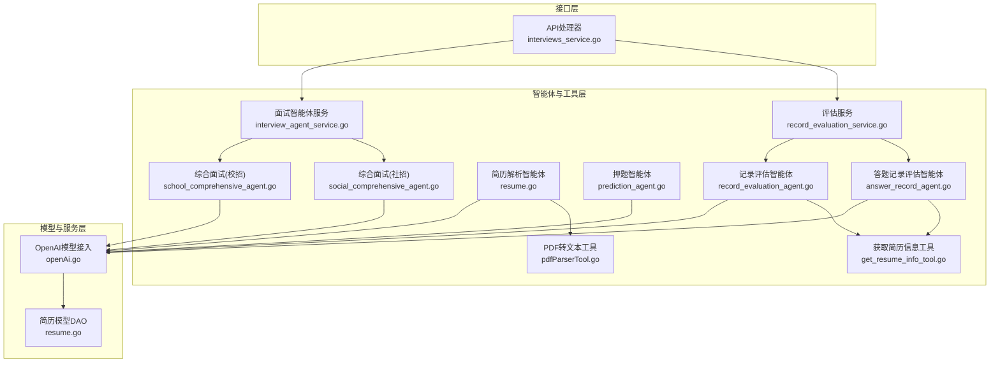
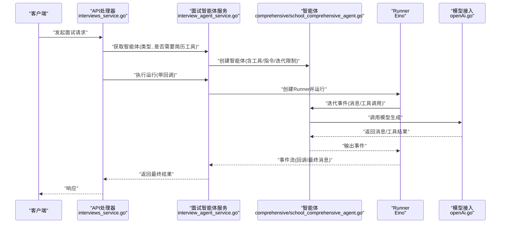
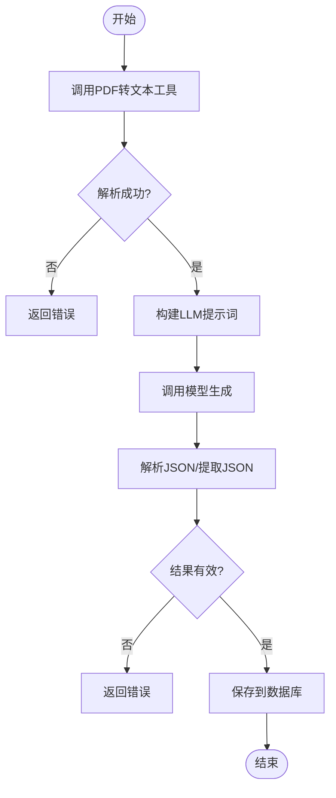
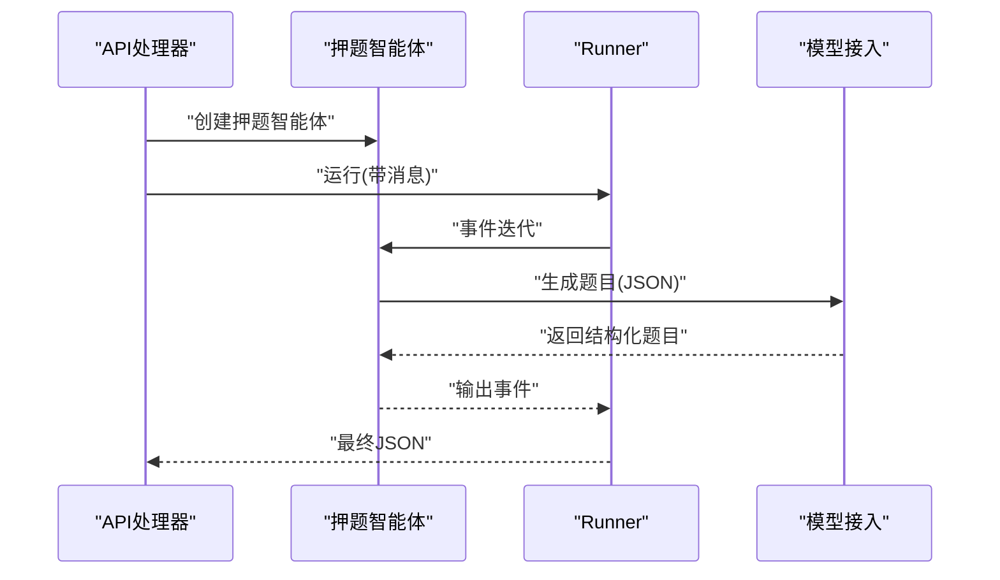
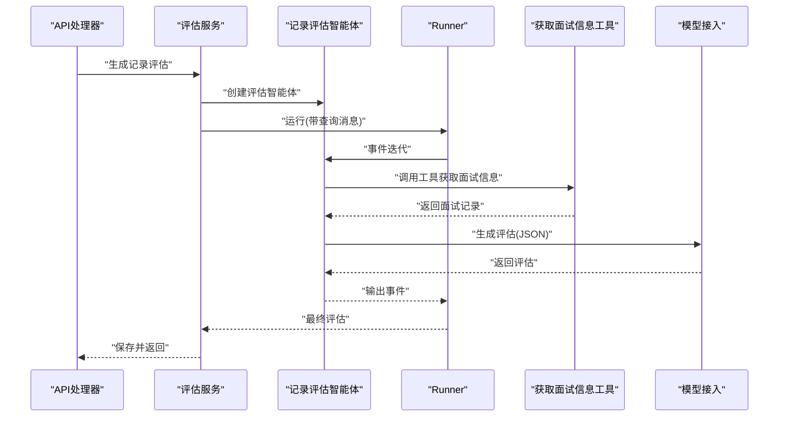
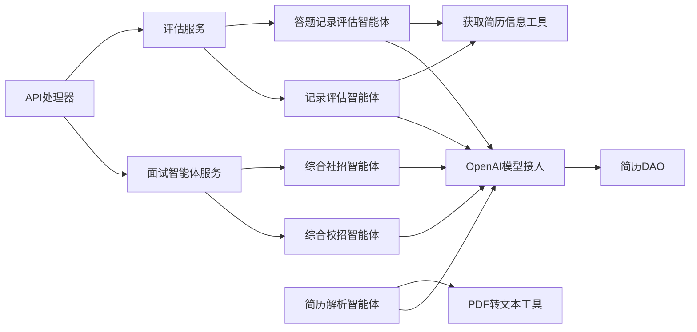

# AI框架架构设计

<cite>
**本文引用的文件**
- [backend/chatApp/main.go](file://backend/chatApp/main.go)
- [backend/chatApp/chat/openAi.go](file://backend/chatApp/chat/openAi.go)
- [backend/chatApp/agent/interview/comprehensive/school_comprehensive_agent.go](file://backend/chatApp/agent/interview/comprehensive/school_comprehensive_agent.go)
- [backend/chatApp/agent/interview/comprehensive/social_comprehensive_agent.go](file://backend/chatApp/agent/interview/comprehensive/social_comprehensive_agent.go)
- [backend/chatApp/agent/resume/resume.go](file://backend/chatApp/agent/resume/resume.go)
- [backend/chatApp/agent/service/resume_service.go](file://backend/chatApp/agent/service/resume_service.go)
- [backend/chatApp/agent/prediction/prediction_agent.go](file://backend/chatApp/agent/prediction/prediction_agent.go)
- [backend/chatApp/agent/record_evaluation/answer_record_agent.go](file://backend/chatApp/agent/record_evaluation/answer_record_agent.go)
- [backend/chatApp/agent/record_evaluation/record_evaluation_agent.go](file://backend/chatApp/agent/record_evaluation/record_evaluation_agent.go)
- [backend/chatApp/tool/pdfParserTool.go](file://backend/chatApp/tool/pdfParserTool.go)
- [backend/chatApp/tool/get_resume_info_tool.go](file://backend/chatApp/tool/get_resume_info_tool.go)
- [backend/chatApp/agent_service/interview/interview_agent_service.go](file://backend/chatApp/agent_service/interview/interview_agent_service.go)
- [backend/chatApp/agent_service/evaluation/record_evaluation_service.go](file://backend/chatApp/agent_service/evaluation/record_evaluation_service.go)
- [backend/internal/model/resume.go](file://backend/internal/model/resume.go)
- [backend/api/handler/interview/interviews_service.go](file://backend/api/handler/interview/interviews_service.go)
</cite>

## 目录
1. [简介](#简介)
2. [项目结构](#项目结构)
3. [核心组件](#核心组件)
4. [架构总览](#架构总览)
5. [详细组件分析](#详细组件分析)
6. [依赖关系分析](#依赖关系分析)
7. [性能考量](#性能考量)
8. [故障排查指南](#故障排查指南)
9. [结论](#结论)
10. [附录](#附录)

## 简介
本设计文档面向“面试吧AI智能面试平台”，系统性阐述基于 Eino 框架的应用架构，覆盖智能体组件设计、工作流编排与 AI 服务集成。重点解析简历分析、问题生成、回答评估与报告生成四大核心流程，阐明智能体协作机制、状态管理与生命周期控制，并给出模型选择策略、推理优化与性能调优方案，以及可扩展性、多模态与实时交互支持、监控与故障处理机制。

## 项目结构
后端采用模块化分层组织：
- chatApp：AI 智能体与工具层，封装 Eino 框架与模型接入
- api/handler：HTTP 接口层，对接前端与业务服务
- internal：内部服务与数据模型层
- mcp-moduel 与 mcpserver：可插拔工具与 MCP 服务（扩展能力）

图表来源
- [backend/api/handler/interview/interviews_service.go](file://backend/api/handler/interview/interviews_service.go#L55-L92)
- [backend/chatApp/agent_service/interview/interview_agent_service.go](file://backend/chatApp/agent_service/interview/interview_agent_service.go#L42-L73)
- [backend/chatApp/agent_service/evaluation/record_evaluation_service.go](file://backend/chatApp/agent_service/evaluation/record_evaluation_service.go#L17-L108)
- [backend/chatApp/agent/interview/comprehensive/school_comprehensive_agent.go](file://backend/chatApp/agent/interview/comprehensive/school_comprehensive_agent.go#L14-L47)
- [backend/chatApp/agent/interview/comprehensive/social_comprehensive_agent.go](file://backend/chatApp/agent/interview/comprehensive/social_comprehensive_agent.go#L14-L47)
- [backend/chatApp/agent/resume/resume.go](file://backend/chatApp/agent/resume/resume.go#L14-L108)
- [backend/chatApp/agent/prediction/prediction_agent.go](file://backend/chatApp/agent/prediction/prediction_agent.go#L25-L65)
- [backend/chatApp/agent/record_evaluation/record_evaluation_agent.go](file://backend/chatApp/agent/record_evaluation/record_evaluation_agent.go#L14-L38)
- [backend/chatApp/agent/record_evaluation/answer_record_agent.go](file://backend/chatApp/agent/record_evaluation/answer_record_agent.go#L14-L40)
- [backend/chatApp/tool/pdfParserTool.go](file://backend/chatApp/tool/pdfParserTool.go#L39-L124)
- [backend/chatApp/tool/get_resume_info_tool.go](file://backend/chatApp/tool/get_resume_info_tool.go#L21-L47)
- [backend/chatApp/chat/openAi.go](file://backend/chatApp/chat/openAi.go#L19-L109)
- [backend/internal/model/resume.go](file://backend/internal/model/resume.go#L32-L41)

章节来源
- [backend/chatApp/main.go](file://backend/chatApp/main.go#L25-L123)
- [backend/chatApp/chat/openAi.go](file://backend/chatApp/chat/openAi.go#L19-L109)
- [backend/chatApp/agent_service/interview/interview_agent_service.go](file://backend/chatApp/agent_service/interview/interview_agent_service.go#L30-L73)
- [backend/chatApp/agent_service/evaluation/record_evaluation_service.go](file://backend/chatApp/agent_service/evaluation/record_evaluation_service.go#L17-L108)
- [backend/chatApp/agent/resume/resume.go](file://backend/chatApp/agent/resume/resume.go#L14-L108)
- [backend/chatApp/agent/prediction/prediction_agent.go](file://backend/chatApp/agent/prediction/prediction_agent.go#L25-L65)
- [backend/chatApp/agent/record_evaluation/record_evaluation_agent.go](file://backend/chatApp/agent/record_evaluation/record_evaluation_agent.go#L14-L38)
- [backend/chatApp/agent/record_evaluation/answer_record_agent.go](file://backend/chatApp/agent/record_evaluation/answer_record_agent.go#L14-L40)
- [backend/chatApp/tool/pdfParserTool.go](file://backend/chatApp/tool/pdfParserTool.go#L39-L124)
- [backend/chatApp/tool/get_resume_info_tool.go](file://backend/chatApp/tool/get_resume_info_tool.go#L21-L47)
- [backend/internal/model/resume.go](file://backend/internal/model/resume.go#L32-L41)
- [backend/api/handler/interview/interviews_service.go](file://backend/api/handler/interview/interviews_service.go#L55-L92)

## 核心组件
- 智能体工厂与编排
  - 面试智能体服务：统一创建与运行不同类型的面试智能体（综合/专项），支持工具注入与迭代限制
  - 评估服务：封装答题记录与面试记录的评估流程，统一超时与结果解析
- 模型接入层
  - OpenAI 模型接入：动态加载用户模型配置，支持多种厂商与 Endpoint，内置错误分类与重试策略
- 工具与数据访问
  - PDF 文本解析工具：CLI 调用 pdftotext，支持超时与错误处理
  - 简历信息工具：从数据库查询解析后的简历内容
  - 简历模型 DAO：简历持久化与查询

章节来源
- [backend/chatApp/agent_service/interview/interview_agent_service.go](file://backend/chatApp/agent_service/interview/interview_agent_service.go#L30-L155)
- [backend/chatApp/agent_service/evaluation/record_evaluation_service.go](file://backend/chatApp/agent_service/evaluation/record_evaluation_service.go#L17-L183)
- [backend/chatApp/chat/openAi.go](file://backend/chatApp/chat/openAi.go#L19-L109)
- [backend/chatApp/tool/pdfParserTool.go](file://backend/chatApp/tool/pdfParserTool.go#L39-L124)
- [backend/chatApp/tool/get_resume_info_tool.go](file://backend/chatApp/tool/get_resume_info_tool.go#L21-L47)
- [backend/internal/model/resume.go](file://backend/internal/model/resume.go#L32-L41)

## 架构总览
Eino 框架作为统一智能体运行时，负责：
- 智能体生命周期管理（创建、运行、事件迭代）
- 工具节点编排（工具注册、调用、参数校验）
- 与外部模型服务（OpenAI 兼容）交互
- 事件流输出与回调处理

图表来源
- [backend/api/handler/interview/interviews_service.go](file://backend/api/handler/interview/interviews_service.go#L55-L92)
- [backend/chatApp/agent_service/interview/interview_agent_service.go](file://backend/chatApp/agent_service/interview/interview_agent_service.go#L75-L155)
- [backend/chatApp/agent/interview/comprehensive/school_comprehensive_agent.go](file://backend/chatApp/agent/interview/comprehensive/school_comprehensive_agent.go#L14-L47)
- [backend/chatApp/chat/openAi.go](file://backend/chatApp/chat/openAi.go#L19-L109)

## 详细组件分析

### 简历分析组件
职责与流程
- 通过 PDF 文本解析工具提取简历纯文本
- 使用 LLM 对文本进行结构化解析，产出标准化 JSON（基本信息、教育背景、工作经历、技术栈、项目经验、技能、证书、优势与弱项等）
- 校验解析结果有效性，保存至数据库

图表来源
- [backend/chatApp/agent/resume/resume.go](file://backend/chatApp/agent/resume/resume.go#L14-L108)
- [backend/chatApp/agent/service/resume_service.go](file://backend/chatApp/agent/service/resume_service.go#L47-L214)
- [backend/chatApp/tool/pdfParserTool.go](file://backend/chatApp/tool/pdfParserTool.go#L39-L124)
- [backend/internal/model/resume.go](file://backend/internal/model/resume.go#L32-L41)

章节来源
- [backend/chatApp/agent/resume/resume.go](file://backend/chatApp/agent/resume/resume.go#L14-L108)
- [backend/chatApp/agent/service/resume_service.go](file://backend/chatApp/agent/service/resume_service.go#L47-L214)
- [backend/chatApp/tool/pdfParserTool.go](file://backend/chatApp/tool/pdfParserTool.go#L39-L124)
- [backend/internal/model/resume.go](file://backend/internal/model/resume.go#L32-L41)

### 问题生成组件
职责与流程
- 基于简历内容与岗位要求，生成预测面试题（固定数量与 JSON 结构）
- 通过智能体指令约束输出格式与内容质量

图表来源
- [backend/chatApp/agent/prediction/prediction_agent.go](file://backend/chatApp/agent/prediction/prediction_agent.go#L25-L65)
- [backend/chatApp/chat/openAi.go](file://backend/chatApp/chat/openAi.go#L19-L109)

章节来源
- [backend/chatApp/agent/prediction/prediction_agent.go](file://backend/chatApp/agent/prediction/prediction_agent.go#L25-L65)
- [backend/chatApp/chat/openAi.go](file://backend/chatApp/chat/openAi.go#L19-L109)

### 回答评估组件
职责与流程
- 评估答题记录与面试记录，生成维度评分、评语与改进建议
- 通过工具获取面试问题与对话记录，再由 LLM 生成结构化评估

图表来源
- [backend/chatApp/agent_service/evaluation/record_evaluation_service.go](file://backend/chatApp/agent_service/evaluation/record_evaluation_service.go#L17-L108)
- [backend/chatApp/agent/record_evaluation/record_evaluation_agent.go](file://backend/chatApp/agent/record_evaluation/record_evaluation_agent.go#L14-L38)
- [backend/chatApp/tool/get_resume_info_tool.go](file://backend/chatApp/tool/get_resume_info_tool.go#L21-L47)
- [backend/chatApp/chat/openAi.go](file://backend/chatApp/chat/openAi.go#L19-L109)

章节来源
- [backend/chatApp/agent_service/evaluation/record_evaluation_service.go](file://backend/chatApp/agent_service/evaluation/record_evaluation_service.go#L17-L183)
- [backend/chatApp/agent/record_evaluation/record_evaluation_agent.go](file://backend/chatApp/agent/record_evaluation/record_evaluation_agent.go#L14-L38)
- [backend/chatApp/tool/get_resume_info_tool.go](file://backend/chatApp/tool/get_resume_info_tool.go#L21-L47)
- [backend/chatApp/chat/openAi.go](file://backend/chatApp/chat/openAi.go#L19-L109)

### 报告生成组件
职责与流程
- 评估完成后，将维度评分汇总为总体评分，持久化评估记录
- 评估服务负责 JSON 解析、维度转换与持久化

章节来源
- [backend/chatApp/agent_service/evaluation/record_evaluation_service.go](file://backend/chatApp/agent_service/evaluation/record_evaluation_service.go#L137-L183)

### 智能体协作机制、状态管理与生命周期
- 协作机制
  - 智能体通过工具节点与外部系统（数据库、文件系统）协作
  - 事件驱动：Runner 迭代事件流，回调逐条输出，最终聚合
- 状态管理
  - 智能体状态由 Runner 管理，事件包含消息输出与错误
  - 工具调用状态在工具节点内管理，失败时回退或重试
- 生命周期控制
  - 创建：根据类型与需求注入工具与指令
  - 运行：Runner 执行，受迭代次数与超时控制
  - 结束：输出最终消息或错误

章节来源
- [backend/chatApp/agent_service/interview/interview_agent_service.go](file://backend/chatApp/agent_service/interview/interview_agent_service.go#L103-L155)
- [backend/chatApp/agent_service/evaluation/record_evaluation_service.go](file://backend/chatApp/agent_service/evaluation/record_evaluation_service.go#L66-L108)

### AI 模型选择策略、推理优化与性能调优
- 模型选择策略
  - 动态加载用户模型配置（模型名、BaseURL、密钥），兼容多家厂商
  - 对厂商特殊性做适配（如 Endpoint ID 前缀提示）
- 推理优化
  - 为每次 LLM 请求设置独立超时，配合总超时与指数退避重试
  - 日志传输器记录请求 URL 与响应状态，便于定位慢请求
- 性能调优
  - 禁用 KeepAlive 与强制 HTTP/1.1，避免连接与帧错误
  - 严格校验 BaseURL 与密钥格式，减少无效请求
  - 对 PDF 解析与 LLM 生成分别设置超时，避免阻塞

章节来源
- [backend/chatApp/chat/openAi.go](file://backend/chatApp/chat/openAi.go#L19-L109)
- [backend/chatApp/agent/service/resume_service.go](file://backend/chatApp/agent/service/resume_service.go#L137-L174)
- [backend/chatApp/tool/pdfParserTool.go](file://backend/chatApp/tool/pdfParserTool.go#L66-L93)

### AI 服务可扩展性、多模态与实时交互
- 可扩展性
  - 新增智能体类型：在智能体服务中新增分支，复用 Runner 与工具节点
  - 新增工具：通过工具注册机制，统一参数校验与错误处理
- 多模态
  - 当前以文本为主（PDF 文本解析 + LLM 文本生成）
  - 可扩展图像/语音：通过新增工具与模型适配
- 实时交互
  - 事件流回调逐条输出，前端可实现流式渲染
  - 超时控制与错误处理保证交互稳定性

章节来源
- [backend/chatApp/agent_service/interview/interview_agent_service.go](file://backend/chatApp/agent_service/interview/interview_agent_service.go#L42-L73)
- [backend/chatApp/tool/pdfParserTool.go](file://backend/chatApp/tool/pdfParserTool.go#L114-L124)

## 依赖关系分析

图表来源
- [backend/api/handler/interview/interviews_service.go](file://backend/api/handler/interview/interviews_service.go#L55-L92)
- [backend/chatApp/agent_service/interview/interview_agent_service.go](file://backend/chatApp/agent_service/interview/interview_agent_service.go#L42-L73)
- [backend/chatApp/agent_service/evaluation/record_evaluation_service.go](file://backend/chatApp/agent_service/evaluation/record_evaluation_service.go#L17-L108)
- [backend/chatApp/agent/interview/comprehensive/school_comprehensive_agent.go](file://backend/chatApp/agent/interview/comprehensive/school_comprehensive_agent.go#L14-L47)
- [backend/chatApp/agent/interview/comprehensive/social_comprehensive_agent.go](file://backend/chatApp/agent/interview/comprehensive/social_comprehensive_agent.go#L14-L47)
- [backend/chatApp/agent/resume/resume.go](file://backend/chatApp/agent/resume/resume.go#L14-L108)
- [backend/chatApp/agent/record_evaluation/record_evaluation_agent.go](file://backend/chatApp/agent/record_evaluation/record_evaluation_agent.go#L14-L38)
- [backend/chatApp/agent/record_evaluation/answer_record_agent.go](file://backend/chatApp/agent/record_evaluation/answer_record_agent.go#L14-L40)
- [backend/chatApp/tool/pdfParserTool.go](file://backend/chatApp/tool/pdfParserTool.go#L114-L124)
- [backend/chatApp/tool/get_resume_info_tool.go](file://backend/chatApp/tool/get_resume_info_tool.go#L36-L47)
- [backend/chatApp/chat/openAi.go](file://backend/chatApp/chat/openAi.go#L19-L109)
- [backend/internal/model/resume.go](file://backend/internal/model/resume.go#L32-L41)

章节来源
- [backend/api/handler/interview/interviews_service.go](file://backend/api/handler/interview/interviews_service.go#L55-L92)
- [backend/chatApp/agent_service/interview/interview_agent_service.go](file://backend/chatApp/agent_service/interview/interview_agent_service.go#L42-L73)
- [backend/chatApp/agent_service/evaluation/record_evaluation_service.go](file://backend/chatApp/agent_service/evaluation/record_evaluation_service.go#L17-L108)
- [backend/chatApp/chat/openAi.go](file://backend/chatApp/chat/openAi.go#L19-L109)

## 性能考量
- 超时与重试
  - 总超时与单次请求超时双层控制，指数退避降低抖动
- 连接与协议
  - 禁用 KeepAlive、强制 HTTP/1.1，避免高并发下的连接与帧错误
- 输入校验
  - BaseURL 与密钥清洗与校验，减少无效请求
- I/O 优化
  - PDF 解析与 LLM 生成分步执行，避免阻塞

章节来源
- [backend/chatApp/agent/service/resume_service.go](file://backend/chatApp/agent/service/resume_service.go#L137-L174)
- [backend/chatApp/chat/openAi.go](file://backend/chatApp/chat/openAi.go#L64-L75)

## 故障排查指南
- 模型接入错误
  - 令牌不足、配额超限、速率限制、上下文超限等错误分类处理
  - 建议：检查密钥、账户余额与速率限制阈值
- PDF 解析失败
  - 文件不存在、CLI 执行失败、超时
  - 建议：确认文件路径、权限与 pdftotext 安装
- 评估/解析结果为空
  - 检查 LLM 输出 JSON 格式与提取逻辑
- 事件流无输出
  - 检查 Runner 迭代与回调是否正确注册

章节来源
- [backend/chatApp/chat/openAi.go](file://backend/chatApp/chat/openAi.go#L84-L106)
- [backend/chatApp/tool/pdfParserTool.go](file://backend/chatApp/tool/pdfParserTool.go#L77-L93)
- [backend/chatApp/agent_service/evaluation/record_evaluation_service.go](file://backend/chatApp/agent_service/evaluation/record_evaluation_service.go#L118-L135)
- [backend/chatApp/agent_service/interview/interview_agent_service.go](file://backend/chatApp/agent_service/interview/interview_agent_service.go#L113-L154)

## 结论
本架构以 Eino 框架为核心，围绕简历分析、问题生成、回答评估与报告生成形成闭环。通过智能体服务统一分发、工具节点编排与模型接入层抽象，实现了可扩展、可观测与可维护的 AI 面试平台。建议后续在多模态输入、流式输出与弹性扩缩容方面持续演进。

## 附录
- 快速启动与交互
  - 本地可通过命令行与 Eino Runner 进行智能体交互测试
- 数据模型
  - 简历模型包含用户 ID、内容 JSON、文件名、大小、类型与默认标记

章节来源
- [backend/chatApp/main.go](file://backend/chatApp/main.go#L25-L123)
- [backend/internal/model/resume.go](file://backend/internal/model/resume.go#L13-L25)