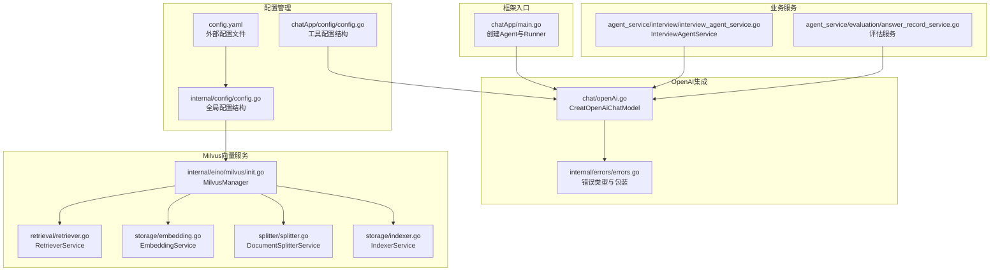
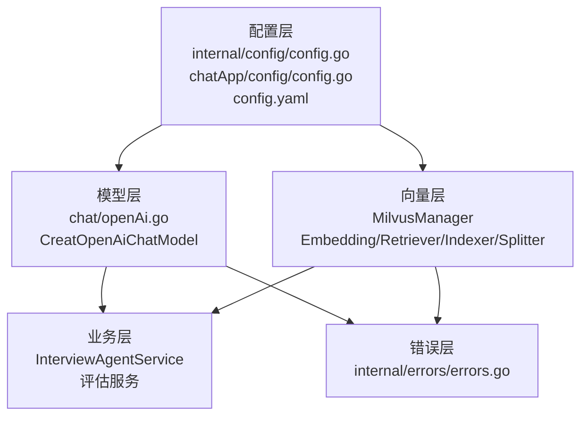
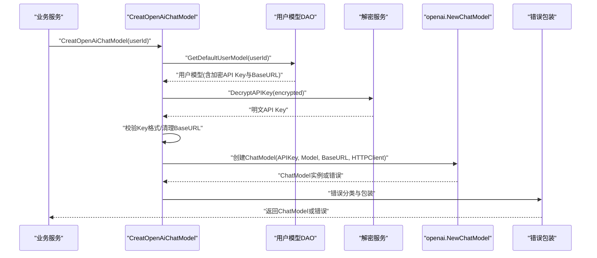
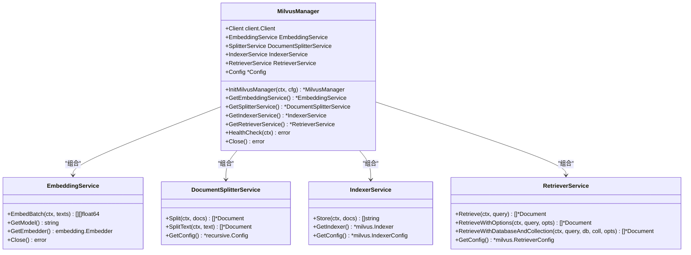
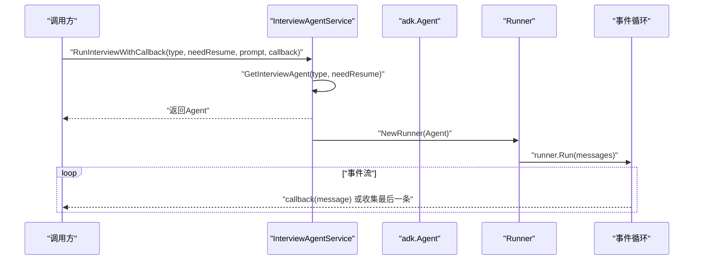
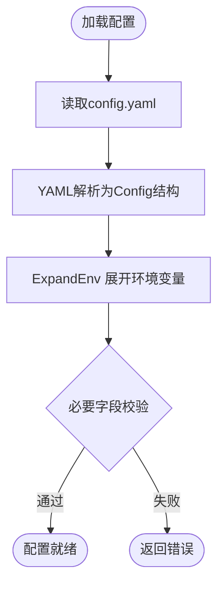
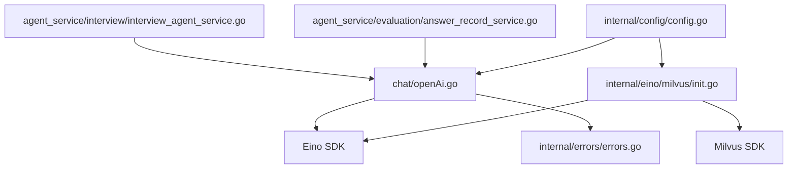

# Eino框架层设计

<cite>
**本文档引用的文件**
- [backend/chatApp/main.go](file://backend/chatApp/main.go)
- [backend/chatApp/config/config.go](file://backend/chatApp/config/config.go)
- [backend/chatApp/chat/openAi.go](file://backend/chatApp/chat/openAi.go)
- [backend/internal/config/config.go](file://backend/internal/config/config.go)
- [backend/internal/eino/milvus/init.go](file://backend/internal/eino/milvus/init.go)
- [backend/internal/eino/milvus/retrieval/retriever.go](file://backend/internal/eino/milvus/retrieval/retriever.go)
- [backend/internal/eino/milvus/storage/embedding.go](file://backend/internal/eino/milvus/storage/embedding.go)
- [backend/internal/eino/milvus/splitter/splitter.go](file://backend/internal/eino/milvus/splitter/splitter.go)
- [backend/internal/eino/milvus/storage/indexer.go](file://backend/internal/eino/milvus/storage/indexer.go)
- [backend/internal/errors/errors.go](file://backend/internal/errors/errors.go)
- [backend/chatApp/agent_service/interview/interview_agent_service.go](file://backend/chatApp/agent_service/interview/interview_agent_service.go)
- [backend/chatApp/agent_service/evaluation/answer_record_service.go](file://backend/chatApp/agent_service/evaluation/answer_record_service.go)
- [backend/chatApp/agent/interview/comprehensive/school_comprehensive_agent.go](file://backend/chatApp/agent/interview/comprehensive/school_comprehensive_agent.go)
- [backend/chatApp/agent/interview/specialized/go_agent.go](file://backend/chatApp/agent/interview/specialized/go_agent.go)
- [backend/config.yaml](file://backend/config.yaml)
</cite>

## 目录
1. [简介](#简介)
2. [项目结构](#项目结构)
3. [核心组件](#核心组件)
4. [架构总览](#架构总览)
5. [详细组件分析](#详细组件分析)
6. [依赖关系分析](#依赖关系分析)
7. [性能考虑](#性能考虑)
8. [故障排除指南](#故障排除指南)
9. [结论](#结论)

## 简介
本设计文档聚焦于面试吧AI智能面试平台的Eino框架层实现，系统性阐述Eino框架在项目中的初始化流程、配置管理、模型选择与API调用封装；深入解析OpenAI集成的实现细节（API密钥管理、请求参数配置、响应处理机制）；说明框架层如何抽象化底层AI模型差异，向上层业务服务提供统一接口；并覆盖错误处理策略、重试机制与超时控制、扩展性设计（多模型切换与配置）、以及性能监控与日志记录方案。

## 项目结构
Eino框架层主要分布在以下模块：
- 框架入口与演示：chatApp/main.go展示如何基于Eino创建Agent并运行
- 配置管理：内部配置与外部配置文件协同工作
- OpenAI集成：封装模型创建、密钥解密、HTTP客户端与错误分类
- Milvus向量检索：Embedding、分割器、索引器与检索器的统一管理
- 业务服务：面试Agent服务与评估服务通过统一Runner驱动Eino Agent
- 错误处理：集中化的错误类型与HTTP状态码映射

**图表来源**
- [backend/chatApp/main.go](file://backend/chatApp/main.go#L25-L123)
- [backend/chatApp/config/config.go](file://backend/chatApp/config/config.go#L36-L73)
- [backend/chatApp/chat/openAi.go](file://backend/chatApp/chat/openAi.go#L19-L109)
- [backend/internal/config/config.go](file://backend/internal/config/config.go#L13-L31)
- [backend/internal/eino/milvus/init.go](file://backend/internal/eino/milvus/init.go#L42-L142)
- [backend/internal/eino/milvus/retrieval/retriever.go](file://backend/internal/eino/milvus/retrieval/retriever.go#L22-L89)
- [backend/internal/eino/milvus/storage/embedding.go](file://backend/internal/eino/milvus/storage/embedding.go#L20-L74)
- [backend/internal/eino/milvus/splitter/splitter.go](file://backend/internal/eino/milvus/splitter/splitter.go#L20-L51)
- [backend/internal/eino/milvus/storage/indexer.go](file://backend/internal/eino/milvus/storage/indexer.go#L20-L82)
- [backend/chatApp/agent_service/interview/interview_agent_service.go](file://backend/chatApp/agent_service/interview/interview_agent_service.go#L50-L73)
- [backend/chatApp/agent_service/evaluation/answer_record_service.go](file://backend/chatApp/agent_service/evaluation/answer_record_service.go#L16-L100)

**章节来源**
- [backend/chatApp/main.go](file://backend/chatApp/main.go#L25-L123)
- [backend/chatApp/config/config.go](file://backend/chatApp/config/config.go#L36-L73)
- [backend/chatApp/chat/openAi.go](file://backend/chatApp/chat/openAi.go#L19-L109)
- [backend/internal/config/config.go](file://backend/internal/config/config.go#L13-L31)
- [backend/internal/eino/milvus/init.go](file://backend/internal/eino/milvus/init.go#L42-L142)

## 核心组件
- 框架初始化与运行
  - 在入口处创建ChatModel与Agent，再由Runner驱动执行，支持事件流式输出与迭代控制
- 配置管理
  - 内部配置结构支持数据库、Redis、Hertz、Eino、Interview、Security、GoogleSearch、OpenAI、Embedding、Milvus、DocumentSplitter、Wechat、Feishu、Email等
  - 工具配置结构支持Google与OpenAI节点
  - 配置文件支持环境变量展开
- OpenAI集成
  - 从用户模型中解密API Key，校验格式，清理BaseURL，创建自定义HTTP客户端并封装错误分类
- Milvus向量服务
  - 通过MilvusManager统一管理Embedding、分割器、索引器与检索器，并提供健康检查与关闭逻辑
- 业务服务
  - InterviewAgentService根据类型创建不同面试Agent，统一通过Runner执行
  - 评估服务通过超时上下文与Runner执行主题评估

**章节来源**
- [backend/chatApp/main.go](file://backend/chatApp/main.go#L25-L123)
- [backend/internal/config/config.go](file://backend/internal/config/config.go#L13-L31)
- [backend/chatApp/config/config.go](file://backend/chatApp/config/config.go#L14-L32)
- [backend/chatApp/chat/openAi.go](file://backend/chatApp/chat/openAi.go#L19-L109)
- [backend/internal/eino/milvus/init.go](file://backend/internal/eino/milvus/init.go#L42-L142)
- [backend/chatApp/agent_service/interview/interview_agent_service.go](file://backend/chatApp/agent_service/interview/interview_agent_service.go#L50-L73)
- [backend/chatApp/agent_service/evaluation/answer_record_service.go](file://backend/chatApp/agent_service/evaluation/answer_record_service.go#L16-L100)

## 架构总览
Eino框架层采用“配置驱动 + 组件封装 + 统一Runner”的架构模式：
- 配置层：内部配置与外部配置文件协同，支持环境变量展开
- 模型层：OpenAI模型封装，提供统一的ToolCallingChatModel接口
- 向量层：MilvusManager统一管理Embedding、分割器、索引器与检索器
- 业务层：InterviewAgentService与评估服务通过Runner驱动Agent执行
- 错误层：集中化错误类型与HTTP状态码映射，便于上层统一处理

**图表来源**
- [backend/internal/config/config.go](file://backend/internal/config/config.go#L13-L31)
- [backend/chatApp/config/config.go](file://backend/chatApp/config/config.go#L14-L32)
- [backend/config.yaml](file://backend/config.yaml#L55-L59)
- [backend/chatApp/chat/openAi.go](file://backend/chatApp/chat/openAi.go#L19-L109)
- [backend/internal/eino/milvus/init.go](file://backend/internal/eino/milvus/init.go#L42-L142)
- [backend/chatApp/agent_service/interview/interview_agent_service.go](file://backend/chatApp/agent_service/interview/interview_agent_service.go#L50-L73)
- [backend/chatApp/agent_service/evaluation/answer_record_service.go](file://backend/chatApp/agent_service/evaluation/answer_record_service.go#L16-L100)
- [backend/internal/errors/errors.go](file://backend/internal/errors/errors.go#L12-L29)

## 详细组件分析

### OpenAI集成组件分析
OpenAI集成通过CreatOpenAiChatModel完成：
- 用户模型查询与API Key解密
- API Key格式校验与BaseURL清理
- 自定义HTTP客户端配置（超时、TLS、禁用KeepAlive、强制HTTP/1.1）
- 基于openai.NewChatModel创建模型实例
- 错误分类与包装，区分配额不足、速率限制、上下文长度等

**图表来源**
- [backend/chatApp/chat/openAi.go](file://backend/chatApp/chat/openAi.go#L19-L109)
- [backend/internal/errors/errors.go](file://backend/internal/errors/errors.go#L129-L151)

**章节来源**
- [backend/chatApp/chat/openAi.go](file://backend/chatApp/chat/openAi.go#L19-L109)
- [backend/internal/errors/errors.go](file://backend/internal/errors/errors.go#L12-L29)

### Milvus向量服务组件分析
MilvusManager负责统一初始化与管理：
- 连接Milvus客户端
- 初始化Embedding服务（Ark平台），支持APIKey或AK/SK认证
- 初始化文档分割器（递归分割器）
- 初始化索引器（指定维度与字段类型）
- 初始化检索器（支持过滤表达式与阈值）
- 提供健康检查与关闭逻辑

**图表来源**
- [backend/internal/eino/milvus/init.go](file://backend/internal/eino/milvus/init.go#L22-L141)
- [backend/internal/eino/milvus/storage/embedding.go](file://backend/internal/eino/milvus/storage/embedding.go#L14-L74)
- [backend/internal/eino/milvus/splitter/splitter.go](file://backend/internal/eino/milvus/splitter/splitter.go#L14-L51)
- [backend/internal/eino/milvus/storage/indexer.go](file://backend/internal/eino/milvus/storage/indexer.go#L14-L82)
- [backend/internal/eino/milvus/retrieval/retriever.go](file://backend/internal/eino/milvus/retrieval/retriever.go#L15-L89)

**章节来源**
- [backend/internal/eino/milvus/init.go](file://backend/internal/eino/milvus/init.go#L42-L142)
- [backend/internal/eino/milvus/storage/embedding.go](file://backend/internal/eino/milvus/storage/embedding.go#L20-L74)
- [backend/internal/eino/milvus/splitter/splitter.go](file://backend/internal/eino/milvus/splitter/splitter.go#L20-L51)
- [backend/internal/eino/milvus/storage/indexer.go](file://backend/internal/eino/milvus/storage/indexer.go#L20-L82)
- [backend/internal/eino/milvus/retrieval/retriever.go](file://backend/internal/eino/milvus/retrieval/retriever.go#L22-L89)

### 业务服务组件分析
- InterviewAgentService：根据面试类型创建不同Agent，统一通过Runner执行，支持回调与迭代控制
- 评估服务：通过超时上下文与Runner执行主题评估，解析智能体返回的JSON并持久化

**图表来源**
- [backend/chatApp/agent_service/interview/interview_agent_service.go](file://backend/chatApp/agent_service/interview/interview_agent_service.go#L85-L154)

**章节来源**
- [backend/chatApp/agent_service/interview/interview_agent_service.go](file://backend/chatApp/agent_service/interview/interview_agent_service.go#L50-L154)
- [backend/chatApp/agent_service/evaluation/answer_record_service.go](file://backend/chatApp/agent_service/evaluation/answer_record_service.go#L16-L100)

### 配置管理组件分析
- 内部配置结构：涵盖数据库、Redis、Hertz、Eino、Interview、Security、GoogleSearch、OpenAI、Embedding、Milvus、DocumentSplitter、Wechat、Feishu、Email等
- 工具配置结构：支持Google与OpenAI节点
- 配置文件：支持环境变量展开，如${EMBEDDING_API_KEY}

**图表来源**
- [backend/internal/config/config.go](file://backend/internal/config/config.go#L136-L152)
- [backend/internal/config/config.go](file://backend/internal/config/config.go#L212-L268)
- [backend/chatApp/config/config.go](file://backend/chatApp/config/config.go#L34-L73)
- [backend/config.yaml](file://backend/config.yaml#L61-L78)

**章节来源**
- [backend/internal/config/config.go](file://backend/internal/config/config.go#L13-L31)
- [backend/chatApp/config/config.go](file://backend/chatApp/config/config.go#L14-L32)
- [backend/config.yaml](file://backend/config.yaml#L55-L59)

## 依赖关系分析
- 组件耦合
  - OpenAI集成依赖用户模型DAO与解密服务，向上提供统一的ToolCallingChatModel
  - MilvusManager聚合Embedding、分割器、索引器与检索器，降低上层对底层SDK的直接依赖
  - 业务服务通过Runner与Agent解耦，便于扩展不同类型的Agent
- 外部依赖
  - Eino核心库（adk、schema、components）
  - OpenAI SDK（openai.NewChatModel）
  - Milvus SDK（milvus-client-go）
  - YAML解析（gopkg.in/yaml.v3）

**图表来源**
- [backend/chatApp/chat/openAi.go](file://backend/chatApp/chat/openAi.go#L15-L16)
- [backend/internal/eino/milvus/init.go](file://backend/internal/eino/milvus/init.go#L9-L14)
- [backend/chatApp/agent_service/interview/interview_agent_service.go](file://backend/chatApp/agent_service/interview/interview_agent_service.go#L10-L11)
- [backend/chatApp/agent_service/evaluation/answer_record_service.go](file://backend/chatApp/agent_service/evaluation/answer_record_service.go#L11-L13)
- [backend/internal/config/config.go](file://backend/internal/config/config.go#L13-L31)

**章节来源**
- [backend/chatApp/chat/openAi.go](file://backend/chatApp/chat/openAi.go#L15-L16)
- [backend/internal/eino/milvus/init.go](file://backend/internal/eino/milvus/init.go#L9-L14)
- [backend/chatApp/agent_service/interview/interview_agent_service.go](file://backend/chatApp/agent_service/interview/interview_agent_service.go#L10-L11)
- [backend/chatApp/agent_service/evaluation/answer_record_service.go](file://backend/chatApp/agent_service/evaluation/answer_record_service.go#L11-L13)
- [backend/internal/config/config.go](file://backend/internal/config/config.go#L13-L31)

## 性能考虑
- 超时控制
  - OpenAI集成：HTTP客户端配置ResponseHeaderTimeout与TLS握手超时，避免长时间阻塞
  - 评估服务：使用300秒超时上下文，防止长时间等待
- 重试机制
  - Embedding服务：支持RetryTimes配置，默认3次重试
  - Milvus检索：通过检索参数与阈值控制召回质量与性能平衡
- 连接与协议
  - 禁用KeepAlive与强制HTTP/1.1，减少HTTP/2相关问题
- 向量维度与索引
  - 索引器显式使用FloatVector与COSINE度量，提升检索效率

**章节来源**
- [backend/chatApp/chat/openAi.go](file://backend/chatApp/chat/openAi.go#L64-L75)
- [backend/chatApp/agent_service/evaluation/answer_record_service.go](file://backend/chatApp/agent_service/evaluation/answer_record_service.go#L17-L19)
- [backend/internal/eino/milvus/storage/embedding.go](file://backend/internal/eino/milvus/storage/embedding.go#L43-L46)
- [backend/internal/eino/milvus/storage/indexer.go](file://backend/internal/eino/milvus/storage/indexer.go#L69-L71)

## 故障排除指南
- OpenAI错误分类
  - 配额不足/令牌用尽：返回402状态码
  - 速率限制：返回429状态码
  - 上下文长度超限：返回413状态码
- 错误包装与追踪
  - 使用WrapError保留原始错误，便于定位问题
  - As/Unwrap辅助错误链检查
- 日志与调试
  - OpenAI集成内置loggingTransport，打印请求URL、Body大小与响应状态
  - MilvusManager提供健康检查与关闭逻辑，便于诊断连接问题

**章节来源**
- [backend/internal/errors/errors.go](file://backend/internal/errors/errors.go#L129-L151)
- [backend/chatApp/chat/openAi.go](file://backend/chatApp/chat/openAi.go#L111-L141)
- [backend/internal/eino/milvus/init.go](file://backend/internal/eino/milvus/init.go#L204-L218)

## 结论
Eino框架层通过清晰的配置管理、统一的模型封装与向量服务管理，实现了对上层业务的高度抽象与解耦。OpenAI集成提供了完善的错误分类与超时控制，Milvus向量服务通过Manager模式统一了复杂组件的生命周期与配置。业务服务通过Runner与Agent的组合，实现了灵活的执行流程与事件处理。整体设计具备良好的扩展性与可维护性，为面试吧AI智能面试平台提供了稳定可靠的AI能力支撑。