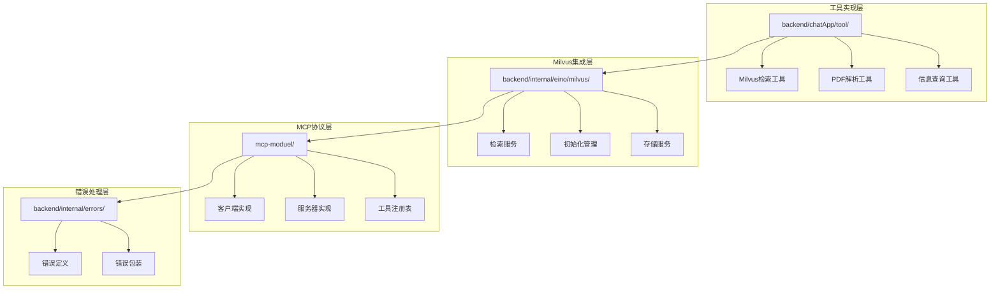
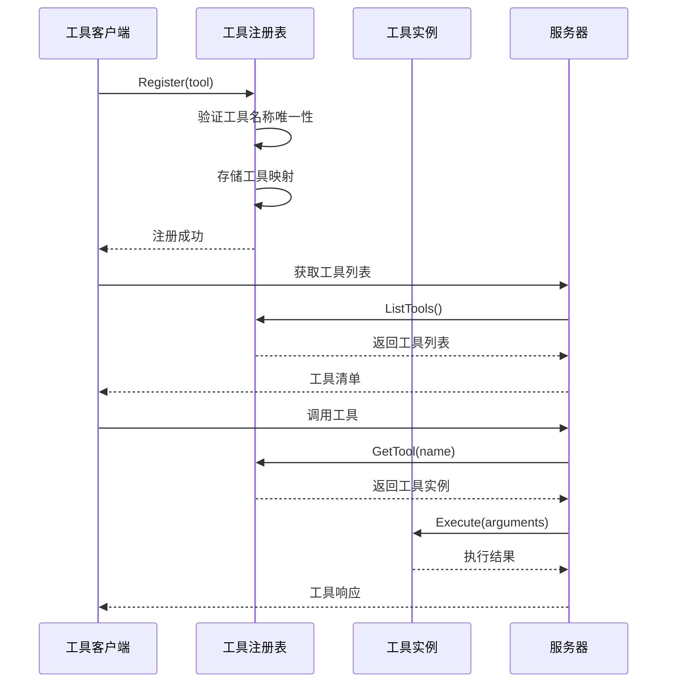
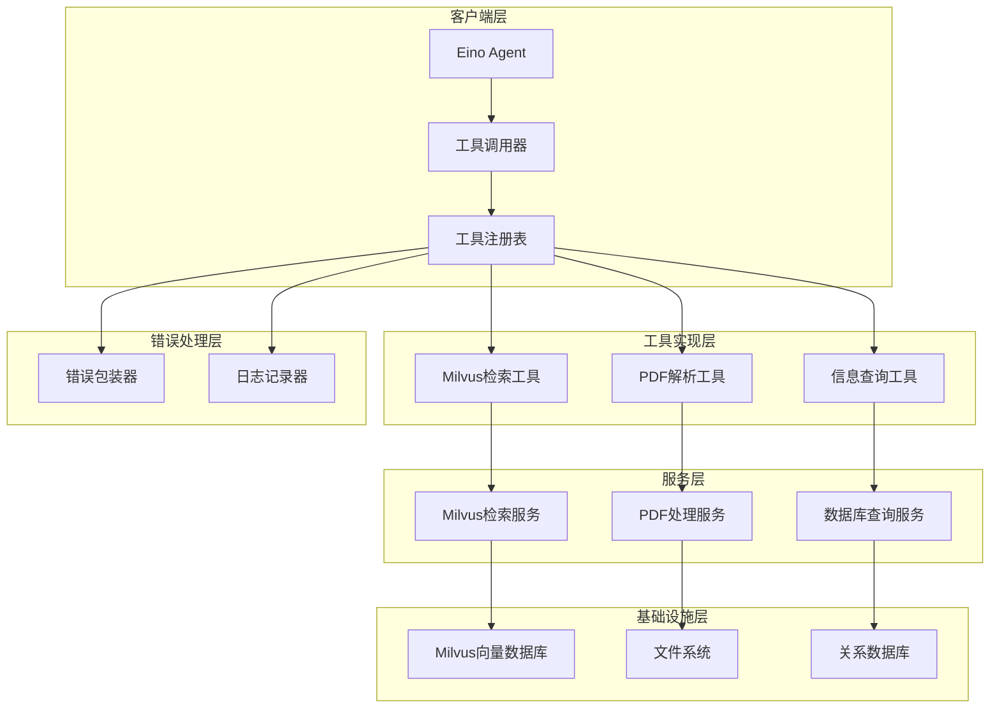
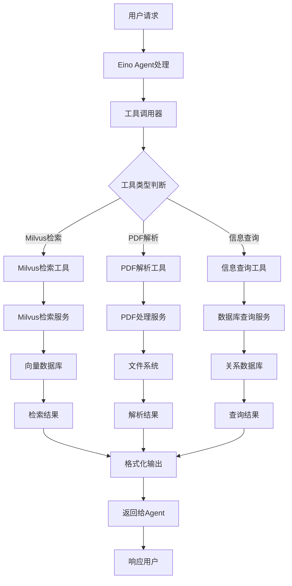
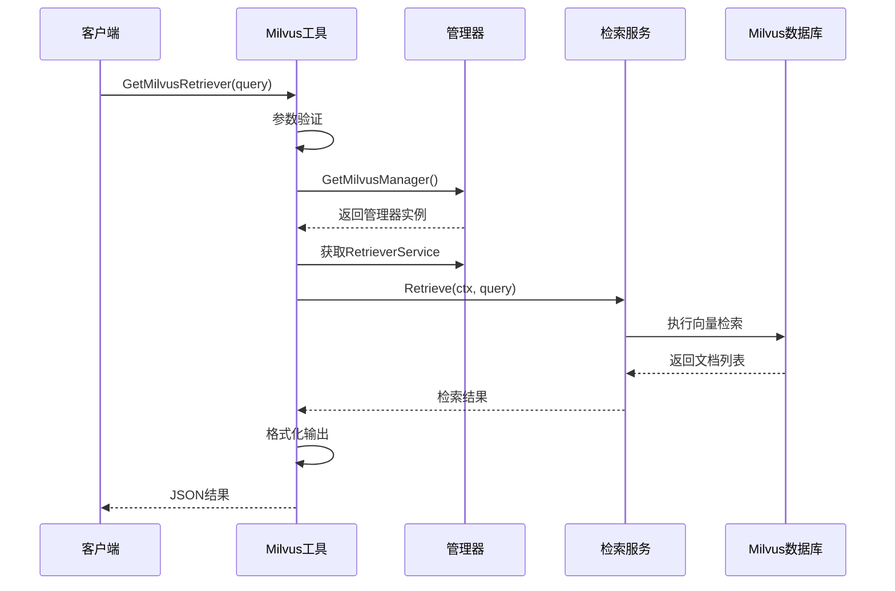
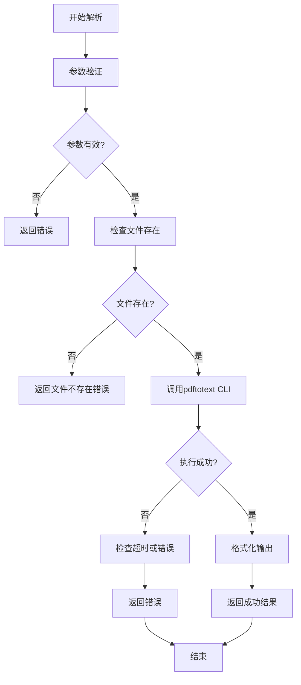
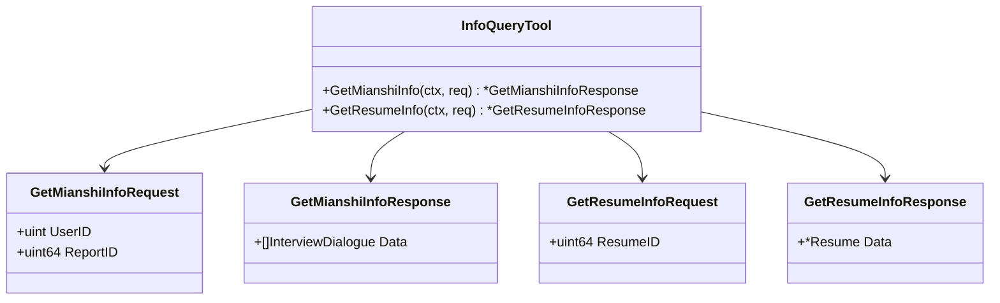
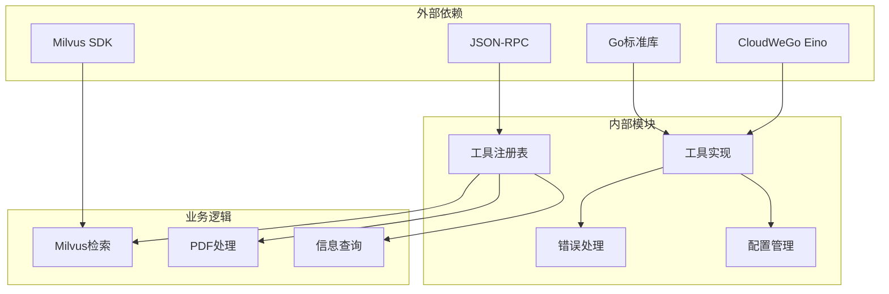
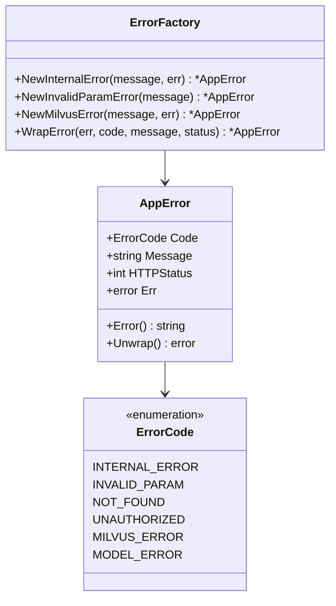

# 工具集成系统设计

<cite>
**本文档引用的文件**
- [milvus_retriever_tool.go](file://backend/chatApp/tool/milvus_retriever_tool.go)
- [pdfParserTool.go](file://backend/chatApp/tool/pdfParserTool.go)
- [get_mianshi_info_tool.go](file://backend/chatApp/tool/get_mianshi_info_tool.go)
- [get_resume_info_tool.go](file://backend/chatApp/tool/get_resume_info_tool.go)
- [retriever.go](file://backend/internal/eino/milvus/retrieval/retriever.go)
- [init.go](file://backend/internal/eino/milvus/init.go)
- [errors.go](file://backend/internal/errors/errors.go)
- [config.go](file://backend/chatApp/config/config.go)
- [tool_fetcher.go](file://backend/mcp-moduel/internal/client/tool_fetcher.go)
- [mcp.go](file://backend/mcp-moduel/internal/client/mcp.go)
- [client.go](file://backend/mcp-moduel/mcpmodule/client.go)
- [registry.go](file://backend/mcp-moduel/internal/server/registry.go)
- [tools.go](file://backend/mcp-moduel/internal/server/tools/tools.go)
- [time_tool.go](file://backend/mcp-moduel/internal/server/tools/time_tool.go)
- [calculator_tool.go](file://backend/mcp-moduel/internal/server/tools/calculator_tool.go)
- [text_processor_tool.go](file://backend/mcp-moduel/internal/server/tools/text_processor_tool.go)
- [pdf_test.go](file://backend/chatApp/tool/pdf_test.go)
</cite>

## 目录
1. [简介](#简介)
2. [项目结构](#项目结构)
3. [核心组件](#核心组件)
4. [架构概览](#架构概览)
5. [详细组件分析](#详细组件分析)
6. [依赖关系分析](#依赖关系分析)
7. [性能考虑](#性能考虑)
8. [故障排除指南](#故障排除指南)
9. [结论](#结论)

## 简介

面试吧AI智能面试平台的工具集成系统是一个基于CloudWeGo Eino框架构建的智能化工具调用平台。该系统支持多种类型的AI工具集成，包括向量数据库检索工具、PDF解析工具、信息查询工具等，为面试官和候选人提供全方位的智能辅助功能。

系统采用模块化设计，通过统一的工具注册、发现和调用机制，实现了工具的标准化管理和灵活扩展。每个工具都遵循统一的接口规范，确保了系统的可维护性和可扩展性。

## 项目结构

工具集成系统主要分布在以下目录结构中：



**图表来源**
- [milvus_retriever_tool.go](file://backend/chatApp/tool/milvus_retriever_tool.go#L1-L144)
- [init.go](file://backend/internal/eino/milvus/init.go#L1-L219)
- [errors.go](file://backend/internal/errors/errors.go#L1-L178)

**章节来源**
- [milvus_retriever_tool.go](file://backend/chatApp/tool/milvus_retriever_tool.go#L1-L144)
- [pdfParserTool.go](file://backend/chatApp/tool/pdfParserTool.go#L1-L124)
- [get_mianshi_info_tool.go](file://backend/chatApp/tool/get_mianshi_info_tool.go#L1-L50)
- [get_resume_info_tool.go](file://backend/chatApp/tool/get_resume_info_tool.go#L1-L48)

## 核心组件

### 工具接口设计

系统采用统一的工具接口规范，所有工具都实现以下核心接口：

```mermaid
classDiagram
class ToolInterface {
+Name() string
+Description() string
+InputSchema() map[string]interface{}
+Execute(ctx, arguments) *CallToolResult
}
class MilvusRetrieverTool {
+GetMilvusRetriever(ctx, query) string
+GetMilvusRetrieverWithInput(ctx, input) string
+GetMilvusRetrieverTool() InvokableTool
}
class PDFToTextTool {
+ConvertPDFToText(ctx, req) *PDFToTextResult
+CreatePDFToTextTool() InvokableTool
}
class InfoQueryTool {
+GetMianshiInfo(ctx, req) *GetMianshiInfoResponse
+GetResumeInfo(ctx, req) *GetResumeInfoResponse
}
ToolInterface <|-- MilvusRetrieverTool
ToolInterface <|-- PDFToTextTool
ToolInterface <|-- InfoQueryTool
```

**图表来源**
- [milvus_retriever_tool.go](file://backend/chatApp/tool/milvus_retriever_tool.go#L132-L143)
- [pdfParserTool.go](file://backend/chatApp/tool/pdfParserTool.go#L114-L123)
- [get_mianshi_info_tool.go](file://backend/chatApp/tool/get_mianshi_info_tool.go#L38-L49)

### 工具注册机制

系统通过工具注册表实现工具的动态注册和管理：



**图表来源**
- [registry.go](file://backend/mcp-moduel/internal/server/registry.go#L39-L72)
- [mcp.go](file://backend/mcp-moduel/internal/server/mcp.go#L54-L101)

**章节来源**
- [registry.go](file://backend/mcp-moduel/internal/server/registry.go#L1-L106)
- [tools.go](file://backend/mcp-moduel/internal/server/tools/tools.go#L1-L12)

## 架构概览

### 整体架构设计



**图表来源**
- [milvus_retriever_tool.go](file://backend/chatApp/tool/milvus_retriever_tool.go#L48-L101)
- [pdfParserTool.go](file://backend/chatApp/tool/pdfParserTool.go#L39-L112)
- [init.go](file://backend/internal/eino/milvus/init.go#L22-L35)

### 数据流架构



**图表来源**
- [milvus_retriever_tool.go](file://backend/chatApp/tool/milvus_retriever_tool.go#L48-L101)
- [pdfParserTool.go](file://backend/chatApp/tool/pdfParserTool.go#L39-L112)
- [retriever.go](file://backend/internal/eino/milvus/retrieval/retriever.go#L91-L130)

## 详细组件分析

### Milvus检索工具

Milvus检索工具是系统的核心组件之一，负责从向量数据库中检索相关信息。

#### 工具实现架构

```mermaid
classDiagram
class MilvusRetrieverInput {
+string Query
}
class MilvusRetrieverOutput {
+[]DocumentInfo Documents
+int Count
+string Error
}
class DocumentInfo {
+string ID
+string Content
+map[string]interface{} Metadata
+float32 Score
}
class MilvusRetrieverTool {
+GetMilvusRetriever(ctx, query) string
+GetMilvusRetrieverWithInput(ctx, input) string
+formatOutput(documents, count) string
+formatErrorOutput(errMsg, count) string
}
class RetrieverService {
+Retrieve(ctx, query) []*Document
+RetrieveWithOptions(ctx, query, opts) []*Document
+SearchWithExpr(ctx, client, config, query, expr, opts) []*Document
}
MilvusRetrieverTool --> MilvusRetrieverInput
MilvusRetrieverTool --> MilvusRetrieverOutput
MilvusRetrieverOutput --> DocumentInfo
MilvusRetrieverTool --> RetrieverService
```

**图表来源**
- [milvus_retriever_tool.go](file://backend/chatApp/tool/milvus_retriever_tool.go#L15-L41)
- [retriever.go](file://backend/internal/eino/milvus/retrieval/retriever.go#L15-L20)

#### 检索流程



**图表来源**
- [milvus_retriever_tool.go](file://backend/chatApp/tool/milvus_retriever_tool.go#L48-L101)
- [init.go](file://backend/internal/eino/milvus/init.go#L145-L151)

**章节来源**
- [milvus_retriever_tool.go](file://backend/chatApp/tool/milvus_retriever_tool.go#L1-L144)
- [retriever.go](file://backend/internal/eino/milvus/retrieval/retriever.go#L1-L173)
- [init.go](file://backend/internal/eino/milvus/init.go#L1-L219)

### PDF解析工具

PDF解析工具负责将PDF文件转换为纯文本格式，支持按页面分割和合并输出。

#### 工具执行流程



**图表来源**
- [pdfParserTool.go](file://backend/chatApp/tool/pdfParserTool.go#L39-L112)

#### 工具配置和参数

| 参数名 | 类型 | 必填 | 默认值 | 描述 |
|--------|------|------|--------|------|
| file_path | string | 是 | - | 本地PDF文件的绝对路径 |
| to_pages | bool | 否 | false | 是否按页面分割文本 |

**章节来源**
- [pdfParserTool.go](file://backend/chatApp/tool/pdfParserTool.go#L1-L124)
- [pdf_test.go](file://backend/chatApp/tool/pdf_test.go#L1-L116)

### 信息查询工具

信息查询工具提供面试记录和简历信息的查询功能。

#### 工具接口设计



**图表来源**
- [get_mianshi_info_tool.go](file://backend/chatApp/tool/get_mianshi_info_tool.go#L12-L21)
- [get_resume_info_tool.go](file://backend/chatApp/tool/get_resume_info_tool.go#L11-L19)

**章节来源**
- [get_mianshi_info_tool.go](file://backend/chatApp/tool/get_mianshi_info_tool.go#L1-L50)
- [get_resume_info_tool.go](file://backend/chatApp/tool/get_resume_info_tool.go#L1-L48)

## 依赖关系分析

### 工具依赖图



**图表来源**
- [milvus_retriever_tool.go](file://backend/chatApp/tool/milvus_retriever_tool.go#L3-L13)
- [pdfParserTool.go](file://backend/chatApp/tool/pdfParserTool.go#L3-L15)

### 错误处理机制

系统采用统一的错误处理机制，确保错误信息的一致性和可追踪性：



**图表来源**
- [errors.go](file://backend/internal/errors/errors.go#L9-L38)

**章节来源**
- [errors.go](file://backend/internal/errors/errors.go#L1-L178)

## 性能考虑

### 工具调用性能优化

系统在工具调用过程中采用了多项性能优化措施：

1. **连接池管理**：Milvus客户端连接采用连接池管理，减少连接建立开销
2. **缓存机制**：工具注册表使用读写锁优化并发访问
3. **异步处理**：PDF解析采用异步处理模式，避免阻塞主线程
4. **超时控制**：所有外部调用都设置了合理的超时时间

### 监控指标设计

系统建议收集以下关键性能指标：

| 指标类型 | 指标名称 | 描述 | 收集频率 |
|----------|----------|------|----------|
| 计数器 | tool_call_total | 工具调用总数 | 实时 |
| 计数器 | tool_error_total | 工具调用错误数 | 实时 |
| 计时器 | tool_duration_seconds | 工具调用耗时 | 实时 |
| 计数器 | milvus_query_total | Milvus查询次数 | 实时 |
| 计数器 | pdf_parse_total | PDF解析次数 | 实时 |
| 计数器 | info_query_total | 信息查询次数 | 实时 |

## 故障排除指南

### 常见问题诊断

#### Milvus连接问题

**症状**：工具调用返回"向量数据库管理器初始化失败"

**诊断步骤**：
1. 检查Milvus服务状态
2. 验证连接配置参数
3. 确认网络连通性
4. 检查认证凭据

**解决方案**：
- 重启Milvus服务
- 更新配置文件中的连接参数
- 检查防火墙设置

#### PDF解析失败

**症状**：PDF解析返回"文件不存在或无法访问"

**诊断步骤**：
1. 验证文件路径的绝对性
2. 检查文件权限
3. 确认pdftotext工具安装
4. 验证文件格式支持

**解决方案**：
- 使用绝对路径而非相对路径
- 确保文件具有读取权限
- 安装并配置pdftotext工具
- 检查PDF文件是否为文本型而非扫描版

#### 工具注册冲突

**症状**：注册工具时返回"tool already registered"

**诊断步骤**：
1. 检查工具名称唯一性
2. 验证工具实例生命周期
3. 确认并发注册情况

**解决方案**：
- 修改工具名称确保唯一性
- 确保工具实例正确释放
- 使用互斥锁保护注册过程

**章节来源**
- [milvus_retriever_tool.go](file://backend/chatApp/tool/milvus_retriever_tool.go#L54-L66)
- [pdfParserTool.go](file://backend/chatApp/tool/pdfParserTool.go#L56-L61)
- [registry.go](file://backend/mcp-moduel/internal/server/registry.go#L53-L55)

## 结论

面试吧AI智能面试平台的工具集成系统通过模块化设计和标准化接口，成功实现了多种AI工具的统一管理和灵活调用。系统具备以下优势：

1. **高度模块化**：每个工具都是独立的模块，便于维护和扩展
2. **统一接口**：所有工具遵循相同的接口规范，降低了集成复杂度
3. **强健的错误处理**：完善的错误包装和分类机制，提高了系统的稳定性
4. **灵活的配置管理**：支持运行时配置更新和环境变量扩展
5. **良好的性能表现**：通过连接池、缓存和异步处理等技术优化性能

未来可以进一步增强的方向包括：
- 添加更多的工具类型支持
- 实现工具版本管理和兼容性检查
- 增强工具的可观测性和监控能力
- 优化工具的并发处理能力和资源管理

该系统为面试吧AI智能面试平台提供了坚实的技术基础，能够满足当前和未来的业务需求。