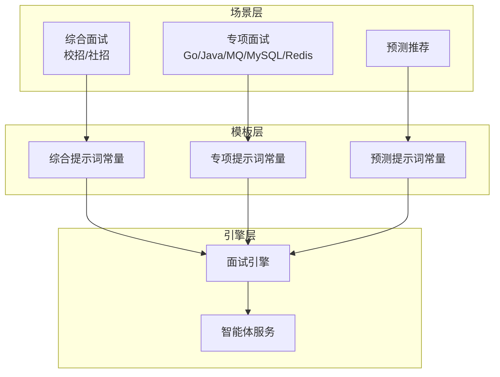
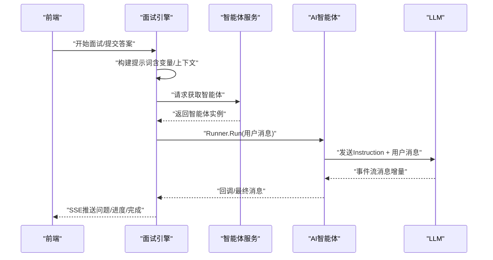
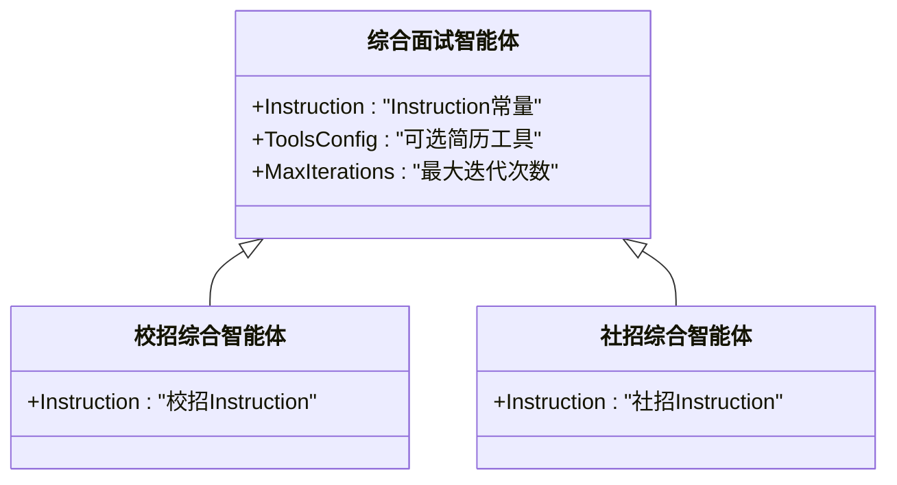
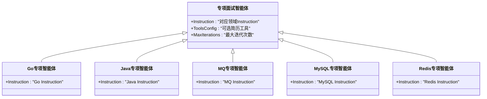
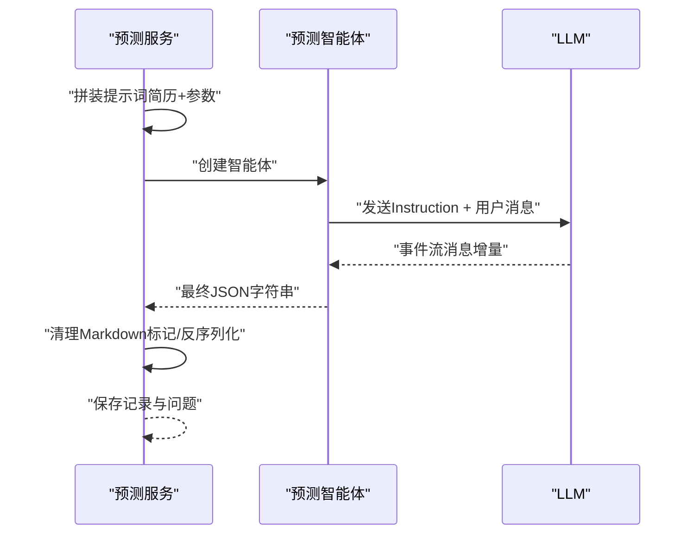
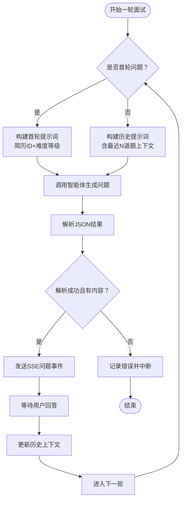
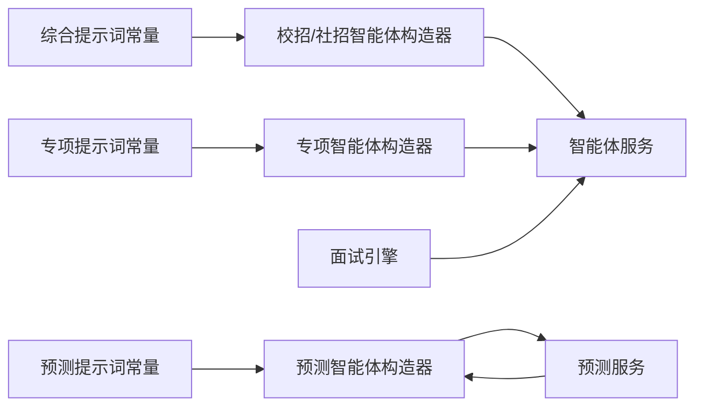

# 提示词模板系统设计

<cite>
**本文档引用的文件**
- [engine.go](file://backend/api/handler/interview/mianshi/engine.go)
- [interview_agent_service.go](file://backend/chatApp/agent_service/interview/interview_agent_service.go)
- [school_comprehensive_agent.go](file://backend/chatApp/agent/interview/comprehensive/school_comprehensive_agent.go)
- [social_comprehensive_agent.go](file://backend/chatApp/agent/interview/comprehensive/social_comprehensive_agent.go)
- [constants.go](file://backend/chatApp/agent/interview/comprehensive/constants.go)
- [constants.go](file://backend/chatApp/agent/interview/specialized/constants.go)
- [go_agent.go](file://backend/chatApp/agent/interview/specialized/go_agent.go)
- [java_agent.go](file://backend/chatApp/agent/interview/specialized/java_agent.go)
- [mq_agent.go](file://backend/chatApp/agent/interview/specialized/mq_agent.go)
- [mysql_agent.go](file://backend/chatApp/agent/interview/specialized/mysql_agent.go)
- [redis_agent.go](file://backend/chatApp/agent/interview/specialized/redis_agent.go)
- [prediction_agent.go](file://backend/chatApp/agent/prediction/prediction_agent.go)
- [prediction_impl.go](file://backend/internal/service/prediction/impl/prediction_impl.go)
</cite>

## 目录
1. [简介](#简介)
2. [项目结构](#项目结构)
3. [核心组件](#核心组件)
4. [架构总览](#架构总览)
5. [详细组件分析](#详细组件分析)
6. [依赖关系分析](#依赖关系分析)
7. [性能考量](#性能考量)
8. [故障排除指南](#故障排除指南)
9. [结论](#结论)

## 简介
本设计文档面向“面试吧AI智能面试平台”，围绕提示词模板系统展开，系统性阐述模板化提示词的架构设计与实现机制，包括模板结构定义、变量替换与上下文注入方式；覆盖综合面试、专项面试与预测推荐三类面试场景的模板策略；解释模板如何控制AI行为模式、输出格式与交互风格；并给出模板版本管理、A/B测试与效果评估机制、可配置性与个性化定制能力以及性能优化与缓存策略。

## 项目结构
提示词模板系统在当前代码库中呈现为“按场景分层”的组织方式：
- 场景层：综合面试（校招/社招）、专项面试（Go/Java/MQ/MySQL/Redis）、预测推荐
- 模板层：各场景下的提示词常量与智能体构造器
- 引擎层：面试引擎负责构建提示词、注入上下文、调度智能体
- 服务层：智能体服务封装Agent生命周期与运行流程

图表来源
- [engine.go](file://backend/api/handler/interview/mianshi/engine.go#L42-L115)
- [interview_agent_service.go](file://backend/chatApp/agent_service/interview/interview_agent_service.go#L50-L73)
- [constants.go](file://backend/chatApp/agent/interview/comprehensive/constants.go#L3-L46)
- [constants.go](file://backend/chatApp/agent/interview/specialized/constants.go#L3-L50)
- [prediction_agent.go](file://backend/chatApp/agent/prediction/prediction_agent.go#L37-L57)

章节来源
- [engine.go](file://backend/api/handler/interview/mianshi/engine.go#L42-L115)
- [interview_agent_service.go](file://backend/chatApp/agent_service/interview/interview_agent_service.go#L50-L73)

## 核心组件
- 模板结构定义
  - 综合面试：通过常量定义“校招/社招”两类提示词，明确职责、策略、提问建议与返回格式约束
  - 专项面试：针对不同技术栈（Go/Java/MQ/MySQL/Redis）分别定义提示词，强调技术深度、实战经验与架构能力
  - 预测推荐：定义押题生成的提示词与JSON结构约束，确保输出标准化
- 变量替换与上下文注入
  - 面试引擎在首轮与后续轮次分别注入简历ID、难度等级与历史问答上下文
  - 预测服务在提示词中注入简历内容与业务参数（类型、语言、岗位、难度、目标公司）
- 行为控制与输出格式
  - 模板内明确“只返回JSON”“每次只生成一道问题”等约束，确保AI遵循统一输出格式
  - 通过Instruction字段控制AI行为模式（提问策略、难度梯度、追问引导）

章节来源
- [constants.go](file://backend/chatApp/agent/interview/comprehensive/constants.go#L3-L46)
- [constants.go](file://backend/chatApp/agent/interview/comprehensive/constants.go#L48-L94)
- [constants.go](file://backend/chatApp/agent/interview/specialized/constants.go#L3-L50)
- [constants.go](file://backend/chatApp/agent/interview/specialized/constants.go#L52-L99)
- [constants.go](file://backend/chatApp/agent/interview/specialized/constants.go#L101-L148)
- [constants.go](file://backend/chatApp/agent/interview/specialized/constants.go#L150-L197)
- [constants.go](file://backend/chatApp/agent/interview/specialized/constants.go#L199-L246)
- [prediction_agent.go](file://backend/chatApp/agent/prediction/prediction_agent.go#L37-L57)
- [engine.go](file://backend/api/handler/interview/mianshi/engine.go#L74-L115)
- [prediction_impl.go](file://backend/internal/service/prediction/impl/prediction_impl.go#L42-L58)

## 架构总览
提示词模板系统采用“模板常量 + 引擎拼装 + 智能体执行”的三层架构：
- 模板常量：集中定义Instruction与输出约束
- 引擎拼装：根据会话状态与历史上下文动态构建提示词
- 智能体执行：通过Runner迭代消费事件流，回调收集最终消息

图表来源
- [engine.go](file://backend/api/handler/interview/mianshi/engine.go#L117-L126)
- [interview_agent_service.go](file://backend/chatApp/agent_service/interview/interview_agent_service.go#L85-L101)
- [interview_agent_service.go](file://backend/chatApp/agent_service/interview/interview_agent_service.go#L113-L154)

## 详细组件分析

### 综合面试模板策略
- 模板结构
  - 校招：侧重基础知识、学习潜力、思维过程与职业素养
  - 社招：侧重实战经验、系统设计、技术深度与领导力
- 行为控制
  - Instruction明确“每次只生成一道问题”“返回JSON格式”
  - 提问建议强调开放式问题、追问引导与难度梯度
- 上下文注入
  - 通过智能体构造器注入简历工具（可选），支持基于简历的背景提问

图表来源
- [school_comprehensive_agent.go](file://backend/chatApp/agent/interview/comprehensive/school_comprehensive_agent.go#L16-L46)
- [social_comprehensive_agent.go](file://backend/chatApp/agent/interview/comprehensive/social_comprehensive_agent.go#L16-L46)
- [constants.go](file://backend/chatApp/agent/interview/comprehensive/constants.go#L3-L46)
- [constants.go](file://backend/chatApp/agent/interview/comprehensive/constants.go#L48-L94)

章节来源
- [constants.go](file://backend/chatApp/agent/interview/comprehensive/constants.go#L3-L46)
- [constants.go](file://backend/chatApp/agent/interview/comprehensive/constants.go#L48-L94)
- [school_comprehensive_agent.go](file://backend/chatApp/agent/interview/comprehensive/school_comprehensive_agent.go#L16-L46)
- [social_comprehensive_agent.go](file://backend/chatApp/agent/interview/comprehensive/social_comprehensive_agent.go#L16-L46)

### 专项面试模板策略
- 模板结构
  - Go/Java/MQ/MySQL/Redis分别定义Instruction，强调对应领域的技术深度与实战能力
- 行为控制
  - 统一约束“不涉及编码练习”“只返回JSON”“每次只生成一道问题”
- 上下文注入
  - 通过智能体构造器注入简历工具，支持基于简历的背景提问

图表来源
- [go_agent.go](file://backend/chatApp/agent/interview/specialized/go_agent.go#L16-L46)
- [java_agent.go](file://backend/chatApp/agent/interview/specialized/java_agent.go#L16-L46)
- [mq_agent.go](file://backend/chatApp/agent/interview/specialized/mq_agent.go#L16-L46)
- [mysql_agent.go](file://backend/chatApp/agent/interview/specialized/mysql_agent.go#L16-L46)
- [redis_agent.go](file://backend/chatApp/agent/interview/specialized/redis_agent.go#L16-L46)
- [constants.go](file://backend/chatApp/agent/interview/specialized/constants.go#L3-L50)
- [constants.go](file://backend/chatApp/agent/interview/specialized/constants.go#L52-L99)
- [constants.go](file://backend/chatApp/agent/interview/specialized/constants.go#L101-L148)
- [constants.go](file://backend/chatApp/agent/interview/specialized/constants.go#L150-L197)
- [constants.go](file://backend/chatApp/agent/interview/specialized/constants.go#L199-L246)

章节来源
- [constants.go](file://backend/chatApp/agent/interview/specialized/constants.go#L3-L50)
- [constants.go](file://backend/chatApp/agent/interview/specialized/constants.go#L52-L99)
- [constants.go](file://backend/chatApp/agent/interview/specialized/constants.go#L101-L148)
- [constants.go](file://backend/chatApp/agent/interview/specialized/constants.go#L150-L197)
- [constants.go](file://backend/chatApp/agent/interview/specialized/constants.go#L199-L246)
- [go_agent.go](file://backend/chatApp/agent/interview/specialized/go_agent.go#L16-L46)
- [java_agent.go](file://backend/chatApp/agent/interview/specialized/java_agent.go#L16-L46)
- [mq_agent.go](file://backend/chatApp/agent/interview/specialized/mq_agent.go#L16-L46)
- [mysql_agent.go](file://backend/chatApp/agent/interview/specialized/mysql_agent.go#L16-L46)
- [redis_agent.go](file://backend/chatApp/agent/interview/specialized/redis_agent.go#L16-L46)

### 预测推荐模板策略
- 模板结构
  - Instruction明确“必须生成5道题目”“必须返回标准JSON格式”“必须结合简历”
  - 定义JSON结构模板（问题、内容、重点考察、思考路径、参考答案、可能追问）
- 变量替换
  - 预测服务在提示词中注入简历内容与业务参数（类型、语言、岗位、难度、目标公司）
- 输出格式控制
  - 通过Instruction约束输出格式，服务层对AI返回进行清理与反序列化

图表来源
- [prediction_impl.go](file://backend/internal/service/prediction/impl/prediction_impl.go#L42-L58)
- [prediction_impl.go](file://backend/internal/service/prediction/impl/prediction_impl.go#L67-L99)
- [prediction_impl.go](file://backend/internal/service/prediction/impl/prediction_impl.go#L108-L117)
- [prediction_agent.go](file://backend/chatApp/agent/prediction/prediction_agent.go#L37-L57)

章节来源
- [prediction_agent.go](file://backend/chatApp/agent/prediction/prediction_agent.go#L11-L65)
- [prediction_impl.go](file://backend/internal/service/prediction/impl/prediction_impl.go#L25-L127)

### 面试引擎的提示词构建与上下文注入
- 首轮提示词：包含简历ID与难度等级
- 后续提示词：注入最近N道题的历史问答上下文，指导AI生成更具针对性的问题
- 智能体选择：根据会话类型与领域选择对应智能体类型

图表来源
- [engine.go](file://backend/api/handler/interview/mianshi/engine.go#L74-L115)
- [engine.go](file://backend/api/handler/interview/mianshi/engine.go#L117-L132)
- [engine.go](file://backend/api/handler/interview/mianshi/engine.go#L148-L160)
- [engine.go](file://backend/api/handler/interview/mianshi/engine.go#L166-L173)
- [engine.go](file://backend/api/handler/interview/mianshi/engine.go#L185-L192)

章节来源
- [engine.go](file://backend/api/handler/interview/mianshi/engine.go#L42-L115)
- [engine.go](file://backend/api/handler/interview/mianshi/engine.go#L260-L290)

## 依赖关系分析
- 模板到智能体
  - 综合/专项智能体均通过Instruction字段引用对应提示词常量
  - 智能体构造器可选择性注入简历工具
- 引擎到智能体服务
  - 面试引擎通过智能体服务选择并运行对应智能体
- 服务到智能体
  - 预测服务创建预测智能体，Runner执行并收集最终消息

图表来源
- [constants.go](file://backend/chatApp/agent/interview/comprehensive/constants.go#L3-L46)
- [constants.go](file://backend/chatApp/agent/interview/comprehensive/constants.go#L48-L94)
- [constants.go](file://backend/chatApp/agent/interview/specialized/constants.go#L3-L50)
- [constants.go](file://backend/chatApp/agent/interview/specialized/constants.go#L52-L99)
- [constants.go](file://backend/chatApp/agent/interview/specialized/constants.go#L101-L148)
- [constants.go](file://backend/chatApp/agent/interview/specialized/constants.go#L150-L197)
- [constants.go](file://backend/chatApp/agent/interview/specialized/constants.go#L199-L246)
- [school_comprehensive_agent.go](file://backend/chatApp/agent/interview/comprehensive/school_comprehensive_agent.go#L35-L42)
- [social_comprehensive_agent.go](file://backend/chatApp/agent/interview/comprehensive/social_comprehensive_agent.go#L35-L42)
- [go_agent.go](file://backend/chatApp/agent/interview/specialized/go_agent.go#L35-L42)
- [java_agent.go](file://backend/chatApp/agent/interview/specialized/java_agent.go#L35-L42)
- [mq_agent.go](file://backend/chatApp/agent/interview/specialized/mq_agent.go#L35-L42)
- [mysql_agent.go](file://backend/chatApp/agent/interview/specialized/mysql_agent.go#L35-L42)
- [redis_agent.go](file://backend/chatApp/agent/interview/specialized/redis_agent.go#L35-L42)
- [prediction_agent.go](file://backend/chatApp/agent/prediction/prediction_agent.go#L34-L60)
- [interview_agent_service.go](file://backend/chatApp/agent_service/interview/interview_agent_service.go#L50-L73)
- [engine.go](file://backend/api/handler/interview/mianshi/engine.go#L48-L52)

章节来源
- [interview_agent_service.go](file://backend/chatApp/agent_service/interview/interview_agent_service.go#L50-L73)
- [engine.go](file://backend/api/handler/interview/mianshi/engine.go#L48-L52)

## 性能考量
- 智能体复用与连接池
  - 建议在智能体服务层引入智能体实例池，避免频繁创建销毁带来的开销
- 上下文长度控制
  - 当前历史上下文保留固定数量（如5道题），建议根据模型上下文窗口动态调整
- 事件流回调优化
  - 在回调中尽量减少阻塞操作，必要时异步处理，避免影响Runner事件流
- 缓存策略
  - 对常用提示词模板与简历内容进行缓存，降低重复拼装成本
  - 对预测服务的输出进行短期缓存，避免重复计算相同参数组合的结果
- 并发与超时
  - 为Runner迭代设置合理超时与心跳检测，防止长时间占用资源

## 故障排除指南
- 智能体创建失败
  - 检查模型初始化与鉴权配置
  - 查看智能体服务日志，定位创建错误
- 提示词解析失败
  - 综合/专项场景：确认Instruction约束与JSON格式一致
  - 预测场景：检查服务层对Markdown标记的清理逻辑
- 输出为空或格式异常
  - 核对Instruction中的输出约束
  - 在服务层增加更详细的日志与错误回退策略

章节来源
- [interview_agent_service.go](file://backend/chatApp/agent_service/interview/interview_agent_service.go#L85-L101)
- [engine.go](file://backend/api/handler/interview/mianshi/engine.go#L117-L132)
- [prediction_impl.go](file://backend/internal/service/prediction/impl/prediction_impl.go#L101-L122)

## 结论
提示词模板系统通过“模板常量 + 引擎拼装 + 智能体执行”的清晰分层，实现了对不同面试场景的统一控制与灵活扩展。综合/专项/预测三大场景分别以Instruction约束行为与输出，结合变量替换与上下文注入，确保AI在不同阶段具备合适的引导与反馈。建议在此基础上完善版本管理、A/B测试与效果评估机制，并持续优化缓存与并发策略，以支撑更大规模的面试场景与更高的稳定性。