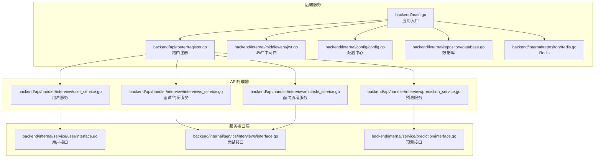
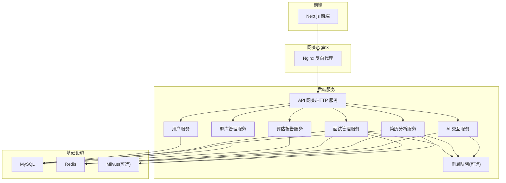
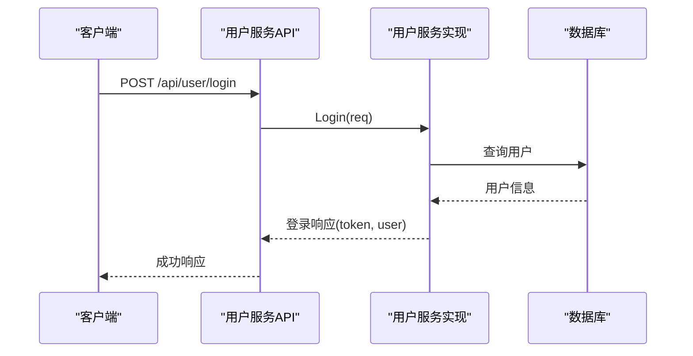
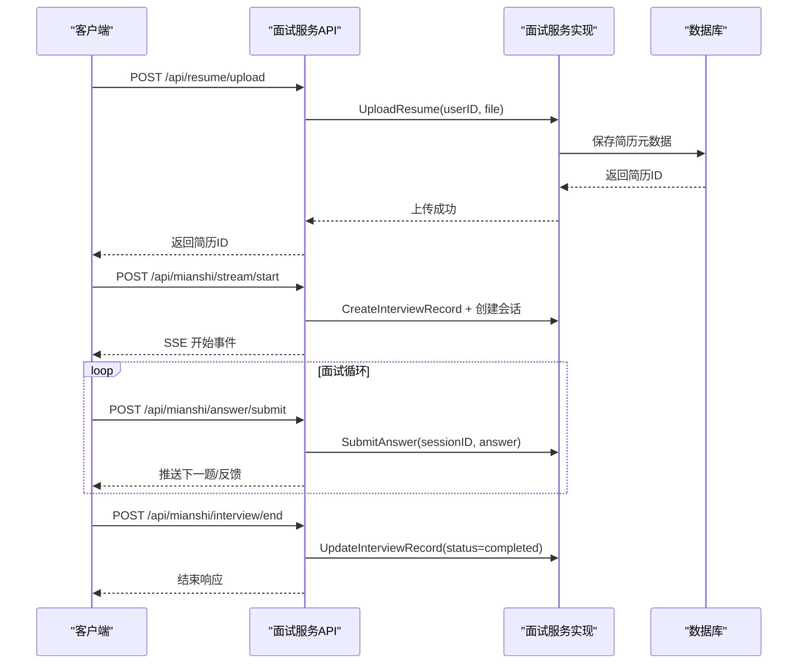
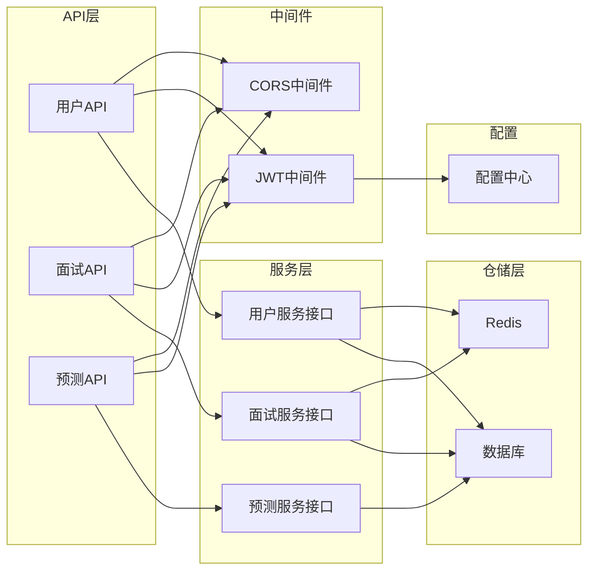

# 微服务架构设计

<cite>
**本文档引用的文件**
- [backend/main.go](file://backend/main.go)
- [backend/chatApp/main.go](file://backend/chatApp/main.go)
- [backend/api/router/register.go](file://backend/api/router/register.go)
- [backend/internal/config/config.go](file://backend/internal/config/config.go)
- [docker-compose.yml](file://docker-compose.yml)
- [backend/api/handler/interview/user_service.go](file://backend/api/handler/interview/user_service.go)
- [backend/api/handler/interview/interviews_service.go](file://backend/api/handler/interview/interviews_service.go)
- [backend/api/handler/interview/mianshi_service.go](file://backend/api/handler/interview/mianshi_service.go)
- [backend/api/handler/interview/prediction_service.go](file://backend/api/handler/interview/prediction_service.go)
- [backend/internal/service/user/interface.go](file://backend/internal/service/user/interface.go)
- [backend/internal/service/interviews/interface.go](file://backend/internal/service/interviews/interface.go)
- [backend/internal/service/prediction/interface.go](file://backend/internal/service/prediction/interface.go)
- [backend/internal/middleware/jwt.go](file://backend/internal/middleware/jwt.go)
- [backend/internal/repository/database.go](file://backend/internal/repository/database.go)
- [backend/internal/repository/redis.go](file://backend/internal/repository/redis.go)
</cite>

## 目录
1. [简介](#简介)
2. [项目结构](#项目结构)
3. [核心组件](#核心组件)
4. [架构总览](#架构总览)
5. [详细组件分析](#详细组件分析)
6. [依赖关系分析](#依赖关系分析)
7. [性能考虑](#性能考虑)
8. [故障排除指南](#故障排除指南)
9. [结论](#结论)
10. [附录](#附录)

## 简介
本设计文档面向“面试吧AI智能面试平台”，基于现有代码库梳理并提出微服务化改造方案。目标包括：
- 明确微服务拆分策略与职责边界
- 详细说明用户服务、面试管理服务、简历分析服务、题库管理服务、AI交互服务、评估报告服务的实现思路
- 设计服务间通信机制、数据共享策略与事务处理方案
- 规划服务发现、负载均衡、熔断等治理策略
- 提供独立部署、版本管理与监控方案
- 总结最佳实践与常见问题解决方案

## 项目结构
当前项目采用单体后端+多模块划分的方式组织，核心入口位于 backend/main.go，API路由通过 Hertz 注册，内部按领域拆分为 user、interviews、prediction 等服务层，并通过 repository 层访问数据库与 Redis。

**图表来源**
- [backend/main.go](file://backend/main.go#L29-L173)
- [backend/api/router/register.go](file://backend/api/router/register.go#L11-L15)
- [backend/internal/middleware/jwt.go](file://backend/internal/middleware/jwt.go#L32-L78)
- [backend/internal/config/config.go](file://backend/internal/config/config.go#L136-L152)
- [backend/internal/repository/database.go](file://backend/internal/repository/database.go#L18-L60)
- [backend/internal/repository/redis.go](file://backend/internal/repository/redis.go#L16-L33)

**章节来源**
- [backend/main.go](file://backend/main.go#L29-L173)
- [backend/api/router/register.go](file://backend/api/router/register.go#L11-L15)

## 核心组件
- 应用入口与配置
  - 应用入口负责加载 .env、读取 config.yaml、展开环境变量、初始化数据库/Redis、启动消息队列消费者、注册路由与中间件。
  - 配置中心支持数据库、Redis、Hertz、安全、OpenAI、Embedding、Milvus、文档分割器等多类配置项。
- 中间件体系
  - JWT 中间件统一鉴权，支持多种 Token 提取方式；提供用户上下文注入能力。
- 仓储层
  - 数据库：GORM + MySQL，自动迁移核心模型。
  - 缓存：Redis 客户端封装，提供通用缓存操作。
- 服务层接口
  - 用户服务：用户注册/登录/资料管理、微信登录、模型配置。
  - 面试服务：面试记录、简历上传/查询/设置默认、答题记录与评估报告。
  - 预测服务：预测请求、历史列表、详情查询。
- API 层
  - 通过 Hertz 路由绑定请求模型，调用服务层接口，返回统一封装的响应。

**章节来源**
- [backend/main.go](file://backend/main.go#L29-L173)
- [backend/internal/config/config.go](file://backend/internal/config/config.go#L136-L269)
- [backend/internal/middleware/jwt.go](file://backend/internal/middleware/jwt.go#L32-L143)
- [backend/internal/repository/database.go](file://backend/internal/repository/database.go#L18-L81)
- [backend/internal/repository/redis.go](file://backend/internal/repository/redis.go#L16-L54)
- [backend/internal/service/user/interface.go](file://backend/internal/service/user/interface.go#L11-L63)
- [backend/internal/service/interviews/interface.go](file://backend/internal/service/interviews/interface.go#L10-L63)
- [backend/internal/service/prediction/interface.go](file://backend/internal/service/prediction/interface.go#L8-L12)

## 架构总览
整体采用“单体后端 + 领域服务”的过渡架构，建议逐步拆分为独立微服务，同时保留现有路由与中间件模式，降低迁移成本。

**图表来源**
- [docker-compose.yml](file://docker-compose.yml#L144-L206)
- [backend/main.go](file://backend/main.go#L101-L128)

## 详细组件分析

### 用户服务（User Service）
职责边界
- 用户注册/登录/登出
- 用户资料查询与更新
- 忘记/重置密码
- 微信登录与回调
- 用户模型配置（默认模型）

实现要点
- API 层：提供 /api/user/* 接口，绑定请求模型，调用服务层。
- 服务层：定义 UserManager/ModelManager 接口，实现用户与模型管理。
- 鉴权：JWT 中间件校验用户身份，注入 user_id 上下文。

**图表来源**
- [backend/api/handler/interview/user_service.go](file://backend/api/handler/interview/user_service.go#L238-L262)
- [backend/internal/service/user/interface.go](file://backend/internal/service/user/interface.go#L54-L63)

**章节来源**
- [backend/api/handler/interview/user_service.go](file://backend/api/handler/interview/user_service.go#L18-L420)
- [backend/internal/service/user/interface.go](file://backend/internal/service/user/interface.go#L11-L63)

### 面试管理服务（Interview Management Service）
职责边界
- 面试记录的创建、查询与更新
- 简历上传、查询、设置默认、更新与删除
- 面试会话管理（SSE 流式交互）
- 答题记录与评估报告生成

实现要点
- API 层：/api/interview/* 与 /api/resume/* 接口，处理文件上传与简历 CRUD。
- 服务层：InterviewManager/ResumeManager 接口，封装面试与简历领域逻辑。
- 会话与流：StartMianshiStream 通过 SSE 推送面试过程，SubmitMianshiAnswer 提交答案，EndMianshi 结束并更新记录。

**图表来源**
- [backend/api/handler/interview/interviews_service.go](file://backend/api/handler/interview/interviews_service.go#L55-L92)
- [backend/api/handler/interview/mianshi_service.go](file://backend/api/handler/interview/mianshi_service.go#L25-L117)
- [backend/internal/service/interviews/interface.go](file://backend/internal/service/interviews/interface.go#L20-L63)

**章节来源**
- [backend/api/handler/interview/interviews_service.go](file://backend/api/handler/interview/interviews_service.go#L26-L391)
- [backend/api/handler/interview/mianshi_service.go](file://backend/api/handler/interview/mianshi_service.go#L25-L409)
- [backend/internal/service/interviews/interface.go](file://backend/internal/service/interviews/interface.go#L10-L118)

### 简历分析服务（Resume Analysis Service）
职责边界
- 简历文件解析与入库
- 简历信息查询与默认简历设置
- 与面试流程联动（简历驱动的题目生成）

实现要点
- 当前实现位于面试服务模块内，后续建议独立为简历服务，提供标准化接口供面试服务调用。
- 可结合向量检索（Milvus）对简历内容进行嵌入与召回，支撑智能推荐题目。

**章节来源**
- [backend/api/handler/interview/interviews_service.go](file://backend/api/handler/interview/interviews_service.go#L55-L323)

### 题库管理服务（Question Bank Management Service）
职责边界
- 题目与分类管理
- 题目检索与推荐（结合简历与岗位画像）
- 与面试引擎协作生成题目序列

实现要点
- 建议独立为题库服务，提供题目 CRUD、标签管理、检索接口。
- 可与 Embedding/Milvus 集成，实现语义相似度检索。

**章节来源**
- [backend/internal/service/interviews/interface.go](file://backend/internal/service/interviews/interface.go#L65-L118)

### AI 交互服务（AI Interaction Service）
职责边界
- 对话式面试引擎
- 答案评估与反馈生成
- 与外部大模型（OpenAI/自研）对接

实现要点
- 当前位于 chatApp 目录，建议抽取为独立服务，提供 SSE/REST 接口。
- 支持多 Agent（综合/专项），根据领域动态选择。

**章节来源**
- [backend/chatApp/main.go](file://backend/chatApp/main.go#L25-L123)

### 评估报告服务（Evaluation Report Service）
职责边界
- 面试评估报告聚合
- 答题记录分析与可视化
- 报告持久化与查询

实现要点
- 通过接口层统一对外暴露评估能力，避免与具体 AI 引擎耦合。
- 支持增量生成与缓存命中。

**章节来源**
- [backend/api/handler/interview/mianshi_service.go](file://backend/api/handler/interview/mianshi_service.go#L302-L392)

### 预测服务（Prediction Service）
职责边界
- 预测请求发起与历史查询
- 预测详情展示

实现要点
- API 层绑定请求模型，调用服务层实现预测逻辑。

**章节来源**
- [backend/api/handler/interview/prediction_service.go](file://backend/api/handler/interview/prediction_service.go#L17-L96)
- [backend/internal/service/prediction/interface.go](file://backend/internal/service/prediction/interface.go#L8-L12)

## 依赖关系分析

**图表来源**
- [backend/api/handler/interview/user_service.go](file://backend/api/handler/interview/user_service.go#L18-L420)
- [backend/api/handler/interview/interviews_service.go](file://backend/api/handler/interview/interviews_service.go#L26-L391)
- [backend/api/handler/interview/prediction_service.go](file://backend/api/handler/interview/prediction_service.go#L17-L96)
- [backend/internal/middleware/jwt.go](file://backend/internal/middleware/jwt.go#L32-L78)
- [backend/internal/config/config.go](file://backend/internal/config/config.go#L136-L152)

**章节来源**
- [backend/internal/repository/database.go](file://backend/internal/repository/database.go#L18-L81)
- [backend/internal/repository/redis.go](file://backend/internal/repository/redis.go#L16-L54)
- [backend/internal/middleware/jwt.go](file://backend/internal/middleware/jwt.go#L32-L143)

## 性能考虑
- 连接池与超时
  - 数据库连接池参数（最大空闲/活跃、生命周期）需结合 QPS 调优。
  - Redis 连接超时与池大小需与并发场景匹配。
- 缓存策略
  - 面试会话、用户偏好、默认模型等高频读取数据放入 Redis，设置合理过期策略。
- IO 与并发
  - SSE 流式输出需注意背压与连接超时，必要时引入消息队列缓冲。
- 搜索与向量
  - Milvus 查询超时与 TopK 需平衡准确率与延迟。

[本节为通用指导，无需列出具体文件来源]

## 故障排除指南
- 鉴权失败
  - 检查 Authorization 头部格式与 Token 有效性；确认 JWTSecret 与过期时间配置。
- 数据库连接异常
  - 核对 DSN、连接池参数与网络连通性；查看迁移日志。
- Redis 连接异常
  - 校验地址、密码与网络；确认 Ping 成功。
- SSE 连接中断
  - 检查客户端超时、Nginx 超时配置与服务端取消逻辑。
- 配置未生效
  - 确认 .env 与 config.yaml 加载顺序，以及环境变量展开逻辑。

**章节来源**
- [backend/internal/middleware/jwt.go](file://backend/internal/middleware/jwt.go#L186-L214)
- [backend/internal/repository/database.go](file://backend/internal/repository/database.go#L18-L60)
- [backend/internal/repository/redis.go](file://backend/internal/repository/redis.go#L16-L33)
- [backend/internal/config/config.go](file://backend/internal/config/config.go#L212-L269)

## 结论
- 当前项目具备清晰的领域分层与路由注册机制，适合向微服务演进。
- 建议以“用户服务、面试管理服务、简历分析服务、题库管理服务、AI 交互服务、评估报告服务”为拆分方向，逐步剥离公共能力与依赖。
- 在演进过程中保留现有中间件与路由风格，降低迁移风险。
- 强化配置中心、消息队列、缓存与数据库的治理策略，确保服务间解耦与高可用。

[本节为总结性内容，无需列出具体文件来源]

## 附录

### 微服务拆分策略与职责边界
- 用户服务：用户生命周期、鉴权、模型配置
- 面试管理服务：面试记录、简历管理、会话与流程控制
- 简历分析服务：简历解析、入库、检索与画像
- 题库管理服务：题目管理、标签与检索
- AI 交互服务：对话引擎、评估与反馈
- 评估报告服务：报告聚合与持久化

### 服务间通信机制
- 同步调用：REST/JSON，适用于低延迟、强一致需求
- 异步调用：消息队列（Redis Streams/外部MQ），适用于解耦与削峰

### 数据共享与事务处理
- 单服务内事务：利用 GORM 事务包裹
- 跨服务一致性：采用 Saga/补偿事务或事件驱动最终一致

### 服务治理
- 服务发现：Consul/Eureka 或容器编排自带发现
- 负载均衡：Nginx/Envoy/LB 策略轮询/权重
- 熔断降级：Hystrix/Tengine/Envoy 熔断与快速失败
- 配置中心：Apollo/Consul KV/ConfigMap
- 日志与链路追踪：OpenTelemetry/Jaeger/ELK

### 独立部署与版本管理
- 容器化：Dockerfile + docker-compose
- CI/CD：流水线自动化构建、镜像推送、滚动发布
- 版本策略：语义化版本、灰度发布、回滚策略

### 监控方案
- 指标：QPS、P95/P99、错误率、资源使用率
- 日志：结构化日志、集中采集
- 链路：分布式追踪、告警规则

**章节来源**
- [docker-compose.yml](file://docker-compose.yml#L1-L226)