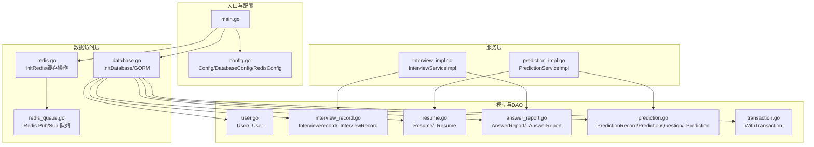
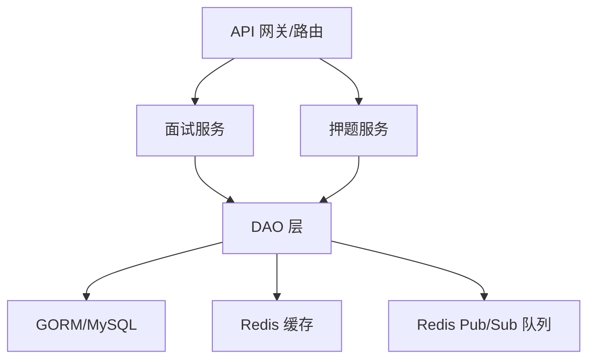
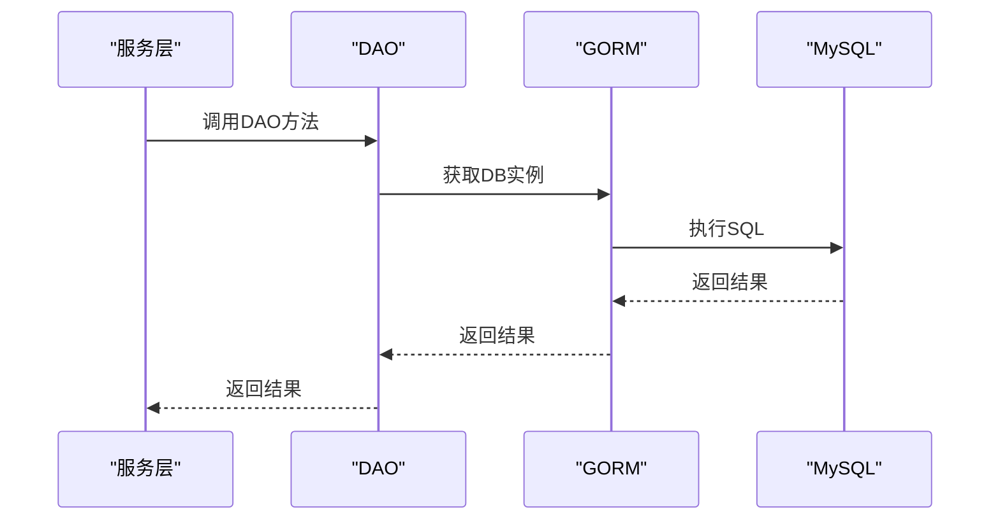
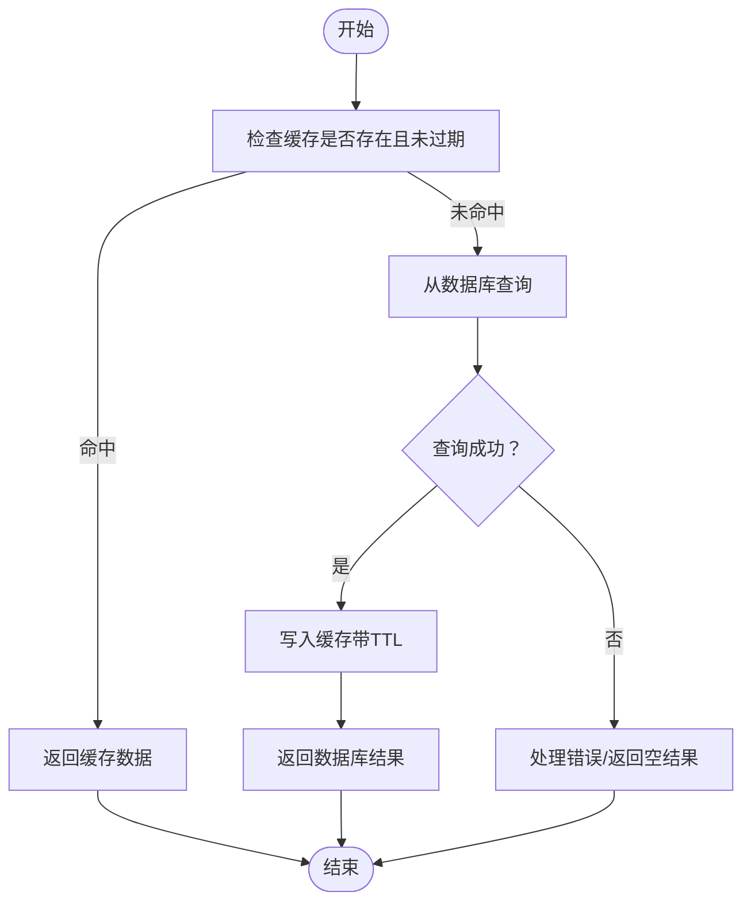
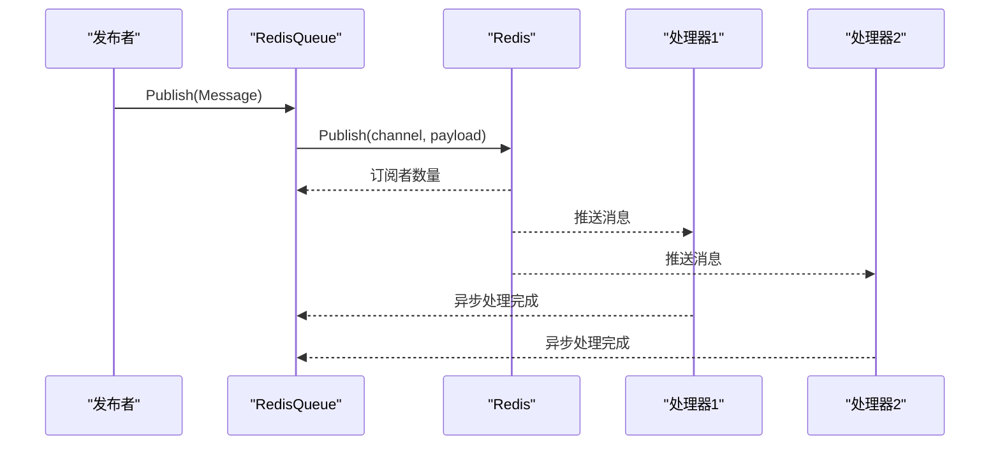
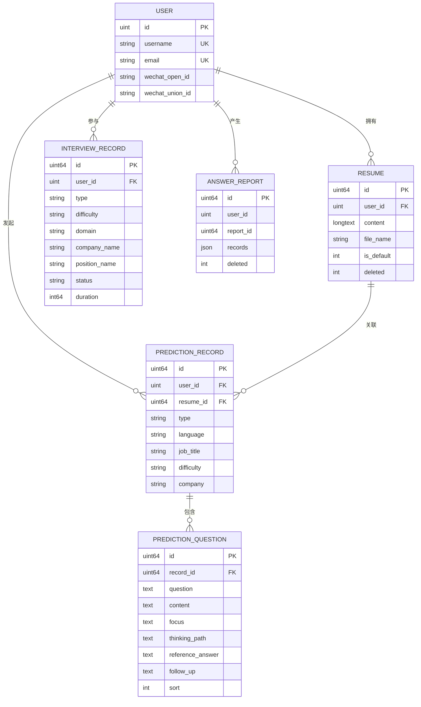
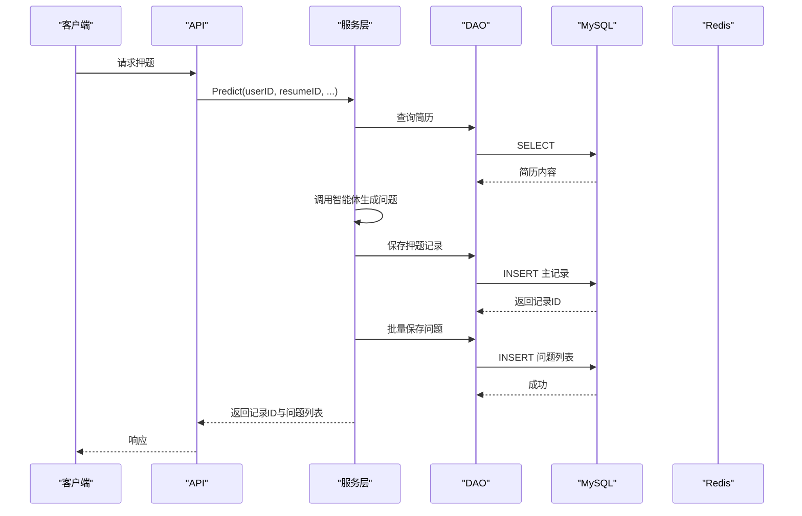
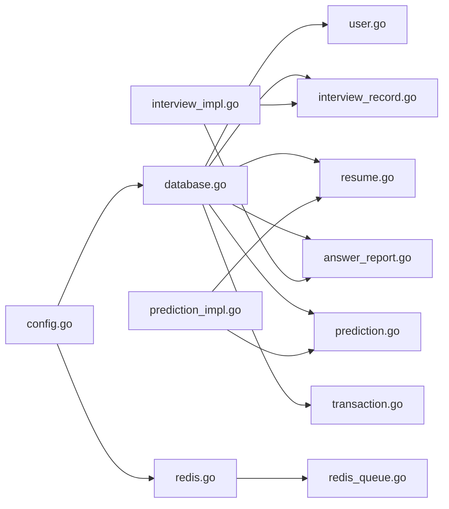

# 数据共享策略

<cite>
**本文引用的文件**
- [backend/internal/repository/database.go](file://backend/internal/repository/database.go)
- [backend/internal/repository/redis.go](file://backend/internal/repository/redis.go)
- [backend/internal/config/config.go](file://backend/internal/config/config.go)
- [backend/internal/model/user.go](file://backend/internal/model/user.go)
- [backend/internal/model/interview_record.go](file://backend/internal/model/interview_record.go)
- [backend/internal/model/resume.go](file://backend/internal/model/resume.go)
- [backend/internal/model/answer_report.go](file://backend/internal/model/answer_report.go)
- [backend/internal/model/prediction.go](file://backend/internal/model/prediction.go)
- [backend/internal/model/transaction.go](file://backend/internal/model/transaction.go)
- [backend/internal/mq/redis_queue.go](file://backend/internal/mq/redis_queue.go)
- [backend/internal/service/interviews/impl/interview_impl.go](file://backend/internal/service/interviews/impl/interview_impl.go)
- [backend/internal/service/prediction/impl/prediction_impl.go](file://backend/internal/service/prediction/impl/prediction_impl.go)
- [backend/main.go](file://backend/main.go)
- [doc/项目优化建议_架构篇.md](file://doc/项目优化建议_架构篇.md)
- [doc/项目优化建议_性能安全篇.md](file://doc/项目优化建议_性能安全篇.md)
</cite>

## 目录
1. [简介](#简介)
2. [项目结构](#项目结构)
3. [核心组件](#核心组件)
4. [架构总览](#架构总览)
5. [详细组件分析](#详细组件分析)
6. [依赖分析](#依赖分析)
7. [性能考量](#性能考量)
8. [故障排查指南](#故障排查指南)
9. [结论](#结论)
10. [附录](#附录)

## 简介
本文件面向“面试吧AI智能面试平台”，在微服务架构下制定数据共享策略，涵盖数据库与缓存的设计原则、数据分片与复制策略、一致性保障、数据同步机制（最终一致与强一致）、以及数据访问模式与ORM最佳实践（GORM）。文档同时结合当前仓库的数据库初始化、DAO层模型、Redis缓存与消息队列实现，给出可落地的策略与改进建议。

## 项目结构
后端采用分层架构：入口与配置 -> 服务层 -> DAO模型层 -> 数据库/缓存/消息中间件。数据库通过GORM初始化并自动迁移；Redis提供缓存与消息通道；消息队列基于Redis Pub/Sub实现；服务层负责业务编排与数据落库。

图示来源
- [backend/main.go](file://backend/main.go#L1-L200)
- [backend/internal/config/config.go](file://backend/internal/config/config.go#L13-L83)
- [backend/internal/repository/database.go](file://backend/internal/repository/database.go#L18-L81)
- [backend/internal/repository/redis.go](file://backend/internal/repository/redis.go#L16-L54)
- [backend/internal/mq/redis_queue.go](file://backend/internal/mq/redis_queue.go#L13-L132)
- [backend/internal/model/user.go](file://backend/internal/model/user.go#L11-L116)
- [backend/internal/model/interview_record.go](file://backend/internal/model/interview_record.go#L9-L128)
- [backend/internal/model/resume.go](file://backend/internal/model/resume.go#L9-L170)
- [backend/internal/model/answer_report.go](file://backend/internal/model/answer_report.go#L9-L121)
- [backend/internal/model/prediction.go](file://backend/internal/model/prediction.go#L11-L110)
- [backend/internal/model/transaction.go](file://backend/internal/model/transaction.go#L11-L59)
- [backend/internal/service/interviews/impl/interview_impl.go](file://backend/internal/service/interviews/impl/interview_impl.go#L19-L240)
- [backend/internal/service/prediction/impl/prediction_impl.go](file://backend/internal/service/prediction/impl/prediction_impl.go#L25-L293)

章节来源
- [backend/main.go](file://backend/main.go#L1-L200)
- [backend/internal/config/config.go](file://backend/internal/config/config.go#L13-L83)

## 核心组件
- 数据库与ORM（GORM）
  - 初始化与连接池配置、自动迁移、全局DB获取函数、事务封装。
- 缓存（Redis）
  - 连接初始化、缓存读写删除、键空间设计。
- 消息队列（Redis Pub/Sub）
  - 按消息类型路由到不同频道，异步分发处理。
- 模型与DAO
  - 用户、面试记录、简历、答题报告、押题记录与问题等模型及DAO方法。
- 服务层
  - 面试服务与押题服务，负责业务编排与数据持久化。

章节来源
- [backend/internal/repository/database.go](file://backend/internal/repository/database.go#L18-L81)
- [backend/internal/repository/redis.go](file://backend/internal/repository/redis.go#L16-L54)
- [backend/internal/mq/redis_queue.go](file://backend/internal/mq/redis_queue.go#L13-L132)
- [backend/internal/model/user.go](file://backend/internal/model/user.go#L11-L116)
- [backend/internal/model/interview_record.go](file://backend/internal/model/interview_record.go#L9-L128)
- [backend/internal/model/resume.go](file://backend/internal/model/resume.go#L9-L170)
- [backend/internal/model/answer_report.go](file://backend/internal/model/answer_report.go#L9-L121)
- [backend/internal/model/prediction.go](file://backend/internal/model/prediction.go#L11-L110)
- [backend/internal/model/transaction.go](file://backend/internal/model/transaction.go#L11-L59)
- [backend/internal/service/interviews/impl/interview_impl.go](file://backend/internal/service/interviews/impl/interview_impl.go#L19-L240)
- [backend/internal/service/prediction/impl/prediction_impl.go](file://backend/internal/service/prediction/impl/prediction_impl.go#L25-L293)

## 架构总览
平台当前为单体架构，未来具备向微服务演进的模块化基础。数据面采用关系型数据库（MySQL）+ 缓存（Redis）+ 消息通道（Redis Pub/Sub）的组合，服务层通过DAO与事务封装实现数据一致性与可维护性。

图示来源
- [backend/internal/service/interviews/impl/interview_impl.go](file://backend/internal/service/interviews/impl/interview_impl.go#L19-L240)
- [backend/internal/service/prediction/impl/prediction_impl.go](file://backend/internal/service/prediction/impl/prediction_impl.go#L25-L293)
- [backend/internal/repository/database.go](file://backend/internal/repository/database.go#L18-L81)
- [backend/internal/repository/redis.go](file://backend/internal/repository/redis.go#L16-L54)
- [backend/internal/mq/redis_queue.go](file://backend/internal/mq/redis_queue.go#L13-L132)

## 详细组件分析

### 数据库与ORM（GORM）设计
- 初始化与连接池
  - 通过配置加载DSN与连接池参数，设置最大空闲/活跃连接数与生命周期。
- 自动迁移
  - 启动时对用户、面试记录、对话、评估、答题报告、简历、押题记录与问题等模型进行迁移。
- 全局DB获取
  - 通过模型层的DB getter统一获取数据库实例，DAO方法在调用前需确保已设置getter。
- 事务封装
  - WithTransaction提供统一的事务入口，自动Begin/Commit/Rollback，并兜底panic，保证一致性与可观测性。

图示来源
- [backend/internal/repository/database.go](file://backend/internal/repository/database.go#L18-L81)
- [backend/internal/model/transaction.go](file://backend/internal/model/transaction.go#L11-L59)
- [backend/internal/model/user.go](file://backend/internal/model/user.go#L35-L116)
- [backend/internal/model/interview_record.go](file://backend/internal/model/interview_record.go#L33-L128)
- [backend/internal/model/resume.go](file://backend/internal/model/resume.go#L32-L170)
- [backend/internal/model/answer_report.go](file://backend/internal/model/answer_report.go#L56-L121)
- [backend/internal/model/prediction.go](file://backend/internal/model/prediction.go#L51-L110)

章节来源
- [backend/internal/repository/database.go](file://backend/internal/repository/database.go#L18-L81)
- [backend/internal/model/transaction.go](file://backend/internal/model/transaction.go#L11-L59)

### 缓存策略（Redis）
- 连接与健康检查
  - 初始化时创建客户端并Ping验证连通性。
- 基本操作
  - 提供Set/Get/Del通用缓存操作，支持过期时间。
- 缓存穿透、击穿、雪崩的建议
  - 穿透：布隆过滤器或空值缓存短TTL。
  - 击穿：热点Key互斥锁或永不过期+异步刷新。
  - 雪崩：随机TTL、分级缓存、本地缓存+远程缓存双写。

图示来源
- [backend/internal/repository/redis.go](file://backend/internal/repository/redis.go#L16-L54)
- [doc/项目优化建议_性能安全篇.md](file://doc/项目优化建议_性能安全篇.md#L112-L223)

章节来源
- [backend/internal/repository/redis.go](file://backend/internal/repository/redis.go#L16-L54)
- [doc/项目优化建议_性能安全篇.md](file://doc/项目优化建议_性能安全篇.md#L112-L223)

### 消息队列（Redis Pub/Sub）
- 设计
  - 按消息类型路由到不同channel，订阅端聚合处理。
- 发布/订阅
  - 发布时序列化消息，订阅时反序列化并异步分发给注册的处理器。
- 适用场景
  - 面试评估报告与话题评估的异步通知与处理。

图示来源
- [backend/internal/mq/redis_queue.go](file://backend/internal/mq/redis_queue.go#L32-L119)

章节来源
- [backend/internal/mq/redis_queue.go](file://backend/internal/mq/redis_queue.go#L13-L132)

### 数据模型与DAO（用户、面试、简历、答题报告、押题）
- 用户模型
  - 唯一索引用户名/邮箱，支持微信OpenID/UnionID，提供多种查询与更新方法。
- 面试记录
  - 主键自增，按用户ID分页查询，支持增量更新。
- 简历
  - 软删除、默认简历切换、分页统计与查询。
- 答题报告
  - JSON字段存储答题明细，软删除与按用户/报告ID查询。
- 押题记录与问题
  - 主从关系，预加载问题并按排序字段排序，批量插入问题。

图示来源
- [backend/internal/model/user.go](file://backend/internal/model/user.go#L11-L116)
- [backend/internal/model/resume.go](file://backend/internal/model/resume.go#L9-L170)
- [backend/internal/model/interview_record.go](file://backend/internal/model/interview_record.go#L9-L128)
- [backend/internal/model/answer_report.go](file://backend/internal/model/answer_report.go#L9-L121)
- [backend/internal/model/prediction.go](file://backend/internal/model/prediction.go#L11-L110)

章节来源
- [backend/internal/model/user.go](file://backend/internal/model/user.go#L11-L116)
- [backend/internal/model/interview_record.go](file://backend/internal/model/interview_record.go#L9-L128)
- [backend/internal/model/resume.go](file://backend/internal/model/resume.go#L9-L170)
- [backend/internal/model/answer_report.go](file://backend/internal/model/answer_report.go#L9-L121)
- [backend/internal/model/prediction.go](file://backend/internal/model/prediction.go#L11-L110)

### 服务层数据流程（面试与押题）
- 面试服务
  - 创建/更新面试记录、分页查询、保存对话（主问题与追问）、获取评估与答题报告。
- 押题服务
  - 读取简历内容，构造提示词，调用智能体生成押题，分步保存主记录与问题列表，返回结果。

图示来源
- [backend/internal/service/prediction/impl/prediction_impl.go](file://backend/internal/service/prediction/impl/prediction_impl.go#L25-L211)
- [backend/internal/model/resume.go](file://backend/internal/model/resume.go#L32-L85)
- [backend/internal/model/prediction.go](file://backend/internal/model/prediction.go#L51-L110)

章节来源
- [backend/internal/service/interviews/impl/interview_impl.go](file://backend/internal/service/interviews/impl/interview_impl.go#L19-L240)
- [backend/internal/service/prediction/impl/prediction_impl.go](file://backend/internal/service/prediction/impl/prediction_impl.go#L25-L293)

## 依赖分析
- 组件耦合
  - DAO层依赖GORM与全局DB getter；服务层依赖DAO；入口依赖配置与初始化。
- 外部依赖
  - MySQL驱动、Redis客户端、消息队列Pub/Sub。
- 可能的循环依赖
  - 当前结构清晰，DAO与服务层通过接口化与依赖注入可进一步弱化耦合。

图示来源
- [backend/internal/config/config.go](file://backend/internal/config/config.go#L13-L83)
- [backend/internal/repository/database.go](file://backend/internal/repository/database.go#L18-L81)
- [backend/internal/repository/redis.go](file://backend/internal/repository/redis.go#L16-L54)
- [backend/internal/mq/redis_queue.go](file://backend/internal/mq/redis_queue.go#L13-L132)
- [backend/internal/model/user.go](file://backend/internal/model/user.go#L11-L116)
- [backend/internal/model/interview_record.go](file://backend/internal/model/interview_record.go#L9-L128)
- [backend/internal/model/resume.go](file://backend/internal/model/resume.go#L9-L170)
- [backend/internal/model/answer_report.go](file://backend/internal/model/answer_report.go#L9-L121)
- [backend/internal/model/prediction.go](file://backend/internal/model/prediction.go#L11-L110)
- [backend/internal/model/transaction.go](file://backend/internal/model/transaction.go#L11-L59)
- [backend/internal/service/interviews/impl/interview_impl.go](file://backend/internal/service/interviews/impl/interview_impl.go#L19-L240)
- [backend/internal/service/prediction/impl/prediction_impl.go](file://backend/internal/service/prediction/impl/prediction_impl.go#L25-L293)

章节来源
- [backend/internal/config/config.go](file://backend/internal/config/config.go#L13-L83)
- [backend/internal/repository/database.go](file://backend/internal/repository/database.go#L18-L81)
- [backend/internal/repository/redis.go](file://backend/internal/repository/redis.go#L16-L54)
- [backend/internal/mq/redis_queue.go](file://backend/internal/mq/redis_queue.go#L13-L132)

## 性能考量
- 数据库
  - 合理设置连接池参数，避免过度连接；为高频查询建立合适索引；使用事务封装批量写入。
- 缓存
  - 热点数据短TTL+互斥锁；空值缓存；避免Big Key；使用随机TTL缓解雪崩。
- 消息队列
  - 控制消息体大小，避免阻塞；订阅端异步处理；必要时引入持久化消息中间件（如Kafka）提升可靠性。
- 微服务演进
  - 保持模块化与接口化，逐步拆分服务，引入API网关与配置中心。

章节来源
- [doc/项目优化建议_架构篇.md](file://doc/项目优化建议_架构篇.md#L133-L162)
- [doc/项目优化建议_性能安全篇.md](file://doc/项目优化建议_性能安全篇.md#L112-L223)

## 故障排查指南
- 数据库
  - 检查DSN与连接池配置；确认自动迁移是否成功；使用事务封装定位写入异常。
- 缓存
  - 校验Redis连接与Ping；确认键空间与TTL；排查空值缓存与布隆过滤器。
- 消息队列
  - 查看订阅通道与消息反序列化；确认处理器返回错误日志；必要时增加重试与死信队列。
- 服务层
  - 捕获panic并记录；核对DAO方法是否正确设置DB getter；检查DTO转换与字段映射。

章节来源
- [backend/internal/repository/database.go](file://backend/internal/repository/database.go#L18-L81)
- [backend/internal/repository/redis.go](file://backend/internal/repository/redis.go#L16-L54)
- [backend/internal/mq/redis_queue.go](file://backend/internal/mq/redis_queue.go#L58-L119)
- [backend/internal/model/transaction.go](file://backend/internal/model/transaction.go#L11-L59)

## 结论
平台当前以单体架构运行，数据库与缓存均采用成熟方案，服务层通过DAO与事务封装实现了较好的数据一致性与可维护性。建议在保持模块化与接口化的前提下，逐步引入微服务拆分与更完善的缓存治理策略（穿透、击穿、雪崩防护），并在需要强一致性的场景引入分布式事务或补偿机制，以支撑业务持续增长。

## 附录

### 数据库设计原则（单体 vs 分布式）
- 单体数据库
  - 优点：简单、强一致、运维成本低；缺点：扩展性受限。
- 分布式数据库
  - 优点：水平扩展、高可用；缺点：一致性与运维复杂度上升。
- 选择标准
  - 业务稳定性、团队规模、数据一致性与扩展需求、运维能力与成本。

章节来源
- [doc/项目优化建议_架构篇.md](file://doc/项目优化建议_架构篇.md#L133-L162)

### 数据同步策略
- 最终一致性
  - 适用于读多写少、允许短暂不一致的场景（如推荐、日志）。
- 强一致性
  - 适用于交易、账单等关键数据，可通过分布式事务或两阶段提交保障。
- 幂等与补偿
  - 对外发布/写入需保证幂等；失败时引入补偿任务。

章节来源
- [backend/internal/mq/redis_queue.go](file://backend/internal/mq/redis_queue.go#L32-L119)
- [backend/internal/model/transaction.go](file://backend/internal/model/transaction.go#L11-L59)

### 数据访问模式与ORM最佳实践（GORM）
- 配置
  - 日志级别、连接池参数、DSN与迁移。
- DAO
  - 统一DB getter；按需预加载；分页与条件查询；软删除与排序。
- 事务
  - WithTransaction封装Begin/Commit/Rollback与panic兜底。
- 建议
  - 严格字段映射；避免N+1查询；批量写入；索引与查询计划优化。

章节来源
- [backend/internal/repository/database.go](file://backend/internal/repository/database.go#L18-L81)
- [backend/internal/model/user.go](file://backend/internal/model/user.go#L35-L116)
- [backend/internal/model/interview_record.go](file://backend/internal/model/interview_record.go#L57-L128)
- [backend/internal/model/resume.go](file://backend/internal/model/resume.go#L56-L170)
- [backend/internal/model/answer_report.go](file://backend/internal/model/answer_report.go#L56-L121)
- [backend/internal/model/prediction.go](file://backend/internal/model/prediction.go#L86-L110)
- [backend/internal/model/transaction.go](file://backend/internal/model/transaction.go#L11-L59)