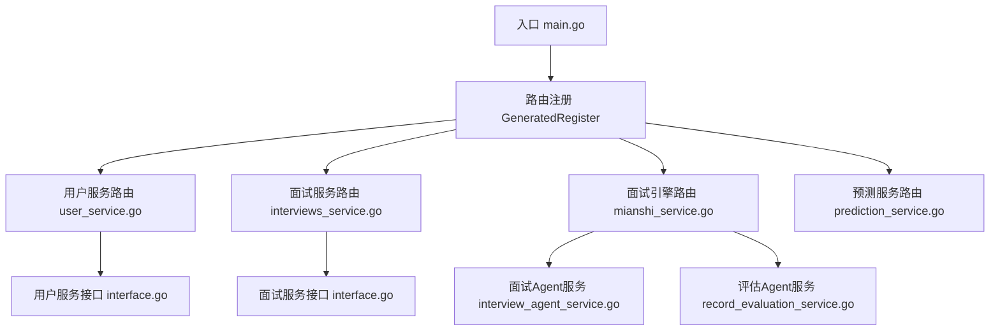
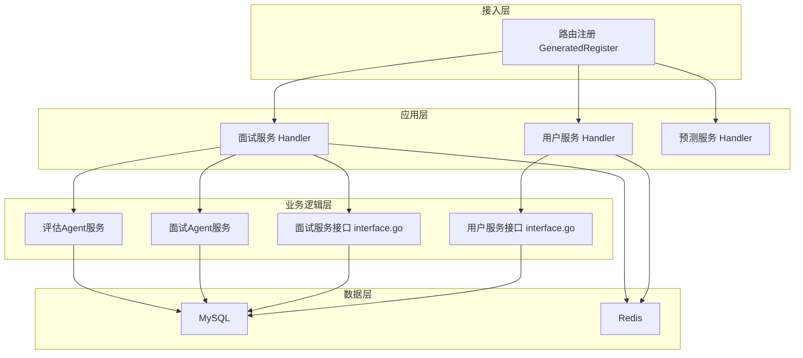
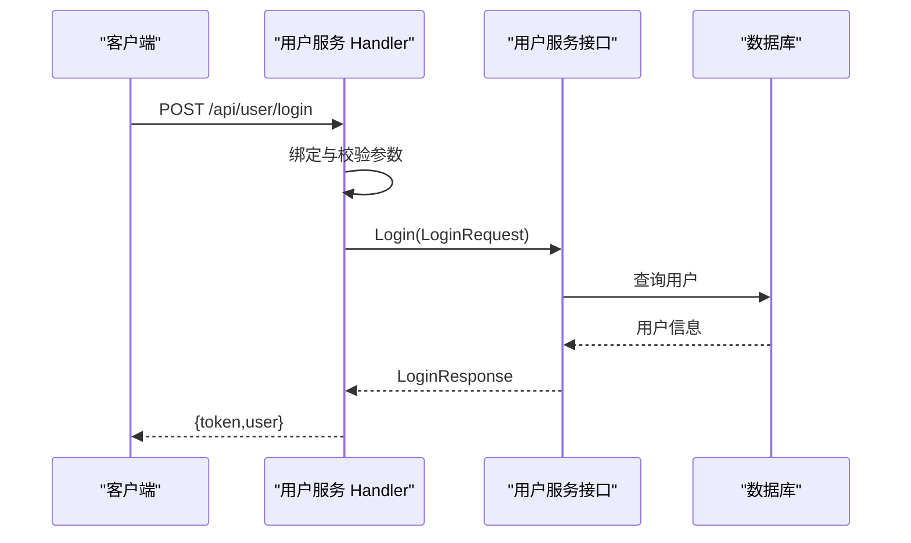
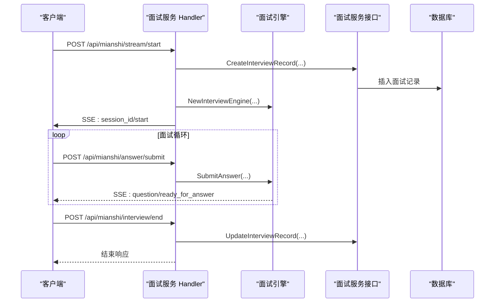
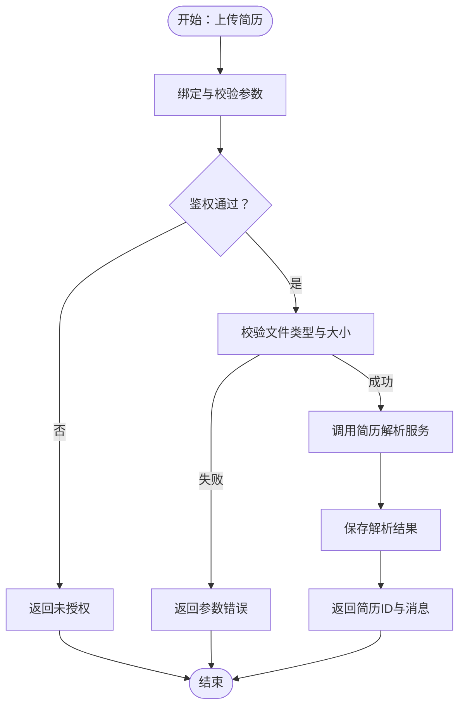
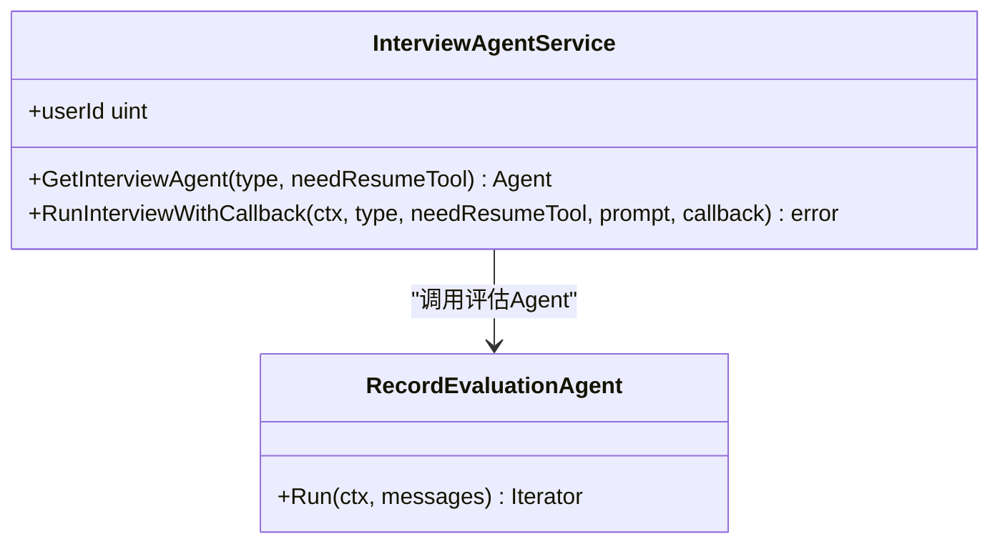
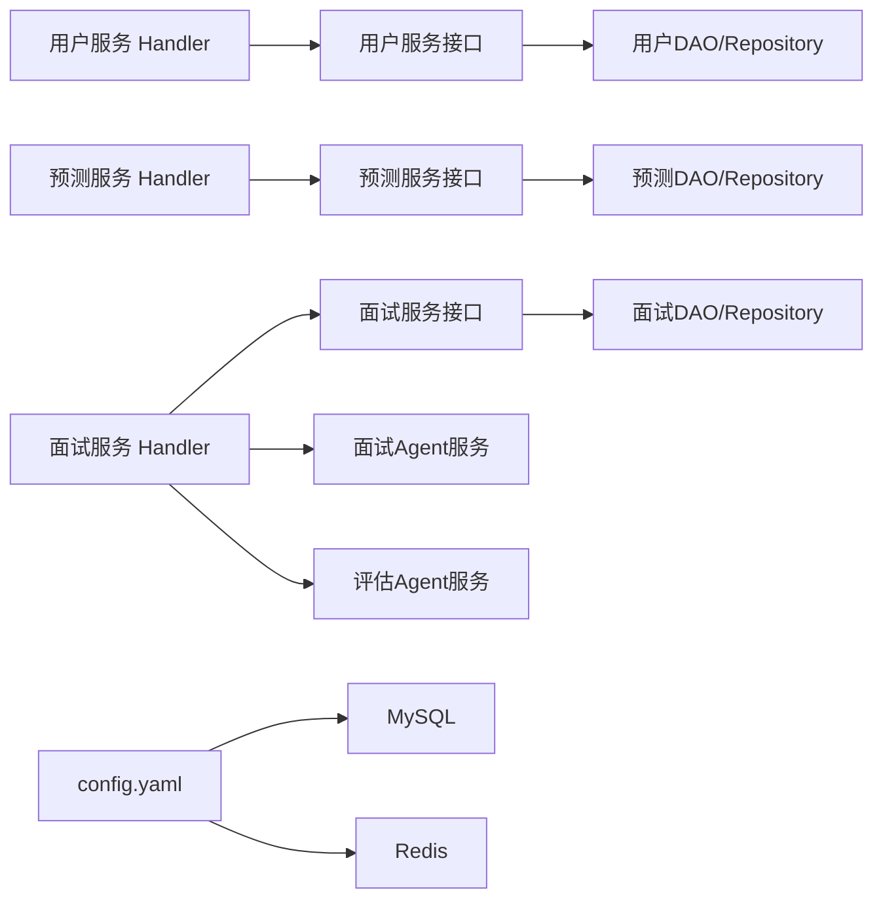

# 服务拆分策略

<cite>
**本文引用的文件**
- [backend/main.go](file://backend/main.go)
- [backend/api/router/register.go](file://backend/api/router/register.go)
- [backend/api/handler/interview/user_service.go](file://backend/api/handler/interview/user_service.go)
- [backend/api/handler/interview/interviews_service.go](file://backend/api/handler/interview/interviews_service.go)
- [backend/api/handler/interview/mianshi_service.go](file://backend/api/handler/interview/mianshi_service.go)
- [backend/api/handler/interview/prediction_service.go](file://backend/api/handler/interview/prediction_service.go)
- [backend/internal/service/user/interface.go](file://backend/internal/service/user/interface.go)
- [backend/internal/service/interviews/interface.go](file://backend/internal/service/interviews/interface.go)
- [backend/chatApp/agent_service/interview/interview_agent_service.go](file://backend/chatApp/agent_service/interview/interview_agent_service.go)
- [backend/chatApp/agent_service/evaluation/record_evaluation_service.go](file://backend/chatApp/agent_service/evaluation/record_evaluation_service.go)
- [backend/idl/user/user.thrift](file://backend/idl/user/user.thrift)
- [backend/idl/interviews/interviews.thrift](file://backend/idl/interviews/interviews.thrift)
- [backend/idl/mianshi/mianshi.thrift](file://backend/idl/mianshi/mianshi.thrift)
- [backend/config.yaml](file://backend/config.yaml)
</cite>

## 目录
1. [简介](#简介)
2. [项目结构](#项目结构)
3. [核心组件](#核心组件)
4. [架构总览](#架构总览)
5. [详细组件分析](#详细组件分析)
6. [依赖关系分析](#依赖关系分析)
7. [性能考量](#性能考量)
8. [故障排查指南](#故障排查指南)
9. [结论](#结论)
10. [附录](#附录)

## 简介
本文件面向“面试吧AI智能面试平台”的微服务拆分与边界设计，结合现有代码结构与IDL定义，提出可落地的服务拆分策略与实施建议。目标是在保证高内聚、低耦合的前提下，合理划分用户服务、面试服务、简历服务、AI服务等核心领域，并给出服务粒度控制原则、边界设计标准、决策流程与评估标准，帮助开发者在实际项目中应用。

## 项目结构
系统采用“入口初始化 + 路由注册 + Handler分层 + Service接口 + ChatApp智能体 + IDL定义”的组织方式：
- 入口层：main.go负责配置加载、中间件装配、路由注册与服务生命周期管理
- 路由层：通过IDL生成的路由注册器集中注册各业务模块路由
- 控制器层：Handler按业务域划分（用户、面试、简历、预测），承担鉴权、参数绑定、响应封装
- 服务层：Service接口定义业务契约，具体实现位于impl包，便于替换与测试
- 智能体层：ChatApp提供面试Agent与评估Agent，支撑AI服务
- 配置层：config.yaml集中管理数据库、缓存、安全、AI服务等配置

**图表来源**
- [backend/main.go](file://backend/main.go#L29-L173)
- [backend/api/router/register.go](file://backend/api/router/register.go#L11-L15)
- [backend/api/handler/interview/user_service.go](file://backend/api/handler/interview/user_service.go#L18-L420)
- [backend/api/handler/interview/interviews_service.go](file://backend/api/handler/interview/interviews_service.go#L26-L391)
- [backend/api/handler/interview/mianshi_service.go](file://backend/api/handler/interview/mianshi_service.go#L25-L409)
- [backend/api/handler/interview/prediction_service.go](file://backend/api/handler/interview/prediction_service.go#L17-L96)
- [backend/internal/service/user/interface.go](file://backend/internal/service/user/interface.go#L21-L63)
- [backend/internal/service/interviews/interface.go](file://backend/internal/service/interviews/interface.go#L20-L117)
- [backend/chatApp/agent_service/interview/interview_agent_service.go](file://backend/chatApp/agent_service/interview/interview_agent_service.go#L30-L155)
- [backend/chatApp/agent_service/evaluation/record_evaluation_service.go](file://backend/chatApp/agent_service/evaluation/record_evaluation_service.go#L17-L183)

**章节来源**
- [backend/main.go](file://backend/main.go#L29-L173)
- [backend/api/router/register.go](file://backend/api/router/register.go#L11-L15)

## 核心组件
- 用户服务：负责用户注册、登录、资料管理、模型配置与密码找回等
- 面试服务：负责面试记录管理、简历上传与管理、SSE面试流、评估与答题记录
- 简历服务：简历上传、解析、默认简历设置、列表与详情查询
- AI服务：面试Agent与评估Agent，支持综合/专项面试与答题记录评估
- 预测服务：预测记录的创建、列表与详情查询（当前接口存在占位）

上述职责划分以Handler与Service接口为边界，配合IDL定义的API契约，形成清晰的领域模型与对外接口。

**章节来源**
- [backend/api/handler/interview/user_service.go](file://backend/api/handler/interview/user_service.go#L18-L420)
- [backend/api/handler/interview/interviews_service.go](file://backend/api/handler/interview/interviews_service.go#L26-L391)
- [backend/api/handler/interview/mianshi_service.go](file://backend/api/handler/interview/mianshi_service.go#L25-L409)
- [backend/api/handler/interview/prediction_service.go](file://backend/api/handler/interview/prediction_service.go#L17-L96)
- [backend/internal/service/user/interface.go](file://backend/internal/service/user/interface.go#L21-L63)
- [backend/internal/service/interviews/interface.go](file://backend/internal/service/interviews/interface.go#L20-L117)
- [backend/chatApp/agent_service/interview/interview_agent_service.go](file://backend/chatApp/agent_service/interview/interview_agent_service.go#L30-L155)
- [backend/chatApp/agent_service/evaluation/record_evaluation_service.go](file://backend/chatApp/agent_service/evaluation/record_evaluation_service.go#L17-L183)

## 架构总览
系统采用分层与模块化结合的架构：
- 入口层：main.go加载配置、初始化数据库/缓存/消息队列，装配中间件并启动HTTP服务
- 路由层：通过IDL生成的路由注册器集中注册各业务模块路由
- 控制器层：Handler按业务域划分，统一鉴权、参数校验与响应封装
- 服务层：Service接口定义业务契约，具体实现位于impl包
- 智能体层：ChatApp提供面试Agent与评估Agent，支撑AI服务
- 配置层：config.yaml集中管理数据库、缓存、安全、AI服务等配置

**图表来源**
- [backend/main.go](file://backend/main.go#L50-L100)
- [backend/api/router/register.go](file://backend/api/router/register.go#L11-L15)
- [backend/internal/service/user/interface.go](file://backend/internal/service/user/interface.go#L11-L19)
- [backend/internal/service/interviews/interface.go](file://backend/internal/service/interviews/interface.go#L10-L18)
- [backend/chatApp/agent_service/interview/interview_agent_service.go](file://backend/chatApp/agent_service/interview/interview_agent_service.go#L30-L155)
- [backend/chatApp/agent_service/evaluation/record_evaluation_service.go](file://backend/chatApp/agent_service/evaluation/record_evaluation_service.go#L17-L183)
- [backend/config.yaml](file://backend/config.yaml#L6-L23)

**章节来源**
- [backend/main.go](file://backend/main.go#L50-L100)
- [backend/config.yaml](file://backend/config.yaml#L6-L23)

## 详细组件分析

### 用户服务（User Service）
- 职责边界：用户认证（注册/登录/微信登录）、资料管理（获取/更新）、模型管理（创建/列表/详情/更新/删除/默认模型检查）、密码找回与重置
- 接口契约：通过IDL定义的UserService服务，统一REST路由映射
- 实现要点：Handler层统一鉴权与参数校验，Service接口解耦具体实现

**图表来源**
- [backend/api/handler/interview/user_service.go](file://backend/api/handler/interview/user_service.go#L238-L262)
- [backend/internal/service/user/interface.go](file://backend/internal/service/user/interface.go#L54-L63)

**章节来源**
- [backend/api/handler/interview/user_service.go](file://backend/api/handler/interview/user_service.go#L18-L420)
- [backend/idl/user/user.thrift](file://backend/idl/user/user.thrift#L218-L315)
- [backend/internal/service/user/interface.go](file://backend/internal/service/user/interface.go#L11-L19)

### 面试服务（Interviews Service）
- 职责边界：面试记录管理（列表/详情）、简历上传/解析/默认设置/列表/详情/更新/删除、SSE面试流（启动/提交答案/获取会话/结束）
- 接口契约：通过IDL定义的InterviewsService与MianshiService服务，统一REST路由映射
- 实现要点：Handler层统一鉴权与参数校验，Service接口解耦具体实现；SSE流式响应由Handler直接构造

**图表来源**
- [backend/api/handler/interview/mianshi_service.go](file://backend/api/handler/interview/mianshi_service.go#L25-L117)
- [backend/api/handler/interview/mianshi_service.go](file://backend/api/handler/interview/mianshi_service.go#L119-L300)
- [backend/internal/service/interviews/interface.go](file://backend/internal/service/interviews/interface.go#L20-L63)

**章节来源**
- [backend/api/handler/interview/interviews_service.go](file://backend/api/handler/interview/interviews_service.go#L26-L391)
- [backend/api/handler/interview/mianshi_service.go](file://backend/api/handler/interview/mianshi_service.go#L25-L409)
- [backend/idl/interviews/interviews.thrift](file://backend/idl/interviews/interviews.thrift#L258-L317)
- [backend/idl/mianshi/mianshi.thrift](file://backend/idl/mianshi/mianshi.thrift#L230-L282)
- [backend/internal/service/interviews/interface.go](file://backend/internal/service/interviews/interface.go#L10-L18)

### 简历服务（Resume Service）
- 职责边界：简历上传（PDF限制与大小限制）、解析与入库、默认简历设置、列表与详情查询、更新与删除
- 实现要点：Handler层统一鉴权与参数校验，Service接口解耦具体实现；简历解析通过ChatApp服务完成

**图表来源**
- [backend/api/handler/interview/interviews_service.go](file://backend/api/handler/interview/interviews_service.go#L55-L92)
- [backend/api/handler/interview/interviews_service.go](file://backend/api/handler/interview/interviews_service.go#L94-L162)

**章节来源**
- [backend/api/handler/interview/interviews_service.go](file://backend/api/handler/interview/interviews_service.go#L55-L92)
- [backend/api/handler/interview/interviews_service.go](file://backend/api/handler/interview/interviews_service.go#L94-L162)

### AI服务（Agent Service）
- 职责边界：面试Agent与评估Agent的创建与运行，支持综合/专项面试类型，答题记录评估
- 实现要点：InterviewAgentService按类型返回对应Agent；评估Agent通过工具获取面试记录并生成评估

**图表来源**
- [backend/chatApp/agent_service/interview/interview_agent_service.go](file://backend/chatApp/agent_service/interview/interview_agent_service.go#L30-L155)
- [backend/chatApp/agent_service/evaluation/record_evaluation_service.go](file://backend/chatApp/agent_service/evaluation/record_evaluation_service.go#L17-L183)

**章节来源**
- [backend/chatApp/agent_service/interview/interview_agent_service.go](file://backend/chatApp/agent_service/interview/interview_agent_service.go#L30-L155)
- [backend/chatApp/agent_service/evaluation/record_evaluation_service.go](file://backend/chatApp/agent_service/evaluation/record_evaluation_service.go#L17-L183)

### 预测服务（Prediction Service）
- 职责边界：预测记录的创建、列表与详情查询（当前接口存在占位）
- 实现要点：Handler层统一鉴权与参数校验，Service接口解耦具体实现

**章节来源**
- [backend/api/handler/interview/prediction_service.go](file://backend/api/handler/interview/prediction_service.go#L17-L96)

## 依赖关系分析
- Handler依赖Service接口，Service接口依赖Repository/DAO层，DAO层依赖数据库
- ChatApp智能体层通过Runner与Agent交互，生成评估并持久化
- 配置层通过config.yaml集中管理数据库、缓存、安全、AI服务等配置

**图表来源**
- [backend/internal/service/user/interface.go](file://backend/internal/service/user/interface.go#L11-L19)
- [backend/internal/service/interviews/interface.go](file://backend/internal/service/interviews/interface.go#L10-L18)
- [backend/config.yaml](file://backend/config.yaml#L6-L23)

**章节来源**
- [backend/internal/service/user/interface.go](file://backend/internal/service/user/interface.go#L11-L19)
- [backend/internal/service/interviews/interface.go](file://backend/internal/service/interviews/interface.go#L10-L18)
- [backend/config.yaml](file://backend/config.yaml#L6-L23)

## 性能考量
- 连接池与超时：数据库与缓存连接池参数、Hertz读写超时、JWT过期时间等
- SSE流式响应：面试流式输出需注意背压与取消机制
- AI服务超时：评估Agent设置超时，避免阻塞请求
- 缓存与队列：Redis作为消息队列与缓存，需关注容量与淘汰策略

**章节来源**
- [backend/config.yaml](file://backend/config.yaml#L6-L31)
- [backend/chatApp/agent_service/evaluation/record_evaluation_service.go](file://backend/chatApp/agent_service/evaluation/record_evaluation_service.go#L20-L22)

## 故障排查指南
- 配置加载失败：检查config.yaml路径与环境变量展开
- 数据库/缓存初始化失败：检查DSN与连接参数
- JWT鉴权失败：检查JWT密钥与过期时间
- SSE连接异常：检查SSE响应头与取消函数
- AI服务超时：检查Agent超时与日志

**章节来源**
- [backend/main.go](file://backend/main.go#L38-L56)
- [backend/main.go](file://backend/main.go#L101-L128)
- [backend/chatApp/agent_service/evaluation/record_evaluation_service.go](file://backend/chatApp/agent_service/evaluation/record_evaluation_service.go#L71-L76)

## 结论
本策略以“按业务域划分、单一职责、高内聚低耦合”为核心原则，结合现有Handler与Service接口、IDL定义与ChatApp智能体，形成清晰的服务边界与协作关系。建议在后续演进中：
- 逐步将核心服务拆分为独立进程/容器，通过API网关统一接入
- 引入事件驱动与消息队列，解耦实时性与可靠性需求
- 建立完善的监控与可观测性体系，覆盖日志、指标与链路追踪
- 以领域驱动设计（DDD）指导服务边界与聚合划分

## 附录

### 服务拆分设计原则
- 单一职责：每个服务聚焦一个业务域，避免“万能服务”
- 高内聚：服务内部紧密协作，减少跨服务调用
- 低耦合：通过IDL定义契约，降低实现耦合
- 数据自治：每个服务拥有独立的数据存储，避免共享事务
- 可观测性：内置日志、指标与链路追踪
- 安全性：统一鉴权与审计，敏感数据加密

### 服务粒度控制原则
- 避免过度拆分：同一业务域内的紧密协作功能应合并，减少网络开销
- 避免合并不当：跨业务域的强耦合应拆分，提升独立演进能力
- 以业务价值为导向：优先拆分影响面广、变更频繁的模块
- 以技术风险为导向：复杂度高、依赖多的服务优先拆分

### 服务边界设计标准
- 以领域模型为依据：围绕实体与聚合根划分服务
- 以接口契约为准绳：通过IDL定义清晰的对外接口
- 以数据一致性为约束：避免跨服务强一致事务
- 以演进路径为参考：先内聚再解耦，循序渐进

### 服务拆分决策流程
1. 识别业务域与核心实体
2. 评估服务内聚度与耦合度
3. 定义服务边界与接口契约
4. 评估技术与运维成本
5. 制定演进路线图与迁移策略
6. 持续评估与优化