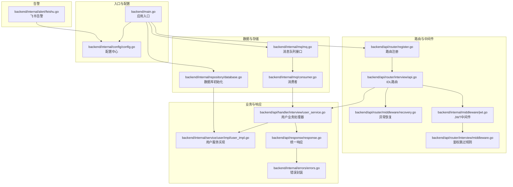
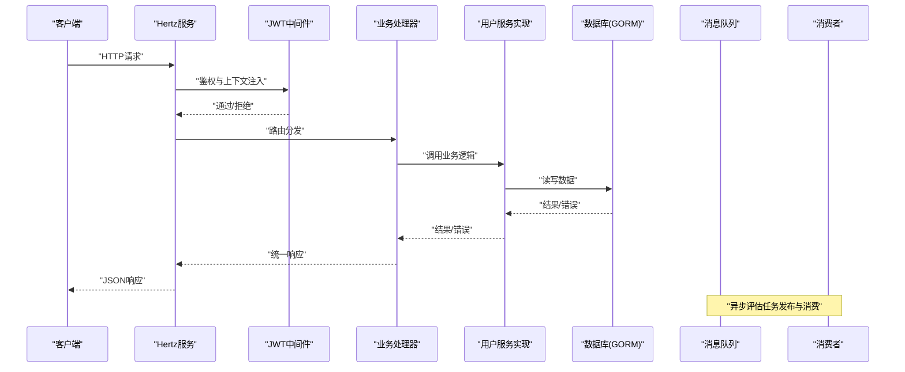
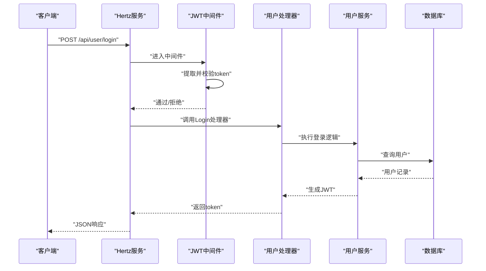
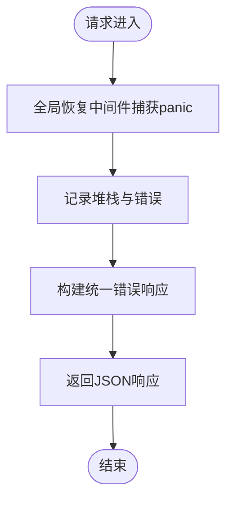
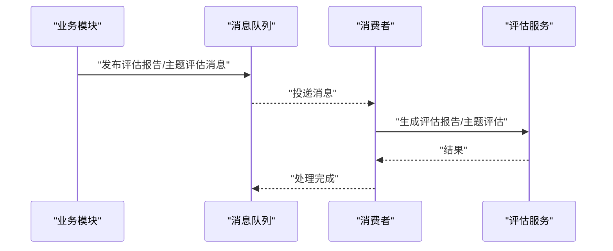
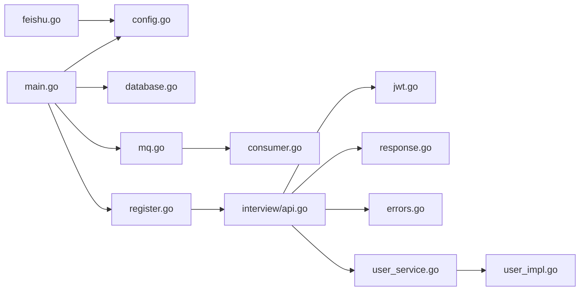

# 服务治理

<cite>
**本文引用的文件**
- [backend/main.go](file://backend/main.go)
- [backend/api/router/register.go](file://backend/api/router/register.go)
- [backend/api/router/interview/api.go](file://backend/api/router/interview/api.go)
- [backend/api/router/interview/middleware.go](file://backend/api/router/interview/middleware.go)
- [backend/internal/middleware/jwt.go](file://backend/internal/middleware/jwt.go)
- [backend/api/router/middleware/recovery.go](file://backend/api/router/middleware/recovery.go)
- [backend/internal/config/config.go](file://backend/internal/config/config.go)
- [backend/internal/repository/database.go](file://backend/internal/repository/database.go)
- [backend/internal/mq/mq.go](file://backend/internal/mq/mq.go)
- [backend/internal/mq/consumer.go](file://backend/internal/mq/consumer.go)
- [backend/internal/alert/feishu.go](file://backend/internal/alert/feishu.go)
- [backend/api/response/response.go](file://backend/api/response/response.go)
- [backend/internal/errors/errors.go](file://backend/internal/errors/errors.go)
- [backend/api/handler/interview/user_service.go](file://backend/api/handler/interview/user_service.go)
- [backend/internal/service/user/impl/user_impl.go](file://backend/internal/service/user/impl/user_impl.go)
</cite>

## 目录
1. [简介](#简介)
2. [项目结构](#项目结构)
3. [核心组件](#核心组件)
4. [架构总览](#架构总览)
5. [详细组件分析](#详细组件分析)
6. [依赖关系分析](#依赖关系分析)
7. [性能考量](#性能考量)
8. [故障排查指南](#故障排查指南)
9. [结论](#结论)
10. [附录](#附录)

## 简介
本文件面向面试吧AI智能面试平台的微服务治理，围绕以下目标展开：
- 服务注册与发现：当前代码未包含服务注册与发现逻辑，建议通过外部组件（如Consul/Nacos）或容器编排（Kubernetes）实现。
- 负载均衡：通过反向代理（如Nginx）或容器编排进行多副本部署与流量分发。
- 熔断降级：当前未实现熔断降级机制，建议引入熔断器（如Hystrix/Turbo）与优雅降级策略。
- 限流风控：当前未实现统一限流，建议在网关层或服务入口增加限流与风控模块。
- JWT认证与授权：实现token签发、校验、上下文注入与跳过规则。
- 中间件体系：统一异常恢复、日志、CORS、JWT鉴权等。
- 告警系统：飞书机器人告警与邮件告警集成。
- 监控与健康检查：指标采集与健康检查接口。

## 项目结构
后端采用“Hertz Web框架 + GORM数据库 + Redis缓存 + 消息队列”的组合，路由由IDL生成器注册，业务逻辑集中在handler与service层，中间件与配置集中于internal目录。

**图表来源**
- [backend/main.go](file://backend/main.go#L29-L173)
- [backend/api/router/register.go](file://backend/api/router/register.go#L11-L15)
- [backend/api/router/interview/api.go](file://backend/api/router/interview/api.go#L17-L103)
- [backend/api/router/interview/middleware.go](file://backend/api/router/interview/middleware.go#L13-L36)
- [backend/internal/middleware/jwt.go](file://backend/internal/middleware/jwt.go#L32-L78)
- [backend/api/router/middleware/recovery.go](file://backend/api/router/middleware/recovery.go#L15-L34)
- [backend/internal/config/config.go](file://backend/internal/config/config.go#L136-L152)
- [backend/internal/repository/database.go](file://backend/internal/repository/database.go#L18-L60)
- [backend/internal/mq/mq.go](file://backend/internal/mq/mq.go#L40-L153)
- [backend/internal/mq/consumer.go](file://backend/internal/mq/consumer.go#L89-L100)
- [backend/api/handler/interview/user_service.go](file://backend/api/handler/interview/user_service.go#L214-L262)
- [backend/internal/service/user/impl/user_impl.go](file://backend/internal/service/user/impl/user_impl.go#L34-L93)
- [backend/api/response/response.go](file://backend/api/response/response.go#L13-L119)
- [backend/internal/errors/errors.go](file://backend/internal/errors/errors.go#L31-L178)
- [backend/internal/alert/feishu.go](file://backend/internal/alert/feishu.go#L24-L79)

**章节来源**
- [backend/main.go](file://backend/main.go#L29-L173)
- [backend/api/router/register.go](file://backend/api/router/register.go#L11-L15)
- [backend/api/router/interview/api.go](file://backend/api/router/interview/api.go#L17-L103)
- [backend/api/router/interview/middleware.go](file://backend/api/router/interview/middleware.go#L13-L36)
- [backend/internal/middleware/jwt.go](file://backend/internal/middleware/jwt.go#L32-L78)
- [backend/api/router/middleware/recovery.go](file://backend/api/router/middleware/recovery.go#L15-L34)
- [backend/internal/config/config.go](file://backend/internal/config/config.go#L136-L152)
- [backend/internal/repository/database.go](file://backend/internal/repository/database.go#L18-L60)
- [backend/internal/mq/mq.go](file://backend/internal/mq/mq.go#L40-L153)
- [backend/internal/mq/consumer.go](file://backend/internal/mq/consumer.go#L89-L100)
- [backend/api/handler/interview/user_service.go](file://backend/api/handler/interview/user_service.go#L214-L262)
- [backend/internal/service/user/impl/user_impl.go](file://backend/internal/service/user/impl/user_impl.go#L34-L93)
- [backend/api/response/response.go](file://backend/api/response/response.go#L13-L119)
- [backend/internal/errors/errors.go](file://backend/internal/errors/errors.go#L31-L178)
- [backend/internal/alert/feishu.go](file://backend/internal/alert/feishu.go#L24-L79)

## 核心组件
- 应用入口与生命周期：加载.env与配置、初始化数据库/Redis/MQ、注册路由、启动Hertz服务、优雅关闭。
- 路由与中间件：IDL生成路由、CORS中间件、JWT鉴权中间件、全局异常恢复。
- 配置中心：统一加载YAML配置，支持环境变量展开。
- 数据层：GORM初始化、连接池配置、自动迁移。
- 消息队列：抽象接口与内存队列实现，消费者异步处理评估任务。
- 业务层：用户登录/注册/微信登录、JWT签发、统一响应与错误封装。
- 告警：飞书机器人告警，支持数据库错误告警。

**章节来源**
- [backend/main.go](file://backend/main.go#L29-L173)
- [backend/internal/config/config.go](file://backend/internal/config/config.go#L136-L152)
- [backend/internal/repository/database.go](file://backend/internal/repository/database.go#L18-L60)
- [backend/internal/mq/mq.go](file://backend/internal/mq/mq.go#L40-L153)
- [backend/internal/mq/consumer.go](file://backend/internal/mq/consumer.go#L89-L100)
- [backend/api/handler/interview/user_service.go](file://backend/api/handler/interview/user_service.go#L214-L262)
- [backend/internal/service/user/impl/user_impl.go](file://backend/internal/service/user/impl/user_impl.go#L34-L93)
- [backend/internal/alert/feishu.go](file://backend/internal/alert/feishu.go#L24-L79)

## 架构总览
下图展示从客户端到服务端、数据库与消息队列的整体交互流程。

**图表来源**
- [backend/main.go](file://backend/main.go#L101-L128)
- [backend/api/router/interview/middleware.go](file://backend/api/router/interview/middleware.go#L13-L36)
- [backend/api/router/interview/api.go](file://backend/api/router/interview/api.go#L17-L103)
- [backend/api/handler/interview/user_service.go](file://backend/api/handler/interview/user_service.go#L214-L262)
- [backend/internal/service/user/impl/user_impl.go](file://backend/internal/service/user/impl/user_impl.go#L34-L93)
- [backend/internal/repository/database.go](file://backend/internal/repository/database.go#L18-L60)
- [backend/internal/mq/mq.go](file://backend/internal/mq/mq.go#L155-L209)
- [backend/internal/mq/consumer.go](file://backend/internal/mq/consumer.go#L89-L100)

## 详细组件分析

### JWT认证与授权
- 鉴权中间件：支持跳过规则（OPTIONS/CORS与公开路由），从Authorization/X-Auth-Token/Query/Cookie提取token，解析并注入用户信息到上下文。
- 跳过规则：公开路由白名单、CORS预检请求自动放行。
- 登录/注册：成功后生成JWT并返回token。
- 上下文获取：提供便捷方法从请求上下文获取用户ID/用户名/角色。

**图表来源**
- [backend/internal/middleware/jwt.go](file://backend/internal/middleware/jwt.go#L32-L78)
- [backend/api/router/interview/middleware.go](file://backend/api/router/interview/middleware.go#L13-L36)
- [backend/api/handler/interview/user_service.go](file://backend/api/handler/interview/user_service.go#L238-L262)
- [backend/internal/service/user/impl/user_impl.go](file://backend/internal/service/user/impl/user_impl.go#L67-L93)
- [backend/internal/repository/database.go](file://backend/internal/repository/database.go#L18-L60)

**章节来源**
- [backend/internal/middleware/jwt.go](file://backend/internal/middleware/jwt.go#L32-L134)
- [backend/api/router/interview/middleware.go](file://backend/api/router/interview/middleware.go#L13-L36)
- [backend/api/handler/interview/user_service.go](file://backend/api/handler/interview/user_service.go#L238-L262)
- [backend/internal/service/user/impl/user_impl.go](file://backend/internal/service/user/impl/user_impl.go#L67-L93)

### 统一异常处理与恢复
- 全局恢复中间件：捕获panic，记录堆栈，返回统一内部错误响应。
- 统一响应：固定结构，按业务码映射HTTP状态码。
- 错误封装：定义业务错误码与HTTP状态映射，便于前端与监控系统识别。

**图表来源**
- [backend/api/router/middleware/recovery.go](file://backend/api/router/middleware/recovery.go#L15-L34)
- [backend/api/response/response.go](file://backend/api/response/response.go#L41-L88)
- [backend/internal/errors/errors.go](file://backend/internal/errors/errors.go#L31-L178)

**章节来源**
- [backend/api/router/middleware/recovery.go](file://backend/api/router/middleware/recovery.go#L15-L34)
- [backend/api/response/response.go](file://backend/api/response/response.go#L13-L119)
- [backend/internal/errors/errors.go](file://backend/internal/errors/errors.go#L31-L178)

### 配置与环境变量展开
- YAML配置：数据库、Redis、Hertz、安全、OpenAI、飞书、邮件等。
- 环境变量展开：支持${VAR}与$VAR两种语法，用于敏感配置注入。

**章节来源**
- [backend/internal/config/config.go](file://backend/internal/config/config.go#L136-L269)

### 数据库初始化与连接池
- GORM初始化：设置日志级别、连接池参数、自动迁移。
- 全局DB实例：供各业务模块使用。

**章节来源**
- [backend/internal/repository/database.go](file://backend/internal/repository/database.go#L18-L81)

### 消息队列与消费者
- 接口抽象：统一Publish/Subscribe/Close。
- 内存队列：开发/测试可用，生产建议替换为Redis实现。
- 消费者：订阅消息类型并调用评估服务生成报告/主题评估。

**图表来源**
- [backend/internal/mq/mq.go](file://backend/internal/mq/mq.go#L40-L209)
- [backend/internal/mq/consumer.go](file://backend/internal/mq/consumer.go#L19-L100)

**章节来源**
- [backend/internal/mq/mq.go](file://backend/internal/mq/mq.go#L40-L209)
- [backend/internal/mq/consumer.go](file://backend/internal/mq/consumer.go#L19-L100)

### 飞书告警与邮件告警
- 飞书告警：启用开关、Webhook URL、文本消息格式、状态码校验。
- 数据库错误告警：封装统一标题与内容，失败时记录日志。

**章节来源**
- [backend/internal/alert/feishu.go](file://backend/internal/alert/feishu.go#L24-L79)
- [backend/internal/config/config.go](file://backend/internal/config/config.go#L49-L53)

## 依赖关系分析
- 入口依赖配置、数据库、Redis、消息队列；路由注册依赖IDL生成器。
- 业务处理器依赖中间件（JWT）、服务实现、统一响应与错误封装。
- 消息队列与消费者解耦，便于替换实现。

**图表来源**
- [backend/main.go](file://backend/main.go#L29-L173)
- [backend/internal/config/config.go](file://backend/internal/config/config.go#L136-L152)
- [backend/internal/repository/database.go](file://backend/internal/repository/database.go#L18-L60)
- [backend/internal/mq/mq.go](file://backend/internal/mq/mq.go#L40-L153)
- [backend/api/router/register.go](file://backend/api/router/register.go#L11-L15)
- [backend/api/router/interview/api.go](file://backend/api/router/interview/api.go#L17-L103)
- [backend/internal/middleware/jwt.go](file://backend/internal/middleware/jwt.go#L32-L78)
- [backend/api/response/response.go](file://backend/api/response/response.go#L13-L119)
- [backend/internal/errors/errors.go](file://backend/internal/errors/errors.go#L31-L178)
- [backend/api/handler/interview/user_service.go](file://backend/api/handler/interview/user_service.go#L214-L262)
- [backend/internal/service/user/impl/user_impl.go](file://backend/internal/service/user/impl/user_impl.go#L34-L93)
- [backend/internal/alert/feishu.go](file://backend/internal/alert/feishu.go#L24-L79)

**章节来源**
- [backend/main.go](file://backend/main.go#L29-L173)
- [backend/api/router/register.go](file://backend/api/router/register.go#L11-L15)
- [backend/api/router/interview/api.go](file://backend/api/router/interview/api.go#L17-L103)
- [backend/internal/middleware/jwt.go](file://backend/internal/middleware/jwt.go#L32-L78)
- [backend/api/response/response.go](file://backend/api/response/response.go#L13-L119)
- [backend/internal/errors/errors.go](file://backend/internal/errors/errors.go#L31-L178)
- [backend/internal/config/config.go](file://backend/internal/config/config.go#L136-L152)
- [backend/internal/repository/database.go](file://backend/internal/repository/database.go#L18-L60)
- [backend/internal/mq/mq.go](file://backend/internal/mq/mq.go#L40-L153)
- [backend/internal/mq/consumer.go](file://backend/internal/mq/consumer.go#L89-L100)
- [backend/api/handler/interview/user_service.go](file://backend/api/handler/interview/user_service.go#L214-L262)
- [backend/internal/service/user/impl/user_impl.go](file://backend/internal/service/user/impl/user_impl.go#L34-L93)
- [backend/internal/alert/feishu.go](file://backend/internal/alert/feishu.go#L24-L79)

## 性能考量
- 数据库连接池：合理设置最大连接数、空闲连接数与生命周期，避免连接争用。
- 日志级别：生产环境建议降低GORM日志级别，减少I/O开销。
- 消息队列缓冲：根据吞吐量调整缓冲区大小，避免阻塞。
- 中间件顺序：将CORS置于JWT之前，减少无效请求进入鉴权流程。
- 资源释放：优雅关闭阶段确保消息队列与数据库连接正常关闭。

[本节为通用指导，无需具体文件引用]

## 故障排查指南
- 500错误：查看恢复中间件日志，定位panic与堆栈。
- 401/403：检查JWT中间件是否正确注入用户信息，确认公开路由跳过规则。
- 数据库错误：关注统一错误封装，区分NotFound与其他DB错误。
- 飞书告警失败：检查配置开关与Webhook URL，确认HTTP状态码。

**章节来源**
- [backend/api/router/middleware/recovery.go](file://backend/api/router/middleware/recovery.go#L15-L34)
- [backend/internal/middleware/jwt.go](file://backend/internal/middleware/jwt.go#L32-L78)
- [backend/internal/errors/errors.go](file://backend/internal/errors/errors.go#L88-L96)
- [backend/internal/alert/feishu.go](file://backend/internal/alert/feishu.go#L24-L79)

## 结论
本项目已具备完善的入口生命周期、统一响应与错误封装、JWT鉴权与CORS支持、数据库初始化与消息队列抽象。建议后续补充服务注册与发现、负载均衡、熔断降级、限流风控、统一监控与健康检查，以满足生产级微服务治理需求。

[本节为总结，无需具体文件引用]

## 附录

### 服务治理建议清单
- 服务注册与发现：接入Consul/Nacos或Kubernetes Service。
- 负载均衡：Nginx或Ingress多副本部署。
- 熔断降级：引入Hystrix/Turbo，对下游依赖进行保护。
- 限流风控：在网关层或服务入口增加令牌桶/漏桶算法。
- 监控与健康检查：Prometheus+Grafana指标采集，/healthz健康检查接口。
- 告警：飞书/邮件/短信多通道告警，分级阈值触发。

[本节为概念性建议，无需具体文件引用]