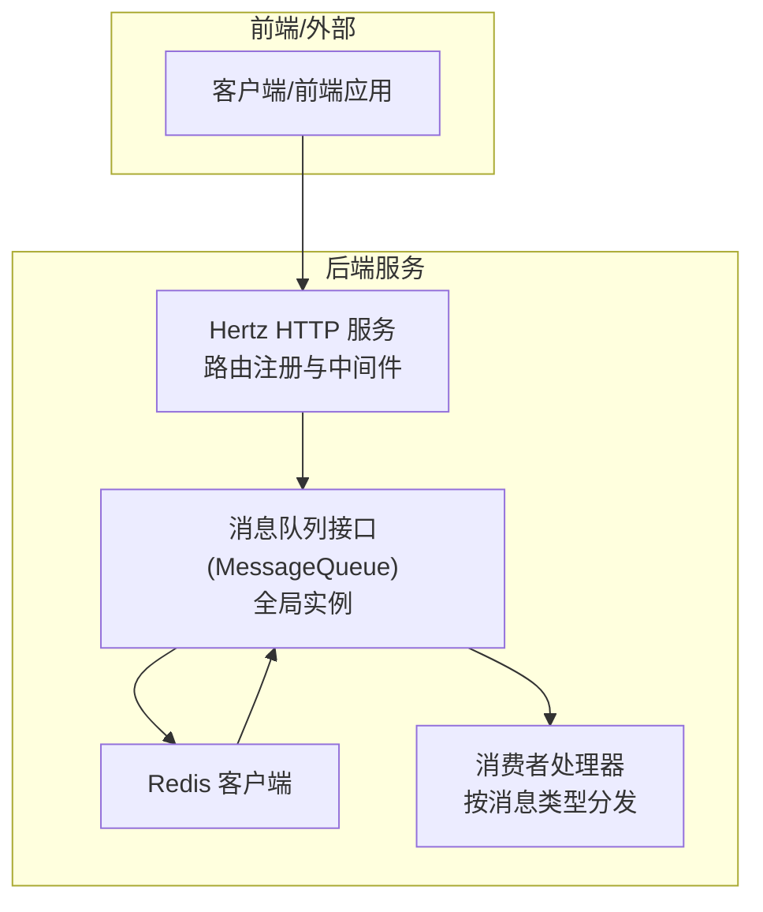
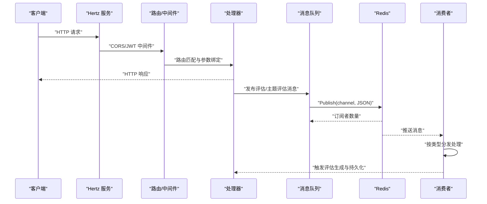
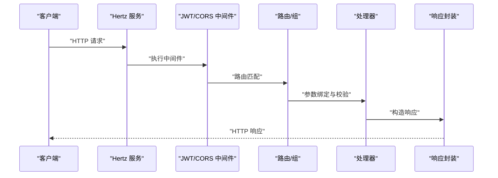
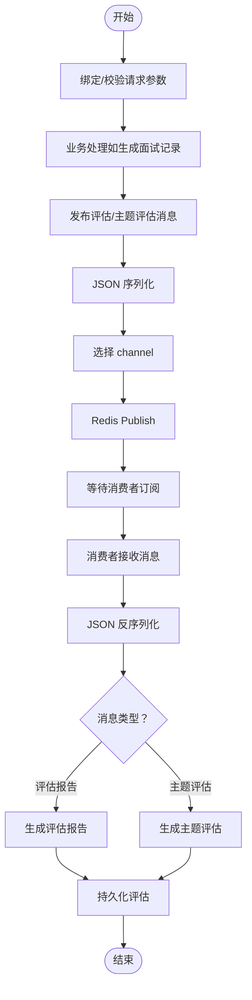
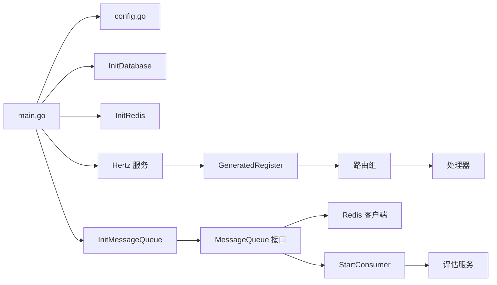

# 服务间通信

<cite>
**本文引用的文件**
- [backend/main.go](file://backend/main.go)
- [backend/internal/mq/mq.go](file://backend/internal/mq/mq.go)
- [backend/internal/mq/redis_queue.go](file://backend/internal/mq/redis_queue.go)
- [backend/internal/mq/consumer.go](file://backend/internal/mq/consumer.go)
- [backend/internal/repository/redis.go](file://backend/internal/repository/redis.go)
- [backend/api/router/register.go](file://backend/api/router/register.go)
- [backend/api/router/interview/api.go](file://backend/api/router/interview/api.go)
- [backend/api/handler/interview/interviews_service.go](file://backend/api/handler/interview/interviews_service.go)
- [backend/internal/middleware/jwt.go](file://backend/internal/middleware/jwt.go)
- [backend/internal/config/config.go](file://backend/internal/config/config.go)
- [backend/chatApp/agent_service/evaluation/record_evaluation_service.go](file://backend/chatApp/agent_service/evaluation/record_evaluation_service.go)
- [docker-compose.yml](file://docker-compose.yml)
</cite>

## 目录
1. [简介](#简介)
2. [项目结构](#项目结构)
3. [核心组件](#核心组件)
4. [架构总览](#架构总览)
5. [详细组件分析](#详细组件分析)
6. [依赖关系分析](#依赖关系分析)
7. [性能考量](#性能考量)
8. [故障排查指南](#故障排查指南)
9. [结论](#结论)
10. [附录](#附录)

## 简介
本文件面向面试吧AI智能面试平台的服务间通信，系统性梳理后端服务的两类主要通信方式：同步RPC调用（基于Hertz与IDL生成的HTTP路由）与异步消息传递（基于Redis Pub/Sub）。文档覆盖请求路由、参数绑定、响应封装、消息队列的生产者/消费者模式、消息序列化与反序列化、错误处理与重试策略，并结合配置与容器编排说明服务发现与负载均衡的落地方案与最佳实践。

## 项目结构
后端采用“Hertz HTTP服务 + Redis消息队列”的双通道通信架构：
- HTTP服务负责对外暴露REST API，路由由IDL生成并注册，配合JWT鉴权与CORS中间件。
- 消息队列通过Redis实现，提供异步事件驱动能力，典型场景为面试评估报告生成与主题评估生成。

图表来源
- [backend/main.go](file://backend/main.go#L101-L129)
- [backend/internal/mq/mq.go](file://backend/internal/mq/mq.go#L137-L153)
- [backend/internal/mq/redis_queue.go](file://backend/internal/mq/redis_queue.go#L13-L30)
- [backend/internal/mq/consumer.go](file://backend/internal/mq/consumer.go#L89-L100)

章节来源
- [backend/main.go](file://backend/main.go#L101-L129)
- [backend/api/router/register.go](file://backend/api/router/register.go#L11-L15)
- [backend/api/router/interview/api.go](file://backend/api/router/interview/api.go#L16-L103)

## 核心组件
- HTTP路由与中间件
  - 路由注册：由IDL生成的路由入口统一注册至Hertz服务。
  - 中间件：全局CORS与JWT认证中间件，支持跳过规则。
- 消息队列抽象与实现
  - 抽象接口：统一的发布/订阅/关闭契约。
  - 实现：Redis Pub/Sub实现；开发/测试可用内存队列。
  - 全局实例：通过初始化函数注入全局消息队列，供任意模块发布消息。
- 消费者
  - 按消息类型分发处理，调用评估服务生成报告并持久化。

章节来源
- [backend/api/router/register.go](file://backend/api/router/register.go#L11-L15)
- [backend/internal/middleware/jwt.go](file://backend/internal/middleware/jwt.go#L32-L78)
- [backend/internal/mq/mq.go](file://backend/internal/mq/mq.go#L40-L48)
- [backend/internal/mq/redis_queue.go](file://backend/internal/mq/redis_queue.go#L13-L30)
- [backend/internal/mq/consumer.go](file://backend/internal/mq/consumer.go#L89-L100)

## 架构总览
后端服务启动流程与通信链路如下：

图表来源
- [backend/main.go](file://backend/main.go#L101-L129)
- [backend/api/router/interview/api.go](file://backend/api/router/interview/api.go#L16-L103)
- [backend/internal/mq/mq.go](file://backend/internal/mq/mq.go#L155-L208)
- [backend/internal/mq/redis_queue.go](file://backend/internal/mq/redis_queue.go#L32-L56)
- [backend/internal/mq/consumer.go](file://backend/internal/mq/consumer.go#L19-L29)

## 详细组件分析

### HTTP REST API 调用链
- 请求路由
  - 由IDL生成的路由在注册入口集中注册，按组划分模块（如 /api/interview、/api/mianshi、/api/user 等）。
- 参数传递
  - 使用Hertz的BindAndValidate进行请求体/查询参数校验与绑定。
- 响应处理
  - 统一的成功/错误响应封装，错误码与HTTP状态码分离，便于前端处理。
- 鉴权与跨域
  - JWT中间件支持多种令牌位置（Header、Query、Cookie），并可按需跳过。
  - CORS中间件统一处理预检请求与允许的源/方法/头。

图表来源
- [backend/api/router/interview/api.go](file://backend/api/router/interview/api.go#L16-L103)
- [backend/api/handler/interview/interviews_service.go](file://backend/api/handler/interview/interviews_service.go#L26-L53)
- [backend/internal/middleware/jwt.go](file://backend/internal/middleware/jwt.go#L32-L78)

章节来源
- [backend/api/router/interview/api.go](file://backend/api/router/interview/api.go#L16-L103)
- [backend/api/handler/interview/interviews_service.go](file://backend/api/handler/interview/interviews_service.go#L26-L53)
- [backend/internal/middleware/jwt.go](file://backend/internal/middleware/jwt.go#L32-L78)

### Redis 消息队列与消费者
- 生产者
  - 通过全局消息队列接口发布消息，内部将消息序列化为JSON并发布到对应channel。
- 消费者
  - 订阅多个消息类型channel，收到消息后反序列化并按类型分发处理。
  - 处理器调用评估服务生成报告并持久化。
- 错误与重试
  - 消息处理失败会记录日志；当前实现未见内置重试/死信队列逻辑，建议在上层调用处增加幂等与重试策略。

图表来源
- [backend/internal/mq/mq.go](file://backend/internal/mq/mq.go#L155-L208)
- [backend/internal/mq/redis_queue.go](file://backend/internal/mq/redis_queue.go#L32-L56)
- [backend/internal/mq/consumer.go](file://backend/internal/mq/consumer.go#L19-L29)

章节来源
- [backend/internal/mq/mq.go](file://backend/internal/mq/mq.go#L155-L208)
- [backend/internal/mq/redis_queue.go](file://backend/internal/mq/redis_queue.go#L32-L56)
- [backend/internal/mq/consumer.go](file://backend/internal/mq/consumer.go#L19-L29)

### 服务发现与负载均衡
- 当前实现
  - 后端服务通过容器编排在本地网络内通信，未集成Consul/Nacos等服务注册中心。
  - 通过Docker Compose的内部网络与服务名进行访问（如DB_HOST=redis等）。
- 建议方案
  - 服务发现：在生产环境引入Consul/Nacos，服务启动时注册自身元数据，客户端通过SDK拉取实例列表。
  - 负载均衡：在网关层（如Nginx/Envoy）或服务间通过客户端LB（如gRPC的负载均衡插件）实现。
  - 配置中心：将Redis、数据库等连接参数集中管理，动态刷新。

章节来源
- [docker-compose.yml](file://docker-compose.yml#L144-L176)
- [backend/internal/config/config.go](file://backend/internal/config/config.go#L13-L31)

### 通信协议规范与最佳实践
- 协议规范
  - HTTP：遵循REST风格，使用统一响应结构；错误码与HTTP状态码分离。
  - 消息：JSON格式，字段包含类型与负载；channel命名规范为“interview:messages:{type}”。
- 最佳实践
  - 幂等性：消息消费侧确保重复消息不会产生副作用（如去重键、事务写入）。
  - 超时与重试：为长耗时评估任务设置超时；必要时在上层调用处做指数退避重试。
  - 监控与告警：对消息积压、处理失败率进行监控，异常时通过飞书等渠道告警。
  - 配置管理：敏感配置通过环境变量注入，避免硬编码。

章节来源
- [backend/internal/mq/mq.go](file://backend/internal/mq/mq.go#L22-L26)
- [backend/internal/mq/redis_queue.go](file://backend/internal/mq/redis_queue.go#L40-L46)
- [backend/internal/alert/feishu.go](file://backend/internal/alert/feishu.go#L69-L78)

## 依赖关系分析
- 启动与初始化
  - main负责加载配置、初始化数据库与Redis、启动Hertz服务、初始化消息队列并启动消费者。
- 路由与处理器
  - 路由注册入口统一挂载至Hertz；处理器通过中间件获取用户上下文并调用业务服务。
- 消息队列
  - 全局消息队列通过工厂函数注入Redis实现；消费者订阅并分发处理。

图表来源
- [backend/main.go](file://backend/main.go#L38-L100)
- [backend/internal/config/config.go](file://backend/internal/config/config.go#L136-L152)
- [backend/api/router/register.go](file://backend/api/router/register.go#L11-L15)
- [backend/internal/mq/mq.go](file://backend/internal/mq/mq.go#L137-L153)
- [backend/internal/mq/consumer.go](file://backend/internal/mq/consumer.go#L89-L100)

章节来源
- [backend/main.go](file://backend/main.go#L38-L100)
- [backend/api/router/register.go](file://backend/api/router/register.go#L11-L15)

## 性能考量
- HTTP层
  - 合理设置读写超时与空闲超时，避免慢请求占用资源。
  - 对大文件上传（如简历）进行并发限制与磁盘IO优化。
- 消息队列
  - Redis Pub/Sub适合低延迟事件通知；若消息量大，建议评估持久化方案或引入消息中间件（如Kafka/RabbitMQ）。
  - 控制消息体大小，避免序列化/反序列化开销过大。
- 评估任务
  - 评估服务本身具备超时控制；建议在上层调用处增加重试与熔断策略，防止级联故障。

## 故障排查指南
- HTTP鉴权失败
  - 检查Authorization头格式与令牌有效性；确认JWT中间件跳过规则是否正确。
- CORS问题
  - 确认预检请求被正确处理，允许的方法/头与实际请求一致。
- 消息未到达消费者
  - 检查Redis连接与channel命名；确认消费者订阅的channel集合正确。
- 评估未生成
  - 查看消费者日志与评估服务调用链；确认消息负载字段完整且类型正确。

章节来源
- [backend/internal/middleware/jwt.go](file://backend/internal/middleware/jwt.go#L32-L78)
- [backend/internal/mq/redis_queue.go](file://backend/internal/mq/redis_queue.go#L58-L119)
- [backend/chatApp/agent_service/evaluation/record_evaluation_service.go](file://backend/chatApp/agent_service/evaluation/record_evaluation_service.go#L17-L108)

## 结论
本项目通过Hertz提供稳定的HTTP API能力，结合Redis实现轻量级异步事件驱动。建议在生产环境中引入服务注册与发现、网关与负载均衡、以及消息持久化与重试策略，以进一步提升系统的可靠性与扩展性。

## 附录
- 配置项要点
  - 数据库/Redis/Hertz等配置集中于配置文件，支持环境变量展开。
  - JWT过期时间、CORS白名单等安全相关配置集中管理。

章节来源
- [backend/internal/config/config.go](file://backend/internal/config/config.go#L13-L31)
- [backend/internal/config/config.go](file://backend/internal/config/config.go#L212-L268)