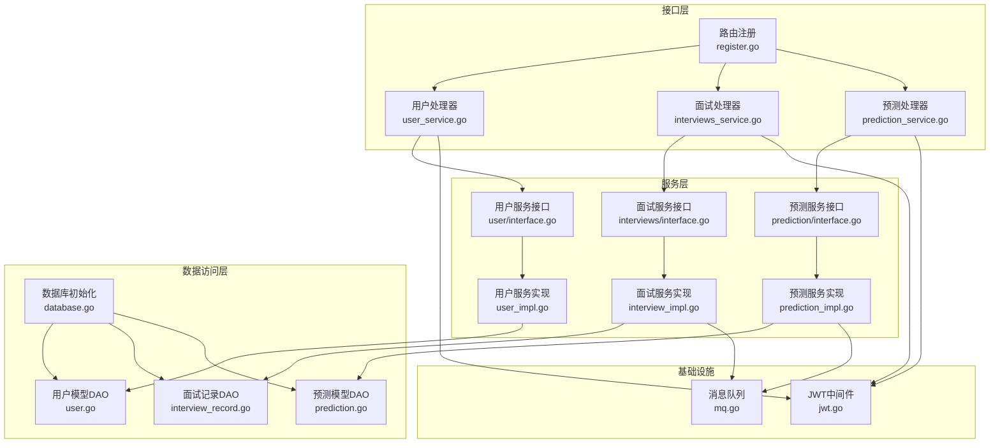
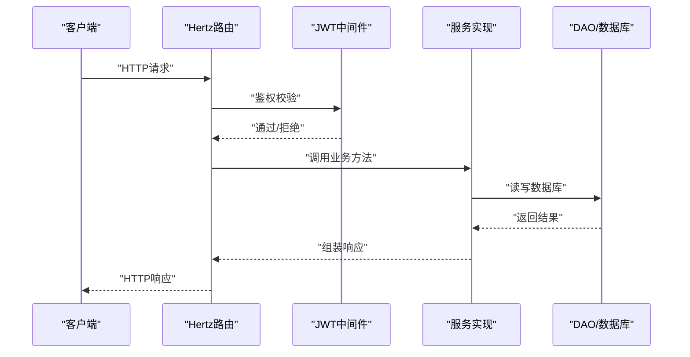
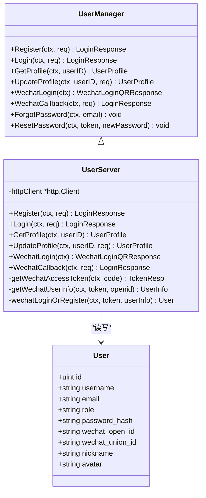
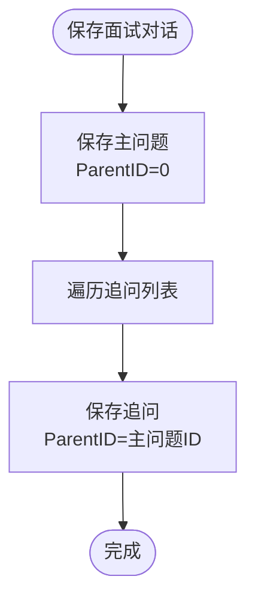
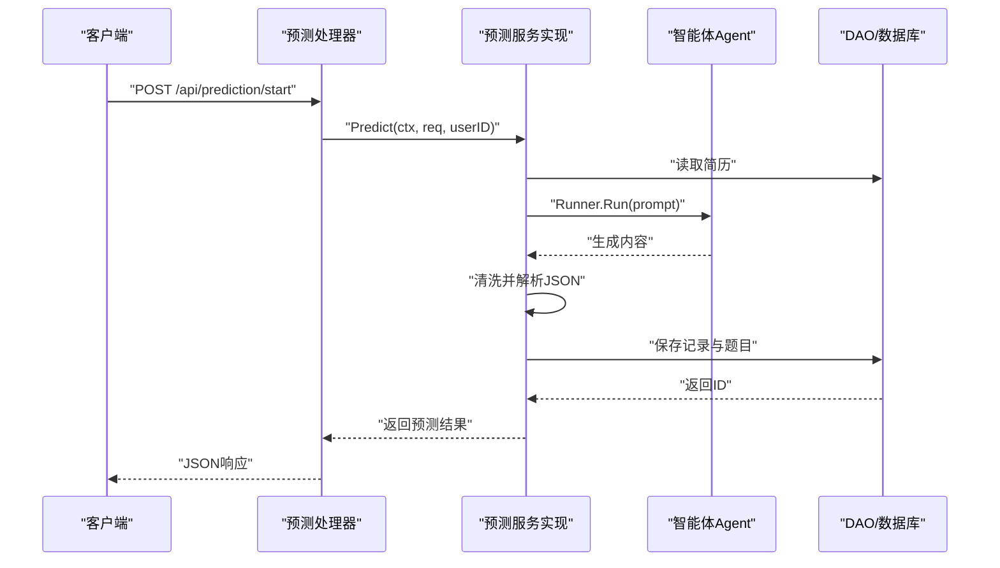
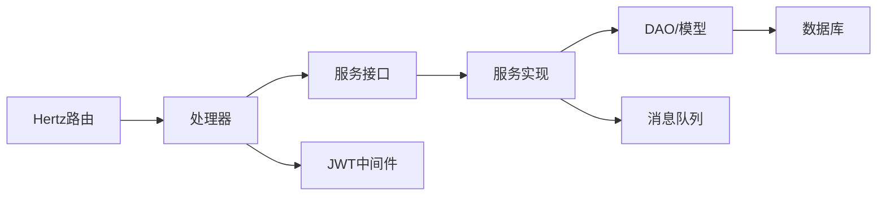

# 核心服务架构

<cite>
**本文档引用的文件**
- [backend/main.go](file://backend/main.go)
- [backend/api/router/register.go](file://backend/api/router/register.go)
- [backend/internal/middleware/jwt.go](file://backend/internal/middleware/jwt.go)
- [backend/internal/repository/database.go](file://backend/internal/repository/database.go)
- [backend/internal/mq/mq.go](file://backend/internal/mq/mq.go)
- [backend/api/handler/interview/user_service.go](file://backend/api/handler/interview/user_service.go)
- [backend/api/handler/interview/interviews_service.go](file://backend/api/handler/interview/interviews_service.go)
- [backend/api/handler/interview/prediction_service.go](file://backend/api/handler/interview/prediction_service.go)
- [backend/internal/service/user/interface.go](file://backend/internal/service/user/interface.go)
- [backend/internal/service/interviews/interface.go](file://backend/internal/service/interviews/interface.go)
- [backend/internal/service/prediction/interface.go](file://backend/internal/service/prediction/interface.go)
- [backend/internal/service/user/impl/user_impl.go](file://backend/internal/service/user/impl/user_impl.go)
- [backend/internal/service/interviews/impl/interview_impl.go](file://backend/internal/service/interviews/impl/interview_impl.go)
- [backend/internal/service/prediction/impl/prediction_impl.go](file://backend/internal/service/prediction/impl/prediction_impl.go)
- [backend/internal/model/user.go](file://backend/internal/model/user.go)
- [backend/internal/model/interview_record.go](file://backend/internal/model/interview_record.go)
- [backend/internal/model/prediction.go](file://backend/internal/model/prediction.go)
</cite>

## 目录
1. [简介](#简介)
2. [项目结构](#项目结构)
3. [核心组件](#核心组件)
4. [架构总览](#架构总览)
5. [详细组件分析](#详细组件分析)
6. [依赖关系分析](#依赖关系分析)
7. [性能考虑](#性能考虑)
8. [故障排除指南](#故障排除指南)
9. [结论](#结论)

## 简介
本文件面向面试吧AI智能面试平台的核心服务架构，系统性梳理用户服务、面试服务、预测服务、面试记录服务等微服务的职责边界、数据模型、接口设计与内部实现机制，并阐明服务间的依赖关系与协作模式（同步调用与异步消息传递）。同时，结合现有代码对数据一致性与分布式事务处理给出可落地的建议与图示，帮助开发者快速理解并高效扩展平台能力。

## 项目结构
后端采用“接口层-服务层-数据访问层-基础设施”的分层架构：
- 接口层：基于Hertz框架的HTTP路由与处理器，负责请求绑定、鉴权、响应封装。
- 服务层：面向业务的领域服务接口与实现，协调数据访问与外部智能体调用。
- 数据访问层：基于GORM的DAO封装，统一数据库操作与迁移。
- 基础设施：JWT认证中间件、消息队列（Redis/内存）、配置与连接池管理。

图表来源
- [backend/api/router/register.go](file://backend/api/router/register.go#L11-L15)
- [backend/api/handler/interview/user_service.go](file://backend/api/handler/interview/user_service.go#L18-L420)
- [backend/api/handler/interview/interviews_service.go](file://backend/api/handler/interview/interviews_service.go#L26-L391)
- [backend/api/handler/interview/prediction_service.go](file://backend/api/handler/interview/prediction_service.go#L17-L96)
- [backend/internal/service/user/interface.go](file://backend/internal/service/user/interface.go#L21-L144)
- [backend/internal/service/interviews/interface.go](file://backend/internal/service/interviews/interface.go#L20-L118)
- [backend/internal/service/prediction/interface.go](file://backend/internal/service/prediction/interface.go#L8-L12)
- [backend/internal/service/user/impl/user_impl.go](file://backend/internal/service/user/impl/user_impl.go#L34-L365)
- [backend/internal/service/interviews/impl/interview_impl.go](file://backend/internal/service/interviews/impl/interview_impl.go#L19-L240)
- [backend/internal/service/prediction/impl/prediction_impl.go](file://backend/internal/service/prediction/impl/prediction_impl.go#L25-L293)
- [backend/internal/model/user.go](file://backend/internal/model/user.go#L12-L116)
- [backend/internal/model/interview_record.go](file://backend/internal/model/interview_record.go#L9-L128)
- [backend/internal/model/prediction.go](file://backend/internal/model/prediction.go#L11-L110)
- [backend/internal/middleware/jwt.go](file://backend/internal/middleware/jwt.go#L32-L78)
- [backend/internal/mq/mq.go](file://backend/internal/mq/mq.go#L40-L209)
- [backend/internal/repository/database.go](file://backend/internal/repository/database.go#L18-L81)

章节来源
- [backend/main.go](file://backend/main.go#L29-L173)
- [backend/api/router/register.go](file://backend/api/router/register.go#L11-L15)

## 核心组件
- 用户服务：负责用户注册、登录、资料管理、微信登录回调、模型配置管理等。
- 面试服务：负责面试记录的创建、更新、查询、对话保存、评估与答题报告查询。
- 预测服务：负责根据简历与面试条件生成押题清单，持久化并返回结果。
- 面试记录服务：提供简历上传、解析、默认简历设置、列表查询等能力。
- 认证与授权：基于JWT的统一鉴权中间件，支持多种令牌来源。
- 消息队列：提供异步消息发布/订阅能力，支撑后续评估报告生成等异步流程。

章节来源
- [backend/internal/service/user/interface.go](file://backend/internal/service/user/interface.go#L21-L144)
- [backend/internal/service/interviews/interface.go](file://backend/internal/service/interviews/interface.go#L20-L118)
- [backend/internal/service/prediction/interface.go](file://backend/internal/service/prediction/interface.go#L8-L12)
- [backend/internal/middleware/jwt.go](file://backend/internal/middleware/jwt.go#L32-L78)
- [backend/internal/mq/mq.go](file://backend/internal/mq/mq.go#L40-L209)

## 架构总览
平台采用单体微服务化的组织方式，通过Hertz路由将HTTP请求分发至对应处理器，处理器调用服务层接口，服务层再通过DAO层访问数据库。JWT中间件贯穿所有受保护接口，确保身份可信。预测与面试模块在执行过程中会调用智能体（Agent），并在必要时通过消息队列触发异步处理。

图表来源
- [backend/api/router/register.go](file://backend/api/router/register.go#L11-L15)
- [backend/internal/middleware/jwt.go](file://backend/internal/middleware/jwt.go#L32-L78)
- [backend/internal/service/user/impl/user_impl.go](file://backend/internal/service/user/impl/user_impl.go#L34-L93)
- [backend/internal/service/interviews/impl/interview_impl.go](file://backend/internal/service/interviews/impl/interview_impl.go#L19-L133)
- [backend/internal/service/prediction/impl/prediction_impl.go](file://backend/internal/service/prediction/impl/prediction_impl.go#L25-L121)
- [backend/internal/repository/database.go](file://backend/internal/repository/database.go#L18-L81)

## 详细组件分析

### 用户服务（User Service）
- 业务职责
  - 用户注册/登录与密码哈希校验
  - 用户资料查询与更新
  - 微信登录二维码生成与回调处理
  - 用户模型配置管理（多模型、默认模型、密钥等）

- 数据模型
  - 用户表包含用户名、邮箱、角色、微信OpenID/UnionID、头像等字段
  - 用户模型表用于存储第三方模型配置（协议、BaseURL、Provider、默认参数等）

- 接口设计
  - 注册/登录/登出/资料查询/更新
  - 忘记密码/重置密码
  - 微信登录/回调
  - 用户模型的增删改查与默认模型检查

- 内部实现机制
  - 使用JWT中间件注入用户上下文
  - 密码采用哈希校验与兼容旧明文逻辑
  - 微信登录通过第三方接口获取令牌与用户信息，自动注册或更新用户

图表来源
- [backend/internal/service/user/interface.go](file://backend/internal/service/user/interface.go#L54-L63)
- [backend/internal/service/user/impl/user_impl.go](file://backend/internal/service/user/impl/user_impl.go#L22-L32)
- [backend/internal/model/user.go](file://backend/internal/model/user.go#L12-L28)

章节来源
- [backend/api/handler/interview/user_service.go](file://backend/api/handler/interview/user_service.go#L18-L420)
- [backend/internal/service/user/interface.go](file://backend/internal/service/user/interface.go#L21-L144)
- [backend/internal/service/user/impl/user_impl.go](file://backend/internal/service/user/impl/user_impl.go#L34-L365)
- [backend/internal/model/user.go](file://backend/internal/model/user.go#L12-L116)
- [backend/internal/middleware/jwt.go](file://backend/internal/middleware/jwt.go#L136-L143)

### 面试服务（Interviews Service）
- 业务职责
  - 面试记录的创建、更新、分页查询
  - 面试评估报告与答题报告的查询
  - 面试对话保存（支持主问题与追问的父子关系）

- 数据模型
  - 面试记录表包含类型、难度、领域、公司/岗位、状态、时长等
  - 对话表支持父子关系，便于构建追问链路

- 接口设计
  - 创建/更新/查询面试记录
  - 获取评估报告与答题报告
  - 保存面试对话（主问题+追问）

- 内部实现机制
  - DTO与模型之间的转换
  - 分页参数的默认值处理
  - 对话保存时设置用户ID与报告ID，保证数据归属

图表来源
- [backend/internal/service/interviews/impl/interview_impl.go](file://backend/internal/service/interviews/impl/interview_impl.go#L210-L240)

章节来源
- [backend/api/handler/interview/interviews_service.go](file://backend/api/handler/interview/interviews_service.go#L26-L391)
- [backend/internal/service/interviews/interface.go](file://backend/internal/service/interviews/interface.go#L20-L118)
- [backend/internal/service/interviews/impl/interview_impl.go](file://backend/internal/service/interviews/impl/interview_impl.go#L19-L240)
- [backend/internal/model/interview_record.go](file://backend/internal/model/interview_record.go#L9-L128)

### 预测服务（Prediction Service）
- 业务职责
  - 根据简历与面试条件生成押题清单
  - 持久化押题记录与题目明细
  - 提供押题记录列表与详情查询

- 数据模型
  - 押题记录表包含用户ID、简历ID、类型、语言、岗位、难度、公司等
  - 押题题目表包含问题、重点内容、重点考察、回答思路、参考答案、可能追问、排序等

- 接口设计
  - 开始预测（POST）
  - 押题列表（GET）
  - 押题详情（GET）

- 内部实现机制
  - 构造提示词，调用智能体生成押题结果
  - 清洗智能体输出的JSON，解析为结构化结果
  - 分步保存主记录与题目明细，保证原子性
  - 返回标准化响应

图表来源
- [backend/api/handler/interview/prediction_service.go](file://backend/api/handler/interview/prediction_service.go#L17-L96)
- [backend/internal/service/prediction/impl/prediction_impl.go](file://backend/internal/service/prediction/impl/prediction_impl.go#L25-L211)
- [backend/internal/model/prediction.go](file://backend/internal/model/prediction.go#L11-L110)

章节来源
- [backend/api/handler/interview/prediction_service.go](file://backend/api/handler/interview/prediction_service.go#L17-L96)
- [backend/internal/service/prediction/interface.go](file://backend/internal/service/prediction/interface.go#L8-L12)
- [backend/internal/service/prediction/impl/prediction_impl.go](file://backend/internal/service/prediction/impl/prediction_impl.go#L25-L293)
- [backend/internal/model/prediction.go](file://backend/internal/model/prediction.go#L11-L110)

### 面试记录服务（Resume Management）
- 业务职责
  - 简历上传、解析与入库
  - 默认简历设置
  - 简历列表与详情查询

- 实现要点
  - 处理PDF文件上传与本地落盘
  - 调用简历解析服务保存信息
  - 提供分页查询与默认简历逻辑

章节来源
- [backend/api/handler/interview/interviews_service.go](file://backend/api/handler/interview/interviews_service.go#L55-L391)

### 认证与授权（JWT中间件）
- 支持多种令牌来源：Authorization头、X-Auth-Token头、查询参数、Cookie
- 生成JWT时设置过期时间与签发方
- 提供从上下文提取用户信息的工具方法

章节来源
- [backend/internal/middleware/jwt.go](file://backend/internal/middleware/jwt.go#L32-L215)

### 消息队列（异步处理）
- 定义消息类型与负载结构
- 提供发布/订阅接口与全局队列实例
- 支撑评估报告生成等异步流程

章节来源
- [backend/internal/mq/mq.go](file://backend/internal/mq/mq.go#L40-L209)

## 依赖关系分析
- 组件耦合
  - 处理器仅依赖服务接口，降低对具体实现的耦合
  - 服务实现依赖DAO层，DAO层依赖GORM与数据库配置
  - JWT中间件被所有处理器依赖，形成统一鉴权入口

- 外部依赖
  - Hertz框架提供HTTP路由与中间件
  - GORM提供数据库ORM能力
  - 智能体（Eino）用于预测服务的推理

图表来源
- [backend/api/router/register.go](file://backend/api/router/register.go#L11-L15)
- [backend/internal/middleware/jwt.go](file://backend/internal/middleware/jwt.go#L32-L78)
- [backend/internal/repository/database.go](file://backend/internal/repository/database.go#L18-L81)
- [backend/internal/mq/mq.go](file://backend/internal/mq/mq.go#L40-L209)

章节来源
- [backend/main.go](file://backend/main.go#L29-L173)
- [backend/api/router/register.go](file://backend/api/router/register.go#L11-L15)
- [backend/internal/middleware/jwt.go](file://backend/internal/middleware/jwt.go#L32-L78)
- [backend/internal/repository/database.go](file://backend/internal/repository/database.go#L18-L81)
- [backend/internal/mq/mq.go](file://backend/internal/mq/mq.go#L40-L209)

## 性能考虑
- 数据库连接池：合理设置最大空闲/活跃连接数与连接生命周期，避免高并发下的连接争用。
- 分页查询：对大表查询使用索引与LIMIT/OFFSET，避免全表扫描。
- 缓存策略：对热点数据（如用户模型配置）引入Redis缓存，减少数据库压力。
- 异步处理：将耗时操作（如评估报告生成）放入消息队列，提升接口响应速度。
- 日志与监控：对关键路径增加埋点与指标采集，定位性能瓶颈。

## 故障排除指南
- 认证失败
  - 检查Authorization头格式与令牌有效性
  - 确认JWT密钥与过期时间配置正确

- 数据库异常
  - 检查DSN与连接池配置
  - 关注迁移失败与表结构不一致问题

- 智能体调用失败
  - 校验提示词构造与Agent初始化
  - 捕获panic并记录堆栈信息

- 消息队列异常
  - 确认队列初始化与订阅是否成功
  - 检查消息负载序列化与处理器实现

章节来源
- [backend/internal/middleware/jwt.go](file://backend/internal/middleware/jwt.go#L115-L134)
- [backend/internal/repository/database.go](file://backend/internal/repository/database.go#L18-L81)
- [backend/internal/service/prediction/impl/prediction_impl.go](file://backend/internal/service/prediction/impl/prediction_impl.go#L25-L121)
- [backend/internal/mq/mq.go](file://backend/internal/mq/mq.go#L155-L209)

## 结论
本架构以清晰的分层与接口抽象实现了用户、面试、预测、记录等核心能力，配合JWT统一鉴权与消息队列异步处理，满足了平台的可扩展性与可维护性需求。建议在生产环境中进一步完善分布式事务与幂等设计、引入缓存与限流策略，并持续优化智能体调用与数据库性能，以支撑更大规模的并发与更复杂的业务场景。