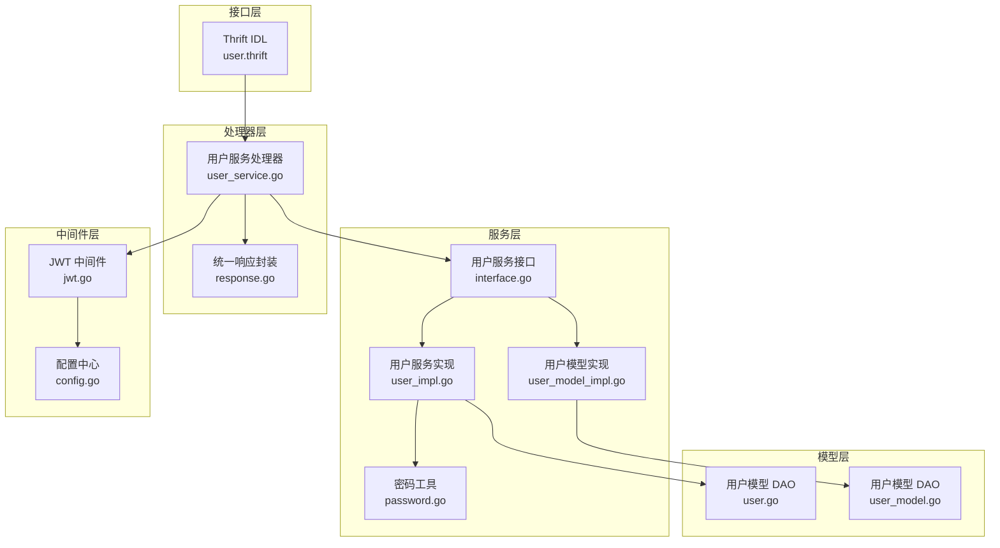
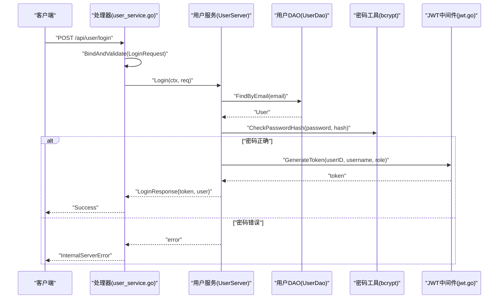
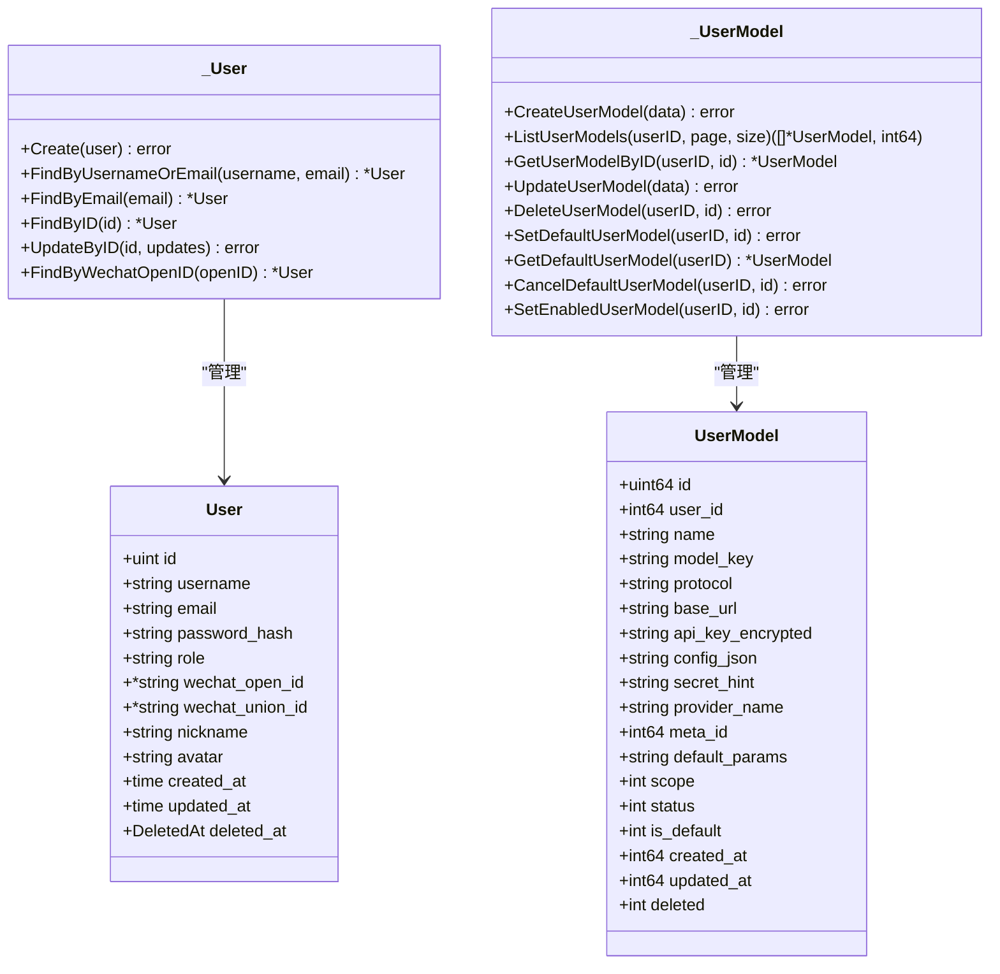
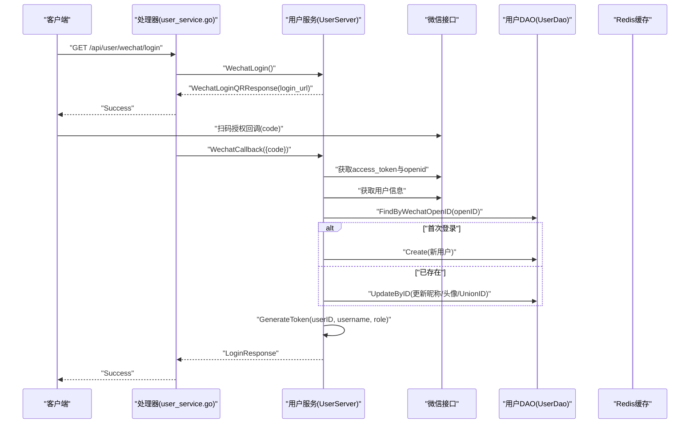
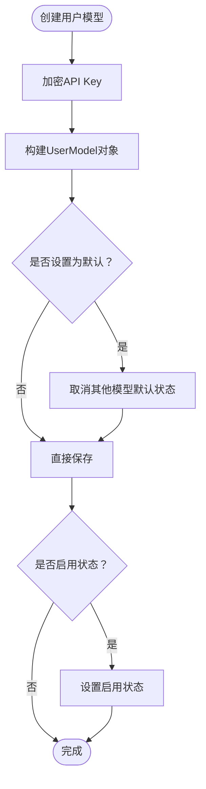
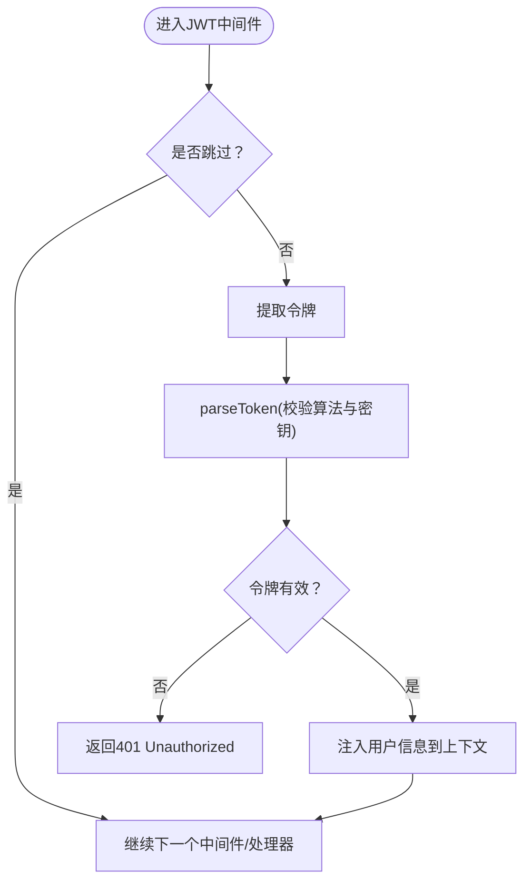
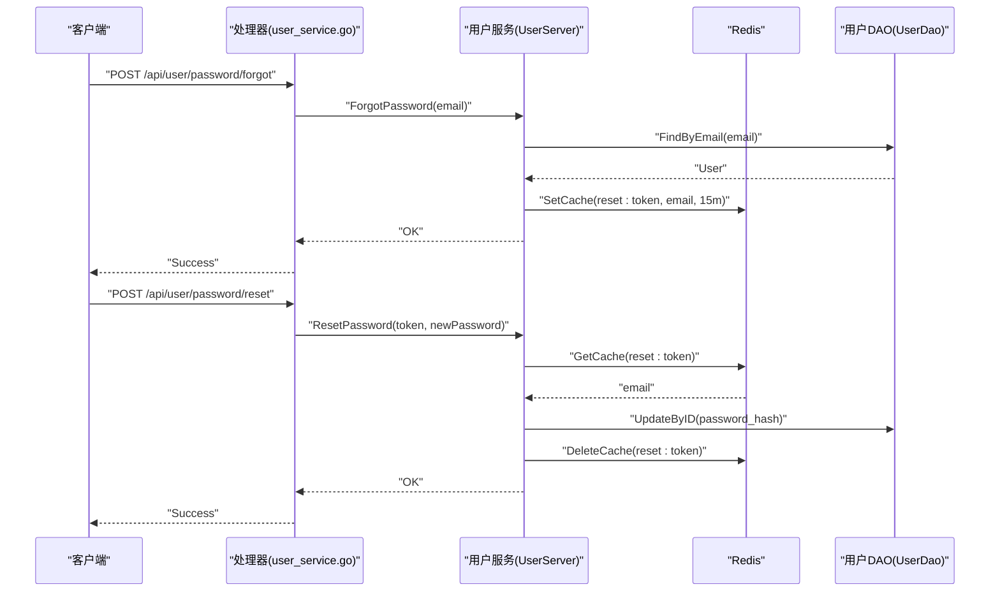
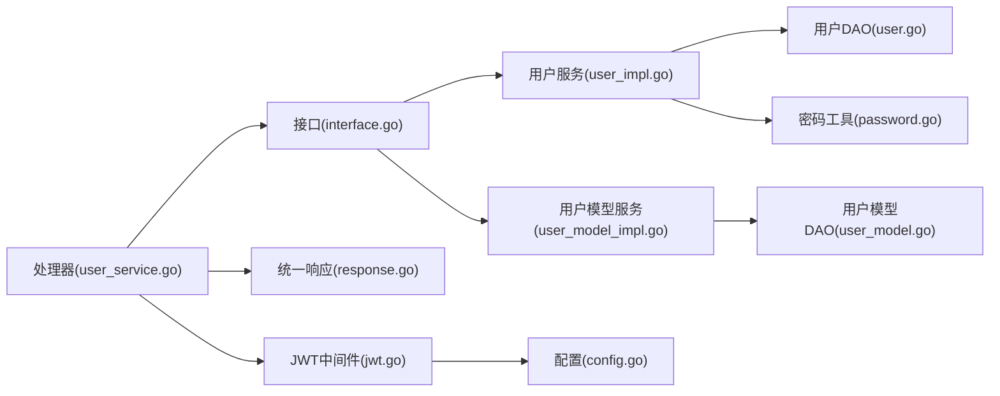

# 用户服务架构

<cite>
**本文档引用的文件**
- [backend/internal/model/user.go](file://backend/internal/model/user.go)
- [backend/internal/model/user_model.go](file://backend/internal/model/user_model.go)
- [backend/internal/service/user/interface.go](file://backend/internal/service/user/interface.go)
- [backend/internal/service/user/impl/user_impl.go](file://backend/internal/service/user/impl/user_impl.go)
- [backend/internal/service/user/impl/user_model_impl.go](file://backend/internal/service/user/impl/user_model_impl.go)
- [backend/internal/service/user/impl/user_password.go](file://backend/internal/service/user/impl/user_password.go)
- [backend/internal/middleware/jwt.go](file://backend/internal/middleware/jwt.go)
- [backend/internal/service/common/password.go](file://backend/internal/service/common/password.go)
- [backend/idl/user/user.thrift](file://backend/idl/user/user.thrift)
- [backend/api/handler/interview/user_service.go](file://backend/api/handler/interview/user_service.go)
- [backend/api/response/response.go](file://backend/api/response/response.go)
- [backend/internal/config/config.go](file://backend/internal/config/config.go)
</cite>

## 目录
1. [简介](#简介)
2. [项目结构](#项目结构)
3. [核心组件](#核心组件)
4. [架构总览](#架构总览)
5. [详细组件分析](#详细组件分析)
6. [依赖关系分析](#依赖关系分析)
7. [性能考量](#性能考量)
8. [故障排除指南](#故障排除指南)
9. [结论](#结论)
10. [附录](#附录)

## 简介
本文件为用户服务的详细架构文档，覆盖用户注册、登录、微信登录、用户信息管理、密码找回与重置、用户模型管理等核心功能。文档深入解释用户数据模型设计、JWT 令牌管理机制、密码加密处理、权限控制与认证中间件集成，并提供接口设计规范、错误处理机制与安全考虑，辅以代码级图示与最佳实践指导。

## 项目结构
用户服务采用分层架构，主要分为接口层、处理器层、服务层、模型层与中间件层：
- 接口层：通过 Thrift IDL 定义用户相关 API 结构与路由
- 处理器层：Hertz 路由绑定与请求校验，调用服务层
- 服务层：用户管理与用户模型管理的具体实现
- 模型层：用户与用户模型的数据持久化封装
- 中间件层：JWT 认证与用户上下文注入

**图表来源**
- [backend/idl/user/user.thrift](file://backend/idl/user/user.thrift#L1-L200)
- [backend/api/handler/interview/user_service.go](file://backend/api/handler/interview/user_service.go#L1-L420)
- [backend/internal/service/user/interface.go](file://backend/internal/service/user/interface.go#L1-L144)
- [backend/internal/service/user/impl/user_impl.go](file://backend/internal/service/user/impl/user_impl.go#L1-L365)
- [backend/internal/service/user/impl/user_model_impl.go](file://backend/internal/service/user/impl/user_model_impl.go#L1-L225)
- [backend/internal/model/user.go](file://backend/internal/model/user.go#L1-L116)
- [backend/internal/model/user_model.go](file://backend/internal/model/user_model.go#L1-L243)
- [backend/internal/middleware/jwt.go](file://backend/internal/middleware/jwt.go#L1-L215)
- [backend/internal/config/config.go](file://backend/internal/config/config.go#L1-L269)

**章节来源**
- [backend/idl/user/user.thrift](file://backend/idl/user/user.thrift#L1-L200)
- [backend/api/handler/interview/user_service.go](file://backend/api/handler/interview/user_service.go#L1-L420)
- [backend/internal/service/user/interface.go](file://backend/internal/service/user/interface.go#L1-L144)

## 核心组件
- 用户模型与 DAO：定义用户实体、唯一约束与常用查询方法
- 用户服务接口与实现：提供注册、登录、微信登录、资料管理、密码找回与重置
- 用户模型服务：提供用户模型的增删改查、默认模型设置与启用状态管理
- JWT 中间件：统一鉴权、令牌解析与用户上下文注入
- 密码工具：bcrypt 加密与校验，以及 API Key 加密
- 统一响应：标准化 HTTP 响应格式与错误码映射

**章节来源**
- [backend/internal/model/user.go](file://backend/internal/model/user.go#L1-L116)
- [backend/internal/service/user/interface.go](file://backend/internal/service/user/interface.go#L54-L63)
- [backend/internal/service/user/impl/user_impl.go](file://backend/internal/service/user/impl/user_impl.go#L34-L93)
- [backend/internal/service/user/impl/user_model_impl.go](file://backend/internal/service/user/impl/user_model_impl.go#L20-L89)
- [backend/internal/middleware/jwt.go](file://backend/internal/middleware/jwt.go#L32-L78)
- [backend/internal/service/common/password.go](file://backend/internal/service/common/password.go#L7-L17)

## 架构总览
用户服务围绕“接口层 → 处理器层 → 服务层 → 模型层”的分层设计展开，配合 JWT 中间件完成认证与授权。微信登录通过第三方接口完成授权与用户信息获取，最终生成本地登录态；密码找回通过 Redis 缓存临时 Token 并发送邮件完成重置。

**图表来源**
- [backend/api/handler/interview/user_service.go](file://backend/api/handler/interview/user_service.go#L238-L262)
- [backend/internal/service/user/impl/user_impl.go](file://backend/internal/service/user/impl/user_impl.go#L67-L93)
- [backend/internal/middleware/jwt.go](file://backend/internal/middleware/jwt.go#L80-L113)

**章节来源**
- [backend/api/handler/interview/user_service.go](file://backend/api/handler/interview/user_service.go#L238-L262)
- [backend/internal/middleware/jwt.go](file://backend/internal/middleware/jwt.go#L32-L78)

## 详细组件分析

### 用户数据模型与 DAO
- 用户模型包含主键、用户名、邮箱、密码哈希、角色、微信 OpenID/UnionID、昵称与头像等字段，并设置唯一索引与软删除索引
- DAO 提供创建、按用户名/邮箱/ID 查询、按微信 OpenID 查询、按 ID 更新等方法
- 用户模型 DAO 提供用户模型的创建、分页查询、详情查询、更新、软删除、默认模型设置与取消、启用/禁用等操作

**图表来源**
- [backend/internal/model/user.go](file://backend/internal/model/user.go#L11-L53)
- [backend/internal/model/user_model.go](file://backend/internal/model/user_model.go#L30-L58)

**章节来源**
- [backend/internal/model/user.go](file://backend/internal/model/user.go#L35-L116)
- [backend/internal/model/user_model.go](file://backend/internal/model/user_model.go#L60-L243)

### 用户服务接口与实现
- 用户服务接口定义注册、登录、获取/更新资料、微信登录与回调、忘记/重置密码等方法
- 用户服务实现负责业务流程：注册时检查重复、bcrypt 加密、生成 JWT；登录时校验密码（兼容明文），必要时升级为 bcrypt；微信登录通过微信接口获取 token 与用户信息，按需创建或更新用户
- 密码找回通过 UUID 生成 token，写入 Redis（带过期时间），并通过邮件发送重置链接；重置时校验 token、更新密码并清理缓存

**图表来源**
- [backend/api/handler/interview/user_service.go](file://backend/api/handler/interview/user_service.go#L337-L382)
- [backend/internal/service/user/impl/user_impl.go](file://backend/internal/service/user/impl/user_impl.go#L119-L157)
- [backend/internal/service/user/impl/user_impl.go](file://backend/internal/service/user/impl/user_impl.go#L279-L319)

**章节来源**
- [backend/internal/service/user/interface.go](file://backend/internal/service/user/interface.go#L54-L63)
- [backend/internal/service/user/impl/user_impl.go](file://backend/internal/service/user/impl/user_impl.go#L34-L157)
- [backend/internal/service/user/impl/user_password.go](file://backend/internal/service/user/impl/user_password.go#L20-L97)

### 用户模型服务
- 用户模型服务负责用户模型的创建（含 API Key 加密）、列表分页查询、详情查询、更新（含默认模型切换与启用状态变更）、删除（软删除）
- 当设置为默认模型时，会先取消该用户其他模型的默认状态，保证同一用户只有一个默认模型

**图表来源**
- [backend/internal/service/user/impl/user_model_impl.go](file://backend/internal/service/user/impl/user_model_impl.go#L20-L89)
- [backend/internal/model/user_model.go](file://backend/internal/model/user_model.go#L145-L173)

**章节来源**
- [backend/internal/service/user/impl/user_model_impl.go](file://backend/internal/service/user/impl/user_model_impl.go#L20-L199)
- [backend/internal/model/user_model.go](file://backend/internal/model/user_model.go#L145-L242)

### JWT 令牌管理与认证中间件
- JWT 中间件支持多种令牌来源提取（Authorization Bearer、X-Auth-Token、Query token、Cookie），解析后将用户信息注入上下文
- 令牌签发包含用户 ID、用户名、角色与标准声明（过期、签发、生效时间），使用对称密钥签名
- 提供便捷函数从上下文获取用户 ID、用户名与角色，或手动解析并设置用户信息

**图表来源**
- [backend/internal/middleware/jwt.go](file://backend/internal/middleware/jwt.go#L32-L78)
- [backend/internal/middleware/jwt.go](file://backend/internal/middleware/jwt.go#L115-L134)
- [backend/internal/middleware/jwt.go](file://backend/internal/middleware/jwt.go#L186-L214)

**章节来源**
- [backend/internal/middleware/jwt.go](file://backend/internal/middleware/jwt.go#L16-L184)
- [backend/internal/config/config.go](file://backend/internal/config/config.go#L113-L118)

### 密码加密与安全处理
- 使用 bcrypt 对用户密码进行高强度加密，提供校验函数
- 用户模型的 API Key 通过专用加密函数进行加密存储，支持脱敏提示字段
- 忘记密码流程通过 Redis 缓存短期 token，邮件发送一次性重置链接，重置后立即失效

**图表来源**
- [backend/api/handler/interview/user_service.go](file://backend/api/handler/interview/user_service.go#L44-L78)
- [backend/internal/service/user/impl/user_password.go](file://backend/internal/service/user/impl/user_password.go#L20-L97)

**章节来源**
- [backend/internal/service/common/password.go](file://backend/internal/service/common/password.go#L7-L17)
- [backend/internal/service/user/impl/user_password.go](file://backend/internal/service/user/impl/user_password.go#L15-L97)

### 接口设计规范与统一响应
- 接口通过 Thrift IDL 定义请求/响应结构，处理器负责绑定与校验、调用服务层并返回统一响应
- 统一响应包含业务码、消息与数据，错误码映射到标准 HTTP 状态码，便于前端一致处理
- 处理器在调用服务前通过 JWT 中间件获取用户 ID，对需要鉴权的接口进行权限校验

**章节来源**
- [backend/idl/user/user.thrift](file://backend/idl/user/user.thrift#L129-L200)
- [backend/api/handler/interview/user_service.go](file://backend/api/handler/interview/user_service.go#L1-L420)
- [backend/api/response/response.go](file://backend/api/response/response.go#L13-L119)

## 依赖关系分析
- 处理器依赖服务接口，服务实现依赖 DAO 与通用工具
- JWT 中间件被处理器依赖，用于鉴权与用户上下文注入
- 配置中心提供 JWT 密钥与过期时间等安全配置
- 统一响应封装为各处理器提供一致的错误与成功返回

**图表来源**
- [backend/api/handler/interview/user_service.go](file://backend/api/handler/interview/user_service.go#L1-L420)
- [backend/internal/service/user/interface.go](file://backend/internal/service/user/interface.go#L1-L144)
- [backend/internal/service/user/impl/user_impl.go](file://backend/internal/service/user/impl/user_impl.go#L1-L365)
- [backend/internal/service/user/impl/user_model_impl.go](file://backend/internal/service/user/impl/user_model_impl.go#L1-L225)
- [backend/internal/model/user.go](file://backend/internal/model/user.go#L1-L116)
- [backend/internal/model/user_model.go](file://backend/internal/model/user_model.go#L1-L243)
- [backend/internal/middleware/jwt.go](file://backend/internal/middleware/jwt.go#L1-L215)
- [backend/internal/config/config.go](file://backend/internal/config/config.go#L1-L269)
- [backend/api/response/response.go](file://backend/api/response/response.go#L1-L119)

**章节来源**
- [backend/api/handler/interview/user_service.go](file://backend/api/handler/interview/user_service.go#L1-L420)
- [backend/internal/middleware/jwt.go](file://backend/internal/middleware/jwt.go#L32-L78)

## 性能考量
- 数据库连接池与超时：通过配置中心设置数据库最大连接数、空闲连接数与连接生命周期，避免高并发下的连接争用
- 分页查询：用户模型列表查询限制每页最大条数，防止过大分页导致查询压力
- 缓存策略：忘记密码 token 使用 Redis 短生命周期缓存，降低数据库压力并提升安全性
- 密码加密成本：bcrypt 计算成本较高，建议在高并发场景下合理设置并发与异步处理策略

[本节为通用性能建议，无需具体文件引用]

## 故障排除指南
- 401 未授权：检查 Authorization 头部格式（Bearer token）、X-Auth-Token、Query token 或 Cookie 是否正确传递
- 400 请求错误：检查请求体绑定与校验，确认 Thrift IDL 字段是否完整
- 500 服务器错误：查看服务日志，定位 DAO 操作异常或外部接口调用失败（如微信接口）
- 密码重置失败：确认 Redis 缓存是否存在、是否过期、邮件发送是否成功

**章节来源**
- [backend/api/response/response.go](file://backend/api/response/response.go#L55-L88)
- [backend/internal/middleware/jwt.go](file://backend/internal/middleware/jwt.go#L186-L214)

## 结论
用户服务通过清晰的分层设计与完善的中间件机制，实现了用户注册、登录、微信登录、资料管理、密码找回与用户模型管理等核心能力。结合 JWT 认证、bcrypt 密码加密与 Redis 缓存，保障了系统的安全性与可维护性。建议在生产环境中进一步完善监控与日志、限流与熔断策略，并持续优化数据库索引与查询性能。

[本节为总结性内容，无需具体文件引用]

## 附录
- 接口路由与请求示例路径参考：
  - 注册：/api/user/register
  - 登录：/api/user/login
  - 获取资料：/api/user/profile
  - 更新资料：/api/user/profile
  - 微信登录二维码：/api/user/wechat/login
  - 微信回调：/api/user/wechat/callback
  - 忘记密码：/api/user/password/forgot
  - 重置密码：/api/user/password/reset
- 最佳实践：
  - 始终使用 HTTPS 传输敏感数据
  - JWT 密钥与 Redis 密钥妥善保管，定期轮换
  - 对外部接口调用增加超时与重试策略
  - 对用户输入进行严格的校验与清洗

**章节来源**
- [backend/api/handler/interview/user_service.go](file://backend/api/handler/interview/user_service.go#L212-L382)
- [backend/idl/user/user.thrift](file://backend/idl/user/user.thrift#L129-L200)