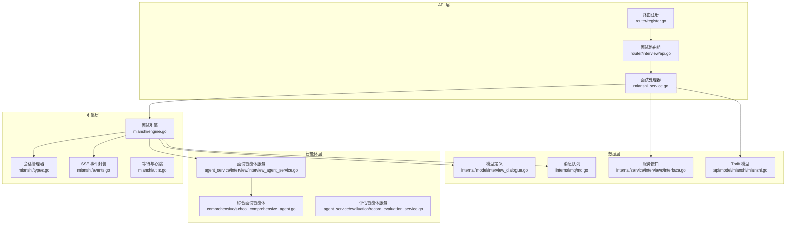
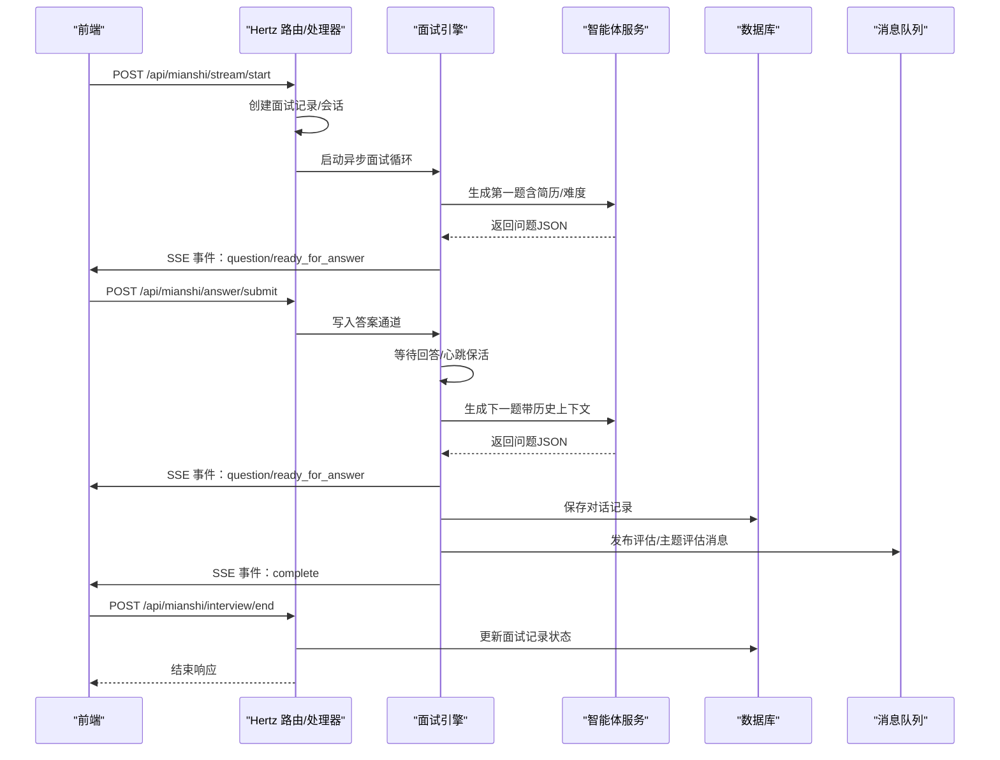
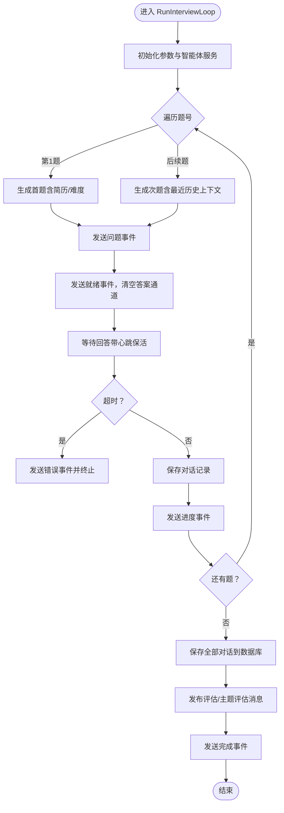
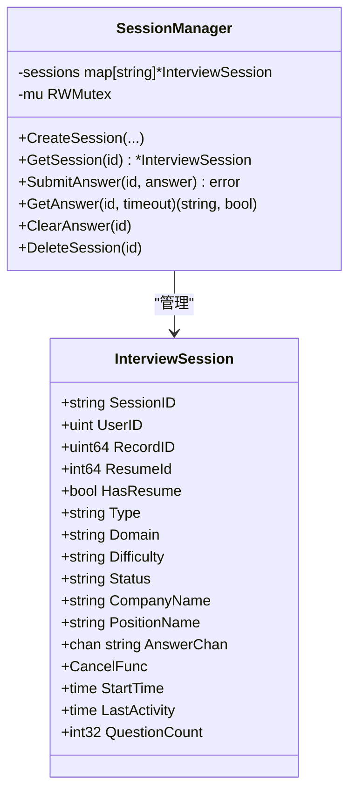
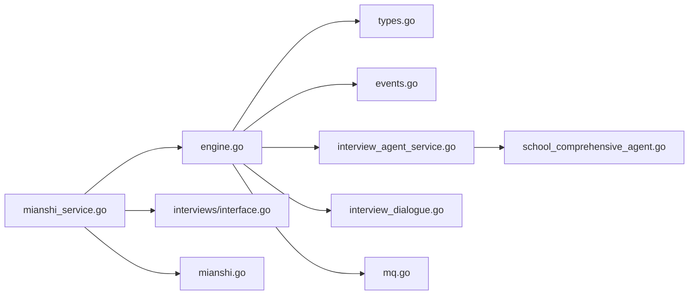

# 面试服务架构

<cite>
**本文引用的文件**
- [backend/api/handler/interview/mianshi/engine.go](file://backend/api/handler/interview/mianshi/engine.go)
- [backend/api/handler/interview/mianshi/types.go](file://backend/api/handler/interview/mianshi/types.go)
- [backend/api/handler/interview/mianshi/events.go](file://backend/api/handler/interview/mianshi/events.go)
- [backend/api/handler/interview/mianshi/utils.go](file://backend/api/handler/interview/mianshi/utils.go)
- [backend/api/handler/interview/mianshi_service.go](file://backend/api/handler/interview/mianshi_service.go)
- [backend/api/router/interview/api.go](file://backend/api/router/interview/api.go)
- [backend/api/router/register.go](file://backend/api/router/register.go)
- [backend/chatApp/agent_service/interview/interview_agent_service.go](file://backend/chatApp/agent_service/interview/interview_agent_service.go)
- [backend/chatApp/agent/agent/interview/comprehensive/school_comprehensive_agent.go](file://backend/chatApp/agent/agent/interview/comprehensive/school_comprehensive_agent.go)
- [backend/chatApp/agent_service/evaluation/record_evaluation_service.go](file://backend/chatApp/agent_service/evaluation/record_evaluation_service.go)
- [backend/internal/model/interview_dialogue.go](file://backend/internal/model/interview_dialogue.go)
- [backend/internal/mq/mq.go](file://backend/internal/mq/mq.go)
- [backend/internal/service/interviews/interface.go](file://backend/internal/service/interviews/interface.go)
- [backend/api/model/mianshi/mianshi.go](file://backend/api/model/mianshi/mianshi.go)
</cite>

## 目录
1. [简介](#简介)
2. [项目结构](#项目结构)
3. [核心组件](#核心组件)
4. [架构总览](#架构总览)
5. [详细组件分析](#详细组件分析)
6. [依赖关系分析](#依赖关系分析)
7. [性能考量](#性能考量)
8. [故障排查指南](#故障排查指南)
9. [结论](#结论)
10. [附录](#附录)

## 简介
本架构文档面向面试服务，系统性阐述面试引擎的设计原理、会话管理机制与实时交互处理；深入解释面试流程控制、对话状态管理与评估算法实现；详述面试服务与AI智能体的集成方式（问题生成、答案评估与反馈机制）；描述面试数据模型设计、事件驱动架构与SSE实时流处理；并提供扩展性设计与性能优化策略及调试指南。

## 项目结构
面试服务采用分层清晰的模块化组织：
- API 层：路由注册、请求处理、SSE 实时推送
- 引擎层：面试流程控制、问题生成调度、对话状态管理
- 智能体层：综合/专项面试智能体、评估智能体
- 数据层：模型定义、DAO、消息队列
- 集成层：ThriftIDL、Hertz 路由

图表来源
- [backend/api/router/register.go](file://backend/api/router/register.go#L11-L16)
- [backend/api/router/interview/api.go](file://backend/api/router/interview/api.go#L17-L47)
- [backend/api/handler/interview/mianshi_service.go](file://backend/api/handler/interview/mianshi_service.go#L25-L117)
- [backend/api/handler/interview/mianshi/engine.go](file://backend/api/handler/interview/mianshi/engine.go#L23-L37)
- [backend/api/handler/interview/mianshi/types.go](file://backend/api/handler/interview/mianshi/types.go#L9-L50)
- [backend/api/handler/interview/mianshi/events.go](file://backend/api/handler/interview/mianshi/events.go#L11-L34)
- [backend/api/handler/interview/mianshi/utils.go](file://backend/api/handler/interview/mianshi/utils.go#L11-L56)
- [backend/chatApp/agent_service/interview/interview_agent_service.go](file://backend/chatApp/agent_service/interview/interview_agent_service.go#L30-L73)
- [backend/chatApp/agent/agent/interview/comprehensive/school_comprehensive_agent.go](file://backend/chatApp/agent/agent/interview/comprehensive/school_comprehensive_agent.go#L14-L47)
- [backend/chatApp/agent_service/evaluation/record_evaluation_service.go](file://backend/chatApp/agent_service/evaluation/record_evaluation_service.go#L17-L108)
- [backend/internal/model/interview_dialogue.go](file://backend/internal/model/interview_dialogue.go#L9-L27)
- [backend/internal/mq/mq.go](file://backend/internal/mq/mq.go#L12-L51)
- [backend/internal/service/interviews/interface.go](file://backend/internal/service/interviews/interface.go#L20-L63)
- [backend/api/model/mianshi/mianshi.go](file://backend/api/model/mianshi/mianshi.go#L12-L28)

章节来源
- [backend/api/router/register.go](file://backend/api/router/register.go#L11-L16)
- [backend/api/router/interview/api.go](file://backend/api/router/interview/api.go#L17-L47)

## 核心组件
- 面试引擎：负责问题生成、等待回答、历史上下文维护、SSE 事件推送、持久化与消息发布
- 会话管理器：全局会话生命周期管理、并发安全、答案通道、活动时间追踪
- SSE 事件系统：标准事件格式封装、心跳保活、错误与完成事件
- 智能体服务：按面试类型动态选择智能体，统一运行与回调
- 评估服务：基于答题记录生成评估报告，持久化评估结果
- 数据模型与DAO：面试对话记录、评估维度、报告持久化
- 消息队列：异步触发评估报告与主题评估任务
- 路由与处理器：Hertz 路由注册、SSE 响应头设置、会话查询与结束

章节来源
- [backend/api/handler/interview/mianshi/engine.go](file://backend/api/handler/interview/mianshi/engine.go#L23-L37)
- [backend/api/handler/interview/mianshi/types.go](file://backend/api/handler/interview/mianshi/types.go#L9-L50)
- [backend/api/handler/interview/mianshi/events.go](file://backend/api/handler/interview/mianshi/events.go#L11-L34)
- [backend/api/handler/interview/mianshi/utils.go](file://backend/api/handler/interview/mianshi/utils.go#L11-L56)
- [backend/chatApp/agent_service/interview/interview_agent_service.go](file://backend/chatApp/agent_service/interview/interview_agent_service.go#L30-L73)
- [backend/chatApp/agent_service/evaluation/record_evaluation_service.go](file://backend/chatApp/agent_service/evaluation/record_evaluation_service.go#L17-L108)
- [backend/internal/model/interview_dialogue.go](file://backend/internal/model/interview_dialogue.go#L9-L27)
- [backend/internal/mq/mq.go](file://backend/internal/mq/mq.go#L12-L51)
- [backend/internal/service/interviews/interface.go](file://backend/internal/service/interviews/interface.go#L20-L63)
- [backend/api/model/mianshi/mianshi.go](file://backend/api/model/mianshi/mianshi.go#L12-L28)

## 架构总览
面试服务采用“请求-响应”与“事件驱动”双通道：
- 请求-响应：启动面试、提交答案、查询会话、结束面试
- 事件驱动：SSE 实时推送问题、就绪、心跳、完成等事件；后台异步发布评估消息

图表来源
- [backend/api/handler/interview/mianshi_service.go](file://backend/api/handler/interview/mianshi_service.go#L25-L117)
- [backend/api/handler/interview/mianshi/engine.go](file://backend/api/handler/interview/mianshi/engine.go#L39-L230)
- [backend/api/handler/interview/mianshi/events.go](file://backend/api/handler/interview/mianshi/events.go#L11-L34)
- [backend/api/handler/interview/mianshi/utils.go](file://backend/api/handler/interview/mianshi/utils.go#L11-L56)
- [backend/internal/mq/mq.go](file://backend/internal/mq/mq.go#L155-L208)
- [backend/internal/model/interview_dialogue.go](file://backend/internal/model/interview_dialogue.go#L29-L35)

## 详细组件分析

### 面试引擎（InterviewEngine）
- 设计要点
  - 逐题生成模式：每道题生成后等待回答再生成下一道，限制最多题数并保留最近若干题作为上下文
  - 智能体选择：根据面试类型与领域选择对应智能体
  - SSE 事件：问题、就绪、进度、完成、错误事件
  - 超时与心跳：固定回答超时与周期性心跳保活
  - 持久化：保存全部对话记录
  - 异步评估：面试结束后发布评估与主题评估消息

图表来源
- [backend/api/handler/interview/mianshi/engine.go](file://backend/api/handler/interview/mianshi/engine.go#L39-L230)
- [backend/api/handler/interview/mianshi/events.go](file://backend/api/handler/interview/mianshi/events.go#L11-L34)
- [backend/api/handler/interview/mianshi/utils.go](file://backend/api/handler/interview/mianshi/utils.go#L11-L56)
- [backend/internal/mq/mq.go](file://backend/internal/mq/mq.go#L155-L208)

章节来源
- [backend/api/handler/interview/mianshi/engine.go](file://backend/api/handler/interview/mianshi/engine.go#L23-L37)
- [backend/api/handler/interview/mianshi/engine.go](file://backend/api/handler/interview/mianshi/engine.go#L39-L230)

### 会话管理器（SessionManager）
- 设计要点
  - 全局单例，线程安全的会话字典
  - 会话创建、查询、提交答案、获取答案、清理答案通道、删除会话
  - 答案通道为带缓冲的 channel，避免阻塞
  - 活动时间与状态字段便于监控与超时判断

图表来源
- [backend/api/handler/interview/mianshi/types.go](file://backend/api/handler/interview/mianshi/types.go#L9-L50)
- [backend/api/handler/interview/mianshi/types.go](file://backend/api/handler/interview/mianshi/types.go#L52-L149)

章节来源
- [backend/api/handler/interview/mianshi/types.go](file://backend/api/handler/interview/mianshi/types.go#L9-L50)
- [backend/api/handler/interview/mianshi/types.go](file://backend/api/handler/interview/mianshi/types.go#L52-L149)

### SSE 实时事件与等待机制
- 事件封装：标准 SSE 格式，支持类型化事件与即时 flush
- 心跳保活：定时发送 heartbeat 事件，防止连接中断
- 等待回答：结合 ticker 与 timer，支持超时与取消信号

章节来源
- [backend/api/handler/interview/mianshi/events.go](file://backend/api/handler/interview/mianshi/events.go#L11-L34)
- [backend/api/handler/interview/mianshi/events.go](file://backend/api/handler/interview/mianshi/events.go#L36-L71)
- [backend/api/handler/interview/mianshi/utils.go](file://backend/api/handler/interview/mianshi/utils.go#L11-L56)

### 面试处理器与路由
- 启动面试流：创建记录与会话，设置 SSE 响应头，启动异步引擎
- 提交答案：鉴权、会话校验、写入答案通道
- 查询会话：返回会话状态、问题计数、耗时等
- 结束面试：更新状态、计算时长、延迟删除会话
- 评估与答题记录：按需生成并持久化

章节来源
- [backend/api/handler/interview/mianshi_service.go](file://backend/api/handler/interview/mianshi_service.go#L25-L117)
- [backend/api/handler/interview/mianshi_service.go](file://backend/api/handler/interview/mianshi_service.go#L119-L300)
- [backend/api/handler/interview/mianshi_service.go](file://backend/api/handler/interview/mianshi_service.go#L302-L392)
- [backend/api/router/interview/api.go](file://backend/api/router/interview/api.go#L17-L47)
- [backend/api/router/register.go](file://backend/api/router/register.go#L11-L16)

### 智能体集成
- 面试智能体服务：按类型选择具体智能体（综合/专项），统一运行与回调
- 综合面试智能体：可选简历工具，面向校招/社招场景
- 评估智能体服务：基于答题记录生成评估报告，解析并持久化

章节来源
- [backend/chatApp/agent_service/interview/interview_agent_service.go](file://backend/chatApp/agent_service/interview/interview_agent_service.go#L30-L73)
- [backend/chatApp/agent/agent/interview/comprehensive/school_comprehensive_agent.go](file://backend/chatApp/agent/agent/interview/comprehensive/school_comprehensive_agent.go#L14-L47)
- [backend/chatApp/agent_service/evaluation/record_evaluation_service.go](file://backend/chatApp/agent_service/evaluation/record_evaluation_service.go#L17-L108)

### 数据模型与持久化
- 面试对话记录：用户ID、报告ID、问题、回答、创建时间
- DAO：创建与按用户+报告查询
- 评估维度：持久化评估结果与总体评分

章节来源
- [backend/internal/model/interview_dialogue.go](file://backend/internal/model/interview_dialogue.go#L9-L27)
- [backend/internal/model/interview_dialogue.go](file://backend/internal/model/interview_dialogue.go#L29-L45)
- [backend/chatApp/agent_service/evaluation/record_evaluation_service.go](file://backend/chatApp/agent_service/evaluation/record_evaluation_service.go#L137-L182)

### 消息队列与异步评估
- 消息类型：评估报告、主题评估
- 发布：面试完成后发布两条消息
- 处理：消费者异步处理并生成评估

章节来源
- [backend/internal/mq/mq.go](file://backend/internal/mq/mq.go#L12-L51)
- [backend/internal/mq/mq.go](file://backend/internal/mq/mq.go#L155-L208)

## 依赖关系分析
- 路由到处理器：通过 Hertz 注册，统一入口
- 处理器到引擎：启动面试流时创建引擎并传入会话管理器与服务
- 引擎到智能体：按类型选择智能体并运行
- 引擎到数据：保存对话记录
- 引擎到消息队列：面试结束发布评估消息
- 评估服务到智能体：生成评估报告并持久化

图表来源
- [backend/api/handler/interview/mianshi_service.go](file://backend/api/handler/interview/mianshi_service.go#L25-L117)
- [backend/api/handler/interview/mianshi/engine.go](file://backend/api/handler/interview/mianshi/engine.go#L23-L37)
- [backend/api/handler/interview/mianshi/types.go](file://backend/api/handler/interview/mianshi/types.go#L9-L50)
- [backend/api/handler/interview/mianshi/events.go](file://backend/api/handler/interview/mianshi/events.go#L11-L34)
- [backend/chatApp/agent_service/interview/interview_agent_service.go](file://backend/chatApp/agent_service/interview/interview_agent_service.go#L30-L73)
- [backend/chatApp/agent/agent/interview/comprehensive/school_comprehensive_agent.go](file://backend/chatApp/agent/agent/interview/comprehensive/school_comprehensive_agent.go#L14-L47)
- [backend/internal/model/interview_dialogue.go](file://backend/internal/model/interview_dialogue.go#L9-L27)
- [backend/internal/mq/mq.go](file://backend/internal/mq/mq.go#L155-L208)
- [backend/internal/service/interviews/interface.go](file://backend/internal/service/interviews/interface.go#L20-L63)
- [backend/api/model/mianshi/mianshi.go](file://backend/api/model/mianshi/mianshi.go#L12-L28)

## 性能考量
- 并发与锁：会话管理器使用读写锁保护会话字典，降低锁竞争
- SSE 写入：事件发送后立即 flush，保证低延迟
- 异步处理：面试循环与答案提交分离，避免阻塞
- 缓冲通道：答案通道带缓冲，减少写入阻塞
- 评估超时：评估智能体设置超时，避免长时间阻塞
- 数据批量：保存对话记录时按批次日志，便于可观测性

章节来源
- [backend/api/handler/interview/mianshi/types.go](file://backend/api/handler/interview/mianshi/types.go#L9-L50)
- [backend/api/handler/interview/mianshi/events.go](file://backend/api/handler/interview/mianshi/events.go#L21-L33)
- [backend/api/handler/interview/mianshi/utils.go](file://backend/api/handler/interview/mianshi/utils.go#L11-L56)
- [backend/chatApp/agent_service/evaluation/record_evaluation_service.go](file://backend/chatApp/agent_service/evaluation/record_evaluation_service.go#L20-L22)

## 故障排查指南
- SSE 连接异常
  - 检查响应头设置与 flush 是否成功
  - 观察心跳事件是否持续发送
- 答案未送达
  - 确认会话ID正确、用户鉴权通过
  - 检查答案通道是否被清理或阻塞
- 问题生成失败
  - 检查智能体类型选择与工具可用性
  - 关注回调解析 JSON 的容错逻辑
- 评估未生成
  - 确认消息队列已初始化并可发布
  - 检查评估服务超时与数据库保存日志
- 会话状态异常
  - 核对会话创建、取消与删除时机
  - 关注超时与取消信号传递

章节来源
- [backend/api/handler/interview/mianshi/events.go](file://backend/api/handler/interview/mianshi/events.go#L21-L33)
- [backend/api/handler/interview/mianshi/utils.go](file://backend/api/handler/interview/mianshi/utils.go#L11-L56)
- [backend/api/handler/interview/mianshi_service.go](file://backend/api/handler/interview/mianshi_service.go#L119-L168)
- [backend/internal/mq/mq.go](file://backend/internal/mq/mq.go#L155-L208)
- [backend/chatApp/agent_service/evaluation/record_evaluation_service.go](file://backend/chatApp/agent_service/evaluation/record_evaluation_service.go#L17-L108)

## 结论
面试服务通过“请求-响应+SSE事件”的混合架构，实现了高并发下的实时交互与稳定的面试流程控制。引擎层以会话为中心，结合智能体与评估服务，形成闭环的数据与事件流转。消息队列进一步解耦了评估生成与主线程，提升了整体吞吐与可靠性。建议在生产环境中完善监控指标、限流与重试策略，并持续优化智能体提示词与评估算法。

## 附录
- API 路由清单
  - 启动面试流：POST /api/mianshi/stream/start
  - 提交答案：POST /api/mianshi/answer/submit
  - 查询会话：GET /api/mianshi/session/info
  - 结束面试：POST /api/mianshi/interview/end
  - 获取评估：GET /api/mianshi/evaluation
  - 获取答题记录：GET /api/mianshi/answer-record

章节来源
- [backend/api/router/interview/api.go](file://backend/api/router/interview/api.go#L27-L46)
- [backend/api/handler/interview/mianshi_service.go](file://backend/api/handler/interview/mianshi_service.go#L25-L117)
- [backend/api/handler/interview/mianshi_service.go](file://backend/api/handler/interview/mianshi_service.go#L119-L300)
- [backend/api/handler/interview/mianshi_service.go](file://backend/api/handler/interview/mianshi_service.go#L302-L392)