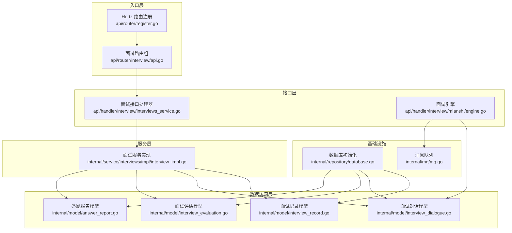
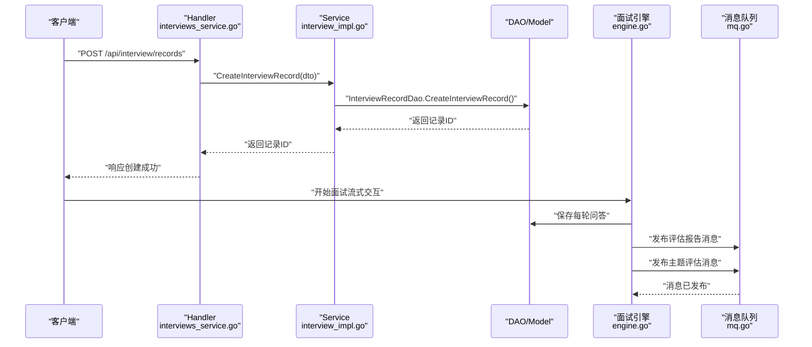
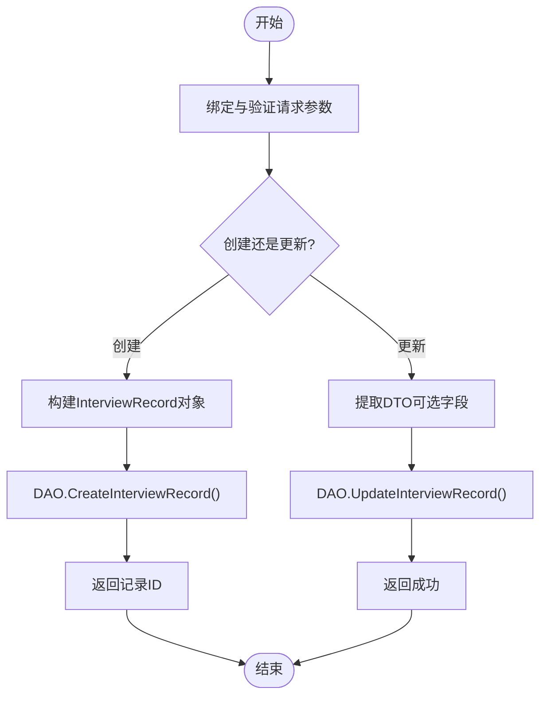
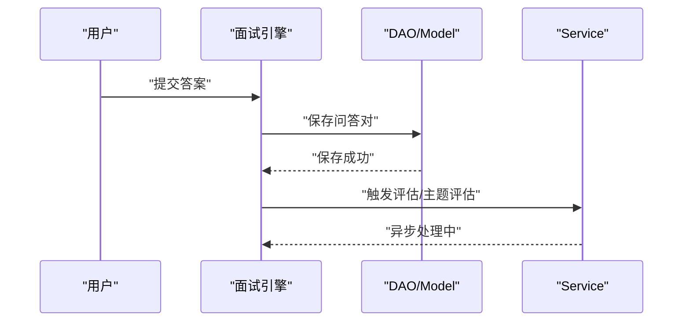
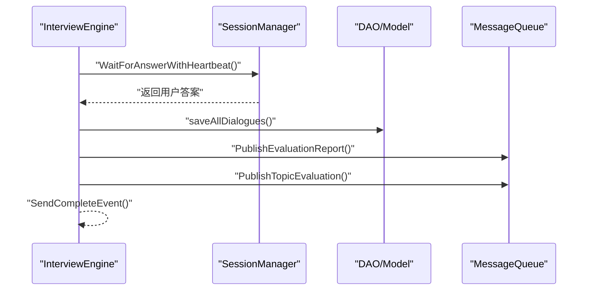
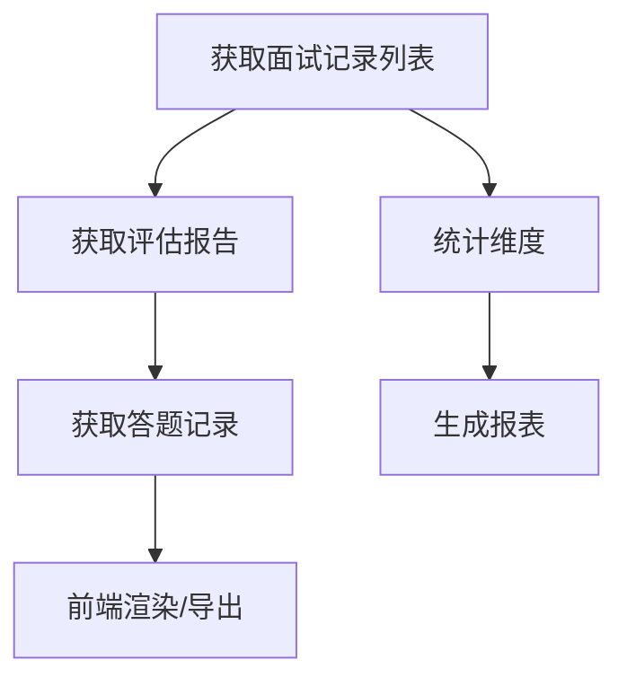
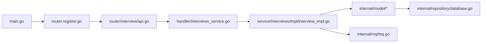

# 面试记录服务架构

<cite>
**本文档引用的文件**
- [backend/main.go](file://backend/main.go)
- [backend/api/router/register.go](file://backend/api/router/register.go)
- [backend/api/router/interview/api.go](file://backend/api/router/interview/api.go)
- [backend/api/handler/interview/interviews_service.go](file://backend/api/handler/interview/interviews_service.go)
- [backend/api/handler/interview/mianshi/engine.go](file://backend/api/handler/interview/mianshi/engine.go)
- [backend/api/handler/interview/mianshi/types.go](file://backend/api/handler/interview/mianshi/types.go)
- [backend/internal/model/interview_record.go](file://backend/internal/model/interview_record.go)
- [backend/internal/model/interview_dialogue.go](file://backend/internal/model/interview_dialogue.go)
- [backend/internal/model/interview_evaluation.go](file://backend/internal/model/interview_evaluation.go)
- [backend/internal/model/answer_report.go](file://backend/internal/model/answer_report.go)
- [backend/internal/service/interviews/impl/interview_impl.go](file://backend/internal/service/interviews/impl/interview_impl.go)
- [backend/internal/repository/database.go](file://backend/internal/repository/database.go)
- [backend/internal/mq/mq.go](file://backend/internal/mq/mq.go)
- [backend/idl/interviews/interviews.thrift](file://backend/idl/interviews/interviews.thrift)
</cite>

## 目录
1. [简介](#简介)
2. [项目结构](#项目结构)
3. [核心组件](#核心组件)
4. [架构总览](#架构总览)
5. [详细组件分析](#详细组件分析)
6. [依赖关系分析](#依赖关系分析)
7. [性能考虑](#性能考虑)
8. [故障排除指南](#故障排除指南)
9. [结论](#结论)
10. [附录](#附录)

## 简介
本架构文档围绕“面试记录服务”展开，系统性阐述面试记录的生命周期管理、数据持久化策略、查询优化机制、面试历史记录的存储结构与检索算法、与面试引擎的集成方式（数据同步与状态更新）、数据模型设计与索引策略、性能优化方案，以及导出、统计分析与报表生成机制。文档面向不同层次读者，既提供高层架构视图，也包含代码级细节与可视化图表。

## 项目结构
后端采用分层架构：入口层（Hertz路由与中间件）、接口层（Handler）、服务层（Service）、数据访问层（Model/DAO）、基础设施（数据库、消息队列、配置）。面试记录服务主要由以下模块协同完成：
- 路由注册与HTTP接口：负责REST API暴露与鉴权中间件
- Handler层：处理请求、绑定参数、调用服务层并返回响应
- Service层：业务编排，协调模型与外部服务
- Model层：数据模型与DAO方法，封装数据库操作
- Repository层：数据库初始化、连接池配置与自动迁移
- MQ层：消息发布/订阅，驱动异步任务（评估报告、主题评估）



**图表来源**
- [backend/api/router/register.go](file://backend/api/router/register.go#L11-L15)
- [backend/api/router/interview/api.go](file://backend/api/router/interview/api.go#L17-L103)
- [backend/api/handler/interview/interviews_service.go](file://backend/api/handler/interview/interviews_service.go#L26-L53)
- [backend/api/handler/interview/mianshi/engine.go](file://backend/api/handler/interview/mianshi/engine.go#L39-L230)
- [backend/internal/service/interviews/impl/interview_impl.go](file://backend/internal/service/interviews/impl/interview_impl.go#L19-L133)
- [backend/internal/model/interview_record.go](file://backend/internal/model/interview_record.go#L33-L81)
- [backend/internal/model/interview_dialogue.go](file://backend/internal/model/interview_dialogue.go#L29-L45)
- [backend/internal/model/interview_evaluation.go](file://backend/internal/model/interview_evaluation.go#L37-L89)
- [backend/internal/model/answer_report.go](file://backend/internal/model/answer_report.go#L56-L120)
- [backend/internal/repository/database.go](file://backend/internal/repository/database.go#L18-L80)
- [backend/internal/mq/mq.go](file://backend/internal/mq/mq.go#L155-L208)

**章节来源**
- [backend/main.go](file://backend/main.go#L29-L173)
- [backend/api/router/register.go](file://backend/api/router/register.go#L11-L15)
- [backend/api/router/interview/api.go](file://backend/api/router/interview/api.go#L17-L103)

## 核心组件
- 面试记录模型（InterviewRecord）：承载一次面试的基本元数据（类型、难度、领域、状态、耗时等），提供创建、查询、分页、更新、删除等DAO方法
- 面试对话模型（InterviewDialogue）：记录每轮问答对（问题、回答），支持按用户与报告ID查询
- 面试评估模型（InterviewEvaluation）：存储整体评价与多维度评分，支持按报告ID与用户ID查询
- 答题报告模型（AnswerReport）：以JSON结构存储答题记录明细（含评论、对话历史等）
- 面试服务实现（InterviewServiceImpl）：封装创建/更新记录、分页查询、获取评估与答题报告等业务流程
- 面试引擎（InterviewEngine）：驱动面试流程，生成问题、等待回答、保存对话、发布评估消息
- 消息队列（MQ）：发布评估报告与主题评估消息，供异步消费者处理
- 数据库初始化（Repository）：GORM初始化、连接池配置、自动迁移

**章节来源**
- [backend/internal/model/interview_record.go](file://backend/internal/model/interview_record.go#L9-L128)
- [backend/internal/model/interview_dialogue.go](file://backend/internal/model/interview_dialogue.go#L9-L46)
- [backend/internal/model/interview_evaluation.go](file://backend/internal/model/interview_evaluation.go#L9-L100)
- [backend/internal/model/answer_report.go](file://backend/internal/model/answer_report.go#L9-L121)
- [backend/internal/service/interviews/impl/interview_impl.go](file://backend/internal/service/interviews/impl/interview_impl.go#L11-L240)
- [backend/api/handler/interview/mianshi/engine.go](file://backend/api/handler/interview/mianshi/engine.go#L23-L291)
- [backend/internal/mq/mq.go](file://backend/internal/mq/mq.go#L12-L209)
- [backend/internal/repository/database.go](file://backend/internal/repository/database.go#L18-L80)

## 架构总览
系统通过Hertz路由注册统一入口，鉴权中间件保护接口，Handler层绑定参数并调用Service层，Service层协调Model层与MQ，最终完成面试记录的创建、对话的保存与评估报告的异步生成。数据库通过GORM自动迁移确保表结构一致性。



**图表来源**
- [backend/api/handler/interview/interviews_service.go](file://backend/api/handler/interview/interviews_service.go#L26-L53)
- [backend/internal/service/interviews/impl/interview_impl.go](file://backend/internal/service/interviews/impl/interview_impl.go#L19-L62)
- [backend/api/handler/interview/mianshi/engine.go](file://backend/api/handler/interview/mianshi/engine.go#L232-L230)
- [backend/internal/mq/mq.go](file://backend/internal/mq/mq.go#L155-L208)

## 详细组件分析

### 面试记录生命周期管理
- 创建：Handler接收DTO，Service转换并调用DAO创建记录，返回记录ID
- 更新：Service处理可选字段，DAO按非零值字段更新
- 列表：Service设置默认分页参数，DAO执行COUNT与LIMIT/OFFSET分页查询
- 删除：DAO按ID删除（模型层未见物理删除，实际可能软删除）



**图表来源**
- [backend/api/handler/interview/interviews_service.go](file://backend/api/handler/interview/interviews_service.go#L26-L53)
- [backend/internal/service/interviews/impl/interview_impl.go](file://backend/internal/service/interviews/impl/interview_impl.go#L19-L102)
- [backend/internal/model/interview_record.go](file://backend/internal/model/interview_record.go#L33-L127)

**章节来源**
- [backend/internal/service/interviews/impl/interview_impl.go](file://backend/internal/service/interviews/impl/interview_impl.go#L19-L133)
- [backend/internal/model/interview_record.go](file://backend/internal/model/interview_record.go#L33-L127)

### 数据持久化策略与查询优化
- 数据库初始化：GORM连接MySQL，配置连接池与日志；自动迁移所有模型表
- 索引策略：模型字段标注索引（如用户ID、报告ID、删除标记等），DAO查询条件尽量命中索引
- 分页查询：DAO使用COUNT统计总数，再LIMIT/OFFSET分页，按创建时间倒序
- JSON字段：评估与答题报告使用JSON序列化，便于扩展但需注意查询限制

```mermaid
classDiagram
class InterviewRecord {
+uint64 id
+uint user_id
+string type
+string difficulty
+string domain
+string company_name
+string position_name
+string status
+int64 duration
+time created_at
+time updated_at
}
class InterviewDialogue {
+uint64 id
+uint user_id
+uint64 report_id
+string question
+string answer
+time created_at
}
class InterviewEvaluation {
+uint64 id
+uint user_id
+uint64 report_id
+string comment
+float64 score
+EvaluationDimension[] dimensions
+int deleted
+time created_at
+time updated_at
}
class AnswerReport {
+uint64 id
+uint user_id
+uint64 report_id
+AnswerRecordItem[] records
+int deleted
+time created_at
+time updated_at
}
InterviewEvaluation --> InterviewRecord : "外键 : report_id"
AnswerReport --> InterviewRecord : "外键 : report_id"
InterviewDialogue --> InterviewRecord : "外键 : report_id"
```

**图表来源**
- [backend/internal/model/interview_record.go](file://backend/internal/model/interview_record.go#L10-L31)
- [backend/internal/model/interview_dialogue.go](file://backend/internal/model/interview_dialogue.go#L11-L27)
- [backend/internal/model/interview_evaluation.go](file://backend/internal/model/interview_evaluation.go#L10-L35)
- [backend/internal/model/answer_report.go](file://backend/internal/model/answer_report.go#L9-L54)

**章节来源**
- [backend/internal/repository/database.go](file://backend/internal/repository/database.go#L18-L80)
- [backend/internal/model/interview_record.go](file://backend/internal/model/interview_record.go#L57-L81)
- [backend/internal/model/interview_dialogue.go](file://backend/internal/model/interview_dialogue.go#L37-L45)
- [backend/internal/model/interview_evaluation.go](file://backend/internal/model/interview_evaluation.go#L55-L73)
- [backend/internal/model/answer_report.go](file://backend/internal/model/answer_report.go#L74-L92)

### 面试历史记录的存储结构与检索算法
- 存储结构：InterviewDialogue按轮次顺序存储，Question/Answer为TEXT字段；AnswerReport以JSON数组存储AnswerRecordItem，每个条目包含评论与对话历史
- 检索算法：按用户ID与报告ID排序查询；DAO提供按用户与报告ID的组合过滤；评估与答题报告提供按报告ID与用户ID的精确匹配
- 上下文保留：面试引擎在生成后续问题时，保留最近N道题的历史作为上下文，提升问题连贯性



**图表来源**
- [backend/api/handler/interview/mianshi/engine.go](file://backend/api/handler/interview/mianshi/engine.go#L232-L258)
- [backend/internal/model/interview_dialogue.go](file://backend/internal/model/interview_dialogue.go#L29-L45)
- [backend/internal/service/interviews/impl/interview_impl.go](file://backend/internal/service/interviews/impl/interview_impl.go#L210-L239)

**章节来源**
- [backend/api/handler/interview/mianshi/engine.go](file://backend/api/handler/interview/mianshi/engine.go#L42-L230)
- [backend/internal/model/interview_dialogue.go](file://backend/internal/model/interview_dialogue.go#L37-L45)
- [backend/internal/service/interviews/impl/interview_impl.go](file://backend/internal/service/interviews/impl/interview_impl.go#L210-L239)

### 与面试引擎的集成：数据同步与状态更新
- 引擎驱动：InterviewEngine在每次生成问题后等待用户回答，收到答案后保存到InterviewDialogue，并更新会话状态与问题计数
- 状态更新：会话状态在引擎中维护（active/paused/completed/failed），并在完成时发送SSE完成事件
- 数据同步：引擎完成后发布两条消息（评估报告与主题评估），由MQ消费者异步处理



**图表来源**
- [backend/api/handler/interview/mianshi/engine.go](file://backend/api/handler/interview/mianshi/engine.go#L166-L230)
- [backend/api/handler/interview/mianshi/types.go](file://backend/api/handler/interview/mianshi/types.go#L84-L149)
- [backend/internal/mq/mq.go](file://backend/internal/mq/mq.go#L155-L208)

**章节来源**
- [backend/api/handler/interview/mianshi/engine.go](file://backend/api/handler/interview/mianshi/engine.go#L23-L291)
- [backend/api/handler/interview/mianshi/types.go](file://backend/api/handler/interview/mianshi/types.go#L9-L165)
- [backend/internal/mq/mq.go](file://backend/internal/mq/mq.go#L155-L208)

### 数据模型设计、索引策略与性能优化
- 数据模型设计：采用清晰的三表模型（记录、对话、评估/答题报告），外键指向报告ID，保证数据完整性
- 索引策略：用户ID、报告ID、删除标记均建立索引，DAO查询条件尽量命中这些索引
- 性能优化：
  - 分页查询：先COUNT后LIMIT/OFFSET，避免全表扫描
  - JSON字段：仅在必要时读取，避免大字段频繁传输
  - 连接池：合理设置最大空闲/活跃连接数与生命周期
  - 异步处理：评估与主题评估通过MQ异步生成，降低RT

**章节来源**
- [backend/internal/model/interview_record.go](file://backend/internal/model/interview_record.go#L14-L25)
- [backend/internal/model/interview_dialogue.go](file://backend/internal/model/interview_dialogue.go#L16-L18)
- [backend/internal/model/interview_evaluation.go](file://backend/internal/model/interview_evaluation.go#L14-L19)
- [backend/internal/model/answer_report.go](file://backend/internal/model/answer_report.go#L14-L17)
- [backend/internal/repository/database.go](file://backend/internal/repository/database.go#L31-L44)

### 导出、统计分析与报表生成
- 导出：前端通过接口获取面试记录、评估报告与答题记录，结合前端展示组件实现导出
- 统计分析：服务层提供按报告ID的统计方法（如CountByReportID），可用于统计维度
- 报表生成：通过MQ发布评估报告消息，由消费者异步生成并存储到AnswerReport或InterviewEvaluation



**图表来源**
- [backend/internal/service/interviews/impl/interview_impl.go](file://backend/internal/service/interviews/impl/interview_impl.go#L169-L208)
- [backend/internal/model/interview_evaluation.go](file://backend/internal/model/interview_evaluation.go#L91-L99)
- [backend/internal/model/answer_report.go](file://backend/internal/model/answer_report.go#L102-L120)

**章节来源**
- [backend/internal/service/interviews/impl/interview_impl.go](file://backend/internal/service/interviews/impl/interview_impl.go#L169-L208)
- [backend/internal/model/interview_evaluation.go](file://backend/internal/model/interview_evaluation.go#L91-L99)
- [backend/internal/model/answer_report.go](file://backend/internal/model/answer_report.go#L102-L120)

## 依赖关系分析
- 入口依赖：main.go加载配置、初始化数据库与Redis、注册路由、启动Hertz服务器
- 路由依赖：GeneratedRegister调用面试路由注册，面试路由组映射到具体Handler
- 服务依赖：Handler依赖Service接口，Service依赖DAO模型，DAO依赖Repository数据库
- 引擎依赖：面试引擎依赖会话管理器、DAO与MQ
- MQ依赖：消息类型与负载结构明确，支持异步消费者处理



**图表来源**
- [backend/main.go](file://backend/main.go#L29-L128)
- [backend/api/router/register.go](file://backend/api/router/register.go#L11-L15)
- [backend/api/router/interview/api.go](file://backend/api/router/interview/api.go#L17-L103)
- [backend/api/handler/interview/interviews_service.go](file://backend/api/handler/interview/interviews_service.go#L26-L53)
- [backend/internal/service/interviews/impl/interview_impl.go](file://backend/internal/service/interviews/impl/interview_impl.go#L11-L240)
- [backend/internal/mq/mq.go](file://backend/internal/mq/mq.go#L12-L209)
- [backend/internal/repository/database.go](file://backend/internal/repository/database.go#L18-L80)

**章节来源**
- [backend/main.go](file://backend/main.go#L29-L128)
- [backend/api/router/interview/api.go](file://backend/api/router/interview/api.go#L17-L103)
- [backend/internal/mq/mq.go](file://backend/internal/mq/mq.go#L12-L209)

## 性能考虑
- 数据库层面：合理设置连接池参数，避免高并发下的连接争用；对高频查询字段建立索引
- 查询层面：分页查询先COUNT后LIMIT，避免一次性加载大量数据；对JSON字段按需读取
- 异步处理：评估与主题评估通过MQ异步生成，降低接口RT
- 缓存：可引入Redis缓存热点数据（如简历信息、用户偏好），减少数据库压力
- 日志与监控：开启GORM日志与慢查询分析，持续优化SQL

## 故障排除指南
- 数据库初始化失败：检查DSN配置、网络连通性与权限
- DAO未初始化：确保在main中调用SetDBGetter并完成自动迁移
- MQ未初始化：确认InitMessageQueue已调用，消费者已启动
- JWT鉴权失败：检查Token有效性与中间件跳过规则
- 接口返回Unauthorized：确认Handler中获取用户ID逻辑与鉴权中间件

**章节来源**
- [backend/internal/repository/database.go](file://backend/internal/repository/database.go#L18-L80)
- [backend/internal/mq/mq.go](file://backend/internal/mq/mq.go#L137-L153)
- [backend/api/handler/interview/interviews_service.go](file://backend/api/handler/interview/interviews_service.go#L36-L40)

## 结论
面试记录服务通过清晰的分层架构与完善的模型设计，实现了面试记录的全生命周期管理与高效的数据持久化。结合异步消息队列与合理的索引策略，系统在保证实时交互的同时兼顾了后台处理的稳定性与可扩展性。未来可在缓存、全文检索与向量化检索方面进一步优化，以支撑更大规模的面试场景与更复杂的检索需求。

## 附录
- Thrift接口定义：包含面试记录、评估、答题记录、简历等接口的IDL定义，用于前后端契约与SDK生成
- 路由注册：统一在GeneratedRegister中注册，面试路由组映射到具体Handler

**章节来源**
- [backend/idl/interviews/interviews.thrift](file://backend/idl/interviews/interviews.thrift#L35-L319)
- [backend/api/router/register.go](file://backend/api/router/register.go#L11-L15)