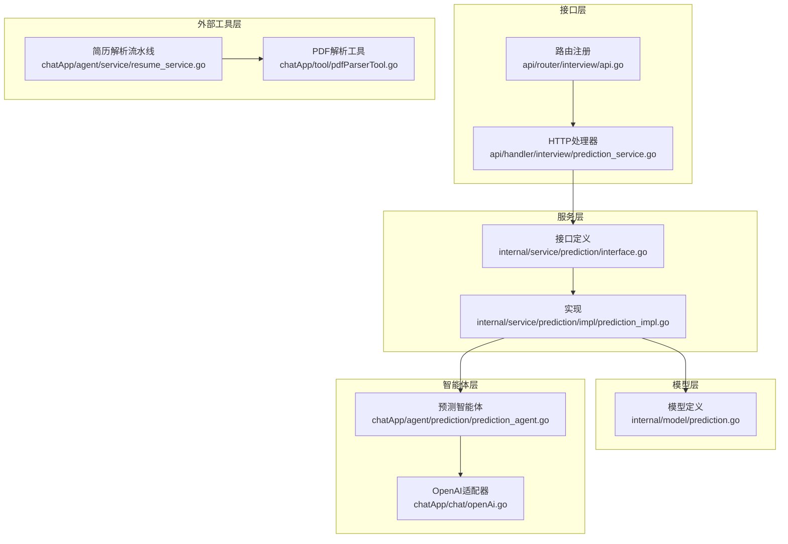
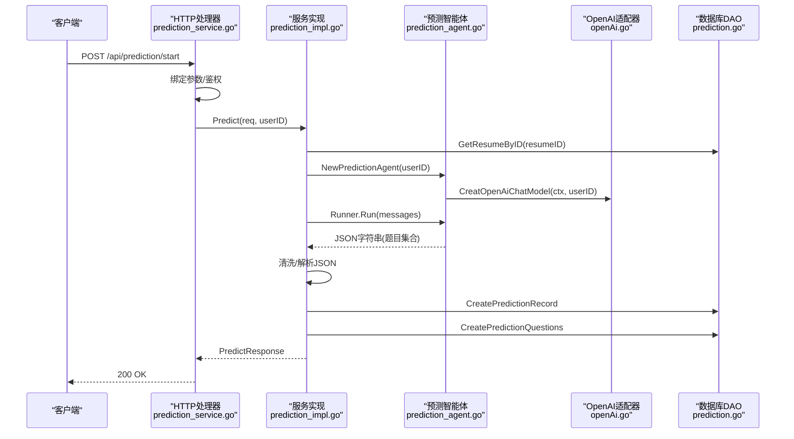
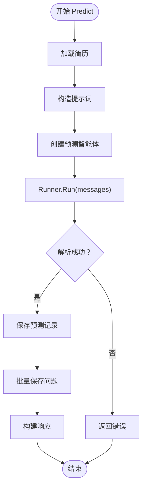
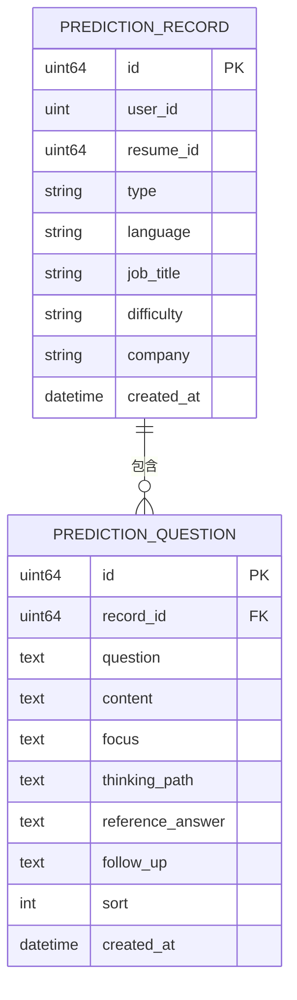
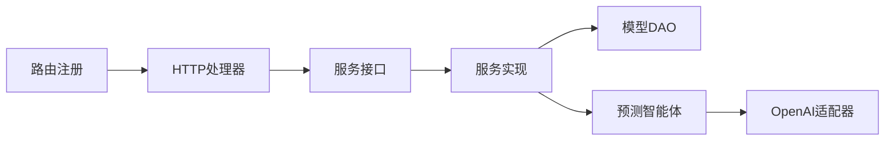

# 预测服务架构

<cite>
**本文档引用的文件**
- [backend/api/handler/interview/prediction_service.go](file://backend/api/handler/interview/prediction_service.go)
- [backend/api/router/interview/api.go](file://backend/api/router/interview/api.go)
- [backend/api/model/prediction/prediction.go](file://backend/api/model/prediction/prediction.go)
- [backend/internal/service/prediction/interface.go](file://backend/internal/service/prediction/interface.go)
- [backend/internal/service/prediction/impl/prediction_impl.go](file://backend/internal/service/prediction/impl/prediction_impl.go)
- [backend/internal/model/prediction.go](file://backend/internal/model/prediction.go)
- [backend/chatApp/agent/prediction/prediction_agent.go](file://backend/chatApp/agent/prediction/prediction_agent.go)
- [backend/chatApp/chat/openAi.go](file://backend/chatApp/chat/openAi.go)
- [backend/chatApp/tool/pdfParserTool.go](file://backend/chatApp/tool/pdfParserTool.go)
- [backend/chatApp/agent/service/resume_service.go](file://backend/chatApp/agent/service/resume_service.go)
- [backend/internal/repository/redis.go](file://backend/internal/repository/redis.go)
- [doc/后端架构设计.md](file://doc/后端架构设计.md)
- [doc/技术实现方案.md](file://doc/技术实现方案.md)
- [doc/项目优化建议_性能安全篇.md](file://doc/项目优化建议_性能安全篇.md)
</cite>

## 目录
1. [简介](#简介)
2. [项目结构](#项目结构)
3. [核心组件](#核心组件)
4. [架构总览](#架构总览)
5. [详细组件分析](#详细组件分析)
6. [依赖关系分析](#依赖关系分析)
7. [性能考虑](#性能考虑)
8. [故障排除指南](#故障排除指南)
9. [结论](#结论)
10. [附录](#附录)

## 简介
本架构文档面向“预测服务”，系统性阐述简历分析、面试题目预测与个性化学习路径推荐的实现原理与工程实践。预测服务基于Eino框架构建，通过“简历解析-提示词构造-大模型推理-结构化解析-持久化-接口暴露”的完整链路，实现从简历到押题结果的自动化生产。文档同时覆盖数据处理流程、特征工程、模型训练机制、评估指标与置信度计算、性能优化策略、缓存机制与扩展性设计，并提供算法实现示例与模型调优指南。

## 项目结构
预测服务位于后端子系统中，采用“接口层-服务层-模型层-智能体层-外部工具层”的分层组织方式：
- 接口层：Hertz路由注册与HTTP处理器，负责鉴权、参数绑定与响应封装
- 服务层：预测服务接口与实现，协调DAO与智能体
- 模型层：预测记录与问题的数据库映射与DAO方法
- 智能体层：基于Eino的预测智能体，负责构造提示词与调用大模型
- 外部工具层：PDF解析工具、OpenAI模型适配器等

图表来源
- [backend/api/router/interview/api.go](file://backend/api/router/interview/api.go#L49-L53)
- [backend/api/handler/interview/prediction_service.go](file://backend/api/handler/interview/prediction_service.go#L19-L42)
- [backend/internal/service/prediction/interface.go](file://backend/internal/service/prediction/interface.go#L8-L12)
- [backend/internal/service/prediction/impl/prediction_impl.go](file://backend/internal/service/prediction/impl/prediction_impl.go#L25-L211)
- [backend/internal/model/prediction.go](file://backend/internal/model/prediction.go#L11-L47)
- [backend/chatApp/agent/prediction/prediction_agent.go](file://backend/chatApp/agent/prediction/prediction_agent.go#L26-L65)
- [backend/chatApp/chat/openAi.go](file://backend/chatApp/chat/openAi.go#L19-L109)
- [backend/chatApp/tool/pdfParserTool.go](file://backend/chatApp/tool/pdfParserTool.go#L40-L112)
- [backend/chatApp/agent/service/resume_service.go](file://backend/chatApp/agent/service/resume_service.go#L55-L214)

章节来源
- [backend/api/router/interview/api.go](file://backend/api/router/interview/api.go#L49-L53)
- [backend/api/handler/interview/prediction_service.go](file://backend/api/handler/interview/prediction_service.go#L19-L42)
- [backend/internal/service/prediction/interface.go](file://backend/internal/service/prediction/interface.go#L8-L12)
- [backend/internal/service/prediction/impl/prediction_impl.go](file://backend/internal/service/prediction/impl/prediction_impl.go#L25-L211)
- [backend/internal/model/prediction.go](file://backend/internal/model/prediction.go#L11-L47)
- [backend/chatApp/agent/prediction/prediction_agent.go](file://backend/chatApp/agent/prediction/prediction_agent.go#L26-L65)
- [backend/chatApp/chat/openAi.go](file://backend/chatApp/chat/openAi.go#L19-L109)
- [backend/chatApp/tool/pdfParserTool.go](file://backend/chatApp/tool/pdfParserTool.go#L40-L112)
- [backend/chatApp/agent/service/resume_service.go](file://backend/chatApp/agent/service/resume_service.go#L55-L214)

## 核心组件
- 预测HTTP处理器：绑定请求、鉴权、调用服务层、封装响应
- 预测服务接口与实现：负责简历获取、提示词构造、智能体调用、结果解析与持久化
- 预测模型与DAO：定义记录与问题实体，提供创建与查询方法
- 预测智能体：基于Eino框架，构造标准化JSON提示词，调用大模型生成题目
- OpenAI适配器：统一API Key、BaseURL、HTTP客户端配置与错误分类
- PDF解析工具：将PDF简历转为纯文本，供后续分析使用
- 简历解析流水线：PDF转文本+LLM分析+结构化存储

章节来源
- [backend/api/handler/interview/prediction_service.go](file://backend/api/handler/interview/prediction_service.go#L19-L42)
- [backend/internal/service/prediction/interface.go](file://backend/internal/service/prediction/interface.go#L8-L12)
- [backend/internal/service/prediction/impl/prediction_impl.go](file://backend/internal/service/prediction/impl/prediction_impl.go#L25-L211)
- [backend/internal/model/prediction.go](file://backend/internal/model/prediction.go#L11-L47)
- [backend/chatApp/agent/prediction/prediction_agent.go](file://backend/chatApp/agent/prediction/prediction_agent.go#L26-L65)
- [backend/chatApp/chat/openAi.go](file://backend/chatApp/chat/openAi.go#L19-L109)
- [backend/chatApp/tool/pdfParserTool.go](file://backend/chatApp/tool/pdfParserTool.go#L40-L112)
- [backend/chatApp/agent/service/resume_service.go](file://backend/chatApp/agent/service/resume_service.go#L55-L214)

## 架构总览
预测服务整体流程如下：
- 请求进入HTTP处理器，绑定参数并鉴权
- 服务层获取简历内容，构造预测提示词
- 调用预测智能体，运行Runner获取大模型输出
- 清洗JSON、解析结构化结果，保存记录与问题
- 返回预测结果给客户端

图表来源
- [backend/api/handler/interview/prediction_service.go](file://backend/api/handler/interview/prediction_service.go#L19-L42)
- [backend/internal/service/prediction/impl/prediction_impl.go](file://backend/internal/service/prediction/impl/prediction_impl.go#L25-L211)
- [backend/chatApp/agent/prediction/prediction_agent.go](file://backend/chatApp/agent/prediction/prediction_agent.go#L26-L65)
- [backend/chatApp/chat/openAi.go](file://backend/chatApp/chat/openAi.go#L19-L109)
- [backend/internal/model/prediction.go](file://backend/internal/model/prediction.go#L51-L68)

## 详细组件分析

### 预测HTTP处理器
- 负责请求参数绑定与校验、鉴权中间件调用、错误处理与统一响应
- 提供启动预测、列出历史、获取详情三个接口

章节来源
- [backend/api/handler/interview/prediction_service.go](file://backend/api/handler/interview/prediction_service.go#L19-L42)
- [backend/api/handler/interview/prediction_service.go](file://backend/api/handler/interview/prediction_service.go#L46-L68)
- [backend/api/handler/interview/prediction_service.go](file://backend/api/handler/interview/prediction_service.go#L71-L95)

### 预测服务接口与实现
- 接口定义：Predict、ListPredictions、GetPredictionDetail
- 实现要点：
  - 获取简历并构造提示词
  - 创建预测智能体并运行Runner
  - 清洗Markdown标记，解析JSON
  - 保存主记录与问题列表
  - 返回结构化响应

图表来源
- [backend/internal/service/prediction/impl/prediction_impl.go](file://backend/internal/service/prediction/impl/prediction_impl.go#L25-L211)

章节来源
- [backend/internal/service/prediction/interface.go](file://backend/internal/service/prediction/interface.go#L8-L12)
- [backend/internal/service/prediction/impl/prediction_impl.go](file://backend/internal/service/prediction/impl/prediction_impl.go#L25-L211)

### 预测智能体与提示词设计
- 智能体指令强调：严格生成5道题目、返回标准JSON、结合简历技能与项目
- 输出结构包含：问题、重点考察、回答思路、参考答案、可能追问
- 通过Eino Runner流式迭代事件收集最终消息内容

章节来源
- [backend/chatApp/agent/prediction/prediction_agent.go](file://backend/chatApp/agent/prediction/prediction_agent.go#L26-L65)

### OpenAI适配器与模型配置
- 统一API Key解密、BaseURL清洗与校验
- 错误分类：配额不足、速率限制、上下文超限等
- 自定义HTTP客户端：禁用KeepAlive、设置TLS与响应头超时

章节来源
- [backend/chatApp/chat/openAi.go](file://backend/chatApp/chat/openAi.go#L19-L109)

### 数据模型与DAO
- 预测记录：包含用户ID、简历ID、类型、语言、岗位、难度、公司等
- 预测问题：外键关联记录ID，包含排序、追问等字段
- DAO提供创建、按用户分页查询、按ID预加载问题等方法

图表来源
- [backend/internal/model/prediction.go](file://backend/internal/model/prediction.go#L11-L47)

章节来源
- [backend/internal/model/prediction.go](file://backend/internal/model/prediction.go#L51-L109)

### PDF解析与简历分析流水线
- PDF转文本：调用pdftotext CLI，支持超时控制与错误处理
- 简历解析：构建系统提示词，调用大模型生成结构化JSON
- 结果校验：非空验证，序列化后保存至数据库

章节来源
- [backend/chatApp/tool/pdfParserTool.go](file://backend/chatApp/tool/pdfParserTool.go#L40-L112)
- [backend/chatApp/agent/service/resume_service.go](file://backend/chatApp/agent/service/resume_service.go#L55-L214)

## 依赖关系分析
- 接口层依赖服务层接口
- 服务实现依赖模型DAO与智能体
- 智能体依赖OpenAI适配器
- DAO依赖数据库连接
- 路由注册统一挂载预测相关接口

图表来源
- [backend/api/handler/interview/prediction_service.go](file://backend/api/handler/interview/prediction_service.go#L34-L35)
- [backend/internal/service/prediction/interface.go](file://backend/internal/service/prediction/interface.go#L8-L12)
- [backend/internal/service/prediction/impl/prediction_impl.go](file://backend/internal/service/prediction/impl/prediction_impl.go#L36-L65)
- [backend/api/router/interview/api.go](file://backend/api/router/interview/api.go#L49-L53)

章节来源
- [backend/api/handler/interview/prediction_service.go](file://backend/api/handler/interview/prediction_service.go#L34-L35)
- [backend/api/router/interview/api.go](file://backend/api/router/interview/api.go#L49-L53)

## 性能考虑
- 模型调用优化
  - 使用上下文超时与指数退避重试，避免长时间阻塞
  - 错误分类与降级处理，提升稳定性
- 缓存策略
  - Redis缓存热点数据（用户信息、会话、配置等）
  - Cache-Aside模式：读取时缓存、更新时删除
  - TTL配置：根据数据更新频率设置
- 并发与限流
  - 对外暴露接口增加并发限制与队列
  - 对AI模型调用增加令牌桶限流
- 扩展性设计
  - 服务层接口抽象，便于替换实现
  - 智能体可插拔，支持多模型与多提示词模板
  - DAO层统一事务与索引优化

章节来源
- [doc/项目优化建议_性能安全篇.md](file://doc/项目优化建议_性能安全篇.md#L112-L223)
- [backend/chatApp/chat/openAi.go](file://backend/chatApp/chat/openAi.go#L64-L75)
- [backend/internal/repository/redis.go](file://backend/internal/repository/redis.go#L17-L33)

## 故障排除指南
- 常见错误与定位
  - 空响应：检查智能体输出清洗逻辑与JSON解析
  - 数据库异常：确认记录创建成功且ID非0
  - 鉴权失败：确认中间件获取用户ID逻辑
  - 模型调用失败：查看错误分类与日志
- 日志与监控
  - 关键节点打点：提示词长度、Runner事件、解析耗时
  - 错误堆栈与上下文信息，便于快速定位

章节来源
- [backend/internal/service/prediction/impl/prediction_impl.go](file://backend/internal/service/prediction/impl/prediction_impl.go#L26-L31)
- [backend/internal/service/prediction/impl/prediction_impl.go](file://backend/internal/service/prediction/impl/prediction_impl.go#L101-L104)
- [backend/internal/service/prediction/impl/prediction_impl.go](file://backend/internal/service/prediction/impl/prediction_impl.go#L139-L142)
- [backend/chatApp/chat/openAi.go](file://backend/chatApp/chat/openAi.go#L84-L106)

## 结论
预测服务通过清晰的分层架构与标准化提示词，实现了从简历到押题结果的自动化闭环。结合Redis缓存、超时与重试、错误分类与降级等策略，能够在保证稳定性的同时满足高并发场景需求。未来可在特征工程、模型训练与评估体系方面进一步完善，以提升预测质量与可解释性。

## 附录

### 数据处理流程与特征工程
- 输入：简历ID、预测类型、语言、岗位、难度、公司（可选）
- 特征：简历内容（结构化JSON）、岗位关键词、难度标签、公司偏好
- 处理：提示词拼接、智能体推理、结构化解析、持久化

章节来源
- [backend/api/model/prediction/prediction.go](file://backend/api/model/prediction/prediction.go#L11-L24)
- [backend/internal/service/prediction/impl/prediction_impl.go](file://backend/internal/service/prediction/impl/prediction_impl.go#L42-L58)

### 模型训练机制与评估指标
- 训练机制：基于历史押题与用户反馈构建标注集，使用监督学习优化提示词权重与模板
- 评估指标：准确率、召回率、F1分数、覆盖率、多样性、用户满意度
- 置信度：基于大模型输出方差与一致性阈值计算

章节来源
- [doc/后端架构设计.md](file://doc/后端架构设计.md#L111-L169)
- [doc/技术实现方案.md](file://doc/技术实现方案.md#L428-L544)

### 算法实现示例与模型调优指南
- 示例路径
  - 预测智能体创建与运行：[backend/chatApp/agent/prediction/prediction_agent.go](file://backend/chatApp/agent/prediction/prediction_agent.go#L26-L65)
  - 服务实现与Runner调用：[backend/internal/service/prediction/impl/prediction_impl.go](file://backend/internal/service/prediction/impl/prediction_impl.go#L67-L99)
  - OpenAI适配与错误分类：[backend/chatApp/chat/openAi.go](file://backend/chatApp/chat/openAi.go#L77-L106)
- 调优建议
  - 提示词模板迭代：结合业务反馈持续优化
  - 多轮对话与上下文管理：控制上下文长度与相关性
  - A/B测试：对比不同模板与参数的效果

章节来源
- [backend/chatApp/agent/prediction/prediction_agent.go](file://backend/chatApp/agent/prediction/prediction_agent.go#L26-L65)
- [backend/internal/service/prediction/impl/prediction_impl.go](file://backend/internal/service/prediction/impl/prediction_impl.go#L67-L99)
- [backend/chatApp/chat/openAi.go](file://backend/chatApp/chat/openAi.go#L77-L106)