# 数据架构设计

<cite>
**本文引用的文件**   
- [backend/internal/model/user.go](file://backend/internal/model/user.go)
- [backend/internal/model/interview_record.go](file://backend/internal/model/interview_record.go)
- [backend/internal/model/resume.go](file://backend/internal/model/resume.go)
- [backend/internal/model/interview_evaluation.go](file://backend/internal/model/interview_evaluation.go)
- [backend/internal/model/answer_report.go](file://backend/internal/model/answer_report.go)
- [backend/internal/model/interview_dialogue.go](file://backend/internal/model/interview_dialogue.go)
- [backend/internal/model/prediction.go](file://backend/internal/model/prediction.go)
- [backend/internal/model/transaction.go](file://backend/internal/model/transaction.go)
- [backend/internal/repository/database.go](file://backend/internal/repository/database.go)
- [backend/internal/repository/redis.go](file://backend/internal/repository/redis.go)
- [backend/internal/config/config.go](file://backend/internal/config/config.go)
- [backend/internal/service/interviews/impl/interview_impl.go](file://backend/internal/service/interviews/impl/interview_impl.go)
- [backend/internal/service/user/impl/user_impl.go](file://backend/internal/service/user/impl/user_impl.go)
</cite>

## 目录
1. [简介](#简介)
2. [项目结构](#项目结构)
3. [核心组件](#核心组件)
4. [架构总览](#架构总览)
5. [详细组件分析](#详细组件分析)
6. [依赖分析](#依赖分析)
7. [性能考虑](#性能考虑)
8. [故障排查指南](#故障排查指南)
9. [结论](#结论)
10. [附录](#附录)

## 简介
本文件面向“面试吧AI智能面试平台”，提供系统化的数据架构设计说明。内容涵盖数据库设计原则、表结构与字段设计、数据模型映射、DAO/ORM与事务管理、缓存策略、索引与查询优化、数据安全与备份恢复、迁移策略，以及扩展性与大数据量处理方案。目标是在保证一致性与可维护性的前提下，支撑高并发与持续演进。

## 项目结构
后端采用分层架构：配置层、仓库层（数据库/缓存）、模型层（GORM ORM）、服务层（业务逻辑）、API层（路由与中间件）。数据持久化通过 GORM MySQL 实现，缓存通过 Redis 提供，配置由 YAML 文件集中管理。

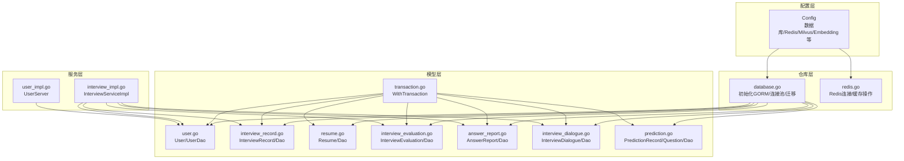

图表来源
- [backend/internal/repository/database.go](file://backend/internal/repository/database.go#L18-L81)
- [backend/internal/repository/redis.go](file://backend/internal/repository/redis.go#L16-L54)
- [backend/internal/model/user.go](file://backend/internal/model/user.go#L11-L116)
- [backend/internal/model/interview_record.go](file://backend/internal/model/interview_record.go#L9-L128)
- [backend/internal/model/resume.go](file://backend/internal/model/resume.go#L9-L170)
- [backend/internal/model/interview_evaluation.go](file://backend/internal/model/interview_evaluation.go#L9-L100)
- [backend/internal/model/answer_report.go](file://backend/internal/model/answer_report.go#L9-L121)
- [backend/internal/model/interview_dialogue.go](file://backend/internal/model/interview_dialogue.go#L9-L46)
- [backend/internal/model/prediction.go](file://backend/internal/model/prediction.go#L11-L110)
- [backend/internal/model/transaction.go](file://backend/internal/model/transaction.go#L11-L59)
- [backend/internal/service/interviews/impl/interview_impl.go](file://backend/internal/service/interviews/impl/interview_impl.go#L19-L240)
- [backend/internal/service/user/impl/user_impl.go](file://backend/internal/service/user/impl/user_impl.go#L34-L365)

章节来源
- [backend/internal/repository/database.go](file://backend/internal/repository/database.go#L18-L81)
- [backend/internal/repository/redis.go](file://backend/internal/repository/redis.go#L16-L54)
- [backend/internal/config/config.go](file://backend/internal/config/config.go#L64-L83)

## 核心组件
- 数据库层：GORM + MySQL，连接池与自动迁移在仓库层统一初始化。
- 缓存层：Redis，提供键值缓存与过期控制。
- 模型层：以 GORM 结构体定义表结构，配套 Dao 方法封装 CRUD。
- 事务层：统一的 WithTransaction 封装，自动 Begin/Commit/Rollback 与 panic兜底。
- 服务层：业务编排，调用 Dao 完成数据持久化与查询。

章节来源
- [backend/internal/repository/database.go](file://backend/internal/repository/database.go#L18-L81)
- [backend/internal/repository/redis.go](file://backend/internal/repository/redis.go#L16-L54)
- [backend/internal/model/transaction.go](file://backend/internal/model/transaction.go#L11-L59)

## 架构总览
系统数据流自上而下：API/服务层接收请求，调用 Dao 层进行数据库操作；必要时通过 WithTransaction 确保原子性；热点数据通过 Redis 缓存加速读取；配置中心集中管理数据库与缓存参数。

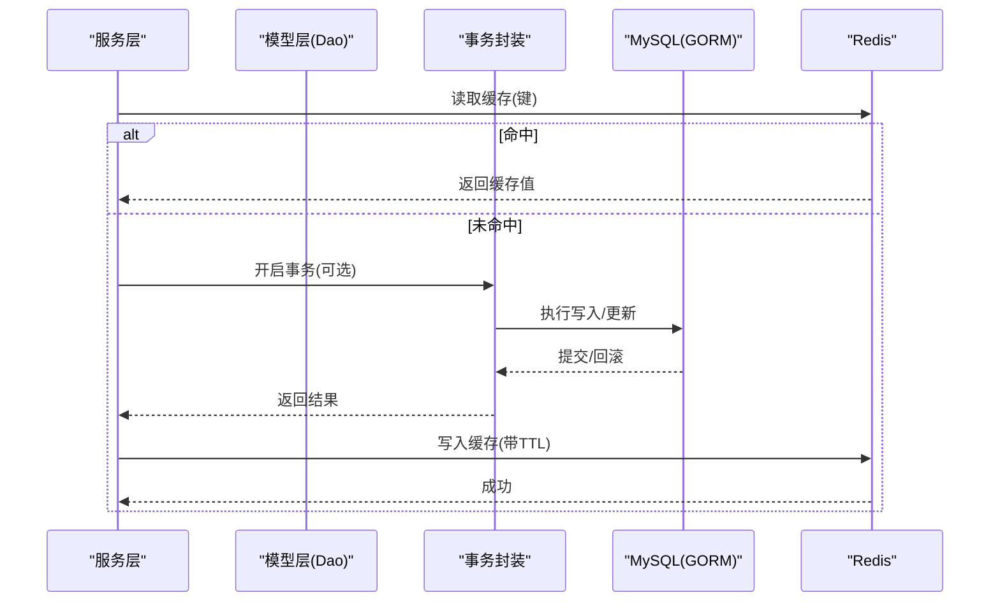

图表来源
- [backend/internal/model/transaction.go](file://backend/internal/model/transaction.go#L11-L59)
- [backend/internal/repository/database.go](file://backend/internal/repository/database.go#L18-L81)
- [backend/internal/repository/redis.go](file://backend/internal/repository/redis.go#L40-L54)

## 详细组件分析

### 用户(User)表
- 字段设计
  - 主键自增ID
  - 唯一用户名、唯一邮箱
  - 密码哈希、角色
  - 微信OpenID/UnionID、昵称、头像
  - 软删除索引
- 关系与约束
  - 多处查询基于唯一索引（用户名/邮箱、微信OpenID/UnionID）
  - 软删除字段配合索引，便于快速过滤
- DAO能力
  - 按用户名/邮箱、邮箱、ID、微信OpenID 查询
  - 按ID更新部分字段
  - 创建用户

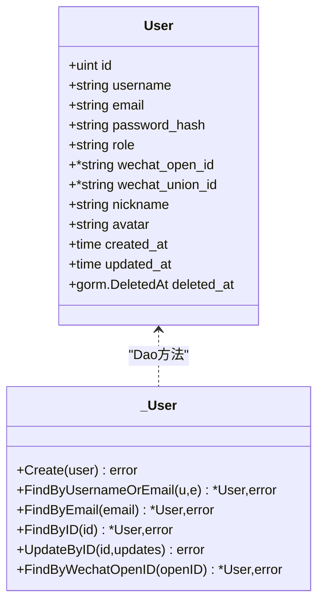

图表来源
- [backend/internal/model/user.go](file://backend/internal/model/user.go#L11-L116)

章节来源
- [backend/internal/model/user.go](file://backend/internal/model/user.go#L11-L116)

### 面试记录(InterviewRecord)表
- 字段设计
  - 主键自增ID
  - 用户ID、面试类型、难度、领域
  - 公司/岗位名称
  - 状态、时长
  - 时间戳（毫秒级）
- 关系与约束
  - 用户ID建立索引，支持按用户分页查询
  - 状态、时长可增量更新
- DAO能力
  - 创建、按ID查询、按用户分页列表、条件更新、删除

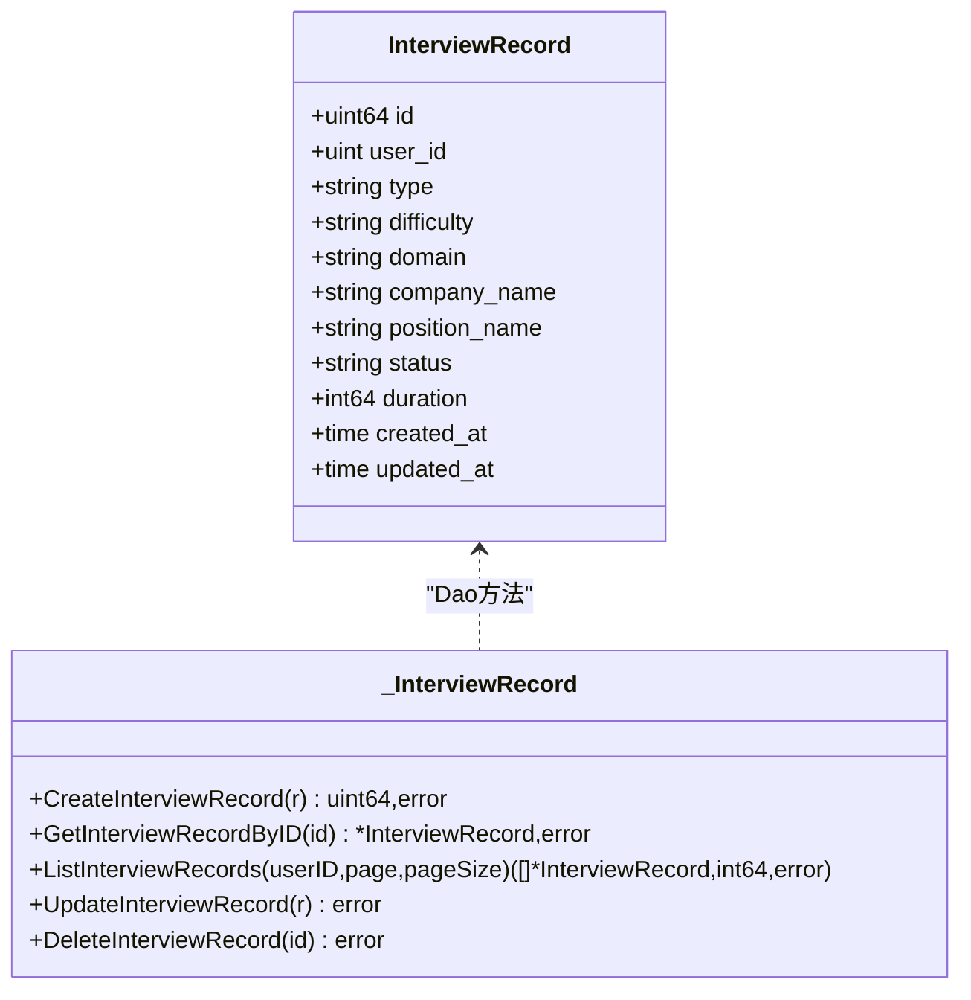

图表来源
- [backend/internal/model/interview_record.go](file://backend/internal/model/interview_record.go#L9-L128)

章节来源
- [backend/internal/model/interview_record.go](file://backend/internal/model/interview_record.go#L9-L128)

### 简历(Resume)表
- 字段设计
  - 主键自增ID、用户ID、简历内容（长文本）、文件名/大小/类型
  - 默认简历标记、软删除标记
  - 时间戳（毫秒级）
- 关系与约束
  - 用户ID索引、删除标记索引
  - 默认简历字段用于优先展示
- DAO能力
  - 创建、按ID/用户查询、默认简历查询、更新、软删除、分页列表、统计数量

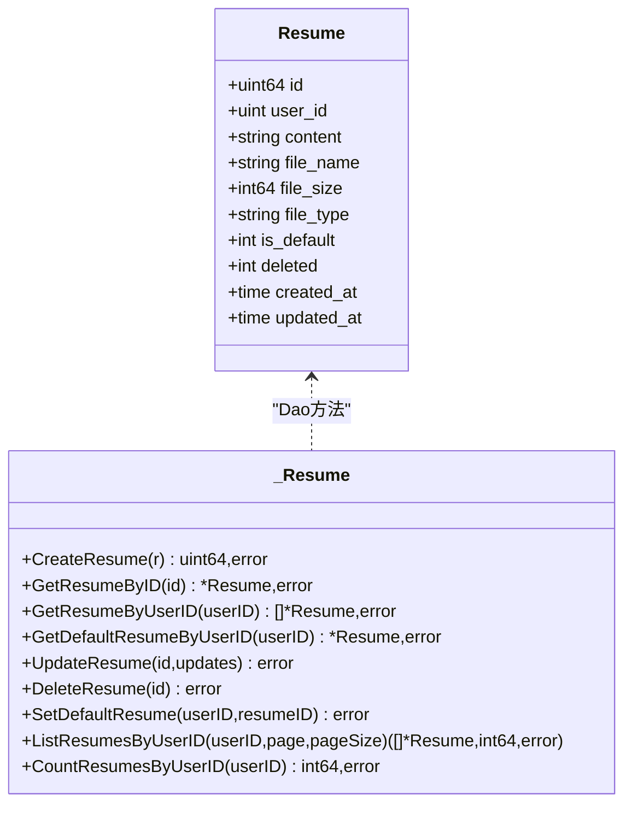

图表来源
- [backend/internal/model/resume.go](file://backend/internal/model/resume.go#L9-L170)

章节来源
- [backend/internal/model/resume.go](file://backend/internal/model/resume.go#L9-L170)

### 面试评估(InterviewEvaluation)表
- 字段设计
  - 主键ID、用户ID、报告ID
  - 总评语、总分、JSON维度数组
  - 软删除、时间戳（毫秒级）
- 关系与约束
  - 用户ID/报告ID/删除标记建立复合索引
  - 维度数组以JSON存储，便于灵活扩展
- DAO能力
  - 创建、按ID/报告ID/用户+报告ID查询、更新、软删除、统计

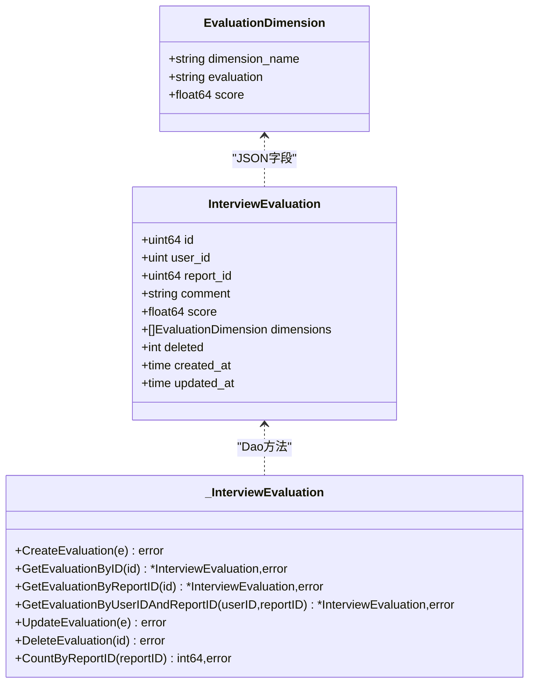

图表来源
- [backend/internal/model/interview_evaluation.go](file://backend/internal/model/interview_evaluation.go#L9-L100)

章节来源
- [backend/internal/model/interview_evaluation.go](file://backend/internal/model/interview_evaluation.go#L9-L100)

### 答题报告(AnswerReport)表
- 字段设计
  - 主键ID、用户ID、报告ID
  - JSON记录数组，包含问题顺序、内容、评论、对话列表
  - 软删除、时间戳（毫秒级）
- 关系与约束
  - 用户ID/报告ID/删除标记索引
  - 记录数组以JSON存储，便于扩展答题细节
- DAO能力
  - 创建、按ID/报告ID/用户+报告ID查询、软删除、统计、列表

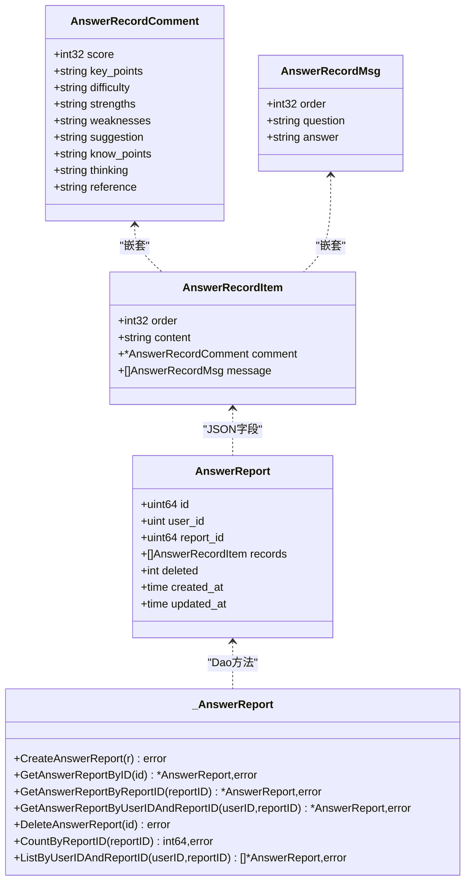

图表来源
- [backend/internal/model/answer_report.go](file://backend/internal/model/answer_report.go#L9-L121)

章节来源
- [backend/internal/model/answer_report.go](file://backend/internal/model/answer_report.go#L9-L121)

### 面试对话(InterviewDialogue)表
- 字段设计
  - 主键ID、用户ID、报告ID
  - 提问内容、回答内容
  - 时间戳（毫秒级）
- 关系与约束
  - 用户ID/报告ID索引，支持按用户与报告排序查询
- DAO能力
  - 创建、按用户+报告查询对话列表

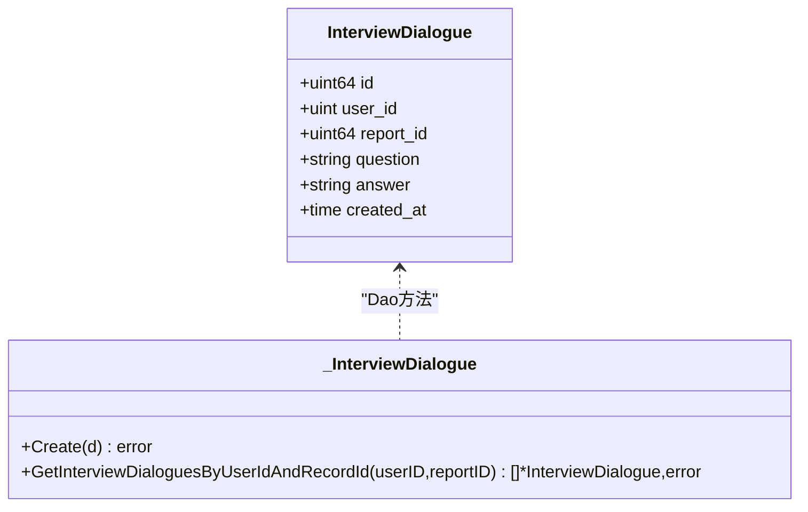

图表来源
- [backend/internal/model/interview_dialogue.go](file://backend/internal/model/interview_dialogue.go#L9-L46)

章节来源
- [backend/internal/model/interview_dialogue.go](file://backend/internal/model/interview_dialogue.go#L9-L46)

### 押题记录(PredictionRecord)与题目(PredictionQuestion)表
- 字段设计
  - 押题记录：主键、用户ID、简历ID、类型/语言/岗位/难度/公司、时间戳
  - 题目：主键、押题记录ID、问题、重点内容/考察、思路、参考答案、可能追问、排序、时间戳
- 关系与约束
  - 题目外键关联记录，CASCADE 级联
  - 记录与题目均建立索引，按排序升序预加载
- DAO能力
  - 创建记录与题目、按ID/用户查询、分页+预加载

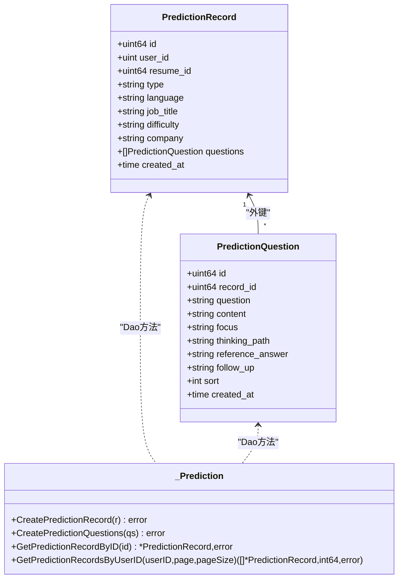

图表来源
- [backend/internal/model/prediction.go](file://backend/internal/model/prediction.go#L11-L110)

章节来源
- [backend/internal/model/prediction.go](file://backend/internal/model/prediction.go#L11-L110)

### 数据访问层与事务管理
- DAO模式
  - 每个实体对应一个结构体与一个 Dao 结构体，方法集中在 Dao 上，便于测试与替换
  - 通过全局 getDB 获取 GORM 实例，统一初始化于仓库层
- 事务封装
  - WithTransaction 自动 Begin/Commit/Rollback，并对 panic 进行兜底回滚
  - 支持上下文绑定，便于链路追踪
- 服务层调用
  - 服务层在需要时调用 WithTransaction 包裹复杂写入流程
  - 读多写少场景优先走缓存

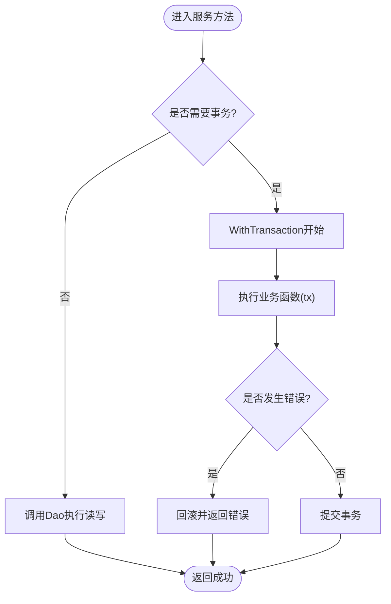

图表来源
- [backend/internal/model/transaction.go](file://backend/internal/model/transaction.go#L11-L59)

章节来源
- [backend/internal/model/transaction.go](file://backend/internal/model/transaction.go#L11-L59)
- [backend/internal/service/interviews/impl/interview_impl.go](file://backend/internal/service/interviews/impl/interview_impl.go#L19-L240)
- [backend/internal/service/user/impl/user_impl.go](file://backend/internal/service/user/impl/user_impl.go#L34-L365)

## 依赖分析
- 数据库初始化与迁移
  - 仓库层统一初始化 GORM、连接池、自动迁移，注册模型
- 配置驱动
  - 数据库与 Redis 配置来自 YAML，运行时加载并传入初始化函数
- 服务层依赖
  - 服务层仅依赖 Dao 接口风格的结构体方法，降低耦合
- 外部依赖
  - GORM、MySQL驱动、Redis 客户端

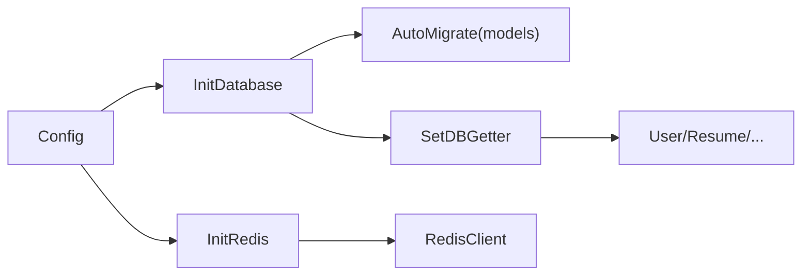

图表来源
- [backend/internal/repository/database.go](file://backend/internal/repository/database.go#L18-L81)
- [backend/internal/config/config.go](file://backend/internal/config/config.go#L64-L83)
- [backend/internal/repository/redis.go](file://backend/internal/repository/redis.go#L16-L54)

章节来源
- [backend/internal/repository/database.go](file://backend/internal/repository/database.go#L18-L81)
- [backend/internal/config/config.go](file://backend/internal/config/config.go#L64-L83)
- [backend/internal/repository/redis.go](file://backend/internal/repository/redis.go#L16-L54)

## 性能考虑
- 索引与查询优化
  - 用户：用户名/邮箱唯一索引、微信OpenID/UnionID唯一索引、软删除索引
  - 面试记录：用户ID索引、状态与时长字段按需更新
  - 简历：用户ID索引、删除标记索引、默认简历标记
  - 评估/答题报告：用户ID/报告ID/删除标记复合索引
  - 对高频查询字段建立合适索引，避免全表扫描
- 连接池与超时
  - 通过配置设置最大连接数、空闲连接数、连接最大生命周期
- 缓存策略
  - 热点读：用户资料、会话、配置等设置短TTL
  - 写后失效：更新后删除缓存键，避免脏读
  - 缓存层抽象：统一的 Set/Get/Delete 接口，便于替换实现
- 分页与排序
  - 列表查询使用 LIMIT/OFFSET，结合索引排序
  - 对时间字段使用毫秒级时间戳，提升排序精度
- 事务与并发
  - 复杂写入使用 WithTransaction，减少锁竞争
  - 避免长事务，尽早提交
- 向量化检索（可选）
  - Milvus/Embedding 已在工程中存在，可用于大文档检索与推荐，与关系型数据互补

章节来源
- [backend/internal/repository/database.go](file://backend/internal/repository/database.go#L18-L81)
- [backend/internal/config/config.go](file://backend/internal/config/config.go#L64-L83)
- [backend/internal/repository/redis.go](file://backend/internal/repository/redis.go#L16-L54)

## 故障排查指南
- 数据库连接失败
  - 检查 DSN、连接池参数、网络连通性
  - 查看初始化日志输出
- 迁移失败
  - 检查 AutoMigrate 的模型列表与字段变更
  - 确认数据库权限与字符集
- 事务异常
  - 观察 WithTransaction 的 panic/回滚日志
  - 确认业务函数返回错误即回滚
- 缓存异常
  - 检查 Redis 地址、认证、TTL 设置
  - 使用 GetCache/Exists 判断缓存命中情况
- 服务层错误
  - 用户登录/注册：核对密码哈希兼容逻辑与微信回调流程
  - 面试记录：核对分页参数与索引使用

章节来源
- [backend/internal/repository/database.go](file://backend/internal/repository/database.go#L18-L81)
- [backend/internal/model/transaction.go](file://backend/internal/model/transaction.go#L11-L59)
- [backend/internal/repository/redis.go](file://backend/internal/repository/redis.go#L16-L54)
- [backend/internal/service/user/impl/user_impl.go](file://backend/internal/service/user/impl/user_impl.go#L34-L365)
- [backend/internal/service/interviews/impl/interview_impl.go](file://backend/internal/service/interviews/impl/interview_impl.go#L19-L240)

## 结论
本数据架构以 GORM 为核心，结合统一的 Dao/事务封装与 Redis 缓存，形成清晰的分层与职责边界。通过合理的索引与分页策略、连接池配置与缓存治理，满足高并发与可维护性的需求。面向未来，可在保持模块化与接口化的基础上，逐步引入微服务与事件驱动，进一步提升扩展性与弹性。

## 附录

### 数据模型ER图
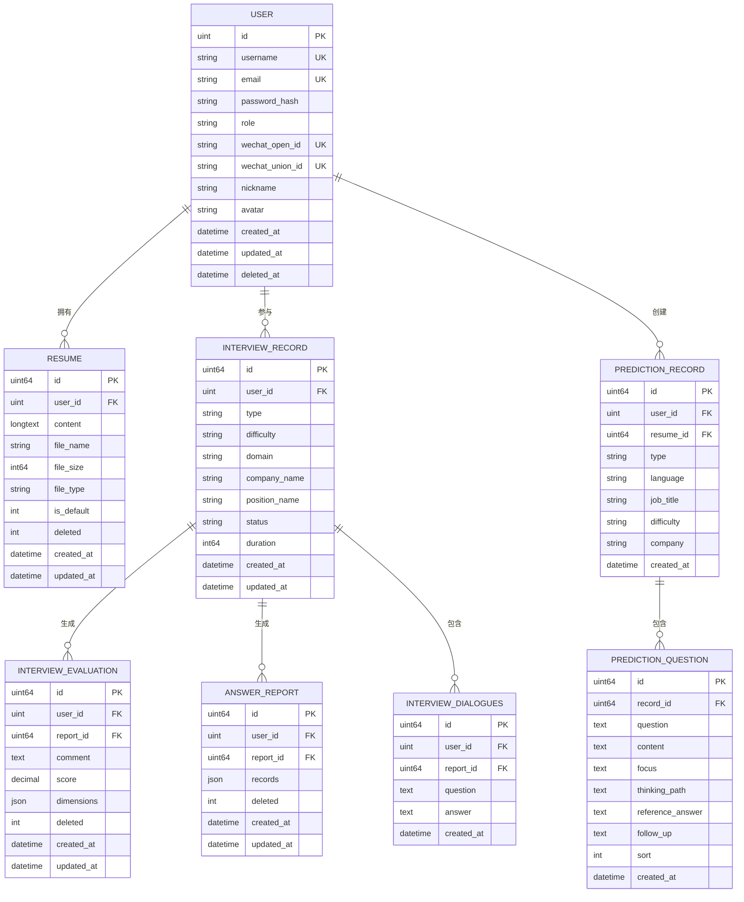

图表来源
- [backend/internal/model/user.go](file://backend/internal/model/user.go#L11-L116)
- [backend/internal/model/resume.go](file://backend/internal/model/resume.go#L9-L170)
- [backend/internal/model/interview_record.go](file://backend/internal/model/interview_record.go#L9-L128)
- [backend/internal/model/interview_evaluation.go](file://backend/internal/model/interview_evaluation.go#L9-L100)
- [backend/internal/model/answer_report.go](file://backend/internal/model/answer_report.go#L9-L121)
- [backend/internal/model/interview_dialogue.go](file://backend/internal/model/interview_dialogue.go#L9-L46)
- [backend/internal/model/prediction.go](file://backend/internal/model/prediction.go#L11-L110)