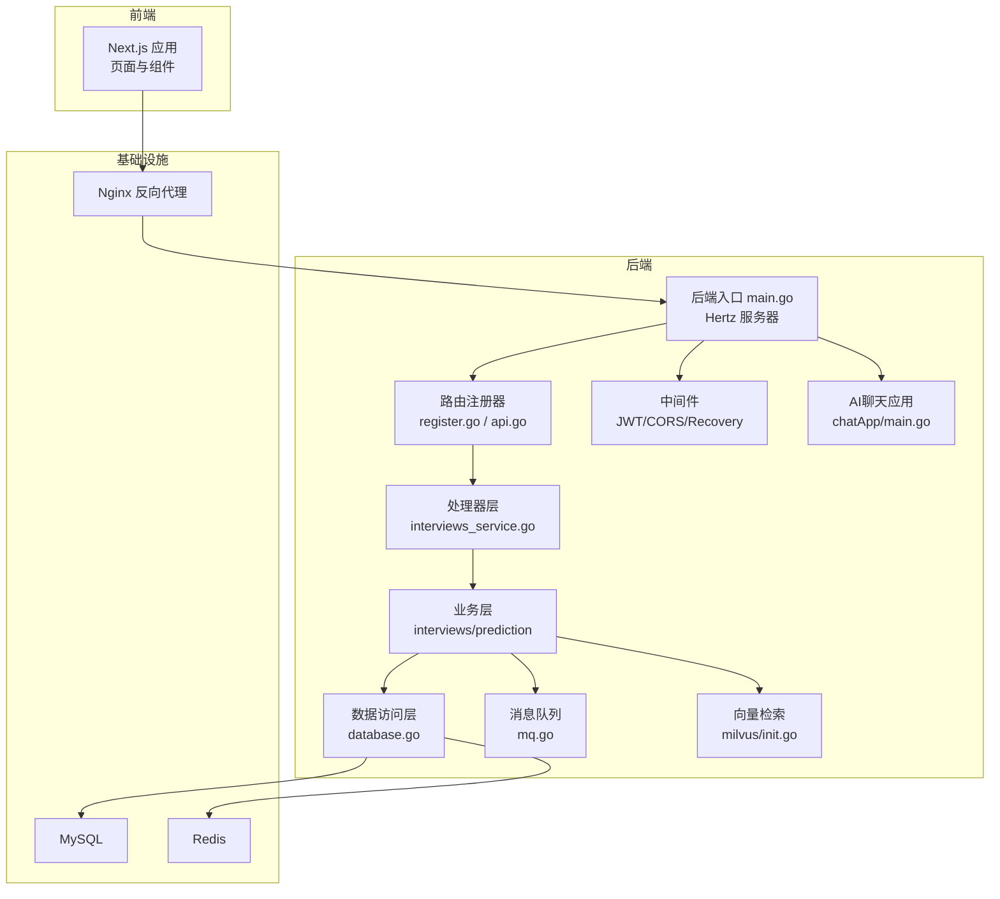
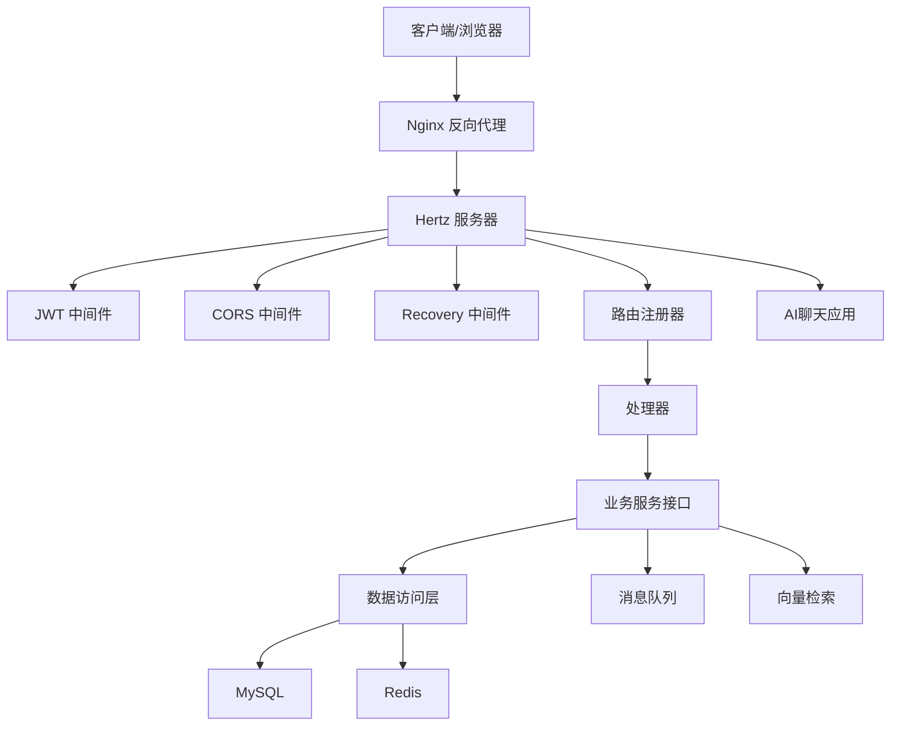
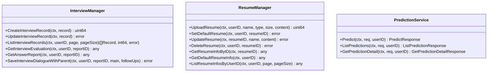
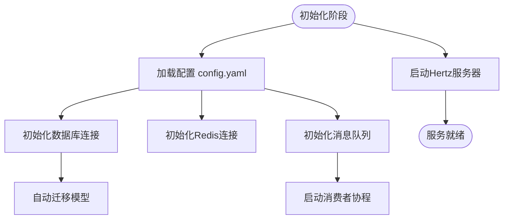
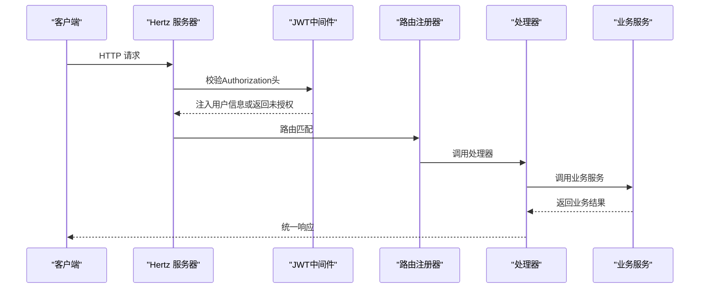
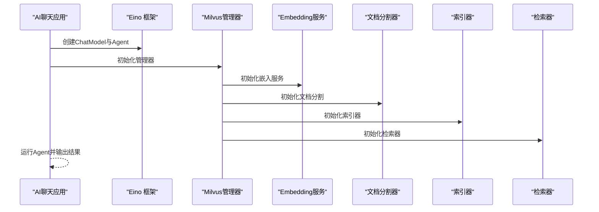
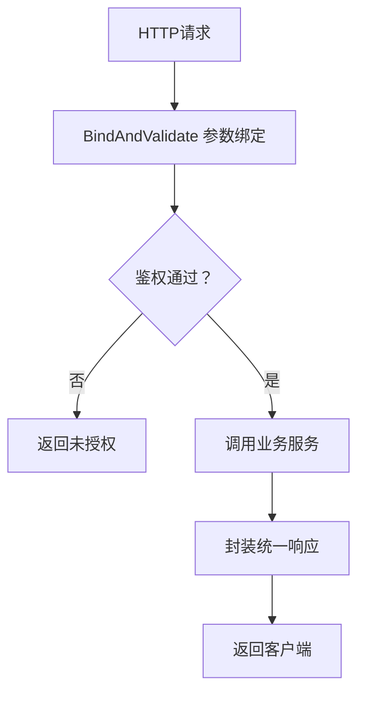
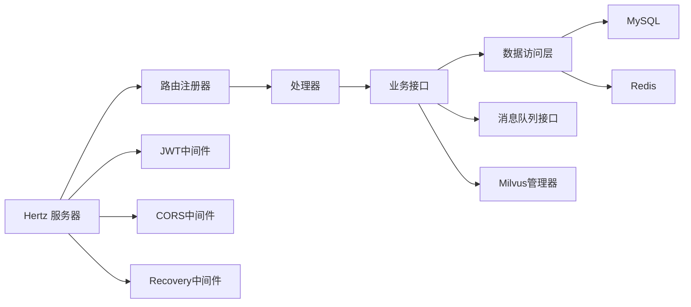

# 整体架构概述

<cite>
**本文档引用的文件**
- [backend/main.go](file://backend/main.go)
- [backend/api/router/register.go](file://backend/api/router/register.go)
- [backend/api/router/interview/api.go](file://backend/api/router/interview/api.go)
- [backend/internal/config/config.go](file://backend/internal/config/config.go)
- [backend/internal/middleware/jwt.go](file://backend/internal/middleware/jwt.go)
- [backend/internal/repository/database.go](file://backend/internal/repository/database.go)
- [backend/internal/service/interviews/interface.go](file://backend/internal/service/interviews/interface.go)
- [backend/api/handler/interview/interviews_service.go](file://backend/api/handler/interview/interviews_service.go)
- [backend/internal/service/prediction/interface.go](file://backend/internal/service/prediction/interface.go)
- [backend/internal/mq/mq.go](file://backend/internal/mq/mq.go)
- [backend/internal/eino/milvus/init.go](file://backend/internal/eino/milvus/init.go)
- [backend/chatApp/main.go](file://backend/chatApp/main.go)
- [docker-compose.yml](file://docker-compose.yml)
- [frontend/src/app/layout.tsx](file://frontend/src/app/layout.tsx)
- [README.md](file://README.md)
</cite>

## 目录
1. [简介](#简介)
2. [项目结构](#项目结构)
3. [核心组件](#核心组件)
4. [架构总览](#架构总览)
5. [详细组件分析](#详细组件分析)
6. [依赖关系分析](#依赖关系分析)
7. [性能考虑](#性能考虑)
8. [故障排除指南](#故障排除指南)
9. [结论](#结论)

## 简介
面试吧AI智能面试平台是一个基于字节跳动Hertz框架与云音乐Eino框架构建的智能面试系统。系统通过RESTful API提供用户管理、简历管理、面试流程、AI智能体与向量检索等能力，并采用前后端分离架构与容器化部署方案。本文档从系统边界、模块划分、数据流与控制流、以及可扩展性与安全性角度，全面阐述该平台的整体架构设计。

章节来源
- [README.md](file://README.md#L1-L308)

## 项目结构
项目采用前后端分离的典型工程布局：
- 后端（Go）：以模块化方式组织，分为API层、业务层、数据层与基础设施层；通过Hertz路由注册器集中挂载路由；通过Eino集成AI能力；通过Milvus实现向量检索；通过Redis实现消息队列与缓存；通过GORM管理数据库。
- 前端（Next.js）：采用页面路由与组件化架构，提供用户中心、面试流程、简历管理、预测分析等页面。
- 部署：通过docker-compose编排MySQL、Redis、Nginx与前后端服务，形成可一键部署的运行环境。

图表来源
- [backend/main.go](file://backend/main.go#L29-L173)
- [backend/api/router/register.go](file://backend/api/router/register.go#L11-L15)
- [backend/api/router/interview/api.go](file://backend/api/router/interview/api.go#L17-L103)
- [backend/internal/middleware/jwt.go](file://backend/internal/middleware/jwt.go#L32-L78)
- [backend/internal/repository/database.go](file://backend/internal/repository/database.go#L18-L60)
- [backend/internal/mq/mq.go](file://backend/internal/mq/mq.go#L137-L153)
- [backend/internal/eino/milvus/init.go](file://backend/internal/eino/milvus/init.go#L42-L143)
- [backend/chatApp/main.go](file://backend/chatApp/main.go#L25-L123)
- [docker-compose.yml](file://docker-compose.yml#L144-L206)

章节来源
- [README.md](file://README.md#L35-L119)
- [docker-compose.yml](file://docker-compose.yml#L1-L226)

## 核心组件
- Hertz Web框架：提供高性能HTTP服务，统一注册路由、中间件与错误恢复。
- Eino AI框架：封装大模型调用、智能体与向量处理能力，支撑简历分析、面试问答与评估。
- 路由与处理器：通过IDL生成的路由注册器集中挂载REST接口，处理器负责参数绑定、鉴权与调用业务层。
- 业务层：抽象接口定义（如面试与简历管理），具体实现位于impl包，职责清晰、便于替换与扩展。
- 数据访问层：GORM封装数据库连接、连接池与自动迁移；Redis用于缓存与消息队列。
- 消息队列：基于Redis的异步消息处理，解耦评估与报告生成等耗时任务。
- 向量检索：Milvus向量数据库与Eino组件结合，实现知识库检索与嵌入服务。
- 前端：Next.js页面与组件，通过API客户端与后端交互。

章节来源
- [backend/main.go](file://backend/main.go#L23-L27)
- [backend/internal/config/config.go](file://backend/internal/config/config.go#L13-L31)
- [backend/api/router/interview/api.go](file://backend/api/router/interview/api.go#L16-L103)
- [backend/internal/service/interviews/interface.go](file://backend/internal/service/interviews/interface.go#L10-L18)
- [backend/internal/repository/database.go](file://backend/internal/repository/database.go#L18-L60)
- [backend/internal/mq/mq.go](file://backend/internal/mq/mq.go#L40-L48)
- [backend/internal/eino/milvus/init.go](file://backend/internal/eino/milvus/init.go#L22-L35)
- [frontend/src/app/layout.tsx](file://frontend/src/app/layout.tsx#L14-L24)

## 架构总览
系统采用“表示层-业务层-数据层”的分层设计，配合中间件与基础设施层，形成清晰的职责边界与数据流向。

图表来源
- [backend/main.go](file://backend/main.go#L101-L128)
- [backend/api/router/register.go](file://backend/api/router/register.go#L11-L15)
- [backend/internal/middleware/jwt.go](file://backend/internal/middleware/jwt.go#L32-L78)
- [backend/internal/repository/database.go](file://backend/internal/repository/database.go#L18-L60)
- [backend/internal/mq/mq.go](file://backend/internal/mq/mq.go#L137-L153)
- [backend/internal/eino/milvus/init.go](file://backend/internal/eino/milvus/init.go#L42-L143)
- [backend/chatApp/main.go](file://backend/chatApp/main.go#L25-L60)

## 详细组件分析

### 表示层（前端）
- 页面与布局：Next.js提供页面路由与通用布局组件，Navbar与Footer贯穿全局。
- API交互：前端通过API客户端与后端接口通信，Nginx作为反向代理统一入口。

章节来源
- [frontend/src/app/layout.tsx](file://frontend/src/app/layout.tsx#L14-L24)

### 业务层（服务接口与实现）
- 面试与简历服务接口：定义面试记录、对话、评估与简历上传、解析、查询等能力。
- 预测服务接口：提供预测请求、列表与详情查询能力。
- 业务实现：通过NewXxxService工厂方法返回具体实现，便于替换与扩展。

图表来源
- [backend/internal/service/interviews/interface.go](file://backend/internal/service/interviews/interface.go#L20-L117)
- [backend/internal/service/prediction/interface.go](file://backend/internal/service/prediction/interface.go#L8-L12)

章节来源
- [backend/internal/service/interviews/interface.go](file://backend/internal/service/interviews/interface.go#L10-L117)
- [backend/internal/service/prediction/interface.go](file://backend/internal/service/prediction/interface.go#L1-L13)

### 数据层（Repository与持久化）
- 数据库：GORM封装连接、连接池与自动迁移，统一模型注册与访问。
- 缓存与队列：Redis用于会话、缓存与消息队列；提供发布/订阅与消费者机制。
- 配置：集中配置文件支持环境变量展开与多组件配置。

图表来源
- [backend/main.go](file://backend/main.go#L38-L100)
- [backend/internal/config/config.go](file://backend/internal/config/config.go#L136-L152)
- [backend/internal/repository/database.go](file://backend/internal/repository/database.go#L18-L60)
- [backend/internal/mq/mq.go](file://backend/internal/mq/mq.go#L137-L153)

章节来源
- [backend/internal/repository/database.go](file://backend/internal/repository/database.go#L18-L81)
- [backend/internal/mq/mq.go](file://backend/internal/mq/mq.go#L1-L209)
- [backend/internal/config/config.go](file://backend/internal/config/config.go#L136-L269)

### 中间件与安全（JWT/CORS/Recovery）
- JWT中间件：统一从Authorization、X-Auth-Token、Query与Cookie提取令牌，解析并注入用户上下文。
- CORS中间件：统一处理跨域请求与预检，简化前端跨域访问。
- Recovery中间件：捕获panic，避免服务崩溃，保障稳定性。

图表来源
- [backend/internal/middleware/jwt.go](file://backend/internal/middleware/jwt.go#L32-L78)
- [backend/api/router/register.go](file://backend/api/router/register.go#L11-L15)
- [backend/api/router/interview/api.go](file://backend/api/router/interview/api.go#L17-L103)

章节来源
- [backend/internal/middleware/jwt.go](file://backend/internal/middleware/jwt.go#L32-L215)
- [backend/main.go](file://backend/main.go#L101-L128)

### AI与向量检索（Eino与Milvus）
- AI聊天应用：演示Eino框架的Agent与Runner使用方式，支持命令行交互与模型调用。
- Milvus管理器：封装Embedding、文档分割、索引与检索服务，提供健康检查与关闭流程。
- 检索链路：文档经分割与嵌入，写入Milvus集合，查询时计算向量相似度返回TopK结果。

图表来源
- [backend/chatApp/main.go](file://backend/chatApp/main.go#L25-L123)
- [backend/internal/eino/milvus/init.go](file://backend/internal/eino/milvus/init.go#L42-L143)

章节来源
- [backend/chatApp/main.go](file://backend/chatApp/main.go#L25-L189)
- [backend/internal/eino/milvus/init.go](file://backend/internal/eino/milvus/init.go#L22-L219)

### 处理器与API路由
- 路由注册：通过IDL生成的路由注册器集中挂载/api前缀下的用户、简历、面试、预测等接口。
- 处理器职责：参数绑定与校验、鉴权、调用业务服务、封装统一响应。

图表来源
- [backend/api/handler/interview/interviews_service.go](file://backend/api/handler/interview/interviews_service.go#L26-L53)
- [backend/api/router/interview/api.go](file://backend/api/router/interview/api.go#L17-L103)

章节来源
- [backend/api/router/interview/api.go](file://backend/api/router/interview/api.go#L16-L103)
- [backend/api/handler/interview/interviews_service.go](file://backend/api/handler/interview/interviews_service.go#L1-L391)

## 依赖关系分析
- 组件耦合：API层仅依赖业务接口，业务层依赖数据访问层，降低对底层实现的耦合；中间件与路由解耦，便于独立演进。
- 外部依赖：Hertz、Eino、GORM、Redis、Milvus、Next.js等，均通过配置文件集中管理。
- 消息队列：通过全局队列接口抽象，支持InMemory与Redis实现切换，便于测试与生产环境隔离。

图表来源
- [backend/main.go](file://backend/main.go#L101-L128)
- [backend/api/router/register.go](file://backend/api/router/register.go#L11-L15)
- [backend/internal/mq/mq.go](file://backend/internal/mq/mq.go#L137-L153)
- [backend/internal/eino/milvus/init.go](file://backend/internal/eino/milvus/init.go#L42-L143)

章节来源
- [backend/internal/mq/mq.go](file://backend/internal/mq/mq.go#L1-L209)
- [backend/internal/eino/milvus/init.go](file://backend/internal/eino/milvus/init.go#L1-L219)

## 性能考虑
- Hertz性能：高并发HTTP处理能力，适合API密集场景。
- 数据库连接池：GORM配置最大连接数、空闲连接与生命周期，减少连接开销。
- Redis缓存与队列：热点数据缓存与异步任务解耦，降低请求延迟与峰值压力。
- 向量检索：Milvus支持TopK检索与多种距离度量，结合嵌入维度与索引策略优化查询性能。
- 前后端分离：静态资源由Nginx分发，后端专注业务处理，提升整体吞吐。

章节来源
- [backend/internal/config/config.go](file://backend/internal/config/config.go#L64-L83)
- [backend/internal/repository/database.go](file://backend/internal/repository/database.go#L31-L44)
- [backend/internal/eino/milvus/init.go](file://backend/internal/eino/milvus/init.go#L105-L136)
- [docker-compose.yml](file://docker-compose.yml#L177-L191)

## 故障排除指南
- 服务器启动失败：检查配置文件加载与环境变量展开、数据库与Redis连接初始化。
- 路由无法访问：确认路由注册器是否正确挂载，中间件顺序是否影响OPTIONS预检。
- JWT鉴权异常：核对Authorization头格式与令牌有效性，检查JWT中间件配置。
- 数据库迁移失败：确认DSN与权限，查看迁移日志定位模型定义问题。
- 消息队列异常：检查Redis连接与消费者协程状态，确认消息类型与负载结构。
- 向量检索不可用：确认Milvus连接、集合存在与嵌入维度一致，执行健康检查。

章节来源
- [backend/main.go](file://backend/main.go#L38-L100)
- [backend/internal/middleware/jwt.go](file://backend/internal/middleware/jwt.go#L186-L214)
- [backend/internal/repository/database.go](file://backend/internal/repository/database.go#L62-L75)
- [backend/internal/mq/mq.go](file://backend/internal/mq/mq.go#L155-L208)
- [backend/internal/eino/milvus/init.go](file://backend/internal/eino/milvus/init.go#L203-L218)

## 结论
面试吧AI智能面试平台采用前后端分离与分层架构，结合Hertz与Eino两大框架优势，实现了高性能、可扩展且安全的面试辅助系统。通过统一的中间件、清晰的服务接口与基础设施编排，系统具备良好的可维护性与演进空间。建议在生产环境中进一步完善监控与限流策略，并持续优化向量检索与AI推理的资源配额与成本控制。