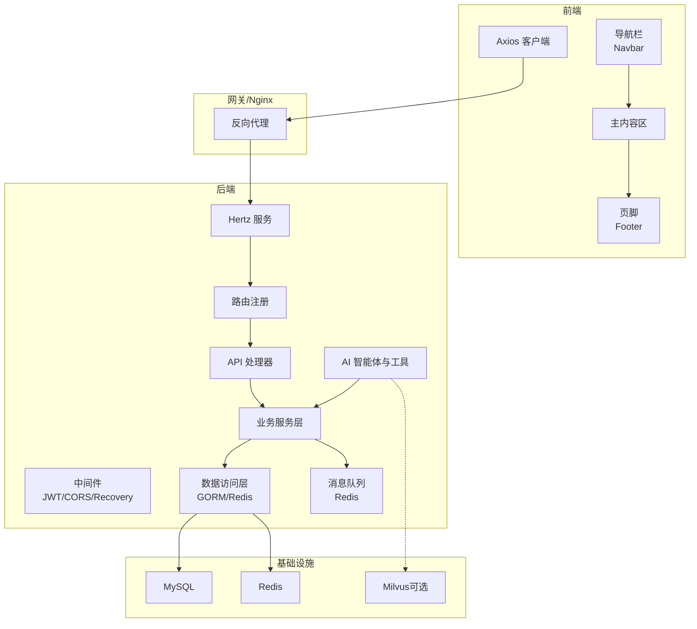
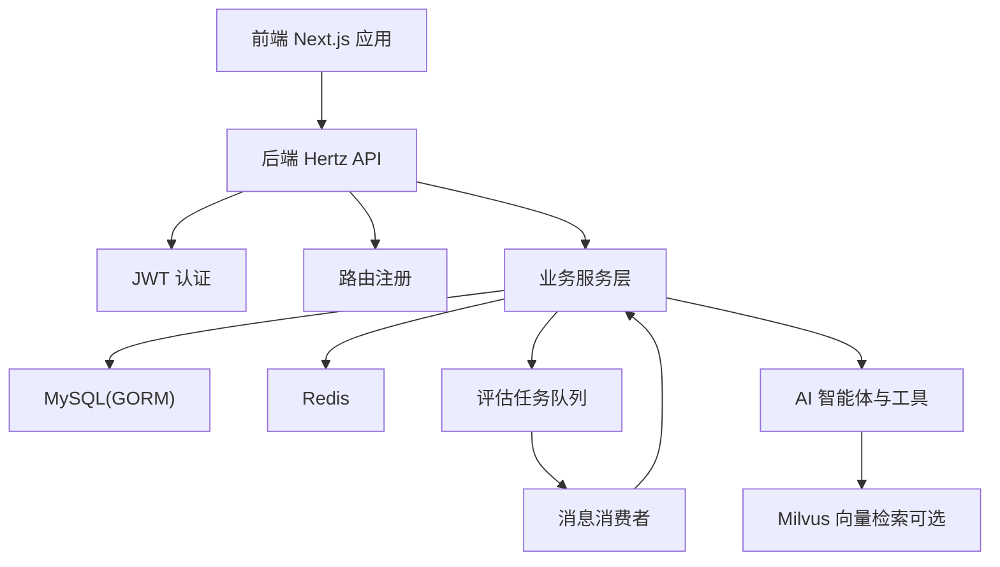
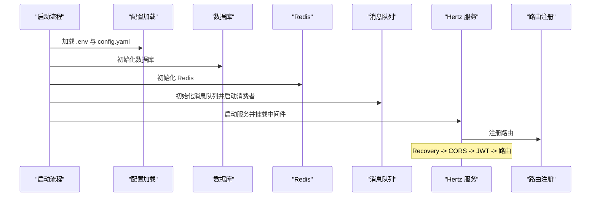
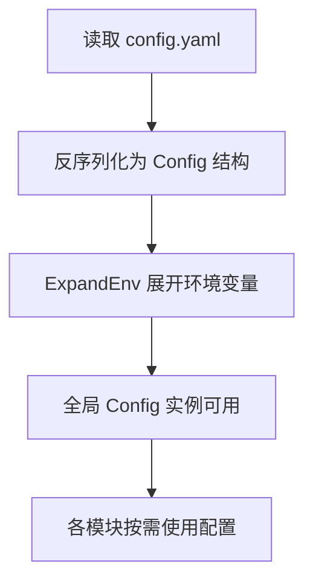
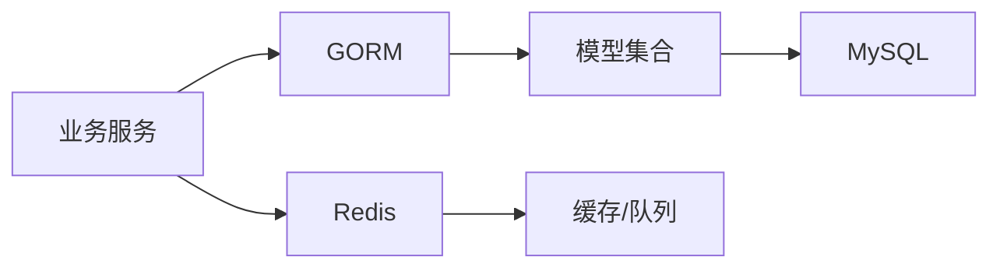
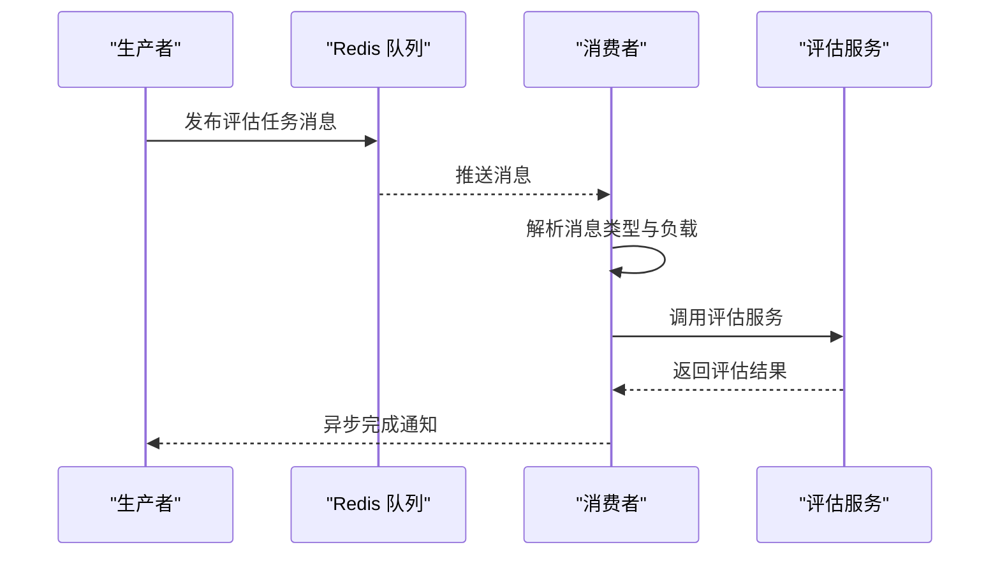
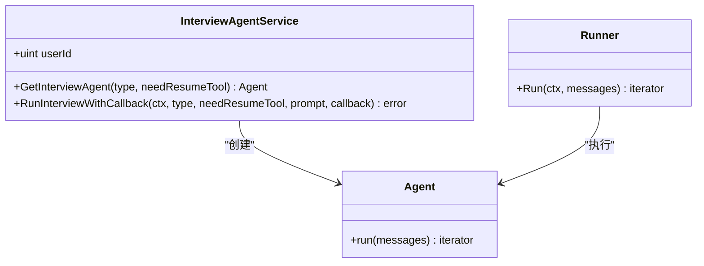
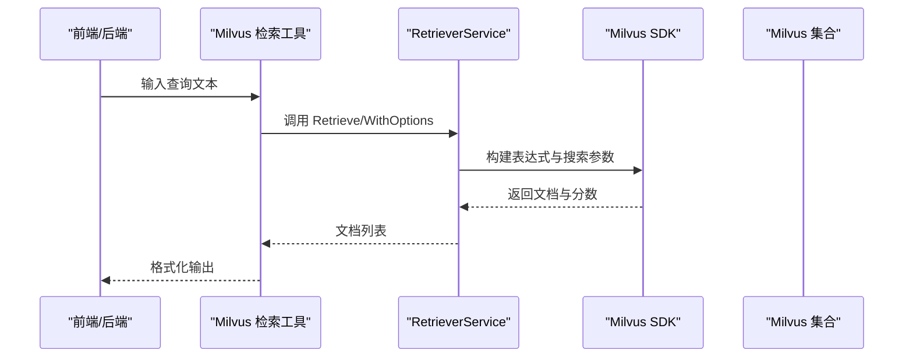
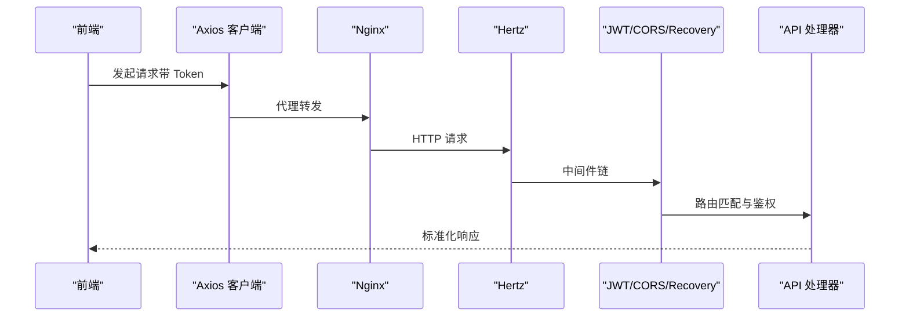
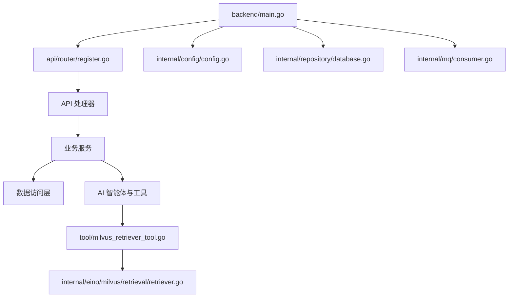

# 系统架构设计

<cite>
**本文引用的文件**
- [backend/main.go](file://backend/main.go)
- [backend/api/router/register.go](file://backend/api/router/register.go)
- [backend/internal/config/config.go](file://backend/internal/config/config.go)
- [backend/internal/repository/database.go](file://backend/internal/repository/database.go)
- [backend/internal/mq/consumer.go](file://backend/internal/mq/consumer.go)
- [backend/chatApp/agent_service/interview/interview_agent_service.go](file://backend/chatApp/agent_service/interview/interview_agent_service.go)
- [backend/chatApp/agent/interview/comprehensive/school_comprehensive_agent.go](file://backend/chatApp/agent/interview/comprehensive/school_comprehensive_agent.go)
- [backend/chatApp/tool/milvus_retriever_tool.go](file://backend/chatApp/tool/milvus_retriever_tool.go)
- [backend/internal/eino/milvus/retrieval/retriever.go](file://backend/internal/eino/milvus/retrieval/retriever.go)
- [frontend/src/app/layout.tsx](file://frontend/src/app/layout.tsx)
- [frontend/src/services/api/client.ts](file://frontend/src/services/api/client.ts)
- [docker-compose.yml](file://docker-compose.yml)
- [README.md](file://README.md)
</cite>

## 目录
1. [简介](#简介)
2. [项目结构](#项目结构)
3. [核心组件](#核心组件)
4. [架构总览](#架构总览)
5. [详细组件分析](#详细组件分析)
6. [依赖关系分析](#依赖关系分析)
7. [性能考虑](#性能考虑)
8. [故障排查指南](#故障排查指南)
9. [结论](#结论)
10. [附录](#附录)

## 简介
本文件面向“面试吧AI智能面试平台”，提供系统架构设计文档。重点阐述整体架构模式、技术选型决策与系统边界；解释前后端分离架构、微服务理念与模块化组织方式；深入剖析AI智能体架构、向量检索系统与消息队列的设计思路；给出架构图、组件交互流程与数据流说明，并讨论可扩展性、性能与安全设计，以及技术决策的背景与权衡。

## 项目结构
系统采用前后端分离与模块化组织方式：
- 后端：基于 Hertz 的 Web 服务，统一路由注册、中间件与业务处理；内部按领域分层（config、repository、service、handler、mq、eino 等），并提供 chatApp 作为 AI 智能体与工具的核心实现。
- 前端：基于 Next.js 的单页应用，通过 Axios 客户端与后端 API 通信，提供用户管理、简历管理、面试流程与结果展示等界面。
- 基础设施：通过 docker-compose 提供 MySQL、Redis、可选 Milvus、Nginx 反向代理等服务编排。

**图表来源**
- [docker-compose.yml](file://docker-compose.yml#L1-L226)
- [backend/main.go](file://backend/main.go#L101-L128)
- [backend/api/router/register.go](file://backend/api/router/register.go#L11-L15)
- [frontend/src/app/layout.tsx](file://frontend/src/app/layout.tsx#L14-L24)
- [frontend/src/services/api/client.ts](file://frontend/src/services/api/client.ts#L1-L63)

**章节来源**
- [README.md](file://README.md#L35-L115)
- [docker-compose.yml](file://docker-compose.yml#L1-L226)

## 核心组件
- Web 服务与路由
  - Hertz 作为高性能 Web 框架，统一注册路由、挂载中间件（JWT、CORS、Recovery），并启动 HTTP 服务。
  - 路由通过生成器注册，集中管理 API 路由。
- 配置管理
  - YAML 配置文件集中管理数据库、Redis、Hertz、AI/OpenAI、Embedding、Milvus、文档分割器、微信/飞书/邮件等配置，并支持环境变量展开。
- 数据持久化与缓存
  - GORM + MySQL 负责结构化数据持久化与自动迁移；Redis 用于会话、缓存与消息队列。
- 消息队列
  - 基于 Redis 的消息队列，消费者异步处理评估报告与主题评估任务，提升系统吞吐与响应性。
- AI 智能体与工具
  - 基于 Eino 框架构建多类智能体（综合/专项面试官、简历分析、答案评估、预测推荐），并提供 Milvus 检索工具与简历工具，支持向量化知识库问答。
- 向量检索系统
  - 封装 Milvus 检索器服务，支持 TopK、过滤表达式、多种度量方式与 FloatVector 转换器，提供灵活检索能力。
- 前后端通信
  - 前端使用 Axios 客户端，统一注入 Token、处理鉴权失败与响应标准化；后端提供 RESTful 接口与健康检查。

**章节来源**
- [backend/main.go](file://backend/main.go#L101-L128)
- [backend/api/router/register.go](file://backend/api/router/register.go#L11-L15)
- [backend/internal/config/config.go](file://backend/internal/config/config.go#L136-L152)
- [backend/internal/repository/database.go](file://backend/internal/repository/database.go#L18-L60)
- [backend/internal/mq/consumer.go](file://backend/internal/mq/consumer.go#L89-L100)
- [backend/chatApp/agent_service/interview/interview_agent_service.go](file://backend/chatApp/agent_service/interview/interview_agent_service.go#L30-L73)
- [backend/chatApp/tool/milvus_retriever_tool.go](file://backend/chatApp/tool/milvus_retriever_tool.go#L132-L144)
- [backend/internal/eino/milvus/retrieval/retriever.go](file://backend/internal/eino/milvus/retrieval/retriever.go#L15-L89)
- [frontend/src/services/api/client.ts](file://frontend/src/services/api/client.ts#L12-L60)

## 架构总览
系统采用“前后端分离 + 微服务理念”的模块化组织方式：
- 前端：Next.js SPA，负责用户界面与 API 交互。
- 后端：Hertz 服务，按领域分层，内部模块职责清晰；AI 能力通过 chatApp 与工具链集成。
- 基础设施：MySQL、Redis、可选 Milvus、Nginx，通过 docker-compose 统一编排。

**图表来源**
- [backend/main.go](file://backend/main.go#L101-L128)
- [backend/internal/mq/consumer.go](file://backend/internal/mq/consumer.go#L89-L100)
- [docker-compose.yml](file://docker-compose.yml#L144-L206)

**章节来源**
- [README.md](file://README.md#L138-L157)
- [docker-compose.yml](file://docker-compose.yml#L1-L226)

## 详细组件分析

### Web 服务与路由
- 控制流
  - 应用启动时加载 .env 与 config.yaml，初始化数据库、Redis、消息队列与消费者，然后启动 Hertz 服务并注册路由。
  - 中间件顺序：Recovery -> CORS -> JWT（对特定路由跳过）-> 路由注册。
- 关键点
  - 统一错误处理与 panic 恢复，保证服务稳定性。
  - JWT 中间件按路由跳过策略保护敏感接口。
  - 路由注册通过生成器集中管理，便于扩展。

**图表来源**
- [backend/main.go](file://backend/main.go#L29-L128)
- [backend/api/router/register.go](file://backend/api/router/register.go#L11-L15)

**章节来源**
- [backend/main.go](file://backend/main.go#L29-L128)
- [backend/api/router/register.go](file://backend/api/router/register.go#L11-L15)

### 配置管理
- 设计要点
  - Config 结构覆盖数据库、Redis、Hertz、AI/OpenAI、Embedding、Milvus、文档分割器、微信/飞书/邮件等。
  - 支持环境变量展开，便于容器化与多环境部署。
- 配置加载
  - 读取 YAML 并反序列化为结构体，设置为全局实例，供各模块使用。

**图表来源**
- [backend/internal/config/config.go](file://backend/internal/config/config.go#L136-L152)
- [backend/internal/config/config.go](file://backend/internal/config/config.go#L212-L268)

**章节来源**
- [backend/internal/config/config.go](file://backend/internal/config/config.go#L13-L31)
- [backend/internal/config/config.go](file://backend/internal/config/config.go#L136-L152)
- [backend/internal/config/config.go](file://backend/internal/config/config.go#L212-L268)

### 数据持久化与缓存
- 数据库
  - GORM + MySQL，配置连接池与自动迁移，模型注册统一 DB Getter。
- 缓存
  - Redis 用于会话、缓存与消息队列，连接参数可配置。

**图表来源**
- [backend/internal/repository/database.go](file://backend/internal/repository/database.go#L18-L60)

**章节来源**
- [backend/internal/repository/database.go](file://backend/internal/repository/database.go#L18-L60)

### 消息队列与异步处理
- 设计思路
  - 使用 Redis 作为消息队列，发布/订阅模式解耦评估任务与实时处理。
  - 消费者根据消息类型分派至不同评估服务，异步生成评估报告与主题评估。
- 关键流程
  - StartConsumer 订阅队列，Handler.HandleMessage 根据类型分发，调用相应服务生成评估结果。

**图表来源**
- [backend/internal/mq/consumer.go](file://backend/internal/mq/consumer.go#L89-L100)
- [backend/internal/mq/consumer.go](file://backend/internal/mq/consumer.go#L19-L29)

**章节来源**
- [backend/internal/mq/consumer.go](file://backend/internal/mq/consumer.go#L19-L29)
- [backend/internal/mq/consumer.go](file://backend/internal/mq/consumer.go#L89-L100)

### AI 智能体架构
- 架构模式
  - 多智能体：综合面试官（校招/社招）、专项面试官（Go/Java/MySQL/Redis/MQ）、简历分析、答案评估、预测推荐。
  - 智能体通过 Eino 框架运行，支持工具集成（如简历工具、Milvus 检索工具）。
- 交互流程
  - InterviewAgentService 根据类型创建具体智能体，RunInterviewWithCallback 通过 Runner 迭代执行，回调逐条推送输出。

**图表来源**
- [backend/chatApp/agent_service/interview/interview_agent_service.go](file://backend/chatApp/agent_service/interview/interview_agent_service.go#L30-L73)
- [backend/chatApp/agent_service/interview/interview_agent_service.go](file://backend/chatApp/agent_service/interview/interview_agent_service.go#L103-L154)

**章节来源**
- [backend/chatApp/agent_service/interview/interview_agent_service.go](file://backend/chatApp/agent_service/interview/interview_agent_service.go#L14-L73)
- [backend/chatApp/agent/interview/comprehensive/school_comprehensive_agent.go](file://backend/chatApp/agent/interview/comprehensive/school_comprehensive_agent.go#L14-L47)

### 向量检索系统
- 设计要点
  - 封装 Milvus 检索器服务，支持默认检索与带过滤表达式的检索，设置 VectorConverter 为 FloatVector，TopK 默认 10。
  - 检索工具 MilvusRetrieverTool 将查询文本传入检索器，格式化输出文档列表与错误信息。
- 数据流
  - 前端/后端调用检索工具 -> 智能体工具 -> 检索器服务 -> Milvus SDK -> 返回文档与分数。

**图表来源**
- [backend/chatApp/tool/milvus_retriever_tool.go](file://backend/chatApp/tool/milvus_retriever_tool.go#L48-L101)
- [backend/internal/eino/milvus/retrieval/retriever.go](file://backend/internal/eino/milvus/retrieval/retriever.go#L96-L130)

**章节来源**
- [backend/chatApp/tool/milvus_retriever_tool.go](file://backend/chatApp/tool/milvus_retriever_tool.go#L15-L47)
- [backend/chatApp/tool/milvus_retriever_tool.go](file://backend/chatApp/tool/milvus_retriever_tool.go#L48-L101)
- [backend/internal/eino/milvus/retrieval/retriever.go](file://backend/internal/eino/milvus/retrieval/retriever.go#L15-L89)

### 前后端交互与安全
- 前端
  - Axios 客户端统一注入 Authorization 与 X-Auth-Token，针对特定接口延长超时；响应拦截器统一处理 401 与业务 code。
- 后端
  - JWT 中间件保护受保护接口；CORS 中间件处理跨域与预检；Recovery 中间件捕获 panic。
- 安全设计
  - JWT 令牌管理、CORS 白名单、统一错误响应格式、配置文件中的敏感信息通过环境变量展开。

**图表来源**
- [frontend/src/services/api/client.ts](file://frontend/src/services/api/client.ts#L12-L60)
- [backend/main.go](file://backend/main.go#L107-L128)

**章节来源**
- [frontend/src/services/api/client.ts](file://frontend/src/services/api/client.ts#L12-L60)
- [backend/main.go](file://backend/main.go#L107-L128)

## 依赖关系分析
- 组件耦合
  - 后端通过路由注册集中接入 API；服务层依赖数据访问层；AI 智能体通过工具链与检索服务交互。
- 外部依赖
  - Hertz、GORM、Eino、Milvus SDK、Redis、MySQL。
- 可能的循环依赖
  - 当前结构按层与模块划分，未见明显循环依赖迹象；路由注册与中间件挂载在启动阶段完成，避免运行时循环。

**图表来源**
- [backend/main.go](file://backend/main.go#L101-L128)
- [backend/api/router/register.go](file://backend/api/router/register.go#L11-L15)
- [backend/chatApp/tool/milvus_retriever_tool.go](file://backend/chatApp/tool/milvus_retriever_tool.go#L132-L144)
- [backend/internal/eino/milvus/retrieval/retriever.go](file://backend/internal/eino/milvus/retrieval/retriever.go#L15-L89)

**章节来源**
- [backend/main.go](file://backend/main.go#L101-L128)
- [backend/api/router/register.go](file://backend/api/router/register.go#L11-L15)

## 性能考虑
- 并发与吞吐
  - Hertz 作为高性能 Web 框架，适合高并发场景；消息队列异步化评估任务，降低请求延迟。
- 数据库与缓存
  - GORM 连接池参数可调优；Redis 连接池与超时配置需结合实际 QPS 调整。
- 检索性能
  - Milvus 检索 TopK、度量方式与搜索参数需结合数据规模与精度要求调优；向量转换器与字段配置需与索引一致。
- 前端体验
  - 针对长耗时接口（如评估）延长超时，合理分页与增量渲染，减少首屏压力。

[本节为通用指导，无需列出具体文件来源]

## 故障排查指南
- 启动与配置
  - 若 .env 或 config.yaml 未正确加载，检查路径与权限；确认环境变量展开是否生效。
- 数据库与缓存
  - 数据库连接失败时检查 DSN 与网络连通；Redis 连接失败检查地址、密码与网络。
- 消息队列
  - 消费者未启动或报未知消息类型时，检查消息负载结构与消息类型枚举。
- AI 检索
  - Milvus 检索失败时，检查集合名、向量字段、度量方式与搜索参数；确认 VectorConverter 与索引一致。
- 前后端联调
  - 401 未授权通常因 Token 缺失或过期；检查前端本地存储与后端 JWT 密钥。

**章节来源**
- [backend/main.go](file://backend/main.go#L30-L48)
- [backend/internal/mq/consumer.go](file://backend/internal/mq/consumer.go#L19-L29)
- [backend/chatApp/tool/milvus_retriever_tool.go](file://backend/chatApp/tool/milvus_retriever_tool.go#L48-L101)
- [frontend/src/services/api/client.ts](file://frontend/src/services/api/client.ts#L47-L50)

## 结论
本系统以 Hertz 为核心，结合 Eino 框架实现多智能体面试能力，配合 Redis 消息队列与可选 Milvus 向量检索，形成前后端分离、模块化与可扩展的架构。通过统一配置、中间件与路由治理，保障了服务稳定性与安全性；通过异步评估与检索优化，提升了用户体验与系统吞吐。后续可在可观测性、弹性伸缩与多租户隔离等方面持续演进。

[本节为总结性内容，无需列出具体文件来源]

## 附录
- 部署与编排
  - docker-compose 提供 MySQL、Redis、可选 Milvus、Nginx、后端与前端的完整编排，便于本地与生产部署。
- API 一览
  - 用户、简历、面试、专项面试等接口，详见项目说明文档。

**章节来源**
- [docker-compose.yml](file://docker-compose.yml#L1-L226)
- [README.md](file://README.md#L197-L233)