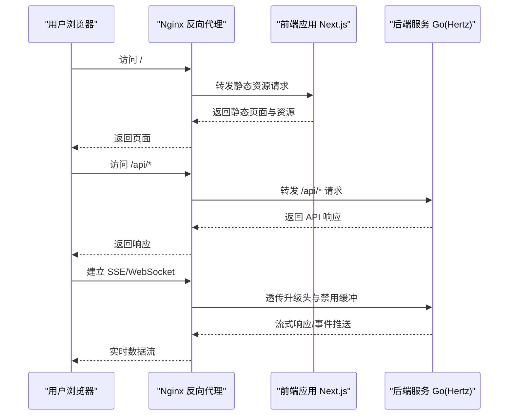
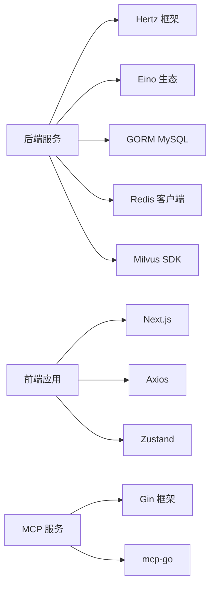

# 部署架构设计

<cite>
**本文引用的文件**
- [docker-compose.yml](file://docker-compose.yml)
- [docker-compose-prod.yml](file://docker-compose-prod.yml)
- [nginx.conf](file://nginx.conf)
- [backend/Dockerfile](file://backend/Dockerfile)
- [frontend/Dockerfile](file://frontend/Dockerfile)
- [backend/config.yaml](file://backend/config.yaml)
- [backend/config.example.yaml](file://backend/config.example.yaml)
- [backend/.env](file://backend/.env)
- [mcpserver/config.yaml](file://mcpserver/config.yaml)
- [README.md](file://README.md)
- [backend/go.mod](file://backend/go.mod)
- [mcpserver/go.mod](file://mcpserver/go.mod)
</cite>

## 目录
1. [简介](#简介)
2. [项目结构](#项目结构)
3. [核心组件](#核心组件)
4. [架构总览](#架构总览)
5. [详细组件分析](#详细组件分析)
6. [依赖分析](#依赖分析)
7. [性能考虑](#性能考虑)
8. [故障排查指南](#故障排查指南)
9. [结论](#结论)
10. [附录](#附录)

## 简介
本文件面向面试吧AI智能面试平台，提供一套完整的容器化部署与运维架构设计，涵盖Docker容器设计、镜像构建与多阶段编译优化、Kubernetes集群部署策略、服务发现与负载均衡、Nginx反向代理与SSL证书管理、CDN加速策略、CI/CD流水线与灰度发布、监控告警与日志收集、性能分析以及灾难恢复与高可用设计。

## 项目结构
该仓库采用多模块结构，包含后端（Go + Hertz）、前端（Next.js）、MCP工具服务、以及容器化与反向代理配置。核心部署资产包括：
- Docker Compose编排：开发与生产环境两套compose文件
- Nginx反向代理：统一入口、静态资源与API转发
- 前后端镜像：多阶段构建，精简运行时与安全加固
- 配置体系：YAML配置文件与环境变量结合

```mermaid
graph TB
subgraph "宿主机"
NGINX["Nginx 反向代理<br/>端口 80"]
end
subgraph "容器网络 app-network"
FE["前端应用<br/>Next.js:3000"]
BE["后端服务<br/>Go(Hertz):8888"]
MYSQL["数据库<br/>MySQL:3306"]
REDIS["缓存<br/>Redis:6379"]
# MILVUS["向量库<br/>Milvus:19530"]
end
NGINX --> FE
NGINX --> BE
FE --> BE
BE --> MYSQL
BE --> REDIS
# BE --> MILVUS
```

图表来源
- [docker-compose.yml](file://docker-compose.yml#L1-L226)
- [nginx.conf](file://nginx.conf#L1-L61)

章节来源
- [README.md](file://README.md#L277-L297)
- [docker-compose.yml](file://docker-compose.yml#L1-L226)
- [docker-compose-prod.yml](file://docker-compose-prod.yml#L1-L213)

## 核心组件
- 反向代理与入口网关：Nginx负责HTTP/HTTPS接入、WebSocket/SSE透传、健康检查、静态资源与API路由
- 前端应用：Next.js多阶段构建，生产运行时镜像，非root用户运行
- 后端服务：Go应用（Hertz），多阶段构建，健康检查，日志目录挂载
- 数据与缓存：MySQL与Redis，Compose中定义健康检查与持久化卷
- 可选向量库：Milvus（注释掉），Etcd与MinIO（注释掉）作为依赖
- MCP工具服务：独立的工具服务，可与后端协同

章节来源
- [nginx.conf](file://nginx.conf#L1-L61)
- [frontend/Dockerfile](file://frontend/Dockerfile#L1-L65)
- [backend/Dockerfile](file://backend/Dockerfile#L1-L64)
- [docker-compose.yml](file://docker-compose.yml#L144-L206)
- [mcpserver/config.yaml](file://mcpserver/config.yaml#L1-L36)

## 架构总览
下图展示从浏览器到后端服务的典型流量路径，以及Nginx如何将/api前缀转发至后端，静态资源转发至前端，并对长连接、SSE与WebSocket进行特殊处理。



图表来源
- [nginx.conf](file://nginx.conf#L1-L61)
- [docker-compose.yml](file://docker-compose.yml#L177-L206)

## 详细组件分析

### Nginx反向代理
- 负责统一入口、静态资源与API路由
- 对/api路径进行后端转发，设置真实IP、协议头，支持WebSocket与SSE
- 提供健康检查端点，便于容器健康探针
- 长连接超时配置，适合实时场景

章节来源
- [nginx.conf](file://nginx.conf#L1-L61)
- [docker-compose.yml](file://docker-compose.yml#L177-L190)

### 前端应用（Next.js）
- 多阶段构建：第一阶段安装依赖与构建，第二阶段仅复制产物与运行时依赖
- 运行时镜像非root用户，设置时区，健康检查
- 构建参数NEXT_PUBLIC_API_BASE_URL注入，支持不同环境的API地址

章节来源
- [frontend/Dockerfile](file://frontend/Dockerfile#L1-L65)
- [docker-compose.yml](file://docker-compose.yml#L192-L206)
- [docker-compose-prod.yml](file://docker-compose-prod.yml#L178-L193)

### 后端服务（Go + Hertz）
- 多阶段构建：第一阶段下载依赖与编译，第二阶段运行时仅包含必要文件
- 运行时镜像非root用户，设置时区，健康检查
- 配置文件挂载与日志目录挂载，便于调试与运维
- 依赖清单包含Hertz、Eino、GORM、Redis、Milvus SDK等

章节来源
- [backend/Dockerfile](file://backend/Dockerfile#L1-L64)
- [backend/config.yaml](file://backend/config.yaml#L1-L129)
- [backend/config.example.yaml](file://backend/config.example.yaml#L1-L127)
- [backend/go.mod](file://backend/go.mod#L1-L132)
- [docker-compose.yml](file://docker-compose.yml#L144-L175)

### 数据与缓存（MySQL + Redis）
- MySQL：健康检查基于mysqladmin ping，端口映射与持久化卷
- Redis：开启AOF持久化，设置密码，健康检查基于redis-cli ping
- 两者均定义在桥接网络中，便于容器间通信

章节来源
- [docker-compose.yml](file://docker-compose.yml#L2-L21)
- [docker-compose.yml](file://docker-compose.yml#L23-L39)

### 可选向量库（Milvus/MinIO/Etcd）
- Etcd与MinIO作为Milvus依赖，已提供配置与健康检查
- Milvus与Attu处于注释状态，便于按需启用
- Milvus配置可通过环境变量注入

章节来源
- [docker-compose.yml](file://docker-compose.yml#L41-L142)
- [backend/config.yaml](file://backend/config.yaml#L80-L96)
- [backend/.env](file://backend/.env#L12-L16)

### MCP工具服务
- 独立的工具服务，提供API密钥与CORS配置
- 可与后端AI流程协作，提供外部工具能力

章节来源
- [mcpserver/config.yaml](file://mcpserver/config.yaml#L1-L36)
- [mcpserver/go.mod](file://mcpserver/go.mod#L1-L55)

## 依赖分析
- 后端依赖：Hertz、Eino生态（OpenAI/Ark Embedding/Milvus）、GORM、Redis、JWT、Sentry等
- 前端依赖：Next.js、Tailwind CSS、Axios、Zustand等
- MCP服务依赖：Gin、CORS、UUID、dotenv、mcp-go等



图表来源
- [backend/go.mod](file://backend/go.mod#L7-L32)
- [frontend/Dockerfile](file://frontend/Dockerfile#L1-L65)
- [mcpserver/go.mod](file://mcpserver/go.mod#L5-L12)

章节来源
- [backend/go.mod](file://backend/go.mod#L1-L132)
- [mcpserver/go.mod](file://mcpserver/go.mod#L1-L55)

## 性能考虑
- 多阶段构建减少镜像体积，降低拉取与启动时间
- 运行时镜像非root用户，提升安全性
- 健康检查间隔与超时合理配置，避免误判
- Nginx对SSE/WebSocket禁用缓冲，保证低延迟
- 前端Next.js生产运行时镜像，减少冷启动
- MySQL/Redis连接池与超时配置，避免资源耗尽

## 故障排查指南
- 健康检查失败
  - 查看Nginx健康检查端点返回
  - 检查后端/前端容器健康检查命令与端口
- API不可达
  - 确认Nginx上游后端地址与端口
  - 检查后端服务端口与容器暴露
- 数据库/缓存异常
  - 检查MySQL/Redis健康检查与端口映射
  - 确认持久化卷与权限
- 向量库未启用
  - 确认Milvus相关服务是否启用与Etcd/MinIO健康
- 配置问题
  - 检查config.yaml与.env中的敏感配置
  - 确认环境变量是否正确注入

章节来源
- [nginx.conf](file://nginx.conf#L54-L59)
- [backend/Dockerfile](file://backend/Dockerfile#L58-L60)
- [frontend/Dockerfile](file://frontend/Dockerfile#L59-L61)
- [docker-compose.yml](file://docker-compose.yml#L15-L19)
- [docker-compose.yml](file://docker-compose.yml#L31-L35)
- [backend/config.yaml](file://backend/config.yaml#L1-L129)
- [backend/.env](file://backend/.env#L1-L16)

## 结论
本部署架构以Docker与Compose为基础，结合Nginx统一入口，实现了前后端分离、数据库与缓存支撑、可选向量库扩展的完整平台部署方案。通过多阶段构建与健康检查，提升了安全性与稳定性。建议在生产环境中进一步完善Kubernetes编排、证书管理、CDN加速、CI/CD流水线与灰度发布策略，并建立完善的监控告警与灾备机制。

## 附录

### 容器化部署策略与镜像优化
- 后端镜像
  - 多阶段构建：第一阶段下载依赖与编译，第二阶段仅复制二进制与必要运行时库
  - 非root用户运行，设置时区，健康检查
  - 暴露端口与日志目录挂载
- 前端镜像
  - 多阶段构建：第一阶段安装依赖与构建，第二阶段仅复制产物与运行时依赖
  - 非root用户运行，设置时区，健康检查
  - 构建参数注入API基础URL

章节来源
- [backend/Dockerfile](file://backend/Dockerfile#L1-L64)
- [frontend/Dockerfile](file://frontend/Dockerfile#L1-L65)

### Kubernetes集群部署（建议）
- 资源编排
  - Deployment：后端、前端、MCP服务
  - Service：ClusterIP/LoadBalancer暴露服务
  - ConfigMap：挂载config.yaml与环境变量
  - Secret：敏感配置（数据库、Redis、API Key）
  - PersistentVolume：MySQL/Redis数据卷
- 服务发现与负载均衡
  - Service ClusterIP用于Pod间访问
  - Ingress/NLB用于外部访问
- Pod就绪/存活探针
  - 基于/health端点的HTTP探针
- 滚动更新与灰度
  - RollingUpdate策略，配合金丝雀或蓝绿发布

### Nginx反向代理、SSL证书与CDN
- SSL证书
  - 使用Let’s Encrypt或商业证书，结合Ingress TLS或边缘TLS卸载
- CDN加速
  - 静态资源走CDN，API通过Nginx/Ingress直连后端
  - 缓存策略与压缩配置

### CI/CD流水线与灰度发布
- CI
  - 代码提交触发：代码检查、单元测试、构建镜像、推送镜像仓库
- CD
  - 发布到预发环境验证
  - 灰度发布：逐步扩大流量比例，观察指标与日志
- 回滚
  - 基于标签与滚动回滚策略

### 监控告警、日志收集与性能分析
- 监控
  - Prometheus/Grafana采集容器指标与应用指标
  - 链路追踪：OpenTelemetry
- 告警
  - 基于阈值与异常模式的告警规则
- 日志
  - 结构化日志输出，集中收集与检索
- 性能分析
  - 关键路径压测与热点分析

### 灾难恢复、数据备份与高可用
- 高可用
  - 多副本部署、多可用区分布
  - 数据库主从/集群、Redis哨兵或集群
- 备份
  - 定期快照与增量备份，异地容灾
- 灾备演练
  - 定期演练与切换流程验证