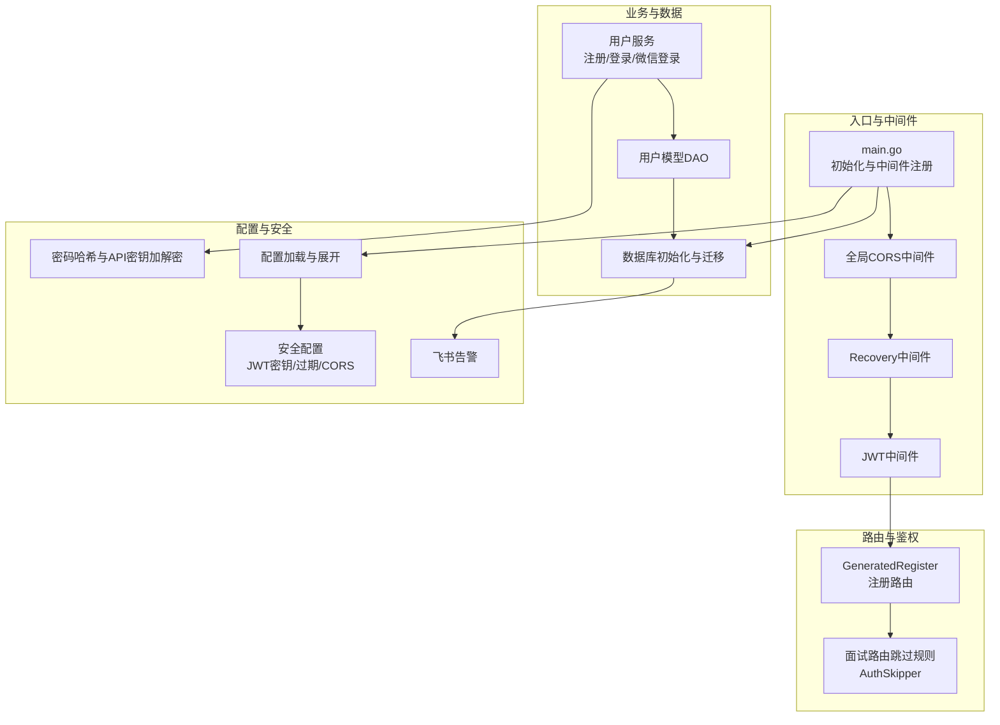
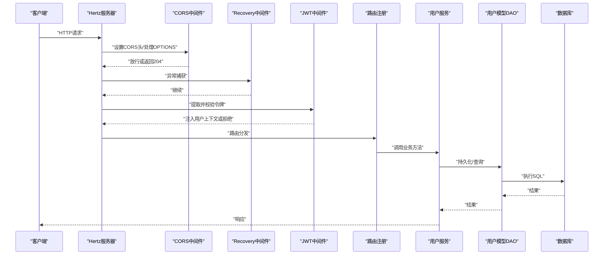
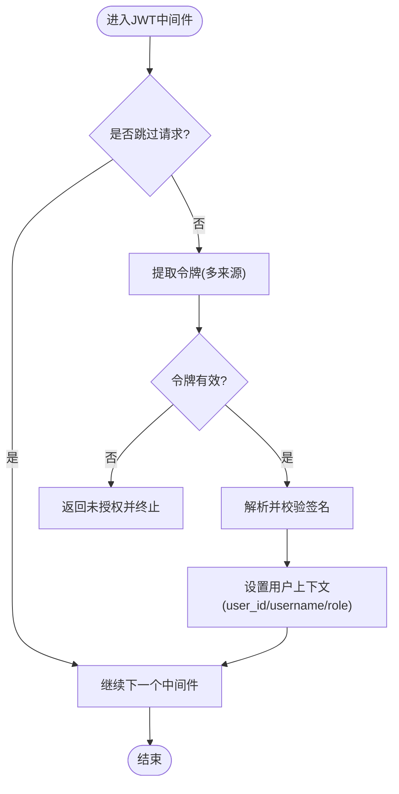
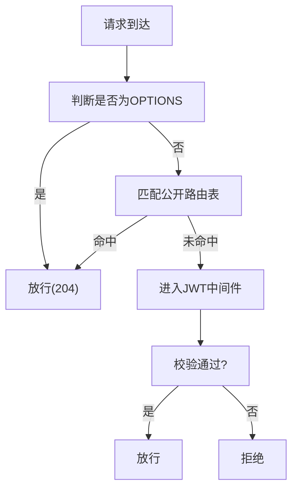
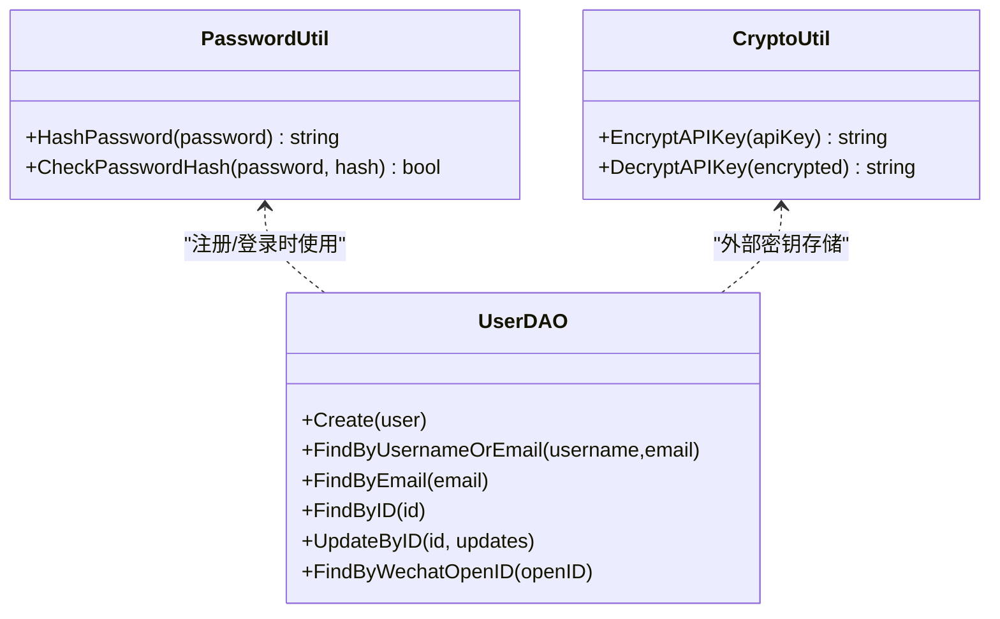
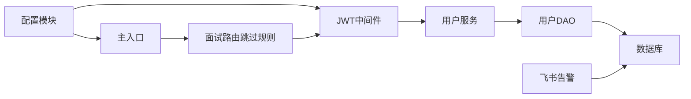

# 安全加固与合规

<cite>
**本文引用的文件**   
- [backend/internal/middleware/jwt.go](file://backend/internal/middleware/jwt.go)
- [backend/api/router/interview/middleware.go](file://backend/api/router/interview/middleware.go)
- [backend/internal/service/user/impl/user_impl.go](file://backend/internal/service/user/impl/user_impl.go)
- [backend/internal/model/user.go](file://backend/internal/model/user.go)
- [backend/internal/repository/database.go](file://backend/internal/repository/database.go)
- [backend/internal/config/config.go](file://backend/internal/config/config.go)
- [backend/internal/service/common/password.go](file://backend/internal/service/common/password.go)
- [backend/api/router/register.go](file://backend/api/router/register.go)
- [backend/main.go](file://backend/main.go)
- [backend/config.example.yaml](file://backend/config.example.yaml)
- [backend/config.yaml](file://backend/config.yaml)
- [backend/internal/service/common/util.go](file://backend/internal/service/common/util.go)
- [backend/internal/alert/feishu.go](file://backend/internal/alert/feishu.go)
</cite>

## 目录
1. [简介](#简介)
2. [项目结构](#项目结构)
3. [核心组件](#核心组件)
4. [架构总览](#架构总览)
5. [详细组件分析](#详细组件分析)
6. [依赖关系分析](#依赖关系分析)
7. [性能与安全特性](#性能与安全特性)
8. [故障排查指南](#故障排查指南)
9. [结论](#结论)
10. [附录](#附录)

## 简介
本文件面向面试吧平台，系统化梳理其安全加固与合规现状，并基于现有代码实现提出可落地的改进建议。重点覆盖以下方面：
- JWT 认证机制、访问控制与权限管理
- 数据加密、传输安全与存储安全
- 网络安全防护、防火墙与 DDoS 防护
- 安全审计、日志安全与隐私保护策略
- 漏洞扫描、渗透测试与安全评估流程
- 合规要求、数据保护法规与安全管理制度
- 安全事件响应与恢复策略

## 项目结构
后端采用模块化分层设计，围绕“路由 -> 中间件 -> 服务 -> 模型/仓储 -> 配置”的链路组织。与安全相关的关键位置包括：
- 认证与授权：JWT 中间件、用户服务、路由跳过规则
- 数据安全：密码哈希、敏感信息加解密、数据库连接与迁移
- 配置与部署：配置文件、环境变量展开、全局 CORS 与 Recovery 中间件
- 告警与审计：飞书告警、日志与错误上报

图表来源
- [backend/main.go](file://backend/main.go#L101-L128)
- [backend/api/router/register.go](file://backend/api/router/register.go#L12-L15)
- [backend/api/router/interview/middleware.go](file://backend/api/router/interview/middleware.go#L13-L36)
- [backend/internal/middleware/jwt.go](file://backend/internal/middleware/jwt.go#L32-L78)
- [backend/internal/repository/database.go](file://backend/internal/repository/database.go#L18-L60)
- [backend/internal/config/config.go](file://backend/internal/config/config.go#L113-L118)
- [backend/internal/service/common/password.go](file://backend/internal/service/common/password.go#L7-L17)
- [backend/internal/service/common/util.go](file://backend/internal/service/common/util.go#L26-L42)
- [backend/internal/alert/feishu.go](file://backend/internal/alert/feishu.go#L24-L78)

章节来源
- [backend/main.go](file://backend/main.go#L101-L128)
- [backend/api/router/register.go](file://backend/api/router/register.go#L12-L15)
- [backend/api/router/interview/middleware.go](file://backend/api/router/interview/middleware.go#L13-L36)
- [backend/internal/middleware/jwt.go](file://backend/internal/middleware/jwt.go#L32-L78)
- [backend/internal/repository/database.go](file://backend/internal/repository/database.go#L18-L60)
- [backend/internal/config/config.go](file://backend/internal/config/config.go#L113-L118)
- [backend/internal/service/common/password.go](file://backend/internal/service/common/password.go#L7-L17)
- [backend/internal/service/common/util.go](file://backend/internal/service/common/util.go#L26-L42)
- [backend/internal/alert/feishu.go](file://backend/internal/alert/feishu.go#L24-L78)

## 核心组件
- JWT 认证中间件：统一从多种来源提取令牌，校验签名与有效期，并注入用户上下文
- 路由跳过规则：对公开接口（如登录、注册、回调等）放行，减少无谓鉴权开销
- 用户服务：负责注册、登录、微信登录、构建登录响应；登录时签发 JWT
- 密码与敏感信息：使用 bcrypt 哈希；API Key 使用 AES-CBC 加解密
- 数据库与迁移：集中初始化、连接池配置与自动迁移
- 配置与环境：支持 .env 与 YAML 双轨，环境变量占位符展开
- 告警与审计：数据库异常告警通过飞书机器人推送

章节来源
- [backend/internal/middleware/jwt.go](file://backend/internal/middleware/jwt.go#L16-L134)
- [backend/api/router/interview/middleware.go](file://backend/api/router/interview/middleware.go#L13-L36)
- [backend/internal/service/user/impl/user_impl.go](file://backend/internal/service/user/impl/user_impl.go#L34-L93)
- [backend/internal/service/common/password.go](file://backend/internal/service/common/password.go#L7-L17)
- [backend/internal/service/common/util.go](file://backend/internal/service/common/util.go#L26-L42)
- [backend/internal/repository/database.go](file://backend/internal/repository/database.go#L18-L75)
- [backend/internal/config/config.go](file://backend/internal/config/config.go#L136-L152)
- [backend/internal/alert/feishu.go](file://backend/internal/alert/feishu.go#L24-L78)

## 架构总览
下图展示从客户端到服务端的关键交互与安全控制点。

图表来源
- [backend/main.go](file://backend/main.go#L101-L128)
- [backend/api/router/register.go](file://backend/api/router/register.go#L12-L15)
- [backend/internal/middleware/jwt.go](file://backend/internal/middleware/jwt.go#L32-L78)
- [backend/internal/service/user/impl/user_impl.go](file://backend/internal/service/user/impl/user_impl.go#L34-L93)
- [backend/internal/model/user.go](file://backend/internal/model/user.go#L35-L100)
- [backend/internal/repository/database.go](file://backend/internal/repository/database.go#L18-L60)

## 详细组件分析

### JWT 认证机制
- 令牌来源：支持 Authorization Bearer、自定义 X-Auth-Token、查询参数 token、Cookie token
- 签名算法：HS256，密钥来自安全配置
- 生命周期：从配置读取过期时长，默认 24 小时
- 上下文注入：将用户ID、用户名、角色写入请求上下文，供后续处理器使用
- 错误处理：针对缺失、格式错误、无效/过期令牌分别返回相应提示

图表来源
- [backend/internal/middleware/jwt.go](file://backend/internal/middleware/jwt.go#L32-L78)
- [backend/internal/middleware/jwt.go](file://backend/internal/middleware/jwt.go#L186-L214)
- [backend/internal/middleware/jwt.go](file://backend/internal/middleware/jwt.go#L115-L134)

章节来源
- [backend/internal/middleware/jwt.go](file://backend/internal/middleware/jwt.go#L16-L134)
- [backend/internal/middleware/jwt.go](file://backend/internal/middleware/jwt.go#L186-L214)

### 访问控制与权限管理
- 路由跳过：对公开接口（如登录、注册、微信回调、忘记/重置密码等）放行
- 方法级控制：当前实现以中间件整体拦截为主，未见细粒度方法级 RBAC
- 角色与资源：JWT 中包含 role 字段，可在后续扩展中结合资源访问控制

图表来源
- [backend/api/router/interview/middleware.go](file://backend/api/router/interview/middleware.go#L13-L36)
- [backend/main.go](file://backend/main.go#L109-L125)

章节来源
- [backend/api/router/interview/middleware.go](file://backend/api/router/interview/middleware.go#L13-L36)
- [backend/main.go](file://backend/main.go#L109-L125)

### 数据加密与存储安全
- 密码安全：注册/登录使用 bcrypt 哈希，兼容明文降级并自动升级为哈希
- API Key 加解密：使用 AES-CBC 对外部服务 API Key 进行加密存储与解密使用
- 数据库连接：集中初始化与连接池配置，自动迁移用户与面试相关表结构

图表来源
- [backend/internal/service/common/password.go](file://backend/internal/service/common/password.go#L7-L17)
- [backend/internal/service/common/util.go](file://backend/internal/service/common/util.go#L26-L42)
- [backend/internal/model/user.go](file://backend/internal/model/user.go#L35-L115)

章节来源
- [backend/internal/service/common/password.go](file://backend/internal/service/common/password.go#L7-L17)
- [backend/internal/service/common/util.go](file://backend/internal/service/common/util.go#L26-L42)
- [backend/internal/model/user.go](file://backend/internal/model/user.go#L35-L115)
- [backend/internal/repository/database.go](file://backend/internal/repository/database.go#L62-L75)

### 传输安全与配置管理
- 全局 CORS：统一设置允许来源、方法、头部与预检缓存
- 配置加载：支持 .env 与 YAML，YAML 中可使用 ${ENV_VAR} 占位符展开
- 安全配置：JWT 密钥、过期时间、CORS 参数均在配置中集中管理

章节来源
- [backend/main.go](file://backend/main.go#L109-L125)
- [backend/internal/config/config.go](file://backend/internal/config/config.go#L136-L152)
- [backend/internal/config/config.go](file://backend/internal/config/config.go#L212-L268)
- [backend/config.example.yaml](file://backend/config.example.yaml#L39-L49)
- [backend/config.yaml](file://backend/config.yaml#L39-L49)

### 安全审计与日志安全
- 飞书告警：数据库错误等异常通过飞书 Webhook 推送，便于审计与应急响应
- 日志策略：Hertz 日志级别与路径在配置中定义，建议结合脱敏策略与留存策略

章节来源
- [backend/internal/alert/feishu.go](file://backend/internal/alert/feishu.go#L24-L78)
- [backend/internal/config/config.go](file://backend/internal/config/config.go#L85-L92)

## 依赖关系分析
- 中间件依赖：JWT 中间件依赖配置模块读取密钥与过期时间
- 路由依赖：面试路由模块提供跳过规则，主入口将其注入全局中间件链
- 服务依赖：用户服务依赖 DAO 与 JWT 工具，DAO 依赖全局数据库实例
- 配置依赖：配置模块负责加载与展开环境变量，被各模块共享

图表来源
- [backend/internal/config/config.go](file://backend/internal/config/config.go#L136-L152)
- [backend/internal/middleware/jwt.go](file://backend/internal/middleware/jwt.go#L80-L113)
- [backend/api/router/interview/middleware.go](file://backend/api/router/interview/middleware.go#L24-L36)
- [backend/main.go](file://backend/main.go#L127-L128)
- [backend/internal/service/user/impl/user_impl.go](file://backend/internal/service/user/impl/user_impl.go#L34-L93)
- [backend/internal/model/user.go](file://backend/internal/model/user.go#L35-L115)
- [backend/internal/alert/feishu.go](file://backend/internal/alert/feishu.go#L24-L78)

章节来源
- [backend/internal/config/config.go](file://backend/internal/config/config.go#L136-L152)
- [backend/internal/middleware/jwt.go](file://backend/internal/middleware/jwt.go#L80-L113)
- [backend/api/router/interview/middleware.go](file://backend/api/router/interview/middleware.go#L24-L36)
- [backend/main.go](file://backend/main.go#L127-L128)
- [backend/internal/service/user/impl/user_impl.go](file://backend/internal/service/user/impl/user_impl.go#L34-L93)
- [backend/internal/model/user.go](file://backend/internal/model/user.go#L35-L115)
- [backend/internal/alert/feishu.go](file://backend/internal/alert/feishu.go#L24-L78)

## 性能与安全特性
- JWT 过期时间：默认 24 小时，建议根据业务场景缩短并引入刷新机制
- 连接池与超时：数据库连接池参数集中配置，有助于稳定性和资源利用
- Recovery 中间件：避免 panic 导致进程崩溃，提升可用性
- CORS 预检：减少跨域请求的额外往返，提高前端体验

章节来源
- [backend/internal/middleware/jwt.go](file://backend/internal/middleware/jwt.go#L84-L88)
- [backend/internal/repository/database.go](file://backend/internal/repository/database.go#L31-L44)
- [backend/main.go](file://backend/main.go#L104-L108)
- [backend/main.go](file://backend/main.go#L109-L125)

## 故障排查指南
- 令牌相关
  - 现象：返回“需要授权头”“令牌格式无效”“令牌无效或已过期”
  - 排查：确认 Authorization 头格式、令牌来源顺序、密钥与过期时间配置
- 登录/注册
  - 现象：密码错误、用户已存在、微信回调失败
  - 排查：检查 bcrypt 哈希逻辑、邮箱唯一约束、微信授权接口连通性
- 数据库
  - 现象：连接失败、迁移异常、查询报错
  - 排查：核对 DSN、连接池参数、自动迁移是否成功
- 告警
  - 现象：飞书告警未发送
  - 排查：确认 Webhook 地址、开关状态、网络可达性

章节来源
- [backend/internal/middleware/jwt.go](file://backend/internal/middleware/jwt.go#L49-L69)
- [backend/internal/middleware/jwt.go](file://backend/internal/middleware/jwt.go#L186-L214)
- [backend/internal/service/user/impl/user_impl.go](file://backend/internal/service/user/impl/user_impl.go#L34-L93)
- [backend/internal/repository/database.go](file://backend/internal/repository/database.go#L18-L60)
- [backend/internal/alert/feishu.go](file://backend/internal/alert/feishu.go#L24-L78)

## 结论
面试吧平台在认证、数据与配置层面已具备较为清晰的安全基线。建议下一步重点补齐：
- 引入刷新令牌与黑名单机制
- 建立细粒度 RBAC 与审计日志
- 强化传输加密与密钥轮换
- 完善网络安全与 DDoS 防护
- 制定漏洞扫描与渗透测试流程
- 明确合规与隐私保护制度

## 附录

### 安全加固建议清单
- JWT
  - 引入刷新令牌与短期访问令牌分离
  - 实施令牌撤销与黑名单
- 权限与审计
  - 基于角色的资源访问控制（RBAC）
  - 审计日志与敏感信息脱敏
- 数据与传输
  - TLS/HTTPS 强制开启
  - 密钥轮换与安全存储
- 网络与运维
  - 防火墙与 WAF 配置
  - DDoS 防护与速率限制
- 合规与流程
  - 数据保护法规（如 GDPR/CCPA）映射
  - 安全评估与演练计划
- 事件响应
  - 告警分级与处置流程
  - 快速恢复与回滚策略

### 配置要点对照
- 安全配置项：JWT 密钥、过期时间、CORS
- 环境变量展开：${VAR_NAME} 语法
- 飞书告警：enabled 与 webhook_url

章节来源
- [backend/config.example.yaml](file://backend/config.example.yaml#L39-L49)
- [backend/config.yaml](file://backend/config.yaml#L39-L49)
- [backend/internal/config/config.go](file://backend/internal/config/config.go#L212-L268)
- [backend/internal/alert/feishu.go](file://backend/internal/alert/feishu.go#L24-L78)