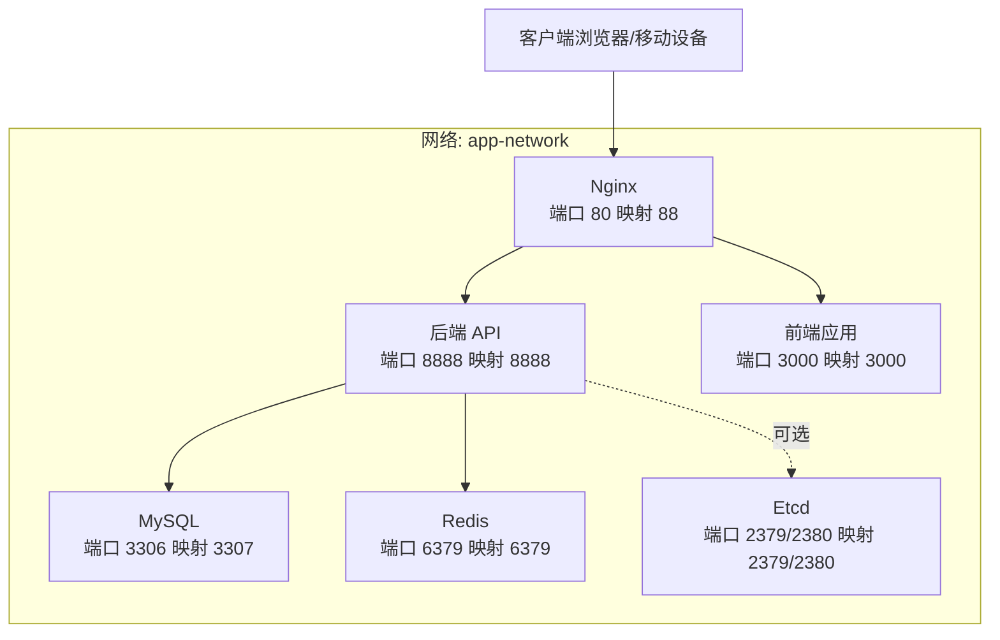
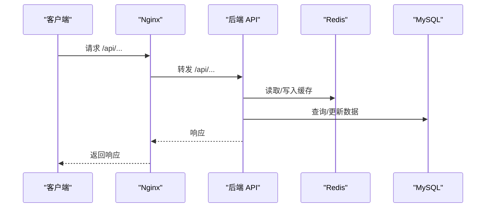

# 容器化部署

<cite>
**本文引用的文件**
- [docker-compose.yml](file://docker-compose.yml)
- [docker-compose-prod.yml](file://docker-compose-prod.yml)
- [docker-compose-example.yml](file://docker-compose-example.yml)
- [nginx.conf](file://nginx.conf)
- [backend/Dockerfile](file://backend/Dockerfile)
- [frontend/Dockerfile](file://frontend/Dockerfile)
- [backend/config.yaml](file://backend/config.yaml)
- [backend/.env](file://backend/.env)
- [backend/config.example.yaml](file://backend/config.example.yaml)
- [README.md](file://README.md)
- [frontend/TROUBLESHOOTING.md](file://frontend/TROUBLESHOOTING.md)
</cite>

## 目录
1. [简介](#简介)
2. [项目结构](#项目结构)
3. [核心组件](#核心组件)
4. [架构总览](#架构总览)
5. [组件详解](#组件详解)
6. [依赖关系分析](#依赖关系分析)
7. [性能与稳定性](#性能与稳定性)
8. [故障排查指南](#故障排查指南)
9. [结论](#结论)
10. [附录](#附录)

## 简介
本文件面向面试吧平台的容器化部署，围绕 Docker Compose 编排配置展开，覆盖 MySQL、Redis、Etcd、后端 API、Nginx 与前端应用的容器配置；解释健康检查机制、端口映射与环境变量；阐述容器间依赖与网络通信；提供本地开发与生产环境的部署差异对比；包含镜像构建、数据卷管理与重启策略；并给出故障排查与容器状态监控方法。

## 项目结构
- 后端服务：Go 应用，使用 Hertz 框架，提供 REST API。
- 前端服务：Next.js 应用，提供用户交互界面。
- 反向代理：Nginx，统一入口，转发 /api 到后端，/ 路径到前端。
- 数据与缓存：MySQL（持久化）、Redis（缓存与会话）。
- 可选组件：Etcd（Milvus 依赖），Milvus（向量数据库，当前 Compose 中默认注释）。

```mermaid
graph TB
subgraph "容器编排"
NGINX["Nginx 反向代理"]
BACKEND["后端 API 容器"]
FRONTEND["前端应用容器"]
MYSQL["MySQL 容器"]
REDIS["Redis 容器"]
ETCD["Etcd 容器"]
# MILVUS["Milvus 容器"]
end
NGINX --> BACKEND
NGINX --> FRONTEND
BACKEND --> MYSQL
BACKEND --> REDIS
BACKEND -.可选.-> ETCD
# BACKEND -.可选.-> MILVUS
```

图表来源
- [docker-compose.yml](file://docker-compose.yml#L1-L226)
- [nginx.conf](file://nginx.conf#L1-L61)

章节来源
- [docker-compose.yml](file://docker-compose.yml#L1-L226)
- [nginx.conf](file://nginx.conf#L1-L61)

## 核心组件
- MySQL：关系型数据库，持久化用户、面试记录等数据。
- Redis：缓存与会话存储，支持密码认证。
- Etcd：分布式键值存储，作为 Milvus 依赖（当前 Compose 中默认注释 Milvus）。
- 后端 API：Go 应用，内置健康检查端点，使用 Nginx 作为统一入口。
- Nginx：反向代理，区分 /api（后端）与 /（前端），支持 WebSocket/SSE。
- 前端应用：Next.js 应用，生产镜像健康检查通过访问端口。

章节来源
- [docker-compose.yml](file://docker-compose.yml#L1-L226)
- [backend/Dockerfile](file://backend/Dockerfile#L1-L64)
- [frontend/Dockerfile](file://frontend/Dockerfile#L1-L65)
- [nginx.conf](file://nginx.conf#L1-L61)

## 架构总览
下图展示容器间的依赖与网络通信关系，以及 Nginx 的路由策略。



图表来源
- [docker-compose.yml](file://docker-compose.yml#L1-L226)
- [nginx.conf](file://nginx.conf#L1-L61)

## 组件详解

### MySQL 容器
- 镜像：mysql:8.0
- 端口映射：宿主 3307 -> 容器 3306
- 环境变量：
  - ROOT 密码、数据库名、时区
- 健康检查：通过 mysqladmin ping 检查
- 数据卷：/var/lib/mysql
- 网络：加入 app-network

章节来源
- [docker-compose.yml](file://docker-compose.yml#L3-L21)

### Redis 容器
- 镜像：redis:7-alpine
- 端口映射：宿主 6379 -> 容器 6379
- 命令：开启 AOF 与密码认证
- 健康检查：redis-cli ping
- 数据卷：/data
- 网络：加入 app-network

章节来源
- [docker-compose.yml](file://docker-compose.yml#L23-L39)

### Etcd 容器（Milvus 依赖）
- 镜像：quay.io/coreos/etcd:v3.5.5
- 端口映射：宿主 2379/2380 -> 容器 2379/2380
- 环境变量：集群与存储相关参数
- 健康检查：etcdctl endpoint health
- 数据卷：/etcd
- 网络：加入 app-network

章节来源
- [docker-compose.yml](file://docker-compose.yml#L41-L72)

### 后端 API 容器
- 构建：基于 backend/Dockerfile 的多阶段构建
- 端口映射：宿主 8888 -> 容器 8888
- 环境变量：
  - 数据库连接：DB_HOST、DB_PORT、DB_USER、DB_PASSWORD、DB_NAME
  - Redis 连接：REDIS_HOST、REDIS_PORT、REDIS_PASSWORD
- 依赖：mysql、redis（健康检查通过后才启动）
- 数据卷：挂载 config.yaml 与 logs 目录
- 健康检查：curl 访问 /health
- 网络：加入 app-network

章节来源
- [docker-compose.yml](file://docker-compose.yml#L144-L175)
- [backend/Dockerfile](file://backend/Dockerfile#L1-L64)
- [backend/config.yaml](file://backend/config.yaml#L1-L129)

### Nginx 反向代理
- 镜像：nginx:alpine
- 端口映射：宿主 88 -> 容器 80
- 配置：/etc/nginx/conf.d/default.conf
- 路由规则：
  - /api/ 转发至后端 8888，支持 WebSocket/SSE
  - / 转发至前端 3000，关闭缓冲以适配 Next.js
- 健康检查：/health 返回 200 healthy
- 依赖：backend、frontend
- 网络：加入 app-network

章节来源
- [docker-compose.yml](file://docker-compose.yml#L177-L190)
- [nginx.conf](file://nginx.conf#L1-L61)

### 前端应用容器
- 构建：基于 frontend/Dockerfile 的多阶段构建
- 端口映射：宿主 3000 -> 容器 3000
- 环境变量：NEXT_PUBLIC_API_BASE_URL（指向后端 API）
- 依赖：backend
- 健康检查：curl 访问 3000
- 网络：加入 app-network

章节来源
- [docker-compose.yml](file://docker-compose.yml#L192-L206)
- [frontend/Dockerfile](file://frontend/Dockerfile#L1-L65)

### Milvus（可选）
- 当前 Compose 中默认注释掉 Milvus 与 Attu
- 如启用，需确保 Etcd 与 MinIO 健康，且后端配置中 Milvus 地址可用

章节来源
- [docker-compose.yml](file://docker-compose.yml#L97-L142)

## 依赖关系分析
- 启动顺序：
  - MySQL、Redis、Etcd 先启动并健康检查通过
  - 后端 API 在依赖健康检查通过后启动
  - Nginx 在后端与前端均健康检查通过后启动
- 网络通信：
  - 所有服务加入 app-network，容器间通过服务名互访
  - 后端通过服务名访问 mysql、redis、etcd（如启用 Milvus）
  - Nginx 通过 upstream 将 /api 转发到后端，/ 转发到前端
- 数据卷：
  - MySQL、Redis、Etcd、MinIO（如启用）使用本地驱动持久化



图表来源
- [docker-compose.yml](file://docker-compose.yml#L144-L175)
- [nginx.conf](file://nginx.conf#L16-L38)

章节来源
- [docker-compose.yml](file://docker-compose.yml#L144-L175)
- [nginx.conf](file://nginx.conf#L1-L61)

## 性能与稳定性
- 重启策略：所有服务 restart: always，保证异常退出后自动恢复
- 健康检查：
  - MySQL：mysqladmin ping
  - Redis：redis-cli ping
  - Etcd：etcdctl endpoint health
  - 后端 API：/health
  - 前端：3000 端口可达
- 端口映射：
  - Nginx: 88:80
  - 后端: 8888:8888
  - MySQL: 3307:3306
  - Redis: 6379:6379
  - Etcd: 2379:2379, 2380:2380
- 数据卷：
  - 使用本地驱动持久化，避免容器重建丢失数据
- 网络：
  - 使用自定义 bridge 网络 app-network，隔离与互通明确

章节来源
- [docker-compose.yml](file://docker-compose.yml#L1-L226)
- [backend/Dockerfile](file://backend/Dockerfile#L58-L60)
- [frontend/Dockerfile](file://frontend/Dockerfile#L59-L61)

## 故障排查指南
- 健康检查失败
  - 使用 docker compose ps 查看容器状态与健康状态
  - 使用 docker compose logs <service> 查看日志
- 端口冲突
  - 修改宿主端口映射，避免与本机服务冲突
- CORS 与 404
  - 前端请求 /api 时出现 404 与 CORS，通常因后端未启动或路由未配置
  - 参考前端故障排查文档，确认后端路由是否包含公共路由
- Nginx 转发问题
  - 检查 nginx.conf 的 upstream 与 location 规则
  - 确认后端 /health 可达，否则 Nginx 会认为后端不可用
- 后端健康检查
  - 后端 Dockerfile 中内置 /health 健康检查，若失败需检查配置文件与依赖服务

章节来源
- [frontend/TROUBLESHOOTING.md](file://frontend/TROUBLESHOOTING.md#L1-L117)
- [docker-compose.yml](file://docker-compose.yml#L177-L190)
- [backend/Dockerfile](file://backend/Dockerfile#L58-L60)

## 结论
本容器化方案通过 Docker Compose 将面试吧平台的后端 API、前端应用、数据库、缓存与可选的 Milvus 依赖统一编排，借助健康检查与依赖顺序保障服务稳定运行。Nginx 作为统一入口，提供 /api 与 / 的分流，满足现代 Web 应用的典型部署形态。生产与开发环境的差异主要体现在端口映射与 API 基础地址等配置，便于快速切换。

## 附录

### 本地开发 vs 生产环境差异
- 端口映射
  - 开发环境：Nginx 88:80，后端 8888:8888，MySQL 3307:3306，Redis 6379:6379，Etcd 2379:2379/2380:2380
  - 生产环境：Nginx 80:80（未映射宿主端口），后端 8888:8888，MySQL 3307:3306，Redis 6379:6379，Etcd 2379:2379/2380:2380
- 前端 API 基础地址
  - 开发环境：NEXT_PUBLIC_API_BASE_URL 指向 http://localhost:8888/api
  - 生产环境：NEXT_PUBLIC_API_BASE_URL 指向 http://<你的域名>:8888/api
- Milvus 与 MinIO
  - 当前 Compose 中默认注释 Milvus 与 Attu，如需启用，需取消注释并确保 Etcd、MinIO 健康

章节来源
- [docker-compose.yml](file://docker-compose.yml#L1-L226)
- [docker-compose-prod.yml](file://docker-compose-prod.yml#L1-L213)
- [docker-compose-example.yml](file://docker-compose-example.yml#L1-L213)

### 配置文件要点
- 后端配置
  - 数据库 DSN 使用服务名 mysql:3306
  - Redis addr 使用服务名 redis:6379
  - Hertz 日志路径 logs（需挂载）
- 环境变量
  - 后端通过环境变量注入数据库、Redis、Embedding、Milvus 等配置
  - 前端通过构建参数 NEXT_PUBLIC_API_BASE_URL 注入 API 基础地址

章节来源
- [backend/config.yaml](file://backend/config.yaml#L1-L129)
- [backend/.env](file://backend/.env#L1-L16)
- [backend/config.example.yaml](file://backend/config.example.yaml#L1-L127)
- [docker-compose.yml](file://docker-compose.yml#L153-L162)
- [docker-compose-prod.yml](file://docker-compose-prod.yml#L182-L189)

### 部署与运维建议
- 镜像构建
  - 后端与前端均采用多阶段构建，减少最终镜像体积
- 数据卷
  - MySQL、Redis、Etcd、MinIO（如启用）使用本地驱动持久化
- 重启策略
  - 所有服务 restart: always，结合健康检查实现自愈
- 监控
  - 使用 docker compose ps、logs 与健康检查端点进行状态监控
  - Nginx 提供 /health 用于外部探测

章节来源
- [backend/Dockerfile](file://backend/Dockerfile#L1-L64)
- [frontend/Dockerfile](file://frontend/Dockerfile#L1-L65)
- [docker-compose.yml](file://docker-compose.yml#L1-L226)
- [nginx.conf](file://nginx.conf#L54-L59)