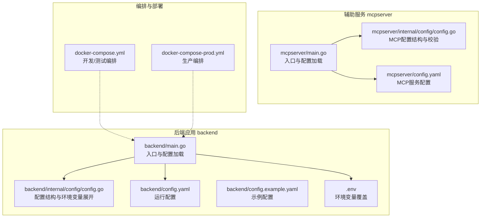
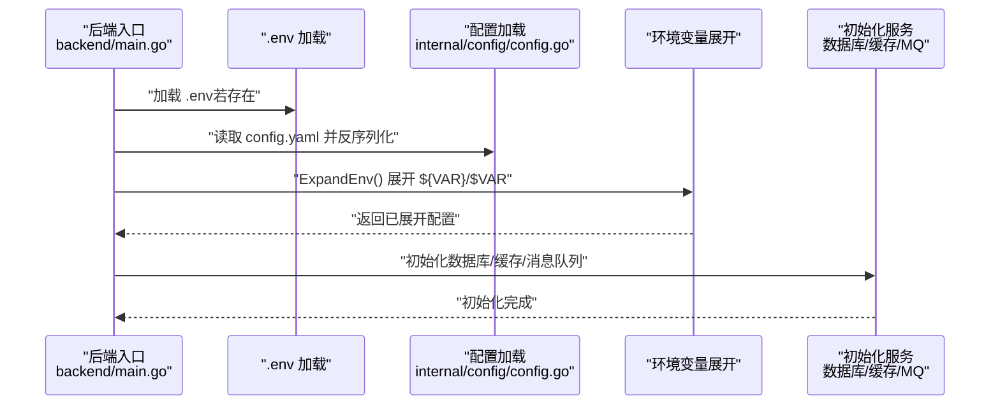
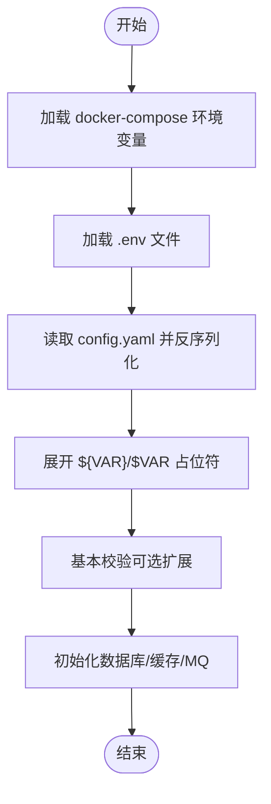
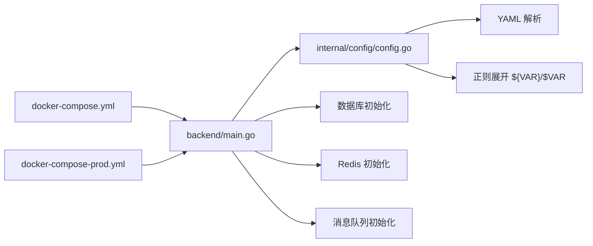

# 环境配置管理

<cite>
**本文引用的文件**   
- [backend/main.go](file://backend/main.go)
- [backend/internal/config/config.go](file://backend/internal/config/config.go)
- [backend/config.yaml](file://backend/config.yaml)
- [backend/config.example.yaml](file://backend/config.example.yaml)
- [backend/.env](file://backend/.env)
- [docker-compose.yml](file://docker-compose.yml)
- [docker-compose-prod.yml](file://docker-compose-prod.yml)
- [backend/chatApp/config/config.go](file://backend/chatApp/config/config.go)
- [mcpserver/main.go](file://mcpserver/main.go)
- [mcpserver/internal/config/config.go](file://mcpserver/internal/config/config.go)
- [mcpserver/config.yaml](file://mcpserver/config.yaml)
- [backend/internal/service/common/util.go](file://backend/internal/service/common/util.go)
</cite>

## 目录
1. [简介](#简介)
2. [项目结构](#项目结构)
3. [核心组件](#核心组件)
4. [架构总览](#架构总览)
5. [详细组件分析](#详细组件分析)
6. [依赖关系分析](#依赖关系分析)
7. [性能考量](#性能考量)
8. [故障排查指南](#故障排查指南)
9. [结论](#结论)
10. [附录](#附录)

## 简介
本文件面向面试吧平台的运维与开发团队，系统化梳理环境配置管理方案，覆盖开发、测试与生产三类环境的配置差异与优先级；解释配置文件的层次结构与加载顺序；阐述数据库、缓存、AI服务与第三方集成的配置要点；给出环境变量安全管理、敏感信息加密与配置热更新的可行方案；并提供配置验证、模板与最佳实践，以及变更影响评估与回滚策略。

## 项目结构
面试吧平台采用“主应用 + 辅助服务”的多模块布局：
- 主应用后端位于 backend，负责 API、业务逻辑与配置加载
- 辅助服务 mcpserver 提供 MCP 工具服务
- docker-compose 提供本地与生产级编排
- 配置文件集中于 backend/config.yaml、示例 backend/config.example.yaml 与 .env

图表来源
- [backend/main.go](file://backend/main.go#L29-L70)
- [backend/internal/config/config.go](file://backend/internal/config/config.go#L136-L152)
- [backend/config.yaml](file://backend/config.yaml#L1-L129)
- [backend/config.example.yaml](file://backend/config.example.yaml#L1-L127)
- [backend/.env](file://backend/.env#L1-L16)
- [docker-compose.yml](file://docker-compose.yml#L144-L176)
- [docker-compose-prod.yml](file://docker-compose-prod.yml#L144-L176)
- [mcpserver/main.go](file://mcpserver/main.go#L17-L38)
- [mcpserver/internal/config/config.go](file://mcpserver/internal/config/config.go#L57-L82)
- [mcpserver/config.yaml](file://mcpserver/config.yaml#L1-L36)

章节来源
- [backend/main.go](file://backend/main.go#L29-L70)
- [backend/internal/config/config.go](file://backend/internal/config/config.go#L136-L152)
- [backend/config.yaml](file://backend/config.yaml#L1-L129)
- [backend/config.example.yaml](file://backend/config.example.yaml#L1-L127)
- [backend/.env](file://backend/.env#L1-L16)
- [docker-compose.yml](file://docker-compose.yml#L144-L176)
- [docker-compose-prod.yml](file://docker-compose-prod.yml#L144-L176)
- [mcpserver/main.go](file://mcpserver/main.go#L17-L38)
- [mcpserver/internal/config/config.go](file://mcpserver/internal/config/config.go#L57-L82)
- [mcpserver/config.yaml](file://mcpserver/config.yaml#L1-L36)

## 核心组件
- 配置加载与展开
  - 后端主程序先加载 .env，再加载 config.yaml，并对配置中的环境变量占位符进行展开
  - 配置结构体覆盖数据库、缓存、Hertz、AI与第三方集成等模块
- 环境变量覆盖
  - .env 用于本地覆盖敏感或动态配置
  - docker-compose 通过环境变量注入数据库、缓存与 Milvus 地址等
- MCP 服务配置
  - mcpserver 提供独立的配置文件与默认值校验逻辑

章节来源
- [backend/main.go](file://backend/main.go#L30-L48)
- [backend/internal/config/config.go](file://backend/internal/config/config.go#L136-L152)
- [backend/internal/config/config.go](file://backend/internal/config/config.go#L212-L234)
- [backend/.env](file://backend/.env#L1-L16)
- [docker-compose.yml](file://docker-compose.yml#L153-L163)
- [mcpserver/main.go](file://mcpserver/main.go#L22-L38)
- [mcpserver/internal/config/config.go](file://mcpserver/internal/config/config.go#L57-L82)

## 架构总览
下图展示配置加载与覆盖的关键流程，包括 .env、config.yaml 与环境变量的优先级与作用域。

图表来源
- [backend/main.go](file://backend/main.go#L30-L48)
- [backend/internal/config/config.go](file://backend/internal/config/config.go#L136-L152)
- [backend/internal/config/config.go](file://backend/internal/config/config.go#L212-L234)

章节来源
- [backend/main.go](file://backend/main.go#L30-L48)
- [backend/internal/config/config.go](file://backend/internal/config/config.go#L212-L234)

## 详细组件分析

### 配置文件层次与优先级
- 层次结构
  - 基础配置：backend/config.yaml
  - 示例配置：backend/config.example.yaml（不含敏感信息）
  - 环境变量覆盖：backend/.env
  - 容器环境变量：docker-compose.yml（开发/测试）、docker-compose-prod.yml（生产）
- 优先级规则
  - 容器环境变量 > .env > config.yaml
  - 展开阶段：config.yaml 中的 ${VAR}/$VAR 由系统环境变量替换
  - 若未提供环境变量，保留原占位符（当前实现）

图表来源
- [backend/main.go](file://backend/main.go#L30-L48)
- [backend/internal/config/config.go](file://backend/internal/config/config.go#L212-L234)
- [docker-compose.yml](file://docker-compose.yml#L153-L163)
- [backend/.env](file://backend/.env#L1-L16)

章节来源
- [backend/main.go](file://backend/main.go#L30-L48)
- [backend/internal/config/config.go](file://backend/internal/config/config.go#L212-L234)
- [backend/config.yaml](file://backend/config.yaml#L61-L79)
- [backend/.env](file://backend/.env#L1-L16)
- [docker-compose.yml](file://docker-compose.yml#L153-L163)

### 数据库连接配置
- 配置项
  - driver、dsn、最大连接数、空闲连接数、连接生命周期
- 加载与初始化
  - 由后端主程序加载配置并初始化数据库连接
- 环境覆盖
  - docker-compose 中通过 DB_HOST/DB_PORT/DB_USER/DB_PASSWORD/DB_NAME 注入
- 安全建议
  - 使用只读账号用于查询场景
  - 连接池参数随负载调整，避免过大导致资源争用

章节来源
- [backend/config.yaml](file://backend/config.yaml#L6-L11)
- [backend/main.go](file://backend/main.go#L50-L56)
- [docker-compose.yml](file://docker-compose.yml#L154-L158)

### 缓存配置（Redis）
- 配置项
  - 地址、密码、DB索引、拨号/读写超时、连接池大小、最小空闲连接
- 加载与初始化
  - 由后端主程序加载配置并初始化 Redis 连接
- 环境覆盖
  - docker-compose 中通过 REDIS_HOST/REDIS_PORT/REDIS_PASSWORD 注入
- 安全建议
  - 生产环境开启密码认证与网络隔离
  - 连接池大小与最小空闲连接根据 QPS 调优

章节来源
- [backend/config.yaml](file://backend/config.yaml#L14-L22)
- [backend/main.go](file://backend/main.go#L58-L64)
- [docker-compose.yml](file://docker-compose.yml#L159-L161)

### Hertz 框架配置
- 配置项
  - 日志级别与路径、读/写/空闲超时
- 加载与使用
  - 由后端主程序基于配置创建 Hertz 服务器实例
- 安全建议
  - 生产环境建议开启访问日志与审计日志

章节来源
- [backend/config.yaml](file://backend/config.yaml#L25-L30)
- [backend/main.go](file://backend/main.go#L102-L102)

### 安全与跨域配置
- 配置项
  - JWT 密钥与过期时间、CORS 允许来源/方法/头
- 加载与使用
  - 后端主程序加载配置并注入全局中间件
- 安全建议
  - JWT 密钥定期轮换
  - CORS 白名单仅限必要来源

章节来源
- [backend/config.yaml](file://backend/config.yaml#L40-L48)
- [backend/main.go](file://backend/main.go#L107-L125)

### 第三方与 AI 服务配置
- Google 搜索
  - API Key 与 Search Engine ID
  - chatApp 子模块独立加载 google 节点
- OpenAI
  - API Key、模型名、Base URL
- Embedding 服务（含环境变量引用）
  - APIKey、Model、BaseURL、Region
  - 支持 ${VAR} 与 $VAR 两种占位符语法
- Milvus（向量数据库）
  - Address、Username、Password、DatabaseName、CollectionName
  - Collections 多集合映射、TopK、MetricType、ConnectTimeout/SearchTimeout
- 微信与飞书
  - 微信 AppID/AppSecret/回调地址
  - 飞书 Webhook URL 与开关

章节来源
- [backend/config.yaml](file://backend/config.yaml#L51-L59)
- [backend/config.yaml](file://backend/config.yaml#L61-L79)
- [backend/config.yaml](file://backend/config.yaml#L81-L101)
- [backend/config.yaml](file://backend/config.yaml#L113-L129)
- [backend/chatApp/config/config.go](file://backend/chatApp/config/config.go#L21-L32)
- [backend/chatApp/config/config.go](file://backend/chatApp/config/config.go#L36-L73)

### 环境变量的安全管理与敏感信息加密
- 环境变量覆盖
  - .env 用于本地覆盖敏感字段
  - docker-compose 用于容器内覆盖数据库、缓存与 Milvus 地址
- 占位符展开
  - 支持 ${VAR_NAME} 与 $VAR_NAME 两种语法
  - 未匹配到环境变量时保留原样
- 敏感信息加密
  - 提供 API Key 加密/解密工具函数，使用 AES-CBC
  - 加密密钥来自环境变量 USER_MODEL_API_KEY_SECRET，未设置时使用默认密钥

章节来源
- [backend/internal/config/config.go](file://backend/internal/config/config.go#L236-L268)
- [backend/.env](file://backend/.env#L1-L16)
- [docker-compose.yml](file://docker-compose.yml#L153-L163)
- [backend/internal/service/common/util.go](file://backend/internal/service/common/util.go#L17-L42)

### 配置验证与模板
- 配置验证
  - mcpserver 内置默认值与校验逻辑，缺失字段自动补全
  - 建议在后端配置中增加 Validate 方法，校验必填项与默认值
- 配置模板
  - 使用 config.example.yaml 作为模板，移除敏感信息
  - 建议按环境拆分：config.dev.yaml、config.test.yaml、config.prod.yaml

章节来源
- [mcpserver/internal/config/config.go](file://mcpserver/internal/config/config.go#L127-L147)
- [backend/config.example.yaml](file://backend/config.example.yaml#L1-L127)

### 配置热更新机制
- 当前实现
  - 后端主程序在启动时一次性加载配置并初始化服务，未内置热更新
- 建议方案
  - 引入配置中心（如 etcd/Consul），监听配置变更并触发平滑重启
  - 对于非连接类配置，可在业务层支持重新读取与生效
  - 对于数据库/缓存连接，建议通过滚动升级配合健康检查实现

章节来源
- [backend/main.go](file://backend/main.go#L29-L70)

## 依赖关系分析
- 组件耦合
  - 后端主程序依赖配置模块加载与展开
  - 配置模块依赖 YAML 解析与正则表达式展开
  - docker-compose 通过环境变量驱动后端与辅助服务
- 外部依赖
  - Hertz 框架、MySQL、Redis、可选 Milvus
- 潜在风险
  - 环境变量未设置导致占位符残留
  - 配置校验缺失引发运行时错误

图表来源
- [backend/main.go](file://backend/main.go#L50-L87)
- [backend/internal/config/config.go](file://backend/internal/config/config.go#L136-L152)
- [backend/internal/config/config.go](file://backend/internal/config/config.go#L236-L268)
- [docker-compose.yml](file://docker-compose.yml#L144-L176)
- [docker-compose-prod.yml](file://docker-compose-prod.yml#L144-L176)

章节来源
- [backend/main.go](file://backend/main.go#L50-L87)
- [backend/internal/config/config.go](file://backend/internal/config/config.go#L136-L152)
- [backend/internal/config/config.go](file://backend/internal/config/config.go#L236-L268)
- [docker-compose.yml](file://docker-compose.yml#L144-L176)
- [docker-compose-prod.yml](file://docker-compose-prod.yml#L144-L176)

## 性能考量
- 连接池与超时
  - 数据库与缓存连接池参数直接影响吞吐与延迟
  - Hertz 读/写/空闲超时需结合业务峰值调优
- 环境变量展开成本
  - 正则替换在启动阶段执行，对运行时性能影响可忽略
- 缓存命中与 Milvus 检索
  - Embedding 维度、Milvus TopK 与检索超时需结合数据规模与硬件能力调优

章节来源
- [backend/config.yaml](file://backend/config.yaml#L6-L11)
- [backend/config.yaml](file://backend/config.yaml#L14-L22)
- [backend/config.yaml](file://backend/config.yaml#L25-L30)
- [backend/config.yaml](file://backend/config.yaml#L61-L79)
- [backend/config.yaml](file://backend/config.yaml#L81-L101)

## 故障排查指南
- 配置加载失败
  - 检查 config.yaml 语法与字段拼写
  - 确认 .env 与 docker-compose 环境变量是否正确挂载
- 占位符未展开
  - 确认环境变量名与占位符一致（区分 ${VAR} 与 $VAR）
  - 检查 .env 与 docker-compose 是否正确注入
- 数据库/缓存连接异常
  - 核对主机名、端口、凭据与网络连通性
  - 检查连接池参数与最大连接限制
- MCP 服务启动失败
  - 检查 mcpserver/config.yaml 与默认值校验逻辑
  - 确认 API Key 配置与工具注册

章节来源
- [backend/main.go](file://backend/main.go#L30-L48)
- [backend/internal/config/config.go](file://backend/internal/config/config.go#L236-L268)
- [mcpserver/main.go](file://mcpserver/main.go#L22-L38)
- [mcpserver/internal/config/config.go](file://mcpserver/internal/config/config.go#L127-L147)

## 结论
面试吧平台的配置体系以 config.yaml 为核心，辅以 .env 与 docker-compose 的环境变量覆盖，实现了开发、测试与生产的差异化部署。建议进一步完善配置验证、按环境拆分配置文件、引入配置热更新与配置中心，并强化敏感信息加密与密钥轮换策略，以提升安全性与可维护性。

## 附录

### 环境配置差异与最佳实践
- 开发环境
  - 使用 config.dev.yaml，本地 .env 覆盖敏感信息
  - docker-compose 本地暴露端口便于调试
- 测试环境
  - 使用 config.test.yaml，与开发环境隔离
  - 通过 CI 注入测试专用环境变量
- 生产环境
  - 使用 config.prod.yaml，禁用示例密钥
  - 通过配置中心或密钥管理服务注入敏感变量
  - 启用 TLS、最小权限与审计日志

章节来源
- [backend/config.example.yaml](file://backend/config.example.yaml#L1-L127)
- [docker-compose.yml](file://docker-compose.yml#L144-L176)
- [docker-compose-prod.yml](file://docker-compose-prod.yml#L144-L176)

### 配置变更影响评估与回滚策略
- 影响评估
  - 数据库/缓存：评估连接池与超时变更对性能的影响
  - AI/第三方：评估模型切换与 API Key 变更对业务可用性的影响
  - 安全：评估 CORS/JWT 变更对前端与移动端的影响
- 回滚策略
  - 采用蓝绿/金丝雀发布，保留旧版本镜像与配置
  - 配置回滚：快速恢复到上一个稳定配置版本
  - 数据库迁移：使用可逆迁移脚本与备份恢复

章节来源
- [backend/main.go](file://backend/main.go#L130-L173)
- [mcpserver/main.go](file://mcpserver/main.go#L70-L98)