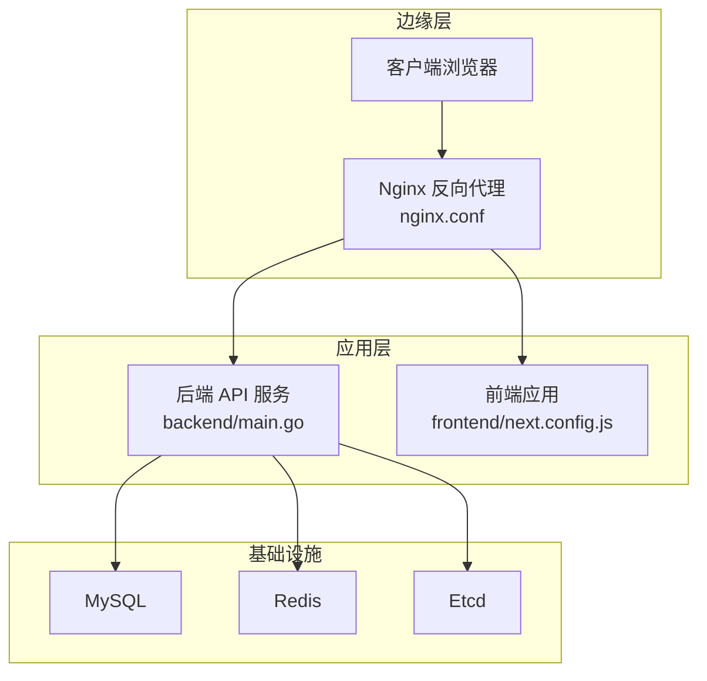
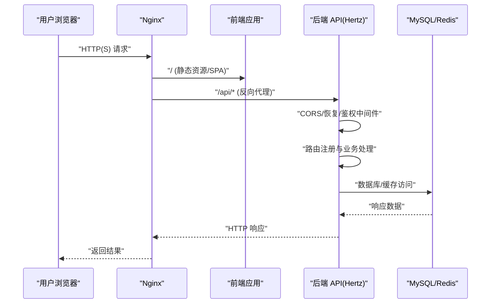
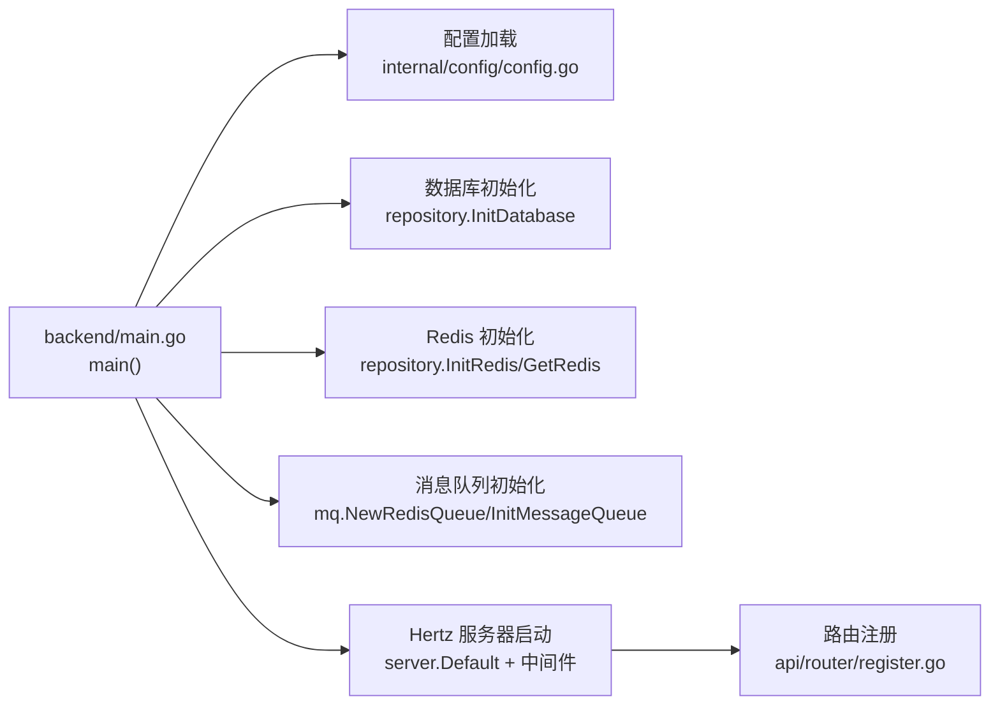

# 负载均衡与监控

<cite>
**本文引用的文件**
- [nginx.conf](file://nginx.conf)
- [docker-compose.yml](file://docker-compose.yml)
- [docker-compose-prod.yml](file://docker-compose-prod.yml)
- [backend/main.go](file://backend/main.go)
- [backend/config.yaml](file://backend/config.yaml)
- [backend/internal/config/config.go](file://backend/internal/config/config.go)
- [backend/Dockerfile](file://backend/Dockerfile)
- [frontend/Dockerfile](file://frontend/Dockerfile)
- [backend/internal/alert/feishu.go](file://backend/internal/alert/feishu.go)
- [backend/api/router/middleware/recovery.go](file://backend/api/router/middleware/recovery.go)
- [backend/api/router/register.go](file://backend/api/router/register.go)
- [frontend/next.config.js](file://frontend/next.config.js)
- [mcpserver/internal/server/server.go](file://mcpserver/internal/server/server.go)
</cite>

## 目录
1. [简介](#简介)
2. [项目结构](#项目结构)
3. [核心组件](#核心组件)
4. [架构总览](#架构总览)
5. [详细组件分析](#详细组件分析)
6. [依赖关系分析](#依赖关系分析)
7. [性能考量](#性能考量)
8. [故障排查指南](#故障排查指南)
9. [结论](#结论)
10. [附录](#附录)

## 简介
本文件面向面试吧平台的运维与开发团队，系统化梳理平台的负载均衡与监控体系，覆盖 Nginx 反向代理配置、SSL 证书管理、静态资源处理、负载均衡策略、健康检查与故障转移、应用性能监控、日志采集与告警、APM 工具集成、性能指标监控与容量规划、监控仪表板与告警规则配置以及应急响应流程。文档以仓库现有配置与代码为依据，结合可扩展的最佳实践，帮助读者快速落地生产级的高可用与可观测性方案。

## 项目结构
面试吧平台采用前后端分离架构，通过 Nginx 作为统一入口进行反向代理与静态资源处理；后端基于 Hertz 框架提供 API 服务，前端基于 Next.js 构建。容器编排使用 Docker Compose，分别提供本地开发与生产部署的编排文件。

图表来源
- [nginx.conf](file://nginx.conf#L1-L61)
- [docker-compose.yml](file://docker-compose.yml#L177-L206)
- [backend/main.go](file://backend/main.go#L29-L173)
- [frontend/next.config.js](file://frontend/next.config.js#L1-L11)

章节来源
- [docker-compose.yml](file://docker-compose.yml#L1-L226)
- [docker-compose-prod.yml](file://docker-compose-prod.yml#L1-L213)
- [nginx.conf](file://nginx.conf#L1-L61)

## 核心组件
- Nginx 反向代理与静态资源处理：统一入口、路由转发、WebSocket/SSE 支持、健康检查端点。
- 后端 API 服务：基于 Hertz 的微服务，内置恢复中间件、CORS、JWT 中间件与路由注册。
- 前端应用：Next.js 应用，通过 rewrites 将 /api/* 代理至后端。
- 健康检查：后端与容器均提供健康检查能力，便于负载均衡与编排系统识别服务状态。
- 告警：飞书告警通道，支持数据库错误等关键事件通知。

章节来源
- [backend/main.go](file://backend/main.go#L101-L128)
- [backend/api/router/middleware/recovery.go](file://backend/api/router/middleware/recovery.go#L15-L34)
- [backend/internal/alert/feishu.go](file://backend/internal/alert/feishu.go#L24-L79)
- [backend/Dockerfile](file://backend/Dockerfile#L58-L63)
- [frontend/Dockerfile](file://frontend/Dockerfile#L59-L61)

## 架构总览
下图展示从客户端到后端 API 的典型请求链路，包括 Nginx 的路由与代理行为、后端服务的中间件处理与路由注册。

图表来源
- [nginx.conf](file://nginx.conf#L15-L52)
- [backend/main.go](file://backend/main.go#L101-L128)
- [backend/api/router/register.go](file://backend/api/router/register.go#L11-L16)
- [frontend/next.config.js](file://frontend/next.config.js#L1-L11)

## 详细组件分析

### Nginx 反向代理与 SSL 证书管理
- 反向代理配置
  - 后端上游：backend（localhost:8888）
  - 前端上游：frontend（localhost:3000）
  - API 路由优先级高于静态资源
- 头部与协议透传：X-Real-IP、X-Forwarded-For、X-Forwarded-Proto
- WebSocket/SSE 支持：升级头与长连接超时配置
- 静态资源与 SPA：禁用缓冲，避免缓存影响
- 健康检查端点：/health 返回“healthy”，关闭访问日志
- SSL 证书管理
  - 当前配置仅监听 80 端口，未包含 HTTPS/SSL 指令
  - 建议在生产环境启用 TLS，并结合 Let’s Encrypt 自动续期

章节来源
- [nginx.conf](file://nginx.conf#L1-L61)

### 负载均衡策略、健康检查与故障转移
- 负载均衡策略
  - 当前为单实例 upstream，未实现多实例轮询或加权
  - 建议在生产环境增加多个后端实例，并启用权重与会话亲和（如需）
- 健康检查
  - Nginx 层：/health 简易探活
  - 容器层：后端与前端 Dockerfile 均配置 HEALTHCHECK
  - 数据库与缓存：compose 中对 MySQL、Redis、Etcd 提供健康检查
- 故障转移
  - 建议在上游 LB（如 Nginx 多后端）或编排系统中启用故障摘除与自动恢复

章节来源
- [nginx.conf](file://nginx.conf#L54-L60)
- [backend/Dockerfile](file://backend/Dockerfile#L58-L63)
- [frontend/Dockerfile](file://frontend/Dockerfile#L59-L61)
- [docker-compose.yml](file://docker-compose.yml#L15-L19)
- [docker-compose.yml](file://docker-compose.yml#L31-L35)
- [docker-compose.yml](file://docker-compose.yml#L66-L70)

### 应用性能监控、日志收集与告警
- 日志与中间件
  - Hertz 服务端配置包含日志级别与路径
  - 恢复中间件捕获 panic 并返回统一错误
  - 前端 Next.js 通过 rewrites 将 /api/* 转发至后端
- 告警机制
  - 飞书告警通道：可配置 Webhook，发送文本告警
  - 数据库错误告警封装：统一标题与内容格式
- 建议增强
  - 引入结构化日志（JSON），便于集中采集
  - 集成 APM（如 OpenTelemetry）追踪与指标上报
  - 健康检查与慢查询报警联动

章节来源
- [backend/config.yaml](file://backend/config.yaml#L24-L30)
- [backend/api/router/middleware/recovery.go](file://backend/api/router/middleware/recovery.go#L15-L34)
- [frontend/next.config.js](file://frontend/next.config.js#L1-L11)
- [backend/internal/alert/feishu.go](file://backend/internal/alert/feishu.go#L24-L79)

### APM 工具集成、性能指标监控与容量规划
- APM 集成建议
  - 使用 OpenTelemetry SDK 为 Hertz 服务注入追踪与指标
  - 为数据库与缓存调用埋点，统计延迟与错误率
  - 为外部服务（如 OpenAI/Embedding）增加客户端追踪
- 性能指标
  - QPS、P95/P99 延迟、错误率、连接池利用率、GC 指标
  - 前端首屏时间、交互延迟（可在前端侧采集）
- 容量规划
  - 基于峰值 QPS 与平均响应时间估算 CPU/内存/网络
  - 为数据库与缓存预留连接池与副本
  - 通过 HPA/HPA 类似机制（容器编排）动态扩缩容

章节来源
- [backend/config.yaml](file://backend/config.yaml#L6-L23)
- [backend/internal/config/config.go](file://backend/internal/config/config.go#L13-L31)

### 监控仪表板配置、告警规则设置与应急响应流程
- 仪表板建议
  - Grafana + Prometheus：展示后端接口指标、数据库/缓存健康、容器资源使用
  - 飞书/企业微信告警：统一收敛与升级
- 告警规则示例
  - 后端 5xx 错误率 > 1% 持续 5 分钟
  - 接口 P95 延迟 > 2 秒（按端点细分）
  - 数据库连接池空闲率 < 10%
  - 健康检查失败连续超过阈值
- 应急响应
  - 快速定位：查看 Nginx/容器健康日志与后端追踪
  - 降级与熔断：对外部依赖增加超时与熔断策略
  - 回滚与扩容：灰度发布与快速回滚，必要时扩容

章节来源
- [backend/Dockerfile](file://backend/Dockerfile#L58-L63)
- [backend/internal/alert/feishu.go](file://backend/internal/alert/feishu.go#L24-L79)

### 性能优化建议与监控最佳实践
- Nginx 层
  - 启用 gzip/HTTP/2，合理设置缓冲与超时
  - 对静态资源开启长期缓存与 CDN
- 后端层
  - 连接池参数与超时配置需与数据库/缓存特性匹配
  - 使用连接池复用与合理的空闲回收策略
  - 对热点接口增加缓存与限流
- 前端层
  - 图片与静态资源压缩与懒加载
  - API 请求去抖与并发控制
- 监控最佳实践
  - 统一日志格式与标签，便于检索与聚合
  - 指标命名清晰、维度完整
  - 告警分级与抑制，避免告警风暴

章节来源
- [nginx.conf](file://nginx.conf#L13-L38)
- [backend/config.yaml](file://backend/config.yaml#L6-L23)
- [frontend/next.config.js](file://frontend/next.config.js#L1-L11)

## 依赖关系分析
后端主程序初始化顺序与关键依赖如下：

图表来源
- [backend/main.go](file://backend/main.go#L29-L173)
- [backend/internal/config/config.go](file://backend/internal/config/config.go#L136-L152)
- [backend/api/router/register.go](file://backend/api/router/register.go#L11-L16)

章节来源
- [backend/main.go](file://backend/main.go#L29-L173)

## 性能考量
- 连接池与超时
  - 数据库最大连接数、空闲连接与生命周期
  - Redis 连接池大小与读写超时
- 代理与缓冲
  - Nginx 对 SSE/WS 的特殊配置与长连接超时
  - 前端 Next.js 的请求缓冲策略
- 资源与健康检查
  - 容器健康检查间隔与超时，避免误判
  - 后端服务端超时与优雅停机

章节来源
- [backend/config.yaml](file://backend/config.yaml#L6-L23)
- [nginx.conf](file://nginx.conf#L24-L52)
- [backend/Dockerfile](file://backend/Dockerfile#L58-L63)
- [frontend/Dockerfile](file://frontend/Dockerfile#L59-L61)

## 故障排查指南
- 健康检查失败
  - 检查 Nginx /health 与容器 HEALTHCHECK
  - 核对后端 /health 是否可达（Hertz 服务是否启动）
- 代理异常
  - 确认 /api/* 路由是否正确转发至 backend
  - 检查 X-Forwarded-* 头是否正确透传
- 前端无法访问后端
  - 核对前端 next.config.js 重写规则
  - 检查 CORS 与 JWT 中间件是否拦截请求
- 告警未触发
  - 检查飞书 Webhook 配置与开关
  - 确认错误路径是否调用告警函数

章节来源
- [nginx.conf](file://nginx.conf#L54-L60)
- [backend/Dockerfile](file://backend/Dockerfile#L58-L63)
- [frontend/next.config.js](file://frontend/next.config.js#L1-L11)
- [backend/internal/alert/feishu.go](file://backend/internal/alert/feishu.go#L24-L79)

## 结论
面试吧平台当前具备基础的反向代理、容器健康检查与告警能力。为满足生产级需求，建议补充：
- Nginx 多后端与 SSL/TLS 配置
- APM 集成与结构化日志
- 完善的监控仪表板与分级告警
- 容量规划与弹性伸缩策略
- 明确的应急响应流程与演练

以上改进将显著提升系统的稳定性、可观测性与可维护性。

## 附录
- 生产编排参考：docker-compose-prod.yml 中的后端与前端服务配置
- MCP 服务健康检查：用于工具链与协议服务的健康端点

章节来源
- [docker-compose-prod.yml](file://docker-compose-prod.yml#L144-L193)
- [mcpserver/internal/server/server.go](file://mcpserver/internal/server/server.go#L107-L108)