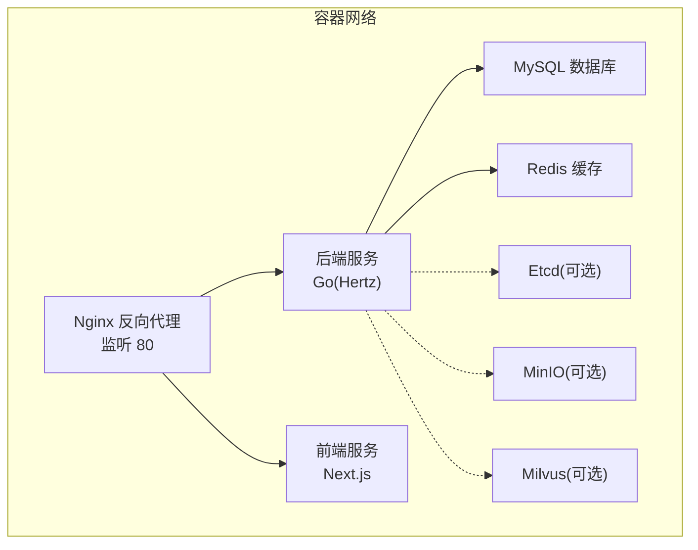
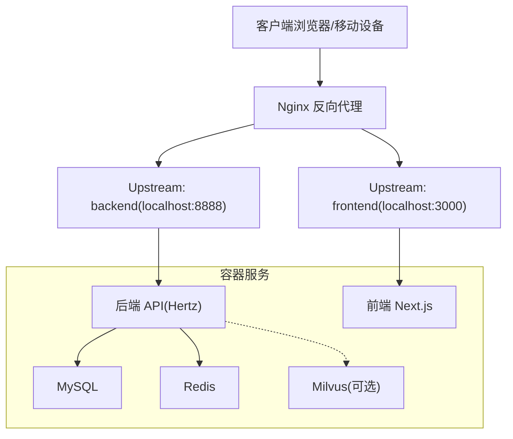
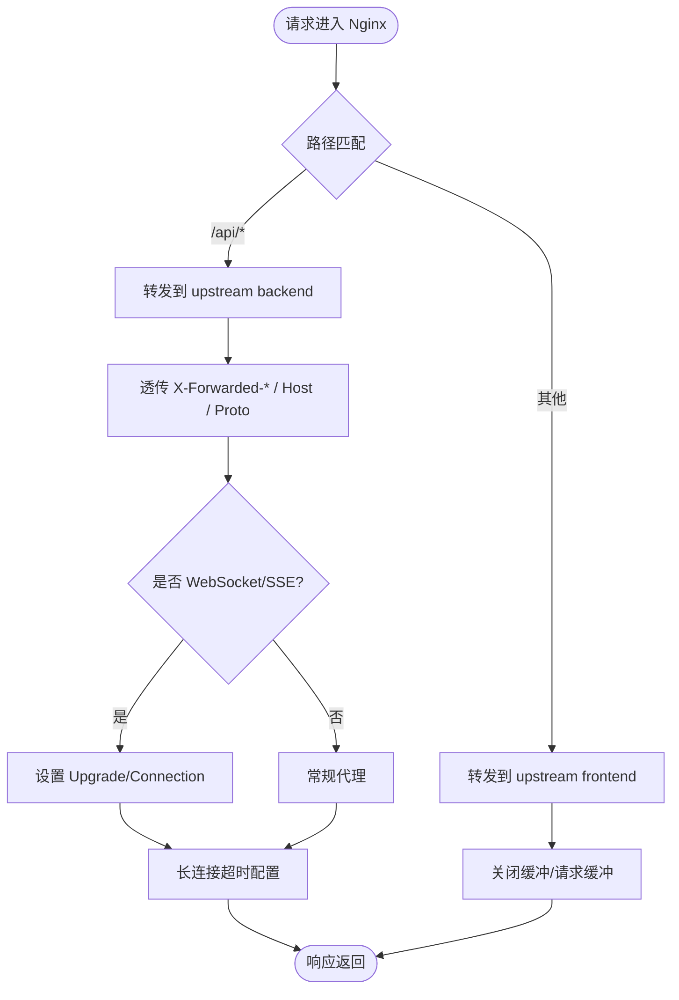
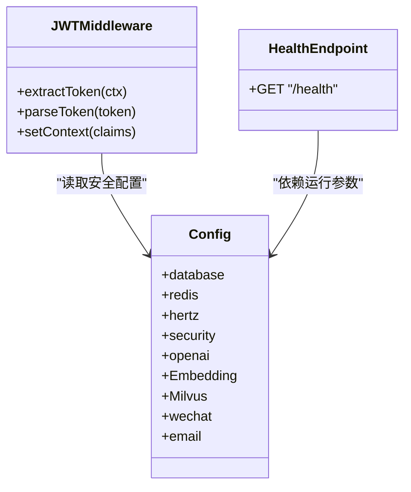
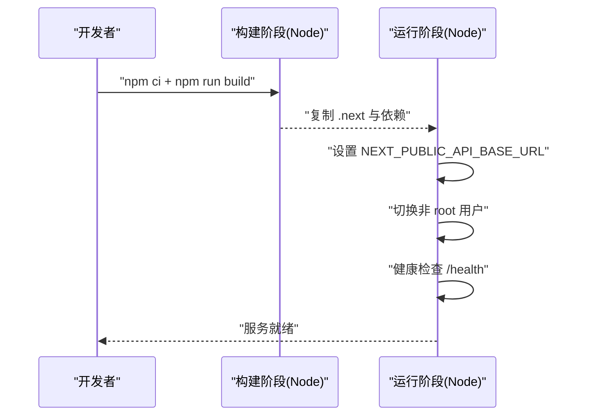
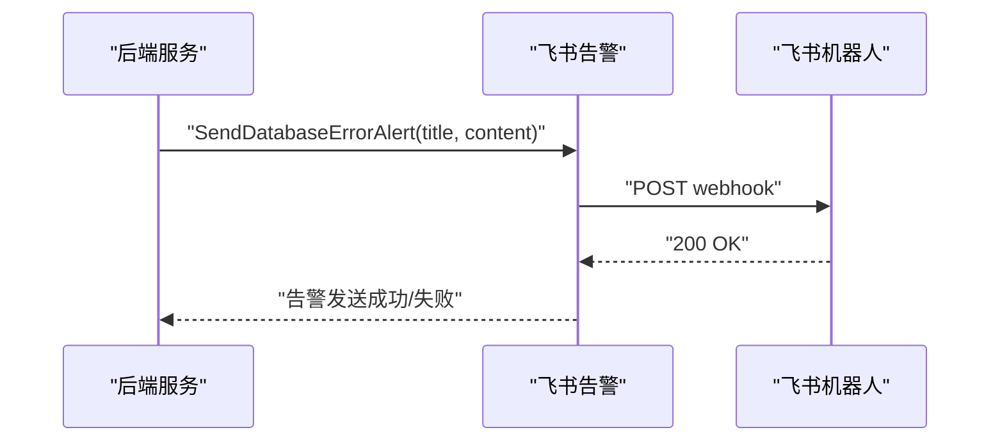
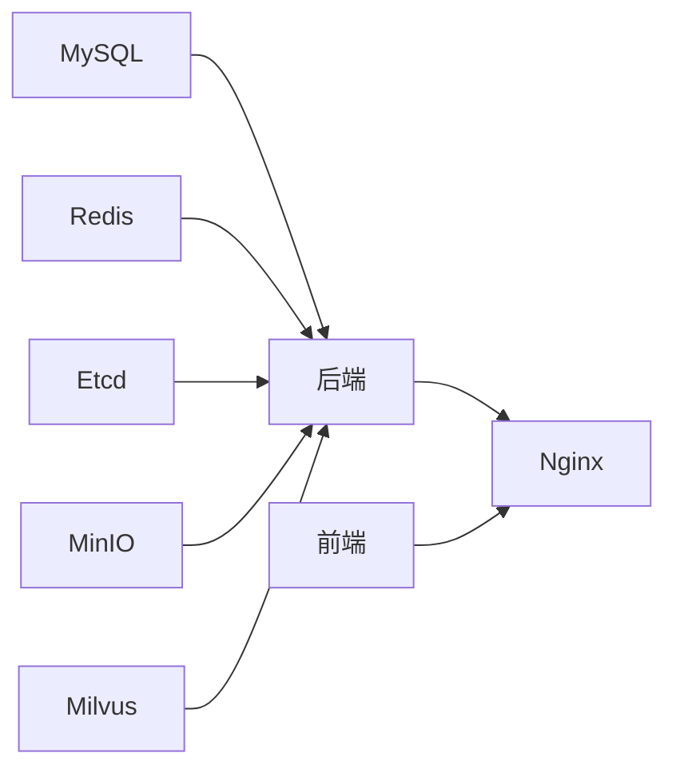

# 部署与运维

<cite>
**本文引用的文件**
- [docker-compose.yml](file://docker-compose.yml)
- [docker-compose-prod.yml](file://docker-compose-prod.yml)
- [nginx.conf](file://nginx.conf)
- [backend/Dockerfile](file://backend/Dockerfile)
- [frontend/Dockerfile](file://frontend/Dockerfile)
- [backend/config.yaml](file://backend/config.yaml)
- [backend/config.example.yaml](file://backend/config.example.yaml)
- [backend/.env](file://backend/.env)
- [backend/internal/alert/feishu.go](file://backend/internal/alert/feishu.go)
- [backend/internal/alert/feishu_test.go](file://backend/internal/alert/feishu_test.go)
- [backend/internal/middleware/jwt.go](file://backend/internal/middleware/jwt.go)
- [doc/teach/hertz教学方案.md](file://doc/teach/hertz教学方案.md)
- [doc/项目优化建议_性能安全篇.md](file://doc/项目优化建议_性能安全篇.md)
- [README.md](file://README.md)
</cite>

## 目录
1. [简介](#简介)
2. [项目结构](#项目结构)
3. [核心组件](#核心组件)
4. [架构总览](#架构总览)
5. [详细组件分析](#详细组件分析)
6. [依赖关系分析](#依赖关系分析)
7. [性能考量](#性能考量)
8. [故障排查指南](#故障排查指南)
9. [结论](#结论)
10. [附录](#附录)

## 简介
本文件面向面试吧平台的部署与运维团队，提供从开发到生产的容器化部署方案、环境差异化配置、Nginx反向代理与负载均衡、SSL证书管理、监控告警、日志管理、性能优化、自动化部署与回滚、灾难恢复以及安全加固与权限管理等全链路运维实践指南。文档内容严格基于仓库现有配置与代码实现，避免臆造信息。

## 项目结构
面试吧平台由后端（Go + Hertz）、前端（Next.js）、数据库（MySQL）、缓存（Redis）、可选向量数据库（Milvus）及反向代理（Nginx）组成。容器编排通过 Docker Compose 实现，支持开发、测试与生产三套环境配置。

图表来源
- [docker-compose.yml](file://docker-compose.yml#L1-L226)
- [docker-compose-prod.yml](file://docker-compose-prod.yml#L1-L213)

章节来源
- [docker-compose.yml](file://docker-compose.yml#L1-L226)
- [docker-compose-prod.yml](file://docker-compose-prod.yml#L1-L213)
- [README.md](file://README.md#L277-L308)

## 核心组件
- 反向代理与入口网关：Nginx，负责 HTTP/HTTPS、WebSocket/SSE、健康检查与静态资源转发。
- 后端服务：Go 应用（Hertz），提供 REST API、JWT 认证、CORS、日志与健康检查。
- 前端服务：Next.js 应用，提供用户交互界面。
- 数据与缓存：MySQL（持久化）、Redis（缓存/会话/队列）。
- 可选组件：Etcd、MinIO、Milvus（向量检索）。
- 配置与密钥：config.yaml、.env、环境变量注入。

章节来源
- [nginx.conf](file://nginx.conf#L1-L61)
- [backend/Dockerfile](file://backend/Dockerfile#L1-L64)
- [frontend/Dockerfile](file://frontend/Dockerfile#L1-L65)
- [backend/config.yaml](file://backend/config.yaml#L1-L129)
- [backend/.env](file://backend/.env#L1-L16)

## 架构总览
下图展示容器化部署的典型拓扑与流量走向，包括健康检查、API 路由、静态资源与 SSE/WebSocket 的处理路径。

图表来源
- [nginx.conf](file://nginx.conf#L1-L61)
- [docker-compose.yml](file://docker-compose.yml#L177-L206)

## 详细组件分析

### Nginx 反向代理与负载均衡
- 上游定义：分别指向后端 API 与前端 Next.js。
- 路由规则：
  - /api/ 前缀转发至后端，并透传 Host、X-Real-IP、X-Forwarded-* 等头部。
  - / 前缀转发至前端 Next.js。
  - /health 健康检查返回 200。
- WebSocket/SSE 支持：开启 HTTP/1.1、Upgrade/Connection 头部透传；SSE 关闭缓冲与缓存。
- 超时与缓冲：针对长连接设置较长超时，前端关闭缓冲以提升实时性。

图表来源
- [nginx.conf](file://nginx.conf#L1-L61)

章节来源
- [nginx.conf](file://nginx.conf#L1-L61)

### 后端服务（Go + Hertz）
- 容器镜像：多阶段构建，最终运行在非 root 用户，暴露 8888 端口，内置健康检查。
- 配置来源：config.yaml（服务、数据库、Redis、Hertz、安全、AI、Milvus、微信、邮件等），.env 用于 Embedding/Milvus 等环境变量。
- 认证与中间件：JWT 中间件解析 Token 并注入用户上下文；CORS 配置允许跨域；Recovery 中间件兜底异常。
- 健康检查：/health 返回服务可用状态。

图表来源
- [backend/internal/middleware/jwt.go](file://backend/internal/middleware/jwt.go#L46-L98)
- [backend/config.yaml](file://backend/config.yaml#L1-L129)
- [backend/Dockerfile](file://backend/Dockerfile#L58-L63)

章节来源
- [backend/Dockerfile](file://backend/Dockerfile#L1-L64)
- [backend/config.yaml](file://backend/config.yaml#L1-L129)
- [backend/.env](file://backend/.env#L1-L16)
- [backend/internal/middleware/jwt.go](file://backend/internal/middleware/jwt.go#L46-L98)

### 前端服务（Next.js）
- 容器镜像：多阶段构建，运行时切换非 root 用户，暴露 3000 端口，内置健康检查。
- 构建参数：通过 ARG NEXT_PUBLIC_API_BASE_URL 注入 API 基础地址，便于不同环境切换。
- 健康检查：访问 3000 端口判断服务可用。

图表来源
- [frontend/Dockerfile](file://frontend/Dockerfile#L1-L65)

章节来源
- [frontend/Dockerfile](file://frontend/Dockerfile#L1-L65)

### 数据与缓存（MySQL + Redis）
- MySQL：容器内运行，映射 3307:3306，健康检查基于 mysqladmin ping。
- Redis：容器内运行，开启 AOF、密码认证，健康检查基于 redis-cli ping。
- 依赖关系：后端服务通过环境变量与容器网络访问 MySQL 与 Redis。

章节来源
- [docker-compose.yml](file://docker-compose.yml#L3-L39)
- [docker-compose-prod.yml](file://docker-compose-prod.yml#L3-L39)

### 可选组件（Etcd、MinIO、Milvus）
- Etcd：Milvus 依赖，健康检查基于 etcdctl endpoint health。
- MinIO：Milvus 对象存储依赖，当前 compose 中为注释状态。
- Milvus：向量数据库，当前 compose 中为注释状态，可在启用时按需放开。

章节来源
- [docker-compose.yml](file://docker-compose.yml#L41-L127)
- [docker-compose-prod.yml](file://docker-compose-prod.yml#L41-L142)

### 环境差异化配置
- 开发环境：使用 docker-compose.yml，后端挂载 config.yaml 与 logs 目录，便于热更新与调试。
- 生产环境：使用 docker-compose-prod.yml，前端通过 ARG 注入 API 基础地址，隐藏端口映射，强调安全与隔离。
- 环境变量：通过 .env 与 config.yaml 的环境变量占位符注入 Embedding、Milvus 等敏感配置。

章节来源
- [docker-compose.yml](file://docker-compose.yml#L144-L206)
- [docker-compose-prod.yml](file://docker-compose-prod.yml#L144-L193)
- [backend/config.yaml](file://backend/config.yaml#L61-L96)
- [backend/.env](file://backend/.env#L1-L16)

### 监控与告警
- 健康检查：Nginx 提供 /health；后端容器内置 HEALTHCHECK；前端容器内置 HEALTHCHECK。
- 告警：飞书告警模块可发送数据库错误等告警，需配置 webhook 地址与开关。
- 指标：仓库文档建议引入 Prometheus 指标（HTTP 请求总量/耗时、AI 模型调用等），可按建议逐步落地。

图表来源
- [backend/internal/alert/feishu.go](file://backend/internal/alert/feishu.go#L54-L78)

章节来源
- [nginx.conf](file://nginx.conf#L54-L59)
- [backend/Dockerfile](file://backend/Dockerfile#L58-L63)
- [frontend/Dockerfile](file://frontend/Dockerfile#L59-L61)
- [backend/internal/alert/feishu.go](file://backend/internal/alert/feishu.go#L54-L78)
- [backend/internal/alert/feishu_test.go](file://backend/internal/alert/feishu_test.go#L1-L41)
- [doc/项目优化建议_性能安全篇.md](file://doc/项目优化建议_性能安全篇.md#L498-L560)

### 日志管理
- 后端日志：Hertz 框架配置了日志路径与级别，容器内创建 logs 目录并以非 root 用户运行，便于持久化与权限控制。
- 建议：结合 Docker 日志驱动与集中化日志收集（如 ELK/Fluentd/Loki），对健康检查、错误日志、审计日志进行分类与轮转。

章节来源
- [backend/config.yaml](file://backend/config.yaml#L24-L31)
- [backend/Dockerfile](file://backend/Dockerfile#L49-L51)

### 性能优化策略
- 连接池与超时：数据库最大连接数、空闲连接数、连接生命周期；Redis 连接池大小与读写超时；Hertz 读写与空闲超时。
- 缓存策略：合理设置 Redis 过期策略、热点数据预热、慢查询与热点键治理。
- SSE/WebSocket：Nginx 关闭缓冲与缓存，长连接超时延长，减少不必要的代理层开销。
- 构建优化：Go/Node 多阶段构建，精简运行时镜像体积，使用国内代理加速依赖下载。

章节来源
- [backend/config.yaml](file://backend/config.yaml#L5-L31)
- [nginx.conf](file://nginx.conf#L24-L38)
- [backend/Dockerfile](file://backend/Dockerfile#L13-L15)
- [frontend/Dockerfile](file://frontend/Dockerfile#L10-L11)

### 自动化部署、回滚与灾难恢复
- 自动化部署：使用 docker-compose 在目标主机拉起服务，结合 CI/CD（如 GitHub Actions/GitLab CI）实现镜像构建与部署流水线。
- 回滚机制：通过版本化镜像标签与 compose 文件变更记录，快速回退至上一个稳定版本。
- 灾难恢复：MySQL/Redis/ETCD 数据卷备份与恢复；Nginx 配置与证书备份；后端配置文件与日志目录持久化。

章节来源
- [docker-compose.yml](file://docker-compose.yml#L208-L226)
- [docker-compose-prod.yml](file://docker-compose-prod.yml#L195-L213)

### 安全加固与权限管理
- 认证与授权：JWT 中间件解析 Token 并注入用户角色；建议引入刷新令牌机制与黑名单管理。
- CORS 与头防护：Nginx 透传必要头部，后端配置 CORS；建议增加 HSTS、X-Frame-Options、X-Content-Type-Options 等安全头。
- 密钥与配置：敏感信息通过 .env 与 config.yaml 环境变量注入；生产环境建议使用密钥管理服务（如 KMS/Vault）。
- 权限与最小权限：容器以非 root 用户运行；数据库/缓存访问凭据仅授予最小权限；网络隔离与只读挂载。

章节来源
- [backend/internal/middleware/jwt.go](file://backend/internal/middleware/jwt.go#L46-L98)
- [doc/teach/hertz教学方案.md](file://doc/teach/hertz教学方案.md#L86-L106)
- [backend/Dockerfile](file://backend/Dockerfile#L36-L53)
- [frontend/Dockerfile](file://frontend/Dockerfile#L32-L51)
- [backend/config.yaml](file://backend/config.yaml#L39-L49)

## 依赖关系分析
- 服务依赖：后端依赖 MySQL 与 Redis；可选依赖 Etcd/MinIO/Milvus；Nginx 依赖后端与前端。
- 健康检查：MySQL/Redis/Etcd/后端/前端均具备健康检查，Compose 通过 condition: service_healthy 控制启动顺序。
- 网络：所有服务位于同一 bridge 网络，容器间通过服务名通信。

图表来源
- [docker-compose.yml](file://docker-compose.yml#L144-L206)
- [docker-compose-prod.yml](file://docker-compose-prod.yml#L144-L193)

章节来源
- [docker-compose.yml](file://docker-compose.yml#L144-L206)
- [docker-compose-prod.yml](file://docker-compose-prod.yml#L144-L193)

## 性能考量
- 连接池与超时：合理设置数据库与缓存连接池大小与超时，避免并发瓶颈。
- 代理层优化：Nginx 关闭缓冲与缓存以降低延迟；长连接超时延长以支持 SSE/WebSocket。
- 镜像与构建：多阶段构建减少镜像体积；国内代理加速依赖下载。
- 日志与指标：结构化日志与 Prometheus 指标有助于定位性能瓶颈。

章节来源
- [backend/config.yaml](file://backend/config.yaml#L5-L31)
- [nginx.conf](file://nginx.conf#L24-L38)
- [backend/Dockerfile](file://backend/Dockerfile#L13-L15)
- [doc/项目优化建议_性能安全篇.md](file://doc/项目优化建议_性能安全篇.md#L498-L560)

## 故障排查指南
- 健康检查失败：
  - 后端：查看容器健康检查命令与端口可达性。
  - 前端：确认 3000 端口与静态资源构建产物。
  - 数据库/缓存：确认容器健康检查与网络连通。
- API 无法访问：
  - 检查 Nginx upstream 与路由规则；确认 /api 前缀是否正确转发。
  - 检查后端 CORS 与 JWT 中间件是否拦截请求。
- 告警未送达：
  - 检查飞书 webhook 地址与开关；确认网络可达与状态码。
- 日志定位：
  - 查看后端 logs 目录与容器日志；区分 info/warn/error 级别。

章节来源
- [nginx.conf](file://nginx.conf#L54-L59)
- [backend/Dockerfile](file://backend/Dockerfile#L58-L63)
- [frontend/Dockerfile](file://frontend/Dockerfile#L59-L61)
- [backend/internal/alert/feishu.go](file://backend/internal/alert/feishu.go#L54-L78)
- [backend/internal/alert/feishu_test.go](file://backend/internal/alert/feishu_test.go#L1-L41)

## 结论
面试吧平台的容器化部署方案以 Docker Compose 为核心，结合 Nginx 反向代理与健康检查，实现了开发、测试与生产的可重复部署。通过合理的配置管理、安全加固与监控告警，能够满足日常运维与生产稳定性要求。建议在现有基础上逐步引入 Prometheus 指标、集中化日志与更完善的 CI/CD 流水线，持续提升可观测性与可维护性。

## 附录
- 环境变量与配置文件位置：
  - 后端配置：backend/config.yaml、backend/.env
  - 前端构建参数：frontend/Dockerfile（ARG NEXT_PUBLIC_API_BASE_URL）
  - 反向代理：nginx.conf
  - 容器编排：docker-compose.yml、docker-compose-prod.yml
- 健康检查端点：
  - Nginx: /health
  - 后端容器: /health
  - 前端容器: /health

章节来源
- [backend/config.yaml](file://backend/config.yaml#L1-L129)
- [backend/.env](file://backend/.env#L1-L16)
- [frontend/Dockerfile](file://frontend/Dockerfile#L16-L18)
- [nginx.conf](file://nginx.conf#L54-L59)
- [docker-compose.yml](file://docker-compose.yml#L1-L226)
- [docker-compose-prod.yml](file://docker-compose-prod.yml#L1-L213)