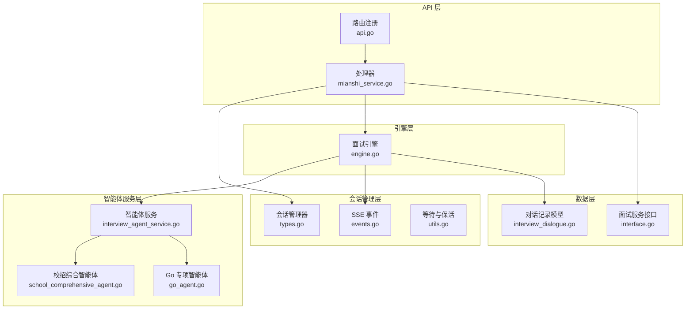
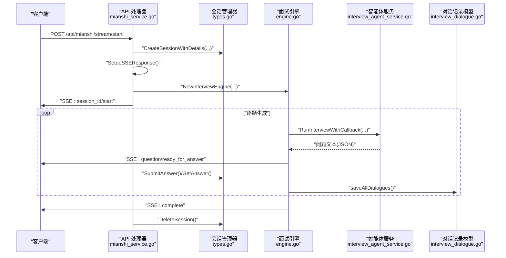
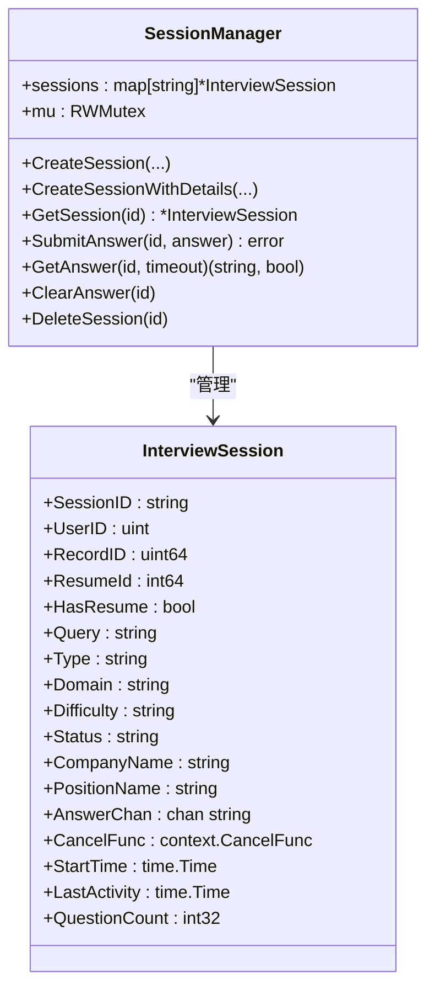
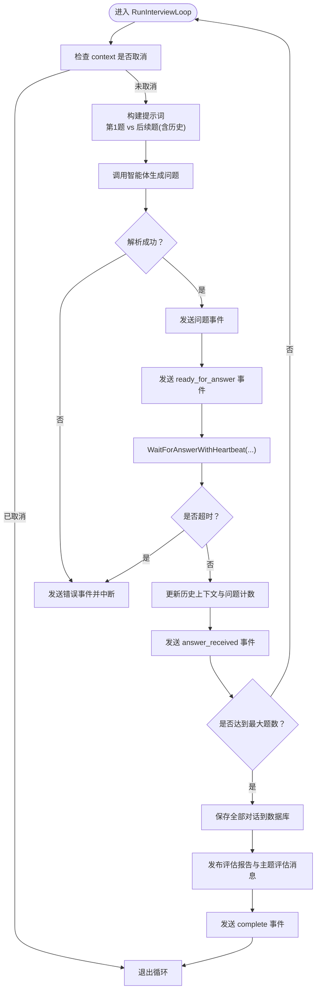
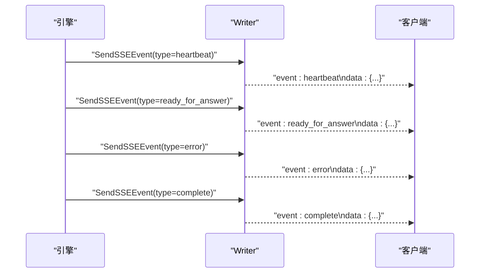
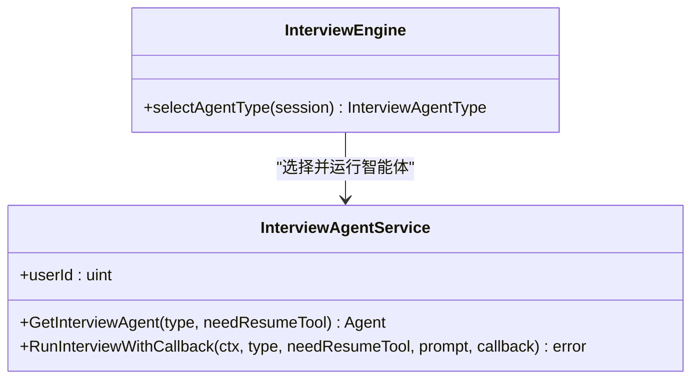
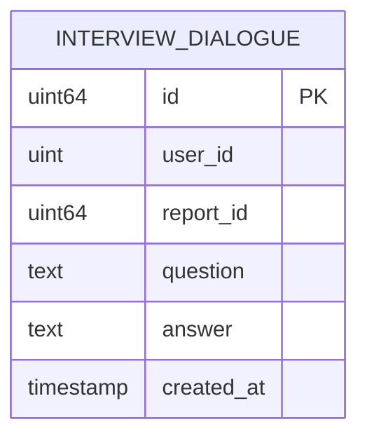
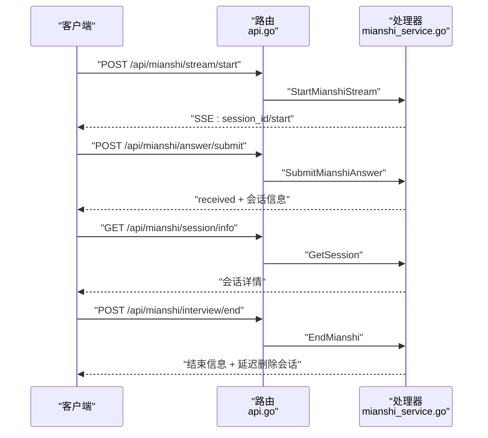
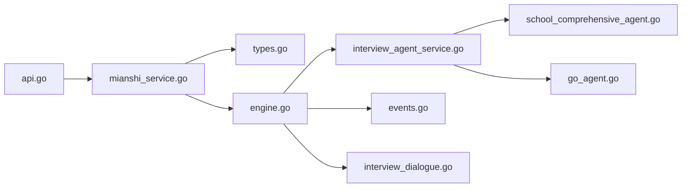

# 会话管理系统

<cite>
**本文档引用的文件**
- [mianshi_service.go](file://backend/api/handler/interview/mianshi_service.go)
- [engine.go](file://backend/api/handler/interview/mianshi/engine.go)
- [types.go](file://backend/api/handler/interview/mianshi/types.go)
- [events.go](file://backend/api/handler/interview/mianshi/events.go)
- [utils.go](file://backend/api/handler/interview/mianshi/utils.go)
- [interview_agent_service.go](file://backend/chatApp/agent_service/interview/interview_agent_service.go)
- [interview_dialogue.go](file://backend/internal/model/interview_dialogue.go)
- [interface.go](file://backend/internal/service/interviews/interface.go)
- [api.go](file://backend/api/router/interview/api.go)
- [school_comprehensive_agent.go](file://backend/chatApp/agent/interview/comprehensive/school_comprehensive_agent.go)
- [go_agent.go](file://backend/chatApp/agent/interview/specialized/go_agent.go)
</cite>

## 目录
1. [简介](#简介)
2. [项目结构](#项目结构)
3. [核心组件](#核心组件)
4. [架构总览](#架构总览)
5. [详细组件分析](#详细组件分析)
6. [依赖关系分析](#依赖关系分析)
7. [性能考虑](#性能考虑)
8. [故障排除指南](#故障排除指南)
9. [结论](#结论)

## 简介
本文件系统性梳理会话管理子系统，覆盖会话创建、维护与销毁机制；会话状态管理（状态转换、超时处理、异常恢复）；会话数据结构设计（用户信息、面试配置、问题序列与答案记录）；并发控制与线程安全；持久化策略与资源清理；以及监控指标与调试方法。目标是帮助开发者快速理解并扩展该系统。

## 项目结构
会话管理相关代码主要分布在以下模块：
- API 层：负责路由注册、请求绑定与响应封装，启动/提交/查询/结束会话等入口
- 会话管理层：全局会话管理器、会话对象、SSE 事件发送与等待答案的保活机制
- 引擎层：面试引擎，驱动问题生成、等待回答、历史上下文维护、持久化与评估发布
- 智能体服务层：根据面试类型选择不同智能体，统一运行接口
- 数据模型与服务层：面试对话记录的持久化接口与面试记录服务接口

图表来源
- [api.go](file://backend/api/router/interview/api.go#L17-L103)
- [mianshi_service.go](file://backend/api/handler/interview/mianshi_service.go#L27-L117)
- [types.go](file://backend/api/handler/interview/mianshi/types.go#L9-L50)
- [engine.go](file://backend/api/handler/interview/mianshi/engine.go#L24-L37)
- [interview_agent_service.go](file://backend/chatApp/agent_service/interview/interview_agent_service.go#L31-L73)
- [interview_dialogue.go](file://backend/internal/model/interview_dialogue.go#L11-L27)
- [interface.go](file://backend/internal/service/interviews/interface.go#L21-L63)

章节来源
- [api.go](file://backend/api/router/interview/api.go#L17-L103)
- [mianshi_service.go](file://backend/api/handler/interview/mianshi_service.go#L27-L117)
- [types.go](file://backend/api/handler/interview/mianshi/types.go#L9-L50)

## 核心组件
- 全局会话管理器：提供会话创建、获取、提交答案、清空答案通道、删除会话等操作，并通过读写锁保证并发安全
- 会话对象：承载用户信息、面试配置、状态、时间戳、问题计数、答案通道等
- 面试引擎：驱动问题生成、等待回答、历史上下文维护、持久化与评估发布
- SSE 事件系统：统一事件格式、错误事件、完成事件、就绪事件与心跳保活
- 智能体服务：按面试类型选择对应智能体，统一运行接口
- 数据模型：面试对话记录的持久化接口

章节来源
- [types.go](file://backend/api/handler/interview/mianshi/types.go#L9-L165)
- [engine.go](file://backend/api/handler/interview/mianshi/engine.go#L24-L291)
- [events.go](file://backend/api/handler/interview/mianshi/events.go#L11-L72)
- [interview_agent_service.go](file://backend/chatApp/agent_service/interview/interview_agent_service.go#L31-L155)
- [interview_dialogue.go](file://backend/internal/model/interview_dialogue.go#L11-L46)

## 架构总览
会话管理采用“API 层 → 会话管理层 → 引擎层 → 智能体服务层 → 数据层”的分层架构。API 层负责接收请求并创建会话，会话管理层负责并发安全与生命周期管理，引擎层负责业务流程与持久化，智能体服务层负责与外部模型交互，数据层负责持久化。

图表来源
- [mianshi_service.go](file://backend/api/handler/interview/mianshi_service.go#L27-L117)
- [types.go](file://backend/api/handler/interview/mianshi/types.go#L58-L82)
- [engine.go](file://backend/api/handler/interview/mianshi/engine.go#L42-L230)
- [interview_agent_service.go](file://backend/chatApp/agent_service/interview/interview_agent_service.go#L85-L101)
- [interview_dialogue.go](file://backend/internal/model/interview_dialogue.go#L30-L35)

## 详细组件分析

### 会话管理器与会话对象
- 并发控制：使用读写锁保护会话映射，读多写少场景下提升并发性能
- 生命周期：创建、获取、提交答案、清空答案通道、删除会话
- 状态字段：状态、开始时间、最后活动时间、问题计数等
- 答案通道：带缓冲的通道，避免阻塞；支持清空与超时等待

图表来源
- [types.go](file://backend/api/handler/interview/mianshi/types.go#L9-L165)

章节来源
- [types.go](file://backend/api/handler/interview/mianshi/types.go#L9-L165)

### 面试引擎与问题生成
- 问题生成：根据是否为第一题构建不同提示词；后续问题包含最近 N 道题的历史上下文
- 等待回答：基于通道与定时器实现超时控制，同时周期性发送心跳保活
- 历史上下文：维护固定长度的历史窗口，避免上下文过长导致性能下降
- 持久化：将所有问题与答案写入数据库，支持批量写入与进度事件
- 评估发布：面试完成后发布评估报告与主题评估消息

图表来源
- [engine.go](file://backend/api/handler/interview/mianshi/engine.go#L42-L230)
- [utils.go](file://backend/api/handler/interview/mianshi/utils.go#L11-L56)
- [events.go](file://backend/api/handler/interview/mianshi/events.go#L11-L72)

章节来源
- [engine.go](file://backend/api/handler/interview/mianshi/engine.go#L42-L230)
- [utils.go](file://backend/api/handler/interview/mianshi/utils.go#L11-L56)
- [events.go](file://backend/api/handler/interview/mianshi/events.go#L11-L72)

### SSE 事件与保活机制
- 事件格式：标准 SSE 格式，支持多种事件类型（message、error、complete、ready_for_answer、heartbeat）
- 保活策略：定时发送心跳事件，防止连接空闲断开
- 响应头：设置必要的 HTTP 头以启用流式传输与跨域访问

图表来源
- [events.go](file://backend/api/handler/interview/mianshi/events.go#L11-L72)
- [utils.go](file://backend/api/handler/interview/mianshi/utils.go#L65-L74)

章节来源
- [events.go](file://backend/api/handler/interview/mianshi/events.go#L11-L72)
- [utils.go](file://backend/api/handler/interview/mianshi/utils.go#L65-L74)

### 智能体服务与类型选择
- 类型枚举：综合面试（校招/社招）、专项面试（Go、Java、MQ、MySQL、Redis）
- 智能体选择：根据会话类型与领域动态选择对应智能体
- 统一运行：提供回调接口，支持增量输出与最终结果

图表来源
- [interview_agent_service.go](file://backend/chatApp/agent_service/interview/interview_agent_service.go#L31-L101)
- [engine.go](file://backend/api/handler/interview/mianshi/engine.go#L261-L290)

章节来源
- [interview_agent_service.go](file://backend/chatApp/agent_service/interview/interview_agent_service.go#L31-L101)
- [engine.go](file://backend/api/handler/interview/mianshi/engine.go#L261-L290)

### 数据模型与持久化
- 模型定义：包含用户ID、报告ID、问题、答案、创建时间等字段
- DAO 方法：创建对话记录、按用户与报告ID查询对话列表
- 引擎持久化：遍历所有对话，逐条写入数据库，支持进度日志

图表来源
- [interview_dialogue.go](file://backend/internal/model/interview_dialogue.go#L11-L27)

章节来源
- [interview_dialogue.go](file://backend/internal/model/interview_dialogue.go#L11-L46)
- [engine.go](file://backend/api/handler/interview/mianshi/engine.go#L234-L258)

### API 路由与处理器
- 路由注册：统一在路由文件中注册会话相关接口
- 处理器职责：启动面试（SSE）、提交答案、获取会话信息、结束面试、获取评估与答题记录

图表来源
- [api.go](file://backend/api/router/interview/api.go#L17-L103)
- [mianshi_service.go](file://backend/api/handler/interview/mianshi_service.go#L27-L300)

章节来源
- [api.go](file://backend/api/router/interview/api.go#L17-L103)
- [mianshi_service.go](file://backend/api/handler/interview/mianshi_service.go#L27-L300)

## 依赖关系分析
- API 层依赖会话管理器与面试引擎；会话管理器内部依赖会话对象
- 引擎层依赖智能体服务与事件发送；智能体服务根据类型选择具体智能体
- 数据层通过 DAO 方法与引擎层交互，实现持久化
- 路由层集中注册所有会话相关接口

图表来源
- [mianshi_service.go](file://backend/api/handler/interview/mianshi_service.go#L27-L117)
- [types.go](file://backend/api/handler/interview/mianshi/types.go#L58-L82)
- [engine.go](file://backend/api/handler/interview/mianshi/engine.go#L42-L230)
- [interview_agent_service.go](file://backend/chatApp/agent_service/interview/interview_agent_service.go#L85-L101)
- [interview_dialogue.go](file://backend/internal/model/interview_dialogue.go#L30-L35)
- [api.go](file://backend/api/router/interview/api.go#L17-L103)
- [school_comprehensive_agent.go](file://backend/chatApp/agent/interview/comprehensive/school_comprehensive_agent.go#L16-L47)
- [go_agent.go](file://backend/chatApp/agent/interview/specialized/go_agent.go#L16-L47)

章节来源
- [mianshi_service.go](file://backend/api/handler/interview/mianshi_service.go#L27-L117)
- [engine.go](file://backend/api/handler/interview/mianshi/engine.go#L42-L230)
- [interview_agent_service.go](file://backend/chatApp/agent_service/interview/interview_agent_service.go#L85-L101)
- [interview_dialogue.go](file://backend/internal/model/interview_dialogue.go#L30-L35)
- [api.go](file://backend/api/router/interview/api.go#L17-L103)

## 性能考虑
- 并发安全：使用读写锁降低锁竞争，读多写少场景更高效
- 缓冲通道：答案通道带缓冲，减少阻塞风险
- 历史上下文：限制历史长度，平衡上下文质量与性能
- 批量持久化：按需打印进度日志，避免频繁 IO
- SSE 写入：及时 flush，确保实时性
- 超时与保活：合理设置超时与心跳间隔，避免资源占用

## 故障排除指南
- 会话不存在：提交答案或获取会话时若会话不存在，返回相应错误
- 超时处理：等待答案超时会发送错误事件并中断流程
- 心跳保活：持续发送心跳事件，保持连接活跃
- 引擎错误：智能体运行失败或解析结果为空时，发送错误事件
- 结束流程：结束面试时更新状态与时间，延迟删除会话，避免竞态

章节来源
- [types.go](file://backend/api/handler/interview/mianshi/types.go#L92-L107)
- [utils.go](file://backend/api/handler/interview/mianshi/utils.go#L11-L56)
- [events.go](file://backend/api/handler/interview/mianshi/events.go#L36-L50)
- [engine.go](file://backend/api/handler/interview/mianshi/engine.go#L128-L146)
- [mianshi_service.go](file://backend/api/handler/interview/mianshi_service.go#L234-L299)

## 结论
该会话管理系统通过清晰的分层设计与完善的并发控制，实现了从会话创建、问题生成、答案等待、历史维护到持久化的完整闭环。SSE 事件机制提供了良好的实时交互体验，智能体服务抽象使得不同类型面试的扩展变得简单。建议在生产环境中结合监控指标（如会话数量、平均回答时延、持久化耗时）进一步优化性能与稳定性。