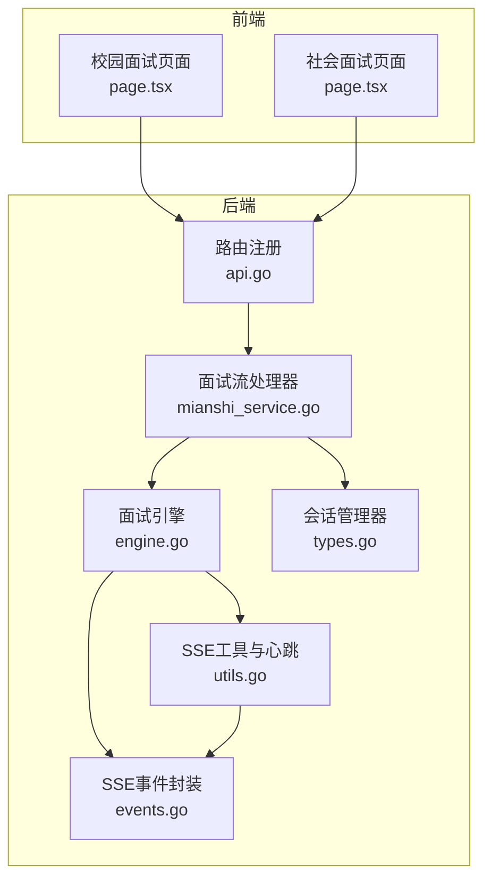
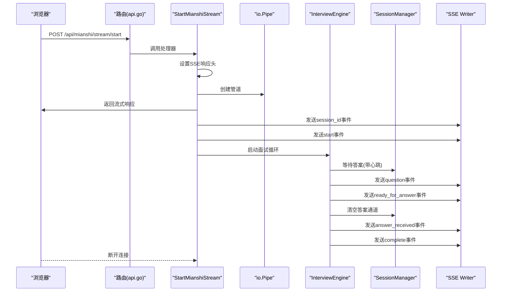
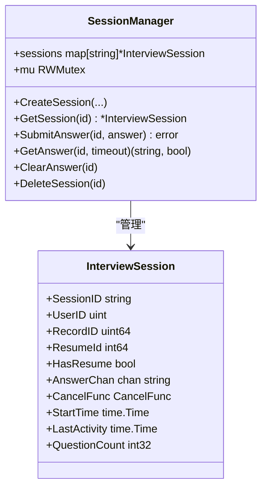
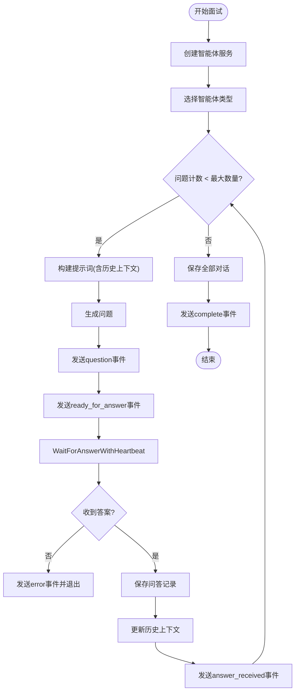
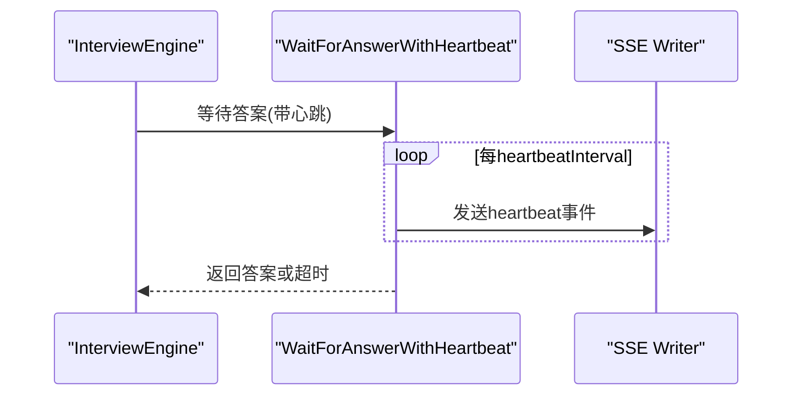
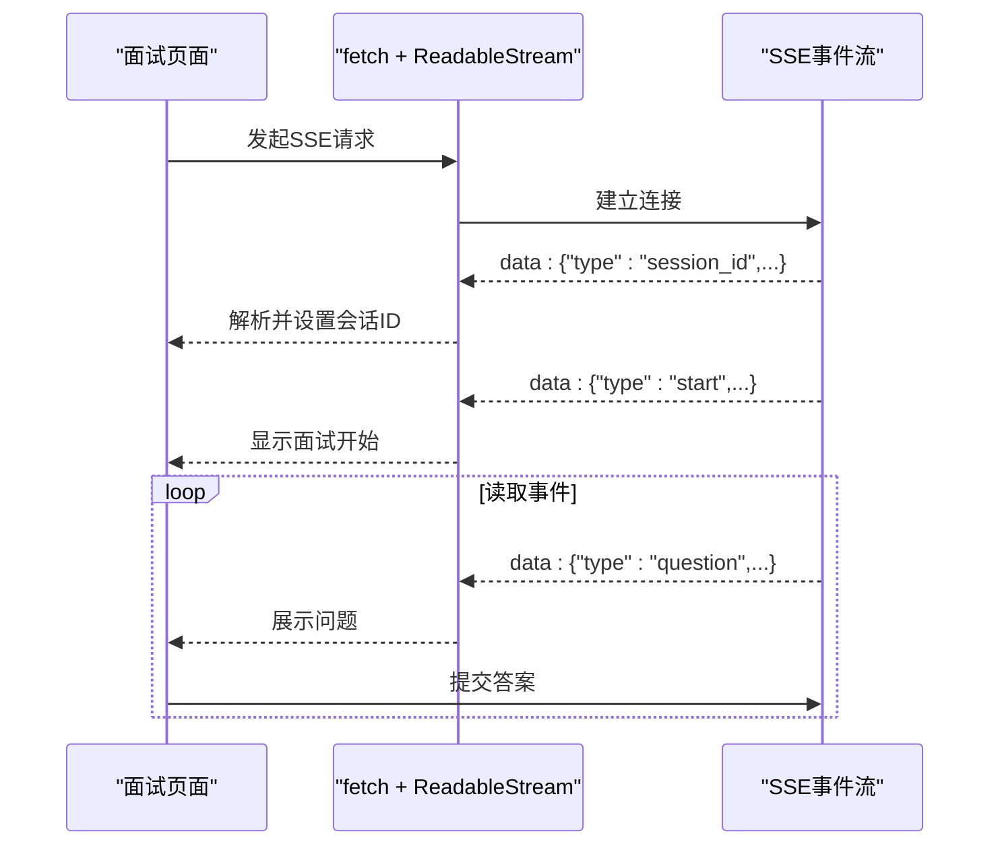
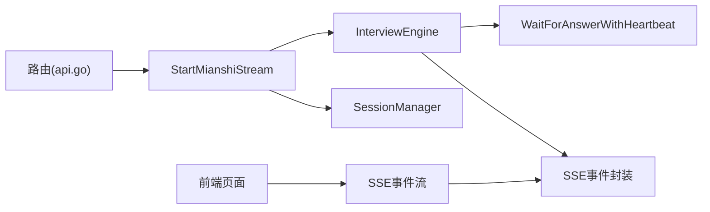

# 实时SSE流处理

<cite>
**本文档引用的文件**
- [backend/api/handler/interview/mianshi/engine.go](file://backend/api/handler/interview/mianshi/engine.go)
- [backend/api/handler/interview/mianshi/events.go](file://backend/api/handler/interview/mianshi/events.go)
- [backend/api/handler/interview/mianshi/types.go](file://backend/api/handler/interview/mianshi/types.go)
- [backend/api/handler/interview/mianshi/utils.go](file://backend/api/handler/interview/mianshi/utils.go)
- [backend/api/handler/interview/mianshi_service.go](file://backend/api/handler/interview/mianshi_service.go)
- [backend/api/router/interview/api.go](file://backend/api/router/interview/api.go)
- [mcpserver/internal/protocol/sse.go](file://mcpserver/internal/protocol/sse.go)
- [mcpserver/internal/server/sse.go](file://mcpserver/internal/server/sse.go)
- [frontend/src/app/interview/campus/start/page.tsx](file://frontend/src/app/interview/campus/start/page.tsx)
- [frontend/src/app/interview/social/start/page.tsx](file://frontend/src/app/interview/social/start/page.tsx)
- [frontend/TROUBLESHOOTING.md](file://frontend/TROUBLESHOOTING.md)
</cite>

## 目录
1. [简介](#简介)
2. [项目结构](#项目结构)
3. [核心组件](#核心组件)
4. [架构总览](#架构总览)
5. [详细组件分析](#详细组件分析)
6. [依赖关系分析](#依赖关系分析)
7. [性能考虑](#性能考虑)
8. [故障排除指南](#故障排除指南)
9. [结论](#结论)
10. [附录](#附录)

## 简介
本文件系统性地解析实时SSE（Server-Sent Events）流处理在面试系统中的实现与架构设计。重点覆盖：
- SSE连接建立与维护
- 事件类型与数据模型
- 流式数据传输与背压处理
- 客户端连接管理与重连机制
- 错误恢复与调试监控

## 项目结构
该系统采用前后端分离架构，面试SSE流由后端Hertz框架提供，前端使用浏览器原生SSE或fetch+ReadableStream消费事件流。

图表来源
- [backend/api/router/interview/api.go](file://backend/api/router/interview/api.go#L44-L46)
- [backend/api/handler/interview/mianshi_service.go](file://backend/api/handler/interview/mianshi_service.go#L26-L117)
- [backend/api/handler/interview/mianshi/engine.go](file://backend/api/handler/interview/mianshi/engine.go#L39-L230)
- [backend/api/handler/interview/mianshi/types.go](file://backend/api/handler/interview/mianshi/types.go#L9-L50)
- [backend/api/handler/interview/mianshi/utils.go](file://backend/api/handler/interview/mianshi/utils.go#L11-L56)
- [backend/api/handler/interview/mianshi/events.go](file://backend/api/handler/interview/mianshi/events.go#L11-L71)

章节来源
- [backend/api/router/interview/api.go](file://backend/api/router/interview/api.go#L44-L46)
- [backend/api/handler/interview/mianshi_service.go](file://backend/api/handler/interview/mianshi_service.go#L26-L117)

## 核心组件
- SSE连接建立与响应头设置：在启动面试流时，后端设置SSE专用响应头并建立流式输出。
- 会话管理器：负责会话生命周期、并发安全、答案通道与活动时间维护。
- 面试引擎：驱动面试循环，按序生成问题、等待答案、发送进度与完成事件。
- SSE事件封装：统一SSE事件格式，支持错误、完成、就绪、心跳等事件类型。
- 心跳与超时：在等待答案阶段定时发送心跳事件，避免连接空闲断开。

章节来源
- [backend/api/handler/interview/mianshi_service.go](file://backend/api/handler/interview/mianshi_service.go#L77-L117)
- [backend/api/handler/interview/mianshi/types.go](file://backend/api/handler/interview/mianshi/types.go#L9-L50)
- [backend/api/handler/interview/mianshi/engine.go](file://backend/api/handler/interview/mianshi/engine.go#L39-L230)
- [backend/api/handler/interview/mianshi/events.go](file://backend/api/handler/interview/mianshi/events.go#L11-L71)
- [backend/api/handler/interview/mianshi/utils.go](file://backend/api/handler/interview/mianshi/utils.go#L11-L56)

## 架构总览
SSE流式架构分为三层：
- 路由层：注册面试流启动与答案提交接口。
- 处理层：建立SSE连接、写入初始事件、启动面试引擎。
- 引擎层：生成问题、等待答案、发送事件、持久化记录。

图表来源
- [backend/api/router/interview/api.go](file://backend/api/router/interview/api.go#L44-L46)
- [backend/api/handler/interview/mianshi_service.go](file://backend/api/handler/interview/mianshi_service.go#L26-L117)
- [backend/api/handler/interview/mianshi/engine.go](file://backend/api/handler/interview/mianshi/engine.go#L39-L230)
- [backend/api/handler/interview/mianshi/events.go](file://backend/api/handler/interview/mianshi/events.go#L11-L71)

## 详细组件分析

### 会话管理器（SessionManager）
- 负责会话的创建、查询、答案提交与清理。
- 使用读写锁保证并发安全。
- 维护每个会话的活动时间、问题计数与取消函数。

图表来源
- [backend/api/handler/interview/mianshi/types.go](file://backend/api/handler/interview/mianshi/types.go#L9-L50)
- [backend/api/handler/interview/mianshi/types.go](file://backend/api/handler/interview/mianshi/types.go#L52-L149)

章节来源
- [backend/api/handler/interview/mianshi/types.go](file://backend/api/handler/interview/mianshi/types.go#L9-L149)

### 面试引擎（InterviewEngine）
- 驱动面试循环，按序生成问题并等待答案。
- 维护历史上下文（最近N题），动态调整后续问题。
- 发送多种SSE事件：问题、就绪、进度、完成、错误。

图表来源
- [backend/api/handler/interview/mianshi/engine.go](file://backend/api/handler/interview/mianshi/engine.go#L39-L230)
- [backend/api/handler/interview/mianshi/utils.go](file://backend/api/handler/interview/mianshi/utils.go#L11-L56)
- [backend/api/handler/interview/mianshi/events.go](file://backend/api/handler/interview/mianshi/events.go#L11-L71)

章节来源
- [backend/api/handler/interview/mianshi/engine.go](file://backend/api/handler/interview/mianshi/engine.go#L39-L230)
- [backend/api/handler/interview/mianshi/utils.go](file://backend/api/handler/interview/mianshi/utils.go#L11-L56)

### SSE事件封装与心跳
- 统一SSE事件格式：event字段对应type，data为JSON。
- 提供错误、完成、就绪、心跳等事件发送函数。
- 心跳机制：在等待答案期间周期性发送心跳事件，防止连接空闲断开。

图表来源
- [backend/api/handler/interview/mianshi/events.go](file://backend/api/handler/interview/mianshi/events.go#L11-L71)
- [backend/api/handler/interview/mianshi/utils.go](file://backend/api/handler/interview/mianshi/utils.go#L11-L56)

章节来源
- [backend/api/handler/interview/mianshi/events.go](file://backend/api/handler/interview/mianshi/events.go#L11-L71)
- [backend/api/handler/interview/mianshi/utils.go](file://backend/api/handler/interview/mianshi/utils.go#L11-L56)

### 前端SSE消费与重连
- 前端使用fetch+ReadableStream读取SSE流，解析data块为JSON事件。
- 识别session_id与start事件以初始化会话。
- 页面中包含自动重试与错误日志输出，便于调试。

图表来源
- [frontend/src/app/interview/campus/start/page.tsx](file://frontend/src/app/interview/campus/start/page.tsx#L137-L177)
- [frontend/src/app/interview/social/start/page.tsx](file://frontend/src/app/interview/social/start/page.tsx#L185-L214)
- [frontend/TROUBLESHOOTING.md](file://frontend/TROUBLESHOOTING.md#L105-L117)

章节来源
- [frontend/src/app/interview/campus/start/page.tsx](file://frontend/src/app/interview/campus/start/page.tsx#L137-L177)
- [frontend/src/app/interview/social/start/page.tsx](file://frontend/src/app/interview/social/start/page.tsx#L185-L214)
- [frontend/TROUBLESHOOTING.md](file://frontend/TROUBLESHOOTING.md#L75-L117)

## 依赖关系分析
- 路由层依赖处理器层，处理器层依赖会话管理器与面试引擎。
- 面试引擎依赖事件封装与心跳工具。
- 前端依赖后端SSE事件格式约定。

图表来源
- [backend/api/router/interview/api.go](file://backend/api/router/interview/api.go#L44-L46)
- [backend/api/handler/interview/mianshi_service.go](file://backend/api/handler/interview/mianshi_service.go#L26-L117)
- [backend/api/handler/interview/mianshi/engine.go](file://backend/api/handler/interview/mianshi/engine.go#L39-L230)
- [backend/api/handler/interview/mianshi/events.go](file://backend/api/handler/interview/mianshi/events.go#L11-L71)
- [backend/api/handler/interview/mianshi/utils.go](file://backend/api/handler/interview/mianshi/utils.go#L11-L56)

章节来源
- [backend/api/router/interview/api.go](file://backend/api/router/interview/api.go#L44-L46)
- [backend/api/handler/interview/mianshi_service.go](file://backend/api/handler/interview/mianshi_service.go#L26-L117)

## 性能考虑
- 缓冲区与背压
  - 使用io.Pipe建立无缓冲管道，避免额外内存拷贝。
  - SSE事件发送后立即Flush，确保客户端及时接收。
  - 会话答案通道容量为1，避免堆积过多答案导致内存膨胀。
- 心跳保活
  - 定时发送心跳事件，维持连接活跃，减少空闲断开。
- 超时控制
  - 等待答案阶段设置超时，超时后发送错误事件并终止流程。
- 并发与锁
  - 会话管理器使用读写锁，降低高并发下的竞争开销。
- 数据持久化
  - 逐条保存问答记录，避免一次性写入大量数据造成阻塞。

章节来源
- [backend/api/handler/interview/mianshi_service.go](file://backend/api/handler/interview/mianshi_service.go#L80-L117)
- [backend/api/handler/interview/mianshi/events.go](file://backend/api/handler/interview/mianshi/events.go#L29-L33)
- [backend/api/handler/interview/mianshi/types.go](file://backend/api/handler/interview/mianshi/types.go#L76-L107)
- [backend/api/handler/interview/mianshi/utils.go](file://backend/api/handler/interview/mianshi/utils.go#L15-L19)

## 故障排除指南
- 常见问题
  - 404错误：检查路由是否正确注册，确认URL路径与权限。
  - CORS错误：确认后端已设置允许跨域响应头。
  - 登录过期：重新登录获取新token。
  - 无法连接后端：确认后端服务运行地址与端口。
- 前端调试
  - 使用浏览器控制台查看SSE事件日志，定位会话ID与事件类型。
  - 检查事件格式是否符合data: JSON的SSE标准。
- 后端调试
  - 关注日志输出，特别是会话ID、超时与错误事件。
  - 检查Flush调用是否成功，避免事件丢失。

章节来源
- [frontend/TROUBLESHOOTING.md](file://frontend/TROUBLESHOOTING.md#L75-L117)
- [backend/api/handler/interview/mianshi/events.go](file://backend/api/handler/interview/mianshi/events.go#L25-L27)

## 结论
该SSE流处理实现通过清晰的分层架构与严格的事件模型，实现了面试过程的实时流式交互。会话管理器与面试引擎配合SSE事件封装，提供了稳定的心跳保活与超时控制。前端通过SSE或fetch+ReadableStream消费事件，具备良好的可调试性与扩展性。建议在生产环境中结合监控指标（如事件延迟、连接断开率、超时比例）持续优化性能与稳定性。

## 附录

### 事件类型定义
- 会话ID事件：标识会话建立，包含会话ID、记录ID与开始时间。
- 开始事件：通知前端面试已开始。
- 问题事件：包含问题索引、总数与问题文本。
- 就绪事件：提示前端可提交答案。
- 进度事件：包含问题索引、总数与百分比进度。
- 完成事件：面试结束通知。
- 错误事件：异常或超时错误描述。
- 心跳事件：保持连接活跃。

章节来源
- [backend/api/handler/interview/mianshi/events.go](file://backend/api/handler/interview/mianshi/events.go#L11-L71)
- [backend/api/handler/interview/mianshi/engine.go](file://backend/api/handler/interview/mianshi/engine.go#L148-L200)