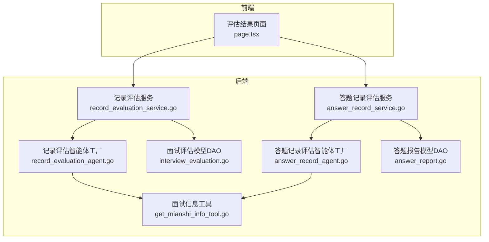
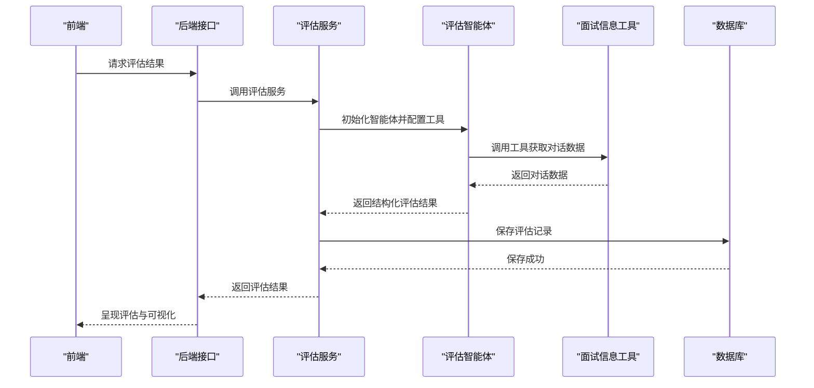
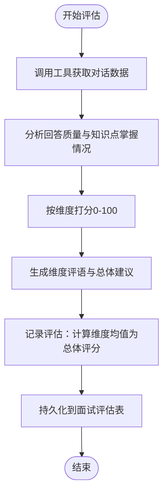
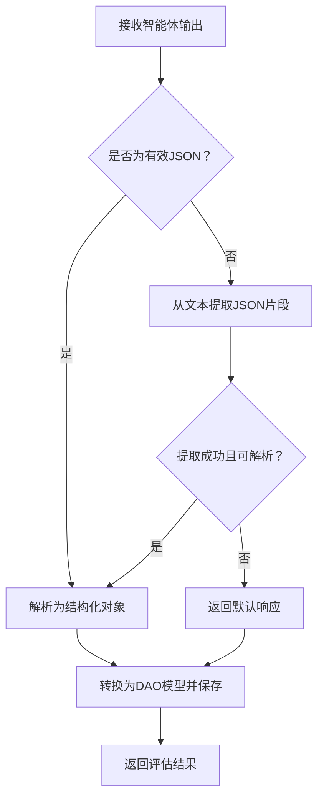
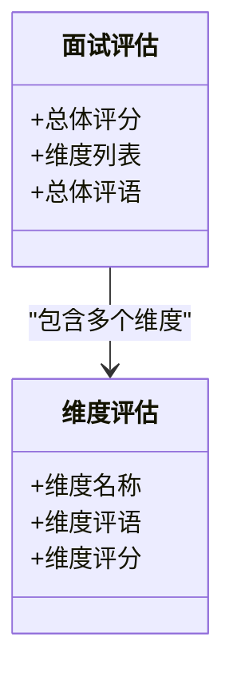
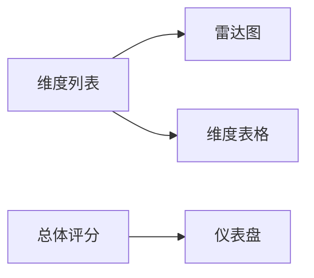
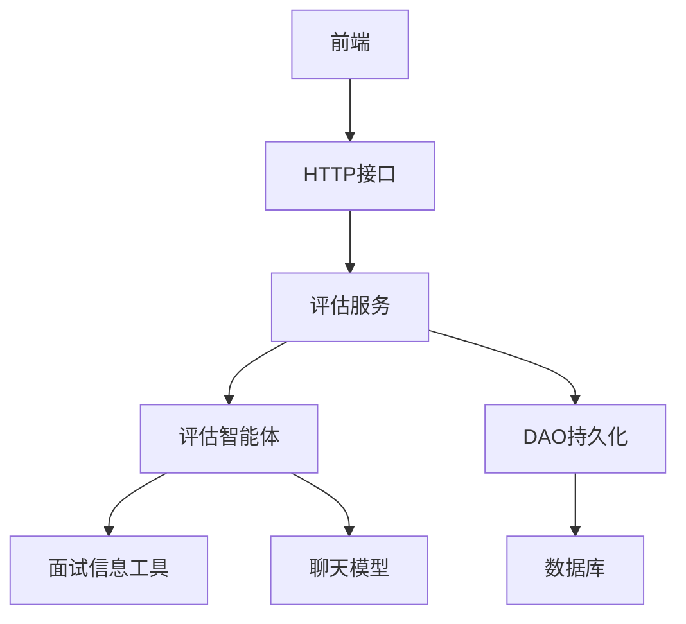

# 答案评估与反馈

<cite>
**本文引用的文件**
- [answer_record_service.go](file://backend/chatApp/agent_service/evaluation/answer_record_service.go)
- [record_evaluation_service.go](file://backend/chatApp/agent_service/evaluation/record_evaluation_service.go)
- [interview_evaluation.go](file://backend/internal/model/interview_evaluation.go)
- [answer_report.go](file://backend/internal/model/answer_report.go)
- [answer_record_agent.go](file://backend/chatApp/agent/record_evaluation/answer_record_agent.go)
- [record_evaluation_agent.go](file://backend/chatApp/agent/record_evaluation/record_evaluation_agent.go)
- [constant.go](file://backend/chatApp/agent/record_evaluation/constant.go)
- [get_mianshi_info_tool.go](file://backend/chatApp/tool/get_mianshi_info_tool.go)
- [mianshi_service.go](file://backend/api/handler/interview/mianshi_service.go)
- [json_utils.go](file://backend/chatApp/agent_service/evaluation/json_utils.go)
- [page.tsx](file://frontend/src/app/user/interviews/results/[id]/page.tsx)
</cite>

## 目录
1. [简介](#简介)
2. [项目结构](#项目结构)
3. [核心组件](#核心组件)
4. [架构总览](#架构总览)
5. [详细组件分析](#详细组件分析)
6. [依赖关系分析](#依赖关系分析)
7. [性能考量](#性能考量)
8. [故障排查指南](#故障排查指南)
9. [结论](#结论)
10. [附录](#附录)

## 简介
本文件系统化梳理“答案评估与反馈”模块的设计与实现，覆盖评估算法设计、评估标准制定、评估维度定义、评分与等级生成、评估报告结构与内容组织、一致性保障与人工复核机制，以及评估结果的可视化展示与可扩展性。目标是帮助开发者与产品人员快速理解并高效迭代评估体系。

## 项目结构
评估模块围绕“服务层 → 智能体 → 工具 → 数据模型”的链路展开，前端通过接口获取评估结果并以雷达图、仪表盘等形式呈现。

图表来源
- [record_evaluation_service.go](file://backend/chatApp/agent_service/evaluation/record_evaluation_service.go#L17-L108)
- [answer_record_service.go](file://backend/chatApp/agent_service/evaluation/answer_record_service.go#L16-L100)
- [record_evaluation_agent.go](file://backend/chatApp/agent/record_evaluation/record_evaluation_agent.go#L14-L38)
- [answer_record_agent.go](file://backend/chatApp/agent/record_evaluation/answer_record_agent.go#L14-L40)
- [get_mianshi_info_tool.go](file://backend/chatApp/tool/get_mianshi_info_tool.go#L24-L36)
- [interview_evaluation.go](file://backend/internal/model/interview_evaluation.go#L37-L43)
- [answer_report.go](file://backend/internal/model/answer_report.go#L56-L62)
- [page.tsx](file://frontend/src/app/user/interviews/results/[id]/page.tsx#L437-L466)

章节来源
- [record_evaluation_service.go](file://backend/chatApp/agent_service/evaluation/record_evaluation_service.go#L17-L108)
- [answer_record_service.go](file://backend/chatApp/agent_service/evaluation/answer_record_service.go#L16-L100)
- [record_evaluation_agent.go](file://backend/chatApp/agent/record_evaluation/record_evaluation_agent.go#L14-L38)
- [answer_record_agent.go](file://backend/chatApp/agent/record_evaluation/answer_record_agent.go#L14-L40)
- [get_mianshi_info_tool.go](file://backend/chatApp/tool/get_mianshi_info_tool.go#L24-L36)
- [interview_evaluation.go](file://backend/internal/model/interview_evaluation.go#L37-L43)
- [answer_report.go](file://backend/internal/model/answer_report.go#L56-L62)
- [page.tsx](file://frontend/src/app/user/interviews/results/[id]/page.tsx#L437-L466)

## 核心组件
- 评估服务层
  - 记录评估服务：面向“整体面试记录”的综合评估，生成维度评分与总体评语。
  - 答题记录评估服务：面向“每个问题-回答对”的细粒度评估，输出评分、关键知识点、优缺点、建议等。
- 智能体层
  - 记录评估智能体：依据系统指令与工具调用，生成维度化评估。
  - 答题记录评估智能体：针对对话列表逐条评估，输出结构化记录。
- 工具层
  - 面试信息工具：按用户ID与报告ID拉取完整对话数据，供智能体评估使用。
- 数据模型层
  - 面试评估模型：存储总体评分、维度列表与评语。
  - 答题报告模型：存储每个问题的评分、关键点、优缺点、建议、知识点、思考过程、参考答案与对话明细。
- 前端展示层
  - 评估结果页：展示维度评分、雷达图、仪表盘等可视化。

章节来源
- [record_evaluation_service.go](file://backend/chatApp/agent_service/evaluation/record_evaluation_service.go#L17-L108)
- [answer_record_service.go](file://backend/chatApp/agent_service/evaluation/answer_record_service.go#L16-L100)
- [record_evaluation_agent.go](file://backend/chatApp/agent/record_evaluation/record_evaluation_agent.go#L14-L38)
- [answer_record_agent.go](file://backend/chatApp/agent/record_evaluation/answer_record_agent.go#L14-L40)
- [get_mianshi_info_tool.go](file://backend/chatApp/tool/get_mianshi_info_tool.go#L24-L36)
- [interview_evaluation.go](file://backend/internal/model/interview_evaluation.go#L10-L35)
- [answer_report.go](file://backend/internal/model/answer_report.go#L9-L54)
- [page.tsx](file://frontend/src/app/user/interviews/results/[id]/page.tsx#L437-L466)

## 架构总览
评估流程分为两条主线：
- 综合评估（记录级）：服务层触发智能体，工具拉取对话数据，智能体按维度评分并汇总，持久化到面试评估表。
- 细粒度评估（答题记录级）：服务层触发智能体，工具拉取对话数据，智能体按问题输出结构化记录，持久化到答题报告表。
- 前端通过接口获取评估结果并渲染可视化。

图表来源
- [mianshi_service.go](file://backend/api/handler/interview/mianshi_service.go#L302-L340)
- [record_evaluation_service.go](file://backend/chatApp/agent_service/evaluation/record_evaluation_service.go#L17-L108)
- [answer_record_service.go](file://backend/chatApp/agent_service/evaluation/answer_record_service.go#L16-L100)
- [get_mianshi_info_tool.go](file://backend/chatApp/tool/get_mianshi_info_tool.go#L24-L36)
- [interview_evaluation.go](file://backend/internal/model/interview_evaluation.go#L37-L43)
- [answer_report.go](file://backend/internal/model/answer_report.go#L56-L62)

## 详细组件分析

### 评估维度与标准
- 维度数量与顺序：智能体指令要求维度数量在限定范围内，且顺序与面试数据一致。
- 维度命名：中文名称，长度在规定范围；用于前端展示与报表生成。
- 评分区间：0-100分整数；服务层在记录评估中计算维度均值作为总体评分。
- 评分等级：服务层可在此基础上映射等级（如优秀/良好/中等/及格/不及格），用于前端仪表盘颜色区分。

章节来源
- [constant.go](file://backend/chatApp/agent/record_evaluation/constant.go#L33-L56)
- [record_evaluation_service.go](file://backend/chatApp/agent_service/evaluation/record_evaluation_service.go#L155-L162)
- [page.tsx](file://frontend/src/app/user/interviews/results/[id]/page.tsx#L132-L160)

### 评估算法设计
- 记录评估（综合）：智能体基于对话数据对比回答质量，按维度打分并生成评语；服务层将各维度分数求平均得到总体评分。
- 答题记录评估（细粒度）：智能体对每个问题-回答对进行评估，输出评分、关键知识点、优缺点、建议、知识点总结、思考过程、参考答案与对话明细。

图表来源
- [constant.go](file://backend/chatApp/agent/record_evaluation/constant.go#L23-L56)
- [record_evaluation_service.go](file://backend/chatApp/agent_service/evaluation/record_evaluation_service.go#L155-L172)

章节来源
- [constant.go](file://backend/chatApp/agent/record_evaluation/constant.go#L23-L56)
- [record_evaluation_service.go](file://backend/chatApp/agent_service/evaluation/record_evaluation_service.go#L155-L172)

### 评估结果生成机制
- 结构化输出：智能体严格遵循指令的JSON格式，确保字段完备与可解析。
- 容错与回退：当智能体输出非标准JSON时，服务层尝试从文本中提取JSON片段并解析；若仍失败，则返回默认响应，避免中断流程。
- 持久化策略：记录评估写入面试评估表；答题记录评估写入答题报告表；均支持按用户ID与报告ID检索。

图表来源
- [answer_record_service.go](file://backend/chatApp/agent_service/evaluation/answer_record_service.go#L102-L144)
- [record_evaluation_service.go](file://backend/chatApp/agent_service/evaluation/record_evaluation_service.go#L110-L135)
- [json_utils.go](file://backend/chatApp/agent_service/evaluation/json_utils.go#L7-L33)

章节来源
- [answer_record_service.go](file://backend/chatApp/agent_service/evaluation/answer_record_service.go#L102-L144)
- [record_evaluation_service.go](file://backend/chatApp/agent_service/evaluation/record_evaluation_service.go#L110-L135)
- [json_utils.go](file://backend/chatApp/agent_service/evaluation/json_utils.go#L7-L33)

### 评估报告结构与内容组织
- 记录评估报告（综合）
  - 总体评语与建议
  - 维度列表：维度名称、维度评语、维度评分
  - 总体评分：维度均值
- 答题记录报告（细粒度）
  - 问题顺序与内容
  - 评分、关键知识点、难度等级
  - 优势、不足、改进建议
  - 知识点总结、思考过程分析、参考答案
  - 该问题下的全部对话明细（含追问）

图表来源
- [interview_evaluation.go](file://backend/internal/model/interview_evaluation.go#L10-L35)
- [record_evaluation_service.go](file://backend/chatApp/agent_service/evaluation/record_evaluation_service.go#L146-L153)

章节来源
- [interview_evaluation.go](file://backend/internal/model/interview_evaluation.go#L10-L35)
- [answer_report.go](file://backend/internal/model/answer_report.go#L9-L54)
- [constant.go](file://backend/chatApp/agent/record_evaluation/constant.go#L102-L168)

### 评估一致性与人工复核
- 一致性保障
  - 指令约束：智能体指令严格限制输出格式、字段与评分范围，减少歧义。
  - 工具数据：统一通过工具获取对话数据，避免外部噪声干扰。
  - 容错机制：服务层对非标准JSON进行提取与回退，提升鲁棒性。
- 人工复核机制
  - 当前实现未见显式的二次审核流程；可在服务层增加“复核标记”字段与“复核人”字段，在DAO层扩展复核状态，前端增加复核入口与状态展示。

章节来源
- [constant.go](file://backend/chatApp/agent/record_evaluation/constant.go#L31-L71)
- [answer_record_service.go](file://backend/chatApp/agent_service/evaluation/answer_record_service.go#L102-L144)
- [record_evaluation_service.go](file://backend/chatApp/agent_service/evaluation/record_evaluation_service.go#L110-L135)

### 评估结果可视化展示
- 维度评分与评语：按维度展示名称与分数，支持百分制显示。
- 能力模型雷达图：基于维度评分绘制雷达图，直观反映强项与弱项。
- 总体仪表盘：根据总体评分映射颜色（如优秀/良好/一般/较差），辅助快速判断。

图表来源
- [page.tsx](file://frontend/src/app/user/interviews/results/[id]/page.tsx#L437-L466)
- [page.tsx](file://frontend/src/app/user/interviews/results/[id]/page.tsx#L132-L160)

章节来源
- [page.tsx](file://frontend/src/app/user/interviews/results/[id]/page.tsx#L437-L466)
- [page.tsx](file://frontend/src/app/user/interviews/results/[id]/page.tsx#L132-L160)

### 可扩展性与自定义评估规则
- 维度扩展：在智能体指令中新增维度名称与评分标准，服务层保持维度均值聚合逻辑不变。
- 评分标准定制：通过调整指令中的评分区间与等级映射，即可适配不同岗位或场景。
- 输出格式扩展：若需扩展字段，可在智能体指令中声明新字段并在服务层解析与持久化。
- 工具扩展：若需引入新的数据源，可在工具层新增工具并在智能体中注册使用。

章节来源
- [constant.go](file://backend/chatApp/agent/record_evaluation/constant.go#L33-L56)
- [record_evaluation_service.go](file://backend/chatApp/agent_service/evaluation/record_evaluation_service.go#L155-L172)

## 依赖关系分析
- 服务层依赖智能体工厂与工具，智能体依赖模型与工具节点配置。
- 智能体通过工具获取对话数据，再将结构化结果写入数据库。
- 前端通过接口读取评估结果并渲染可视化。

图表来源
- [record_evaluation_service.go](file://backend/chatApp/agent_service/evaluation/record_evaluation_service.go#L17-L108)
- [answer_record_service.go](file://backend/chatApp/agent_service/evaluation/answer_record_service.go#L16-L100)
- [record_evaluation_agent.go](file://backend/chatApp/agent/record_evaluation/record_evaluation_agent.go#L14-L38)
- [answer_record_agent.go](file://backend/chatApp/agent/record_evaluation/answer_record_agent.go#L14-L40)
- [get_mianshi_info_tool.go](file://backend/chatApp/tool/get_mianshi_info_tool.go#L24-L36)
- [interview_evaluation.go](file://backend/internal/model/interview_evaluation.go#L37-L43)
- [answer_report.go](file://backend/internal/model/answer_report.go#L56-L62)
- [mianshi_service.go](file://backend/api/handler/interview/mianshi_service.go#L302-L340)

章节来源
- [record_evaluation_service.go](file://backend/chatApp/agent_service/evaluation/record_evaluation_service.go#L17-L108)
- [answer_record_service.go](file://backend/chatApp/agent_service/evaluation/answer_record_service.go#L16-L100)
- [record_evaluation_agent.go](file://backend/chatApp/agent/record_evaluation/record_evaluation_agent.go#L14-L38)
- [answer_record_agent.go](file://backend/chatApp/agent/record_evaluation/answer_record_agent.go#L14-L40)
- [get_mianshi_info_tool.go](file://backend/chatApp/tool/get_mianshi_info_tool.go#L24-L36)
- [interview_evaluation.go](file://backend/internal/model/interview_evaluation.go#L37-L43)
- [answer_report.go](file://backend/internal/model/answer_report.go#L56-L62)
- [mianshi_service.go](file://backend/api/handler/interview/mianshi_service.go#L302-L340)

## 性能考量
- 超时控制：记录评估与答题记录评估分别设置合理的超时阈值，避免长时间阻塞。
- 异步与流式：接口采用SSE与异步处理，结合前端轮询或事件监听，降低等待时间。
- 数据缓存：对于重复查询的评估结果，可在服务层增加缓存层，减少重复计算与数据库压力。
- 工具调用：工具层按需调用，避免不必要的数据拉取；对大体量对话建议分页或增量拉取。

章节来源
- [record_evaluation_service.go](file://backend/chatApp/agent_service/evaluation/record_evaluation_service.go#L20-L22)
- [answer_record_service.go](file://backend/chatApp/agent_service/evaluation/answer_record_service.go#L17-L19)
- [mianshi_service.go](file://backend/api/handler/interview/mianshi_service.go#L77-L116)

## 故障排查指南
- 智能体输出非标准JSON
  - 现象：服务层解析失败，返回默认响应。
  - 处理：检查智能体指令格式与字段约束；必要时在前端或日志中记录原始输出以便定位。
- 工具调用失败
  - 现象：无法获取对话数据。
  - 处理：检查工具函数与DAO层查询条件；确认用户ID与报告ID正确。
- 持久化失败
  - 现象：保存评估记录报错。
  - 处理：检查数据库连接与事务；查看DAO层异常日志。
- 前端渲染异常
  - 现象：雷达图或仪表盘不显示。
  - 处理：确认接口返回数据结构与前端期望一致；检查维度数量与字段名。

章节来源
- [answer_record_service.go](file://backend/chatApp/agent_service/evaluation/answer_record_service.go#L102-L144)
- [record_evaluation_service.go](file://backend/chatApp/agent_service/evaluation/record_evaluation_service.go#L110-L135)
- [get_mianshi_info_tool.go](file://backend/chatApp/tool/get_mianshi_info_tool.go#L24-L36)
- [interview_evaluation.go](file://backend/internal/model/interview_evaluation.go#L37-L43)
- [answer_report.go](file://backend/internal/model/answer_report.go#L56-L62)
- [page.tsx](file://frontend/src/app/user/interviews/results/[id]/page.tsx#L437-L466)

## 结论
本评估系统通过“智能体+工具+结构化输出+持久化+可视化”的闭环，实现了从细粒度答题记录到综合面试表现的多维评估。其指令约束与容错机制确保了结果的一致性与稳定性；前端雷达图与仪表盘提升了可读性与决策效率。未来可在人工复核、维度扩展与缓存优化方面进一步增强。

## 附录
- 关键接口
  - 获取综合评估：GET /api/mianshi/evaluation
  - 获取答题记录评估：GET /api/mianshi/answer-record
- 关键模型
  - 面试评估：包含总体评分、维度列表与评语
  - 答题报告：包含每个问题的评分、关键点、优缺点、建议、知识点、思考过程、参考答案与对话明细

章节来源
- [mianshi_service.go](file://backend/api/handler/interview/mianshi_service.go#L302-L340)
- [interview_evaluation.go](file://backend/internal/model/interview_evaluation.go#L10-L35)
- [answer_report.go](file://backend/internal/model/answer_report.go#L9-L54)