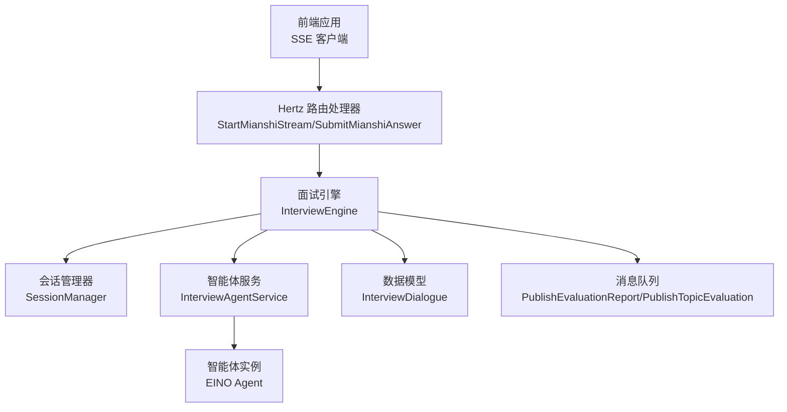
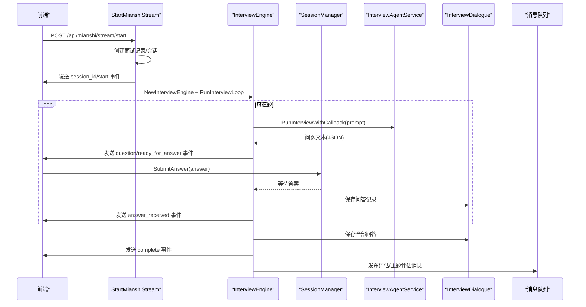
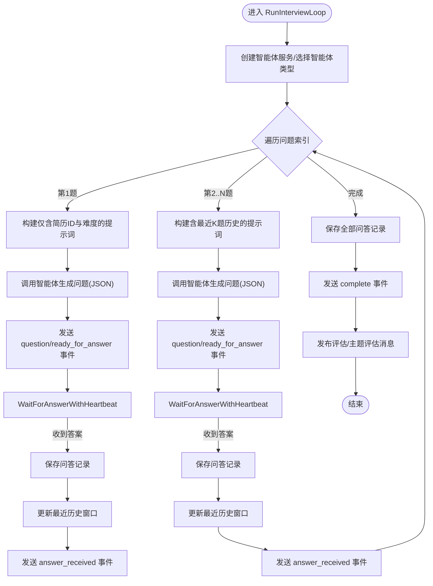
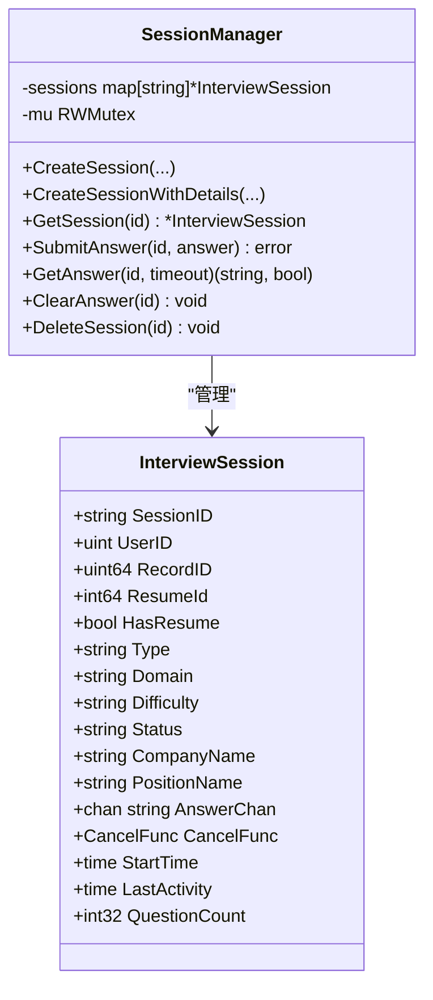
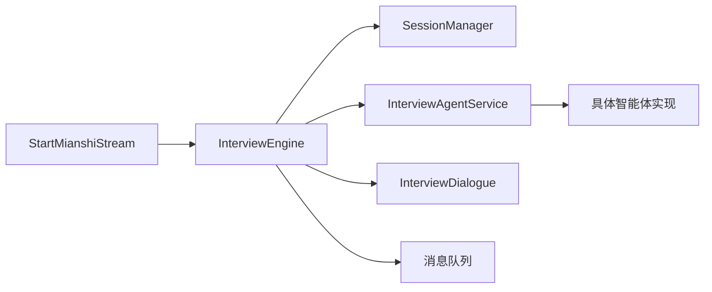

# 面试引擎设计与实现

<cite>
**本文档引用的文件**
- [backend/api/handler/interview/mianshi/engine.go](file://backend/api/handler/interview/mianshi/engine.go)
- [backend/api/handler/interview/mianshi/types.go](file://backend/api/handler/interview/mianshi/types.go)
- [backend/api/handler/interview/mianshi/events.go](file://backend/api/handler/interview/mianshi/events.go)
- [backend/api/handler/interview/mianshi/utils.go](file://backend/api/handler/interview/mianshi/utils.go)
- [backend/api/handler/interview/mianshi_service.go](file://backend/api/handler/interview/mianshi_service.go)
- [backend/chatApp/agent_service/interview/interview_agent_service.go](file://backend/chatApp/agent_service/interview/interview_agent_service.go)
- [backend/chatApp/agent/interview/specialized/go_agent.go](file://backend/chatApp/agent/interview/specialized/go_agent.go)
- [backend/internal/model/interview_dialogue.go](file://backend/internal/model/interview_dialogue.go)
- [backend/internal/mq/mq.go](file://backend/internal/mq/mq.go)
- [backend/chatApp/main.go](file://backend/chatApp/main.go)
</cite>

## 目录
1. [简介](#简介)
2. [项目结构](#项目结构)
3. [核心组件](#核心组件)
4. [架构总览](#架构总览)
5. [详细组件分析](#详细组件分析)
6. [依赖关系分析](#依赖关系分析)
7. [性能考虑](#性能考虑)
8. [故障排除指南](#故障排除指南)
9. [结论](#结论)
10. [附录](#附录)

## 简介
本文件系统性阐述“面试引擎”的设计与实现，覆盖引擎初始化、状态管理与生命周期控制；面试流程自动化执行机制（问题生成、答案收集、评估反馈闭环）；引擎与会话管理器的交互模式；与智能体系统的协作方式；配置参数、性能优化策略、错误处理机制；以及扩展点与自定义面试规则的实现方法。目标是帮助开发者快速理解并高效扩展该面试平台。

## 项目结构
面试引擎位于后端 API 层的面试模块中，采用“控制器-引擎-会话管理器-智能体服务-消息队列-数据模型”的分层组织方式。前端通过 SSE 与后端建立持久连接，后端以流式事件驱动面试过程。



图表来源
- [backend/api/handler/interview/mianshi_service.go](file://backend/api/handler/interview/mianshi_service.go#L25-L117)
- [backend/api/handler/interview/mianshi/engine.go](file://backend/api/handler/interview/mianshi/engine.go#L39-L230)
- [backend/api/handler/interview/mianshi/types.go](file://backend/api/handler/interview/mianshi/types.go#L9-L82)
- [backend/chatApp/agent_service/interview/interview_agent_service.go](file://backend/chatApp/agent_service/interview/interview_agent_service.go#L30-L101)
- [backend/internal/model/interview_dialogue.go](file://backend/internal/model/interview_dialogue.go#L9-L45)
- [backend/internal/mq/mq.go](file://backend/internal/mq/mq.go#L155-L208)

章节来源
- [backend/api/handler/interview/mianshi_service.go](file://backend/api/handler/interview/mianshi_service.go#L25-L117)
- [backend/api/handler/interview/mianshi/engine.go](file://backend/api/handler/interview/mianshi/engine.go#L39-L230)
- [backend/api/handler/interview/mianshi/types.go](file://backend/api/handler/interview/mianshi/types.go#L9-L82)

## 核心组件
- 面试引擎 InterviewEngine：负责面试循环、问题生成、答案收集、事件推送、持久化与后续评估消息发布。
- 会话管理器 SessionManager：维护会话生命周期、并发安全的会话字典、答案通道、超时与心跳保活。
- 智能体服务 InterviewAgentService：按面试类型动态选择并运行 EINO 智能体，支持简历工具注入。
- 数据模型 InterviewDialogue：持久化每轮问答记录。
- 消息队列 MQ：异步触发评估报告与主题评估任务。
- SSE 事件工具：统一的事件格式化与刷新策略。

章节来源
- [backend/api/handler/interview/mianshi/engine.go](file://backend/api/handler/interview/mianshi/engine.go#L23-L37)
- [backend/api/handler/interview/mianshi/types.go](file://backend/api/handler/interview/mianshi/types.go#L9-L82)
- [backend/chatApp/agent_service/interview/interview_agent_service.go](file://backend/chatApp/agent_service/interview/interview_agent_service.go#L30-L101)
- [backend/internal/model/interview_dialogue.go](file://backend/internal/model/interview_dialogue.go#L9-L45)
- [backend/internal/mq/mq.go](file://backend/internal/mq/mq.go#L155-L208)
- [backend/api/handler/interview/mianshi/events.go](file://backend/api/handler/interview/mianshi/events.go#L11-L71)

## 架构总览
面试引擎采用“请求-响应-流式事件”模式：
- 控制器接收启动请求，创建面试记录与会话，设置 SSE 响应头，启动异步面试循环。
- 引擎逐题生成问题，推送 ready_for_answer 事件，等待用户答案；超时或取消时及时中断。
- 收到答案后持久化，更新会话计数，继续下一轮，直至完成或异常。
- 完成后发布评估与主题评估消息，触发后台处理。



图表来源
- [backend/api/handler/interview/mianshi_service.go](file://backend/api/handler/interview/mianshi_service.go#L25-L117)
- [backend/api/handler/interview/mianshi/engine.go](file://backend/api/handler/interview/mianshi/engine.go#L39-L230)
- [backend/api/handler/interview/mianshi/utils.go](file://backend/api/handler/interview/mianshi/utils.go#L11-L56)
- [backend/internal/model/interview_dialogue.go](file://backend/internal/model/interview_dialogue.go#L29-L35)
- [backend/internal/mq/mq.go](file://backend/internal/mq/mq.go#L155-L208)

## 详细组件分析

### 面试引擎 InterviewEngine
职责与流程
- 初始化：接收会话管理器、面试服务与写入器（SSE）。
- 面试循环：限制最多 N 道题，逐题生成问题；第 1 题仅携带简历与难度，后续题携带最近 K 条历史上下文。
- 事件驱动：发送 question、ready_for_answer、answer_received、complete、error、heartbeat 等事件。
- 答案等待：基于会话通道与定时器，支持心跳保活与超时控制。
- 持久化：将所有问答记录写入数据库。
- 后续处理：发布评估与主题评估消息，触发后台任务。

关键参数
- 问题上限：maxQuestions
- 历史上下文大小：historyContextSize
- 答案等待超时：answerTimeout
- 心跳间隔：heartbeatInterval



图表来源
- [backend/api/handler/interview/mianshi/engine.go](file://backend/api/handler/interview/mianshi/engine.go#L39-L230)
- [backend/api/handler/interview/mianshi/utils.go](file://backend/api/handler/interview/mianshi/utils.go#L11-L56)
- [backend/internal/model/interview_dialogue.go](file://backend/internal/model/interview_dialogue.go#L29-L35)
- [backend/internal/mq/mq.go](file://backend/internal/mq/mq.go#L155-L208)

章节来源
- [backend/api/handler/interview/mianshi/engine.go](file://backend/api/handler/interview/mianshi/engine.go#L23-L37)
- [backend/api/handler/interview/mianshi/engine.go](file://backend/api/handler/interview/mianshi/engine.go#L39-L230)
- [backend/api/handler/interview/mianshi/engine.go](file://backend/api/handler/interview/mianshi/engine.go#L232-L258)
- [backend/api/handler/interview/mianshi/engine.go](file://backend/api/handler/interview/mianshi/engine.go#L260-L290)

### 会话管理器 SessionManager
职责与特性
- 单例全局管理：提供全局会话管理器实例，线程安全。
- 会话生命周期：创建、获取、提交答案、清空答案通道、删除会话。
- 并发安全：读写锁保护会话字典。
- 答案通道：每个会话维护带缓冲的通道，避免阻塞。
- 超时与保活：配合等待函数实现心跳与超时控制。



图表来源
- [backend/api/handler/interview/mianshi/types.go](file://backend/api/handler/interview/mianshi/types.go#L9-L82)

章节来源
- [backend/api/handler/interview/mianshi/types.go](file://backend/api/handler/interview/mianshi/types.go#L9-L82)

### 智能体服务 InterviewAgentService
职责与协作
- 智能体类型映射：根据面试类型与领域选择具体智能体（综合/专项）。
- 智能体运行：封装 EINO Runner，支持回调式增量输出。
- 工具注入：可按需注入简历检索工具，增强问题生成能力。

```mermaid
classDiagram
class InterviewAgentService {
-userId uint
+GetInterviewAgent(type, needResumeTool) (Agent, error)
+RunInterviewWithCallback(ctx, type, needResumeTool, prompt, callback) error
}
class InterviewAgentType {
<<enumeration>>
"comprehensive_school"
"comprehensive_social"
"specialized_go"
"specialized_java"
"specialized_mq"
"specialized_mysql"
"specialized_redis"
}
InterviewAgentService --> InterviewAgentType : "选择"
```

图表来源
- [backend/chatApp/agent_service/interview/interview_agent_service.go](file://backend/chatApp/agent_service/interview/interview_agent_service.go#L30-L101)
- [backend/chatApp/agent/interview/specialized/go_agent.go](file://backend/chatApp/agent/interview/specialized/go_agent.go#L14-L48)

章节来源
- [backend/chatApp/agent_service/interview/interview_agent_service.go](file://backend/chatApp/agent_service/interview/interview_agent_service.go#L30-L101)
- [backend/chatApp/agent/interview/specialized/go_agent.go](file://backend/chatApp/agent/interview/specialized/go_agent.go#L14-L48)

### SSE 事件与等待工具
- 事件格式：标准 SSE 格式，支持多种事件类型（message、error、complete、ready_for_answer、heartbeat）。
- 响应头设置：启用长连接、禁用缓存、允许跨域等。
- 等待与保活：定时发送心跳，避免连接中断；超时返回 false；收到答案返回 true。

章节来源
- [backend/api/handler/interview/mianshi/events.go](file://backend/api/handler/interview/mianshi/events.go#L11-L71)
- [backend/api/handler/interview/mianshi/utils.go](file://backend/api/handler/interview/mianshi/utils.go#L11-L74)

### 数据持久化模型
- InterviewDialogue：记录每轮问答，包含用户ID、报告ID、问题、回答与创建时间。
- DAO 方法：创建与按用户与报告ID查询。

章节来源
- [backend/internal/model/interview_dialogue.go](file://backend/internal/model/interview_dialogue.go#L9-L45)

### 消息队列集成
- 类型与负载：评估报告与主题评估两类消息。
- 发布接口：对外提供 PublishEvaluationReport 与 PublishTopicEvaluation。
- 实现策略：默认内存队列，可替换为 Redis 等实现。

章节来源
- [backend/internal/mq/mq.go](file://backend/internal/mq/mq.go#L12-L20)
- [backend/internal/mq/mq.go](file://backend/internal/mq/mq.go#L155-L208)

## 依赖关系分析
- 控制器依赖引擎与会话管理器，引擎依赖智能体服务与数据模型，智能体服务依赖具体智能体实现，引擎与消息队列解耦。
- 事件推送通过 io.Writer 与 SSE 工具解耦，便于测试与替换。



图表来源
- [backend/api/handler/interview/mianshi_service.go](file://backend/api/handler/interview/mianshi_service.go#L25-L117)
- [backend/api/handler/interview/mianshi/engine.go](file://backend/api/handler/interview/mianshi/engine.go#L39-L230)
- [backend/chatApp/agent_service/interview/interview_agent_service.go](file://backend/chatApp/agent_service/interview/interview_agent_service.go#L30-L101)
- [backend/internal/mq/mq.go](file://backend/internal/mq/mq.go#L155-L208)

## 性能考虑
- 事件流式推送：使用 SSE 与 Flush，降低延迟，提升用户体验。
- 会话通道缓冲：避免阻塞，提高并发下的吞吐。
- 历史上下文裁剪：固定窗口大小，控制提示词长度与推理成本。
- 超时与保活：合理的心跳与超时阈值，防止资源泄露。
- 异步评估：面试完成后异步发布评估消息，避免阻塞主线程。
- 智能体迭代限制：限制最大迭代次数，防止长对话导致资源占用过高。

## 故障排除指南
常见错误与定位
- 会话未找到：检查会话 ID 与用户权限，确认会话是否被提前清理。
- 智能体返回空结果：检查提示词构造与 JSON 解析回调，确认返回格式符合预期。
- 事件发送失败：检查 SSE 写入器与 Flush，确认网络连接与缓冲区状态。
- 保存问答失败：检查数据库连接与事务，关注唯一索引与字段长度。
- 评估消息未触发：检查消息队列初始化与订阅，确认负载序列化正确。

章节来源
- [backend/api/handler/interview/mianshi/errors.go](file://backend/api/handler/interview/mianshi/errors.go#L5-L12)
- [backend/api/handler/interview/mianshi/engine.go](file://backend/api/handler/interview/mianshi/engine.go#L128-L146)
- [backend/api/handler/interview/mianshi/events.go](file://backend/api/handler/interview/mianshi/events.go#L21-L33)
- [backend/internal/model/interview_dialogue.go](file://backend/internal/model/interview_dialogue.go#L31-L35)
- [backend/internal/mq/mq.go](file://backend/internal/mq/mq.go#L177-L184)

## 结论
面试引擎通过清晰的分层与事件驱动机制，实现了从问题生成到答案收集再到评估反馈的完整闭环。会话管理器提供高可用的状态与并发控制，智能体服务抽象了不同领域的面试官，消息队列支撑异步评估处理。整体设计具备良好的扩展性与可维护性，适合进一步引入更多面试类型与评估维度。

## 附录

### 引擎配置参数清单
- 问题上限：maxQuestions
- 历史上下文大小：historyContextSize
- 答案等待超时：answerTimeout
- 心跳间隔：heartbeatInterval
- 智能体最大迭代：MaxIterations（来自智能体配置）

章节来源
- [backend/api/handler/interview/mianshi/engine.go](file://backend/api/handler/interview/mianshi/engine.go#L42-L46)
- [backend/chatApp/agent_service/interview/interview_agent_service.go](file://backend/chatApp/agent_service/interview/interview_agent_service.go#L113-L117)

### 生命周期控制要点
- 启动：创建面试记录与会话，设置 SSE 头，发送初始事件，启动异步循环。
- 运行：逐题生成问题，等待答案，持久化记录，推进进度。
- 结束：标记完成，更新记录状态与时长，可选取消上下文，延迟删除会话。

章节来源
- [backend/api/handler/interview/mianshi_service.go](file://backend/api/handler/interview/mianshi_service.go#L25-L117)
- [backend/api/handler/interview/mianshi_service.go](file://backend/api/handler/interview/mianshi_service.go#L232-L300)

### 与智能体系统的协作方式
- 通过 InterviewAgentService 选择智能体类型与工具集。
- 使用 EINO Runner 迭代式运行，支持回调增量输出。
- 智能体指令与工具在具体 Agent 实现中配置。

章节来源
- [backend/chatApp/agent_service/interview/interview_agent_service.go](file://backend/chatApp/agent_service/interview/interview_agent_service.go#L30-L101)
- [backend/chatApp/agent/interview/specialized/go_agent.go](file://backend/chatApp/agent/interview/specialized/go_agent.go#L14-L48)

### 扩展点与自定义面试规则
- 新增智能体类型：在智能体服务中新增常量与分支，实现对应 Agent 工厂方法。
- 自定义提示词：在引擎中扩展提示词模板，增加业务规则与上下文。
- 自定义评估：在消息队列中新增消息类型，补充相应处理器与评估服务。
- 自定义会话行为：在会话管理器中扩展状态机与事件，支持暂停/恢复等场景。

章节来源
- [backend/chatApp/agent_service/interview/interview_agent_service.go](file://backend/chatApp/agent_service/interview/interview_agent_service.go#L14-L28)
- [backend/api/handler/interview/mianshi/engine.go](file://backend/api/handler/interview/mianshi/engine.go#L74-L115)
- [backend/internal/mq/mq.go](file://backend/internal/mq/mq.go#L12-L20)