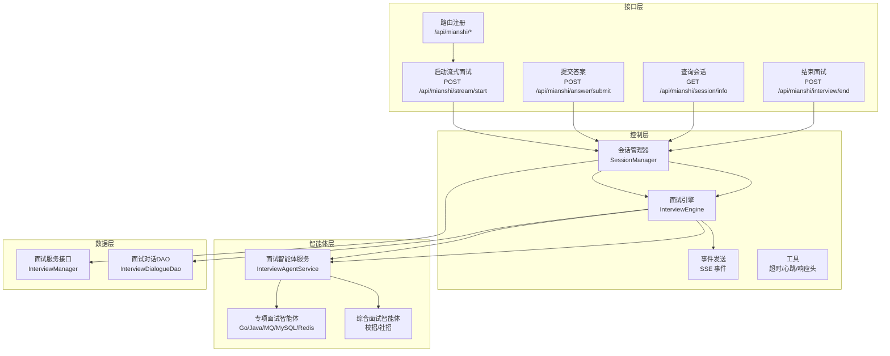
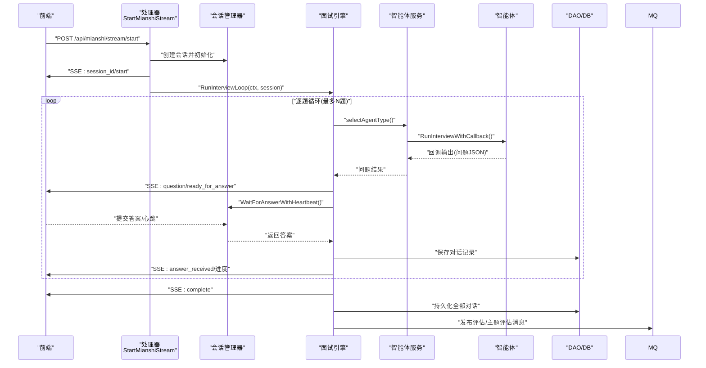
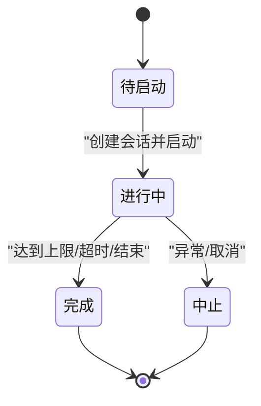
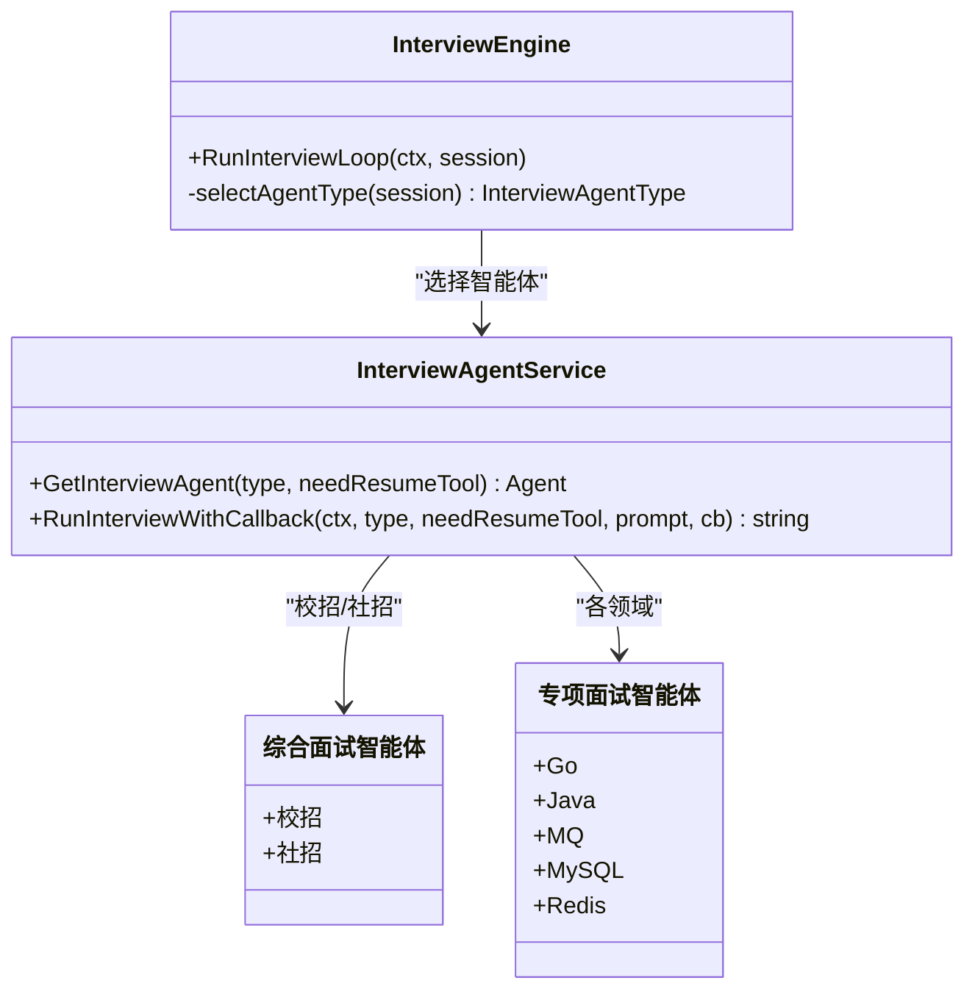
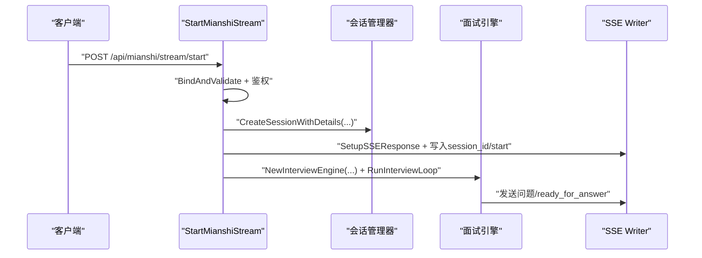
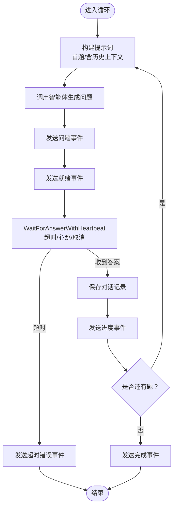
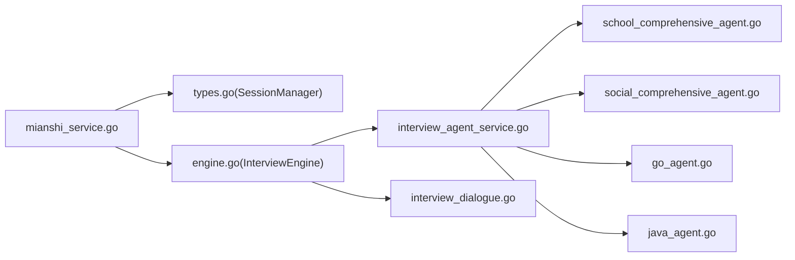

# 面试流程控制

<cite>
**本文引用的文件**
- [backend/api/handler/interview/mianshi_service.go](file://backend/api/handler/interview/mianshi_service.go)
- [backend/api/handler/interview/mianshi/engine.go](file://backend/api/handler/interview/mianshi/engine.go)
- [backend/api/handler/interview/mianshi/types.go](file://backend/api/handler/interview/mianshi/types.go)
- [backend/api/handler/interview/mianshi/events.go](file://backend/api/handler/interview/mianshi/events.go)
- [backend/api/handler/interview/mianshi/utils.go](file://backend/api/handler/interview/mianshi/utils.go)
- [backend/chatApp/agent_service/interview/interview_agent_service.go](file://backend/chatApp/agent_service/interview/interview_agent_service.go)
- [backend/chatApp/agent/interview/comprehensive/school_comprehensive_agent.go](file://backend/chatApp/agent/interview/comprehensive/school_comprehensive_agent.go)
- [backend/chatApp/agent/interview/comprehensive/social_comprehensive_agent.go](file://backend/chatApp/agent/interview/comprehensive/social_comprehensive_agent.go)
- [backend/chatApp/agent/interview/specialized/go_agent.go](file://backend/chatApp/agent/interview/specialized/go_agent.go)
- [backend/chatApp/agent/interview/specialized/java_agent.go](file://backend/chatApp/agent/interview/specialized/java_agent.go)
- [backend/internal/model/interview_dialogue.go](file://backend/internal/model/interview_dialogue.go)
- [backend/internal/service/interviews/interface.go](file://backend/internal/service/interviews/interface.go)
- [backend/api/router/interview/api.go](file://backend/api/router/interview/api.go)
</cite>

## 目录
1. [简介](#简介)
2. [项目结构](#项目结构)
3. [核心组件](#核心组件)
4. [架构总览](#架构总览)
5. [详细组件分析](#详细组件分析)
6. [依赖分析](#依赖分析)
7. [性能考虑](#性能考虑)
8. [故障排查指南](#故障排查指南)
9. [结论](#结论)
10. [附录](#附录)

## 简介
本文件系统性梳理“面试流程控制”子系统的状态机设计、状态转换逻辑与控制策略，覆盖综合面试与专项面试两类流程的差异与统一控制点；详述面试启动、进行中、暂停/继续、结束的完整流程；解释问题生成策略、答案提交与验证、评估触发机制；并给出异常处理、超时控制与中断恢复、流程监控、日志与审计追踪的实现要点。

## 项目结构
该子系统围绕“SSE 流式面试引擎”展开，主要由以下层次构成：
- 接口层：Hertz 路由注册与处理器，负责接收请求、鉴权、封装响应。
- 控制层：面试会话管理与引擎调度，负责状态机推进、超时与心跳、事件推送。
- 智能体层：按面试类型选择不同智能体，驱动问题生成与对话迭代。
- 数据层：面试对话记录持久化、评估报告生成与查询。

图表来源
- [backend/api/router/interview/api.go](file://backend/api/router/interview/api.go#L17-L47)
- [backend/api/handler/interview/mianshi_service.go](file://backend/api/handler/interview/mianshi_service.go#L25-L117)
- [backend/api/handler/interview/mianshi/types.go](file://backend/api/handler/interview/mianshi/types.go#L9-L82)
- [backend/api/handler/interview/mianshi/engine.go](file://backend/api/handler/interview/mianshi/engine.go#L23-L50)
- [backend/chatApp/agent_service/interview/interview_agent_service.go](file://backend/chatApp/agent_service/interview/interview_agent_service.go#L30-L73)
- [backend/internal/model/interview_dialogue.go](file://backend/internal/model/interview_dialogue.go#L29-L35)

章节来源
- [backend/api/router/interview/api.go](file://backend/api/router/interview/api.go#L17-L47)
- [backend/api/handler/interview/mianshi_service.go](file://backend/api/handler/interview/mianshi_service.go#L25-L117)

## 核心组件
- 会话管理器（SessionManager）：维护会话生命周期、并发安全、答案通道、会话清理。
- 面试引擎（InterviewEngine）：驱动问题生成、等待答案、历史上下文、事件推送、评估消息发布。
- 智能体服务（InterviewAgentService）：按类型选择智能体，运行并回调输出。
- SSE 事件与工具：事件格式化、心跳保活、SSE 响应头设置。
- 数据访问（InterviewDialogueDao）：持久化面试对话记录。
- 路由与处理器：启动/提交/查询/结束等接口，鉴权与响应封装。

章节来源
- [backend/api/handler/interview/mianshi/types.go](file://backend/api/handler/interview/mianshi/types.go#L9-L82)
- [backend/api/handler/interview/mianshi/engine.go](file://backend/api/handler/interview/mianshi/engine.go#L23-L50)
- [backend/api/handler/interview/mianshi/events.go](file://backend/api/handler/interview/mianshi/events.go#L11-L72)
- [backend/api/handler/interview/mianshi/utils.go](file://backend/api/handler/interview/mianshi/utils.go#L11-L74)
- [backend/internal/model/interview_dialogue.go](file://backend/internal/model/interview_dialogue.go#L29-L35)
- [backend/chatApp/agent_service/interview/interview_agent_service.go](file://backend/chatApp/agent_service/interview/interview_agent_service.go#L30-L73)

## 架构总览
面试流程以“SSE 流式对话”为核心，前端通过长连接接收事件，后端按序生成问题、等待回答、推进状态机，最终触发评估任务并持久化记录。

图表来源
- [backend/api/handler/interview/mianshi_service.go](file://backend/api/handler/interview/mianshi_service.go#L25-L117)
- [backend/api/handler/interview/mianshi/engine.go](file://backend/api/handler/interview/mianshi/engine.go#L39-L230)
- [backend/api/handler/interview/mianshi/utils.go](file://backend/api/handler/interview/mianshi/utils.go#L11-L56)
- [backend/chatApp/agent_service/interview/interview_agent_service.go](file://backend/chatApp/agent_service/interview/interview_agent_service.go#L75-L101)
- [backend/internal/model/interview_dialogue.go](file://backend/internal/model/interview_dialogue.go#L29-L35)

## 详细组件分析

### 状态机设计与状态转换
- 状态定义
  - active：会话已创建并处于进行中。
  - completed：面试完成或被主动结束。
- 转换规则
  - pending -> active：创建会话并启动流式循环。
  - active -> completed：达到最大题数、超时或收到结束指令。
- 关键控制点
  - 会话状态字段与生命周期由会话管理器维护。
  - 引擎在循环中根据上下文与超时条件推进状态。

图表来源
- [backend/api/handler/interview/mianshi/types.go](file://backend/api/handler/interview/mianshi/types.go#L15-L34)
- [backend/api/handler/interview/mianshi/engine.go](file://backend/api/handler/interview/mianshi/engine.go#L42-L230)

章节来源
- [backend/api/handler/interview/mianshi/types.go](file://backend/api/handler/interview/mianshi/types.go#L15-L34)
- [backend/api/handler/interview/mianshi/engine.go](file://backend/api/handler/interview/mianshi/engine.go#L42-L71)

### 面试类型与控制策略差异
- 综合面试
  - 校招简历面试：选择校招综合智能体。
  - 社招简历面试：选择社招综合智能体。
- 专项面试
  - 按领域选择对应专项智能体（Go、Java、MQ、MySQL、Redis）。
- 控制策略
  - 统一使用“逐题生成-等待回答-推进”的循环策略。
  - 专项面试不区分难度等级，综合面试通过难度字段参与提示词构建。

图表来源
- [backend/api/handler/interview/mianshi/engine.go](file://backend/api/handler/interview/mianshi/engine.go#L260-L290)
- [backend/chatApp/agent_service/interview/interview_agent_service.go](file://backend/chatApp/agent_service/interview/interview_agent_service.go#L42-L73)
- [backend/chatApp/agent/interview/comprehensive/school_comprehensive_agent.go](file://backend/chatApp/agent/interview/comprehensive/school_comprehensive_agent.go#L14-L48)
- [backend/chatApp/agent/interview/comprehensive/social_comprehensive_agent.go](file://backend/chatApp/agent/interview/comprehensive/social_comprehensive_agent.go#L14-L48)
- [backend/chatApp/agent/interview/specialized/go_agent.go](file://backend/chatApp/agent/interview/specialized/go_agent.go#L14-L48)
- [backend/chatApp/agent/interview/specialized/java_agent.go](file://backend/chatApp/agent/interview/specialized/java_agent.go#L14-L48)

章节来源
- [backend/api/handler/interview/mianshi/engine.go](file://backend/api/handler/interview/mianshi/engine.go#L260-L290)
- [backend/chatApp/agent_service/interview/interview_agent_service.go](file://backend/chatApp/agent_service/interview/interview_agent_service.go#L42-L73)

### 面试启动流程
- 请求绑定与鉴权
  - 绑定请求体并校验，获取用户ID。
- 创建面试记录
  - 写入面试记录（状态 pending），返回 recordID。
- 创建会话
  - 初始化会话（状态 active），设置开始时间、答案通道等。
- 建立 SSE 连接
  - 设置 SSE 响应头，写入会话ID与开始事件。
- 启动引擎循环
  - 异步运行引擎，逐题生成问题并等待回答。

图表来源
- [backend/api/handler/interview/mianshi_service.go](file://backend/api/handler/interview/mianshi_service.go#L25-L117)
- [backend/api/handler/interview/mianshi/utils.go](file://backend/api/handler/interview/mianshi/utils.go#L58-L74)
- [backend/api/handler/interview/mianshi/events.go](file://backend/api/handler/interview/mianshi/events.go#L52-L63)

章节来源
- [backend/api/handler/interview/mianshi_service.go](file://backend/api/handler/interview/mianshi_service.go#L25-L117)

### 进行中流程：问题生成与答案等待
- 问题生成策略
  - 首题：基于简历ID与难度等级生成问题。
  - 后续题：携带最近若干题的历史上下文，避免重复并逐步深化。
- 答案等待与心跳
  - 使用带超时与心跳的等待函数，定期发送心跳事件保持连接。
- 事件推送
  - 问题事件、就绪事件、进度事件、错误事件、完成事件。

图表来源
- [backend/api/handler/interview/mianshi/engine.go](file://backend/api/handler/interview/mianshi/engine.go#L74-L206)
- [backend/api/handler/interview/mianshi/utils.go](file://backend/api/handler/interview/mianshi/utils.go#L11-L56)
- [backend/api/handler/interview/mianshi/events.go](file://backend/api/handler/interview/mianshi/events.go#L11-L72)

章节来源
- [backend/api/handler/interview/mianshi/engine.go](file://backend/api/handler/interview/mianshi/engine.go#L74-L206)
- [backend/api/handler/interview/mianshi/utils.go](file://backend/api/handler/interview/mianshi/utils.go#L11-L56)

### 暂停/继续与中断恢复
- 当前实现
  - 未显式实现“暂停/继续”状态；通过上下文取消与超时控制实现中断与恢复。
- 中断恢复
  - 会话管理器持有取消函数，结束接口可立即取消引擎循环并关闭连接。
  - 会话在结束后延迟删除，便于查询与审计。

章节来源
- [backend/api/handler/interview/mianshi/types.go](file://backend/api/handler/interview/mianshi/types.go#L29-L34)
- [backend/api/handler/interview/mianshi_service.go](file://backend/api/handler/interview/mianshi_service.go#L232-L300)

### 结束流程与评估触发
- 结束接口
  - 校验会话与权限，更新状态为 completed，计算时长，调用取消函数。
  - 异步删除会话，返回统计信息。
- 评估触发
  - 引擎在循环结束后发布评估报告与主题评估消息，供后续消费。

章节来源
- [backend/api/handler/interview/mianshi_service.go](file://backend/api/handler/interview/mianshi_service.go#L232-L300)
- [backend/api/handler/interview/mianshi/engine.go](file://backend/api/handler/interview/mianshi/engine.go#L221-L230)

### 答案提交、验证与评估
- 提交答案
  - 提交接口校验会话与权限，写入答案通道；返回接收确认。
- 评估
  - 评估报告与答题记录支持查询与生成；若数据库无数据则触发智能体生成。

章节来源
- [backend/api/handler/interview/mianshi_service.go](file://backend/api/handler/interview/mianshi_service.go#L119-L168)
- [backend/api/handler/interview/mianshi_service.go](file://backend/api/handler/interview/mianshi_service.go#L302-L340)
- [backend/api/handler/interview/mianshi_service.go](file://backend/api/handler/interview/mianshi_service.go#L342-L392)

## 依赖分析
- 组件耦合
  - 处理器依赖会话管理器与面试引擎；引擎依赖智能体服务与DAO；智能体服务依赖具体智能体实现。
- 外部集成
  - SSE 事件推送依赖 HTTP 响应写入与 Flush；评估消息通过 MQ 发布。
- 潜在风险
  - 会话管理器为全局单例，需关注高并发下的锁竞争与内存占用。
  - 评估消息发布失败需重试与告警。

图表来源
- [backend/api/handler/interview/mianshi_service.go](file://backend/api/handler/interview/mianshi_service.go#L25-L117)
- [backend/api/handler/interview/mianshi/types.go](file://backend/api/handler/interview/mianshi/types.go#L9-L82)
- [backend/api/handler/interview/mianshi/engine.go](file://backend/api/handler/interview/mianshi/engine.go#L23-L50)
- [backend/chatApp/agent_service/interview/interview_agent_service.go](file://backend/chatApp/agent_service/interview/interview_agent_service.go#L30-L73)
- [backend/internal/model/interview_dialogue.go](file://backend/internal/model/interview_dialogue.go#L29-L35)

章节来源
- [backend/api/handler/interview/mianshi_service.go](file://backend/api/handler/interview/mianshi_service.go#L25-L117)
- [backend/api/handler/interview/mianshi/engine.go](file://backend/api/handler/interview/mianshi/engine.go#L23-L50)

## 性能考虑
- 并发与锁
  - 会话管理器使用读写锁保护 sessions 映射，注意高频提交场景下的锁竞争。
- IO 与缓冲
  - SSE 写入后强制 flush，保证事件实时性；大文本输出建议分块或流式传输。
- 超时与心跳
  - 合理设置等待超时与心跳间隔，避免长时间阻塞与资源占用。
- 数据持久化
  - 逐条保存对话记录，批量写入可结合事务优化；定期清理过期会话降低内存压力。

## 故障排查指南
- 常见问题
  - 会话不存在：检查 session_id 与用户匹配，确认会话未被延迟删除。
  - 答案未送达：检查答案通道是否被覆盖或阻塞；确认心跳事件正常。
  - 问题生成失败：检查智能体服务可用性与回调解析；查看错误事件。
  - 评估未触发：检查 MQ 发布是否成功；确认消费者在线。
- 日志与审计
  - 引擎与处理器广泛使用日志记录关键事件与错误；建议接入统一日志系统。
  - 会话与记录包含时间戳与统计信息，便于审计与复盘。

章节来源
- [backend/api/handler/interview/mianshi_service.go](file://backend/api/handler/interview/mianshi_service.go#L119-L168)
- [backend/api/handler/interview/mianshi/engine.go](file://backend/api/handler/interview/mianshi/engine.go#L128-L146)
- [backend/api/handler/interview/mianshi/events.go](file://backend/api/handler/interview/mianshi/events.go#L36-L50)

## 结论
该面试流程控制以“SSE 流式引擎 + 智能体服务”为核心，实现了统一的面试控制与差异化智能体策略。通过会话管理器与事件系统，系统具备良好的扩展性与可观测性。建议后续补充“暂停/继续”状态与“恢复点”机制，增强用户体验与可靠性。

## 附录
- 接口清单
  - 启动流式面试：POST /api/mianshi/stream/start
  - 提交答案：POST /api/mianshi/answer/submit
  - 查询会话：GET /api/mianshi/session/info
  - 结束面试：POST /api/mianshi/interview/end
  - 获取评估报告：GET /api/mianshi/evaluation
  - 获取答题记录：GET /api/mianshi/answer-record
  - 获取面试记录：GET /api/mianshi/records

章节来源
- [backend/api/router/interview/api.go](file://backend/api/router/interview/api.go#L27-L46)
- [backend/api/handler/interview/mianshi_service.go](file://backend/api/handler/interview/mianshi_service.go#L25-L409)