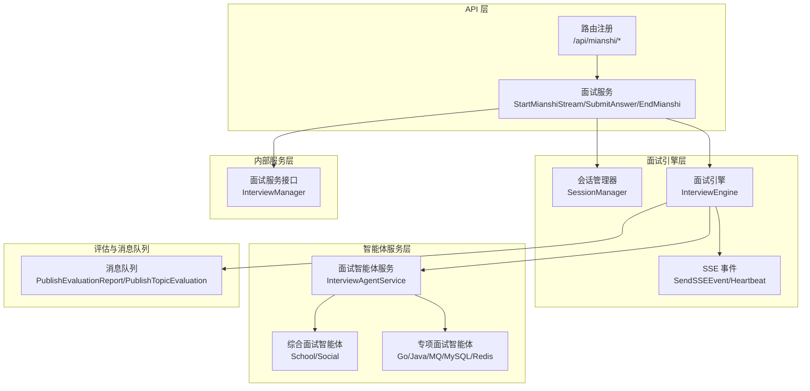
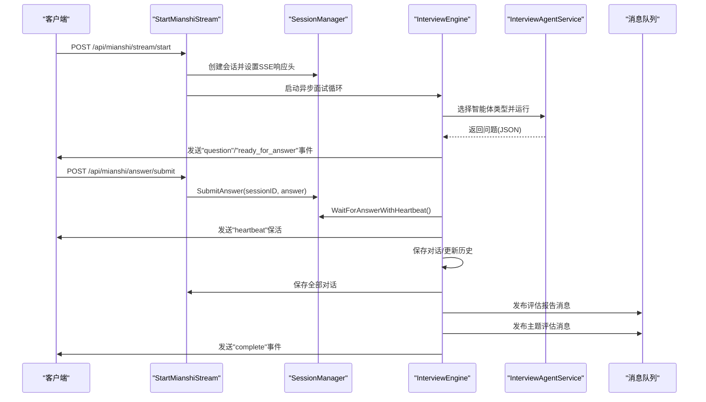
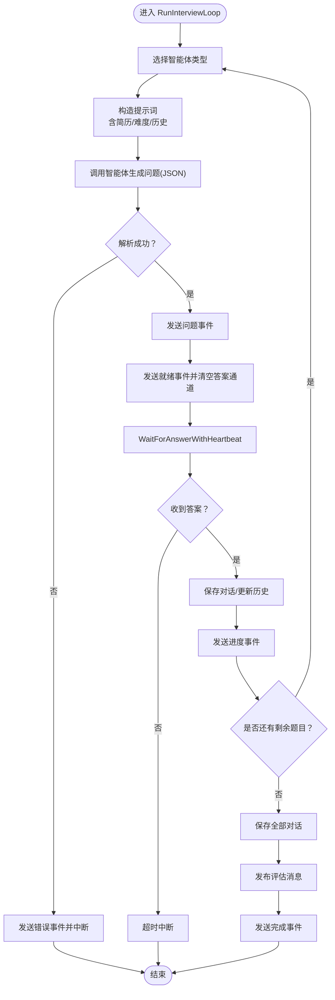
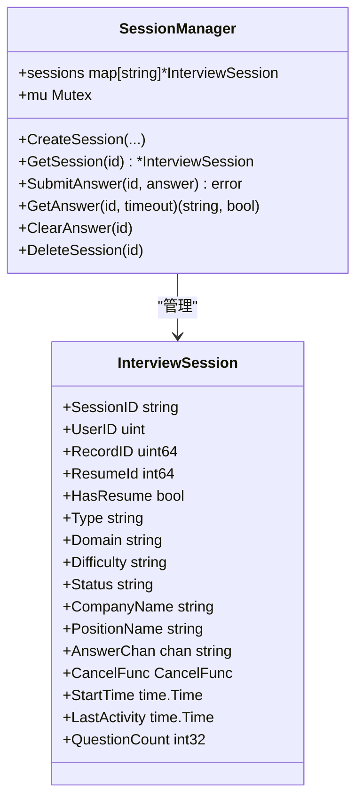
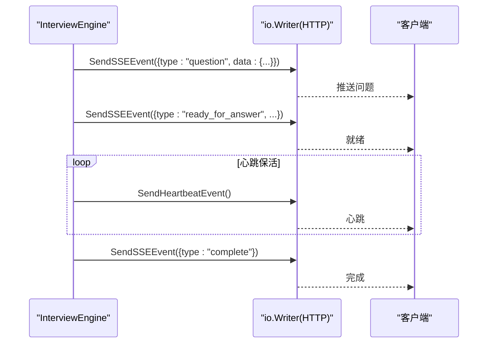
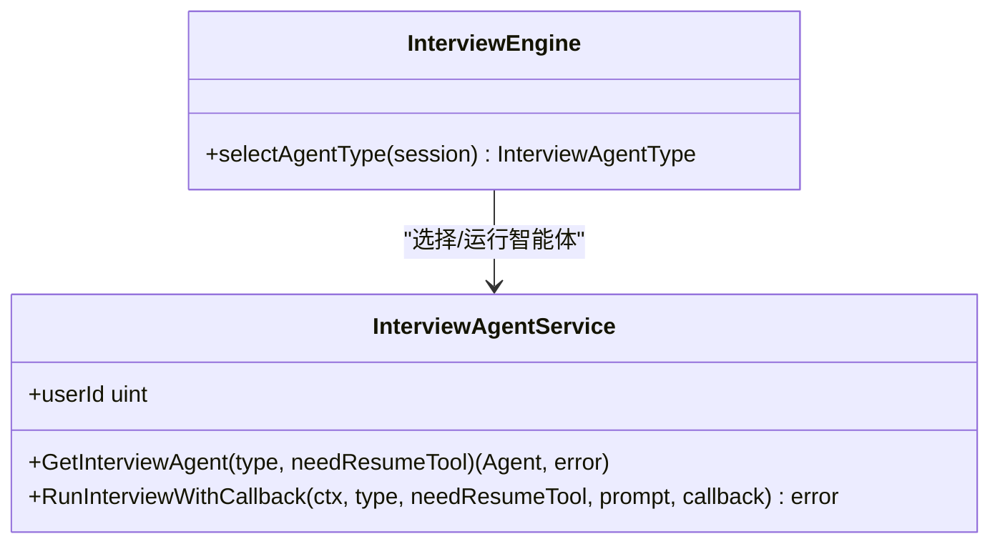
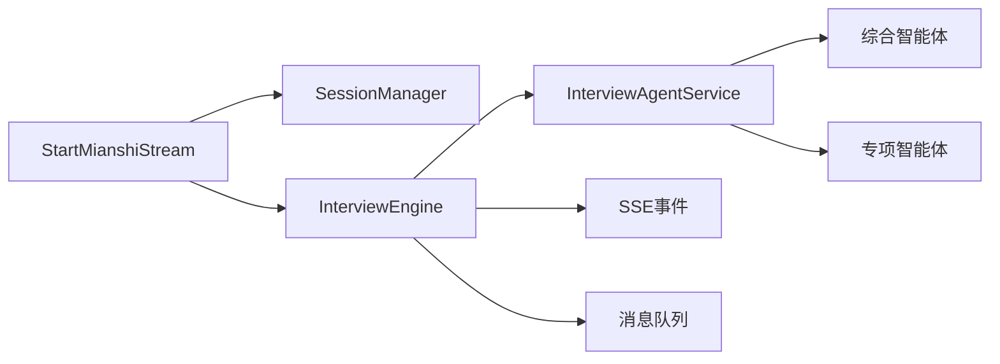

# 面试系统核心功能

<cite>
**本文引用的文件**
- [backend/api/handler/interview/mianshi/engine.go](file://backend/api/handler/interview/mianshi/engine.go)
- [backend/api/handler/interview/mianshi/types.go](file://backend/api/handler/interview/mianshi/types.go)
- [backend/api/handler/interview/mianshi/events.go](file://backend/api/handler/interview/mianshi/events.go)
- [backend/api/handler/interview/mianshi/utils.go](file://backend/api/handler/interview/mianshi/utils.go)
- [backend/api/handler/interview/mianshi_service.go](file://backend/api/handler/interview/mianshi_service.go)
- [backend/api/router/interview/api.go](file://backend/api/router/interview/api.go)
- [backend/api/router/register.go](file://backend/api/router/register.go)
- [backend/chatApp/agent_service/interview/interview_agent_service.go](file://backend/chatApp/agent_service/interview/interview_agent_service.go)
- [backend/chatApp/agent/interview/comprehensive/constants.go](file://backend/chatApp/agent/interview/comprehensive/constants.go)
- [backend/chatApp/agent/interview/comprehensive/school_comprehensive_agent.go](file://backend/chatApp/agent/interview/comprehensive/school_comprehensive_agent.go)
- [backend/chatApp/agent/interview/specialized/go_agent.go](file://backend/chatApp/agent/interview/specialized/go_agent.go)
- [backend/chatApp/agent/interview/specialized/constants.go](file://backend/chatApp/agent/interview/specialized/constants.go)
- [backend/internal/mq/mq.go](file://backend/internal/mq/mq.go)
- [backend/internal/service/interviews/interface.go](file://backend/internal/service/interviews/interface.go)
- [backend/chatApp/main.go](file://backend/chatApp/main.go)
</cite>

## 目录
1. [简介](#简介)
2. [项目结构](#项目结构)
3. [核心组件](#核心组件)
4. [架构总览](#架构总览)
5. [详细组件分析](#详细组件分析)
6. [依赖关系分析](#依赖关系分析)
7. [性能考量](#性能考量)
8. [故障排查指南](#故障排查指南)
9. [结论](#结论)
10. [附录](#附录)

## 简介
本文件面向面试系统的核心功能，围绕“面试引擎”展开，系统性阐述以下方面：
- 面试引擎的设计原理与实现机制
- 会话管理系统、实时SSE流处理与面试流程控制
- 综合面试与专项面试的差异化实现
- 面试问题生成、答案收集与评估反馈的完整流程
- 面试状态管理、超时处理与异常恢复机制
- 性能优化与用户体验改进建议

## 项目结构
后端采用分层与模块化组织：
- API层：路由注册、请求处理、SSE响应设置
- 面试引擎层：会话管理、问题生成、答案等待与事件推送
- 智能体服务层：基于不同面试类型构建与运行智能体
- 评估与消息队列：面试结束后触发评估与主题评估消息
- 内部服务层：面试记录、评估报告、答题记录等业务接口

图表来源
- [backend/api/router/interview/api.go](file://backend/api/router/interview/api.go#L16-L103)
- [backend/api/handler/interview/mianshi_service.go](file://backend/api/handler/interview/mianshi_service.go#L25-L117)
- [backend/api/handler/interview/mianshi/engine.go](file://backend/api/handler/interview/mianshi/engine.go#L23-L37)
- [backend/chatApp/agent_service/interview/interview_agent_service.go](file://backend/chatApp/agent_service/interview/interview_agent_service.go#L30-L73)
- [backend/internal/mq/mq.go](file://backend/internal/mq/mq.go#L155-L208)
- [backend/internal/service/interviews/interface.go](file://backend/internal/service/interviews/interface.go#L20-L63)

章节来源
- [backend/api/router/register.go](file://backend/api/router/register.go#L11-L15)
- [backend/api/router/interview/api.go](file://backend/api/router/interview/api.go#L16-L103)

## 核心组件
- 面试引擎 InterviewEngine：负责按序生成问题、等待答案、维护历史上下文、保存对话、触发评估消息
- 会话管理器 SessionManager：全局会话生命周期管理、答案通道、活动时间与状态
- SSE 事件系统：标准事件格式、错误/完成/就绪/心跳事件、响应头设置
- 面试智能体服务 InterviewAgentService：按类型创建智能体、统一运行与回调
- 智能体实现：综合面试（校招/社招）、专项面试（Go/Java/MQ/MySQL/Redis）
- 消息队列：发布评估报告与主题评估消息
- 内部服务接口：面试记录、评估报告、答题记录等

章节来源
- [backend/api/handler/interview/mianshi/engine.go](file://backend/api/handler/interview/mianshi/engine.go#L23-L37)
- [backend/api/handler/interview/mianshi/types.go](file://backend/api/handler/interview/mianshi/types.go#L9-L50)
- [backend/api/handler/interview/mianshi/events.go](file://backend/api/handler/interview/mianshi/events.go#L11-L71)
- [backend/api/handler/interview/mianshi/utils.go](file://backend/api/handler/interview/mianshi/utils.go#L11-L73)
- [backend/chatApp/agent_service/interview/interview_agent_service.go](file://backend/chatApp/agent_service/interview/interview_agent_service.go#L30-L101)
- [backend/internal/mq/mq.go](file://backend/internal/mq/mq.go#L155-L208)
- [backend/internal/service/interviews/interface.go](file://backend/internal/service/interviews/interface.go#L20-L63)

## 架构总览
面试流程以“SSE流 + 智能体 + 会话管理 + 评估消息”为核心闭环：
- 客户端发起启动请求，服务端创建面试记录与会话，建立SSE流
- 引擎逐题生成问题，发送“问题/就绪”事件；客户端提交答案
- 引擎等待答案（带心跳保活），超时则中断；累计历史上下文，逐步加深
- 全部完成后保存对话，发布评估消息，结束SSE流

图表来源
- [backend/api/handler/interview/mianshi_service.go](file://backend/api/handler/interview/mianshi_service.go#L25-L117)
- [backend/api/handler/interview/mianshi/engine.go](file://backend/api/handler/interview/mianshi/engine.go#L39-L230)
- [backend/api/handler/interview/mianshi/utils.go](file://backend/api/handler/interview/mianshi/utils.go#L11-L56)
- [backend/internal/mq/mq.go](file://backend/internal/mq/mq.go#L155-L208)

## 详细组件分析

### 面试引擎 InterviewEngine
- 设计要点
  - 逐题生成：每次生成一道问题，用户回答后再生成下一道
  - 历史上下文：保留最近若干题的历史，指导后续问题生成
  - 超时与保活：固定答案等待窗口与心跳间隔，超时中断
  - 事件驱动：通过SSE事件向客户端推送问题、就绪、进度、完成与错误
  - 评估消息：面试结束后发布评估与主题评估消息
- 关键流程
  - 选择智能体类型（综合/专项）
  - 构造提示词（含简历ID、难度、历史上下文）
  - 智能体运行并解析JSON返回
  - 发送问题事件与“就绪”事件，清空答案通道
  - 等待答案（心跳保活），超时则中断
  - 保存对话，发送进度事件
  - 完成后保存全部对话，发布评估消息

图表来源
- [backend/api/handler/interview/mianshi/engine.go](file://backend/api/handler/interview/mianshi/engine.go#L39-L230)
- [backend/api/handler/interview/mianshi/utils.go](file://backend/api/handler/interview/mianshi/utils.go#L11-L56)
- [backend/api/handler/interview/mianshi/events.go](file://backend/api/handler/interview/mianshi/events.go#L11-L71)
- [backend/internal/mq/mq.go](file://backend/internal/mq/mq.go#L155-L208)

章节来源
- [backend/api/handler/interview/mianshi/engine.go](file://backend/api/handler/interview/mianshi/engine.go#L23-L291)

### 会话管理 SessionManager
- 职责
  - 创建/获取/删除会话
  - 答案通道提交与阻塞等待
  - 清空答案通道、记录活动时间、状态管理
- 关键点
  - 使用互斥锁保护会话表
  - 答案通道为带缓冲的单值通道，避免阻塞
  - 会话包含面试类型、领域、难度、公司/岗位信息、问题计数等

图表来源
- [backend/api/handler/interview/mianshi/types.go](file://backend/api/handler/interview/mianshi/types.go#L9-L165)

章节来源
- [backend/api/handler/interview/mianshi/types.go](file://backend/api/handler/interview/mianshi/types.go#L9-L165)

### 实时SSE流与事件系统
- SSE事件
  - 事件格式：标准 event/data/空行
  - 类型：message/error/complete/ready_for_answer/heartbeat
  - 立即flush，确保前端及时接收
- 心跳保活
  - 定时发送heartbeat事件，防止连接空闲断开
- 响应头设置
  - Content-Type: text/event-stream
  - Cache-Control: no-cache
  - Access-Control: 允许跨域
  - X-Accel-Buffering: no（Nginx）

图表来源
- [backend/api/handler/interview/mianshi/events.go](file://backend/api/handler/interview/mianshi/events.go#L11-L71)
- [backend/api/handler/interview/mianshi/utils.go](file://backend/api/handler/interview/mianshi/utils.go#L58-L73)

章节来源
- [backend/api/handler/interview/mianshi/events.go](file://backend/api/handler/interview/mianshi/events.go#L11-L71)
- [backend/api/handler/interview/mianshi/utils.go](file://backend/api/handler/interview/mianshi/utils.go#L58-L73)

### 面试智能体服务与类型选择
- 智能体类型
  - 综合面试：校招/社招
  - 专项面试：Go/Java/MQ/MySQL/Redis
- 选择逻辑
  - 根据会话类型与领域选择对应智能体
- 运行机制
  - 统一回调收集最终JSON字符串
  - 支持是否携带简历工具（如需要简历信息）

图表来源
- [backend/chatApp/agent_service/interview/interview_agent_service.go](file://backend/chatApp/agent_service/interview/interview_agent_service.go#L30-L101)
- [backend/api/handler/interview/mianshi/engine.go](file://backend/api/handler/interview/mianshi/engine.go#L260-L290)

章节来源
- [backend/chatApp/agent_service/interview/interview_agent_service.go](file://backend/chatApp/agent_service/interview/interview_agent_service.go#L30-L101)
- [backend/api/handler/interview/mianshi/engine.go](file://backend/api/handler/interview/mianshi/engine.go#L260-L290)

### 综合面试与专项面试实现
- 综合面试
  - 校招：强调学习潜力、基础知识、职业素养
  - 社招：强调实战经验、架构设计、技术深度与领导力
- 专项面试
  - 针对特定技术栈（Go/Java/MQ/MySQL/Redis），聚焦专业能力与实践
- 提示词与约束
  - 各智能体内置提示词，限定不写代码、不实现功能，仅技术讨论与知识考察
  - 问题方向覆盖核心特性、性能优化、系统设计、故障处理等

章节来源
- [backend/chatApp/agent/interview/comprehensive/constants.go](file://backend/chatApp/agent/interview/comprehensive/constants.go#L3-L94)
- [backend/chatApp/agent/interview/specialized/constants.go](file://backend/chatApp/agent/interview/specialized/constants.go#L3-L246)
- [backend/chatApp/agent/interview/comprehensive/school_comprehensive_agent.go](file://backend/chatApp/agent/interview/comprehensive/school_comprehensive_agent.go#L14-L47)
- [backend/chatApp/agent/interview/specialized/go_agent.go](file://backend/chatApp/agent/interview/specialized/go_agent.go#L14-L47)

### 评估与消息队列
- 评估消息
  - 评估报告生成消息：用于生成整体面试评估
  - 主题评估消息：用于生成按主题维度的评估
- 发布时机
  - 面试完成后，引擎发布两条消息到消息队列
- 消息队列实现
  - 内存队列（开发/测试）：异步广播给订阅者
  - 可替换为外部消息队列（如Redis/中间件）

章节来源
- [backend/internal/mq/mq.go](file://backend/internal/mq/mq.go#L155-L208)
- [backend/api/handler/interview/mianshi/engine.go](file://backend/api/handler/interview/mianshi/engine.go#L221-L229)

### API与路由
- 路由注册
  - 自动生成路由，按模块分组（/api/mianshi/*）
- 关键接口
  - 启动SSE流：POST /api/mianshi/stream/start
  - 提交答案：POST /api/mianshi/answer/submit
  - 结束面试：POST /api/mianshi/interview/end
  - 获取会话：GET /api/mianshi/session/info
  - 获取评估/答题记录：GET /api/mianshi/evaluation | /answer-record

章节来源
- [backend/api/router/interview/api.go](file://backend/api/router/interview/api.go#L16-L103)
- [backend/api/router/register.go](file://backend/api/router/register.go#L11-L15)

## 依赖关系分析
- 组件耦合
  - InterviewEngine 依赖 SessionManager、InterviewAgentService、SSE事件、消息队列
  - InterviewAgentService 依赖具体智能体实现（综合/专项）
  - StartMianshiStream 作为入口，串联会话创建、SSE设置与引擎运行
- 外部依赖
  - EINO 智能体框架（Runner/Agent/迭代器）
  - Hertz Web 框架（路由、请求上下文、SSE响应头）
  - 消息队列抽象（可替换实现）

图表来源
- [backend/api/handler/interview/mianshi_service.go](file://backend/api/handler/interview/mianshi_service.go#L25-L117)
- [backend/api/handler/interview/mianshi/engine.go](file://backend/api/handler/interview/mianshi/engine.go#L23-L37)
- [backend/chatApp/agent_service/interview/interview_agent_service.go](file://backend/chatApp/agent_service/interview/interview_agent_service.go#L30-L101)
- [backend/internal/mq/mq.go](file://backend/internal/mq/mq.go#L155-L208)

章节来源
- [backend/api/handler/interview/mianshi_service.go](file://backend/api/handler/interview/mianshi_service.go#L25-L117)
- [backend/api/handler/interview/mianshi/engine.go](file://backend/api/handler/interview/mianshi/engine.go#L23-L37)
- [backend/chatApp/agent_service/interview/interview_agent_service.go](file://backend/chatApp/agent_service/interview/interview_agent_service.go#L30-L101)

## 性能考量
- SSE 传输
  - 立即flush，减少延迟；合理设置心跳频率，避免频繁IO
  - 前端需正确处理SSE连接，避免浏览器缓存影响
- 会话与通道
  - 答案通道为单值缓冲，避免阻塞；超时时间与心跳间隔需平衡
- 智能体调用
  - 控制最大迭代次数，避免长时间阻塞；必要时增加超时与重试
- 评估消息
  - 评估消息异步发布，避免阻塞主流程；订阅者异步处理
- 数据持久化
  - 保存对话时可按批次记录日志，便于监控与回溯

## 故障排查指南
- 常见问题
  - SSE 连接断开：检查心跳事件是否持续发送；确认响应头设置
  - 答案未送达：确认 SubmitAnswer 调用与会话ID匹配；检查通道是否被清空
  - 问题生成失败：检查智能体类型选择与提示词构造；查看回调解析JSON
  - 评估消息未触发：确认面试完成事件发送与消息队列初始化
- 日志定位
  - 引擎与会话管理器均输出关键日志，便于定位阶段与会话ID
- 异常恢复
  - 超时自动中断并发送错误事件
  - 会话结束后延迟清理，避免竞态

章节来源
- [backend/api/handler/interview/mianshi/engine.go](file://backend/api/handler/interview/mianshi/engine.go#L128-L138)
- [backend/api/handler/interview/mianshi/utils.go](file://backend/api/handler/interview/mianshi/utils.go#L11-L56)
- [backend/api/handler/interview/mianshi/events.go](file://backend/api/handler/interview/mianshi/events.go#L36-L50)

## 结论
该面试系统以“SSE流 + 智能体 + 会话管理 + 评估消息”为核心，实现了可扩展、可观测、可恢复的面试流程。通过逐题生成与历史上下文，结合综合与专项两类智能体，满足不同场景需求。建议在生产环境中进一步完善消息队列实现、接入鉴权与限流、优化前端SSE连接与错误重连策略，并引入更细粒度的指标监控。

## 附录
- 示例入口与调试
  - chatApp/main.go 提供EINO智能体交互示例，可用于验证模型与Agent配置

章节来源
- [backend/chatApp/main.go](file://backend/chatApp/main.go#L25-L123)