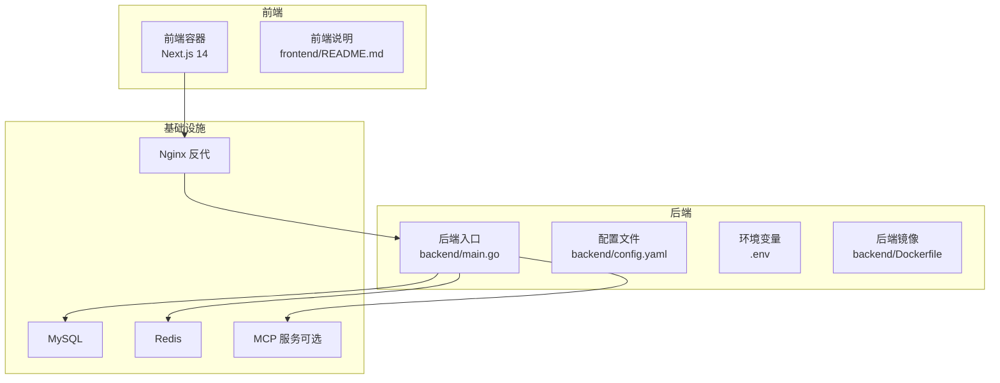
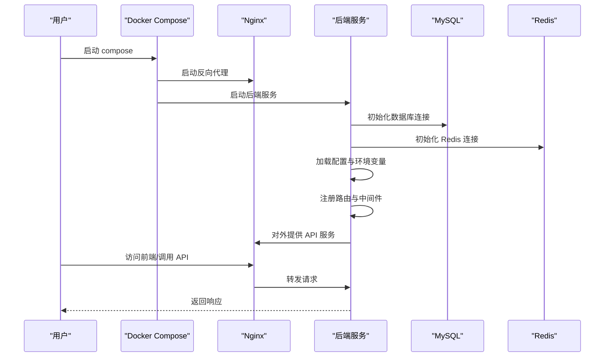
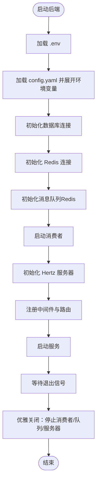
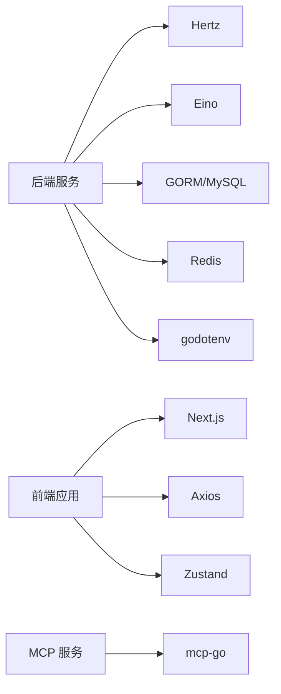

# 快速开始

<cite>
**本文引用的文件**
- [README.md](file://README.md)
- [backend/main.go](file://backend/main.go)
- [backend/config.example.yaml](file://backend/config.example.yaml)
- [backend/.env](file://backend/.env)
- [backend/go.mod](file://backend/go.mod)
- [backend/Dockerfile](file://backend/Dockerfile)
- [docker-compose.yml](file://docker-compose.yml)
- [frontend/README.md](file://frontend/README.md)
- [frontend/Dockerfile](file://frontend/Dockerfile)
- [frontend/package.json](file://frontend/package.json)
- [backend/internal/config/config.go](file://backend/internal/config/config.go)
- [backend/cmd/debug_network/main.go](file://backend/cmd/debug_network/main.go)
- [mcpserver/config.yaml](file://mcpserver/config.yaml)
- [mcpserver/go.mod](file://mcpserver/go.mod)
</cite>

## 目录
1. [简介](#简介)
2. [项目结构](#项目结构)
3. [核心组件](#核心组件)
4. [架构总览](#架构总览)
5. [详细组件分析](#详细组件分析)
6. [依赖关系分析](#依赖关系分析)
7. [性能注意事项](#性能注意事项)
8. [故障排除指南](#故障排除指南)
9. [结论](#结论)
10. [附录](#附录)

## 简介
面试吧AI智能面试平台是一个基于字节跳动 Hertz 框架与 Eino 大语言模型框架构建的智能面试系统，提供简历分析、面试问题生成、答案评估与面试记录管理等能力。本“快速开始”指南面向首次使用者，覆盖环境准备、依赖安装、配置设置、数据库初始化、服务启动以及 Docker 一键部署的完整流程，并提供常见问题排查与优化建议，帮助你在最短时间内成功运行并体验核心功能。

## 项目结构
项目采用前后端分离架构，包含后端服务、前端应用、向量检索（可选）、消息队列（Redis）与反向代理（Nginx）。后端使用 Hertz 提供 REST API，前端基于 Next.js 14+，并通过 Docker Compose 提供一键部署方案。

图表来源
- [backend/main.go](file://backend/main.go#L29-L173)
- [docker-compose.yml](file://docker-compose.yml#L1-L226)
- [backend/Dockerfile](file://backend/Dockerfile#L1-L64)
- [frontend/Dockerfile](file://frontend/Dockerfile#L1-L65)

章节来源
- [README.md](file://README.md#L35-L120)
- [docker-compose.yml](file://docker-compose.yml#L1-L226)

## 核心组件
- 后端服务（Go + Hertz）
  - 负责 REST API、JWT 认证、CORS、数据库与 Redis 连接、消息队列（Redis）初始化与消费者启动、健康检查端点等。
- 前端应用（Next.js 14+）
  - 负责用户界面、API 调用、状态管理与路由，支持开发与生产环境。
- 基础设施
  - MySQL（数据库）、Redis（缓存/消息队列）、Nginx（反向代理）、Etcd（Milvus 依赖，可选）、MCP 服务（可选）。
- 配置与环境
  - 后端配置文件与 .env；前端环境变量；Docker 与 docker-compose 配置。

章节来源
- [backend/main.go](file://backend/main.go#L29-L173)
- [backend/config.example.yaml](file://backend/config.example.yaml#L1-L127)
- [backend/.env](file://backend/.env#L1-L16)
- [frontend/README.md](file://frontend/README.md#L17-L99)

## 架构总览
后端启动流程概览如下：

图表来源
- [backend/main.go](file://backend/main.go#L29-L173)
- [docker-compose.yml](file://docker-compose.yml#L144-L206)

## 详细组件分析

### 后端服务启动流程
- 环境变量加载：优先加载 .env，否则使用系统环境变量或配置默认值。
- 配置加载与展开：加载 config.yaml 并对其中的环境变量占位符进行展开。
- 数据库初始化：使用 GORM 初始化 MySQL 连接池。
- Redis 初始化：建立 Redis 连接并初始化消息队列（Redis）。
- Hertz 服务器：注册中间件（CORS、Recovery、JWT）、注册路由并启动服务。
- 优雅关闭：监听系统信号，关闭消费者、消息队列与服务器。

图表来源
- [backend/main.go](file://backend/main.go#L29-L173)
- [backend/internal/config/config.go](file://backend/internal/config/config.go#L212-L268)

章节来源
- [backend/main.go](file://backend/main.go#L29-L173)
- [backend/internal/config/config.go](file://backend/internal/config/config.go#L136-L152)

### 配置文件与环境变量
- 后端配置文件（config.yaml）包含服务、数据库、Redis、Hertz、面试系统、安全、OpenAI、Embedding、Milvus、文档分割器、微信、飞书等配置项。
- 环境变量（.env）用于 Embedding 与 Milvus 地址等敏感或动态配置。
- 配置支持环境变量展开（${VAR} 或 $VAR），便于在不同环境灵活切换。

章节来源
- [backend/config.example.yaml](file://backend/config.example.yaml#L1-L127)
- [backend/.env](file://backend/.env#L1-L16)
- [backend/internal/config/config.go](file://backend/internal/config/config.go#L212-L268)

### 前端应用启动流程
- 环境准备：Node.js 18+，npm/yarn。
- 环境变量：在 frontend/.env.local 中配置 NEXT_PUBLIC_API_BASE_URL 指向后端 API。
- 安装依赖与启动：在 frontend 目录执行安装与开发启动命令，访问 http://localhost:3000 验证。

章节来源
- [frontend/README.md](file://frontend/README.md#L17-L99)
- [frontend/package.json](file://frontend/package.json#L1-L37)

### Docker 与 docker-compose 一键部署
- 后端镜像：基于 Alpine，多阶段构建，暴露 8888 端口，健康检查 /health。
- 前端镜像：基于 Alpine，多阶段构建，暴露 3000 端口，健康检查 /。
- 基础设施：MySQL、Redis、Etcd（Milvus 依赖）、Nginx 反代。
- 一键启动：docker-compose up 后，访问 http://localhost（Nginx 映射 80）或 http://localhost:3000（前端直连）。

章节来源
- [docker-compose.yml](file://docker-compose.yml#L1-L226)
- [backend/Dockerfile](file://backend/Dockerfile#L1-L64)
- [frontend/Dockerfile](file://frontend/Dockerfile#L1-L65)

## 依赖关系分析
- 后端依赖
  - Hertz：Web 框架
  - Eino：大模型与向量检索集成
  - GORM + MySQL：数据库 ORM
  - Redis：缓存与消息队列
  - go-dotenv：.env 加载
  - YAML：配置解析
- 前端依赖
  - Next.js 14、React 18、Ant Design、Axios、Zustand 等
- MCP 服务（可选）
  - 提供工具/协议服务，独立模块

图表来源
- [backend/go.mod](file://backend/go.mod#L7-L32)
- [frontend/package.json](file://frontend/package.json#L11-L20)
- [mcpserver/go.mod](file://mcpserver/go.mod#L5-L12)

章节来源
- [backend/go.mod](file://backend/go.mod#L1-L132)
- [frontend/package.json](file://frontend/package.json#L1-L37)
- [mcpserver/go.mod](file://mcpserver/go.mod#L1-L55)

## 性能注意事项
- 合理设置数据库连接池参数（最大打开连接、空闲连接、生命周期）。
- Redis 连接池大小与超时配置，避免阻塞。
- Hertz 的读写超时与空闲超时，结合业务场景调优。
- 向量检索（Milvus）的 TopK、度量方式与超时需按数据规模与查询延迟目标权衡。
- 前端静态资源与 API 缓存策略，减少重复请求。

## 故障排除指南
- 后端无法启动或端口占用
  - 检查 8888 端口是否被占用，必要时修改 config.yaml 或使用系统信号优雅关闭。
  - 查看日志输出定位初始化失败环节（数据库、Redis、消息队列）。
- 数据库连接失败
  - 确认 MySQL 已启动并可通过 DSN 连接；检查账号密码与网络可达性。
  - 若使用 docker-compose，请确认 MySQL 容器健康状态。
- Redis 连接失败
  - 确认 Redis 已启动并可通过地址与密码连接；检查容器健康状态。
- OpenAI/Embedding 配置问题
  - 确认 API Key、BaseURL、模型名等配置正确；必要时使用调试工具验证网络连通性。
  - 可参考调试工具进行诊断。
- 前端无法访问后端 API
  - 确认前端环境变量 NEXT_PUBLIC_API_BASE_URL 指向正确的后端地址。
  - 若直连前端 3000 端口，请确保后端已启动并可访问。
- Docker 启动异常
  - 检查 docker-compose.yml 中的环境变量与挂载路径；确认卷与网络配置正确。
  - 查看容器日志定位具体错误。

章节来源
- [backend/main.go](file://backend/main.go#L130-L173)
- [backend/cmd/debug_network/main.go](file://backend/cmd/debug_network/main.go#L30-L81)
- [frontend/README.md](file://frontend/README.md#L179-L229)

## 结论
通过本“快速开始”指南，你可以在本地或容器环境中完成环境准备、依赖安装、配置设置与服务启动，并体验面试吧的核心功能。若需进一步扩展（如 Milvus 向量检索、Google 搜索、飞书告警等），可在配置文件中按需开启相应模块。

## 附录

### 前置条件清单
- Go 版本：1.24（项目模块声明），建议使用 1.20+（兼容）
- 数据库：MySQL 8.0+
- 缓存：Redis 6.0+
- AI 服务：OpenAI API Key 或兼容的模型 API Key
- 可选：Milvus 向量数据库、Google 搜索 API Key
- 前端：Node.js 18+

章节来源
- [backend/go.mod](file://backend/go.mod#L3-L5)
- [README.md](file://README.md#L160-L167)

### 安装与运行步骤（本地）

1) 克隆项目
- 使用 Git 克隆仓库至本地并进入项目根目录。

2) 配置后端
- 进入 backend 目录，复制示例配置为实际配置文件并填写数据库、Redis、OpenAI、Embedding、Milvus 等配置。
- 如需使用 .env，将对应环境变量填入 backend/.env。

3) 初始化数据库
- 将数据库表结构导入到 MySQL（如存在对应脚本）。

4) 安装后端依赖
- 在 backend 目录执行依赖下载命令。

5) 启动后端服务
- 在 backend 目录执行后端启动命令，等待服务启动并监听端口。

6) 配置并启动前端
- 在 frontend 目录安装依赖并启动开发服务器，访问 http://localhost:3000。

7) 验证健康检查
- 访问后端健康检查端点，确认服务可用。

章节来源
- [README.md](file://README.md#L169-L196)
- [backend/config.example.yaml](file://backend/config.example.yaml#L1-L127)
- [backend/.env](file://backend/.env#L1-L16)
- [frontend/README.md](file://frontend/README.md#L51-L99)

### Docker 一键启动方案
- 使用 docker-compose 提供的基础配置一键启动后端、前端、Nginx、MySQL、Redis、Etcd（Milvus 依赖）等服务。
- 访问 http://localhost（Nginx 映射 80）或 http://localhost:3000（前端直连）体验系统。

章节来源
- [docker-compose.yml](file://docker-compose.yml#L1-L226)