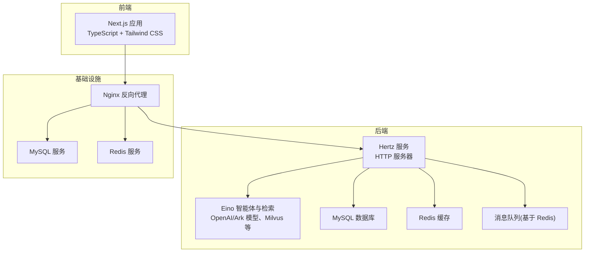
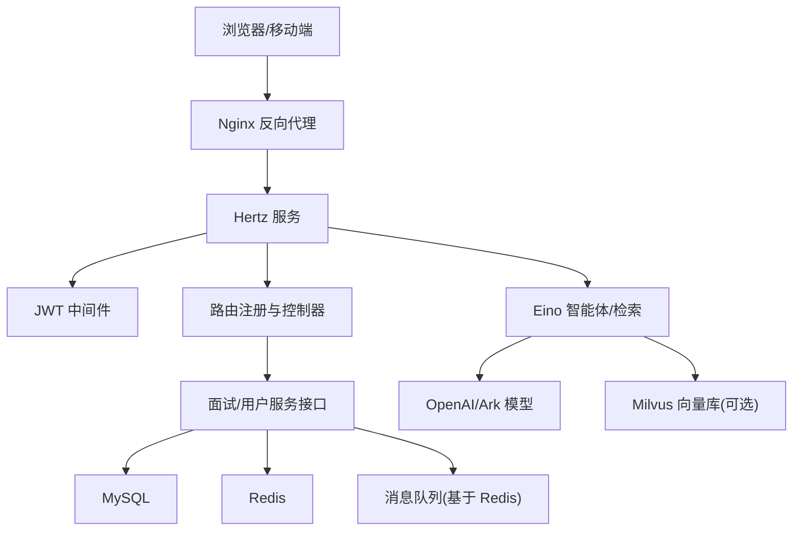
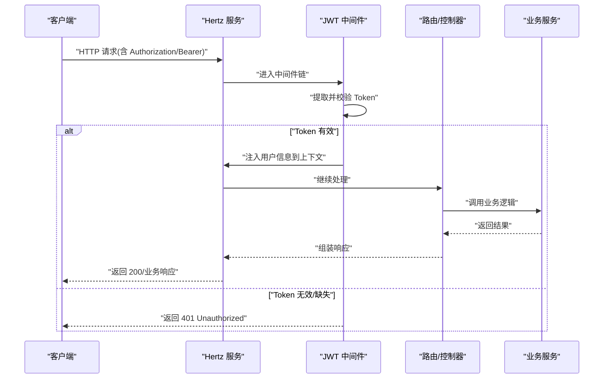
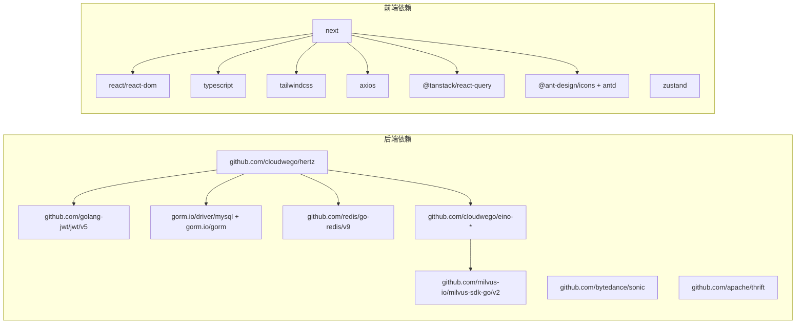

# 技术栈

<cite>
**本文引用的文件**
- [backend/go.mod](file://backend/go.mod)
- [frontend/package.json](file://frontend/package.json)
- [backend/main.go](file://backend/main.go)
- [backend/config.yaml](file://backend/config.yaml)
- [backend/internal/middleware/jwt.go](file://backend/internal/middleware/jwt.go)
- [backend/chatApp/config/config.go](file://backend/chatApp/config/config.go)
- [frontend/tailwind.config.js](file://frontend/tailwind.config.js)
- [frontend/tsconfig.json](file://frontend/tsconfig.json)
- [docker-compose.yml](file://docker-compose.yml)
- [backend/chatApp/agent/interview/comprehensive/school_comprehensive_agent.go](file://backend/chatApp/agent/interview/comprehensive/school_comprehensive_agent.go)
- [backend/chatApp/agent/interview/specialized/go_agent.go](file://backend/chatApp/agent/interview/specialized/go_agent.go)
- [backend/internal/service/interviews/interface.go](file://backend/internal/service/interviews/interface.go)
- [frontend/src/services/api/client.ts](file://frontend/src/services/api/client.ts)
- [frontend/src/app/layout.tsx](file://frontend/src/app/layout.tsx)
</cite>

## 目录
1. [简介](#简介)
2. [项目结构](#项目结构)
3. [核心组件](#核心组件)
4. [架构总览](#架构总览)
5. [详细组件分析](#详细组件分析)
6. [依赖分析](#依赖分析)
7. [性能考量](#性能考量)
8. [故障排查指南](#故障排查指南)
9. [结论](#结论)
10. [附录](#附录)

## 简介
本技术栈文档面向“面试吧AI智能面试平台”，系统梳理后端与前端技术栈、组件选择理由、版本与兼容性、依赖关系、最佳实践与替代方案，并提供学习路径与参考资料。后端采用 CloudWeGo Hertz 框架、Eino 大模型框架、MySQL、Redis、JWT 认证；前端采用 Next.js、TypeScript、Tailwind CSS 等现代 Web 技术。

## 项目结构
项目采用前后端分离架构，后端以 Hertz 作为 HTTP 服务器，结合 Eino 框架构建智能体与检索增强流程；前端基于 Next.js 提供路由与页面渲染，使用 TypeScript 与 Tailwind CSS 构建 UI。Docker Compose 提供本地开发与联调的一致环境，包含 MySQL、Redis、Nginx 等基础设施。

图表来源
- [docker-compose.yml](file://docker-compose.yml#L1-L226)
- [backend/main.go](file://backend/main.go#L101-L128)
- [frontend/src/app/layout.tsx](file://frontend/src/app/layout.tsx#L1-L25)

章节来源
- [docker-compose.yml](file://docker-compose.yml#L1-L226)
- [backend/main.go](file://backend/main.go#L101-L128)
- [frontend/src/app/layout.tsx](file://frontend/src/app/layout.tsx#L1-L25)

## 核心组件
- 后端框架与运行时
  - CloudWeGo Hertz：高性能 HTTP 服务器，提供路由注册、中间件链、CORS、JWT 等能力。
  - Go 语言：版本要求见后端模块文件。
- 大模型与检索
  - Eino 框架：提供智能体、工具、嵌入、Milvus 检索等能力，支撑面试问答、简历解析、知识检索。
- 存储与缓存
  - MySQL：持久化用户、面试记录、简历等业务数据。
  - Redis：会话、缓存、消息队列（基于 Redis）。
- 认证与授权
  - JWT：基于 golang-jwt，支持多种 Token 位置提取与上下文注入。
- 前端框架与工具链
  - Next.js：React 全栈框架，App Router，SSR/CSR 混合。
  - TypeScript：类型安全与工程化保障。
  - Tailwind CSS：原子化样式与主题定制。
- 配置与环境
  - YAML 配置文件与 .env 环境变量，支持模板占位与运行时展开。
  - Docker Compose：一键拉起数据库、缓存、反向代理等。

章节来源
- [backend/go.mod](file://backend/go.mod#L3-L32)
- [backend/main.go](file://backend/main.go#L101-L128)
- [backend/config.yaml](file://backend/config.yaml#L1-L129)
- [backend/internal/middleware/jwt.go](file://backend/internal/middleware/jwt.go#L32-L78)
- [frontend/package.json](file://frontend/package.json#L1-L37)
- [frontend/tailwind.config.js](file://frontend/tailwind.config.js#L1-L22)
- [frontend/tsconfig.json](file://frontend/tsconfig.json#L1-L28)

## 架构总览
后端以 Hertz 为核心入口，统一注册路由与中间件，连接数据库与缓存，集成 Eino 智能体与检索流程；前端通过 Next.js 提供页面与交互，Axios 统一发起 API 请求，Nginx 作为反向代理与静态资源服务。

图表来源
- [backend/main.go](file://backend/main.go#L101-L128)
- [backend/internal/middleware/jwt.go](file://backend/internal/middleware/jwt.go#L32-L78)
- [backend/config.yaml](file://backend/config.yaml#L5-L129)
- [docker-compose.yml](file://docker-compose.yml#L144-L206)

## 详细组件分析

### 后端技术栈与组件

#### CloudWeGo Hertz
- 作用：HTTP 服务器、路由注册、中间件链（CORS、恢复、JWT）、优雅关停。
- 关键点：
  - 全局 CORS 中间件处理预检请求与跨域头。
  - JWT 中间件支持跳过规则，配合路由模块化。
  - 错误恢复中间件统一捕获 panic。
- 配置来源：主机、端口、超时、日志等由配置文件驱动。

章节来源
- [backend/main.go](file://backend/main.go#L101-L128)
- [backend/config.yaml](file://backend/config.yaml#L24-L31)

#### Eino 大语言模型框架
- 作用：构建智能体、工具、嵌入与 Milvus 检索，支撑面试问答、简历解析、知识检索。
- 关键点：
  - OpenAI/Ark 模型适配，支持指令、工具、最大迭代等参数。
  - 支持 Resume 工具、PDF 解析、Milvus 向量化检索等扩展。
  - 配置文件支持环境变量占位，便于多环境切换。
- 示例：校招综合面试官智能体、Go 专项面试官智能体。

章节来源
- [backend/chatApp/agent/interview/comprehensive/school_comprehensive_agent.go](file://backend/chatApp/agent/interview/comprehensive/school_comprehensive_agent.go#L14-L47)
- [backend/chatApp/agent/interview/specialized/go_agent.go](file://backend/chatApp/agent/interview/specialized/go_agent.go#L14-L47)
- [backend/chatApp/config/config.go](file://backend/chatApp/config/config.go#L34-L73)
- [backend/config.yaml](file://backend/config.yaml#L55-L79)

#### MySQL 数据库
- 作用：持久化用户、面试记录、简历、评估报告等业务数据。
- 连接与池：通过 GORM + mysql 驱动，配置最大连接数、空闲连接、生命周期。
- 配置来源：DSN、连接池参数。

章节来源
- [backend/go.mod](file://backend/go.mod#L30-L31)
- [backend/config.yaml](file://backend/config.yaml#L5-L11)

#### Redis 缓存与消息队列
- 作用：缓存热点数据、会话状态；基于 Redis 实现消息队列（发布/订阅或队列）。
- 配置来源：地址、密码、DB、超时、连接池大小、最小空闲连接。
- 队列：启动时初始化 Redis 队列并启动消费者。

章节来源
- [backend/go.mod](file://backend/go.mod#L27)
- [backend/config.yaml](file://backend/config.yaml#L13-L22)
- [backend/main.go](file://backend/main.go#L79-L99)

#### JWT 认证中间件
- 作用：统一鉴权，支持 Authorization Bearer、X-Auth-Token、Query Token、Cookie 多种来源。
- 关键点：Claims 结构包含用户ID、用户名、角色；支持跳过规则；过期时间与密钥来自配置。
- 上下文注入：解析成功后将用户信息注入请求上下文，供后续处理器使用。

图表来源
- [backend/internal/middleware/jwt.go](file://backend/internal/middleware/jwt.go#L32-L78)
- [backend/internal/middleware/jwt.go](file://backend/internal/middleware/jwt.go#L186-L214)

章节来源
- [backend/internal/middleware/jwt.go](file://backend/internal/middleware/jwt.go#L16-L22)
- [backend/internal/middleware/jwt.go](file://backend/internal/middleware/jwt.go#L80-L113)
- [backend/config.yaml](file://backend/config.yaml#L39-L48)

#### 配置管理
- YAML 配置：集中管理数据库、Redis、Hertz、安全、OpenAI、Embedding、微信、飞书、邮件等。
- 环境变量：支持 ${VAR} 占位，运行时展开；.env 文件辅助本地开发。
- ChatApp 配置：独立加载 config.yaml，校验必要字段。

章节来源
- [backend/config.yaml](file://backend/config.yaml#L1-L129)
- [backend/chatApp/config/config.go](file://backend/chatApp/config/config.go#L34-L73)
- [backend/main.go](file://backend/main.go#L30-L48)

#### 服务接口与领域模型
- 面试服务接口：定义面试记录、评估报告、对话保存等契约。
- 简历服务接口：上传、设置默认、更新、删除、查询等。
- 通过接口抽象与实现分离，便于替换与测试。

章节来源
- [backend/internal/service/interviews/interface.go](file://backend/internal/service/interviews/interface.go#L20-L63)
- [backend/internal/service/interviews/interface.go](file://backend/internal/service/interviews/interface.go#L65-L117)

### 前端技术栈与组件

#### Next.js 14
- 作用：App Router、页面路由、布局、SSR/CSR 混合渲染。
- 布局：全局 Navbar/Footer，统一主题与排版。

章节来源
- [frontend/package.json](file://frontend/package.json#L16)
- [frontend/src/app/layout.tsx](file://frontend/src/app/layout.tsx#L1-L25)

#### TypeScript
- 作用：类型安全、IDE 智能提示、重构保障。
- 配置：严格模式、路径别名、ESNext 模块解析、增量编译等。

章节来源
- [frontend/tsconfig.json](file://frontend/tsconfig.json#L1-L28)
- [frontend/package.json](file://frontend/package.json#L22-L35)

#### Tailwind CSS
- 作用：原子化样式、主题色板、内容扫描路径。
- 主题：定义主色、辅色、状态色，覆盖组件与页面。

章节来源
- [frontend/tailwind.config.js](file://frontend/tailwind.config.js#L1-L22)
- [frontend/package.json](file://frontend/package.json#L34)

#### Axios 客户端与拦截器
- 作用：统一请求/响应处理、鉴权头注入、错误处理、超时控制。
- 关键点：自动注入 Bearer Token；对特定接口延长超时；401 清理本地 Token。

章节来源
- [frontend/src/services/api/client.ts](file://frontend/src/services/api/client.ts#L1-L63)

#### Ant Design + TanStack React Query
- 作用：UI 组件库与数据请求状态管理，提升开发效率与用户体验。

章节来源
- [frontend/package.json](file://frontend/package.json#L11-L20)

## 依赖分析

图表来源
- [backend/go.mod](file://backend/go.mod#L7-L32)
- [frontend/package.json](file://frontend/package.json#L11-L36)

章节来源
- [backend/go.mod](file://backend/go.mod#L7-L32)
- [frontend/package.json](file://frontend/package.json#L11-L36)

## 性能考量
- Hertz 与 Go 语言：高并发、低 GC 压力、内核态网络栈优化。
- JSON 解析：Bytedance Sonic 提升序列化/反序列化性能。
- 数据库：合理设置连接池与超时，避免长事务与阻塞锁。
- 缓存：热点数据命中率、过期策略、缓存穿透防护。
- 模型调用：批量与并发控制、超时与重试、降级策略。
- 前端：按需加载、骨架屏、缓存策略、请求合并与去抖。

## 故障排查指南
- 服务启动失败
  - 检查 .env 与 config.yaml 是否正确加载与展开。
  - 核对数据库/Redis 连接地址与凭据。
- JWT 401
  - 确认请求头 Authorization 格式为 Bearer {token}。
  - 检查 Token 是否过期、签名是否匹配。
- 接口超时
  - 前端 Axios 对特定接口延长超时；后端 Hertz 读写超时配置。
- 数据库/缓存不可达
  - 使用 Docker Compose 健康检查确认容器状态。
- Eino/Milvus 异常
  - 检查 Embedding/模型配置、API Key、BaseURL、Region。
  - Milvus 可选启用，确保依赖服务(etcd)可用。

章节来源
- [backend/main.go](file://backend/main.go#L30-L48)
- [backend/internal/middleware/jwt.go](file://backend/internal/middleware/jwt.go#L186-L214)
- [frontend/src/services/api/client.ts](file://frontend/src/services/api/client.ts#L24-L27)
- [docker-compose.yml](file://docker-compose.yml#L15-L21)
- [backend/config.yaml](file://backend/config.yaml#L55-L79)

## 结论
本项目以 Hertz 为服务核心，结合 Eino 框架实现智能化面试体验，配合 MySQL 与 Redis 构建稳定的数据层与缓存层；前端以 Next.js、TypeScript、Tailwind CSS 提供现代化交互。整体技术栈具备高性能、可扩展与工程化优势，适合在中大型场景持续演进。

## 附录

### 版本与兼容性
- Go 语言：1.24.0（toolchain 1.24.10），确保与第三方库兼容。
- Hertz：0.10.3；Eino 生态：0.5.x；gRPC/Thrift：0.21.0；MySQL 驱动：1.5.7；GORM：1.25.11；Redis 客户端：9.16.0；JWT：v5.2.2；Next.js：14.0.4；TypeScript：5.3.3；Tailwind CSS：3.4.1。

章节来源
- [backend/go.mod](file://backend/go.mod#L3-L5)
- [frontend/package.json](file://frontend/package.json#L16-L35)

### 技术选型最佳实践与替代方案
- Hertz vs Gin/Fiber：Hertz 更贴合 CloudWeGo 生态，性能与稳定性更优；Gin 生态成熟、社区广泛；Fiber 轻量但生态相对较小。
- Eino vs LangChain/LlamaIndex：Eino 更贴近国内生态与文档/向量处理扩展；LangChain 生态丰富、适配广泛；LlamaIndex 专注 RAG。
- MySQL vs PostgreSQL：MySQL 读写性能与成本更优；PostgreSQL 在复杂查询与扩展性更强。
- Redis vs Memcached：Redis 功能更丰富（Stream/事务/持久化）；Memcached 轻量但功能有限。
- Next.js vs Nuxt/Vite：Next.js 在 SSR/静态导出与生态上更成熟；Nuxt 适合 Vue 生态；Vite 适合快速开发但生态差异较大。
- Tailwind CSS vs SCSS/Styled Components：Tailwind 原子化样式、主题统一；SCSS 适合传统样式组织；Styled Components 组件级样式但运行时开销。

### 学习路径与参考资料
- 后端
  - Hertz：官方文档与示例，掌握中间件、路由、配置。
  - Eino：官方示例与扩展组件，重点掌握智能体、工具、嵌入与 Milvus。
  - GORM：模型映射、事务、连接池配置。
  - JWT：golang-jwt 使用与自定义 Claims。
  - Docker Compose：服务编排与健康检查。
- 前端
  - Next.js App Router：路由、布局、数据流。
  - TypeScript：严格模式、类型推断、模块解析。
  - Tailwind CSS：原子化样式、主题与插件。
  - Axios：拦截器、错误处理、超时。
  - Zustand/React Query：状态与数据请求管理。
- 参考资料
  - Hertz 官方文档与示例
  - Eino 官方文档与扩展组件
  - GORM 官方文档
  - golang-jwt 官方文档
  - Next.js 官方文档
  - Tailwind CSS 官方文档
  - Docker Compose 官方文档