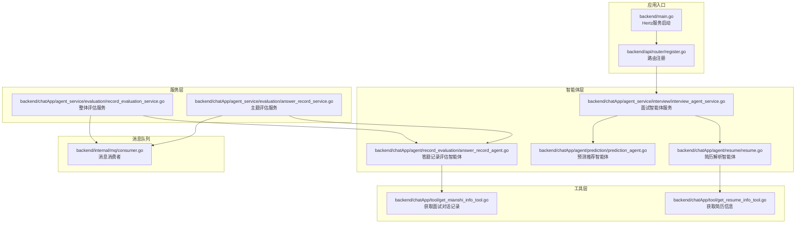
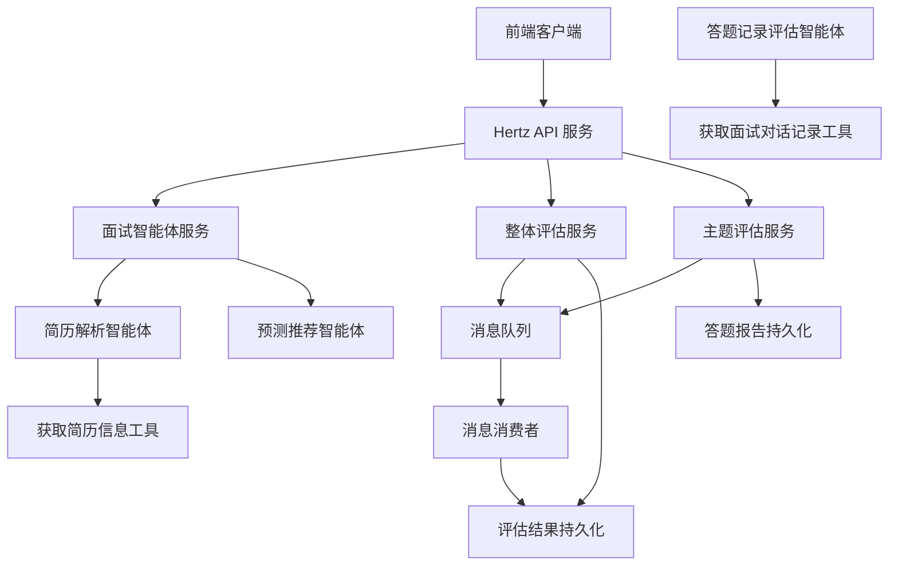
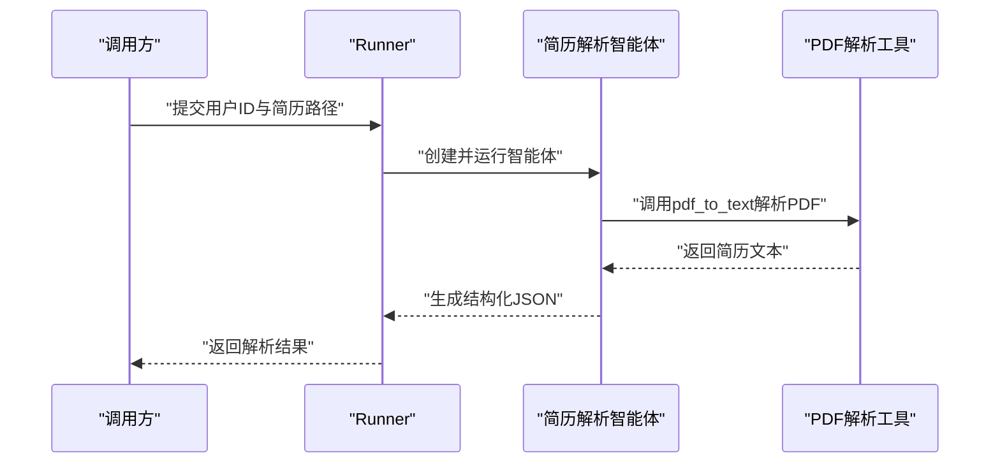
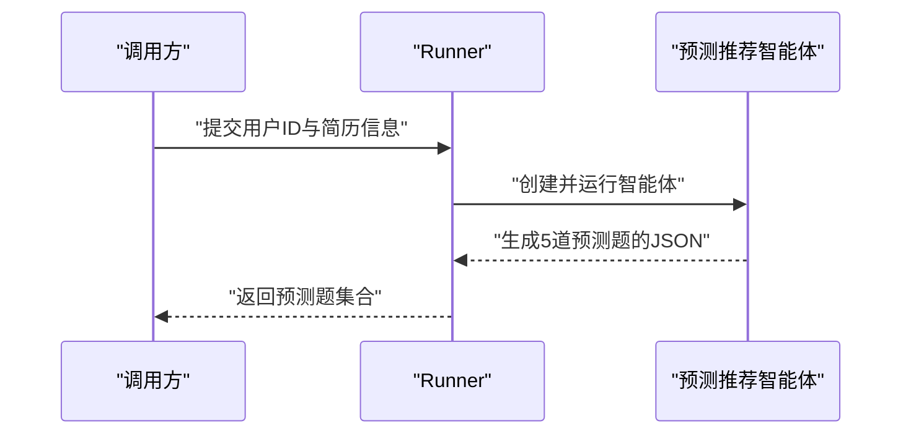
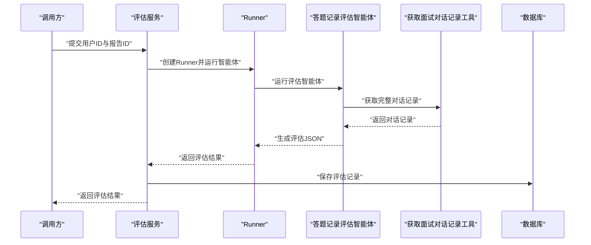
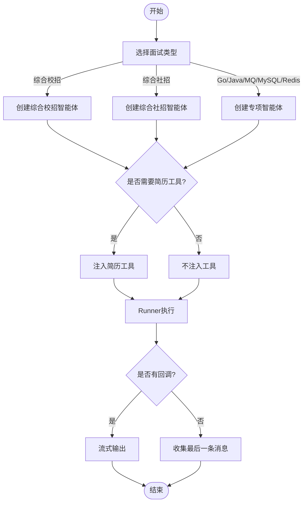
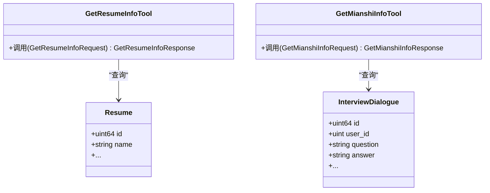
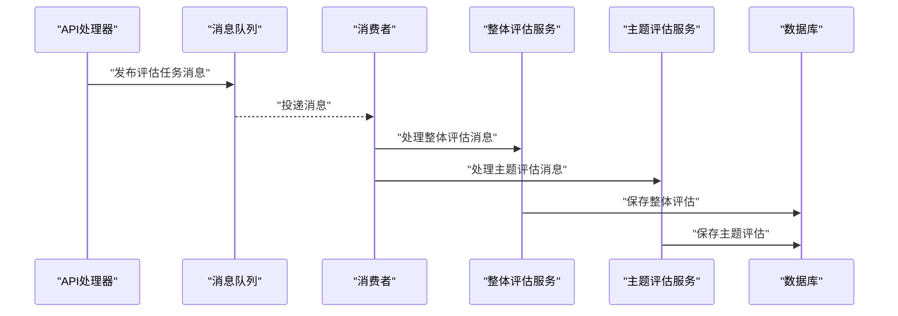
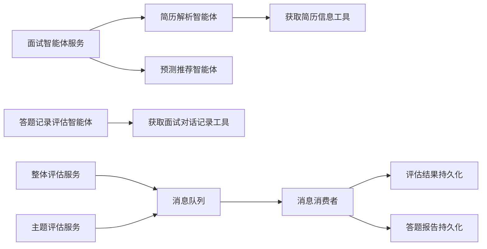

# AI智能体系统

<cite>
**本文档引用的文件**
- [backend/main.go](file://backend/main.go)
- [backend/api/router/register.go](file://backend/api/router/register.go)
- [backend/chatApp/main.go](file://backend/chatApp/main.go)
- [backend/chatApp/chat/openAi.go](file://backend/chatApp/chat/openAi.go)
- [backend/chatApp/agent/resume/resume.go](file://backend/chatApp/agent/resume/resume.go)
- [backend/chatApp/agent/prediction/prediction_agent.go](file://backend/chatApp/agent/prediction/prediction_agent.go)
- [backend/chatApp/agent/record_evaluation/answer_record_agent.go](file://backend/chatApp/agent/record_evaluation/answer_record_agent.go)
- [backend/chatApp/agent_service/interview/interview_agent_service.go](file://backend/chatApp/agent_service/interview/interview_agent_service.go)
- [backend/chatApp/agent_service/evaluation/record_evaluation_service.go](file://backend/chatApp/agent_service/evaluation/record_evaluation_service.go)
- [backend/chatApp/agent_service/evaluation/answer_record_service.go](file://backend/chatApp/agent_service/evaluation/answer_record_service.go)
- [backend/chatApp/agent/interview/specialized/go_agent.go](file://backend/chatApp/agent/interview/specialized/go_agent.go)
- [backend/chatApp/agent/interview/specialized/java_agent.go](file://backend/chatApp/agent/interview/specialized/java_agent.go)
- [backend/chatApp/tool/get_resume_info_tool.go](file://backend/chatApp/tool/get_resume_info_tool.go)
- [backend/chatApp/tool/get_mianshi_info_tool.go](file://backend/chatApp/tool/get_mianshi_info_tool.go)
- [backend/internal/mq/consumer.go](file://backend/internal/mq/consumer.go)
</cite>

## 目录
1. [简介](#简介)
2. [项目结构](#项目结构)
3. [核心组件](#核心组件)
4. [架构总览](#架构总览)
5. [详细组件分析](#详细组件分析)
6. [依赖关系分析](#依赖关系分析)
7. [性能考虑](#性能考虑)
8. [故障排查指南](#故障排查指南)
9. [结论](#结论)
10. [附录](#附录)

## 简介
本项目是一个基于多智能体架构的AI面试辅助系统，围绕“简历分析”“面试问题生成”“答题记录评估”“预测推荐”四大核心能力构建。系统通过统一的智能体框架（EINO）组织不同职能的智能体，借助工具（Tool）实现对外部数据与能力的访问，并通过消息队列实现异步评估与结果持久化。系统支持综合面试与专项面试两类面试场景，具备可扩展的智能体类型与工具体系，便于后续迭代与优化。

## 项目结构
后端采用模块化分层设计：
- 应用入口与路由：Hertz Web 服务负责接收外部请求，注册路由并转发至具体处理器。
- 智能体层：封装各类面试相关智能体（简历解析、预测推荐、答题评估等），统一通过Runner驱动执行。
- 工具层：提供简历信息、面试对话记录等工具，供智能体在推理过程中调用。
- 服务层：封装业务逻辑（如面试会话、评估生成、报告构建），协调智能体与数据存储。
- 消息队列：异步触发评估任务，解耦实时响应与耗时计算。
- 配置与中间件：加载配置、JWT鉴权、CORS、错误恢复等。

**图表来源**
- [backend/main.go](file://backend/main.go#L29-L173)
- [backend/api/router/register.go](file://backend/api/router/register.go#L11-L15)
- [backend/chatApp/agent/resume/resume.go](file://backend/chatApp/agent/resume/resume.go#L14-L108)
- [backend/chatApp/agent/prediction/prediction_agent.go](file://backend/chatApp/agent/prediction/prediction_agent.go#L25-L65)
- [backend/chatApp/agent/record_evaluation/answer_record_agent.go](file://backend/chatApp/agent/record_evaluation/answer_record_agent.go#L14-L40)
- [backend/chatApp/agent_service/interview/interview_agent_service.go](file://backend/chatApp/agent_service/interview/interview_agent_service.go#L42-L101)
- [backend/chatApp/agent_service/evaluation/record_evaluation_service.go](file://backend/chatApp/agent_service/evaluation/record_evaluation_service.go#L17-L108)
- [backend/chatApp/agent_service/evaluation/answer_record_service.go](file://backend/chatApp/agent_service/evaluation/answer_record_service.go#L16-L100)
- [backend/chatApp/tool/get_resume_info_tool.go](file://backend/chatApp/tool/get_resume_info_tool.go#L21-L47)
- [backend/chatApp/tool/get_mianshi_info_tool.go](file://backend/chatApp/tool/get_mianshi_info_tool.go#L23-L49)
- [backend/internal/mq/consumer.go](file://backend/internal/mq/consumer.go#L19-L87)

**章节来源**
- [backend/main.go](file://backend/main.go#L29-L173)
- [backend/api/router/register.go](file://backend/api/router/register.go#L11-L15)

## 核心组件
- 简历解析智能体：负责将PDF简历解析为结构化信息，提取基本信息、教育背景、工作经历、技术栈、项目经验、技能特长、证书资格等，并给出推荐难度与关注要点。
- 面试问题生成智能体：基于简历与岗位要求，生成5道高质量预测面试题，包含重点考察方向、思考路径、参考答案与可能追问。
- 答题记录评估智能体：对一次面试的完整对话记录进行主题级与整体级评估，输出评分、知识点掌握情况、优缺点、改进建议与参考答案。
- 面试智能体服务：统一路由不同面试场景（综合校招/社招、Go/Java/MQ/MySQL/Redis专项），按需注入简历工具，驱动Runner执行。
- 评估服务：封装整体评估与主题评估的生成流程，负责超时控制、JSON解析与数据库落库。
- 工具：简历信息工具与面试对话记录工具，为智能体提供结构化数据支撑。
- 消息队列：异步触发评估任务，避免阻塞主线程，提升用户体验与系统吞吐。

**章节来源**
- [backend/chatApp/agent/resume/resume.go](file://backend/chatApp/agent/resume/resume.go#L14-L108)
- [backend/chatApp/agent/prediction/prediction_agent.go](file://backend/chatApp/agent/prediction/prediction_agent.go#L25-L65)
- [backend/chatApp/agent/record_evaluation/answer_record_agent.go](file://backend/chatApp/agent/record_evaluation/answer_record_agent.go#L14-L40)
- [backend/chatApp/agent_service/interview/interview_agent_service.go](file://backend/chatApp/agent_service/interview/interview_agent_service.go#L30-L101)
- [backend/chatApp/agent_service/evaluation/record_evaluation_service.go](file://backend/chatApp/agent_service/evaluation/record_evaluation_service.go#L17-L108)
- [backend/chatApp/agent_service/evaluation/answer_record_service.go](file://backend/chatApp/agent_service/evaluation/answer_record_service.go#L16-L100)
- [backend/chatApp/tool/get_resume_info_tool.go](file://backend/chatApp/tool/get_resume_info_tool.go#L21-L47)
- [backend/chatApp/tool/get_mianshi_info_tool.go](file://backend/chatApp/tool/get_mianshi_info_tool.go#L23-L49)
- [backend/internal/mq/consumer.go](file://backend/internal/mq/consumer.go#L19-L87)

## 架构总览
系统采用“Web服务 + 智能体 + 工具 + 服务 + 消息队列”的分层架构。前端通过HTTP接口发起请求，后端路由将请求转交给对应处理器；处理器根据业务场景选择合适的智能体，智能体通过Runner执行并在必要时调用工具获取数据；评估类任务通过消息队列异步执行，完成后写入数据库并可被查询。

**图表来源**
- [backend/main.go](file://backend/main.go#L101-L128)
- [backend/chatApp/agent_service/interview/interview_agent_service.go](file://backend/chatApp/agent_service/interview/interview_agent_service.go#L75-L101)
- [backend/chatApp/agent/resume/resume.go](file://backend/chatApp/agent/resume/resume.go#L14-L108)
- [backend/chatApp/agent/prediction/prediction_agent.go](file://backend/chatApp/agent/prediction/prediction_agent.go#L25-L65)
- [backend/chatApp/agent/record_evaluation/answer_record_agent.go](file://backend/chatApp/agent/record_evaluation/answer_record_agent.go#L14-L40)
- [backend/chatApp/tool/get_resume_info_tool.go](file://backend/chatApp/tool/get_resume_info_tool.go#L21-L47)
- [backend/chatApp/tool/get_mianshi_info_tool.go](file://backend/chatApp/tool/get_mianshi_info_tool.go#L23-L49)
- [backend/chatApp/agent_service/evaluation/record_evaluation_service.go](file://backend/chatApp/agent_service/evaluation/record_evaluation_service.go#L17-L108)
- [backend/chatApp/agent_service/evaluation/answer_record_service.go](file://backend/chatApp/agent_service/evaluation/answer_record_service.go#L16-L100)
- [backend/internal/mq/consumer.go](file://backend/internal/mq/consumer.go#L19-L87)

## 详细组件分析

### 简历解析智能体
- 职责：解析PDF简历，抽取结构化信息并给出面试建议。
- 关键点：强制使用PDF解析工具；严格JSON输出格式；包含基本信息、教育背景、工作经历、技术栈、项目经验、技能特长、证书资格、核心优势与推荐难度等字段。
- 工具集成：通过工具节点注入PDF解析工具，确保数据来源可靠。
- 执行方式：Runner驱动，限制最大迭代次数，保证稳定性。

**图表来源**
- [backend/chatApp/agent/resume/resume.go](file://backend/chatApp/agent/resume/resume.go#L14-L108)
- [backend/chatApp/chat/openAi.go](file://backend/chatApp/chat/openAi.go#L19-L109)

**章节来源**
- [backend/chatApp/agent/resume/resume.go](file://backend/chatApp/agent/resume/resume.go#L14-L108)
- [backend/chatApp/chat/openAi.go](file://backend/chatApp/chat/openAi.go#L19-L109)

### 预测推荐智能体
- 职责：根据简历与岗位要求生成5道预测面试题，包含重点考察方向、思考路径、参考答案与可能追问。
- 关键点：严格JSON输出；固定5道题目；结合简历中的项目与技能点。
- 执行方式：Runner驱动，无工具依赖，纯推理生成。

**图表来源**
- [backend/chatApp/agent/prediction/prediction_agent.go](file://backend/chatApp/agent/prediction/prediction_agent.go#L25-L65)

**章节来源**
- [backend/chatApp/agent/prediction/prediction_agent.go](file://backend/chatApp/agent/prediction/prediction_agent.go#L25-L65)

### 答题记录评估智能体
- 职责：对一次面试的完整对话记录进行主题级与整体级评估，输出评分、优缺点、改进建议与参考答案。
- 关键点：通过工具获取完整对话记录；支持超时控制；解析智能体返回的JSON，兼容非标准格式；持久化评估结果。
- 执行方式：Runner驱动，注入面试对话记录工具。

**图表来源**
- [backend/chatApp/agent/record_evaluation/answer_record_agent.go](file://backend/chatApp/agent/record_evaluation/answer_record_agent.go#L14-L40)
- [backend/chatApp/agent_service/evaluation/record_evaluation_service.go](file://backend/chatApp/agent_service/evaluation/record_evaluation_service.go#L17-L108)
- [backend/chatApp/tool/get_mianshi_info_tool.go](file://backend/chatApp/tool/get_mianshi_info_tool.go#L23-L49)

**章节来源**
- [backend/chatApp/agent/record_evaluation/answer_record_agent.go](file://backend/chatApp/agent/record_evaluation/answer_record_agent.go#L14-L40)
- [backend/chatApp/agent_service/evaluation/record_evaluation_service.go](file://backend/chatApp/agent_service/evaluation/record_evaluation_service.go#L17-L108)
- [backend/chatApp/tool/get_mianshi_info_tool.go](file://backend/chatApp/tool/get_mianshi_info_tool.go#L23-L49)

### 面试智能体服务
- 职责：根据面试类型（综合/专项）与是否需要简历工具，动态选择并创建对应智能体；提供回调式流式输出能力。
- 类型：综合面试（校招/社招）、专项面试（Go/Java/MQ/MySQL/Redis）。
- 执行方式：Runner驱动，支持流式回调输出。

**图表来源**
- [backend/chatApp/agent_service/interview/interview_agent_service.go](file://backend/chatApp/agent_service/interview/interview_agent_service.go#L42-L101)
- [backend/chatApp/agent/interview/specialized/go_agent.go](file://backend/chatApp/agent/interview/specialized/go_agent.go#L14-L47)
- [backend/chatApp/agent/interview/specialized/java_agent.go](file://backend/chatApp/agent/interview/specialized/java_agent.go#L14-L47)

**章节来源**
- [backend/chatApp/agent_service/interview/interview_agent_service.go](file://backend/chatApp/agent_service/interview/interview_agent_service.go#L30-L101)
- [backend/chatApp/agent/interview/specialized/go_agent.go](file://backend/chatApp/agent/interview/specialized/go_agent.go#L14-L47)
- [backend/chatApp/agent/interview/specialized/java_agent.go](file://backend/chatApp/agent/interview/specialized/java_agent.go#L14-L47)

### 工具与数据访问
- 获取简历信息工具：根据简历ID查询已解析的简历内容，供智能体在推理中使用。
- 获取面试对话记录工具：根据用户ID与报告ID查询完整对话记录，供评估智能体分析。

**图表来源**
- [backend/chatApp/tool/get_resume_info_tool.go](file://backend/chatApp/tool/get_resume_info_tool.go#L21-L47)
- [backend/chatApp/tool/get_mianshi_info_tool.go](file://backend/chatApp/tool/get_mianshi_info_tool.go#L23-L49)

**章节来源**
- [backend/chatApp/tool/get_resume_info_tool.go](file://backend/chatApp/tool/get_resume_info_tool.go#L21-L47)
- [backend/chatApp/tool/get_mianshi_info_tool.go](file://backend/chatApp/tool/get_mianshi_info_tool.go#L23-L49)

### 评估服务与消息队列
- 整体评估服务：对答题记录进行整体评估，设置超时（120秒），解析智能体返回的JSON，保存到数据库。
- 主题评估服务：对答题记录的主题级评估，设置超时（300秒），解析并转换为内部模型，保存到数据库。
- 消息队列：消费者根据消息类型分别触发整体评估与主题评估，解耦实时响应与耗时计算。

**图表来源**
- [backend/chatApp/agent_service/evaluation/record_evaluation_service.go](file://backend/chatApp/agent_service/evaluation/record_evaluation_service.go#L17-L108)
- [backend/chatApp/agent_service/evaluation/answer_record_service.go](file://backend/chatApp/agent_service/evaluation/answer_record_service.go#L16-L100)
- [backend/internal/mq/consumer.go](file://backend/internal/mq/consumer.go#L19-L87)

**章节来源**
- [backend/chatApp/agent_service/evaluation/record_evaluation_service.go](file://backend/chatApp/agent_service/evaluation/record_evaluation_service.go#L17-L108)
- [backend/chatApp/agent_service/evaluation/answer_record_service.go](file://backend/chatApp/agent_service/evaluation/answer_record_service.go#L16-L100)
- [backend/internal/mq/consumer.go](file://backend/internal/mq/consumer.go#L19-L87)

## 依赖关系分析
- 组件内聚：智能体与工具分离，服务层负责编排与持久化，消息队列负责异步解耦。
- 组件耦合：智能体依赖工具与Runner；服务层依赖DAO与模型；消息队列依赖服务层的评估生成函数。
- 外部依赖：OpenAI兼容模型SDK、Hertz Web框架、Redis消息队列、数据库与模型DAO。

**图表来源**
- [backend/chatApp/agent_service/interview/interview_agent_service.go](file://backend/chatApp/agent_service/interview/interview_agent_service.go#L42-L101)
- [backend/chatApp/agent/resume/resume.go](file://backend/chatApp/agent/resume/resume.go#L14-L108)
- [backend/chatApp/agent/prediction/prediction_agent.go](file://backend/chatApp/agent/prediction/prediction_agent.go#L25-L65)
- [backend/chatApp/agent/record_evaluation/answer_record_agent.go](file://backend/chatApp/agent/record_evaluation/answer_record_agent.go#L14-L40)
- [backend/chatApp/tool/get_resume_info_tool.go](file://backend/chatApp/tool/get_resume_info_tool.go#L21-L47)
- [backend/chatApp/tool/get_mianshi_info_tool.go](file://backend/chatApp/tool/get_mianshi_info_tool.go#L23-L49)
- [backend/chatApp/agent_service/evaluation/record_evaluation_service.go](file://backend/chatApp/agent_service/evaluation/record_evaluation_service.go#L17-L108)
- [backend/chatApp/agent_service/evaluation/answer_record_service.go](file://backend/chatApp/agent_service/evaluation/answer_record_service.go#L16-L100)
- [backend/internal/mq/consumer.go](file://backend/internal/mq/consumer.go#L19-L87)

**章节来源**
- [backend/chatApp/agent_service/interview/interview_agent_service.go](file://backend/chatApp/agent_service/interview/interview_agent_service.go#L42-L101)
- [backend/chatApp/agent/resume/resume.go](file://backend/chatApp/agent/resume/resume.go#L14-L108)
- [backend/chatApp/agent/prediction/prediction_agent.go](file://backend/chatApp/agent/prediction/prediction_agent.go#L25-L65)
- [backend/chatApp/agent/record_evaluation/answer_record_agent.go](file://backend/chatApp/agent/record_evaluation/answer_record_agent.go#L14-L40)
- [backend/chatApp/tool/get_resume_info_tool.go](file://backend/chatApp/tool/get_resume_info_tool.go#L21-L47)
- [backend/chatApp/tool/get_mianshi_info_tool.go](file://backend/chatApp/tool/get_mianshi_info_tool.go#L23-L49)
- [backend/chatApp/agent_service/evaluation/record_evaluation_service.go](file://backend/chatApp/agent_service/evaluation/record_evaluation_service.go#L17-L108)
- [backend/chatApp/agent_service/evaluation/answer_record_service.go](file://backend/chatApp/agent_service/evaluation/answer_record_service.go#L16-L100)
- [backend/internal/mq/consumer.go](file://backend/internal/mq/consumer.go#L19-L87)

## 性能考虑
- 超时控制：整体评估（120秒）、主题评估（300秒），避免长时间占用资源。
- Runner迭代限制：简历解析与专项面试智能体设置最大迭代次数，降低长链路风险。
- HTTP客户端优化：禁用KeepAlive、设置TLS握手与响应头超时，避免连接复用导致的EOF与HTTP/2问题。
- 异步评估：通过消息队列解耦实时响应与耗时计算，提升吞吐与稳定性。
- 工具调用：仅在必要时注入工具，减少不必要的外部查询。

**章节来源**
- [backend/chatApp/agent_service/evaluation/record_evaluation_service.go](file://backend/chatApp/agent_service/evaluation/record_evaluation_service.go#L17-L108)
- [backend/chatApp/agent_service/evaluation/answer_record_service.go](file://backend/chatApp/agent_service/evaluation/answer_record_service.go#L16-L100)
- [backend/chatApp/agent/resume/resume.go](file://backend/chatApp/agent/resume/resume.go#L102-L108)
- [backend/chatApp/agent/interview/specialized/go_agent.go](file://backend/chatApp/agent/interview/specialized/go_agent.go#L39-L42)
- [backend/chatApp/chat/openAi.go](file://backend/chatApp/chat/openAi.go#L64-L75)

## 故障排查指南
- API Key异常：检查用户默认模型配置与加密API Key解密逻辑，确保Key长度与格式合法。
- 模型调用错误：根据错误类型区分配额不足、速率限制、上下文超限等，针对性调整输入长度或重试策略。
- 工具调用失败：检查DAO查询逻辑与参数类型（如用户ID、报告ID），确保payload类型转换正确。
- 评估超时：适当延长超时阈值或优化智能体提示词，减少无效迭代。
- 消息队列异常：确认订阅回调与消息类型匹配，检查消费者日志定位失败原因。

**章节来源**
- [backend/chatApp/chat/openAi.go](file://backend/chatApp/chat/openAi.go#L19-L109)
- [backend/chatApp/tool/get_resume_info_tool.go](file://backend/chatApp/tool/get_resume_info_tool.go#L21-L47)
- [backend/chatApp/tool/get_mianshi_info_tool.go](file://backend/chatApp/tool/get_mianshi_info_tool.go#L23-L49)
- [backend/internal/mq/consumer.go](file://backend/internal/mq/consumer.go#L19-L87)

## 结论
本系统通过多智能体与工具化架构实现了简历解析、面试问题生成、答题记录评估与预测推荐的闭环能力。统一的Runner与工具体系提升了可维护性与扩展性；消息队列与超时控制保障了性能与稳定性。未来可在智能体类型扩展、提示词工程、评估指标体系与模型更新机制方面持续优化。

## 附录
- 开发与调试入口：后端主程序负责启动Hertz服务与消息消费者；聊天应用主程序用于本地交互测试与模型调试。
- 配置加载：支持.env与config.yaml，环境变量展开与配置校验。
- 中间件：全局CORS、JWT鉴权、错误恢复中间件贯穿请求生命周期。

**章节来源**
- [backend/main.go](file://backend/main.go#L29-L173)
- [backend/chatApp/main.go](file://backend/chatApp/main.go#L25-L123)