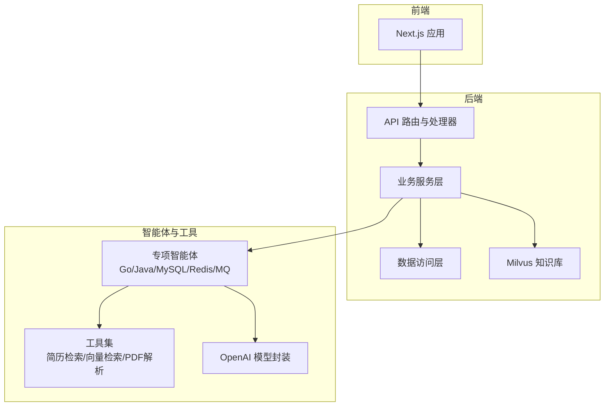
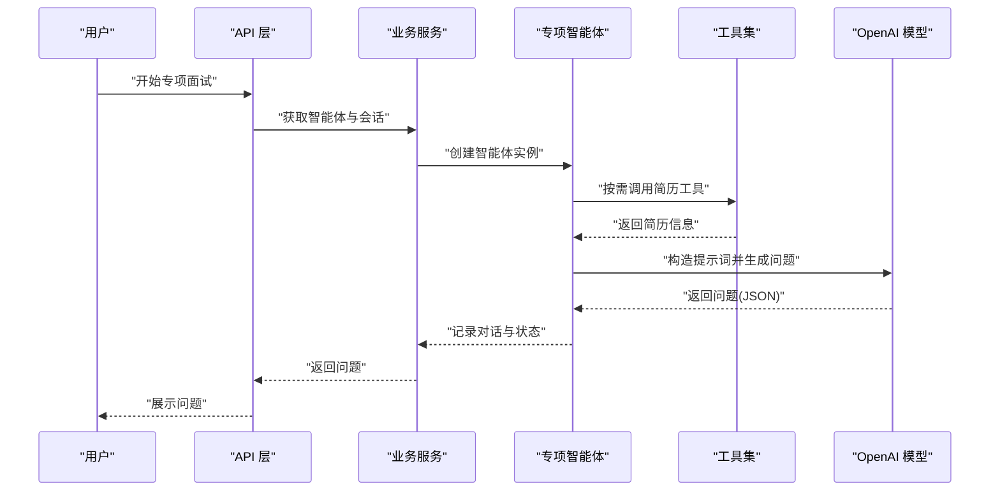
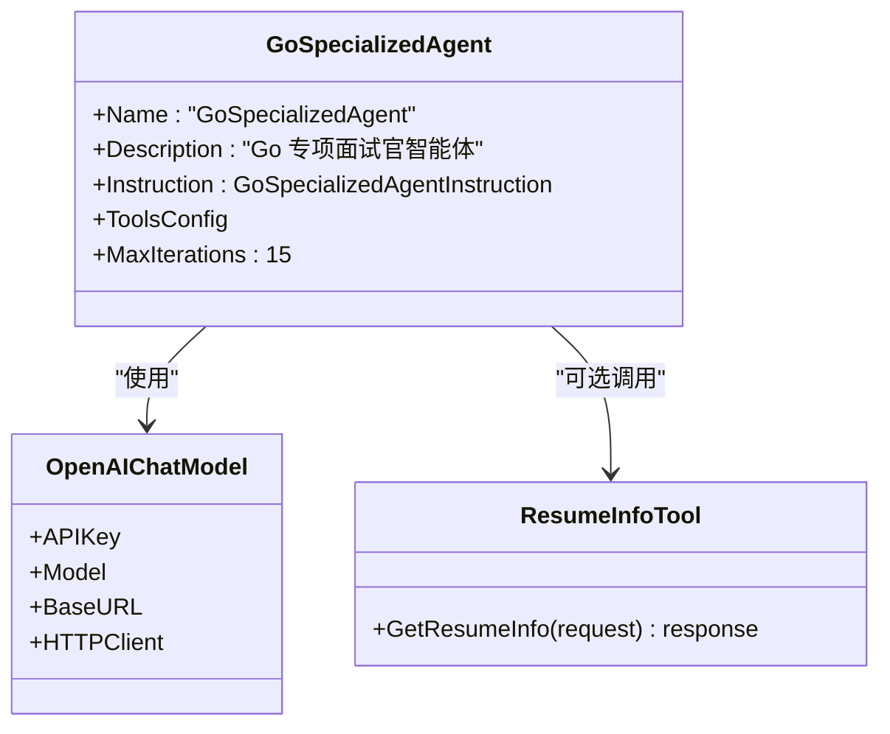
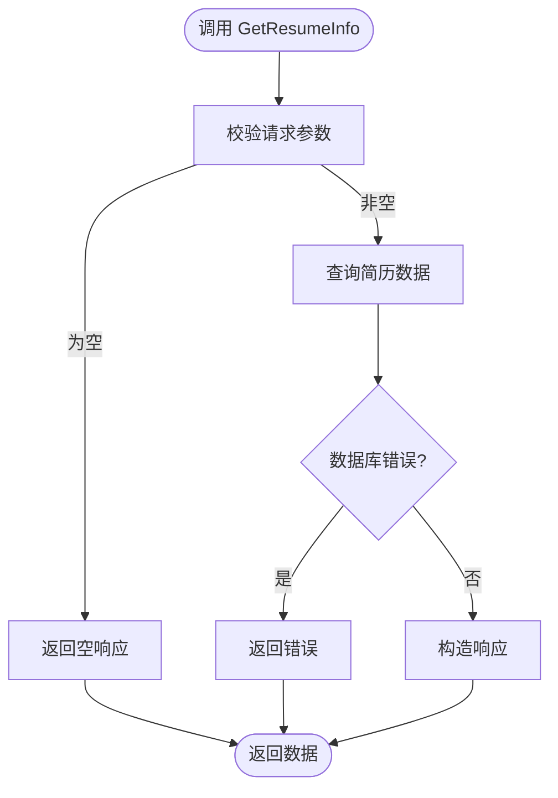
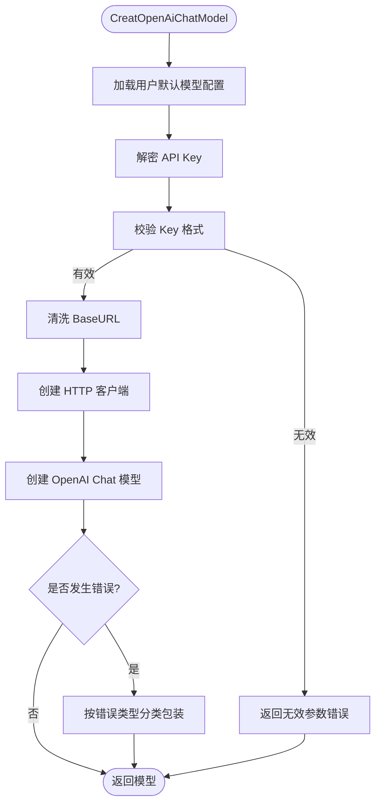
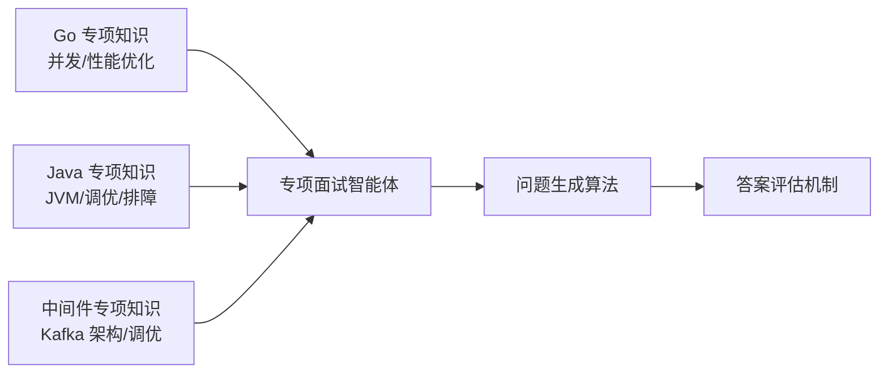
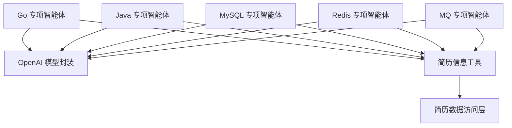

# 专项面试智能体

<cite>
**本文引用的文件**
- [backend/chatApp/main.go](file://backend/chatApp/main.go)
- [backend/chatApp/agent/interview/specialized/constants.go](file://backend/chatApp/agent/interview/specialized/constants.go)
- [backend/chatApp/agent/interview/specialized/go_agent.go](file://backend/chatApp/agent/interview/specialized/go_agent.go)
- [backend/chatApp/agent/interview/specialized/java_agent.go](file://backend/chatApp/agent/interview/specialized/java_agent.go)
- [backend/chatApp/agent/interview/specialized/mysql_agent.go](file://backend/chatApp/agent/interview/specialized/mysql_agent.go)
- [backend/chatApp/agent/interview/specialized/redis_agent.go](file://backend/chatApp/agent/interview/specialized/redis_agent.go)
- [backend/chatApp/agent/interview/specialized/mq_agent.go](file://backend/chatApp/agent/interview/specialized/mq_agent.go)
- [backend/chatApp/tool/get_resume_info_tool.go](file://backend/chatApp/tool/get_resume_info_tool.go)
- [backend/chatApp/chat/openAi.go](file://backend/chatApp/chat/openAi.go)
- [backend/internal/eino/milvus/data/go专项/advanced-concurrency.md](file://backend/internal/eino/milvus/data/go专项/advanced-concurrency.md)
- [backend/internal/eino/milvus/data/java专项/jvm-tuning.md](file://backend/internal/eino/milvus/data/java专项/jvm-tuning.md)
- [backend/internal/eino/milvus/data/中间件专项/kafka-deep-dive.md](file://backend/internal/eino/milvus/data/中间件专项/kafka-deep-dive.md)
</cite>

## 目录
1. [简介](#简介)
2. [项目结构](#项目结构)
3. [核心组件](#核心组件)
4. [架构总览](#架构总览)
5. [详细组件分析](#详细组件分析)
6. [依赖分析](#依赖分析)
7. [性能考量](#性能考量)
8. [故障排查指南](#故障排查指南)
9. [结论](#结论)
10. [附录](#附录)

## 简介
本项目围绕“专项面试智能体”展开，面向 Go、Java、MySQL、Redis、MQ 等技术栈，提供可插拔的智能体实现与统一的面试流程。每个专项智能体均采用统一的提示词指令、工具集成与对话控制策略，支持简历信息检索、问题生成、答案记录与评估闭环。同时，系统内置领域知识库（Markdown 文档），用于支撑专项知识点覆盖与难度梯度设计。

## 项目结构
后端采用模块化组织方式，关键目录与职责如下：
- chatApp：智能体与工具层，包含各类专项智能体、OpenAI 模型封装、简历工具等
- internal/eino/milvus/data：专项知识库（Markdown），涵盖 Go 并发、Java JVM、Kafka 等
- api/router、api/handler：对外接口与路由
- internal/service、internal/repository：业务服务与数据访问层
- mcp-moduel、mcpserver：MCP 协议与工具服务（可选扩展）

**图表来源**
- [backend/chatApp/agent/interview/specialized/go_agent.go](file://backend/chatApp/agent/interview/specialized/go_agent.go#L14-L47)
- [backend/chatApp/tool/get_resume_info_tool.go](file://backend/chatApp/tool/get_resume_info_tool.go#L21-L34)
- [backend/chatApp/chat/openAi.go](file://backend/chatApp/chat/openAi.go#L19-L109)

**章节来源**
- [backend/chatApp/main.go](file://backend/chatApp/main.go#L25-L123)

## 核心组件
- 专项智能体工厂：为 Go、Java、MySQL、Redis、MQ 分别提供智能体实例，支持可选的简历工具注入
- 提示词指令：每类专项智能体内置专用提示词，明确职责、约束、策略与输出格式
- 工具集成：简历信息检索工具，支持在面试过程中按需调用
- 模型封装：OpenAI 模型创建与错误分类，支持密钥解密、URL 清洗、超时与传输优化
- 领域知识库：Markdown 形式的专项知识，作为面试知识点覆盖与难度梯度的基础

**章节来源**
- [backend/chatApp/agent/interview/specialized/constants.go](file://backend/chatApp/agent/interview/specialized/constants.go#L3-L50)
- [backend/chatApp/agent/interview/specialized/constants.go](file://backend/chatApp/agent/interview/specialized/constants.go#L52-L99)
- [backend/chatApp/agent/interview/specialized/constants.go](file://backend/chatApp/agent/interview/specialized/constants.go#L101-L148)
- [backend/chatApp/agent/interview/specialized/constants.go](file://backend/chatApp/agent/interview/specialized/constants.go#L150-L197)
- [backend/chatApp/agent/interview/specialized/constants.go](file://backend/chatApp/agent/interview/specialized/constants.go#L199-L246)
- [backend/chatApp/agent/interview/specialized/go_agent.go](file://backend/chatApp/agent/interview/specialized/go_agent.go#L14-L47)
- [backend/chatApp/agent/interview/specialized/java_agent.go](file://backend/chatApp/agent/interview/specialized/java_agent.go#L14-L47)
- [backend/chatApp/agent/interview/specialized/mysql_agent.go](file://backend/chatApp/agent/interview/specialized/mysql_agent.go#L14-L47)
- [backend/chatApp/agent/interview/specialized/redis_agent.go](file://backend/chatApp/agent/interview/specialized/redis_agent.go#L14-L47)
- [backend/chatApp/agent/interview/specialized/mq_agent.go](file://backend/chatApp/agent/interview/specialized/mq_agent.go#L14-L47)
- [backend/chatApp/tool/get_resume_info_tool.go](file://backend/chatApp/tool/get_resume_info_tool.go#L21-L34)
- [backend/chatApp/chat/openAi.go](file://backend/chatApp/chat/openAi.go#L19-L109)

## 架构总览
专项面试智能体的整体工作流包括：用户发起面试 → 选择技术栈 → 智能体加载提示词与工具 → 生成问题 → 记录对话与答案 → 评估与反馈。模型封装负责统一接入外部大模型，工具层提供简历检索等辅助能力。

**图表来源**
- [backend/chatApp/agent/interview/specialized/go_agent.go](file://backend/chatApp/agent/interview/specialized/go_agent.go#L14-L47)
- [backend/chatApp/tool/get_resume_info_tool.go](file://backend/chatApp/tool/get_resume_info_tool.go#L21-L34)
- [backend/chatApp/chat/openAi.go](file://backend/chatApp/chat/openAi.go#L19-L109)

## 详细组件分析

### Go 专项智能体
- 设计要点
  - 专用提示词强调并发、性能、系统设计与工程实践
  - 支持可选简历工具，便于从候选项目经验切入
  - 统一最大迭代次数，保障对话节奏
- 实现路径
  - 智能体创建：[NewGoSpecializedAgent](file://backend/chatApp/agent/interview/specialized/go_agent.go#L14-L47)
  - 提示词定义：[GoSpecializedAgentInstruction](file://backend/chatApp/agent/interview/specialized/constants.go#L3-L50)
  - 模型封装：[CreatOpenAiChatModel](file://backend/chatApp/chat/openAi.go#L19-L109)
  - 简历工具：[GetResumeInfoTool](file://backend/chatApp/tool/get_resume_info_tool.go#L37-L47)

**图表来源**
- [backend/chatApp/agent/interview/specialized/go_agent.go](file://backend/chatApp/agent/interview/specialized/go_agent.go#L14-L47)
- [backend/chatApp/chat/openAi.go](file://backend/chatApp/chat/openAi.go#L19-L109)
- [backend/chatApp/tool/get_resume_info_tool.go](file://backend/chatApp/tool/get_resume_info_tool.go#L21-L34)

**章节来源**
- [backend/chatApp/agent/interview/specialized/go_agent.go](file://backend/chatApp/agent/interview/specialized/go_agent.go#L14-L47)
- [backend/chatApp/agent/interview/specialized/constants.go](file://backend/chatApp/agent/interview/specialized/constants.go#L3-L50)
- [backend/chatApp/chat/openAi.go](file://backend/chatApp/chat/openAi.go#L19-L109)
- [backend/chatApp/tool/get_resume_info_tool.go](file://backend/chatApp/tool/get_resume_info_tool.go#L21-L34)

### Java 专项智能体
- 设计要点
  - 专注 JVM、多线程、集合框架、框架源码与性能优化
  - 通过简历工具引导深入项目经验
- 实现路径
  - 智能体创建：[NewJavaSpecializedAgent](file://backend/chatApp/agent/interview/specialized/java_agent.go#L14-L47)
  - 提示词定义：[JavaSpecializedAgentInstruction](file://backend/chatApp/agent/interview/specialized/constants.go#L52-L99)

**章节来源**
- [backend/chatApp/agent/interview/specialized/java_agent.go](file://backend/chatApp/agent/interview/specialized/java_agent.go#L14-L47)
- [backend/chatApp/agent/interview/specialized/constants.go](file://backend/chatApp/agent/interview/specialized/constants.go#L52-L99)

### MySQL 专项智能体
- 设计要点
  - 聚焦索引、事务、查询优化与高可用方案
  - 通过简历工具了解候选人在数据库领域的实战
- 实现路径
  - 智能体创建：[NewMySQLSpecializedAgent](file://backend/chatApp/agent/interview/specialized/mysql_agent.go#L14-L47)
  - 提示词定义：[MySQLSpecializedAgentInstruction](file://backend/chatApp/agent/interview/specialized/constants.go#L150-L197)

**章节来源**
- [backend/chatApp/agent/interview/specialized/mysql_agent.go](file://backend/chatApp/agent/interview/specialized/mysql_agent.go#L14-L47)
- [backend/chatApp/agent/interview/specialized/constants.go](file://backend/chatApp/agent/interview/specialized/constants.go#L150-L197)

### Redis 专项智能体
- 设计要点
  - 关注数据结构、缓存策略、持久化与高可用
- 实现路径
  - 智能体创建：[NewRedisSpecializedAgent](file://backend/chatApp/agent/interview/specialized/redis_agent.go#L14-L47)
  - 提示词定义：[RedisSpecializedAgentInstruction](file://backend/chatApp/agent/interview/specialized/constants.go#L199-L246)

**章节来源**
- [backend/chatApp/agent/interview/specialized/redis_agent.go](file://backend/chatApp/agent/interview/specialized/redis_agent.go#L14-L47)
- [backend/chatApp/agent/interview/specialized/constants.go](file://backend/chatApp/agent/interview/specialized/constants.go#L199-L246)

### MQ 专项智能体
- 设计要点
  - 强调一致性、可靠性、性能与高可用设计
- 实现路径
  - 智能体创建：[NewMQSpecializedAgent](file://backend/chatApp/agent/interview/specialized/mq_agent.go#L14-L47)
  - 提示词定义：[MQSpecializedAgentInstruction](file://backend/chatApp/agent/interview/specialized/constants.go#L101-L148)

**章节来源**
- [backend/chatApp/agent/interview/specialized/mq_agent.go](file://backend/chatApp/agent/interview/specialized/mq_agent.go#L14-L47)
- [backend/chatApp/agent/interview/specialized/constants.go](file://backend/chatApp/agent/interview/specialized/constants.go#L101-L148)

### 简历信息检索工具
- 功能：按简历 ID 查询解析后的简历内容，供智能体在面试中引用
- 接口：请求体包含简历 ID，响应体包含简历数据
- 错误处理：数据库查询失败时返回错误

**图表来源**
- [backend/chatApp/tool/get_resume_info_tool.go](file://backend/chatApp/tool/get_resume_info_tool.go#L21-L34)

**章节来源**
- [backend/chatApp/tool/get_resume_info_tool.go](file://backend/chatApp/tool/get_resume_info_tool.go#L21-L34)

### OpenAI 模型封装
- 能力：根据用户默认模型配置创建 Chat 模型，支持密钥解密、URL 清洗、传输优化与错误分类
- 错误分类：配额不足、速率限制、上下文长度超限等
- 传输优化：禁用 KeepAlive、TLS 超时、HTTP/1.1 强制、响应头超时

**图表来源**
- [backend/chatApp/chat/openAi.go](file://backend/chatApp/chat/openAi.go#L19-L109)

**章节来源**
- [backend/chatApp/chat/openAi.go](file://backend/chatApp/chat/openAi.go#L19-L109)

### 领域知识库与难度梯度
- Go 专项：并发模型、调度器、Channel 模式、sync 原子操作、内存模型与性能优化
- Java 专项：JVM 内存结构、GC 算法、日志分析、性能问题定位与调优步骤
- 中间件专项：Kafka 架构、存储机制、副本与高可用、生产/消费模式与性能调优

**图表来源**
- [backend/internal/eino/milvus/data/go专项/advanced-concurrency.md](file://backend/internal/eino/milvus/data/go专项/advanced-concurrency.md#L1-L71)
- [backend/internal/eino/milvus/data/java专项/jvm-tuning.md](file://backend/internal/eino/milvus/data/java专项/jvm-tuning.md#L1-L63)
- [backend/internal/eino/milvus/data/中间件专项/kafka-deep-dive.md](file://backend/internal/eino/milvus/data/中间件专项/kafka-deep-dive.md#L1-L60)

**章节来源**
- [backend/internal/eino/milvus/data/go专项/advanced-concurrency.md](file://backend/internal/eino/milvus/data/go专项/advanced-concurrency.md#L1-L71)
- [backend/internal/eino/milvus/data/java专项/jvm-tuning.md](file://backend/internal/eino/milvus/data/java专项/jvm-tuning.md#L1-L63)
- [backend/internal/eino/milvus/data/中间件专项/kafka-deep-dive.md](file://backend/internal/eino/milvus/data/中间件专项/kafka-deep-dive.md#L1-L60)

## 依赖分析
- 智能体对工具与模型的依赖：各专项智能体依赖 OpenAI 模型封装与可选的简历工具
- 工具对数据层的依赖：简历工具依赖简历数据访问层
- 模型封装对配置与安全的依赖：依赖用户模型配置与密钥解密

**图表来源**
- [backend/chatApp/agent/interview/specialized/go_agent.go](file://backend/chatApp/agent/interview/specialized/go_agent.go#L14-L47)
- [backend/chatApp/agent/interview/specialized/java_agent.go](file://backend/chatApp/agent/interview/specialized/java_agent.go#L14-L47)
- [backend/chatApp/agent/interview/specialized/mysql_agent.go](file://backend/chatApp/agent/interview/specialized/mysql_agent.go#L14-L47)
- [backend/chatApp/agent/interview/specialized/redis_agent.go](file://backend/chatApp/agent/interview/specialized/redis_agent.go#L14-L47)
- [backend/chatApp/agent/interview/specialized/mq_agent.go](file://backend/chatApp/agent/interview/specialized/mq_agent.go#L14-L47)
- [backend/chatApp/tool/get_resume_info_tool.go](file://backend/chatApp/tool/get_resume_info_tool.go#L21-L34)
- [backend/chatApp/chat/openAi.go](file://backend/chatApp/chat/openAi.go#L19-L109)

**章节来源**
- [backend/chatApp/agent/interview/specialized/go_agent.go](file://backend/chatApp/agent/interview/specialized/go_agent.go#L14-L47)
- [backend/chatApp/agent/interview/specialized/java_agent.go](file://backend/chatApp/agent/interview/specialized/java_agent.go#L14-L47)
- [backend/chatApp/agent/interview/specialized/mysql_agent.go](file://backend/chatApp/agent/interview/specialized/mysql_agent.go#L14-L47)
- [backend/chatApp/agent/interview/specialized/redis_agent.go](file://backend/chatApp/agent/interview/specialized/redis_agent.go#L14-L47)
- [backend/chatApp/agent/interview/specialized/mq_agent.go](file://backend/chatApp/agent/interview/specialized/mq_agent.go#L14-L47)
- [backend/chatApp/tool/get_resume_info_tool.go](file://backend/chatApp/tool/get_resume_info_tool.go#L21-L34)
- [backend/chatApp/chat/openAi.go](file://backend/chatApp/chat/openAi.go#L19-L109)

## 性能考量
- 模型调用优化
  - 禁用 KeepAlive，避免空闲连接 EOF
  - 强制 HTTP/1.1，规避 HTTP/2 框架错误
  - 设置 TLS 握手与响应头超时，提升稳定性
- 上下文与传输
  - 清洗 BaseURL，去除多余后缀，避免重复拼接
  - 记录请求与响应状态，便于调试与监控
- 错误分类与降级
  - 对配额不足、速率限制、上下文超限等进行分类处理，指导用户调整
- 简历工具
  - 查询失败时快速返回错误，避免阻塞对话流程

**章节来源**
- [backend/chatApp/chat/openAi.go](file://backend/chatApp/chat/openAi.go#L64-L109)

## 故障排查指南
- API Key 无效或默认值
  - 现象：创建模型失败并返回无效参数错误
  - 处理：更新用户设置中的 API Key
- 配额不足或配额耗尽
  - 现象：返回配额不足或令牌不足错误
  - 处理：检查账户余额与配额使用情况
- 速率限制
  - 现象：返回速率限制错误
  - 处理：稍后重试或调整调用频率
- 上下文长度超限
  - 现象：返回上下文长度超限错误
  - 处理：缩短输入或优化提示词
- 简历查询异常
  - 现象：工具调用返回数据库错误
  - 处理：检查简历 ID 与数据库连通性

**章节来源**
- [backend/chatApp/chat/openAi.go](file://backend/chatApp/chat/openAi.go#L84-L106)
- [backend/chatApp/tool/get_resume_info_tool.go](file://backend/chatApp/tool/get_resume_info_tool.go#L27-L30)

## 结论
专项面试智能体通过统一的智能体工厂、提示词指令与工具集成，实现了对 Go、Java、MySQL、Redis、MQ 等技术栈的标准化面试流程。结合领域知识库与模型封装的错误分类与性能优化，系统在易用性、稳定性与可扩展性方面具备良好基础。后续可在以下方向持续演进：
- 扩展更多技术栈与专项主题
- 引入向量检索与知识增强，提升问题生成的智能化水平
- 完善评估指标与反馈闭环，形成可量化的面试质量度量

## 附录
- 提示词设计要点
  - 明确职责与约束，限定不涉及编码的纯讨论式面试
  - 设计递进式问题方向，覆盖核心特性与工程实践
  - 统一输出格式，便于系统解析与记录
- 对话策略
  - 从候选项目经验入手，逐步深入技术细节
  - 根据回答灵活调整难度与方向，鼓励分享决策与权衡
- 评估标准
  - 知识深度：对核心概念与原理的理解
  - 实战经验：项目案例、问题定位与解决思路
  - 最佳实践：性能优化、可靠性与可扩展性设计
- 性能优化与缓存策略
  - 模型侧：禁用 KeepAlive、HTTP/1.1 强制、超时控制
  - 工具侧：快速失败与错误分类，避免阻塞对话
- 扩展开发指南
  - 新增技术栈：新增智能体文件与提示词常量，复用现有模型封装与工具
  - 新增工具：遵循工具接口规范，确保输入输出结构清晰
  - 知识库扩展：补充 Markdown 文档，完善知识点覆盖与难度梯度