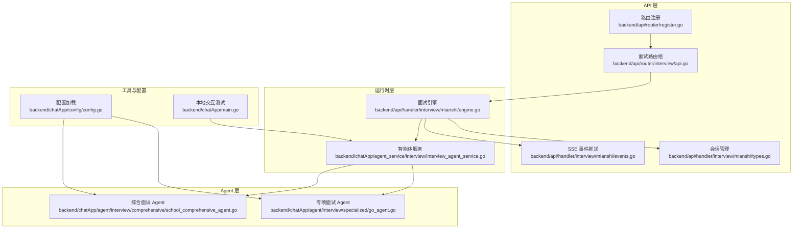
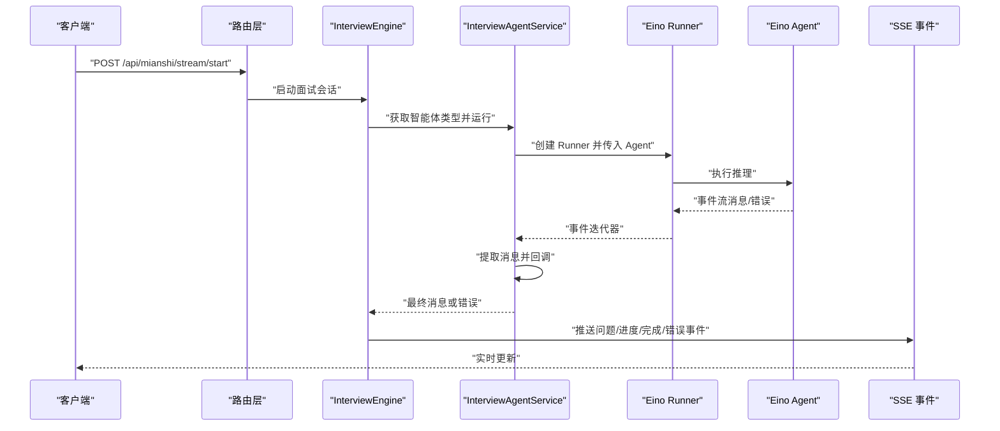
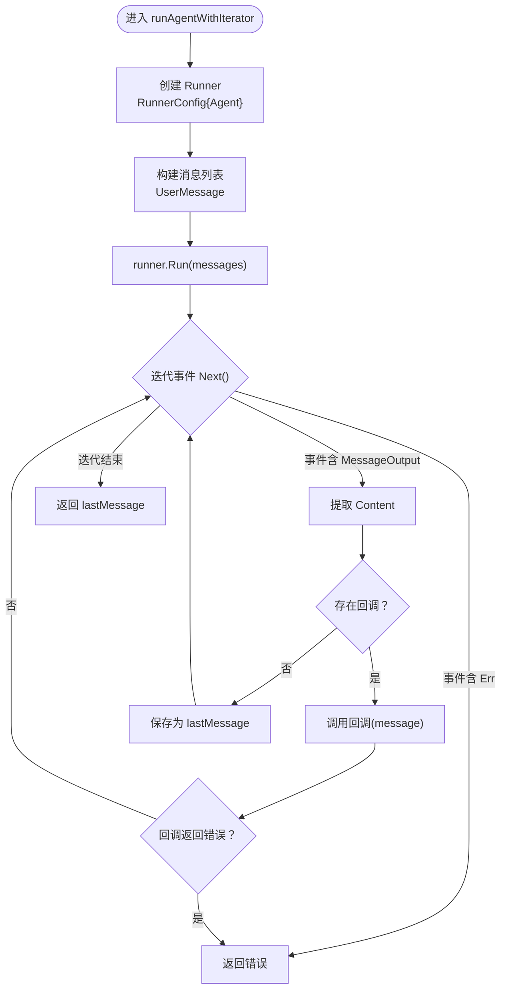
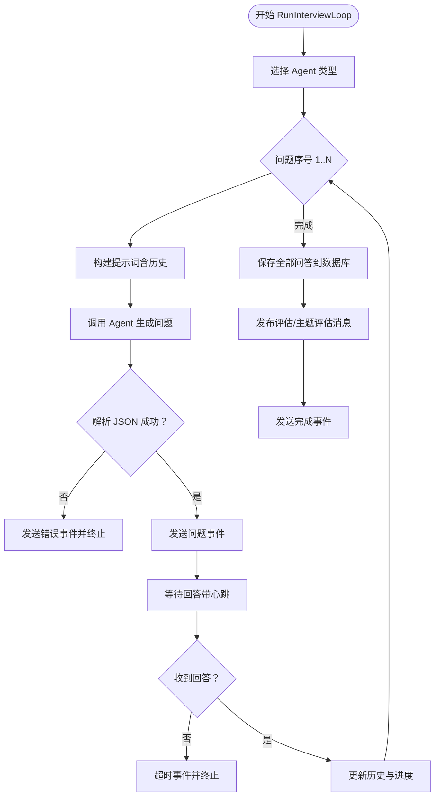
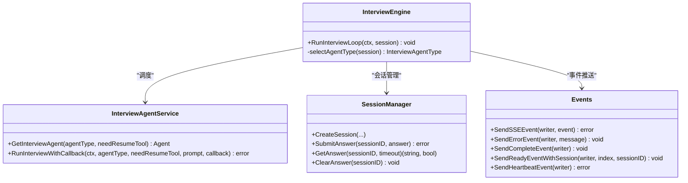
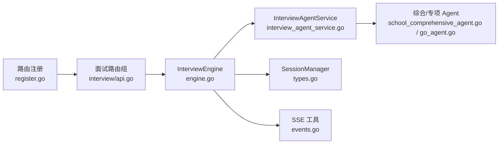

# 智能体运行时引擎

<cite>
**本文引用的文件**
- [backend/chatApp/agent_service/interview/interview_agent_service.go](file://backend/chatApp/agent_service/interview/interview_agent_service.go)
- [backend/api/handler/interview/mianshi/engine.go](file://backend/api/handler/interview/mianshi/engine.go)
- [backend/api/handler/interview/mianshi/events.go](file://backend/api/handler/interview/mianshi/events.go)
- [backend/api/handler/interview/mianshi/types.go](file://backend/api/handler/interview/mianshi/types.go)
- [backend/chatApp/agent/interview/comprehensive/school_comprehensive_agent.go](file://backend/chatApp/agent/interview/comprehensive/school_comprehensive_agent.go)
- [backend/chatApp/agent/interview/specialized/go_agent.go](file://backend/chatApp/agent/interview/specialized/go_agent.go)
- [backend/chatApp/main.go](file://backend/chatApp/main.go)
- [backend/api/router/interview/api.go](file://backend/api/router/interview/api.go)
- [backend/api/router/register.go](file://backend/api/router/register.go)
- [backend/chatApp/config/config.go](file://backend/chatApp/config/config.go)
- [doc/teach/# 面试全流程与核心控制教学.md](file://doc/teach/# 面试全流程与核心控制教学.md)
- [doc/项目优化建议_AI功能篇.md](file://doc/项目优化建议_AI功能篇.md)
- [doc/项目优化建议_性能安全篇.md](file://doc/项目优化建议_性能安全篇.md)
</cite>

## 目录
1. [简介](#简介)
2. [项目结构](#项目结构)
3. [核心组件](#核心组件)
4. [架构总览](#架构总览)
5. [详细组件分析](#详细组件分析)
6. [依赖分析](#依赖分析)
7. [性能考虑](#性能考虑)
8. [故障排查指南](#故障排查指南)
9. [结论](#结论)
10. [附录](#附录)

## 简介
本文件面向“智能体运行时引擎”的技术文档，围绕以下目标展开：
- 深入解释 runAgentWithIterator 函数的实现原理、事件循环机制与消息处理流程
- 详解 Eino 框架 Runner 的配置、Agent 执行环境与上下文管理
- 提供智能体运行时的状态监控、性能指标与调试方法
- 包含错误恢复机制、超时处理与资源释放策略
- 提供运行时引擎的扩展接口、自定义处理器与性能优化技巧

## 项目结构
该工程采用前后端分离与模块化组织方式，面试相关的核心运行时位于 backend 子树中，主要涉及：
- API 层：路由注册、SSE 事件推送、会话管理
- 运行时层：InterviewEngine 驱动面试流程；InterviewAgentService 统一调度不同类型的 Eino Agent
- Agent 层：综合/专项面试 Agent 的具体实现，封装工具链与模型配置
- 工具与配置：工具调用、模型配置加载、本地交互测试入口

图表来源
- [backend/api/router/register.go](file://backend/api/router/register.go#L11-L15)
- [backend/api/router/interview/api.go](file://backend/api/router/interview/api.go#L17-L102)
- [backend/api/handler/interview/mianshi/engine.go](file://backend/api/handler/interview/mianshi/engine.go#L24-L37)
- [backend/chatApp/agent_service/interview/interview_agent_service.go](file://backend/chatApp/agent_service/interview/interview_agent_service.go#L31-L40)
- [backend/chatApp/agent/interview/comprehensive/school_comprehensive_agent.go](file://backend/chatApp/agent/interview/comprehensive/school_comprehensive_agent.go#L16-L47)
- [backend/chatApp/agent/interview/specialized/go_agent.go](file://backend/chatApp/agent/interview/specialized/go_agent.go#L16-L47)
- [backend/api/handler/interview/mianshi/events.go](file://backend/api/handler/interview/mianshi/events.go#L11-L34)
- [backend/api/handler/interview/mianshi/types.go](file://backend/api/handler/interview/mianshi/types.go#L9-L34)
- [backend/chatApp/config/config.go](file://backend/chatApp/config/config.go#L14-L73)
- [backend/chatApp/main.go](file://backend/chatApp/main.go#L25-L123)

章节来源
- [backend/api/router/register.go](file://backend/api/router/register.go#L11-L15)
- [backend/api/router/interview/api.go](file://backend/api/router/interview/api.go#L17-L102)
- [backend/api/handler/interview/mianshi/engine.go](file://backend/api/handler/interview/mianshi/engine.go#L24-L37)
- [backend/chatApp/agent_service/interview/interview_agent_service.go](file://backend/chatApp/agent_service/interview/interview_agent_service.go#L31-L40)
- [backend/chatApp/agent/interview/comprehensive/school_comprehensive_agent.go](file://backend/chatApp/agent/interview/comprehensive/school_comprehensive_agent.go#L16-L47)
- [backend/chatApp/agent/interview/specialized/go_agent.go](file://backend/chatApp/agent/interview/specialized/go_agent.go#L16-L47)
- [backend/api/handler/interview/mianshi/events.go](file://backend/api/handler/interview/mianshi/events.go#L11-L34)
- [backend/api/handler/interview/mianshi/types.go](file://backend/api/handler/interview/mianshi/types.go#L9-L34)
- [backend/chatApp/config/config.go](file://backend/chatApp/config/config.go#L14-L73)
- [backend/chatApp/main.go](file://backend/chatApp/main.go#L25-L123)

## 核心组件
- InterviewEngine：驱动面试循环，负责问题生成、等待回答、进度与错误事件推送、会话状态维护与持久化触发
- InterviewAgentService：统一获取与运行不同类型的 Eino Agent，封装 runAgentWithIterator
- runAgentWithIterator：Eino Runner 的事件迭代器驱动，负责消息提取、回调分发与错误传播
- SessionManager：会话生命周期管理，提供答案通道、超时等待与心跳保活
- SSE 事件推送：标准事件格式输出，配合前端实时展示面试进度
- Agent 实现：综合/专项 Agent，注入工具链与模型配置，形成可插拔的执行单元

章节来源
- [backend/api/handler/interview/mianshi/engine.go](file://backend/api/handler/interview/mianshi/engine.go#L24-L37)
- [backend/chatApp/agent_service/interview/interview_agent_service.go](file://backend/chatApp/agent_service/interview/interview_agent_service.go#L31-L40)
- [backend/chatApp/agent_service/interview/interview_agent_service.go](file://backend/chatApp/agent_service/interview/interview_agent_service.go#L103-L154)
- [backend/api/handler/interview/mianshi/types.go](file://backend/api/handler/interview/mianshi/types.go#L9-L34)
- [backend/api/handler/interview/mianshi/events.go](file://backend/api/handler/interview/mianshi/events.go#L11-L34)

## 架构总览
运行时引擎以 InterviewEngine 为核心，串联 API 路由、会话管理、SSE 事件与智能体服务。InterviewAgentService 通过 Eino ADK 的 Runner 执行 Agent，并以事件迭代器消费输出，结合回调实现流式消息处理。

图表来源
- [backend/api/router/interview/api.go](file://backend/api/router/interview/api.go#L44-L46)
- [backend/api/handler/interview/mianshi/engine.go](file://backend/api/handler/interview/mianshi/engine.go#L39-L230)
- [backend/chatApp/agent_service/interview/interview_agent_service.go](file://backend/chatApp/agent_service/interview/interview_agent_service.go#L75-L101)
- [backend/chatApp/agent_service/interview/interview_agent_service.go](file://backend/chatApp/agent_service/interview/interview_agent_service.go#L113-L154)
- [backend/api/handler/interview/mianshi/events.go](file://backend/api/handler/interview/mianshi/events.go#L11-L34)

## 详细组件分析

### runAgentWithIterator 事件循环与消息处理
- Runner 配置：通过 NewRunner 创建 RunnerConfig，注入 Agent
- 消息构建：构造 UserMessage 列表，作为初始输入
- 事件迭代：runner.Run 返回迭代器，循环调用 Next 获取事件
- 错误处理：若事件携带 Err，立即返回错误
- 消息提取：从 event.Output.MessageOutput.Message.Content 提取消息片段
- 回调分发：若有回调，则在每次收到非空消息时调用回调；若回调返回错误则中断
- 返回值：无回调时返回最后一次消息；有回调时返回空串（仅用于内部收集）

图表来源
- [backend/chatApp/agent_service/interview/interview_agent_service.go](file://backend/chatApp/agent_service/interview/interview_agent_service.go#L113-L154)

章节来源
- [backend/chatApp/agent_service/interview/interview_agent_service.go](file://backend/chatApp/agent_service/interview/interview_agent_service.go#L103-L154)

### InterviewEngine 面试循环与上下文管理
- 会话类型选择：根据面试类型与领域选择具体 Agent 类型
- 历史上下文：维护最近 N 道题的问答历史，作为后续问题生成的上下文
- 问题生成：调用 InterviewAgentService.RunInterviewWithCallback 获取 JSON 格式问题
- 答案等待：使用 SessionManager.GetAnswer 在指定超时内等待用户回答，同时周期性发送心跳
- 事件推送：问题、就绪、进度、完成、错误等事件通过 SSE 推送
- 数据持久化：将所有问答对保存至数据库，完成后发布评估消息

图表来源
- [backend/api/handler/interview/mianshi/engine.go](file://backend/api/handler/interview/mianshi/engine.go#L39-L230)
- [backend/api/handler/interview/mianshi/events.go](file://backend/api/handler/interview/mianshi/events.go#L36-L50)
- [backend/api/handler/interview/mianshi/types.go](file://backend/api/handler/interview/mianshi/types.go#L109-L126)

章节来源
- [backend/api/handler/interview/mianshi/engine.go](file://backend/api/handler/interview/mianshi/engine.go#L39-L230)
- [backend/api/handler/interview/mianshi/events.go](file://backend/api/handler/interview/mianshi/events.go#L11-L72)
- [backend/api/handler/interview/mianshi/types.go](file://backend/api/handler/interview/mianshi/types.go#L9-L34)

### Agent 执行环境与上下文管理
- 综合/专项 Agent：均通过 NewChatModelAgent 创建，注入 Instruction、Model、ToolsConfig、MaxIterations 等
- 工具链注入：根据 needResumeTool 决定是否启用简历工具
- 模型配置：通过 chat.CreatOpenAiChatModel 获取模型实例，支持不同用户维度的配置
- 上下文：Agent 的上下文由 Runner 与消息列表共同决定，事件迭代器贯穿整个推理过程

图表来源
- [backend/chatApp/agent_service/interview/interview_agent_service.go](file://backend/chatApp/agent_service/interview/interview_agent_service.go#L31-L101)
- [backend/api/handler/interview/mianshi/engine.go](file://backend/api/handler/interview/mianshi/engine.go#L24-L37)
- [backend/api/handler/interview/mianshi/types.go](file://backend/api/handler/interview/mianshi/types.go#L9-L34)
- [backend/api/handler/interview/mianshi/events.go](file://backend/api/handler/interview/mianshi/events.go#L11-L72)

章节来源
- [backend/chatApp/agent/interview/comprehensive/school_comprehensive_agent.go](file://backend/chatApp/agent/interview/comprehensive/school_comprehensive_agent.go#L16-L47)
- [backend/chatApp/agent/interview/specialized/go_agent.go](file://backend/chatApp/agent/interview/specialized/go_agent.go#L16-L47)
- [backend/chatApp/agent_service/interview/interview_agent_service.go](file://backend/chatApp/agent_service/interview/interview_agent_service.go#L31-L101)

### Eino Runner 配置与上下文
- RunnerConfig：包含 Agent 字段，用于绑定具体智能体
- Runner.Run：接收消息列表，返回事件迭代器
- 上下文：通过 context 控制生命周期，支持取消与超时
- 迭代器：Next 返回事件，事件包含 Output（含 MessageOutput）或 Err

章节来源
- [backend/chatApp/agent_service/interview/interview_agent_service.go](file://backend/chatApp/agent_service/interview/interview_agent_service.go#L113-L154)
- [backend/chatApp/main.go](file://backend/chatApp/main.go#L62-L122)

## 依赖分析
- 路由注册：GeneratedRegister 将面试路由组注册到 Hertz 服务器
- 路由组：/api/mianshi 下挂载多个子路由，包括 /stream/start 等
- 引擎与服务：InterviewEngine 依赖 InterviewAgentService、SessionManager、SSE 工具
- Agent 依赖：Agent 实现依赖 chat 模型工厂与工具集合

图表来源
- [backend/api/router/register.go](file://backend/api/router/register.go#L11-L15)
- [backend/api/router/interview/api.go](file://backend/api/router/interview/api.go#L17-L102)
- [backend/api/handler/interview/mianshi/engine.go](file://backend/api/handler/interview/mianshi/engine.go#L24-L37)
- [backend/chatApp/agent_service/interview/interview_agent_service.go](file://backend/chatApp/agent_service/interview/interview_agent_service.go#L31-L101)
- [backend/api/handler/interview/mianshi/types.go](file://backend/api/handler/interview/mianshi/types.go#L9-L34)
- [backend/api/handler/interview/mianshi/events.go](file://backend/api/handler/interview/mianshi/events.go#L11-L34)
- [backend/chatApp/agent/interview/comprehensive/school_comprehensive_agent.go](file://backend/chatApp/agent/interview/comprehensive/school_comprehensive_agent.go#L16-L47)
- [backend/chatApp/agent/interview/specialized/go_agent.go](file://backend/chatApp/agent/interview/specialized/go_agent.go#L16-L47)

章节来源
- [backend/api/router/register.go](file://backend/api/router/register.go#L11-L15)
- [backend/api/router/interview/api.go](file://backend/api/router/interview/api.go#L17-L102)
- [backend/api/handler/interview/mianshi/engine.go](file://backend/api/handler/interview/mianshi/engine.go#L24-L37)
- [backend/chatApp/agent_service/interview/interview_agent_service.go](file://backend/chatApp/agent_service/interview/interview_agent_service.go#L31-L101)
- [backend/api/handler/interview/mianshi/types.go](file://backend/api/handler/interview/mianshi/types.go#L9-L34)
- [backend/api/handler/interview/mianshi/events.go](file://backend/api/handler/interview/mianshi/events.go#L11-L34)
- [backend/chatApp/agent/interview/comprehensive/school_comprehensive_agent.go](file://backend/chatApp/agent/interview/comprehensive/school_comprehensive_agent.go#L16-L47)
- [backend/chatApp/agent/interview/specialized/go_agent.go](file://backend/chatApp/agent/interview/specialized/go_agent.go#L16-L47)

## 性能考虑
- 事件缓冲与批量刷新：参考流式处理建议，可引入缓冲区与定时刷新，减少频繁写入
- 背压与丢弃策略：在高并发场景下，合理设置缓冲大小与刷新间隔，避免阻塞
- 熔断器：对外部依赖（如 LLM、工具）引入熔断器，降低级联故障风险
- 指标采集：为 Agent 调用次数、耗时、Token 使用量建立指标，辅助容量规划与性能优化

章节来源
- [doc/项目优化建议_AI功能篇.md](file://doc/项目优化建议_AI功能篇.md#L422-L518)
- [doc/项目优化建议_AI功能篇.md](file://doc/项目优化建议_AI功能篇.md#L155-L197)
- [doc/项目优化建议_性能安全篇.md](file://doc/项目优化建议_性能安全篇.md#L325-L397)

## 故障排查指南
- 事件错误传播：runAgentWithIterator 在事件含 Err 时直接返回错误，需检查 Agent 输出与回调逻辑
- SSE 写入失败：SendSSEEvent 对写入失败进行日志记录并返回错误，需关注网络波动与客户端断连
- 会话超时：WaitForAnswerWithHeartbeat 在超时后发送超时事件并终止流程，需检查客户端心跳与网络延迟
- 数据持久化：saveAllDialogues 逐条保存，出现错误时记录失败索引，便于定位问题
- 配置加载：config.yaml 缺失关键字段会导致 Agent 初始化失败，需核对配置文件

章节来源
- [backend/chatApp/agent_service/interview/interview_agent_service.go](file://backend/chatApp/agent_service/interview/interview_agent_service.go#L134-L136)
- [backend/api/handler/interview/mianshi/events.go](file://backend/api/handler/interview/mianshi/events.go#L21-L33)
- [backend/api/handler/interview/mianshi/engine.go](file://backend/api/handler/interview/mianshi/engine.go#L168-L173)
- [backend/api/handler/interview/mianshi/engine.go](file://backend/api/handler/interview/mianshi/engine.go#L234-L258)
- [backend/chatApp/config/config.go](file://backend/chatApp/config/config.go#L68-L72)

## 结论
本运行时引擎以 InterviewEngine 为核心，借助 Eino ADK 的 Runner 与事件迭代器，实现了可插拔、可观测、可扩展的智能体执行框架。通过会话管理与 SSE 事件推送，实现了面试流程的实时交互；通过 Agent 的工具链与模型配置，满足不同面试场景的需求。建议在生产环境中引入流式处理、熔断与指标体系，持续优化性能与稳定性。

## 附录
- 教学文档提供了面试全流程与核心控制的教学示例，可作为理解 InterviewEngine 的补充材料
- 本地交互测试入口展示了如何快速验证 Runner 与 Agent 的基本行为

章节来源
- [doc/teach/# 面试全流程与核心控制教学.md](file://doc/teach/# 面试全流程与核心控制教学.md#L87-L134)
- [backend/chatApp/main.go](file://backend/chatApp/main.go#L25-L123)