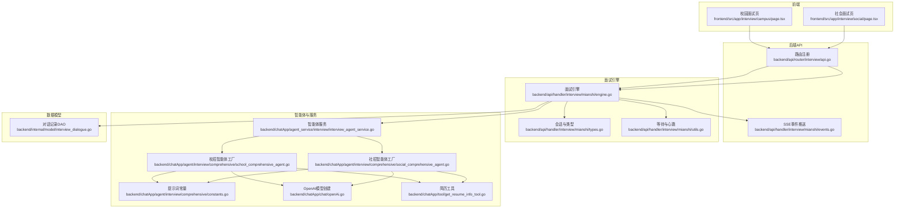
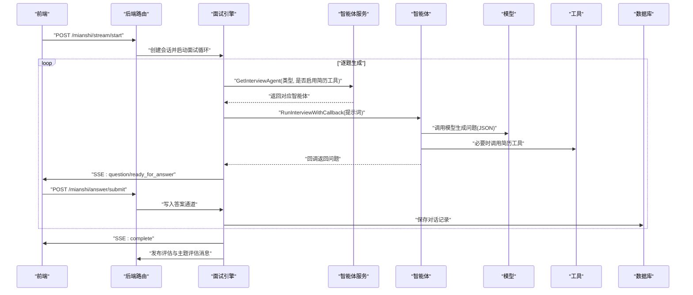
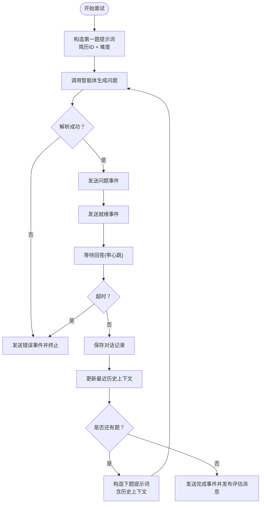
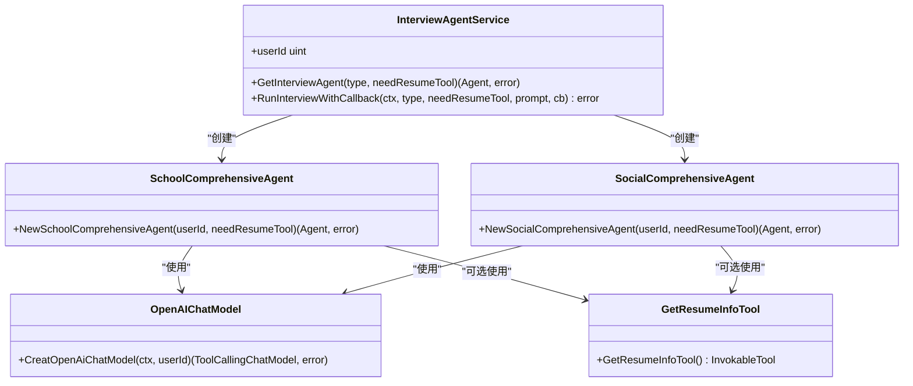

# 综合面试智能体

<cite>
**本文引用的文件**
- [backend/chatApp/agent/interview/comprehensive/school_comprehensive_agent.go](file://backend/chatApp/agent/interview/comprehensive/school_comprehensive_agent.go)
- [backend/chatApp/agent/interview/comprehensive/social_comprehensive_agent.go](file://backend/chatApp/agent/interview/comprehensive/social_comprehensive_agent.go)
- [backend/chatApp/agent/interview/comprehensive/constants.go](file://backend/chatApp/agent/interview/comprehensive/constants.go)
- [backend/chatApp/agent_service/interview/interview_agent_service.go](file://backend/chatApp/agent_service/interview/interview_agent_service.go)
- [backend/api/handler/interview/mianshi/engine.go](file://backend/api/handler/interview/mianshi/engine.go)
- [backend/api/handler/interview/mianshi/types.go](file://backend/api/handler/interview/mianshi/types.go)
- [backend/api/handler/interview/mianshi/events.go](file://backend/api/handler/interview/mianshi/events.go)
- [backend/api/handler/interview/mianshi/utils.go](file://backend/api/handler/interview/mianshi/utils.go)
- [backend/chatApp/chat/openAi.go](file://backend/chatApp/chat/openAi.go)
- [backend/chatApp/tool/get_resume_info_tool.go](file://backend/chatApp/tool/get_resume_info_tool.go)
- [backend/internal/model/interview_dialogue.go](file://backend/internal/model/interview_dialogue.go)
- [backend/api/router/interview/api.go](file://backend/api/router/interview/api.go)
- [frontend/src/app/interview/campus/page.tsx](file://frontend/src/app/interview/campus/page.tsx)
- [frontend/src/app/interview/social/page.tsx](file://frontend/src/app/interview/social/page.tsx)
</cite>

## 目录
1. [引言](#引言)
2. [项目结构](#项目结构)
3. [核心组件](#核心组件)
4. [架构总览](#架构总览)
5. [组件详解](#组件详解)
6. [依赖关系分析](#依赖关系分析)
7. [性能考量](#性能考量)
8. [故障排查指南](#故障排查指南)
9. [结论](#结论)
10. [附录](#附录)

## 引言
本文件为“综合面试智能体”的详细功能文档，聚焦校招与社招两类综合面试智能体的设计差异与适用场景，系统阐述其核心对话逻辑、面试流程控制、评分机制、提示词模板、上下文管理与状态保持策略，并给出配置参数、行为模式、扩展接口以及异常处理、超时控制与用户体验优化方案。文档同时结合后端引擎与前端交互，形成端到端的面试流程闭环。

## 项目结构
后端采用分层架构：API 层负责路由与事件推送，引擎层负责面试流程控制与状态管理，智能体层负责对话生成与工具调用，模型与工具层负责外部模型与内部工具集成。前端提供面试配置与实时流式交互界面。

图表来源
- [backend/api/router/interview/api.go](file://backend/api/router/interview/api.go#L17-L103)
- [backend/api/handler/interview/mianshi/engine.go](file://backend/api/handler/interview/mianshi/engine.go#L23-L37)
- [backend/chatApp/agent_service/interview/interview_agent_service.go](file://backend/chatApp/agent_service/interview/interview_agent_service.go#L30-L73)
- [backend/chatApp/agent/interview/comprehensive/school_comprehensive_agent.go](file://backend/chatApp/agent/interview/comprehensive/school_comprehensive_agent.go#L14-L47)
- [backend/chatApp/agent/interview/comprehensive/social_comprehensive_agent.go](file://backend/chatApp/agent/interview/comprehensive/social_comprehensive_agent.go#L14-L47)
- [backend/chatApp/agent/interview/comprehensive/constants.go](file://backend/chatApp/agent/interview/comprehensive/constants.go#L3-L95)
- [backend/chatApp/chat/openAi.go](file://backend/chatApp/chat/openAi.go#L19-L109)
- [backend/chatApp/tool/get_resume_info_tool.go](file://backend/chatApp/tool/get_resume_info_tool.go#L21-L47)
- [backend/api/handler/interview/mianshi/events.go](file://backend/api/handler/interview/mianshi/events.go#L11-L71)
- [backend/api/handler/interview/mianshi/types.go](file://backend/api/handler/interview/mianshi/types.go#L9-L50)
- [backend/api/handler/interview/mianshi/utils.go](file://backend/api/handler/interview/mianshi/utils.go#L11-L74)
- [backend/internal/model/interview_dialogue.go](file://backend/internal/model/interview_dialogue.go#L7-L27)

章节来源
- [backend/api/router/interview/api.go](file://backend/api/router/interview/api.go#L17-L103)
- [frontend/src/app/interview/campus/page.tsx](file://frontend/src/app/interview/campus/page.tsx#L32-L335)
- [frontend/src/app/interview/social/page.tsx](file://frontend/src/app/interview/social/page.tsx#L33-L334)

## 核心组件
- 校招综合面试智能体：面向应届毕业生，强调基础知识、学习潜力与职业素养，问题设计由浅入深，注重思维过程与成长性。
- 社招综合面试智能体：面向有经验工程师，强调实战经验、系统设计、技术深度与领导力，问题更具挑战性与架构导向。
- 智能体服务：统一调度不同类型的智能体，支持是否启用简历工具的动态配置。
- 面试引擎：驱动面试流程，逐题生成、等待回答、上下文回传、持久化与事件推送。
- 会话管理：维护会话状态、答案通道、超时与心跳保活。
- OpenAI 模型适配：按用户模型配置创建聊天模型，处理密钥与错误分类。
- 简历工具：按简历ID读取解析后的简历信息，注入到智能体提示词中。

章节来源
- [backend/chatApp/agent/interview/comprehensive/school_comprehensive_agent.go](file://backend/chatApp/agent/interview/comprehensive/school_comprehensive_agent.go#L14-L47)
- [backend/chatApp/agent/interview/comprehensive/social_comprehensive_agent.go](file://backend/chatApp/agent/interview/comprehensive/social_comprehensive_agent.go#L14-L47)
- [backend/chatApp/agent_service/interview/interview_agent_service.go](file://backend/chatApp/agent_service/interview/interview_agent_service.go#L30-L73)
- [backend/api/handler/interview/mianshi/engine.go](file://backend/api/handler/interview/mianshi/engine.go#L23-L37)
- [backend/api/handler/interview/mianshi/types.go](file://backend/api/handler/interview/mianshi/types.go#L9-L50)
- [backend/chatApp/chat/openAi.go](file://backend/chatApp/chat/openAi.go#L19-L109)
- [backend/chatApp/tool/get_resume_info_tool.go](file://backend/chatApp/tool/get_resume_info_tool.go#L21-L47)

## 架构总览
综合面试智能体的运行路径如下：前端发起面试配置，后端路由接收并创建会话，引擎逐题生成问题并通过智能体服务选择对应智能体，智能体调用模型与工具生成问题，前端通过 SSE 实时接收问题与状态，用户回答后引擎等待并推进下一题，最终持久化对话并触发评估任务。

图表来源
- [backend/api/router/interview/api.go](file://backend/api/router/interview/api.go#L44-L46)
- [backend/api/handler/interview/mianshi/engine.go](file://backend/api/handler/interview/mianshi/engine.go#L39-L230)
- [backend/chatApp/agent_service/interview/interview_agent_service.go](file://backend/chatApp/agent_service/interview/interview_agent_service.go#L42-L101)
- [backend/chatApp/agent/interview/comprehensive/school_comprehensive_agent.go](file://backend/chatApp/agent/interview/comprehensive/school_comprehensive_agent.go#L16-L46)
- [backend/chatApp/agent/interview/comprehensive/social_comprehensive_agent.go](file://backend/chatApp/agent/interview/comprehensive/social_comprehensive_agent.go#L16-L46)
- [backend/api/handler/interview/mianshi/events.go](file://backend/api/handler/interview/mianshi/events.go#L11-L71)
- [backend/internal/model/interview_dialogue.go](file://backend/internal/model/interview_dialogue.go#L29-L35)

## 组件详解

### 设计差异与适用场景
- 校招综合面试智能体
  - 适用对象：应届毕业生
  - 评估重点：基础知识、学习潜力、解决问题的思维方式、职业素养
  - 问题特征：从背景出发，循序渐进，覆盖多领域，鼓励开放性与示例化回答
- 社招综合面试智能体
  - 适用对象：有工作经验的工程师
  - 评估重点：实战经验、系统设计能力、技术深度、架构思想、技术决策与领导力
  - 问题特征：深入项目经验，关注架构、性能、故障处理与团队影响

章节来源
- [backend/chatApp/agent/interview/comprehensive/constants.go](file://backend/chatApp/agent/interview/comprehensive/constants.go#L3-L46)
- [backend/chatApp/agent/interview/comprehensive/constants.go](file://backend/chatApp/agent/interview/comprehensive/constants.go#L48-L95)

### 核心对话逻辑与流程控制
- 逐题生成：第一题仅携带简历ID与难度；后续题携带最近若干题的历史上下文
- 问题格式：固定返回 JSON，字段包含问题文本
- 等待回答：通过会话通道与心跳保活，超时控制与错误事件推送
- 进度与完成：SSE 推送问题、进度与完成事件，最终持久化全部对话

图表来源
- [backend/api/handler/interview/mianshi/engine.go](file://backend/api/handler/interview/mianshi/engine.go#L39-L230)
- [backend/api/handler/interview/mianshi/utils.go](file://backend/api/handler/interview/mianshi/utils.go#L11-L56)
- [backend/api/handler/interview/mianshi/events.go](file://backend/api/handler/interview/mianshi/events.go#L11-L71)

章节来源
- [backend/api/handler/interview/mianshi/engine.go](file://backend/api/handler/interview/mianshi/engine.go#L39-L230)
- [backend/api/handler/interview/mianshi/utils.go](file://backend/api/handler/interview/mianshi/utils.go#L11-L56)
- [backend/api/handler/interview/mianshi/events.go](file://backend/api/handler/interview/mianshi/events.go#L11-L71)

### 提示词模板与上下文管理
- 提示词模板：分别定义校招与社招两类智能体的指令、策略、问题方向与返回格式约束
- 上下文管理：最多保留最近若干题的历史，随后续问题一并传入，避免重复与提升连贯性
- 工具注入：若启用简历工具，则在智能体配置中注入简历信息工具，使提示词可包含简历细节

章节来源
- [backend/chatApp/agent/interview/comprehensive/constants.go](file://backend/chatApp/agent/interview/comprehensive/constants.go#L3-L95)
- [backend/chatApp/agent/interview/comprehensive/school_comprehensive_agent.go](file://backend/chatApp/agent/interview/comprehensive/school_comprehensive_agent.go#L16-L46)
- [backend/chatApp/agent/interview/comprehensive/social_comprehensive_agent.go](file://backend/chatApp/agent/interview/comprehensive/social_comprehensive_agent.go#L16-L46)
- [backend/chatApp/tool/get_resume_info_tool.go](file://backend/chatApp/tool/get_resume_info_tool.go#L21-L47)

### 状态保持与会话管理
- 会话结构：包含会话ID、用户ID、简历ID、类型、领域、难度、状态、公司与岗位、答案通道、时间戳等
- 答案通道：每个会话维护一个带缓冲的通道，保证并发安全与超时控制
- 清理与删除：每题结束后清理答案通道，会话结束时删除会话记录
- 全局管理器：单例模式，线程安全地维护会话集合

章节来源
- [backend/api/handler/interview/mianshi/types.go](file://backend/api/handler/interview/mianshi/types.go#L9-L50)
- [backend/api/handler/interview/mianshi/types.go](file://backend/api/handler/interview/mianshi/types.go#L52-L82)
- [backend/api/handler/interview/mianshi/types.go](file://backend/api/handler/interview/mianshi/types.go#L84-L149)

### 配置参数与行为模式
- 智能体类型
  - comprehensive_school：校招综合
  - comprehensive_social：社招综合
- 行为参数
  - MaxIterations：限制智能体最大迭代次数
  - needResumeTool：是否启用简历工具
- OpenAI 模型参数
  - 用户模型配置：模型名、BaseURL、加密API Key
  - 错误分类：配额不足、速率限制、上下文超限等

章节来源
- [backend/chatApp/agent_service/interview/interview_agent_service.go](file://backend/chatApp/agent_service/interview/interview_agent_service.go#L14-L28)
- [backend/chatApp/agent/interview/comprehensive/school_comprehensive_agent.go](file://backend/chatApp/agent/interview/comprehensive/school_comprehensive_agent.go#L35-L42)
- [backend/chatApp/agent/interview/comprehensive/social_comprehensive_agent.go](file://backend/chatApp/agent/interview/comprehensive/social_comprehensive_agent.go#L35-L42)
- [backend/chatApp/chat/openAi.go](file://backend/chatApp/chat/openAi.go#L19-L109)

### 扩展接口与接入方式
- 新增智能体类型：在智能体服务中新增类型常量与工厂方法映射
- 新增提示词模板：在常量文件中新增模板并在智能体工厂中引用
- 新增工具：通过工具注册机制注入到智能体配置中
- 新增事件：在事件模块中扩展事件类型与推送格式

章节来源
- [backend/chatApp/agent_service/interview/interview_agent_service.go](file://backend/chatApp/agent_service/interview/interview_agent_service.go#L42-L73)
- [backend/chatApp/agent/interview/comprehensive/constants.go](file://backend/chatApp/agent/interview/comprehensive/constants.go#L3-L95)
- [backend/chatApp/tool/get_resume_info_tool.go](file://backend/chatApp/tool/get_resume_info_tool.go#L36-L47)
- [backend/api/handler/interview/mianshi/events.go](file://backend/api/handler/interview/mianshi/events.go#L11-L71)

### 评分机制与评估流程
- 评分机制：面试引擎在面试完成后发布评估与主题评估消息，由后台任务进一步处理生成报告
- 数据持久化：每道问题与回答均持久化，便于后续分析与复盘

章节来源
- [backend/api/handler/interview/mianshi/engine.go](file://backend/api/handler/interview/mianshi/engine.go#L208-L230)
- [backend/internal/model/interview_dialogue.go](file://backend/internal/model/interview_dialogue.go#L29-L35)

## 依赖关系分析

图表来源
- [backend/chatApp/agent_service/interview/interview_agent_service.go](file://backend/chatApp/agent_service/interview/interview_agent_service.go#L30-L73)
- [backend/chatApp/agent/interview/comprehensive/school_comprehensive_agent.go](file://backend/chatApp/agent/interview/comprehensive/school_comprehensive_agent.go#L16-L46)
- [backend/chatApp/agent/interview/comprehensive/social_comprehensive_agent.go](file://backend/chatApp/agent/interview/comprehensive/social_comprehensive_agent.go#L16-L46)
- [backend/chatApp/chat/openAi.go](file://backend/chatApp/chat/openAi.go#L19-L109)
- [backend/chatApp/tool/get_resume_info_tool.go](file://backend/chatApp/tool/get_resume_info_tool.go#L36-L47)

章节来源
- [backend/chatApp/agent_service/interview/interview_agent_service.go](file://backend/chatApp/agent_service/interview/interview_agent_service.go#L30-L73)
- [backend/chatApp/agent/interview/comprehensive/school_comprehensive_agent.go](file://backend/chatApp/agent/interview/comprehensive/school_comprehensive_agent.go#L16-L46)
- [backend/chatApp/agent/interview/comprehensive/social_comprehensive_agent.go](file://backend/chatApp/agent/interview/comprehensive/social_comprehensive_agent.go#L16-L46)
- [backend/chatApp/chat/openAi.go](file://backend/chatApp/chat/openAi.go#L19-L109)
- [backend/chatApp/tool/get_resume_info_tool.go](file://backend/chatApp/tool/get_resume_info_tool.go#L36-L47)

## 性能考量
- 模型调用：禁用 KeepAlive，避免空闲连接 EOF；设置响应头超时与TLS握手超时，降低长连接带来的不确定性
- 会话通道：使用带缓冲通道，避免阻塞；超时定时器与心跳定时器分离，减少竞争
- 上下文大小：限制最近历史题数量，平衡上下文长度与性能
- 事件推送：SSE 立即 flush，保障前端实时性

章节来源
- [backend/chatApp/chat/openAi.go](file://backend/chatApp/chat/openAi.go#L64-L75)
- [backend/api/handler/interview/mianshi/utils.go](file://backend/api/handler/interview/mianshi/utils.go#L11-L56)
- [backend/api/handler/interview/mianshi/engine.go](file://backend/api/handler/interview/mianshi/engine.go#L42-L46)

## 故障排查指南
- API Key 无效或配额不足
  - 现象：创建模型失败，返回特定错误类型
  - 处理：检查用户模型配置、密钥有效性与账户余额
- 速率限制
  - 现象：请求被限流
  - 处理：降低并发或等待冷却
- 上下文过长
  - 现象：上下文超出模型限制
  - 处理：缩短输入或减少历史题数量
- 会话超时
  - 现象：前端长时间无回答，后端发送超时事件
  - 处理：检查网络与心跳保活，优化前端交互
- SSE 推送失败
  - 现象：前端未收到事件
  - 处理：检查跨域与响应头设置，确认 flush 成功

章节来源
- [backend/chatApp/chat/openAi.go](file://backend/chatApp/chat/openAi.go#L84-L106)
- [backend/api/handler/interview/mianshi/utils.go](file://backend/api/handler/interview/mianshi/utils.go#L11-L56)
- [backend/api/handler/interview/mianshi/events.go](file://backend/api/handler/interview/mianshi/events.go#L11-L71)

## 结论
综合面试智能体通过两类差异化提示词模板与统一的引擎流程，实现了对校招生与社招工程师的差异化评估。借助会话管理、SSE 实时事件与工具注入，系统在保证用户体验的同时，提供了良好的扩展性与稳定性。建议在实际部署中持续监控模型错误与会话超时，优化历史上下文长度与前端交互节奏，以获得更佳的面试体验。

## 附录
- 前端面试入口
  - 校园面试页：提供简历选择、难度等级与公司意向配置，点击开始进入面试
  - 社会面试页：提供相似配置，侧重深度与架构能力
- 后端路由
  - /mianshi/stream/start：启动面试流式会话
  - /mianshi/answer/submit：提交答案
  - /mianshi/records：查询面试记录
  - /resume/list：查询简历列表

章节来源
- [frontend/src/app/interview/campus/page.tsx](file://frontend/src/app/interview/campus/page.tsx#L268-L299)
- [frontend/src/app/interview/social/page.tsx](file://frontend/src/app/interview/social/page.tsx#L269-L296)
- [backend/api/router/interview/api.go](file://backend/api/router/interview/api.go#L44-L46)
- [backend/api/router/interview/api.go](file://backend/api/router/interview/api.go#L27-L30)